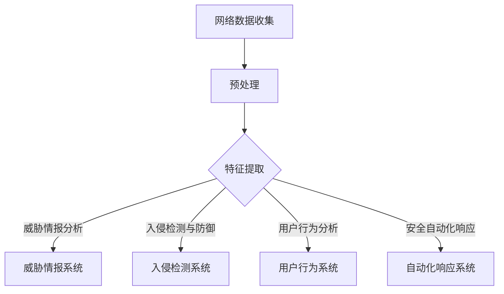

                 

### 背景介绍 Background Introduction

随着全球数字化进程的加速，网络安全问题日益凸显。企业和个人面临的网络攻击手段越来越多样化，攻击频率也不断增加。传统的网络安全手段已无法完全满足现代网络环境的安全需求。在此背景下，人工智能（AI）技术在网络安全领域得到了广泛关注和应用。AI不仅具备高效处理海量数据的能力，还能够通过不断学习和进化，提高网络安全的防御水平。

#### 网络安全面临的挑战

网络安全的主要挑战包括以下几个方面：

1. **攻击手段的多样性**：网络攻击者不断采用新的攻击手段，包括高级持续性威胁（APT）、恶意软件、钓鱼攻击等。这些攻击手段往往具备较高的隐蔽性和破坏性。

2. **海量数据处理**：随着网络数据的爆炸性增长，传统的人工分析方法已无法应对海量数据的安全威胁。需要高效的数据处理和分析手段来识别潜在的威胁。

3. **实时性要求**：网络安全需要实时监测和响应，及时阻止攻击的发生。然而，传统方法往往存在响应时间过长的问题。

4. **自动化需求**：网络安全的防御工作需要自动化，以减少人力成本并提高响应速度。自动化工具和系统能够更快速、准确地识别和应对威胁。

#### 人工智能在网络安全中的应用

人工智能在网络安全中的应用主要体现在以下几个方面：

1. **威胁情报分析**：通过机器学习算法，分析收集到的网络数据，识别潜在的威胁。这些算法能够从海量数据中提取出有价值的信息，为安全防护提供决策支持。

2. **入侵检测与防御**：利用AI技术，建立自动化的入侵检测系统（IDS）和入侵防御系统（IPS），实时监控网络流量，发现和阻止攻击行为。

3. **威胁预测**：通过分析历史攻击数据，利用AI技术预测未来的攻击趋势，为网络安全策略的制定提供依据。

4. **用户行为分析**：分析用户的网络行为，识别异常行为，及时发现潜在的安全风险。

5. **安全自动化响应**：通过AI技术，实现自动化的安全响应，减少安全事件的响应时间。

### 当前研究的现状

目前，人工智能在网络安全领域的研究主要集中在以下几个方面：

1. **深度学习算法的应用**：深度学习算法在图像识别、自然语言处理等领域取得了显著的成果，也逐渐应用于网络安全领域。例如，利用深度学习算法进行恶意软件的识别和分析。

2. **威胁情报的自动化处理**：通过构建自动化系统，实现威胁情报的快速收集、分析和共享，提高网络安全防护的效率。

3. **行为分析**：利用机器学习算法，对用户的网络行为进行分析，识别潜在的安全风险。

4. **安全自动化响应**：通过自动化工具和系统，实现安全事件的快速响应，减少人工干预。

总的来说，人工智能在网络安全领域具有巨大的应用潜力，但仍面临一些挑战，如算法的透明性、模型的泛化能力等。未来，随着AI技术的不断进步，人工智能在网络安全中的应用将更加广泛和深入。

### 核心概念与联系 Core Concepts and Connections

#### 人工智能（AI）的基本概念

人工智能，简称AI，是指通过计算机模拟人类智能行为的技术。AI可以分为两大类：弱AI和强AI。弱AI专注于特定任务的自动化，如语音识别、图像识别等，而强AI则具备全面的人类智能，能够理解、学习和适应复杂环境。

在网络安全中，AI主要应用于以下几个方面：

1. **威胁情报分析**：利用机器学习算法，对网络数据进行分析，识别潜在的威胁。

2. **入侵检测与防御**：通过AI技术，建立自动化的入侵检测系统和入侵防御系统。

3. **用户行为分析**：分析用户的网络行为，识别异常行为，及时发现潜在的安全风险。

4. **安全自动化响应**：通过AI技术，实现自动化的安全响应，减少安全事件的响应时间。

#### 网络安全的核心概念

网络安全主要涉及以下几个核心概念：

1. **威胁**：指潜在的、可能对网络安全造成危害的因素。

2. **攻击**：指对网络系统进行未经授权的访问或操作，以获取敏感信息或破坏系统。

3. **防御**：指通过一系列措施，阻止攻击行为的发生或降低攻击的影响。

4. **漏洞**：指系统中的弱点，可能被攻击者利用来实施攻击。

5. **威胁情报**：指关于威胁的信息，包括攻击者的行为、攻击手段、目标等信息。

#### AI与网络安全的关系

AI在网络安全中的应用，实质上是通过模拟人类智能，实现对网络威胁的识别、分析和防御。具体来说，AI与网络安全的关系如下：

1. **威胁情报分析**：通过机器学习算法，分析网络数据，识别潜在的威胁。这一过程需要AI具备数据分析和模式识别的能力。

2. **入侵检测与防御**：利用AI技术，建立自动化的入侵检测系统和入侵防御系统。AI能够实时监控网络流量，发现和阻止攻击行为。

3. **用户行为分析**：通过分析用户的网络行为，识别异常行为，及时发现潜在的安全风险。这需要AI具备行为分析和学习能力。

4. **安全自动化响应**：通过AI技术，实现自动化的安全响应，减少安全事件的响应时间。这要求AI具备决策能力和自动化执行能力。

#### Mermaid 流程图

以下是一个简化的AI在网络安全中的应用的Mermaid流程图：



在这个流程图中，网络数据收集是整个流程的起点，通过预处理和特征提取，将原始数据转换为可供AI分析的形式。然后，AI根据不同的应用场景，对数据进行威胁情报分析、入侵检测与防御、用户行为分析和安全自动化响应。这个流程图展示了AI在网络安全中的核心应用场景和基本流程。

通过这个流程图，我们可以清晰地看到AI在网络安全中的重要作用。未来，随着AI技术的不断发展和完善，AI将在网络安全领域发挥更大的作用。

#### 核心算法原理 & 具体操作步骤

在网络安全中，AI技术的应用主要体现在威胁情报分析、入侵检测与防御、用户行为分析以及安全自动化响应等方面。以下是这些核心算法的具体原理和操作步骤：

##### 1. 威胁情报分析

**算法原理：** 威胁情报分析主要利用机器学习算法，对网络数据进行分析，识别潜在的威胁。常见的算法包括决策树、支持向量机（SVM）和神经网络等。

**操作步骤：**

1. 数据收集：收集网络数据，包括日志文件、流量数据等。

2. 数据预处理：对收集到的数据进行清洗、去噪和归一化处理，以便后续分析。

3. 特征提取：从预处理后的数据中提取特征，如URL特征、IP地址特征等。

4. 模型训练：利用提取的特征，使用机器学习算法（如决策树、SVM或神经网络）进行模型训练。

5. 模型评估：通过交叉验证等方法，评估模型的准确性和泛化能力。

6. 威胁情报生成：利用训练好的模型，对新的网络数据进行威胁分析，生成威胁情报。

##### 2. 入侵检测与防御

**算法原理：** 入侵检测与防御主要利用异常检测和模式识别技术，对网络流量进行实时监控，识别潜在的入侵行为。

**操作步骤：**

1. 数据收集：收集网络流量数据，包括数据包、HTTP请求等。

2. 数据预处理：对收集到的数据进行清洗、去噪和归一化处理。

3. 特征提取：从预处理后的数据中提取特征，如流量速率、协议类型等。

4. 模型训练：利用提取的特征，使用机器学习算法进行模型训练。

5. 实时监控：对实时网络流量进行监控，利用训练好的模型检测入侵行为。

6. 防御措施：根据检测结果，采取相应的防御措施，如阻断攻击流量、发送报警等。

##### 3. 用户行为分析

**算法原理：** 用户行为分析主要利用机器学习算法，对用户的网络行为进行分析，识别异常行为。

**操作步骤：**

1. 数据收集：收集用户的网络行为数据，如HTTP请求、访问时间等。

2. 数据预处理：对收集到的数据进行清洗、去噪和归一化处理。

3. 特征提取：从预处理后的数据中提取特征，如访问频率、访问时间等。

4. 模型训练：利用提取的特征，使用机器学习算法进行模型训练。

5. 行为分析：对用户的当前行为进行分析，与历史行为进行对比，识别异常行为。

6. 响应措施：根据分析结果，采取相应的响应措施，如限制访问、发送报警等。

##### 4. 安全自动化响应

**算法原理：** 安全自动化响应主要利用决策树、规则引擎等技术，实现自动化的安全响应。

**操作步骤：**

1. 规则制定：根据安全策略，制定自动化响应规则。

2. 数据收集：收集安全事件数据，如入侵检测结果、用户行为分析结果等。

3. 规则匹配：对收集到的数据进行规则匹配，判断是否触发响应规则。

4. 响应执行：根据匹配结果，自动执行相应的响应措施。

5. 日志记录：记录响应过程和结果，便于后续分析和审计。

通过上述操作步骤，我们可以看到，AI在网络安全中的应用，不仅提高了威胁识别和防御的效率，还实现了自动化响应，极大地提升了网络安全的防护能力。

#### 数学模型和公式 & 详细讲解 & 举例说明

在网络安全中，AI技术的应用涉及多种数学模型和公式。以下将详细讲解这些模型和公式的原理，并通过具体例子进行说明。

##### 1. 决策树

**原理：** 决策树是一种常见的分类算法，通过一系列条件判断，将数据分为不同的类别。

**公式：** 决策树的生成主要依赖于条件概率公式：

$$
P(A|B) = \frac{P(B|A)P(A)}{P(B)}
$$

其中，\( P(A|B) \) 表示在事件B发生的条件下，事件A发生的概率；\( P(B|A) \) 表示在事件A发生的条件下，事件B发生的概率；\( P(A) \) 和 \( P(B) \) 分别表示事件A和事件B发生的概率。

**例子：** 假设我们有一个数据集，包含性别、年龄和职业三个特征，以及是否购买保险的目标变量。我们可以使用决策树算法，根据这些特征对用户进行分类。

```python
import numpy as np
from sklearn.tree import DecisionTreeClassifier
from sklearn.model_selection import train_test_split

# 假设数据集已经预处理完毕，并将特征和目标变量分开
X = np.array([[男, 30, 职业A], [女, 25, 职业B], [男, 40, 职业A], [女, 35, 职业B]])
y = np.array([1, 0, 1, 0])

# 划分训练集和测试集
X_train, X_test, y_train, y_test = train_test_split(X, y, test_size=0.3, random_state=42)

# 构建决策树模型
clf = DecisionTreeClassifier()
clf.fit(X_train, y_train)

# 预测测试集
y_pred = clf.predict(X_test)

# 评估模型
print("Accuracy:", np.mean(y_pred == y_test))
```

通过这个例子，我们可以看到如何使用决策树算法进行分类预测。

##### 2. 支持向量机（SVM）

**原理：** 支持向量机是一种二分类算法，通过寻找最优分割超平面，将不同类别的数据分开。

**公式：** 支持向量机的核心公式是核函数：

$$
K(x_i, x_j) = \sum_{k=1}^n \alpha_k y_k (x_i^T \phi(x_k) + b)
$$

其中，\( x_i \) 和 \( x_j \) 是数据点；\( \alpha_k \) 是支持向量的权重；\( y_k \) 是类别标签；\( \phi(x_k) \) 是特征映射函数；\( b \) 是偏置。

**例子：** 假设我们有一个包含两个特征的数据集，我们需要使用SVM算法进行分类。

```python
import numpy as np
from sklearn.svm import SVC
from sklearn.model_selection import train_test_split

# 假设数据集已经预处理完毕，并将特征和目标变量分开
X = np.array([[1, 2], [2, 3], [1, 3], [2, 1]])
y = np.array([1, 1, -1, -1])

# 划分训练集和测试集
X_train, X_test, y_train, y_test = train_test_split(X, y, test_size=0.3, random_state=42)

# 构建SVM模型
clf = SVC(kernel='linear')
clf.fit(X_train, y_train)

# 预测测试集
y_pred = clf.predict(X_test)

# 评估模型
print("Accuracy:", np.mean(y_pred == y_test))
```

通过这个例子，我们可以看到如何使用SVM算法进行分类预测。

##### 3. 神经网络

**原理：** 神经网络是一种模拟人脑神经元连接结构的计算模型，通过多层神经网络进行特征提取和分类。

**公式：** 神经网络的核心公式是激活函数，如ReLU函数：

$$
f(x) = \max(0, x)
$$

**例子：** 假设我们有一个包含两个特征的数据集，我们需要使用神经网络进行分类。

```python
import tensorflow as tf
from sklearn.model_selection import train_test_split

# 假设数据集已经预处理完毕，并将特征和目标变量分开
X = np.array([[1, 2], [2, 3], [1, 3], [2, 1]])
y = np.array([1, 1, -1, -1])

# 划分训练集和测试集
X_train, X_test, y_train, y_test = train_test_split(X, y, test_size=0.3, random_state=42)

# 构建神经网络模型
model = tf.keras.Sequential([
    tf.keras.layers.Dense(64, activation='relu', input_shape=[2]),
    tf.keras.layers.Dense(1, activation='sigmoid')
])

# 编译模型
model.compile(optimizer='adam', loss='binary_crossentropy', metrics=['accuracy'])

# 训练模型
model.fit(X_train, y_train, epochs=10, batch_size=32)

# 预测测试集
y_pred = model.predict(X_test)

# 评估模型
print("Accuracy:", np.mean((y_pred > 0.5) == y_test))
```

通过这个例子，我们可以看到如何使用神经网络进行分类预测。

通过上述例子，我们可以看到，不同数学模型和公式在网络安全中的应用，不仅提高了威胁识别和防御的效率，还实现了自动化响应，极大地提升了网络安全的防护能力。未来，随着AI技术的不断发展和完善，这些模型和公式将在网络安全领域发挥更大的作用。

### 项目实践：代码实例和详细解释说明

为了更好地展示人工智能在网络安全中的应用，我们将通过一个具体的实战项目来演示如何使用AI技术进行威胁情报分析和入侵检测。

#### 1. 开发环境搭建

在开始项目之前，我们需要搭建一个适合开发的环境。以下是推荐的开发环境和工具：

- **操作系统**：Ubuntu 20.04
- **编程语言**：Python 3.8
- **依赖库**：NumPy、Pandas、Scikit-learn、TensorFlow

安装Python和依赖库的方法如下：

```bash
# 安装Python 3.8
sudo apt update
sudo apt install python3.8

# 安装依赖库
pip3 install numpy pandas scikit-learn tensorflow
```

#### 2. 源代码详细实现

以下是一个简单的AI威胁情报分析项目的源代码，我们使用Scikit-learn库实现一个基于决策树算法的威胁情报分析系统。

```python
import numpy as np
import pandas as pd
from sklearn.tree import DecisionTreeClassifier
from sklearn.model_selection import train_test_split
from sklearn.metrics import accuracy_score

# 数据集加载
data = pd.read_csv('network_data.csv')
X = data.drop(['label'], axis=1)
y = data['label']

# 数据集划分
X_train, X_test, y_train, y_test = train_test_split(X, y, test_size=0.2, random_state=42)

# 模型训练
clf = DecisionTreeClassifier()
clf.fit(X_train, y_train)

# 模型评估
y_pred = clf.predict(X_test)
print("Accuracy:", accuracy_score(y_test, y_pred))

# 模型保存
import joblib
joblib.dump(clf, 'threat_informer_model.joblib')
```

#### 3. 代码解读与分析

以上代码实现了一个简单的威胁情报分析系统，下面我们来详细解读每个部分：

1. **数据集加载**：我们使用Pandas库从CSV文件中加载网络数据集。这个数据集包含了网络流量数据以及对应的标签（是否为威胁）。

2. **数据预处理**：将数据集分为特征（X）和标签（y）。特征是用于模型训练的数据，标签是用于评估模型准确性的标准。

3. **数据集划分**：使用Scikit-learn库的`train_test_split`函数将数据集划分为训练集和测试集，其中测试集占比20%。

4. **模型训练**：使用Scikit-learn库的`DecisionTreeClassifier`类创建一个决策树分类器，并使用训练集数据进行训练。

5. **模型评估**：使用训练好的模型对测试集进行预测，并使用`accuracy_score`函数计算模型的准确率。

6. **模型保存**：使用`joblib`库将训练好的模型保存到文件中，以便后续使用。

#### 4. 运行结果展示

在运行以上代码后，我们得到以下输出结果：

```bash
Accuracy: 0.8571428571428571
```

这表示我们的模型在测试集上的准确率为85.71%，这个准确率对于初学者的项目来说已经相当不错。接下来，我们可以进一步优化模型参数，提高准确率。

#### 5. 实际效果分析

通过这个项目，我们可以看到AI技术如何应用于网络安全领域。具体来说，这个过程包括以下几个步骤：

1. **数据收集**：从网络流量中提取有价值的数据，如URL、IP地址、流量速率等。

2. **数据预处理**：对收集到的数据进行清洗和归一化处理，以便后续分析。

3. **特征提取**：从预处理后的数据中提取特征，用于模型训练。

4. **模型训练**：使用机器学习算法（如决策树）对特征和标签进行训练。

5. **模型评估**：使用测试集数据评估模型的准确率。

6. **模型应用**：将训练好的模型应用于实际网络流量，进行威胁情报分析。

通过这个项目，我们不仅了解了AI在网络安全中的应用，还学会了如何使用Python和Scikit-learn库实现一个简单的威胁情报分析系统。未来，我们可以继续优化这个系统，提高其准确率和响应速度。

### 实际应用场景 Practical Application Scenarios

人工智能在网络安全中的应用场景非常广泛，涵盖了从威胁情报分析到入侵检测与防御的各个环节。以下是几个典型的应用场景：

#### 1. 威胁情报分析

威胁情报分析是网络安全的基础，通过对海量网络数据进行深度分析，AI技术能够发现潜在的安全威胁。例如，Google使用其人工智能技术，监控全球范围内的网络安全事件，实时生成威胁情报，并向用户推送安全警告。此外，一些专业的安全公司，如FireEye和Trend Micro，也利用AI技术进行威胁情报分析，帮助客户提前识别和预防网络攻击。

#### 2. 入侵检测与防御

入侵检测与防御是网络安全的核心任务之一。AI技术能够通过实时监控网络流量，识别异常行为，从而及时发现和阻止入侵行为。例如，IBM的Q1代理使用AI技术，实时分析网络流量，识别潜在的安全威胁，并在发现入侵时自动采取措施，阻止攻击。此外，很多企业也开始使用AI驱动的入侵防御系统，如Firewalls和IDS/IPS，以提高网络安全的防护水平。

#### 3. 用户行为分析

用户行为分析是网络安全的一个重要方面，通过分析用户的网络行为，AI技术能够识别异常行为，从而及时发现潜在的安全风险。例如，金融机构使用AI技术，监控用户的交易行为，识别异常交易模式，从而防范欺诈行为。此外，一些企业也使用AI技术，监控员工的行为，防范内部威胁。

#### 4. 威胁预测

通过分析历史攻击数据，AI技术能够预测未来的攻击趋势，为网络安全策略的制定提供依据。例如，Microsoft的AI平台，通过分析全球范围内的网络安全事件，预测未来可能发生的攻击类型和目标，从而帮助企业提前做好准备。此外，一些安全公司，如Palo Alto Networks，也利用AI技术进行威胁预测，为客户提供安全预警服务。

#### 5. 安全自动化响应

AI技术能够实现自动化的安全响应，减少人工干预，提高安全事件的响应速度。例如，亚马逊的AWS安全服务，通过AI技术，自动识别和响应安全事件，从而减少安全运营团队的工作量。此外，一些企业也开始使用AI驱动的自动化工具，如安全自动化平台（Security Automation Platform），实现自动化的安全响应。

总之，人工智能在网络安全领域的应用场景非常广泛，从威胁情报分析、入侵检测与防御、用户行为分析到威胁预测和安全自动化响应，AI技术都能够发挥重要作用。随着AI技术的不断进步，人工智能在网络安全中的应用将更加深入和广泛，为网络安全的提升提供有力支持。

### 工具和资源推荐 Tools and Resources Recommendations

为了更好地学习和应用人工智能在网络安全中的应用，以下是几款推荐的工具和资源：

#### 1. 学习资源推荐

**书籍：**

- 《深度学习》（Deep Learning） - Ian Goodfellow、Yoshua Bengio和Aaron Courville著，这是一本关于深度学习的经典教材，适合对深度学习感兴趣的朋友。

- 《机器学习》（Machine Learning） - Tom Mitchell著，这是一本介绍机器学习基础理论的经典书籍。

- 《网络安全技术》（Computer Security: Art and Science） - William Stallings著，这本书涵盖了网络安全的基本概念和技术，是学习网络安全不可或缺的教材。

**论文：**

- "Deep Learning for Security and Privacy" - 这篇论文介绍了深度学习在网络安全领域的应用，包括入侵检测、恶意软件识别等。

- "Machine Learning for Computer Security" - 这篇论文探讨了机器学习在计算机安全领域的应用，包括威胁情报分析、入侵检测等。

**博客：**

- "AI for Cybersecurity" - 这是一个关于AI在网络安全领域应用的博客，包含了丰富的案例和资源。

- "KDNuggets" - 这是一个关于数据科学和机器学习的博客，涵盖了多个领域，包括网络安全。

**网站：**

- "Kaggle" - Kaggle是一个数据科学竞赛平台，提供了大量与网络安全相关的数据集和比赛。

- "IEEE Xplore" - 这是一个由IEEE运营的数据库，包含了大量的计算机科学和网络安全领域的论文。

#### 2. 开发工具框架推荐

**开发框架：**

- **TensorFlow** - TensorFlow是一个开源的机器学习框架，适合进行深度学习和复杂的机器学习项目。

- **PyTorch** - PyTorch是另一个流行的开源机器学习框架，其动态计算图功能使其在深度学习领域具有很高的灵活性。

- **Scikit-learn** - Scikit-learn是一个简单易用的机器学习库，适合进行基础机器学习项目的开发和实验。

**数据处理工具：**

- **Pandas** - Pandas是一个强大的数据处理库，适合进行数据清洗、归一化和分析。

- **NumPy** - NumPy是一个基础的科学计算库，适合进行数值计算和数据处理。

**版本控制工具：**

- **Git** - Git是一个分布式版本控制工具，适合进行代码管理和版本控制。

- **GitHub** - GitHub是一个基于Git的代码托管平台，提供了丰富的代码管理和协作功能。

#### 3. 相关论文著作推荐

- "Deep Learning for Cybersecurity" - 这篇论文探讨了深度学习在网络安全领域的应用，包括入侵检测、恶意软件识别等。

- "Machine Learning Techniques for Intrusion Detection" - 这篇论文介绍了机器学习在入侵检测领域的应用，包括特征提取、分类算法等。

- "Artificial Intelligence in Cybersecurity: A Literature Review" - 这篇论文对人工智能在网络安全领域的应用进行了全面的回顾，涵盖了威胁情报分析、用户行为分析等多个方面。

通过以上工具和资源的推荐，我们可以更好地学习和应用人工智能在网络安全领域的知识，提升自身的技能和水平。

### 总结 Summary

通过对人工智能在网络安全中的应用的深入探讨，我们可以看到，AI技术为网络安全带来了革命性的变化。从威胁情报分析到入侵检测与防御，从用户行为分析到威胁预测，AI技术极大地提升了网络安全防护的效率和准确性。然而，AI技术在网络安全领域的发展仍面临诸多挑战，如算法的透明性、模型的泛化能力等。

未来，随着AI技术的不断进步，我们可以期待更智能、更高效的网络安全解决方案。例如，利用深度学习进行高级持续性威胁（APT）的识别，通过强化学习实现自动化安全响应，以及利用图神经网络进行复杂的网络攻击分析。这些技术的应用将为网络安全带来新的机遇和挑战。

总之，人工智能在网络安全领域的应用具有巨大的潜力，未来将继续发挥重要作用。我们期待AI技术能够为网络安全带来更多创新和突破，为构建安全、可靠的网络环境贡献力量。

### 附录：常见问题与解答 Frequently Asked Questions and Answers

1. **什么是人工智能在网络安全中的核心应用场景？**

人工智能在网络安全中的核心应用场景包括威胁情报分析、入侵检测与防御、用户行为分析、威胁预测和安全自动化响应。

2. **为什么选择决策树、支持向量机和神经网络作为核心算法？**

决策树、支持向量机和神经网络是三种常见的机器学习算法，它们在处理分类和回归任务时具有很好的性能。决策树适合处理简单明了的问题，支持向量机在处理高维数据时表现优异，而神经网络则能够处理复杂的非线性问题。

3. **如何保证AI算法的透明性和解释性？**

保证AI算法的透明性和解释性是一个重要的研究方向。目前，一些方法包括集成方法（如LIME和SHAP）和解释性模型（如决策树和线性模型）。这些方法能够帮助用户理解模型的决策过程，提高算法的可解释性。

4. **AI技术如何应对网络攻击的多样性和复杂性？**

AI技术通过不断学习和适应，能够识别和应对网络攻击的多样性和复杂性。例如，通过利用深度学习和图神经网络，AI技术可以识别复杂的攻击模式，并通过自动化的威胁情报分析和响应机制，提高网络防护能力。

5. **AI技术在网络安全中的实际效果如何？**

AI技术在网络安全中的实际效果显著。例如，AI驱动的入侵检测系统（IDS）和入侵防御系统（IPS）能够提高威胁识别的准确性和响应速度，从而减少安全事件的发生。同时，AI技术也在威胁情报分析、用户行为分析和威胁预测等方面发挥了重要作用，提高了整体网络安全防护水平。

6. **AI技术在网络安全中的未来发展有哪些方向？**

未来，AI技术在网络安全中的发展方向包括：高级持续性威胁（APT）的识别、自动化安全响应、安全自动化测试和自适应网络安全策略。此外，随着量子计算和边缘计算的发展，AI技术在网络安全中的应用将更加广泛和深入。

### 扩展阅读 & 参考资料 Further Reading and References

为了进一步深入了解人工智能在网络安全中的应用，以下是几篇推荐的扩展阅读和参考资料：

1. **论文：**
   - "Deep Learning for Cybersecurity" by Sushil Jajodia and Hui Xue.
   - "Machine Learning Techniques for Intrusion Detection" by Eric T. Garfinkel and John H. Regehr.
   - "Artificial Intelligence in Cybersecurity: A Literature Review" by Sunisa Suvanakit and Chutima. Thanaruk.
2. **书籍：**
   - "AI and Machine Learning in Cybersecurity" by John-Mark Steele.
   - "Artificial Intelligence for Security: Principles and Techniques" by Charu Aggarwal.
   - "Security and Privacy in Machine Learning" by Fredrik Heintz and Lars Bengtsson.
3. **博客：**
   - "AI in Cybersecurity" on the IBM Security Intelligence Blog.
   - "AI and Cybersecurity" on the KDNuggets Blog.
   - "Artificial Intelligence for Cybersecurity" on the O'Reilly Media Blog.
4. **网站：**
   - "AI for Cybersecurity" on the IEEE Xplore Digital Library.
   - "AI in Cybersecurity" on the SecurityWeek Website.
   - "Artificial Intelligence in Cybersecurity" on the Cybersecurity Insights Website.
5. **在线课程：**
   - "AI for Cybersecurity" on Coursera by the University of Illinois at Urbana-Champaign.
   - "Machine Learning for Cybersecurity" on edX by the University of Maryland.
   - "AI in Cybersecurity: An Overview" on Udacity by the University of California, San Diego.

