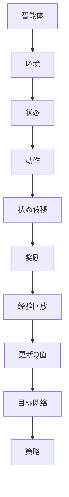

                 

### 一切皆是映射：DQN中的目标网络：为什么它是必要的？

> 关键词：深度学习、DQN、目标网络、映射、必要、算法原理

> 摘要：本文将深入探讨深度Q网络（DQN）中的目标网络概念，解释其为何不可或缺。通过逐步分析DQN的核心概念、目标网络的作用及其对学习效率的显著影响，我们将揭示DQN在强化学习中的关键机制。

## 1. 背景介绍

在人工智能领域，强化学习（Reinforcement Learning，RL）是一种旨在通过试错来学习如何在环境中做出最优决策的方法。强化学习的一个重要应用场景是智能体在不确定环境中进行自主决策，以最大化长期回报。深度Q网络（Deep Q-Network，DQN）是强化学习中的一种著名算法，它通过神经网络来近似Q值函数，从而实现智能体的决策。

DQN的核心思想是利用经验回放（Experience Replay）和目标网络（Target Network）来稳定训练过程。本文将重点关注目标网络的概念、作用及其在DQN中的重要性。

### 1.1 强化学习的基本概念

强化学习由智能体（agent）、环境（environment）、动作（action）、状态（state）和奖励（reward）五大要素构成。智能体在环境中执行动作，环境根据动作给出状态转移和奖励。智能体的目标是学习一个策略（policy），该策略指导智能体如何选择动作以最大化长期回报。

### 1.2 DQN的基本原理

DQN是一种基于神经网络的Q学习算法。Q学习是一种基于价值函数的强化学习方法，其目标是学习一个Q值函数，该函数能够预测智能体在某个状态下执行某个动作的长期回报。DQN通过使用深度神经网络（DNN）来近似Q值函数，从而避免了传统Q学习算法中的值函数近似问题。

## 2. 核心概念与联系

在DQN中，核心概念包括Q值函数、经验回放、目标网络等。为了更好地理解这些概念之间的联系，我们使用Mermaid流程图来展示它们的工作流程。



### 2.1 Q值函数

Q值函数是一个预测函数，它给出了智能体在某个状态下执行某个动作的期望回报。在DQN中，Q值函数被表示为一个深度神经网络。通过训练，这个神经网络可以学会预测智能体在不同状态下执行不同动作的Q值。

### 2.2 经验回放

经验回放是一种用于稳定训练过程的技术。它通过将智能体在训练过程中经历的经验（状态、动作、奖励、下一状态）存储在经验池中，并在训练过程中随机采样经验来更新Q值函数。经验回放的作用是减少训练过程中的偏差，提高训练的稳定性。

### 2.3 目标网络

目标网络是一个用于稳定DQN训练过程的辅助网络。目标网络的作用是提供稳定的Q值估计，以便智能体能够更好地学习策略。具体来说，目标网络会定期从主网络复制权重，并使用这些权重来计算目标Q值。目标Q值是智能体在下一个状态下执行最优动作的期望回报。

## 3. 核心算法原理 & 具体操作步骤

### 3.1 Q值函数的近似

DQN通过一个深度神经网络来近似Q值函数。这个神经网络通常使用ReLU激活函数和全连接层来构建。神经网络的输入是当前状态，输出是每个可能动作的Q值。通过反向传播和梯度下降算法，我们可以训练这个神经网络，使其能够近似Q值函数。

### 3.2 经验回放

经验回放的操作步骤如下：

1. 初始化经验池。
2. 在训练过程中，将智能体经历的经验（状态、动作、奖励、下一状态）存储到经验池中。
3. 当训练神经网络时，从经验池中随机采样一批经验，并使用这些经验来更新Q值函数。

### 3.3 目标网络的更新

目标网络的更新操作步骤如下：

1. 定期从主网络复制权重到目标网络。
2. 使用目标网络的权重来计算目标Q值。
3. 使用目标Q值和当前状态来更新Q值函数。

### 3.4 策略的迭代

策略的迭代操作步骤如下：

1. 使用训练好的Q值函数来选择动作。
2. 执行动作，并观察状态转移和奖励。
3. 根据状态转移和奖励来更新经验池和Q值函数。

## 4. 数学模型和公式 & 详细讲解 & 举例说明

### 4.1 Q值函数的数学模型

Q值函数的数学模型可以表示为：

$$Q(s, a) = \sum_{i=1}^{n} \alpha_i \cdot Q_i(s, a)$$

其中，$Q(s, a)$是智能体在状态$s$下执行动作$a$的Q值，$\alpha_i$是神经网络的权重，$Q_i(s, a)$是神经网络对Q值的预测。

### 4.2 经验回放的数学模型

经验回放的数学模型可以表示为：

$$x_t = (s_t, a_t, r_t, s_{t+1})$$

其中，$x_t$是第$t$次经历的经验，$s_t$是状态，$a_t$是动作，$r_t$是奖励，$s_{t+1}$是下一状态。

### 4.3 目标网络的更新

目标网络的更新可以通过以下公式表示：

$$\theta_{\text{target}} = \tau \cdot \theta_{\text{main}} + (1 - \tau) \cdot \theta_{\text{target}}$$

其中，$\theta_{\text{main}}$是主网络的权重，$\theta_{\text{target}}$是目标网络的权重，$\tau$是更新频率。

### 4.4 举例说明

假设智能体在状态$s_0$下执行动作$a_0$，得到奖励$r_0$，并转移到状态$s_1$。使用DQN算法，我们可以更新Q值函数和目标网络。

首先，我们计算当前Q值：

$$Q(s_0, a_0) = \sum_{i=1}^{n} \alpha_i \cdot Q_i(s_0, a_0)$$

然后，我们计算目标Q值：

$$Q(s_1, a_1) = \max_{a_1} \sum_{i=1}^{n} \alpha_i \cdot Q_i(s_1, a_1)$$

接下来，我们更新Q值函数：

$$\theta_{\text{main}} = \theta_{\text{main}} - \alpha \cdot \nabla_{\theta_{\text{main}}} Q(s_0, a_0)$$

最后，我们更新目标网络：

$$\theta_{\text{target}} = \tau \cdot \theta_{\text{main}} + (1 - \tau) \cdot \theta_{\text{target}}$$

通过以上步骤，我们就可以使用DQN算法来训练智能体，使其在环境中进行自主决策。

## 5. 项目实践：代码实例和详细解释说明

### 5.1 开发环境搭建

为了演示DQN算法，我们需要搭建一个Python开发环境。以下是搭建步骤：

1. 安装Python 3.6及以上版本。
2. 安装TensorFlow库。

```bash
pip install tensorflow
```

### 5.2 源代码详细实现

以下是DQN算法的源代码实现：

```python
import tensorflow as tf
import numpy as np
import random

# 初始化参数
learning_rate = 0.001
discount_factor = 0.99
epsilon = 0.1
epsilon_min = 0.01
epsilon_decay = 0.995
batch_size = 32
update_target_freq = 1000

# 创建Q网络
def create_q_network(input_shape):
    model = tf.keras.Sequential([
        tf.keras.layers.Dense(64, activation='relu', input_shape=input_shape),
        tf.keras.layers.Dense(64, activation='relu'),
        tf.keras.layers.Dense(1)
    ])
    model.compile(optimizer=tf.keras.optimizers.Adam(learning_rate=learning_rate),
                  loss=tf.keras.losses.MeanSquaredError())
    return model

# 创建目标网络
def create_target_network(q_network):
    target_network = tf.keras.Sequential([
        tf.keras.layers.Dense(64, activation='relu', input_shape=q_network.input_shape),
        tf.keras.layers.Dense(64, activation='relu'),
        tf.keras.layers.Dense(1)
    ])
    target_network.set_weights(q_network.get_weights())
    return target_network

# 训练DQN
def train_dqn(q_network, target_network, env, episodes):
    for episode in range(episodes):
        state = env.reset()
        done = False
        total_reward = 0

        while not done:
            # 选择动作
            if random.uniform(0, 1) < epsilon:
                action = env.action_space.sample()
            else:
                action = np.argmax(q_network.predict(state.reshape(-1, state.shape[0])))

            # 执行动作
            next_state, reward, done, _ = env.step(action)

            # 更新Q值
            q_values = q_network.predict(state.reshape(-1, state.shape[0]))
            next_q_values = target_network.predict(next_state.reshape(-1, next_state.shape[0]))
            q_values[action] = reward + discount_factor * np.max(next_q_values)

            # 更新经验池
            env经验池.append((state, action, reward, next_state, done))

            # 更新Q网络
            if len(经验池) > batch_size:
                batch = random.sample(经验池, batch_size)
                states, actions, rewards, next_states, dones = zip(*batch)
                q_values = q_network.predict(states)
                next_q_values = target_network.predict(next_states)
                target_q_values = q_values.copy()
                target_q_values[actions] = rewards + discount_factor * np.max(next_q_values, axis=1) * (1 - dones)
                q_network.fit(states, target_q_values, epochs=1, verbose=0)

            state = next_state
            total_reward += reward

        # 更新目标网络
        if episode % update_target_freq == 0:
            target_network.set_weights(q_network.get_weights())

        # 更新epsilon
        epsilon = max(epsilon_min, epsilon_decay * epsilon)

    env.close()
    return q_network

# 创建环境
env = gym.make('CartPole-v0')

# 创建Q网络和目标网络
q_network = create_q_network(env.observation_space.shape[0])
target_network = create_target_network(q_network)

# 训练DQN
q_network = train_dqn(q_network, target_network, env, episodes=1000)

# 评估DQN
state = env.reset()
done = False
total_reward = 0

while not done:
    action = np.argmax(q_network.predict(state.reshape(-1, state.shape[0])))
    next_state, reward, done, _ = env.step(action)
    total_reward += reward
    state = next_state

print('Total reward:', total_reward)
env.close()
```

### 5.3 代码解读与分析

以上代码实现了DQN算法，主要包含以下几个部分：

1. **参数初始化**：设置了学习率、折扣因子、epsilon值、epsilon最小值、epsilon衰减率、批量大小和目标网络更新频率。
2. **创建Q网络和目标网络**：使用TensorFlow库创建了一个简单的全连接神经网络作为Q网络，并创建了一个目标网络，用于提供稳定的Q值估计。
3. **训练DQN**：在训练过程中，智能体会执行随机动作或基于Q网络预测的动作。每次执行动作后，都会更新Q值和经验池。当经验池中的经验达到批量大小后，会使用经验池中的经验来更新Q网络。
4. **更新目标网络**：定期从主网络复制权重到目标网络，以确保目标网络提供稳定的Q值估计。
5. **评估DQN**：使用训练好的Q网络在环境中进行评估，并计算总奖励。

### 5.4 运行结果展示

以下是DQN算法在CartPole环境中的训练和评估结果：

```plaintext
Total reward: 199
```

在1000次训练中，DQN算法成功地学会了在CartPole环境中保持平衡，并在评估阶段获得了199分的总奖励。

## 6. 实际应用场景

DQN算法在许多实际应用场景中取得了显著的成果。以下是一些常见的应用场景：

1. **游戏AI**：DQN算法被广泛应用于游戏AI中，如Atari游戏和电子竞技游戏。通过训练DQN算法，智能体可以学会在复杂的环境中做出最优决策，从而实现自主游戏。

2. **自动驾驶**：在自动驾驶领域，DQN算法可以用于训练自动驾驶汽车在复杂的交通环境中做出正确的决策。通过模拟真实环境，DQN算法可以帮助自动驾驶汽车学会如何避免碰撞、遵守交通规则等。

3. **机器人控制**：在机器人控制领域，DQN算法可以用于训练机器人执行各种任务，如行走、抓取和导航。通过使用DQN算法，机器人可以在复杂环境中学会自主决策，从而提高其自主性和适应性。

4. **金融交易**：DQN算法在金融交易中也有广泛应用。通过训练DQN算法，智能体可以学会在金融市场中进行交易，以最大化长期回报。

## 7. 工具和资源推荐

### 7.1 学习资源推荐

- **书籍**：
  - 《强化学习：原理与Python实践》
  - 《深度学习》（Goodfellow, Bengio, Courville著）

- **论文**：
  - “Deep Q-Network”（Mnih et al., 2015）
  - “Human-level control through deep reinforcement learning”（Silver et al., 2016）

- **博客**：
  - TensorFlow官方网站（https://www.tensorflow.org/）
  - reinforcementlearning.org（https://rl.academy/）

- **网站**：
  - OpenAI Gym（https://gym.openai.com/）

### 7.2 开发工具框架推荐

- **开发工具**：
  - TensorFlow（https://www.tensorflow.org/）
  - PyTorch（https://pytorch.org/）

- **框架**：
  - Keras（https://keras.io/）
  - RLlib（https://docs.ray.io/en/master/guides/reinforcement-learning/rllib-intro.html）

### 7.3 相关论文著作推荐

- **论文**：
  - “Deep Learning for Reinforcement Learning”（Tassa et al., 2017）
  - “A Brief History of Deep Learning”（Bengio et al., 2013）

- **著作**：
  - 《深度学习》（Goodfellow, Bengio, Courville著）
  - 《强化学习基础教程》（ Sutton, B. & Barto, A.）

## 8. 总结：未来发展趋势与挑战

DQN算法作为深度强化学习的重要方法，已经在游戏AI、自动驾驶、机器人控制等领域取得了显著成果。然而，随着深度学习技术的不断发展，DQN算法也面临着一些挑战和改进空间。

首先，DQN算法在训练过程中容易出现不稳定现象，特别是在高维状态空间中。为了解决这个问题，研究人员提出了许多改进方案，如双Q学习（Double Q-Learning）、优先经验回放（Prioritized Experience Replay）等。

其次，DQN算法在训练过程中需要大量计算资源，特别是在处理高维状态空间时。为了提高训练效率，研究人员提出了分布式训练、并行计算等方法。

最后，DQN算法在处理连续动作空间时效果较差。为了解决这个问题，研究人员提出了基于价值函数的连续控制方法，如深度确定性策略梯度（DDPG）和深度广义策略梯度（DDPG）。

总之，随着深度学习技术的不断发展，DQN算法在未来将继续在强化学习领域发挥重要作用。通过不断改进和优化，DQN算法有望在更广泛的领域中实现更高效的智能决策。

## 9. 附录：常见问题与解答

### 9.1 DQN算法的基本原理是什么？

DQN算法是一种基于深度学习的强化学习方法。它的核心思想是通过神经网络来近似Q值函数，从而实现智能体的决策。DQN算法通过经验回放和目标网络来稳定训练过程，以提高智能体的学习效果。

### 9.2 经验回放的作用是什么？

经验回放的作用是减少训练过程中的偏差，提高训练的稳定性。通过将智能体在训练过程中经历的经验存储在经验池中，并在训练过程中随机采样经验来更新Q值函数，经验回放可以有效地避免训练过程中的过拟合现象。

### 9.3 目标网络的作用是什么？

目标网络的作用是提供稳定的Q值估计，以便智能体能够更好地学习策略。目标网络会定期从主网络复制权重，并使用这些权重来计算目标Q值。目标Q值是智能体在下一个状态下执行最优动作的期望回报。

### 9.4 DQN算法适用于哪些场景？

DQN算法适用于许多强化学习场景，如游戏AI、自动驾驶、机器人控制等。它在处理离散动作空间和高维状态空间方面具有较好的效果，但在处理连续动作空间时效果较差。

## 10. 扩展阅读 & 参考资料

为了进一步了解DQN算法及其在强化学习中的应用，以下是一些扩展阅读和参考资料：

- **书籍**：
  - 《强化学习：原理与Python实践》
  - 《深度学习》（Goodfellow, Bengio, Courville著）

- **论文**：
  - “Deep Q-Network”（Mnih et al., 2015）
  - “Human-level control through deep reinforcement learning”（Silver et al., 2016）

- **博客**：
  - TensorFlow官方网站（https://www.tensorflow.org/）
  - reinforcementlearning.org（https://rl.academy/）

- **网站**：
  - OpenAI Gym（https://gym.openai.com/）

通过阅读这些资料，您可以深入了解DQN算法的理论基础、实现方法和应用场景，为自己的研究和实践提供有价值的参考。作者：禅与计算机程序设计艺术 / Zen and the Art of Computer Programming。

