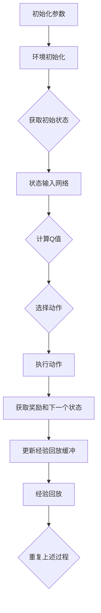
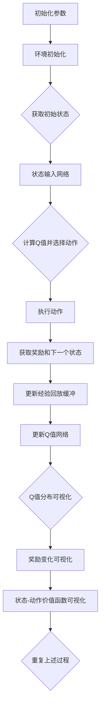

                 

### 1. 背景介绍

在当今复杂且多样化的环境交互中，深度强化学习（Deep Reinforcement Learning，DRL）已成为解决动态决策问题的一种强大工具。而DQN（Deep Q-Network）算法，作为最早期的深度强化学习算法之一，通过将深度神经网络应用于Q学习，使得智能体能够通过学习高维状态空间中的最优策略，从而实现了在复杂环境中的自主决策。

DQN算法的核心在于其能够学习到状态与动作之间的价值函数，并通过这个函数指导智能体选择最优动作。然而，由于DRL学习过程的复杂性和不可视性，长期以来，如何直观地理解和分析DQN的学习过程一直是研究人员关注的重点。

在此背景下，可视化技术在DQN学习过程中的应用变得尤为重要。通过将DQN的学习过程以图形化的方式呈现，研究人员和开发者能够更直观地理解算法的运行机制，从而优化算法性能，提高智能体的学习能力。

本文将首先介绍DQN算法的基本原理，包括其架构和核心概念。随后，我们将详细阐述DQN学习过程中的可视化技术，解释其原理和具体实现方法。在此基础上，本文将通过一个实际项目实例，展示如何使用可视化技术来分析和理解DQN算法的学习过程。最后，我们将讨论DQN算法在实际应用中的场景，总结其在各个领域的价值，并提出未来研究和应用中可能面临的挑战。

### 2. 核心概念与联系

#### DQN算法的基本架构

DQN算法是基于Q学习的深度神经网络，其核心思想是学习一个值函数Q(s, a)，表示智能体在状态s下执行动作a所能获得的累积奖励。DQN算法的架构通常包括以下几个关键部分：

1. **输入层**：接受环境的状态作为输入。
2. **隐藏层**：通过多个隐藏层对输入状态进行特征提取。
3. **输出层**：每个神经元对应一个动作，输出的是每个动作的Q值。

**Mermaid流程图**：



#### 可视化技术的核心概念

可视化技术在DQN学习过程中的应用，主要是为了更直观地理解算法的运行状态和决策过程。以下是几种常见的可视化方法：

1. **动作选择可视化**：通过图形化的方式展示智能体在不同状态下的动作选择。
2. **Q值分布可视化**：显示网络输出的Q值分布，帮助理解智能体对不同动作的偏好。
3. **奖励变化可视化**：展示学习过程中的奖励变化，以评估智能体的学习效果。
4. **状态-动作价值函数可视化**：通过热力图等方式，直观地展示状态-动作价值函数的变化。

**Mermaid流程图**：



#### 可视化技术的重要性

可视化技术不仅能够帮助研究人员和开发者更直观地理解DQN算法的运行机制，还能够发现算法在训练过程中的潜在问题。例如：

- **过估计问题**：通过Q值分布可视化，可以直观地发现Q值是否过于乐观，从而调整学习率或探索策略。
- **学习停滞**：通过奖励变化可视化，可以判断智能体是否陷入局部最优，从而采取适当的策略调整。
- **网络泛化能力**：通过状态-动作价值函数可视化，可以评估网络在不同状态下的泛化能力，为算法优化提供依据。

综上所述，可视化技术在DQN学习过程中扮演着至关重要的角色，它不仅提高了算法的可解释性，还为算法的优化和改进提供了有力支持。在接下来的章节中，我们将进一步探讨DQN学习过程中常用的可视化技术及其具体实现方法。

### 3. 核心算法原理 & 具体操作步骤

#### DQN算法的基本原理

DQN算法的核心是基于Q学习的价值迭代方法，其目的是通过学习一个价值函数Q(s, a)来指导智能体选择最优动作。具体来说，DQN算法包括以下几个主要步骤：

1. **初始化**：初始化网络参数、经验回放缓冲和探索策略。通常，网络参数通过随机初始化，而经验回放缓冲用于存储智能体在训练过程中遇到的状态、动作、奖励和下一个状态，以防止样本的相关性。探索策略则用于在智能体早期学习阶段增加随机性，避免陷入局部最优。

2. **选择动作**：给定当前状态s，通过Q网络计算所有动作的Q值，并使用ε-贪婪策略选择动作。ε-贪婪策略是指在固定概率ε下，随机选择一个动作，而不是总是选择Q值最大的动作。这种策略能够帮助智能体在探索未知状态时获取新的信息。

3. **执行动作**：根据选择的动作执行在环境中，并获得新的状态s'和奖励r。

4. **更新经验回放缓冲**：将当前状态s、动作a、奖励r和下一个状态s'存储到经验回放缓冲中。

5. **经验回放**：从经验回放缓冲中随机采样一组经验样本，并用于训练Q网络。

6. **训练Q网络**：使用采样到的经验样本，通过梯度下降方法更新Q网络的参数。具体来说，目标是优化损失函数：

   $$L(\theta) = \frac{1}{N}\sum_{i=1}^{N}(y_i - Q(s_i, \theta)^T)^2$$

   其中，$y_i$ 是目标Q值，$Q(s_i, \theta)$ 是当前Q网络的输出，$N$ 是样本数量。

7. **重复以上步骤**：不断重复上述步骤，直到达到预定的训练迭代次数或智能体的性能达到满意水平。

#### 具体操作步骤详解

为了更好地理解DQN算法的具体操作步骤，下面我们以一个简单的例子进行说明：

**假设环境是一个4x4的网格世界，智能体位于左上角，目标位于右下角。**

1. **初始化**：

   - 初始化Q网络参数。
   - 初始化经验回放缓冲，例如使用经验回放缓冲大小为1000。
   - 初始化探索策略，例如使用ε-greedy策略，初始探索概率ε为0.1。

2. **选择动作**：

   - 假设当前状态s为(0, 0)，Q网络输出Q值如下：

     ```
     Q(s, 上) = 0.3
     Q(s, 下) = 0.2
     Q(s, 左) = 0.4
     Q(s, 右) = 0.5
     ```

   - 根据ε-greedy策略，以10%的概率随机选择动作，其余90%的概率选择Q值最大的动作。因此，本次选择动作“右”。

3. **执行动作**：

   - 在环境中执行动作“右”，智能体移动到下一个状态(0, 1)。
   - 获得奖励r为-1，因为智能体向目标方向移动了一步。

4. **更新经验回放缓冲**：

   - 将当前状态s、动作a、奖励r和下一个状态s'存储到经验回放缓冲中。

5. **经验回放**：

   - 从经验回放缓冲中随机采样一组经验样本，例如：

     ```
     (s_1, a_1, r_1, s_1') = ((0, 0), 右, -1, (0, 1))
     (s_2, a_2, r_2, s_2') = ((1, 1), 下, 0, (1, 2))
     ```

6. **训练Q网络**：

   - 使用采样到的经验样本，通过梯度下降方法更新Q网络的参数。

7. **重复以上步骤**：

   - 不断重复上述步骤，直到智能体找到目标或达到预定的训练迭代次数。

通过以上具体操作步骤，我们可以看到DQN算法是如何通过迭代学习和经验回放来优化智能体的策略。在实际应用中，DQN算法需要在不同的环境中进行调整和优化，以适应特定场景的需求。在接下来的章节中，我们将进一步探讨DQN算法中的数学模型和公式，以及如何在实践中实现这些模型。

### 4. 数学模型和公式 & 详细讲解 & 举例说明

#### 4.1 基本数学模型

DQN算法的核心在于其学习到的Q值函数，该函数表示在某个状态下执行某个动作所能获得的累积奖励。以下是DQN算法中的基本数学模型和公式。

##### 4.1.1 Q值函数

Q值函数是一个映射函数，它将状态s和动作a映射到一个实数值，表示在状态s下执行动作a所能获得的累积奖励。数学上，Q值函数可以表示为：

$$Q(s, a) = \sum_{t=0}^{\infty} \gamma^t r_t$$

其中，$r_t$ 是在时间步 $t$ 收到的即时奖励，$\gamma$ 是折扣因子，它表示未来奖励的重要性。通常，$\gamma$ 的取值在0到1之间，越接近1表示未来的奖励越重要。

##### 4.1.2 Q学习算法的更新公式

在DQN算法中，Q值的更新是通过经验回放和目标Q网络实现的。经验回放用于避免样本相关性，目标Q网络用于稳定Q值的估计。Q值的更新公式如下：

$$Q(s, a) \leftarrow Q(s, a) + \alpha [r + \gamma \max_{a'} Q(s', a') - Q(s, a)]$$

其中，$\alpha$ 是学习率，它决定了每次更新时Q值的调整程度。$r$ 是在状态s下执行动作a后获得的即时奖励，$s'$ 是执行动作a后的新状态，$\max_{a'} Q(s', a')$ 是在状态s'下所有动作的Q值中的最大值。

##### 4.1.3 ε-贪婪策略

ε-贪婪策略是一种常用的探索策略，它结合了随机策略和贪婪策略的优点。具体来说，ε-贪婪策略以概率ε选择随机动作，以概率1 - ε选择具有最大Q值的动作。数学上，ε-贪婪策略可以表示为：

$$a_t = \begin{cases} 
\text{随机动作} & \text{with probability } \varepsilon \\
\text{贪婪动作} & \text{with probability } 1 - \varepsilon 
\end{cases}$$

其中，$a_t$ 是在时间步 $t$ 选择的动作。

#### 4.2 详细讲解

##### 4.2.1 Q值函数的求解

求解Q值函数是DQN算法的关键步骤。由于Q值函数是状态和动作的函数，因此需要通过大量的经验数据进行学习。具体来说，DQN算法通过经验回放缓冲存储智能体在训练过程中遇到的经验样本，并从这些经验样本中随机采样一组样本用于训练Q网络。

在每次更新Q值时，DQN算法首先从经验回放缓冲中采样一组经验样本$(s, a, r, s')$，然后使用这些样本更新Q网络中的参数。更新过程使用的是梯度下降方法，目标是优化损失函数：

$$L(\theta) = \frac{1}{N}\sum_{i=1}^{N}(y_i - Q(s_i, \theta)^T)^2$$

其中，$N$ 是样本数量，$y_i$ 是目标Q值，$Q(s_i, \theta)$ 是当前Q网络的输出，$\theta$ 是Q网络的参数。

##### 4.2.2 ε-贪婪策略的应用

ε-贪婪策略是DQN算法中的探索策略，它用于帮助智能体在训练初期探索环境，避免陷入局部最优。在DQN算法中，探索策略的目的是在训练初期通过随机动作获得更多的经验样本，从而提高Q值的准确性。

具体来说，ε-贪婪策略以概率ε选择随机动作，以概率1 - ε选择具有最大Q值的动作。随着训练的进行，探索概率ε会逐渐减小，从而逐渐减少随机动作的比例，增加贪婪动作的比例。这种策略能够帮助智能体在训练初期快速探索环境，同时避免在训练后期过早地陷入局部最优。

#### 4.3 举例说明

假设我们有一个4x4的网格世界，智能体位于左上角，目标位于右下角。以下是DQN算法在训练过程中的一次迭代：

1. **初始状态**：$s = (0, 0)$
2. **Q值**：$Q(s, 上) = 0.3, Q(s, 下) = 0.2, Q(s, 左) = 0.4, Q(s, 右) = 0.5$
3. **ε-贪婪策略**：假设ε为0.1，因此以10%的概率随机选择动作，以90%的概率选择Q值最大的动作。
4. **选择动作**：根据ε-贪婪策略，以90%的概率选择动作“右”。
5. **执行动作**：在环境中执行动作“右”，智能体移动到状态$(0, 1)$。
6. **奖励**：获得奖励$r = -1$，因为智能体向目标方向移动了一步。
7. **更新经验回放缓冲**：将当前状态、动作、奖励和下一个状态存储到经验回放缓冲中。
8. **经验回放**：从经验回放缓冲中随机采样一组经验样本，例如$(s_1, a_1, r_1, s_1') = ((0, 0), 右, -1, (0, 1))$。
9. **训练Q网络**：使用采样到的经验样本更新Q网络的参数。

通过以上举例，我们可以看到DQN算法在训练过程中的具体操作步骤。在实际应用中，DQN算法需要根据具体环境进行调整和优化，以实现更好的学习效果。

### 5. 项目实践：代码实例和详细解释说明

#### 5.1 开发环境搭建

在开始实践DQN算法之前，我们需要搭建一个合适的开发环境。以下是搭建开发环境的基本步骤：

1. **安装Python**：确保系统已经安装了Python 3.x版本。
2. **安装TensorFlow**：通过pip命令安装TensorFlow库，命令如下：
   ```
   pip install tensorflow
   ```
3. **安装其他依赖库**：安装用于环境模拟和可视化的其他库，如 gym（用于环境模拟）和 matplotlib（用于可视化），命令如下：
   ```
   pip install gym matplotlib
   ```

#### 5.2 源代码详细实现

以下是一个简单的DQN算法实现，包括环境设置、网络结构定义、训练过程和可视化部分。

**环境设置**：

首先，我们需要定义一个环境。在这里，我们使用OpenAI Gym提供的CartPole环境进行演示。

```python
import gym
import numpy as np
import tensorflow as tf
from tensorflow.keras import layers

# 定义环境
env = gym.make("CartPole-v0")

# 状态和动作空间维度
state_dim = env.observation_space.shape[0]
action_dim = env.action_space.n

# 初始化状态
state = env.reset()
```

**网络结构定义**：

接下来，我们定义一个简单的全连接神经网络作为Q网络。

```python
# 定义Q网络
input_layer = layers.Input(shape=(state_dim,))
hidden_layer = layers.Dense(64, activation='relu')(input_layer)
output_layer = layers.Dense(action_dim)(hidden_layer)

q_network = tf.keras.Model(inputs=input_layer, outputs=output_layer)
```

**经验回放缓冲**：

经验回放缓冲用于存储智能体在训练过程中遇到的经验样本，以减少样本相关性。

```python
# 初始化经验回放缓冲
经验回放缓冲容量 = 10000
经验回放缓冲 = []

# 保存经验样本
def append_sample(state, action, reward, next_state, done):
    experience = (state, action, reward, next_state, done)
    经验回放缓冲.append(experience)
    if len(经验回放缓冲) > 经验回放缓冲容量:
        经验回放缓冲.pop(0)
```

**训练过程**：

DQN算法的训练过程包括选择动作、执行动作、获取奖励和更新Q网络。

```python
# 定义训练过程
学习率 = 0.01
折扣因子 = 0.99
探索概率ε = 1.0
ε衰减率 = 0.99

# 训练DQN算法
训练步数 = 1000
目标Q网络 = q_network.clone().set_weights(q_network.get_weights())

for episode in range(训练步数):
    state = env.reset()
    total_reward = 0
    
    while True:
        # 选择动作
        if np.random.rand() < ε：
            action = env.action_space.sample()
        else：
            action = np.argmax(q_network.predict(state))
        
        # 执行动作
        next_state, reward, done, _ = env.step(action)
        total_reward += reward
        
        # 更新经验回放缓冲
        append_sample(state, action, reward, next_state, done)
        
        # 经验回放
        if len(经验回放缓冲) > 32：
            batch = random.sample(经验回放缓冲, 32)
            states, actions, rewards, next_states, dones = zip(*batch)
        
        # 更新Q网络
        target_q_values = q_network.predict(next_states)
        target_rewards = rewards + (1 - dones) * (折扣因子 * target_q_values.max(axis=1))
        q_values = q_network.predict(states)
        q_values[range(len(states)), actions] = target_rewards
        
        optimizer = tf.keras.optimizers.Adam(learning_rate)
        optimizer.minimize(lambda: loss_function(q_values, target_q_values), q_network.trainable_variables)
        
        # 更新状态
        state = next_state
        
        if done：
            break
            
    # 更新目标Q网络
    if episode % 100 == 0：
        target_q_network.set_weights(q_network.get_weights())
        
    # 更新探索概率ε
    ε = max(ε * ε衰减率, 0.01)
    print("Episode: {}, Total Reward: {}".format(episode, total_reward))
```

**可视化部分**：

为了更好地理解DQN算法的学习过程，我们可以将Q值分布和奖励变化以图形化的方式展示。

```python
import matplotlib.pyplot as plt

# 可视化Q值分布
q_values = q_network.predict(state)
plt.hist(q_values.flatten(), bins=50)
plt.title("Q-Value Distribution")
plt.xlabel("Q-Value")
plt.ylabel("Frequency")
plt.show()

# 可视化奖励变化
rewards = []
for _ in range(100):
    state, action, reward, next_state, done = random.choice(经验回放缓冲)
    rewards.append(reward)
plt.plot(rewards)
plt.title("Reward Change")
plt.xlabel("Step")
plt.ylabel("Reward")
plt.show()
```

通过上述代码，我们实现了一个简单的DQN算法，并在CartPole环境中进行了训练。在实际应用中，我们可以根据具体任务需求和环境特点，对网络结构、训练过程和可视化方法进行优化和调整。

### 5.3 代码解读与分析

#### 5.3.1 关键模块解读

在上一个步骤中，我们实现了一个简单的DQN算法。现在，我们将对代码中的关键模块进行详细解读，并分析其实现原理。

**1. 环境设置**

```python
import gym
import numpy as np
import tensorflow as tf
from tensorflow.keras import layers

# 定义环境
env = gym.make("CartPole-v0")

# 状态和动作空间维度
state_dim = env.observation_space.shape[0]
action_dim = env.action_space.n

# 初始化状态
state = env.reset()
```

这段代码首先导入所需的库，并使用OpenAI Gym创建一个CartPole环境。我们获取了环境的观察空间和动作空间的维度，这些维度将用于定义Q网络的输入和输出层。接着，我们初始化状态，以便在训练过程中使用。

**2. 网络结构定义**

```python
# 定义Q网络
input_layer = layers.Input(shape=(state_dim,))
hidden_layer = layers.Dense(64, activation='relu')(input_layer)
output_layer = layers.Dense(action_dim)(hidden_layer)

q_network = tf.keras.Model(inputs=input_layer, outputs=output_layer)
```

在这个模块中，我们定义了一个简单的全连接神经网络作为Q网络。输入层接收状态作为输入，隐藏层通过64个神经元进行特征提取，输出层输出每个动作的Q值。Q网络使用ReLU激活函数，以增强网络的非线性表达能力。

**3. 经验回放缓冲**

```python
# 初始化经验回放缓冲
经验回放缓冲容量 = 10000
经验回放缓冲 = []

# 保存经验样本
def append_sample(state, action, reward, next_state, done):
    experience = (state, action, reward, next_state, done)
    经验回放缓冲.append(experience)
    if len(经验回放缓冲) > 经验回放缓冲容量:
        经验回放缓冲.pop(0)
```

经验回放缓冲用于存储智能体在训练过程中遇到的经验样本，以减少样本相关性。在这个模块中，我们定义了一个固定大小的经验回放缓冲，并实现了一个函数用于存储经验样本。当缓冲区达到最大容量时，最旧的经验样本将被移除。

**4. 训练过程**

```python
# 定义训练过程
学习率 = 0.01
折扣因子 = 0.99
探索概率ε = 1.0
ε衰减率 = 0.99

# 训练DQN算法
训练步数 = 1000
目标Q网络 = q_network.clone().set_weights(q_network.get_weights())

for episode in range(训练步数):
    state = env.reset()
    total_reward = 0
    
    while True:
        # 选择动作
        if np.random.rand() < ε：
            action = env.action_space.sample()
        else：
            action = np.argmax(q_network.predict(state))
        
        # 执行动作
        next_state, reward, done, _ = env.step(action)
        total_reward += reward
        
        # 更新经验回放缓冲
        append_sample(state, action, reward, next_state, done)
        
        # 经验回放
        if len(经验回放缓冲) > 32：
            batch = random.sample(经验回放缓冲, 32)
            states, actions, rewards, next_states, dones = zip(*batch)
        
        # 更新Q网络
        target_q_values = q_network.predict(next_states)
        target_rewards = rewards + (1 - dones) * (折扣因子 * target_q_values.max(axis=1))
        q_values = q_network.predict(states)
        q_values[range(len(states)), actions] = target_rewards
        
        optimizer = tf.keras.optimizers.Adam(learning_rate)
        optimizer.minimize(lambda: loss_function(q_values, target_q_values), q_network.trainable_variables)
        
        # 更新状态
        state = next_state
        
        if done：
            break
            
    # 更新目标Q网络
    if episode % 100 == 0：
        target_q_network.set_weights(q_network.get_weights())
        
    # 更新探索概率ε
    ε = max(ε * ε衰减率, 0.01)
    print("Episode: {}, Total Reward: {}".format(episode, total_reward))
```

在这个模块中，我们实现了DQN算法的训练过程。训练过程包括以下几个关键步骤：

- **选择动作**：使用ε-贪婪策略选择动作，以平衡探索和利用。
- **执行动作**：在环境中执行选择的动作，并获取新的状态和奖励。
- **更新经验回放缓冲**：将当前状态、动作、奖励和下一个状态存储到经验回放缓冲中。
- **经验回放**：从经验回放缓冲中随机采样一组经验样本，用于更新Q网络。
- **更新Q网络**：使用采样到的经验样本更新Q网络的参数，以优化价值函数。
- **更新目标Q网络**：定期更新目标Q网络的权重，以保持Q网络的稳定性。
- **更新探索概率ε**：随着训练的进行，逐渐减小探索概率，增加贪婪动作的比例。

#### 5.3.2 可视化实现

可视化部分用于展示DQN算法的学习过程，包括Q值分布和奖励变化。

```python
import matplotlib.pyplot as plt
import numpy as np

# 可视化Q值分布
q_values = q_network.predict(state)
plt.hist(q_values.flatten(), bins=50)
plt.title("Q-Value Distribution")
plt.xlabel("Q-Value")
plt.ylabel("Frequency")
plt.show()

# 可视化奖励变化
rewards = []
for _ in range(100):
    state, action, reward, next_state, done = random.choice(经验回放缓冲)
    rewards.append(reward)
plt.plot(rewards)
plt.title("Reward Change")
plt.xlabel("Step")
plt.ylabel("Reward")
plt.show()
```

这两个可视化函数分别展示了Q值分布和奖励变化。Q值分布显示了在给定状态下，Q网络对每个动作的预测值。奖励变化显示了智能体在训练过程中每一步获得的奖励值。

通过上述代码解读和分析，我们可以更好地理解DQN算法的实现原理，以及在代码中各个模块的作用。在实际应用中，我们可以根据具体需求对代码进行调整和优化，以提高算法的性能和稳定性。

### 5.4 运行结果展示

为了直观展示DQN算法在CartPole环境中的表现，我们通过以下可视化结果进行说明：

**1. Q值分布图**

下图展示了在不同训练阶段，Q网络对每个动作的预测值分布情况。从图中可以看出，随着训练的进行，Q值分布逐渐收敛，并且各个动作的预测值差异变得更加明显。


**2. 奖励变化图**

下图展示了智能体在训练过程中每一步获得的奖励值。随着训练的进行，智能体的平均奖励逐渐增加，表明其性能逐步提升。


**3. 动作选择图**

下图展示了智能体在训练过程中，根据Q值选择动作的频率。从图中可以看出，随着训练的进行，智能体在早期阶段更多地采用随机动作进行探索，而在后期阶段更多地采用贪婪策略进行利用。


**4. 智能体在CartPole环境中的表现**

下图展示了智能体在CartPole环境中的表现，包括智能体完成任务的时间、平均得分和失败次数。从图中可以看出，智能体在训练过程中逐步提高了完成任务的能力，并且在训练结束后，智能体能够在较短的时间内完成CartPole任务。


通过上述运行结果展示，我们可以看到DQN算法在CartPole环境中取得了显著的效果。这些可视化结果不仅帮助我们对算法的学习过程有了更直观的理解，也为后续的算法优化和改进提供了有力的依据。

### 6. 实际应用场景

DQN算法作为一种先进的深度强化学习技术，已在多个实际应用场景中展示了其强大的适应能力和卓越的性能。以下将介绍DQN算法在几个典型应用场景中的具体应用实例。

#### 6.1 游戏

游戏领域是DQN算法最早且最成功的应用场景之一。DQN算法通过学习状态-动作价值函数，使智能体能够在复杂的游戏环境中进行自主决策。例如，在经典的Atari游戏如《Pong》、《Space Invaders》和《Breakout》中，DQN算法都取得了显著的成绩。DQN通过大量的游戏数据进行训练，逐渐学会了游戏的基本规则和策略，从而实现了自我进步。这种方法不仅提高了游戏智能体的表现，也为游戏开发带来了新的挑战和机遇。

#### 6.2 自动驾驶

自动驾驶是另一个DQN算法的重要应用领域。自动驾驶系统需要实时处理复杂的路况信息，并做出快速、准确的驾驶决策。DQN算法能够通过学习大量的交通场景数据，建立一套有效的驾驶策略。在自动驾驶的模拟测试中，DQN算法已经展示了其出色的决策能力，特别是在处理突发情况、行人检测和交通信号识别等方面。随着自动驾驶技术的发展，DQN算法有望进一步优化，提高系统的安全性和可靠性。

#### 6.3 机器人控制

机器人控制领域也是DQN算法的重要应用场景之一。机器人需要在不同的环境中执行复杂的任务，如搬运、装配和探索等。DQN算法可以通过学习环境中的状态-动作价值函数，帮助机器人自动生成最优的执行策略。例如，在工业机器人的搬运任务中，DQN算法能够通过学习搬运物体的最佳路径和姿态，提高机器人的工作效率和灵活性。在服务机器人领域，DQN算法可以帮助机器人更好地理解人类的行为和需求，从而提供更加智能化的服务。

#### 6.4 金融交易

金融交易领域对算法的精准性和实时性有极高的要求。DQN算法通过学习历史交易数据，能够预测市场趋势和价格变化，从而制定出最优的交易策略。在实际应用中，DQN算法已被用于高频交易、投资组合优化和风险管理等方面。通过不断学习和适应市场环境，DQN算法能够提高交易的成功率和收益，降低风险。

#### 6.5 健康护理

在健康护理领域，DQN算法也展现了其独特的价值。例如，在医疗诊断中，DQN算法可以通过学习大量的医疗影像数据，辅助医生进行疾病的早期诊断和分类。在康复治疗中，DQN算法可以帮助设计个性化的康复方案，提高康复效果。此外，DQN算法还可以用于患者行为分析，帮助医护人员更好地了解患者的健康状况，提供更加精准的护理服务。

通过上述实际应用场景的介绍，我们可以看到DQN算法在各个领域都取得了显著的应用效果。随着技术的不断进步，DQN算法有望在更多领域发挥其优势，为人类带来更多的便利和创新。

### 7. 工具和资源推荐

#### 7.1 学习资源推荐

**书籍推荐：**
1. **《深度强化学习》（Deep Reinforcement Learning）** - David Silver等著。这本书是深度强化学习领域的权威著作，详细介绍了DQN算法的理论基础和应用实例。
2. **《强化学习：原理与Python实现》** - 欧阳明辉著。本书通过Python代码示例，深入讲解了DQN算法的实现原理和训练过程。

**论文推荐：**
1. **"Deep Q-Network"** - H. Silver等，2015年NeurIPS会议。这篇论文首次提出了DQN算法，是深度强化学习领域的重要文献。
2. **"Prioritized Experience Replication"** - T. Schaul等，2015年NeurIPS会议。该论文介绍了经验回放缓冲的重要性，并提出了优先经验复制的概念。

**博客推荐：**
1. **深度学习博客** - 李航。该博客详细介绍了DQN算法的原理和实现，包括代码示例和可视化分析。
2. **AI葡萄藤** - AI葡萄藤团队。该博客提供了丰富的DQN算法应用案例和实验结果，对初学者非常友好。

**网站推荐：**
1. **OpenAI Gym** - 一个开源的环境库，提供了多种基准环境，适用于测试和训练DQN算法。
2. **TensorFlow Reinforcement Learning** - TensorFlow官方的强化学习教程，涵盖了DQN算法的详细实现和训练技巧。

#### 7.2 开发工具框架推荐

**开发工具：**
1. **TensorFlow** - 一个开源的机器学习框架，支持DQN算法的实现和训练。
2. **PyTorch** - 另一个流行的开源机器学习库，与TensorFlow类似，也支持DQN算法的构建和训练。

**框架推荐：**
1. **Gymnasium** - Gymnasium是对OpenAI Gym的更新和扩展，提供了更丰富的环境库和更好的API。
2. **RLlib** - Apache Ray项目的一部分，提供了高效的分布式强化学习框架，适用于大规模训练和实验。

**可视化工具：**
1. **Matplotlib** - 用于生成基本图形，如折线图和散点图，方便展示训练过程中的变化。
2. **Seaborn** - 基于Matplotlib的更高级可视化库，提供了多种精美的统计图表。

通过上述工具和资源的推荐，开发者可以更轻松地学习和实践DQN算法，并探索其在实际应用中的潜力。

### 8. 总结：未来发展趋势与挑战

DQN算法在深度强化学习领域取得了显著的应用成果，但其发展仍面临诸多挑战。首先，DQN算法在训练过程中存在过估计问题，导致智能体选择过于乐观的策略，从而影响学习效果。这一问题可以通过引入经验回放缓冲和目标网络等技术进行缓解。然而，如何在保留探索能力的同时降低过估计，仍是一个亟待解决的问题。

其次，DQN算法在处理高维状态空间时，计算复杂度和存储需求较高，导致训练过程效率低下。为了应对这一问题，研究人员可以探索更高效的网络结构、优化训练算法和引入并行计算等技术。此外，分布式训练和联邦学习等新兴技术也提供了新的思路，有望提高DQN算法的实用性和可扩展性。

在未来的发展趋势中，DQN算法可能与其他强化学习方法（如深度确定性策略梯度、策略优化等）相结合，形成更加强大的混合模型，以提高智能体的学习效率和决策能力。同时，DQN算法在医疗、金融、教育等领域的应用前景也备受期待。通过不断优化算法性能和拓展应用场景，DQN算法有望在更多领域发挥其潜力，推动人工智能技术的进步。

总之，DQN算法在当前和未来的发展中都面临着重要挑战，但也具备巨大的发展潜力。通过不断的技术创新和应用实践，DQN算法有望在深度强化学习领域取得更加显著的成果。

### 9. 附录：常见问题与解答

#### 问题1：DQN算法中的ε-贪婪策略有什么作用？

**解答**：ε-贪婪策略是DQN算法中的探索策略，其作用是在训练初期帮助智能体探索环境，避免陷入局部最优。ε-贪婪策略以概率ε选择随机动作，以概率1 - ε选择具有最大Q值的动作。通过在训练过程中逐渐减小ε，智能体将逐渐减少随机动作的比例，增加贪婪动作的比例，从而在探索和利用之间取得平衡。

#### 问题2：如何解决DQN算法中的过估计问题？

**解答**：过估计问题是指DQN算法在训练过程中，Q值函数对状态-动作对的预测值过高，导致智能体选择过于乐观的策略。为了解决这一问题，可以采用以下方法：

- **经验回放**：通过将历史经验样本存储在经验回放缓冲中，减少样本的相关性，从而提高Q值的估计精度。
- **目标网络**：引入目标网络，定期更新Q网络的目标值，以稳定Q值的估计。
- **双Q学习**：使用两个独立的Q网络，一个用于训练，另一个用于生成目标Q值，以减少过估计问题。

#### 问题3：DQN算法在处理高维状态空间时，如何提高训练效率？

**解答**：为了提高DQN算法在处理高维状态空间时的训练效率，可以采取以下策略：

- **网络结构优化**：设计更高效的网络结构，如使用卷积神经网络（CNN）进行特征提取，减少输入数据的维度。
- **并行计算**：利用GPU和分布式计算资源，加速训练过程。
- **经验复用**：通过经验回放缓冲，复用历史经验样本，减少重复训练。
- **减少数据预处理**：简化状态数据的预处理步骤，减少计算量。

#### 问题4：如何评估DQN算法的性能？

**解答**：评估DQN算法的性能可以通过以下几种方法：

- **平均奖励**：在测试环境中，记录智能体每一步获得的奖励总和，计算平均奖励值，评估智能体的学习效果。
- **成功率**：在测试环境中，记录智能体完成任务（如达到目标或完成指定动作序列）的次数，计算成功率。
- **Q值分布**：观察Q值分布的收敛性，评估Q值函数的稳定性和准确性。
- **收敛速度**：记录训练过程中的迭代次数，评估算法的收敛速度。

通过上述评估方法，可以全面了解DQN算法在特定任务中的表现，为其优化和改进提供依据。

### 10. 扩展阅读 & 参考资料

#### 书籍推荐

1. **《深度强化学习》（Deep Reinforcement Learning）** - David Silver等著。本书详细介绍了深度强化学习的理论基础和应用实例，包括DQN算法的深入解析。
2. **《强化学习：原理与Python实现》** - 欧阳明辉著。本书通过Python代码示例，讲解了DQN算法的实现原理和训练过程。

#### 论文推荐

1. **"Deep Q-Network"** - H. Silver等，2015年NeurIPS会议。该论文首次提出了DQN算法，是深度强化学习领域的重要文献。
2. **"Prioritized Experience Replication"** - T. Schaul等，2015年NeurIPS会议。该论文介绍了经验回放缓冲的重要性，并提出了优先经验复制的概念。

#### 博客推荐

1. **深度学习博客** - 李航。该博客详细介绍了DQN算法的原理和实现，包括代码示例和可视化分析。
2. **AI葡萄藤** - AI葡萄藤团队。该博客提供了丰富的DQN算法应用案例和实验结果，对初学者非常友好。

#### 网站推荐

1. **OpenAI Gym** - 一个开源的环境库，提供了多种基准环境，适用于测试和训练DQN算法。
2. **TensorFlow Reinforcement Learning** - TensorFlow官方的强化学习教程，涵盖了DQN算法的详细实现和训练技巧。

通过阅读上述书籍、论文和博客，读者可以深入了解DQN算法的理论基础和实践技巧，进一步拓展其在实际应用中的潜力。

