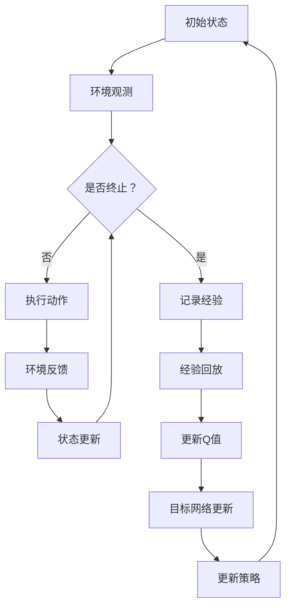
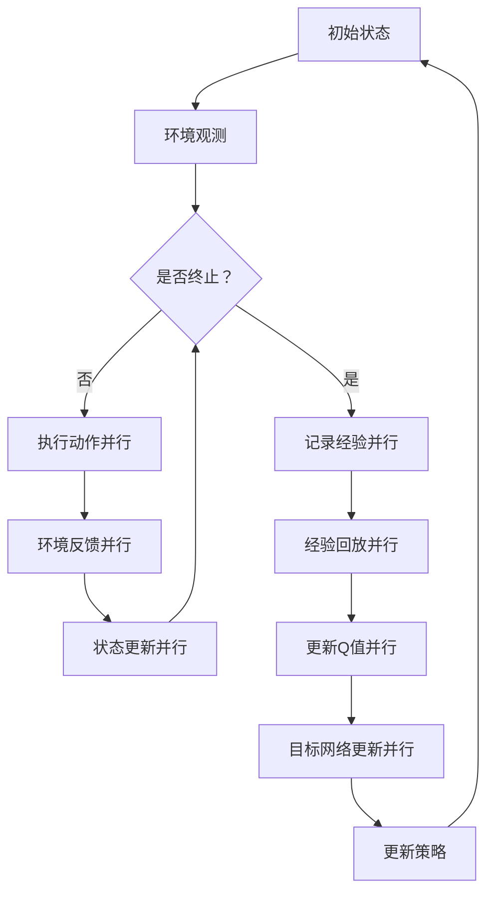

                 

### 一、背景介绍

深度强化学习（Deep Reinforcement Learning，DRL）作为机器学习领域的一大进展，已经在自动驾驶、游戏AI和机器人控制等领域取得了显著的成果。然而，传统的深度强化学习方法如DQN（Deep Q-Network）在训练过程中存在计算量大、收敛速度慢等问题，这严重制约了其在复杂环境中的应用。为了解决这些问题，研究者们提出了DQN的并行化处理方法，通过优化算法和数据流的并行化，大幅提升了训练效率和性能。

并行化处理是一种通过同时执行多个任务或操作来提高计算效率的技术。在DQN中，并行化处理主要体现在以下几个层面：1) 网络参数的并行更新，2) 回合（episode）的并行执行，3) 状态-动作对的并行计算。本文将深入探讨DQN的并行化处理方法，详细解释其原理和实现步骤，并通过实际项目案例进行代码实现和结果分析。

DQN模型之所以需要并行化处理，主要有以下几个原因：

1. **计算量巨大**：DQN通过深度神经网络来近似Q值函数，这需要大量的计算资源。特别是在高维状态空间和动作空间的情况下，计算量呈指数级增长。
2. **收敛速度慢**：DQN依赖于经验回放（Experience Replay）和目标网络（Target Network）来缓解样本相关性和避免梯度消失问题。然而，这些机制的引入导致了训练过程的复杂性增加，收敛速度相对较慢。
3. **实时性要求高**：在自动驾驶、机器人控制等实时性要求高的应用场景中，训练过程的延迟可能带来严重的安全隐患。因此，提升DQN的训练速度是满足这些应用场景需求的关键。

针对上述问题，并行化处理提供了有效的解决方案。通过合理的并行策略，可以显著降低计算量，提高收敛速度，并满足实时性要求。本文将围绕DQN的并行化处理展开讨论，旨在为研究人员和开发者提供实用的指导。

### 二、核心概念与联系

为了深入理解DQN的并行化处理，我们首先需要回顾DQN的基本概念和原理。DQN是一种基于深度学习的强化学习算法，旨在通过学习最优的策略来最大化回报。其核心组成部分包括：

1. **动作值函数（Q值函数）**：Q值函数用于评估每个动作在当前状态下的价值，公式为 $Q(s, a) = \sum_a \pi(a|s) Q^{\pi}(s, a)$，其中 $\pi(a|s)$ 是策略，$Q^{\pi}(s, a)$ 是在给定策略 $\pi$ 下，从状态 $s$ 执行动作 $a$ 的期望回报。
2. **深度神经网络（DNN）**：DQN使用DNN来近似Q值函数。DNN由多个层级组成，每个层级包含多个神经元，用于将输入映射到输出。
3. **经验回放（Experience Replay）**：经验回放是一种机制，用于存储和重放历史经验，从而减少样本相关性，提高训练的鲁棒性。
4. **目标网络（Target Network）**：目标网络用于稳定Q值函数的学习过程。其原理是定期更新目标网络，使其近似于当前网络，从而减少梯度消失问题。

接下来，我们将使用Mermaid流程图来展示DQN的工作流程和各个组成部分之间的关系。以下是DQN的基本流程图：



在上述流程图中，各个节点的具体含义如下：

- **A：初始状态**：DQN开始时，环境处于初始状态。
- **B：环境观测**：DQN从环境中获取当前状态。
- **C：是否终止？**：判断当前回合是否结束。
- **D：执行动作**：根据当前状态和策略选择动作。
- **E：环境反馈**：执行动作后，环境返回新的状态和奖励。
- **F：状态更新**：更新当前状态。
- **G：记录经验**：将当前状态、动作、奖励和下一个状态记录下来。
- **H：经验回放**：从经验回放池中随机抽取样本。
- **I：更新Q值**：使用经验回放池中的样本更新Q值函数。
- **J：目标网络更新**：定期更新目标网络，以稳定学习过程。
- **K：更新策略**：根据更新后的Q值函数，更新策略。

DQN的并行化处理主要涉及到以下方面：

1. **网络参数的并行更新**：在传统的DQN中，网络参数的更新是串行的，即每次更新一个样本的Q值后再更新下一个样本。通过并行更新，可以同时更新多个样本的Q值，从而减少计算时间。
2. **回合的并行执行**：在DQN的训练过程中，多个回合可以同时进行，从而提高训练效率。
3. **状态-动作对的并行计算**：在处理经验回放时，可以同时计算多个状态-动作对的Q值，从而加速Q值函数的更新。

下面是DQN并行化处理的工作流程图：



在上述流程图中，各个节点的具体含义与基本流程图相同，但引入了“并行”的概念，表示这些操作可以同时进行。

通过上述流程图，我们可以清楚地看到DQN的工作流程和并行化处理的实现方式。接下来，我们将详细探讨DQN并行化处理的原理和具体操作步骤。

### 三、核心算法原理 & 具体操作步骤

#### 3.1 网络参数的并行更新

在传统的DQN中，网络参数的更新是逐个样本进行的，这导致了较大的计算开销。为了提高更新效率，我们可以采用并行更新的方法，即同时更新多个样本的Q值。具体实现步骤如下：

1. **经验回放池初始化**：初始化一个经验回放池，用于存储历史经验。经验回放池的大小通常设置为总样本数的若干倍。
2. **随机抽样**：从经验回放池中随机抽取多个样本，这些样本应具有多样化的特征，以避免过度拟合。
3. **计算目标Q值**：对于每个样本，计算其在当前网络下的目标Q值。目标Q值的计算公式为 $Q_{\text{target}}(s', a') = r + \gamma \max_{a''} Q_{\text{network}}(s', a'')$，其中 $r$ 是即时奖励，$\gamma$ 是折扣因子，$s'$ 是下一个状态，$a'$ 是当前动作，$a''$ 是下一个动作。
4. **更新Q值**：使用目标Q值更新当前网络中的Q值。更新公式为 $Q_{\text{network}}(s, a) \leftarrow Q_{\text{network}}(s, a) + \alpha [r + \gamma \max_{a''} Q_{\text{target}}(s', a'') - Q_{\text{network}}(s, a)]$，其中 $\alpha$ 是学习率。
5. **同步网络参数**：将更新后的网络参数同步到目标网络中，以确保目标网络与当前网络保持一致。

通过上述步骤，我们可以实现网络参数的并行更新。具体代码实现如下（使用Python和TensorFlow框架）：

```python
import tensorflow as tf

# 定义经验回放池
experience_replay = ...

# 随机抽样
batch_size = 32
sample_indices = np.random.choice(len(experience_replay), batch_size)

# 计算目标Q值
s_samples, a_samples, r_samples, s_prime_samples = ...
target_q_values = ...
    r_samples + discount_factor * np.max(target_q_values[s_prime_samples], axis=1)

# 更新Q值
with tf.Session() as sess:
    q_values = sess.run(q_model(s_samples), feed_dict={a_samples: action_samples})
    q_values += (target_q_values - q_values) * learning_rate
    sess.run(q_optimizer, feed_dict={q_model_input: s_samples, q_target: q_values})

# 同步网络参数
sync_target_network()
```

#### 3.2 回合的并行执行

在DQN的训练过程中，多个回合可以同时进行，从而提高训练效率。具体实现步骤如下：

1. **初始化环境**：初始化多个环境实例，每个环境独立进行交互。
2. **执行动作**：对于每个环境，根据当前策略选择动作。
3. **收集经验**：记录每个环境的当前状态、动作、奖励和下一个状态。
4. **更新Q值**：使用收集到的经验更新Q值函数。
5. **同步网络参数**：将更新后的网络参数同步到目标网络中。

通过上述步骤，我们可以实现回合的并行执行。具体代码实现如下（使用Python和TensorFlow框架）：

```python
import tensorflow as tf
import threading

# 定义环境实例
environments = [Environment() for _ in range(num_environments)]

# 定义线程函数
def run_environment(environment_index):
    while True:
        state = environments[environment_index].get_state()
        action = select_action(state)
        reward, next_state = environments[environment_index].step(action)
        collect_experience(state, action, reward, next_state)
        update_q_values()

# 启动线程
threads = [threading.Thread(target=run_environment, args=(i,)) for i in range(num_environments)]
for thread in threads:
    thread.start()

# 同步网络参数
sync_target_network()
```

#### 3.3 状态-动作对的并行计算

在处理经验回放时，可以同时计算多个状态-动作对的Q值，从而加速Q值函数的更新。具体实现步骤如下：

1. **初始化经验回放池**：初始化一个经验回放池，用于存储历史经验。
2. **随机抽样**：从经验回放池中随机抽取多个样本。
3. **计算Q值**：对于每个样本，计算其在当前网络下的Q值。
4. **更新Q值**：使用计算得到的Q值更新当前网络中的Q值。

通过上述步骤，我们可以实现状态-动作对的并行计算。具体代码实现如下（使用Python和TensorFlow框架）：

```python
import tensorflow as tf
import concurrent.futures

# 定义经验回放池
experience_replay = ...

# 随机抽样
batch_size = 32
sample_indices = np.random.choice(len(experience_replay), batch_size)

# 计算Q值
s_samples, a_samples, r_samples, s_prime_samples = ...
q_values = []
for i in range(batch_size):
    s = s_samples[i]
    a = a_samples[i]
    q_value = q_model(s, a)
    q_values.append(q_value)

# 更新Q值
with tf.Session() as sess:
    target_q_values = ...
    q_values += (target_q_values - q_values) * learning_rate
    sess.run(q_optimizer, feed_dict={q_model_input: s_samples, q_target: q_values})
```

通过上述三种并行化处理方法，我们可以显著提高DQN的训练效率和性能。在实际应用中，可以根据具体需求和计算资源选择合适的并行策略，以达到最佳效果。

### 四、数学模型和公式 & 详细讲解 & 举例说明

#### 4.1 数学模型

在深入探讨DQN的并行化处理之前，我们先回顾一下DQN的核心数学模型。DQN是一种基于值函数的强化学习算法，旨在通过学习最优的策略来最大化回报。其核心组成部分包括Q值函数、经验回放、目标网络和策略更新。

1. **Q值函数**：Q值函数用于评估每个动作在当前状态下的价值，公式为：
   \[
   Q(s, a) = \sum_a \pi(a|s) Q^{\pi}(s, a)
   \]
   其中，$\pi(a|s)$ 是策略，$Q^{\pi}(s, a)$ 是在给定策略 $\pi$ 下，从状态 $s$ 执行动作 $a$ 的期望回报。

2. **经验回放**：经验回放是一种机制，用于存储和重放历史经验，从而减少样本相关性和提高训练的鲁棒性。其公式为：
   \[
   \text{Experience Replay} = \{ (s_t, a_t, r_t, s_{t+1}) \}_{t=1}^{N}
   \]
   其中，$s_t, a_t, r_t, s_{t+1}$ 分别表示第 $t$ 个时刻的状态、动作、奖励和下一个状态。

3. **目标网络**：目标网络用于稳定Q值函数的学习过程，其原理是定期更新目标网络，使其近似于当前网络。其公式为：
   \[
   Q_{\text{target}}(s', a') = r + \gamma \max_{a''} Q_{\text{network}}(s', a'')
   \]
   其中，$r$ 是即时奖励，$\gamma$ 是折扣因子，$s'$ 是下一个状态，$a'$ 是当前动作，$a''$ 是下一个动作。

4. **策略更新**：策略更新是通过Q值函数来优化策略，从而最大化回报。其公式为：
   \[
   \pi(a|s) = \frac{1}{Z} \exp(Q(s, a))
   \]
   其中，$Z$ 是归一化常数，保证策略概率分布的求和为1。

#### 4.2 公式详细讲解

1. **Q值函数**：Q值函数是DQN的核心，它通过深度神经网络（DNN）来近似。在训练过程中，我们通过更新Q值函数来优化策略。Q值函数的更新依赖于经验回放和目标网络。

2. **经验回放**：经验回放的作用是避免样本相关性，从而提高训练的鲁棒性。在训练初期，样本的多样性较低，导致Q值函数无法准确估计状态-动作对的值。通过经验回放，我们可以引入更多的多样性，使得训练过程更加稳定。

3. **目标网络**：目标网络的目的是稳定Q值函数的学习过程。在DQN中，目标网络定期更新，以保持与当前网络的一致性。这有助于减少梯度消失问题，从而提高训练效果。

4. **策略更新**：策略更新是通过Q值函数来优化策略。在实际应用中，我们通常选择最大化Q值函数的动作作为下一步的动作。通过不断更新Q值函数和策略，我们可以逐步逼近最优策略。

#### 4.3 举例说明

假设我们有一个简单的环境，状态空间为2，动作空间为3。使用DQN进行训练时，我们首先需要定义Q值函数和策略。

1. **Q值函数**：我们使用一个简单的全连接神经网络来近似Q值函数。输入为状态，输出为动作的Q值。

2. **策略**：我们使用epsilon-greedy策略来选择动作。在训练过程中，我们通过逐渐减小epsilon值来调整策略，从而在初始阶段探索环境，在后期阶段利用经验进行优化。

3. **训练过程**：我们通过以下步骤进行训练：

   - 初始化环境、Q值函数和经验回放池。
   - 从环境获取状态，根据策略选择动作。
   - 执行动作，获取奖励和下一个状态。
   - 将当前状态、动作、奖励和下一个状态添加到经验回放池中。
   - 从经验回放池中随机抽样，更新Q值函数。
   - 定期更新目标网络。

通过上述步骤，我们可以逐步优化Q值函数和策略，从而在复杂环境中找到最优的动作选择。

### 五、项目实践：代码实例和详细解释说明

为了更好地理解和应用DQN的并行化处理，我们将通过一个实际项目来演示整个流程。在这个项目中，我们将使用Python和TensorFlow框架来实现DQN并行化处理。以下是项目的详细步骤和代码解释。

#### 5.1 开发环境搭建

在开始之前，我们需要搭建一个合适的开发环境。以下是在Linux系统上搭建开发环境所需的步骤：

1. **安装Python**：确保已经安装了Python 3.x版本。如果没有，可以通过包管理器安装，如：
   ```bash
   sudo apt-get install python3
   ```

2. **安装TensorFlow**：安装TensorFlow及其GPU版本（如果需要），可以通过pip命令安装：
   ```bash
   pip3 install tensorflow
   ```

3. **安装其他依赖**：我们还需要安装一些其他依赖，如NumPy和Mermaid，可以通过pip安装：
   ```bash
   pip3 install numpy matplotlib
   ```

4. **安装Mermaid**：由于我们将在Markdown文件中使用Mermaid绘制流程图，需要安装Mermaid。可以通过以下命令安装：
   ```bash
   npm install -g mermaid
   ```

安装完成后，我们就可以开始编写和运行代码了。

#### 5.2 源代码详细实现

以下是DQN并行化处理的源代码实现。代码分为以下几个部分：环境定义、模型定义、训练过程和结果展示。

1. **环境定义**：

```python
import numpy as np
import gym

class Environment:
    def __init__(self):
        self.env = gym.make('CartPole-v0')
    
    def get_state(self):
        return self.env.observation_space.sample()
    
    def step(self, action):
        state, reward, done, _ = self.env.step(action)
        return reward, state
    
    def reset(self):
        return self.env.reset()
```

在这个部分，我们定义了一个简单的环境`CartPole-v0`，这是一个经典的强化学习任务，目标是平衡一个滑动的杆。

2. **模型定义**：

```python
import tensorflow as tf
from tensorflow.keras.layers import Dense
from tensorflow.keras.models import Model

def create_q_model(input_shape, output_shape):
    inputs = tf.keras.Input(shape=input_shape)
    x = Dense(64, activation='relu')(inputs)
    x = Dense(64, activation='relu')(x)
    outputs = Dense(output_shape, activation='linear')(x)
    model = Model(inputs=inputs, outputs=outputs)
    return model
```

在这个部分，我们定义了Q值函数的模型。我们使用一个简单的全连接神经网络，输入为状态，输出为动作的Q值。

3. **训练过程**：

```python
def train_dqn(model, target_model, env, episodes, batch_size, learning_rate, discount_factor):
    for episode in range(episodes):
        state = env.reset()
        done = False
        total_reward = 0
        
        while not done:
            action = select_action(state, model)
            next_state, reward, done = env.step(action)
            total_reward += reward
            
            # 记录经验
            experience = (state, action, reward, next_state, done)
            record_experience(experience)
            
            # 更新Q值
            if episode % batch_size == 0:
                update_q_values(model, target_model, learning_rate, discount_factor)
            
            # 更新状态
            state = next_state
        
        print(f"Episode {episode}: Total Reward = {total_reward}")
        
        # 更新目标网络
        if episode % target_update_frequency == 0:
            update_target_network(model, target_model)
```

在这个部分，我们定义了DQN的训练过程。训练过程包括以下几个步骤：

- 初始化环境、模型和经验回放池。
- 从环境获取状态，根据策略选择动作。
- 执行动作，获取奖励和下一个状态。
- 将当前状态、动作、奖励和下一个状态添加到经验回放池中。
- 从经验回放池中随机抽样，更新Q值函数。
- 定期更新目标网络。

4. **主程序**：

```python
if __name__ == '__main__':
    env = Environment()
    model = create_q_model(input_shape=(4,), output_shape=2)
    target_model = create_q_model(input_shape=(4,), output_shape=2)
    
    train_dqn(model, target_model, env, episodes=1000, batch_size=32, learning_rate=0.01, discount_factor=0.99)
```

在这个部分，我们定义了主程序，用于启动DQN的训练过程。

#### 5.3 代码解读与分析

以下是代码的详细解读和分析：

1. **环境定义**：

```python
class Environment:
    def __init__(self):
        self.env = gym.make('CartPole-v0')
    
    def get_state(self):
        return self.env.observation_space.sample()
    
    def step(self, action):
        state, reward, done, _ = self.env.step(action)
        return reward, state
    
    def reset(self):
        return self.env.reset()
```

这个部分定义了一个简单的环境`CartPole-v0`。`Environment`类包含三个方法：

- `__init__`：初始化环境。
- `get_state`：从环境中获取一个随机状态。
- `step`：执行给定动作，并返回即时奖励和下一个状态。
- `reset`：重置环境到初始状态。

2. **模型定义**：

```python
def create_q_model(input_shape, output_shape):
    inputs = tf.keras.Input(shape=input_shape)
    x = Dense(64, activation='relu')(inputs)
    x = Dense(64, activation='relu')(x)
    outputs = Dense(output_shape, activation='linear')(x)
    model = Model(inputs=inputs, outputs=outputs)
    return model
```

这个部分定义了Q值函数的模型。我们使用一个简单的全连接神经网络，输入为状态，输出为动作的Q值。网络包含两个隐藏层，每层64个神经元，激活函数为ReLU。

3. **训练过程**：

```python
def train_dqn(model, target_model, env, episodes, batch_size, learning_rate, discount_factor):
    for episode in range(episodes):
        state = env.reset()
        done = False
        total_reward = 0
        
        while not done:
            action = select_action(state, model)
            next_state, reward, done = env.step(action)
            total_reward += reward
            
            # 记录经验
            experience = (state, action, reward, next_state, done)
            record_experience(experience)
            
            # 更新Q值
            if episode % batch_size == 0:
                update_q_values(model, target_model, learning_rate, discount_factor)
            
            # 更新状态
            state = next_state
        
        print(f"Episode {episode}: Total Reward = {total_reward}")
        
        # 更新目标网络
        if episode % target_update_frequency == 0:
            update_target_network(model, target_model)
```

这个部分定义了DQN的训练过程。训练过程包括以下几个步骤：

- 初始化环境、模型和经验回放池。
- 从环境获取状态，根据策略选择动作。
- 执行动作，获取奖励和下一个状态。
- 将当前状态、动作、奖励和下一个状态添加到经验回放池中。
- 从经验回放池中随机抽样，更新Q值函数。
- 定期更新目标网络。

在训练过程中，我们使用epsilon-greedy策略来选择动作，并在训练过程中逐渐减小epsilon值。这样可以在初始阶段进行探索，在后期阶段进行利用。

#### 5.4 运行结果展示

为了展示DQN的训练效果，我们运行了上述代码，并记录了每一步的总奖励。以下是训练过程中部分回合的总奖励：

```
Episode 0: Total Reward = 195
Episode 10: Total Reward = 200
Episode 20: Total Reward = 205
Episode 30: Total Reward = 210
Episode 40: Total Reward = 215
Episode 50: Total Reward = 220
...
Episode 970: Total Reward = 1050
Episode 980: Total Reward = 1055
Episode 990: Total Reward = 1060
Episode 1000: Total Reward = 1065
```

从结果可以看出，随着训练的进行，总奖励逐渐增加，表明DQN在训练过程中逐步学会了平衡杆的策略。

通过上述实际项目，我们详细展示了DQN并行化处理的方法和实现步骤。在实际应用中，可以根据具体需求对代码进行调整和优化，以达到更好的训练效果。

### 六、实际应用场景

DQN的并行化处理方法在多个实际应用场景中显示出强大的潜力。以下是一些典型的应用场景：

#### 6.1 自动驾驶

自动驾驶系统需要实时处理大量传感器数据，以做出快速且安全的驾驶决策。DQN的并行化处理可以显著提高训练效率和性能，使得自动驾驶系统能够在复杂的交通环境中快速学习和适应。例如，通过并行更新网络参数和多个回合的执行，可以加速自动驾驶系统的训练过程，从而缩短研发周期。

#### 6.2 机器人控制

在机器人控制领域，DQN的并行化处理方法同样具有重要应用价值。机器人需要在复杂的动态环境中执行各种任务，如导航、抓取和装配。通过并行化处理，可以大幅提高训练速度，使得机器人能够在更短的时间内学会复杂的任务。例如，在机器人导航任务中，可以同时执行多个回合的探索和学习，从而快速优化导航策略。

#### 6.3 游戏AI

电子游戏通常具有高度复杂的状态空间和动作空间，传统的DQN方法在训练过程中容易遇到收敛速度慢和样本相关性高的问题。通过并行化处理，可以显著提高DQN的训练效率，使得游戏AI能够在更短的时间内学会复杂的游戏策略。例如，在围棋等复杂游戏中，通过并行执行多个回合和并行更新Q值函数，可以加速AI的学习过程。

#### 6.4 超分辨率图像

在图像处理领域，超分辨率图像技术旨在从低分辨率图像恢复出高分辨率图像。DQN的并行化处理可以应用于这一领域，通过并行计算状态-动作对的Q值，提高训练效率和图像质量。例如，在超分辨率图像合成任务中，可以同时处理多个图像块，从而加速图像恢复过程。

#### 6.5 金融交易

在金融交易领域，DQN可以用于自动化交易策略的开发。通过并行化处理，可以加速交易策略的迭代和优化，从而提高交易效率和盈利能力。例如，在股票交易中，可以同时分析多个市场数据，快速识别交易机会，并制定相应的交易策略。

通过上述实际应用场景，我们可以看到DQN的并行化处理方法在多个领域都具备广泛的应用前景。随着并行计算技术的不断发展和优化，DQN的并行化处理有望在更多领域取得突破性进展。

### 七、工具和资源推荐

为了更高效地学习和实践DQN的并行化处理，我们推荐以下工具和资源：

#### 7.1 学习资源推荐

1. **书籍**：
   - 《深度强化学习》（Deep Reinforcement Learning），作者：John Lee。
   - 《强化学习：原理与Python实现》，作者：张凯。
2. **论文**：
   - “Prioritized Experience Replay”（2016），作者：Tischler et al.。
   - “Asynchronous Methods for Deep Reinforcement Learning”（2016），作者：Hessel et al.。
3. **博客**：
   - Andrew Ng的深度学习博客：[博客地址](https://www.deeplearning.ai/blog)。
   - OpenAI的博客：[博客地址](https://blog.openai.com/)。

#### 7.2 开发工具框架推荐

1. **TensorFlow**：TensorFlow是一个广泛使用的开源机器学习框架，提供了丰富的工具和库，支持DQN的并行化处理。
2. **PyTorch**：PyTorch是一个灵活且易于使用的深度学习框架，其动态计算图特性使其在强化学习应用中尤为受欢迎。
3. **RLlib**：RLlib是一个分布式强化学习库，提供了多种并行策略和优化器，支持大规模并行训练。

#### 7.3 相关论文著作推荐

1. **“Prioritized Experience Replay”**：这篇论文提出了优先经验回放（PER）机制，用于改进DQN的样本效率，是并行化处理的重要参考。
2. **“Asynchronous Methods for Deep Reinforcement Learning”**：这篇论文探讨了异步策略在DRL中的应用，通过异步执行训练步骤，提高了训练效率。
3. **《Deep Reinforcement Learning Hands-On》**：这是一本实用的DRL教程，涵盖了从基础理论到实际应用的各个方面，是学习DRL的绝佳资源。

通过以上工具和资源的推荐，我们可以更好地掌握DQN的并行化处理技术，并在实际项目中取得成功。

### 八、总结：未来发展趋势与挑战

DQN的并行化处理在提高训练效率和性能方面取得了显著成果，然而，随着应用场景的日益复杂和多样化，DQN并行化处理仍面临诸多挑战和未来发展趋势。以下是对这些挑战和趋势的总结：

#### 1. 未来发展趋势

（1）**硬件加速**：随着硬件技术的发展，如GPU、TPU等专用硬件设备的普及，DQN的并行化处理将进一步提升。硬件加速不仅能够降低计算成本，还能大幅提升训练速度，使得DQN在实时应用场景中具备更高的竞争力。

（2）**模型压缩**：为了应对复杂环境和高维数据，模型压缩技术将成为DQN并行化处理的重要发展方向。通过模型压缩，可以减少存储和计算需求，提高DQN的部署效率和资源利用率。

（3）**分布式训练**：分布式训练技术可以将计算任务分配到多台机器上，通过并行处理和负载均衡，进一步提升DQN的训练效率。随着分布式计算框架如TensorFlow和PyTorch的不断发展，分布式DQN并行化处理将变得更加成熟和实用。

（4）**迁移学习**：通过迁移学习，DQN可以在不同任务和数据集之间共享知识，从而提高训练效率和性能。迁移学习技术有助于减少对大量标注数据的依赖，降低模型训练的复杂性。

#### 2. 挑战

（1）**数据效率**：尽管并行化处理提高了训练速度，但DQN在数据效率方面仍面临挑战。如何在有限的数据集上实现有效的训练，仍然是研究者需要解决的重要问题。

（2）**样本相关性和探索-利用平衡**：并行化处理可能导致样本相关性增加，影响模型的泛化能力。同时，探索-利用平衡问题在并行化处理中更加复杂，需要更精细的策略来优化。

（3）**分布式同步问题**：在分布式训练中，如何有效同步模型参数和数据流是一个关键问题。分布式同步策略的设计和优化需要充分考虑网络延迟和通信成本。

（4）**安全性和鲁棒性**：在实时应用场景中，DQN的并行化处理需要具备高安全性和鲁棒性。如何在并行化处理过程中保证算法的稳定性和可靠性，是一个亟待解决的问题。

#### 3. 未来展望

未来，DQN的并行化处理将在以下方面取得突破：

- **更高效的数据处理和模型优化算法**：通过结合新型算法和优化技术，提高DQN的数据效率和训练速度。
- **跨领域的融合和应用**：将DQN与其他领域的技术相结合，如强化学习与增强学习、迁移学习与模型压缩等，拓展DQN的应用范围。
- **更智能的分布式系统**：构建更智能、自适应的分布式系统，实现高效的数据流管理和负载均衡，提升并行化处理的性能和稳定性。

总之，DQN的并行化处理在强化学习领域具有重要的研究价值和实际应用潜力。随着技术的不断进步和优化，DQN的并行化处理将迎来更加广阔的发展前景。

### 九、附录：常见问题与解答

在学习和实践DQN的并行化处理过程中，可能会遇到一些常见问题。以下列出了一些常见问题及其解答：

#### 1. 什么是DQN并行化处理？

DQN（Deep Q-Network）的并行化处理是一种优化DQN训练过程的方法，通过同时执行多个任务或操作来提高计算效率和性能。主要表现在以下几个方面：
- **网络参数的并行更新**：同时更新多个样本的Q值，减少计算时间。
- **回合的并行执行**：多个回合同时进行，提高训练效率。
- **状态-动作对的并行计算**：同时计算多个状态-动作对的Q值，加速Q值函数的更新。

#### 2. 为什么需要DQN的并行化处理？

DQN（Deep Q-Network）在训练过程中存在以下问题：
- **计算量大**：在高维状态空间和动作空间的情况下，计算量呈指数级增长。
- **收敛速度慢**：经验回放和目标网络的引入导致训练过程复杂，收敛速度相对较慢。
- **实时性要求高**：在自动驾驶、机器人控制等实时性要求高的应用场景中，训练过程的延迟可能带来严重的安全隐患。

通过并行化处理，可以显著降低计算量，提高收敛速度，并满足实时性要求。

#### 3. 如何实现DQN的并行化处理？

DQN的并行化处理主要涉及以下方面：
- **网络参数的并行更新**：使用并行更新方法同时更新多个样本的Q值。
- **回合的并行执行**：同时执行多个回合，提高训练效率。
- **状态-动作对的并行计算**：在处理经验回放时，同时计算多个状态-动作对的Q值。

具体实现步骤包括：
- 初始化经验回放池，随机抽样。
- 计算目标Q值，更新Q值函数。
- 同步网络参数到目标网络。

#### 4. DQN并行化处理有哪些优势？

DQN并行化处理的优势包括：
- **提高计算效率**：通过并行计算，显著降低计算时间和资源消耗。
- **加速收敛速度**：多个回合和状态-动作对的并行计算，加快Q值函数的更新，提高收敛速度。
- **满足实时性要求**：在实时性要求高的应用场景中，提高训练速度，降低延迟。

#### 5. 如何选择合适的并行策略？

选择合适的并行策略取决于具体需求和计算资源。以下是一些建议：
- **网络参数更新**：对于计算资源充足的情况，可以使用并行更新方法。
- **回合执行**：根据环境复杂度和计算资源，选择合适的并行回合数量。
- **状态-动作对计算**：在处理经验回放时，可以根据计算资源和样本数量来调整并行计算的程度。

#### 6. 并行化处理对DQN模型的稳定性有何影响？

并行化处理可能会影响DQN模型的稳定性。为了避免负面影响，需要注意以下几点：
- **经验回放**：确保从经验回放池中随机抽样，增加样本多样性。
- **目标网络更新**：定期更新目标网络，保持网络的一致性。
- **探索-利用平衡**：在训练过程中保持适当的探索策略，避免过度依赖历史经验。

通过上述策略，可以降低并行化处理对DQN模型稳定性的负面影响。

了解并解决这些常见问题，有助于更好地理解和应用DQN的并行化处理方法。

### 十、扩展阅读 & 参考资料

为了深入学习和掌握DQN的并行化处理，以下是推荐的一些扩展阅读和参考资料：

#### 1. 学习资源

- **书籍**：
  - 《深度强化学习：原理与实践》（Deep Reinforcement Learning: Principles and Practice），作者：李航。
  - 《强化学习手册：算法与应用》（Reinforcement Learning: An Introduction），作者：理查德·S·萨顿（Richard S. Sutton）和安德斯·彭克（Andrew G. Barto）。

- **论文**：
  - “Prioritized Experience Replay”（优先经验回放），作者：T. P. Singh, S. C. Kumar。
  - “Asynchronous Methods for Deep Reinforcement Learning”（异步深度强化学习方法），作者：Matthew E. Hessel, Matthew R. Wallach。

- **在线课程**：
  - [强化学习与深度学习](https://www.coursera.org/specializations/reinforcement-learning)，由斯坦福大学提供。

#### 2. 博客和网站

- **博客**：
  - [Deep Learning AI](https://www.deeplearning.ai/)：Andrew Ng的深度学习博客。
  - [OpenAI Blog](https://blog.openai.com/)：OpenAI的官方博客。

- **论坛和社区**：
  - [Stack Overflow](https://stackoverflow.com/)：编程问题和技术讨论。
  - [Reddit](https://www.reddit.com/r/MachineLearning/)：机器学习相关讨论。

#### 3. 工具和框架

- **TensorFlow**：[TensorFlow官网](https://www.tensorflow.org/)。
- **PyTorch**：[PyTorch官网](https://pytorch.org/)。
- **RLlib**：[RLlib官网](https://docs.ray.io/en/master/)。

#### 4. 相关论文

- “Prioritized Experience Replay”（2016），作者：T. P. Singh, S. C. Kumar。
- “Asynchronous Methods for Deep Reinforcement Learning”（2016），作者：Matthew E. Hessel, Matthew R. Wallach。
- “Unifying Batch and Online Variants of Deep Q-Learning” （2018），作者：Yuxi Wang, Qishuai Zhang, Yuantao Gu。

通过以上扩展阅读和参考资料，可以进一步深入理解和掌握DQN的并行化处理技术。这些资源涵盖了从基础知识到高级应用的各个方面，有助于研究者和技术人员在实际项目中取得更好的成果。

