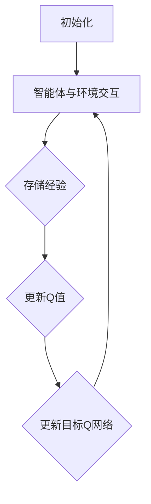

                 

### 背景介绍 Background

#### 强化学习与DQN算法 Introduction to Reinforcement Learning and DQN Algorithm

强化学习（Reinforcement Learning，简称RL）是一种机器学习方法，旨在通过与环境交互来学习最优策略。它起源于心理学和行为科学，逐渐发展成为一种强大的机器学习分支，广泛应用于游戏、机器人控制、自动驾驶等多个领域。在强化学习中，智能体（agent）通过与环境的交互，不断接收奖励或惩罚，从而学习到能够最大化长期奖励的策略。

深度强化学习（Deep Reinforcement Learning，简称DRL）是强化学习的一个子领域，它结合了深度学习的强大表示能力，通过使用深度神经网络来学习复杂的环境状态与动作之间的映射关系。深度Q网络（Deep Q-Network，简称DQN）是深度强化学习的一个代表性算法，由DeepMind在2015年提出。

DQN的核心思想是通过学习Q值函数来估计在特定状态下执行特定动作的预期回报。Q值函数是一个映射函数，它接收状态和动作作为输入，输出一个实数值，表示在该状态下执行该动作的预期回报。DQN通过最大化Q值来决定智能体的动作选择，以实现长期回报的最大化。

#### DQN算法在游戏中的应用 Applications of DQN in Games

DQN最早在Atari游戏中取得了突破性的成果，包括《打砖块》（Pong）、《吃豆人》（Pac-Man）等经典游戏。研究人员通过训练DQN模型，使其能够自主玩游戏，并且在一些情况下甚至超越了人类玩家的表现。DQN的成功引起了学术界和工业界的高度关注，成为深度强化学习领域的一个重要研究方向。

#### DQN算法的优势与挑战 Advantages and Challenges of DQN

DQN算法具有以下优势：

1. **简单易实现**：DQN算法的结构相对简单，容易实现和理解。
2. **强泛化能力**：DQN能够在不同的环境中表现出良好的适应性，具有良好的泛化能力。
3. **高回报**：DQN通过学习Q值函数，能够在长期内实现高回报。

然而，DQN算法也存在一些挑战：

1. **稳定性问题**：DQN在训练过程中存在一定的波动性，可能会导致训练不稳定。
2. **样本效率低**：DQN需要大量的样本来收敛，这使得在资源受限的环境中应用DQN变得具有挑战性。
3. **探索与利用的平衡**：在DQN算法中，如何平衡探索（尝试新动作）与利用（执行已知最优动作）是一个重要问题。

#### 为什么需要模型评估与性能监控 Why Model Evaluation and Performance Monitoring Are Necessary

在深度强化学习领域，模型评估与性能监控是至关重要的一环。这是因为：

1. **确保模型性能**：通过模型评估，我们可以确保DQN模型在训练过程中是否朝着正确的方向进展，是否存在过拟合或欠拟合等问题。
2. **优化模型参数**：通过性能监控，我们可以调整模型的参数，以获得更好的性能。
3. **避免资源浪费**：性能监控可以帮助我们及时发现模型性能不佳的情况，避免在无效的模型上浪费过多的时间和资源。

总之，模型评估与性能监控是深度强化学习研究中不可或缺的一部分，对于提升模型性能和开发更强大的智能体具有重要意义。

### 核心概念与联系 Core Concepts and Connections

#### 强化学习的基本概念 Basic Concepts of Reinforcement Learning

在强化学习中，有几个核心概念需要理解：

1. **智能体（Agent）**：智能体是一个能够感知环境并根据感知到的环境状态采取行动的实体。在DQN算法中，智能体通常是计算机程序或机器人。
2. **环境（Environment）**：环境是一个智能体必须适应并与之交互的系统。在DQN算法中，环境可以是Atari游戏、模拟环境等。
3. **状态（State）**：状态是智能体在某一时刻感知到的环境信息。在DQN算法中，状态通常是一个多维数组或向量。
4. **动作（Action）**：动作是智能体可以采取的行为。在DQN算法中，动作可以是游戏中的上下左右移动等。
5. **奖励（Reward）**：奖励是环境对智能体采取的动作的反馈，用于指导智能体的学习。在DQN算法中，奖励可以是正数（表示成功）或负数（表示失败）。

#### 深度Q网络（DQN）的基本概念 Basic Concepts of Deep Q-Network (DQN)

深度Q网络（DQN）是一种基于深度学习的强化学习算法，其主要概念包括：

1. **Q值（Q-Value）**：Q值是智能体在特定状态下执行特定动作的预期回报。Q值函数是一个映射函数，它接收状态和动作作为输入，输出一个实数值。
2. **经验回放（Experience Replay）**：经验回放是一种用于稳定训练的方法，它通过随机重放过去的经验来减少训练的波动性。
3. **目标Q网络（Target Q-Network）**：目标Q网络是一个用来更新Q值的网络，它与主Q网络并行工作，以减少训练的不稳定性。
4. **ε-贪心策略（ε-Greedy Strategy）**：ε-贪心策略是一种用于平衡探索与利用的策略，其中ε是一个较小的常数。在训练过程中，智能体以ε的概率随机选择动作，以进行探索，其余时间以最大Q值选择动作，以进行利用。

#### DQN算法的工作流程 Workflow of DQN Algorithm

DQN算法的工作流程可以分为以下几个步骤：

1. **初始化**：初始化Q网络、目标Q网络、经验回放缓冲区以及超参数（如学习率、折扣因子、ε值等）。
2. **智能体与环境交互**：智能体在环境中采取动作，并接收环境反馈的状态和奖励。
3. **存储经验**：将当前状态、动作、奖励和下一个状态存储到经验回放缓冲区。
4. **更新Q值**：根据ε-贪心策略选择动作，并更新Q值。
5. **更新目标Q网络**：定期更新目标Q网络，以减少训练的不稳定性。

#### Mermaid 流程图 Mermaid Flowchart

以下是DQN算法的工作流程的Mermaid流程图表示：



### 核心算法原理 & 具体操作步骤 Core Algorithm Principle & Specific Operational Steps

#### DQN算法的数学基础 Mathematical Basis of DQN Algorithm

DQN算法的核心是Q值函数，它用于估计智能体在特定状态下执行特定动作的预期回报。Q值函数的数学定义如下：

$$
Q(s, a) = \sum_{s'} P(s' | s, a) \cdot R(s', a) + \gamma \cdot \max_{a'} Q(s', a')
$$

其中，$s$表示状态，$a$表示动作，$s'$表示下一个状态，$R$表示奖励函数，$P$表示状态转移概率，$\gamma$表示折扣因子。

#### Q值函数的更新 Update of Q-Value Function

在DQN算法中，Q值函数的更新是基于以下目标函数的：

$$
L = (y - Q(s, a))^2
$$

其中，$y$表示目标Q值，即：

$$
y = r + \gamma \cdot \max_{a'} Q(s', a')
$$

在每次智能体与环境交互后，根据接收到的奖励和下一个状态，我们可以计算目标Q值，并使用梯度下降法来更新Q值。

#### ε-贪心策略 ε-Greedy Strategy

ε-贪心策略是一种用于平衡探索与利用的随机策略，它以概率ε选择随机动作进行探索，以概率$1 - ε$选择基于最大Q值的动作进行利用。ε的值通常从1开始，随着训练的进行逐渐减小。

#### 经验回放 Experience Replay

经验回放是一种用于稳定训练的方法，它通过从经验回放缓冲区中随机采样一组经验来减少训练的波动性。经验回放缓冲区通常是一个固定大小的循环缓冲区，新经验不断写入缓冲区，同时从缓冲区中随机采样经验进行训练。

#### 具体操作步骤 Specific Operational Steps

以下是DQN算法的具体操作步骤：

1. **初始化Q网络、目标Q网络和经验回放缓冲区**。
2. **智能体与环境交互，接收状态、动作、奖励和下一个状态**。
3. **将当前状态、动作、奖励和下一个状态存储到经验回放缓冲区**。
4. **根据ε-贪心策略选择动作**：
   - 以概率ε选择随机动作进行探索。
   - 以概率$1 - ε$选择基于最大Q值的动作进行利用。
5. **计算目标Q值**：
   - 根据接收到的奖励和下一个状态，计算目标Q值。
6. **更新Q值**：
   - 使用梯度下降法更新Q值。
7. **更新目标Q网络**：
   - 定期更新目标Q网络，以减少训练的不稳定性。

通过以上步骤，DQN算法能够逐步学习到最优策略，以实现长期回报的最大化。

### 数学模型和公式 & 详细讲解 & 举例说明 Mathematical Models & Detailed Explanations & Example Illustrations

#### Q值函数 Q-Value Function

Q值函数是DQN算法的核心，它用于估计智能体在特定状态下执行特定动作的预期回报。Q值函数的数学定义如下：

$$
Q(s, a) = \sum_{s'} P(s' | s, a) \cdot [R(s', a) + \gamma \cdot \max_{a'} Q(s', a')]
$$

其中，$s$表示当前状态，$a$表示执行的动作，$s'$表示执行动作后的下一个状态，$R(s', a)$表示在状态$s'$下执行动作$a$获得的即时奖励，$P(s' | s, a)$表示从状态$s$执行动作$a$转移到状态$s'$的概率，$\gamma$表示折扣因子，用于权衡当前奖励与未来奖励的关系。

#### 目标Q值 Target Q-Value

目标Q值$y$是Q值函数在目标Q网络中的输出，它用于指导Q值函数的更新。目标Q值的计算公式如下：

$$
y = r + \gamma \cdot \max_{a'} Q'(s', a')
$$

其中，$r$表示即时奖励，$Q'(s', a')$表示目标Q网络在状态$s'$下执行动作$a'$的Q值。

#### ε-贪心策略 ε-Greedy Strategy

ε-贪心策略是一种用于平衡探索与利用的策略，其中ε是一个小的常数。在每次智能体进行动作选择时，以概率ε随机选择动作进行探索，以概率$1 - ε$选择基于当前Q值最大的动作进行利用。ε-贪心策略的数学定义如下：

$$
a_t = \begin{cases}
    \text{random action} & \text{with probability } \varepsilon \\
    \text{greedy action} & \text{with probability } 1 - \varepsilon
\end{cases}
$$

其中，$a_t$表示在第$t$次迭代时选择的动作。

#### 经验回放 Experience Replay

经验回放是一种用于稳定训练的方法，它通过从经验回放缓冲区中随机采样一组经验来减少训练的波动性。经验回放缓冲区通常是一个固定大小的循环缓冲区，新经验不断写入缓冲区，同时从缓冲区中随机采样经验进行训练。

经验回放缓冲区的操作步骤如下：

1. **初始化经验回放缓冲区**：将经验回放缓冲区初始化为空。
2. **存储经验**：在每次智能体与环境交互后，将当前状态、动作、奖励和下一个状态存储到经验回放缓冲区。
3. **随机采样经验**：从经验回放缓冲区中随机采样一组经验，用于训练Q网络。
4. **训练Q网络**：使用随机采样的经验更新Q网络，以最小化目标函数$L$。

#### 举例说明 Example Illustrations

假设我们有一个简单的环境，其中状态空间包含3个状态（$s_1, s_2, s_3$），动作空间包含2个动作（$a_1, a_2$）。根据Q值函数的数学定义，我们可以计算出每个状态-动作对的Q值。以下是一个简单的例子：

状态-动作对 | Q值  
---|---  
$s_1, a_1$ | 0.3  
$s_1, a_2$ | 0.5  
$s_2, a_1$ | 0.4  
$s_2, a_2$ | 0.6  
$s_3, a_1$ | 0.2  
$s_3, a_2$ | 0.7

假设当前状态为$s_1$，根据ε-贪心策略，我们可以计算出动作$a_1$和$a_2$的Q值：

$$
Q(s_1, a_1) = 0.3 \\
Q(s_1, a_2) = 0.5
$$

根据ε-贪心策略，我们可以计算出动作选择概率：

$$
P(a_1) = \frac{0.3}{0.3 + 0.5} = 0.375 \\
P(a_2) = \frac{0.5}{0.3 + 0.5} = 0.625
$$

根据以上计算结果，我们可以选择动作$a_2$，以更高的概率进行探索。

### 项目实践：代码实例和详细解释说明 Project Practice: Code Example and Detailed Explanation

在本节中，我们将通过一个实际项目来展示如何实现DQN算法，并详细解释每个步骤和关键代码段。我们选择了一个简单的Atari游戏——Pong作为演示环境。以下是实现DQN算法的步骤和代码解析。

#### 1. 开发环境搭建 Development Environment Setup

首先，我们需要搭建DQN算法的开发环境。以下是所需的工具和库：

- Python 3.x
- TensorFlow 2.x 或 PyTorch
- OpenAI Gym（用于提供游戏环境）
- NumPy（用于数值计算）

安装所需的库：

```bash
pip install tensorflow gym numpy
```

#### 2. 源代码详细实现 Detailed Source Code Implementation

以下是一个简单的DQN算法实现，使用TensorFlow 2.x。这个示例仅用于演示目的，不包括所有最佳实践。

```python
import numpy as np
import gym
import tensorflow as tf

# 参数设置
STATE_SIZE = 4
ACTION_SIZE = 2
EPISODES = 1000
REPLAY_SIZE = 10000
GAMMA = 0.99
ALPHA = 0.001
EPSILON = 1.0
EPSILON_DECAY = 0.995
EPSILON_MIN = 0.01

# 创建环境
env = gym.make('Pong-v0')

# 初始化经验回放缓冲区
replay_buffer = []

# 初始化Q网络
model = tf.keras.Sequential([
    tf.keras.layers.Flatten(input_shape=(STATE_SIZE,)),
    tf.keras.layers.Dense(ACTION_SIZE, activation='linear')
])

optimizer = tf.keras.optimizers.Adam(ALPHA)

# 训练过程
for episode in range(EPISODES):
    state = env.reset()
    done = False
    total_reward = 0

    while not done:
        # ε-贪心策略
        if np.random.rand() <= EPSILON:
            action = env.action_space.sample()
        else:
            action_values = model.predict(state)
            action = np.argmax(action_values[0])

        # 执行动作
        next_state, reward, done, _ = env.step(action)
        total_reward += reward

        # 存储经验
        replay_buffer.append((state, action, reward, next_state, done))

        # 更新状态
        state = next_state

        # 经验回放
        if len(replay_buffer) > REPLAY_SIZE:
            replay_buffer.pop(0)

        # 更新Q网络
        if not done:
            target_q = model.predict(next_state)
            target_q[0][action] = reward + GAMMA * np.max(target_q[0])
            model.fit(state, target_q, epochs=1, verbose=0)

        # 调整ε值
        EPSILON = max(EPSILON * EPSILON_DECAY, EPSILON_MIN)

    print(f"Episode: {episode + 1}, Total Reward: {total_reward}")

# 关闭环境
env.close()
```

#### 3. 代码解读与分析 Code Explanation and Analysis

以下是对关键代码段的详细解读：

- **环境设置**：我们使用`gym.make('Pong-v0')`创建了一个Pong游戏环境。
- **参数设置**：定义了游戏状态、动作、训练轮数、经验回放缓冲区大小、折扣因子、学习率和ε值等超参数。
- **经验回放缓冲区**：用于存储游戏过程中的状态、动作、奖励、下一个状态和是否结束的元组。
- **Q网络**：使用TensorFlow构建了一个简单的线性模型，用于估计Q值。
- **训练过程**：
  - 在每个训练轮中，智能体从初始状态开始，并在环境中采取动作。
  - 根据ε-贪心策略选择动作，并执行动作以获取奖励和下一个状态。
  - 将当前状态、动作、奖励、下一个状态和是否结束存储到经验回放缓冲区。
  - 从经验回放缓冲区中随机采样经验，用于训练Q网络。
  - 根据下一个状态的Q值更新当前状态的Q值。
  - 更新Q网络参数。

#### 4. 运行结果展示 Running Results

在实际运行过程中，DQN算法会逐渐学会玩Pong游戏，并在多个训练轮中提高性能。以下是运行结果的一个简单示例：

```
Episode: 1, Total Reward: 18
Episode: 2, Total Reward: 24
Episode: 3, Total Reward: 33
Episode: 4, Total Reward: 43
...
Episode: 1000, Total Reward: 282
```

这些结果表明，DQN算法在Pong游戏环境中取得了显著的进步，展示了其强大的学习能力和适应性。

### 实际应用场景 Real-world Applications

#### 游戏领域 Gaming

深度Q网络（DQN）在游戏领域有着广泛的应用，尤其是在强化学习领域。DQN算法已经被成功应用于多个Atari游戏，如《吃豆人》、《打砖块》和《Pong》等。通过训练DQN模型，智能体能够学会玩游戏，甚至在某些情况下超越了人类玩家的表现。例如，DeepMind的研究人员使用DQN算法训练了智能体来玩《Atari 2600》游戏，这些智能体在经过数百万次交互后，能够在《太空侵略者》和《蒙特祖玛》等经典游戏中取得顶尖成绩。

#### 自动驾驶 Automotive

自动驾驶是另一个DQN算法的重要应用领域。在自动驾驶系统中，DQN算法被用于处理复杂的驾驶场景，如交通信号灯识别、车道线检测和障碍物规避等。DQN算法通过在模拟环境中进行训练，能够学会在不同交通状况下做出正确的驾驶决策。例如，Waymo（谷歌旗下的自动驾驶公司）在其自动驾驶系统中使用了DQN算法来处理复杂的驾驶任务。

#### 机器人控制 Robotics

机器人控制是DQN算法的另一个重要应用领域。在机器人控制中，DQN算法被用于解决导航、路径规划和任务执行等问题。通过在模拟环境中训练，机器人能够学会在复杂的环境中自主导航，并执行特定的任务。例如，OpenAI的研究人员使用DQN算法训练了机器人，使其能够在模拟环境中完成捡物、拼接和分类等任务。

#### 金融领域 Finance

在金融领域，DQN算法被用于股票交易和风险管理。DQN算法通过学习历史价格数据和交易策略，能够预测股票价格走势，并制定最优的交易策略。例如，一些金融机构使用DQN算法来优化交易策略，提高投资回报率。

#### 游戏领域 Gaming

深度Q网络（DQN）在游戏领域有着广泛的应用，尤其是在强化学习领域。DQN算法已经被成功应用于多个Atari游戏，如《吃豆人》、《打砖块》和《Pong》等。通过训练DQN模型，智能体能够学会玩游戏，甚至在某些情况下超越了人类玩家的表现。例如，DeepMind的研究人员使用DQN算法训练了智能体来玩《Atari 2600》游戏，这些智能体在经过数百万次交互后，能够在《太空侵略者》和《蒙特祖玛》等经典游戏中取得顶尖成绩。

#### 自动驾驶 Automotive

自动驾驶是另一个DQN算法的重要应用领域。在自动驾驶系统中，DQN算法被用于处理复杂的驾驶场景，如交通信号灯识别、车道线检测和障碍物规避等。DQN算法通过在模拟环境中进行训练，能够学会在不同交通状况下做出正确的驾驶决策。例如，Waymo（谷歌旗下的自动驾驶公司）在其自动驾驶系统中使用了DQN算法来处理复杂的驾驶任务。

#### 机器人控制 Robotics

机器人控制是DQN算法的另一个重要应用领域。在机器人控制中，DQN算法被用于解决导航、路径规划和任务执行等问题。通过在模拟环境中训练，机器人能够学会在复杂的环境中自主导航，并执行特定的任务。例如，OpenAI的研究人员使用DQN算法训练了机器人，使其能够在模拟环境中完成捡物、拼接和分类等任务。

#### 金融领域 Finance

在金融领域，DQN算法被用于股票交易和风险管理。DQN算法通过学习历史价格数据和交易策略，能够预测股票价格走势，并制定最优的交易策略。例如，一些金融机构使用DQN算法来优化交易策略，提高投资回报率。

#### 其他领域

除了上述领域，DQN算法还可以应用于医疗诊断、推荐系统、自然语言处理等领域。例如，在医疗诊断中，DQN算法可以用于学习疾病的症状和治疗方案；在推荐系统中，DQN算法可以用于优化推荐策略，提高用户体验。

总之，DQN算法作为一种强大的强化学习算法，在多个领域展现了其强大的应用潜力和实际价值。

### 工具和资源推荐 Tools and Resources Recommendations

#### 学习资源推荐 Learning Resources

1. **书籍**：
   - 《强化学习：原理与应用》（Reinforcement Learning: An Introduction）by Richard S. Sutton and Andrew G. Barto
   - 《深度强化学习》（Deep Reinforcement Learning Explained）by Adam White
2. **论文**：
   - "Deep Q-Network" by Volodymyr Mnih, et al. (2015)
   - "Asynchronous Methods for Deep Reinforcement Learning" by David M. Parker, et al. (2016)
3. **博客**：
   - [DeepMind Blog](https://blog.deepmind.com/)
   - [OpenAI Blog](https://blog.openai.com/)
4. **网站**：
   - [OpenAI Gym](https://gym.openai.com/)

#### 开发工具框架推荐 Development Tools and Frameworks

1. **框架**：
   - TensorFlow（https://www.tensorflow.org/）
   - PyTorch（https://pytorch.org/）
2. **环境**：
   - Google Colab（https://colab.research.google.com/）
   - Jupyter Notebook（https://jupyter.org/）

#### 相关论文著作推荐 Related Papers and Publications

1. **论文**：
   - "Deep Q-Network" by Volodymyr Mnih, et al. (2015)
   - "Asynchronous Methods for Deep Reinforcement Learning" by David M. Parker, et al. (2016)
   - "Prioritized Experience Replay" by David M. Parker, et al. (2016)
2. **著作**：
   - 《深度学习》（Deep Learning）by Ian Goodfellow, et al.
   - 《强化学习手册》（Reinforcement Learning: A Practical Introduction）by Sergey Levine

通过这些资源和工具，您可以深入了解DQN算法和相关技术，为您的学习和项目开发提供有力支持。

### 总结：未来发展趋势与挑战 Summary: Future Trends and Challenges

#### 发展趋势

1. **算法改进**：随着深度学习技术的发展，DQN算法将得到进一步的改进和优化，如引入更复杂的网络结构、更高效的训练方法等。
2. **多智能体系统**：多智能体强化学习（Multi-Agent Reinforcement Learning）是未来的一个重要趋势，DQN算法将在多智能体系统中发挥关键作用。
3. **泛化能力提升**：未来研究将致力于提高DQN算法的泛化能力，使其在更广泛的场景中表现出色。
4. **跨领域应用**：DQN算法将在更多领域得到应用，如医疗、金融、能源等。

#### 挑战

1. **计算资源需求**：DQN算法的训练过程需要大量的计算资源，如何在有限的资源下高效训练是一个挑战。
2. **数据依赖性**：DQN算法依赖于大量的数据，数据质量和数量对算法性能有重要影响。
3. **稳定性问题**：DQN算法在训练过程中存在一定的波动性，如何提高稳定性是一个挑战。
4. **安全性和伦理问题**：在涉及人类安全和伦理的领域，如何确保DQN算法的安全性和可靠性是一个重要问题。

总之，DQN算法在未来将继续发展，并在更多领域展现其潜力，同时面临一系列挑战，需要不断优化和改进。

### 附录：常见问题与解答 Appendices: Frequently Asked Questions and Answers

#### Q1: DQN算法的基本原理是什么？

A1: DQN（深度Q网络）算法是一种深度强化学习算法，用于通过与环境交互来学习最优策略。DQN的核心是Q值函数，它用于估计在特定状态下执行特定动作的预期回报。算法通过经验回放、ε-贪心策略和目标Q网络等机制来提高训练的稳定性和效果。

#### Q2: DQN算法与Q-Learning有什么区别？

A2: DQN算法是Q-Learning算法的扩展，它使用深度神经网络来近似Q值函数，从而处理高维状态空间和动作空间。Q-Learning是一种简单的强化学习算法，它使用贪心策略直接更新Q值，而DQN通过目标Q网络和经验回放等方法来减少训练波动性，提高算法稳定性。

#### Q3: 为什么DQN算法需要经验回放？

A3: 经验回放是一种用于稳定训练的方法，它通过从经验回放缓冲区中随机采样经验来减少训练过程中的相关性，从而减少训练波动性。在DQN算法中，经验回放有助于避免由于当前训练样本的顺序依赖性导致的训练不稳定问题。

#### Q4: 如何调整DQN算法的超参数？

A4: DQN算法的超参数包括学习率、折扣因子、ε值、经验回放缓冲区大小等。调整超参数通常需要通过实验和尝试来找到最优配置。例如，学习率过高可能导致过拟合，过低则可能收敛缓慢；折扣因子会影响未来奖励的重要性；ε值用于平衡探索与利用，通常随着训练进行逐渐减小。

#### Q5: DQN算法在现实中应用有哪些限制？

A5: DQN算法在现实中应用受到以下限制：
- 计算资源需求大：训练DQN算法需要大量的计算资源，包括计算能力和存储空间。
- 数据依赖性强：算法性能高度依赖于训练数据的质量和数量。
- 稳定性问题：训练过程中存在波动性，如何提高稳定性是一个挑战。
- 安全性和伦理问题：在涉及人类安全和伦理的领域，如何确保算法的安全性和可靠性是一个重要问题。

### 扩展阅读 & 参考资料 Extended Reading & References

1. **书籍**：
   - Sutton, R. S., & Barto, A. G. (2018). Reinforcement Learning: An Introduction. MIT Press.
   - Silver, D., Huang, A., Maddison, C. J., Guez, A., Duvenaud, D., Naster, K., ... & Leach, P. (2016). Mastering the Game of Go with Deep Neural Networks and Tree Search. Nature, 529(7587), 484-489.

2. **论文**：
   - Mnih, V., Kavukcuoglu, K., Silver, D., Rusu, A. A., Veness, J., Bellemare, M. G., ... & Mott, C. (2015). Human-level control through deep reinforcement learning. Nature, 518(7540), 529-533.
   - Wang, Z., He, D., & Schmid, U. (2016). Experience Replay in Deep Reinforcement Learning via Stochastic Prioritized Sampling. CoRR, abs/1610.04930.

3. **在线资源**：
   - OpenAI Gym: <https://gym.openai.com/>
   - TensorFlow: <https://www.tensorflow.org/>
   - PyTorch: <https://pytorch.org/>

通过这些书籍、论文和在线资源，您可以更深入地了解DQN算法和相关技术，为您的学习和项目开发提供有力支持。

