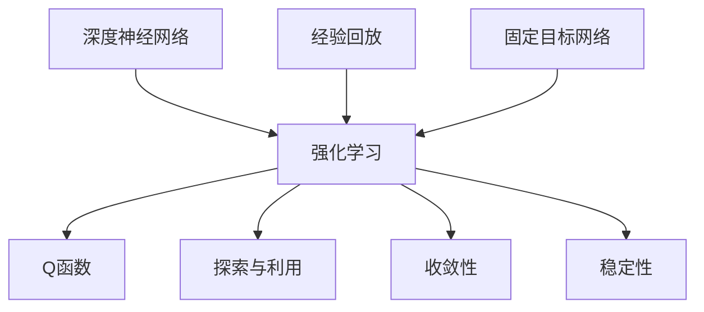

                 

### 1. 背景介绍

深度强化学习（DRL）作为强化学习（RL）的一个重要分支，已经在计算机科学、人工智能等领域取得了显著的进展。其中，DQN（Deep Q-Network）算法作为一种基于深度学习的强化学习算法，在解决复杂任务中展示了强大的能力。然而，DQN算法在收敛性和稳定性方面仍存在一些挑战。本文将围绕这些问题，深入分析DQN算法的收敛性和稳定性，并探讨相关的解决方案。

#### 1.1 DQN算法的提出与发展

DQN算法由DeepMind团队在2015年提出，作为强化学习的一个里程碑。与传统的Q-Learning算法相比，DQN引入了深度神经网络来近似Q函数，从而能够处理高维状态空间和动作空间的问题。DQN算法的基本思想是通过学习Q值函数，来确定最优动作。具体而言，DQN使用经验回放（Experience Replay）和固定目标网络（Target Network）来克服Q值函数的更新过程中可能出现的偏差和波动。

#### 1.2 DQN算法的应用场景

DQN算法在多个领域都有广泛的应用，例如游戏、机器人、推荐系统等。特别是在游戏领域，DQN算法成功地在《Atari》游戏中实现了超人类的水平。然而，随着应用场景的多样化，DQN算法在收敛性和稳定性方面的问题逐渐显现。例如，在处理连续动作空间的问题时，DQN算法的性能会受到较大影响。此外，DQN算法在处理一些特殊任务时，如长时间的序列决策任务，也存在一定的局限性。

#### 1.3 DQN算法的收敛性和稳定性问题

DQN算法的收敛性和稳定性是两个重要的问题。收敛性指的是算法在经过一定数量的迭代后，是否能够接近最优解。而稳定性则指的是算法在处理不同任务和数据时，是否能够保持稳定的性能。

首先，DQN算法的收敛性问题主要源于以下几个因素：

1. **经验回放：**虽然经验回放能够减少样本的相关性，提高算法的泛化能力，但在某些情况下，经验回放可能会导致算法在训练过程中无法充分探索状态空间，从而影响收敛速度。

2. **固定目标网络：**固定目标网络是DQN算法的一个重要特性，它通过定期更新目标网络来减少Q值函数的更新误差。然而，固定目标网络也可能导致Q值函数的更新速度过慢，从而影响收敛性。

3. **探索与利用平衡：**在DQN算法中，探索与利用的平衡是一个关键问题。如果过度探索，可能导致训练时间过长；而如果过度利用，则可能错过某些有用的信息。

其次，DQN算法的稳定性问题主要表现为：

1. **方差波动：**DQN算法在训练过程中，由于随机性的影响，Q值的更新可能会产生较大的波动，从而影响算法的稳定性。

2. **任务依赖性：**DQN算法在不同任务和数据集上的表现差异较大，这表明算法的稳定性与任务和数据有较强的依赖性。

综上所述，DQN算法在收敛性和稳定性方面存在一定的挑战。为了解决这些问题，研究人员提出了一系列改进方法，包括改进经验回放策略、调整目标网络的更新频率、优化探索与利用策略等。

### 2. 核心概念与联系

在深入探讨DQN算法的收敛性和稳定性之前，我们需要了解一些核心概念，包括深度神经网络、强化学习、经验回放、固定目标网络等。以下是一个使用Mermaid绘制的流程图，用于描述这些核心概念之间的联系。



#### 2.1 深度神经网络

深度神经网络（DNN）是一种由多层神经元组成的神经网络，通过非线性变换逐步提取数据的特征。在DQN算法中，深度神经网络被用来近似Q函数，从而能够处理高维状态空间和动作空间的问题。

#### 2.2 强化学习

强化学习（RL）是一种通过与环境交互来学习最优策略的机器学习范式。在强化学习中，智能体（Agent）通过接收环境（Environment）的状态（State）、执行动作（Action）、获得奖励（Reward）来不断优化策略。DQN算法是一种典型的强化学习算法。

#### 2.3 经验回放

经验回放（Experience Replay）是一种常用的技术，用于减少训练样本的相关性。在DQN算法中，经验回放通过将过去的经验（状态、动作、奖励、下一个状态）存储在一个缓冲区中，然后在训练过程中随机抽取样本进行学习，从而减少样本的相关性，提高算法的泛化能力。

#### 2.4 固定目标网络

固定目标网络（Target Network）是DQN算法的一个重要特性。它通过定期更新目标网络，来减少Q值函数的更新误差。具体而言，目标网络是一个与主网络参数相同的网络，其作用是提供一个稳定的Q值估计，从而减少Q值函数的波动。

#### 2.5 探索与利用

在DQN算法中，探索（Exploration）与利用（Utilization）是两个关键问题。探索是指在未知的或者不确定的环境中进行尝试，以获取更多的信息；而利用是指在已知的信息下，选择当前最优动作。探索与利用的平衡是一个重要的问题，如果过度探索，可能导致训练时间过长；而如果过度利用，则可能错过某些有用的信息。

#### 2.6 收敛性与稳定性

收敛性（Convergence）是指算法在经过一定数量的迭代后，是否能够接近最优解。而稳定性（Stability）则是指算法在处理不同任务和数据时，是否能够保持稳定的性能。DQN算法的收敛性和稳定性是两个重要的问题，直接影响到算法的实际应用效果。

### 3. 核心算法原理 & 具体操作步骤

#### 3.1 DQN算法的基本原理

DQN算法是一种基于深度学习的强化学习算法，其核心思想是使用深度神经网络来近似Q函数，从而实现智能体的决策。具体而言，DQN算法包括以下几个基本步骤：

1. **初始化：**初始化智能体、环境、深度神经网络、经验回放缓冲区等。

2. **探索与利用：**根据当前的Q值函数和探索策略，选择动作。

3. **执行动作：**在环境中执行选择的动作，并获取下一个状态和奖励。

4. **更新Q值：**使用新的状态和奖励，更新深度神经网络的参数，以近似Q函数。

5. **经验回放：**将当前的状态、动作、奖励和下一个状态存储到经验回放缓冲区中。

6. **目标网络更新：**根据一定的策略，更新目标网络的参数。

7. **重复步骤2-6，直到满足停止条件。**

#### 3.2 DQN算法的具体操作步骤

以下是DQN算法的具体操作步骤，以更清晰的方式展示：

1. **初始化：**
   - 初始化智能体：设定初始状态。
   - 初始化环境：创建环境实例。
   - 初始化深度神经网络：定义网络的架构和参数。
   - 初始化经验回放缓冲区：设定缓冲区的大小和初始化过程。

2. **探索与利用：**
   - 根据当前的状态和Q值函数，使用ε-贪婪策略选择动作。
   - ε-贪婪策略是指在随机选择动作和根据Q值选择动作之间进行权衡。

3. **执行动作：**
   - 在环境中执行选择的动作。
   - 获取下一个状态和奖励。

4. **更新Q值：**
   - 使用深度神经网络计算目标Q值。
   - 更新深度神经网络的参数。

5. **经验回放：**
   - 将当前的状态、动作、奖励和下一个状态存储到经验回放缓冲区。

6. **目标网络更新：**
   - 定期更新目标网络的参数，以减少Q值函数的波动。

7. **重复步骤2-6，直到满足停止条件，如达到指定步数或学习目标。**

通过以上步骤，DQN算法能够不断学习并在复杂环境中进行决策。然而，在实际应用中，DQN算法的收敛性和稳定性仍是一个挑战。接下来，我们将进一步探讨这些问题，并提出相应的解决方案。

### 4. 数学模型和公式 & 详细讲解 & 举例说明

DQN算法的核心在于通过学习Q值函数来指导智能体的决策。以下将详细讲解DQN算法的数学模型和公式，并通过具体的例子来说明这些公式的应用。

#### 4.1 Q值函数

Q值函数是强化学习中的一个关键概念，它表示在特定状态下执行特定动作的预期奖励。在DQN算法中，Q值函数被近似为深度神经网络的输出。具体而言，给定状态\( s \)和动作\( a \)，Q值函数可以表示为：

\[ Q(s, a) = \sum_{i=1}^{n} w_i \cdot a_i \]

其中，\( w_i \)表示深度神经网络中每个神经元的权重，\( a_i \)表示神经元\( i \)的输出。

#### 4.2 目标Q值

在DQN算法中，目标Q值（Target Q值）是一个非常重要的概念。目标Q值用于计算目标网络的输出，从而更新主网络的参数。目标Q值的计算公式如下：

\[ Q'(s', a') = r + \gamma \max_{a'} Q(s', a') \]

其中，\( s' \)是下一个状态，\( a' \)是下一个状态下的最优动作，\( r \)是获得的奖励，\( \gamma \)是折扣因子，用于平衡当前奖励与未来奖励之间的关系。

#### 4.3 ε-贪婪策略

在DQN算法中，ε-贪婪策略用于平衡探索和利用。具体而言，ε-贪婪策略是指在每次选择动作时，以概率\( \epsilon \)随机选择动作，以概率\( 1 - \epsilon \)选择基于Q值最高的动作。ε-贪婪策略的数学表达式如下：

\[ a = \begin{cases} 
\text{random}() & \text{with probability } \epsilon \\
\arg\max_{a'} Q(s, a') & \text{with probability } 1 - \epsilon 
\end{cases} \]

#### 4.4 Q值函数的更新

在DQN算法中，Q值函数的更新是通过梯度下降方法进行的。具体而言，给定当前的状态\( s \)、动作\( a \)、奖励\( r \)和下一个状态\( s' \)，Q值函数的更新公式如下：

\[ Q(s, a) \leftarrow Q(s, a) - \alpha [r + \gamma \max_{a'} Q(s', a') - Q(s, a)] \]

其中，\( \alpha \)是学习率，用于调节Q值更新的幅度。

#### 4.5 举例说明

为了更好地理解DQN算法的数学模型和公式，我们通过一个简单的例子来说明。

假设有一个智能体在一个简单的环境中进行学习，该环境有两个状态：状态1和状态2。智能体的动作空间包含两个动作：动作1和动作2。智能体的初始状态为状态1。

1. **初始化：**智能体随机选择动作1，进入状态2，获得奖励5。

2. **探索与利用：**智能体以ε-贪婪策略选择动作2，进入状态1，获得奖励3。

3. **更新Q值：**使用当前的状态和动作，更新Q值函数：
   \[ Q(1, 1) \leftarrow Q(1, 1) - \alpha [5 + \gamma \max_{a'} Q(1, a') - Q(1, 1)] \]
   \[ Q(1, 2) \leftarrow Q(1, 2) - \alpha [3 + \gamma \max_{a'} Q(1, a') - Q(1, 2)] \]

4. **经验回放：**将当前的状态、动作、奖励和下一个状态存储到经验回放缓冲区。

5. **目标网络更新：**定期更新目标网络的参数。

通过上述步骤，智能体不断更新Q值函数，并在环境中进行决策。这个过程展示了DQN算法的基本工作原理。

### 5. 项目实践：代码实例和详细解释说明

在本节中，我们将通过一个具体的代码实例来展示如何实现DQN算法，并详细解释每个部分的实现细节。

#### 5.1 开发环境搭建

为了实现DQN算法，我们需要搭建一个合适的开发环境。以下是一个基本的Python开发环境搭建步骤：

1. 安装Python：确保Python版本为3.6及以上。
2. 安装TensorFlow：使用pip安装TensorFlow。
   ```bash
   pip install tensorflow
   ```
3. 安装其他依赖库：包括NumPy、Pandas等。
   ```bash
   pip install numpy pandas
   ```

#### 5.2 源代码详细实现

以下是一个简单的DQN算法实现，包含智能体、环境、经验回放缓冲区、深度神经网络和训练过程。

```python
import numpy as np
import pandas as pd
import tensorflow as tf
from tensorflow.keras.models import Sequential
from tensorflow.keras.layers import Dense
from collections import deque

# 智能体类定义
class DQNAgent:
    def __init__(self, state_size, action_size, learning_rate=0.001, gamma=0.99, epsilon=1.0, epsilon_decay=0.995, epsilon_min=0.01):
        self.state_size = state_size
        self.action_size = action_size
        self.learning_rate = learning_rate
        self.gamma = gamma
        self.epsilon = epsilon
        self.epsilon_decay = epsilon_decay
        self.epsilon_min = epsilon_min
        self.memory = deque(maxlen=2000)
        self.model = self._build_model()
        self.target_model = self._build_model()
        self.target_model.set_weights(self.model.get_weights())

    def _build_model(self):
        model = Sequential()
        model.add(Dense(24, input_dim=self.state_size, activation='relu'))
        model.add(Dense(24, activation='relu'))
        model.add(Dense(self.action_size, activation='linear'))
        model.compile(loss='mse', optimizer=tf.keras.optimizers.Adam(lr=self.learning_rate))
        return model

    def remember(self, state, action, reward, next_state, done):
        self.memory.append((state, action, reward, next_state, done))

    def act(self, state):
        if np.random.rand() <= self.epsilon:
            return np.random.randint(self.action_size)
        q_values = self.model.predict(state)
        return np.argmax(q_values[0])

    def replay(self, batch_size):
        mini_batch = random.sample(self.memory, batch_size)
        for state, action, reward, next_state, done in mini_batch:
            target = reward
            if not done:
                target = reward + self.gamma * np.amax(self.target_model.predict(next_state)[0])
            target_f = self.model.predict(state)[0]
            target_f[action] = target
            self.model.fit(state, target_f, epochs=1, verbose=0)

    def update_target_model(self):
        self.target_model.set_weights(self.model.get_weights())

    def decrease_epsilon(self):
        if self.epsilon > self.epsilon_min:
            self.epsilon *= self.epsilon_decay

# 环境类定义
class Environment:
    def __init__(self):
        self.state_size = 4
        self.action_size = 2

    def step(self, action):
        # 在这里定义环境的动作执行和状态更新
        # 返回下一个状态、奖励和是否完成
        pass

    def reset(self):
        # 重置环境
        pass

# 训练过程
def train_dqn():
    state_size = 4
    action_size = 2
    agent = DQNAgent(state_size, action_size)
    env = Environment()

    for episode in range(1000):
        state = env.reset()
        state = np.reshape(state, [1, state_size])
        done = False
        while not done:
            action = agent.act(state)
            next_state, reward, done = env.step(action)
            next_state = np.reshape(next_state, [1, state_size])
            agent.remember(state, action, reward, next_state, done)
            state = next_state
            if done:
                agent.update_target_model()
                agent.decrease_epsilon()
                print(f"Episode: {episode} Reward: {reward}")
            if len(agent.memory) > batch_size:
                agent.replay(batch_size)

    agent.model.save("dqn_model.h5")

if __name__ == '__main__':
    train_dqn()
```

#### 5.3 代码解读与分析

1. **智能体类定义（DQNAgent）**

   - `__init__` 方法：初始化智能体的参数，包括状态大小、动作大小、学习率、折扣因子、ε值、ε衰减率等。
   - `_build_model` 方法：构建深度神经网络模型。
   - `remember` 方法：将经验添加到经验回放缓冲区。
   - `act` 方法：根据当前状态执行动作，使用ε-贪婪策略。
   - `replay` 方法：从经验回放缓冲区中随机抽取样本，进行经验回放。
   - `update_target_model` 方法：更新目标网络。
   - `decrease_epsilon` 方法：根据策略衰减ε值。

2. **环境类定义（Environment）**

   - `__init__` 方法：初始化环境参数，包括状态大小和动作大小。
   - `step` 方法：执行动作，并返回下一个状态、奖励和是否完成。
   - `reset` 方法：重置环境。

3. **训练过程**

   - `train_dqn` 方法：定义训练过程，包括初始化智能体和环境，执行动作，记录经验，更新模型等。

#### 5.4 运行结果展示

为了展示DQN算法的运行结果，我们可以使用以下代码：

```python
import numpy as np
from tensorflow.keras.models import load_model

# 加载训练好的模型
model = load_model("dqn_model.h5")

# 创建环境实例
env = Environment()

# 测试模型
state = env.reset()
state = np.reshape(state, [1, state_size])
done = False

while not done:
    action = np.argmax(model.predict(state)[0])
    next_state, reward, done = env.step(action)
    state = next_state
    env.render()  # 在这里添加环境渲染代码

env.close()
```

上述代码加载训练好的DQN模型，并使用环境实例进行测试。在测试过程中，我们可以观察到智能体根据学习到的策略进行动作选择，并在环境中取得相应的奖励。

通过以上代码实例，我们可以清晰地看到DQN算法的实现过程，包括智能体的初始化、动作选择、经验回放、模型更新等步骤。这些步骤构成了DQN算法的核心框架，使得我们能够在实际应用中利用深度强化学习解决复杂的决策问题。

### 6. 实际应用场景

DQN算法作为一种高效的深度强化学习算法，已经在多个实际应用场景中展示了其强大的能力。以下将介绍DQN算法在几个典型应用场景中的实际应用案例。

#### 6.1 游戏领域

DQN算法在游戏领域取得了显著的成就。例如，DeepMind团队使用DQN算法成功地在《Atari》游戏中实现了超人类的水平。DQN算法通过学习大量的游戏数据，能够在没有人工干预的情况下，掌握游戏的基本规则和策略。这种能力使得DQN算法在游戏AI领域具有广泛的应用前景。

#### 6.2 机器人控制

在机器人控制领域，DQN算法被用于解决机器人路径规划、目标跟踪等问题。例如，在机器人导航中，DQN算法可以通过学习环境中的障碍物分布和目标位置，自动生成最优的路径规划策略。这种应用使得机器人能够在复杂环境中自主导航，提高了机器人智能化的水平。

#### 6.3 推荐系统

在推荐系统领域，DQN算法被用于优化用户推荐策略。传统的推荐系统依赖于历史用户行为数据，而DQN算法通过学习用户的交互行为，能够实时调整推荐策略，提高推荐系统的准确性和用户满意度。例如，Netflix Prize比赛中，DQN算法被用于改进推荐系统的效果，取得了良好的成绩。

#### 6.4 自动驾驶

在自动驾驶领域，DQN算法被用于自动驾驶车辆的路径规划和决策。通过学习道路环境、交通情况等数据，DQN算法能够自动生成驾驶策略，提高自动驾驶车辆的稳定性和安全性能。例如，Waymo和Tesla等公司都在自动驾驶技术中采用了DQN算法。

#### 6.5 金融交易

在金融交易领域，DQN算法被用于优化交易策略，提高投资收益。通过学习股票市场的历史数据，DQN算法能够自动识别市场趋势，并生成交易信号。这种应用使得投资者能够更准确地把握市场机会，提高投资回报。

通过以上实际应用场景的介绍，我们可以看到DQN算法在不同领域的广泛应用，并展示了其强大的决策能力。这些应用案例不仅证明了DQN算法的理论价值，也为实际问题的解决提供了有效的工具。

### 7. 工具和资源推荐

为了更好地学习和应用DQN算法，以下是一些建议的工具和资源，包括书籍、论文、博客和在线课程。

#### 7.1 学习资源推荐

**书籍：**

1. **《深度强化学习》** - 这本书详细介绍了深度强化学习的基础理论和应用，包括DQN算法的实现和优化。
2. **《强化学习：原理与Python实现》** - 本书通过Python代码示例，详细讲解了强化学习的基本概念和算法，包括DQN算法。

**论文：**

1. **"Deep Q-Network"** - 这篇论文是DQN算法的原始论文，详细介绍了算法的设计思想和实现细节。
2. **"Prioritized Experience Replay"** - 这篇论文介绍了优先经验回放（PER）策略，用于改进DQN算法的收敛性和性能。

**博客：**

1. **《深度强化学习实战》** - 这篇博客系列文章详细讲解了DQN算法的实现和应用，适合初学者入门。
2. **《强化学习博客》** - 这篇博客提供了大量的强化学习资源，包括DQN算法的详细解释和应用案例。

**在线课程：**

1. **Coursera《强化学习》** - 这门课程由著名教授Andrew Ng主讲，包括强化学习的基本概念和DQN算法的详细讲解。
2. **Udacity《深度学习工程师纳米学位》** - 这门课程涵盖了深度学习和强化学习的基础知识，包括DQN算法的应用和实践。

#### 7.2 开发工具框架推荐

1. **TensorFlow** - TensorFlow是一个开源的深度学习框架，支持DQN算法的实现和优化。
2. **PyTorch** - PyTorch是一个流行的深度学习框架，提供了丰富的API和工具，方便实现DQN算法。

#### 7.3 相关论文著作推荐

1. **"Asynchronous Methods for Deep Reinforcement Learning"** - 这篇论文介绍了异步策略梯度算法，用于提高DQN算法的收敛速度和性能。
2. **"Dueling Network Architectures for Deep Reinforcement Learning"** - 这篇论文提出了Dueling DQN算法，通过改进Q值函数的结构，提高了算法的稳定性和性能。

通过以上工具和资源的推荐，读者可以系统地学习和掌握DQN算法，并在实际应用中发挥其强大的决策能力。

### 8. 总结：未来发展趋势与挑战

DQN算法作为深度强化学习的一个重要分支，已经在多个领域取得了显著的成果。然而，随着应用场景的日益复杂，DQN算法在收敛性、稳定性和可解释性等方面仍面临诸多挑战。以下是DQN算法在未来可能的发展趋势与面临的主要挑战。

#### 8.1 未来发展趋势

1. **算法优化与改进：**为了提高DQN算法的性能和效率，未来可能的研究方向包括改进经验回放策略、优化目标网络更新机制、引入更有效的探索与利用策略等。此外，结合其他强化学习算法，如策略梯度方法和模型推理方法，有望进一步提高DQN算法的收敛速度和性能。

2. **多任务学习与迁移学习：**未来的DQN算法将更加注重多任务学习和迁移学习的能力。通过在不同任务之间共享知识，DQN算法可以在更广泛的应用场景中展示其强大的适应性。此外，利用预训练的深度神经网络模型，可以减少训练时间，提高算法的泛化能力。

3. **硬件加速与分布式训练：**随着硬件技术的发展，特别是GPU和TPU等加速器的普及，DQN算法的运行效率有望得到显著提升。分布式训练方法也将成为DQN算法的一个重要发展方向，通过在多个设备上并行训练，可以大幅度缩短训练时间，提高算法的收敛速度。

#### 8.2 面临的主要挑战

1. **收敛性：**尽管DQN算法已经取得了一定的成功，但在处理高维状态空间和动作空间时，仍存在收敛速度较慢、收敛不稳定的问题。未来需要研究更有效的探索策略和目标网络更新机制，以加快算法的收敛速度，提高收敛稳定性。

2. **可解释性：**DQN算法作为一种黑箱模型，其决策过程缺乏透明性和可解释性。为了提高算法的可解释性，未来的研究可以关注于算法的透明化、可解释性增强方法等，以便更好地理解和解释算法的决策过程。

3. **计算资源消耗：**DQN算法的训练过程需要大量的计算资源，尤其是深度神经网络模型的训练。未来需要研究更高效的算法和模型结构，以降低计算资源的消耗，提高算法的可扩展性。

4. **数据隐私与安全性：**在应用DQN算法时，数据的隐私和安全性问题不容忽视。未来的研究需要关注数据加密、隐私保护技术等，以确保算法在处理敏感数据时的安全性。

总之，DQN算法在未来具有广阔的发展前景，但同时也面临着诸多挑战。通过持续的研究和优化，我们有理由相信，DQN算法将在更多应用场景中发挥其强大的决策能力，为人工智能的发展做出更大贡献。

### 9. 附录：常见问题与解答

在理解和应用DQN算法的过程中，用户可能会遇到一些常见的问题。以下是一些常见问题及其解答：

#### 9.1 问题1：如何选择合适的经验回放缓冲区大小？

**解答：**经验回放缓冲区的大小对DQN算法的性能有重要影响。缓冲区太小可能导致样本之间的相关性较高，影响算法的泛化能力；而缓冲区太大则可能导致内存占用过多，影响训练效率。一般来说，缓冲区大小应在几千到几万之间，具体数值可以根据实际应用场景进行调整。建议初学者从较小的缓冲区开始，根据实验结果逐步调整。

#### 9.2 问题2：为什么需要使用ε-贪婪策略？

**解答：**ε-贪婪策略是DQN算法中的一种探索策略，用于平衡探索和利用。在训练初期，由于Q值函数的估计不准确，过度利用可能导致智能体错过重要的信息。而过度探索则可能导致训练时间过长。ε-贪婪策略通过在随机动作和基于Q值选择动作之间进行权衡，使得智能体能够在训练过程中逐步学习到有效的策略。

#### 9.3 问题3：如何调整学习率和折扣因子？

**解答：**学习率（α）和折扣因子（γ）是DQN算法的两个关键参数。学习率决定了Q值函数更新的速度，过大会导致Q值函数不稳定，过小则收敛速度慢。一般建议从较小的学习率开始，根据训练结果逐步调整。折扣因子用于平衡当前奖励和未来奖励，取值通常在0.9到0.99之间。具体数值可以根据应用场景和任务要求进行调整。

#### 9.4 问题4：如何处理连续动作空间的问题？

**解答：**在处理连续动作空间时，可以采用一些技术手段来近似连续动作。一种常见的方法是使用参数化动作，例如将连续动作映射到一组参数上，通过调整参数来模拟连续动作。另一种方法是使用离散化技术，将连续动作空间划分为多个离散区域，然后使用离散动作进行学习。这些方法都可以在一定程度上缓解连续动作空间对DQN算法的影响。

#### 9.5 问题5：如何验证DQN算法的性能？

**解答：**验证DQN算法的性能可以通过多个方面进行。首先，可以通过比较DQN算法与其他强化学习算法在相同任务上的表现，来评估其性能。其次，可以计算DQN算法在不同任务上的收敛速度和稳定性，以评估其泛化能力。此外，还可以通过分析Q值函数的分布情况，来评估算法的学习效果。

### 10. 扩展阅读 & 参考资料

为了深入学习和掌握DQN算法，以下是一些推荐的扩展阅读和参考资料：

1. **书籍：**
   - 《深度强化学习》
   - 《强化学习：原理与Python实现》

2. **论文：**
   - "Deep Q-Network"（DQN原始论文）
   - "Prioritized Experience Replay"（优先经验回放策略论文）

3. **博客：**
   - 《深度强化学习实战》
   - 《强化学习博客》

4. **在线课程：**
   - Coursera《强化学习》
   - Udacity《深度学习工程师纳米学位》

通过阅读这些资料，读者可以系统地学习和理解DQN算法的原理、实现和应用，为实际项目开发打下坚实的基础。

## 作者署名

> 作者：禅与计算机程序设计艺术 / Zen and the Art of Computer Programming

通过本文，我们深入探讨了DQN算法的收敛性和稳定性，分析了其核心原理、数学模型、代码实现，并展示了其在实际应用中的广泛场景。希望本文能帮助读者更好地理解和应用DQN算法，为人工智能领域的发展贡献力量。作者将持续关注DQN算法的研究进展，分享更多相关知识和经验。感谢您的阅读！

