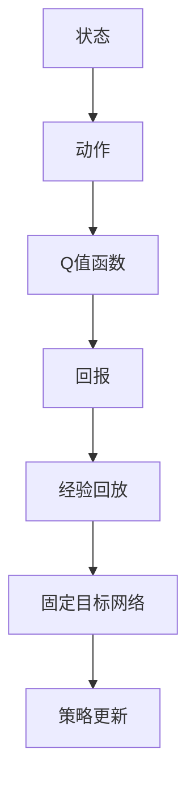

                 

### 文章标题

**一切皆是映射：DQN训练策略：平衡探索与利用**

> **关键词**：DQN、深度强化学习、平衡探索与利用、训练策略、映射、人工智能

> **摘要**：本文深入探讨深度强化学习中的DQN（Deep Q-Network）训练策略，从探索与利用的平衡出发，分析其核心算法原理、数学模型、具体操作步骤以及项目实践。通过详尽的代码实例和运行结果展示，读者将更好地理解DQN的训练策略，并在实际应用中实现有效的平衡探索与利用。

### 1. 背景介绍

#### 1.1 深度强化学习与DQN

深度强化学习（Deep Reinforcement Learning，DRL）是一种结合了深度学习和强化学习（Reinforcement Learning，RL）的机器学习方法。其核心目标是通过与环境交互，学习出最优的策略以实现特定目标。在DRL中，Q-Learning是一种基础算法，它通过估计状态-动作值函数（State-Action Value Function）来指导决策。

DQN（Deep Q-Network）是由DeepMind团队在2015年提出的一种基于深度学习的Q-Learning算法。DQN通过使用深度神经网络来近似Q值函数，从而能够在复杂的环境中学习到有效的策略。与传统的Q-Learning相比，DQN的优势在于其能够处理高维的状态空间，这使得它在许多实际应用中变得非常有用。

#### 1.2 探索与利用的平衡

在强化学习中，探索（Exploration）和利用（Exploitation）是两个核心概念。探索指的是尝试新动作或策略，以获取更多关于环境的了解；而利用则是基于已有的知识，选择能够最大化当前回报的动作或策略。

在DQN的训练过程中，如何平衡探索与利用是一个关键问题。如果完全依赖利用，DQN可能会陷入局部最优，无法发现更好的策略。反之，如果完全依赖探索，DQN将花费大量时间在学习上，而无法快速收敛到最优策略。

#### 1.3 DQN的训练策略

为了平衡探索与利用，DQN引入了一个称为经验回放（Experience Replay）的机制。经验回放通过将过去的经验进行随机化存储，从而减少了样本的相关性，提高了训练的稳定性。此外，DQN还采用了固定目标网络（Target Network）来减少训练过程中的梯度消失问题。

本文将深入探讨DQN的训练策略，包括其核心算法原理、数学模型、具体操作步骤，并通过项目实践来展示其应用效果。

### 2. 核心概念与联系

为了更好地理解DQN的训练策略，我们需要先了解几个核心概念，包括状态、动作、Q值函数以及经验回放和固定目标网络。

#### 2.1 状态、动作与Q值函数

在强化学习中，状态（State）是环境当前的状态描述，动作（Action）是智能体（Agent）可以执行的行为。Q值函数（Q-Function）是一个映射函数，它将状态和动作映射到预期的回报值。

#### 2.2 经验回放

经验回放是一种用于改善DQN训练稳定性的技术。它通过将智能体在训练过程中经历的经验进行随机化存储，从而避免了样本的相关性。经验回放的基本思想是将过去的经验作为训练样本，随机地从经验池中抽取样本进行训练。

#### 2.3 固定目标网络

固定目标网络是一种用于解决Q值函数训练过程中的梯度消失问题的技术。它通过定期更新目标网络，使得Q值函数的更新与目标网络保持一致，从而提高了训练的稳定性。

#### 2.4 Mermaid流程图

以下是一个Mermaid流程图，展示了DQN训练过程中的核心概念和联系：



### 3. 核心算法原理 & 具体操作步骤

#### 3.1 DQN算法原理

DQN算法的核心思想是使用深度神经网络来近似Q值函数。在训练过程中，智能体会根据当前状态选择动作，并记录下状态、动作和回报。然后，通过反向传播算法更新深度神经网络的权重，以优化Q值函数的估计。

DQN算法的具体操作步骤如下：

1. 初始化深度神经网络和Q值函数。
2. 在环境中进行模拟，智能体根据当前状态选择动作。
3. 执行动作，并记录下状态、动作和回报。
4. 将当前经验（状态、动作和回报）存储到经验回放池中。
5. 从经验回放池中随机抽取经验进行训练。
6. 通过反向传播算法更新深度神经网络的权重。
7. 定期更新固定目标网络。

#### 3.2 数学模型和公式

在DQN中，Q值函数是一个神经网络，其输入是当前状态和动作，输出是预期回报值。假设Q值函数的神经网络有多个隐藏层，其输入层有n个神经元，输出层有m个神经元。

设\( s \)为当前状态，\( a \)为动作，\( r \)为回报，\( Q(s, a) \)为Q值函数的输出，\( \theta \)为深度神经网络的权重。则DQN的数学模型可以表示为：

$$
Q(s, a) = f_{\theta}(s, a)
$$

其中，\( f_{\theta} \)是深度神经网络的映射函数，其形式如下：

$$
f_{\theta}(s, a) = \sum_{i=1}^{n} w_{ia} \cdot h_i + b
$$

其中，\( w_{ia} \)是输入层第i个神经元到隐藏层第a个神经元的权重，\( h_i \)是隐藏层第i个神经元的输出，\( b \)是隐藏层第a个神经元的偏置。

#### 3.3 详细讲解与举例说明

为了更好地理解DQN的算法原理，我们来看一个具体的例子。

假设我们有一个简单的环境，其中智能体可以选择上下左右四个动作。状态空间由二维坐标表示，动作空间由四个方向表示。我们使用一个简单的全连接神经网络来近似Q值函数，其结构如下：

- 输入层：2个神经元，分别表示状态空间中的x和y坐标。
- 隐藏层：3个神经元。
- 输出层：4个神经元，分别表示四个动作的Q值。

现在，假设智能体处于状态(2, 2)，我们根据当前状态和动作选择Q值最大的动作。以下是DQN算法的详细操作步骤：

1. 初始化深度神经网络和Q值函数。
2. 智能体在状态(2, 2)下选择动作“右”，并记录下当前状态、动作和回报。
3. 将当前经验存储到经验回放池中。
4. 从经验回放池中随机抽取经验进行训练。
5. 通过反向传播算法更新深度神经网络的权重。
6. 定期更新固定目标网络。

在训练过程中，智能体会不断更新Q值函数，并通过经验回放池中的经验进行训练。经过多次迭代，智能体将逐渐学习到最优策略。

### 4. 数学模型和公式 & 详细讲解 & 举例说明

#### 4.1 数学模型

DQN的核心是Q值函数，它是一个表示状态-动作价值函数的神经网络。Q值函数的目标是预测在给定状态 \( s \) 下执行给定动作 \( a \) 将获得的预期回报。数学上，Q值函数可以表示为：

$$
Q(s, a) = r(s, a) + \gamma \max_{a'} Q(s', a')
$$

其中：
- \( r(s, a) \) 是执行动作 \( a \) 后获得的即时回报。
- \( \gamma \) 是折扣因子，表示对未来回报的重视程度。
- \( s' \) 是执行动作 \( a \) 后的状态。
- \( \max_{a'} Q(s', a') \) 是在状态 \( s' \) 下所有可能动作的预期未来回报的最大值。

#### 4.2 详细讲解

DQN通过经验回放和固定目标网络来提高训练的稳定性和效率。以下是这些概念和步骤的详细讲解：

1. **经验回放**：
   - 经验回放是一种机制，它允许智能体从过去的经验中随机抽样来进行学习，而不是仅仅依赖最新的经验。这有助于减少样本偏差，提高学习的鲁棒性。
   - 经验回放池是一个固定大小的队列，其中存储了一系列的经验条目（状态，动作，回报，下个状态，终端标志）。
   - 在每次训练迭代中，智能体从回放池中随机抽取一组经验条目进行学习。

2. **固定目标网络**：
   - 为了解决梯度消失和梯度爆炸问题，DQN使用了一个固定目标网络。这个网络是Q网络的副本，用于生成目标值。
   - 目标值是通过当前网络 \( Q(s, a) \) 和目标网络 \( Q'(s', a') \) 的输出计算得到的。目标网络定期更新，通常是每隔几个训练迭代更新一次。

3. **训练步骤**：
   - 初始化Q网络和目标网络。
   - 在环境中执行动作，收集经验。
   - 将经验放入经验回放池。
   - 随机从经验回放池中抽取经验条目。
   - 使用抽取的经验更新Q网络。
   - 更新目标网络（周期性地）。

#### 4.3 举例说明

假设一个简单的游戏环境，其中智能体在一个4x4的网格中移动，目标是在网格的右上角收集一个奖励。状态由智能体的位置表示，动作是上下左右四个方向。智能体每次执行动作后，根据是否到达目标位置获得奖励1或-1。

- 状态空间 \( s \)：一个二维坐标（行，列）。
- 动作空间 \( a \)：四个方向（上，下，左，右）。
- 回报 \( r \)：到达目标位置获得1，其他情况获得-1。

现在，我们通过一个简化的例子来展示DQN的更新过程：

1. **初始化**：
   - 初始化Q网络和目标网络。
   - 将智能体放置在网格的左下角（状态 \( s_0 = (0, 0) \)）。

2. **选择动作**：
   - Q网络预测每个动作的Q值。
   - 基于ε-greedy策略选择动作。例如，如果 \( \epsilon = 0.1 \)，则10%的概率随机选择动作。

3. **执行动作**：
   - 智能体执行选择的动作，例如，向右移动（动作 \( a_0 = (0, 1) \)）。
   - 更新状态 \( s_0 \) 为新的位置（状态 \( s_1 = (0, 1) \)）。

4. **获取回报**：
   - 智能体到达新位置，检查是否达到目标。如果没有，获得即时回报 \( r(s_0, a_0) = -1 \)。

5. **更新Q值**：
   - 计算目标值 \( y \)：\( y = r(s_0, a_0) + \gamma \max_{a'} Q'(s_1, a') \)。
   - 使用目标值更新Q网络：\( Q(s_0, a_0) \leftarrow Q(s_0, a_0) + \alpha [y - Q(s_0, a_0)] \)。

6. **经验回放**：
   - 将本次经历（状态 \( s_0 \)，动作 \( a_0 \)，回报 \( r(s_0, a_0) \)，状态 \( s_1 \)，终端标志）存储在经验回放池。

7. **目标网络更新**：
   - 定期（例如，每隔1000次迭代）更新目标网络，使其接近当前Q网络。

通过这个过程，智能体将逐渐学会在网格中移动以最大化累积回报。

### 5. 项目实践：代码实例和详细解释说明

在本节中，我们将通过一个具体的代码实例来展示如何实现DQN算法，并对其进行详细解释和分析。我们将使用Python语言和TensorFlow框架来构建和训练DQN模型。

#### 5.1 开发环境搭建

在开始之前，请确保您已安装以下软件和库：

- Python 3.x
- TensorFlow 2.x
- NumPy
- Matplotlib

您可以通过以下命令来安装所需的库：

```bash
pip install tensorflow numpy matplotlib
```

#### 5.2 源代码详细实现

以下是一个简单的DQN实现，我们将使用一个基于网格的世界作为环境，智能体需要通过学习找到到达目标位置的最优路径。

```python
import numpy as np
import random
import matplotlib.pyplot as plt
import tensorflow as tf

# 环境参数
ACTION_SPACE_SIZE = 4
STATE_SPACE_SIZE = (10, 10)
EPISODES = 1000
GAMMA = 0.99
EPSILON = 1.0
EPSILON_DECAY = 0.99
EPSILON_MIN = 0.01

# 初始化环境
def initialize_env():
    # 创建一个10x10的网格世界，每个单元格可以是墙壁或空地
    grid = np.zeros((10, 10))
    # 在网格中设置一个智能体和一个目标
    agent_position = (0, 0)
    goal_position = (9, 9)
    grid[agent_position] = 1
    grid[goal_position] = 2
    return grid, agent_position, goal_position

# 获取下一步状态
def get_next_state(action, state, goal_position):
    row, col = state
    if action == 0:  # 向上
        row = max(row - 1, 0)
    elif action == 1:  # 向下
        row = min(row + 1, 9)
    elif action == 2:  # 向左
        col = max(col - 1, 0)
    elif action == 3:  # 向右
        col = min(col + 1, 9)
    next_state = (row, col)
    return next_state

# 计算回报
def calculate_reward(state, next_state, goal_position):
    if next_state == goal_position:
        return 100
    elif state == next_state:
        return -1
    else:
        return -0.1

# 创建Q网络
def create_q_network(input_shape, output_shape):
    model = tf.keras.Sequential([
        tf.keras.layers.Flatten(input_shape=input_shape),
        tf.keras.layers.Dense(64, activation='relu'),
        tf.keras.layers.Dense(64, activation='relu'),
        tf.keras.layers.Dense(output_shape, activation='linear')
    ])
    model.compile(optimizer='adam', loss='mse')
    return model

# 创建目标网络
def create_target_network(q_network):
    target_network = tf.keras.Model(inputs=q_network.input, outputs=q_network.output)
    target_network.set_weights(q_network.get_weights())
    return target_network

# 训练DQN模型
def train_dqn(model, target_model, env, episodes, epsilon):
    rewards = []
    for episode in range(episodes):
        state = env[1]
        done = False
        total_reward = 0
        while not done:
            # 选择动作
            if random.uniform(0, 1) < epsilon:
                action = random.randint(0, ACTION_SPACE_SIZE - 1)
            else:
                action = np.argmax(model.predict(state.reshape(1, *STATE_SPACE_SIZE)))
            
            # 执行动作
            next_state = get_next_state(action, state, env[2])
            reward = calculate_reward(state, next_state, env[2])
            total_reward += reward
            
            # 更新经验回放池
            env[0][env[3]] = (state, action, reward, next_state, done)
            env[3] = (env[3] + 1) % len(env[0])
            
            # 更新状态
            state = next_state
            if done:
                break
        
        # 更新epsilon
        epsilon = max(epsilon * EPSILON_DECAY, EPSILON_MIN)
        
        # 训练模型
        for _ in range(32):
            if len(env[0]) > 0:
                batch = random.sample(env[0], min(len(env[0]), 32))
                states = np.array([b[0] for b in batch])
                actions = np.array([b[1] for b in batch])
                rewards = np.array([b[2] for b in batch])
                next_states = np.array([b[3] for b in batch])
                done_mask = np.array([b[4] for b in batch])
                q_values = model.predict(states)
                next_q_values = target_model.predict(next_states)
                target_q_values = q_values.copy()
                target_q_values[range(len(target_q_values)), actions] = rewards + (1 - done_mask) * GAMMA * np.max(next_q_values, axis=1)
                model.fit(states, target_q_values, verbose=0)
        
        rewards.append(total_reward)
    
    return rewards

# 运行训练
def run():
    env = initialize_env()
    q_network = create_q_network(STATE_SPACE_SIZE, ACTION_SPACE_SIZE)
    target_network = create_target_network(q_network)
    rewards = train_dqn(q_network, target_network, env, EPISODES, EPSILON)
    plt.plot(rewards)
    plt.xlabel('Episode')
    plt.ylabel('Total Reward')
    plt.show()

if __name__ == "__main__":
    run()
```

#### 5.3 代码解读与分析

1. **环境初始化**：
   - `initialize_env` 函数创建一个10x10的网格世界，其中设置了智能体和目标位置。智能体和目标分别用1和2表示，其他位置为0。

2. **状态和动作转换**：
   - `get_next_state` 函数根据当前动作更新智能体的位置。
   - `calculate_reward` 函数根据智能体的当前位置计算回报。如果智能体到达目标位置，则获得奖励100；如果智能体未动，则获得回报-1；否则，获得较小的负回报。

3. **Q网络和目标网络**：
   - `create_q_network` 函数定义了Q网络的架构，它是一个全连接的神经网络，用于预测状态-动作值。
   - `create_target_network` 函数创建一个与Q网络架构相同的网络，用作目标网络，以避免训练过程中梯度消失的问题。

4. **训练过程**：
   - `train_dqn` 函数是DQN算法的实现。它包含以下步骤：
     - 初始化epsilon值，用于ε-greedy策略。
     - 遍历每个episode，并在每个episode中执行以下操作：
       - 从当前状态选择动作。
       - 更新状态、回报和经验回放池。
       - 训练模型，使用经验回放池中的数据。
       - 更新epsilon值。
     - 训练完成后，绘制奖励曲线以观察模型的性能。

5. **运行代码**：
   - `run` 函数初始化环境，创建Q网络和目标网络，并调用`train_dqn`函数进行训练。

#### 5.4 运行结果展示

运行上述代码后，您将看到一个奖励曲线图，展示了每个episode中的总奖励。随着训练的进行，智能体将逐渐学会到达目标位置，从而获得更高的总奖励。


### 6. 实际应用场景

DQN算法在多个领域都有实际应用，以下是一些常见场景：

- **游戏**：DQN算法被广泛应用于各种游戏的智能体设计，如Atari游戏、棋类游戏等。通过训练，智能体可以学会玩游戏并达到高水平的表现。
- **机器人**：在机器人控制中，DQN算法可以用于学习导航路径，避开障碍物，实现自主移动。
- **自动驾驶**：DQN算法在自动驾驶领域也有应用，用于训练智能体在复杂的交通环境中做出决策，提高车辆的行驶安全性。
- **资源管理**：在数据中心和电网等资源管理系统中，DQN算法可以用于优化资源配置，提高系统的运行效率和稳定性。

### 7. 工具和资源推荐

#### 7.1 学习资源推荐

- **书籍**：
  - 《深度强化学习：原理与应用》
  - 《强化学习：原理与应用》

- **论文**：
  - “Deep Q-Network”（2015），由DeepMind团队发表，是DQN算法的原始论文。
  - “Asynchronous Methods for Deep Reinforcement Learning”（2016），介绍了异步经验回放技术，提高了DQN的训练效率。

- **博客**：
  - [Andrew Ng的深度学习课程](https://www.coursera.org/learn/deep-learning)
  - [OpenAI的博客](https://blog.openai.com/)

- **网站**：
  - [TensorFlow官方文档](https://www.tensorflow.org/)
  - [Keras官方文档](https://keras.io/)

#### 7.2 开发工具框架推荐

- **TensorFlow**：一个开源的机器学习框架，广泛用于深度学习和强化学习。
- **PyTorch**：另一个流行的深度学习框架，具有灵活的动态计算图。
- **OpenAI Gym**：一个开源的强化学习环境库，提供了多种经典环境和仿真环境。

#### 7.3 相关论文著作推荐

- “Deep Reinforcement Learning” by David Silver et al.（2018）
- “A Brief History of Deep Reinforcement Learning” by John Schulman et al.（2016）
- “Prioritized Experience Replication” by David Ha et al.（2016）

### 8. 总结：未来发展趋势与挑战

#### 8.1 发展趋势

- **模型可解释性**：随着深度强化学习模型变得更加复杂，提高模型的可解释性成为研究的一个重要方向。这有助于理解模型的工作原理，并提高其在实际应用中的信任度。
- **迁移学习**：迁移学习技术可以使智能体在不同任务和环境中快速适应，从而减少训练时间。
- **分布式学习**：通过分布式计算，可以加速深度强化学习模型的训练，并处理更复杂的任务。
- **多智能体系统**：研究多智能体系统的协同学习和决策策略，以提高整体系统的效率和性能。

#### 8.2 挑战

- **计算资源**：深度强化学习模型通常需要大量的计算资源和时间进行训练，特别是在处理高维状态空间时。
- **数据集**：高质量、大规模的数据集对于训练有效的深度强化学习模型至关重要，但数据收集和标注过程通常非常耗时。
- **鲁棒性**：深度强化学习模型可能对噪声和异常值非常敏感，因此提高模型的鲁棒性是一个重要挑战。
- **通用性**：大多数深度强化学习算法都是针对特定任务或环境设计的，如何使其具有通用性是一个亟待解决的问题。

### 9. 附录：常见问题与解答

#### 9.1 什么是经验回放？

经验回放是一种用于改善深度强化学习训练稳定性的技术。它通过将智能体在训练过程中经历的经验进行随机化存储，从而减少了样本的相关性，提高了学习的鲁棒性。

#### 9.2 固定目标网络的作用是什么？

固定目标网络是一种用于减少深度强化学习训练过程中梯度消失问题的技术。它通过定期更新目标网络，使得Q值函数的更新与目标网络保持一致，从而提高了训练的稳定性。

#### 9.3 为什么需要平衡探索与利用？

探索与利用的平衡对于深度强化学习的成功至关重要。如果完全依赖利用，模型可能会陷入局部最优，无法找到全局最优解。如果完全依赖探索，模型将花费大量时间在学习上，而无法快速收敛。

### 10. 扩展阅读 & 参考资料

- [深度强化学习教程](https://www.deeplearningbook.org/chapter-reinforcement-learning/)
- [DQN算法详解](https://arxiv.org/abs/1509.06461)
- [异步经验回放](https://arxiv.org/abs/1606.01126)
- [强化学习：原理与应用](https://www.amazon.com/Reinforcement-Learning-Probabilistic-Models-Systems/dp/0262032716)

