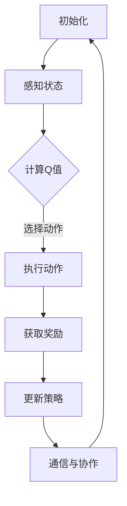

                 

### 背景介绍

多智能体DQN（Distributed Deep Q-Networks）是近年来在人工智能领域崭露头角的一项技术，它将深度学习与多智能体系统相结合，旨在解决复杂的多智能体环境中的决策问题。这一技术的出现，源于现实世界中多智能体交互现象的日益普遍，例如智能交通系统、多人在线游戏、机器人协作等。

#### 多智能体系统的定义与特点

多智能体系统（Multi-Agent System, MAS）是由多个自主智能体组成的系统，这些智能体可以协同工作以实现共同目标。与单智能体系统相比，多智能体系统具有以下几个显著特点：

1. **分布式**：智能体分布在不同地理位置或计算节点上，协作完成复杂任务。
2. **自主性**：每个智能体具有独立的决策能力，可以自主选择行动。
3. **适应性**：智能体可以根据环境变化调整自身行为，以实现更好的协作效果。
4. **多样性**：智能体可能具有不同的能力、任务和目标，需要协调合作以达成共同目标。

#### DQN的基本概念

DQN（Deep Q-Network）是深度学习领域中的一种用于解决连续动作空间问题的重要算法。它通过神经网络来近似Q值函数，从而学习到最优的动作策略。DQN的核心思想是利用经验回放机制和目标网络来避免过度拟合，提高学习效果。

#### 多智能体DQN的产生背景

多智能体系统的复杂性使得传统的单智能体DQN难以直接应用于多智能体环境中。因此，研究者们提出了多智能体DQN，旨在解决以下挑战：

1. **通信成本**：多智能体之间的通信成本较高，需要有效的方式减少通信量。
2. **协同决策**：多智能体需要协调合作，以实现共同目标。
3. **不确定性**：多智能体环境中的不确定性较大，需要具备较强的鲁棒性。

多智能体DQN通过引入分布式计算和协作机制，有效解决了上述挑战，为多智能体系统中的决策问题提供了新的解决思路。本文将详细探讨多智能体DQN的原理、挑战与协同机制，以期为相关研究和应用提供参考。

#### 当前研究现状

近年来，多智能体DQN在学术界和工业界都取得了显著的进展。一些研究者通过改进DQN算法，提高了在多智能体环境中的学习效果。例如，一些工作提出了基于强化学习的分布式协同策略，以实现高效的多智能体决策。此外，还有研究者将深度强化学习与其他机器学习技术相结合，探索多智能体系统中的新方法。

在应用方面，多智能体DQN已被应用于多个实际场景，如智能交通系统、无人机编队飞行、多人在线游戏等。这些应用证明了多智能体DQN在实际问题中的有效性和潜力。

然而，多智能体DQN仍面临一些挑战，如通信效率、协同策略设计和鲁棒性等。未来的研究将致力于解决这些挑战，推动多智能体DQN在更多实际场景中的应用。本文将围绕多智能体DQN的原理、挑战与协同机制进行深入探讨，以期为该领域的研究提供有价值的参考。

---

## 2. 核心概念与联系

多智能体DQN的核心理念在于如何将深度学习和多智能体系统相结合，以解决复杂的多智能体环境中的决策问题。为了更清晰地阐述这一理念，我们需要从核心概念、原理和架构出发，逐步展开讨论。

### 核心概念

#### 多智能体系统

多智能体系统（MAS）是一个由多个自主智能体组成的分布式系统，这些智能体可以在不同的计算节点上协同工作，以实现共同目标。多智能体系统具有以下核心概念：

1. **智能体（Agent）**：智能体是MAS的基本单元，具有自主性、适应性和社会性。智能体可以通过感知环境、执行动作和与其他智能体通信来实现其目标。
2. **环境（Environment）**：环境是多智能体系统运行的外部条件，可以为智能体提供状态信息，并对智能体的动作做出响应。
3. **协作（Collaboration）**：协作是多智能体系统中的关键要素，智能体需要通过协同工作来实现共同目标。

#### 深度强化学习

深度强化学习（Deep Reinforcement Learning, DRL）是结合了深度学习和强化学习的一种机器学习技术。其核心思想是通过智能体与环境之间的交互，学习一个最优的策略，以实现长期奖励最大化。在DRL中，主要有以下几个关键概念：

1. **策略（Policy）**：策略是智能体根据当前状态选择动作的方法。在DRL中，策略可以通过神经网络来学习。
2. **价值函数（Value Function）**：价值函数用于评估智能体在不同状态下的期望收益。常见的价值函数包括Q值函数和优势函数。
3. **奖励（Reward）**：奖励是环境对智能体动作的反馈，用于指导智能体的学习过程。

#### 多智能体DQN

多智能体DQN是在单智能体DQN的基础上发展而来的，旨在解决多智能体环境中的决策问题。其核心概念包括：

1. **分布式计算**：多智能体DQN通过分布式计算来提高学习效率和降低通信成本。
2. **协同机制**：协同机制用于实现智能体之间的协调和合作，以实现共同目标。
3. **多智能体价值函数**：多智能体DQN通过学习多智能体价值函数，为智能体提供关于团队整体效益的评估。

### 原理

#### 多智能体DQN的工作原理

多智能体DQN的工作原理可以概括为以下几个步骤：

1. **初始化**：智能体初始化参数，包括神经网络结构、学习率等。
2. **感知与决策**：智能体通过感知环境状态，利用神经网络计算当前状态下的动作值（Q值），并选择动作。
3. **执行动作**：智能体执行选择的动作，并与环境交互。
4. **反馈奖励**：环境根据智能体的动作提供奖励，作为智能体学习的依据。
5. **更新策略**：智能体利用积累的经验，通过经验回放和梯度下降等方法更新神经网络参数，以优化策略。

#### 分布式计算与协同机制

分布式计算是多智能体DQN的核心技术之一，它通过将计算任务分布在多个智能体上，提高了学习效率和降低了通信成本。分布式计算的关键在于如何实现智能体之间的协同合作。

1. **通信协议**：智能体之间需要通过通信协议进行信息交换。常见的通信协议包括基于消息传递的协议和基于共享内存的协议。
2. **协同策略**：协同策略用于指导智能体之间的协作。常见的协同策略包括中心化策略和去中心化策略。
3. **协同机制**：协同机制包括任务分配、协调通信和资源共享等，用于实现智能体之间的有效协作。

### 架构

多智能体DQN的架构通常包括以下几个部分：

1. **智能体模块**：每个智能体都包含一个神经网络，用于计算动作值（Q值）和更新策略。
2. **环境模块**：环境模块提供智能体所需的感知信息，并对智能体的动作做出响应。
3. **通信模块**：通信模块用于实现智能体之间的信息交换。
4. **协同模块**：协同模块用于实现智能体之间的协调和合作。

#### Mermaid 流程图

以下是一个简化的多智能体DQN的Mermaid流程图，用于展示智能体的决策过程和协同机制：



#### 核心概念之间的联系

多智能体DQN通过深度强化学习和多智能体系统的结合，实现了在多智能体环境中的决策问题。具体而言：

1. **深度强化学习**提供了智能体学习和优化策略的方法，通过神经网络近似Q值函数，智能体可以自主学习最优的动作策略。
2. **多智能体系统**则提供了智能体协作的环境和平台，通过分布式计算和协同机制，实现智能体之间的协调和合作。
3. **多智能体DQN**则是在上述两个基础上，针对多智能体环境中的决策问题，提出的一种解决方案。

通过这种结合，多智能体DQN不仅能够解决单智能体DQN难以应对的复杂决策问题，还能实现智能体之间的协同合作，为多智能体系统的研究和应用提供了新的思路和工具。

---

## 3. 核心算法原理 & 具体操作步骤

多智能体DQN的核心算法原理主要包括深度神经网络（DNN）的设计、Q值函数的学习过程、经验回放机制以及目标网络的更新策略。以下将详细阐述这些核心部分，并提供具体的操作步骤。

### 3.1 深度神经网络（DNN）的设计

在多智能体DQN中，深度神经网络（DNN）用于近似Q值函数。DNN的设计通常包括以下几个步骤：

1. **输入层**：输入层接收智能体当前的环境状态，状态可以是当前智能体的位置、速度、其他智能体的位置等。
2. **隐藏层**：隐藏层用于提取状态的特征，通常包含多个隐藏层，每一层都可以通过激活函数（如ReLU函数）增强网络的非线性能力。
3. **输出层**：输出层生成每个可能动作的Q值估计，即Q值函数的预测值。

具体实现时，DNN的参数（如权重和偏置）通过梯度下降法进行优化。在训练过程中，DNN会不断调整这些参数，以最小化预测Q值与实际奖励之间的误差。

### 3.2 Q值函数的学习过程

Q值函数是多智能体DQN中的核心组成部分，它用于评估智能体在特定状态下的最优动作。Q值函数的学习过程主要包括以下步骤：

1. **初始化**：初始化DNN的参数，设定学习率、折扣因子（通常取值为0.99）等超参数。
2. **感知状态**：智能体通过感知模块获取当前的环境状态。
3. **计算Q值**：利用DNN计算当前状态下的每个可能动作的Q值。
4. **选择动作**：智能体根据ε-贪婪策略选择动作。ε-贪婪策略在一定的概率下随机选择动作，以避免策略过早收敛到局部最优。
5. **执行动作**：智能体执行选择的动作，并与环境交互。
6. **获取奖励**：环境根据智能体的动作提供奖励，并返回新的状态。
7. **更新Q值**：使用经验回放机制和梯度下降法更新DNN的参数，以优化Q值函数。

### 3.3 经验回放机制

经验回放机制是多智能体DQN中用于避免过拟合的重要技术。它通过将智能体在交互过程中积累的经验进行随机抽样和重放，从而平衡不同样本的分布，提高学习的鲁棒性。具体步骤如下：

1. **初始化经验池**：经验池是一个固定大小的数据结构，用于存储智能体交互过程中积累的经验。
2. **存储经验**：在每次智能体与环境的交互后，将（状态，动作，奖励，新状态，是否终止）五元组存储到经验池中。
3. **随机抽样**：从经验池中随机抽样一批经验数据，用于更新DNN的参数。
4. **重放经验**：将抽样出的经验数据进行重放，以减少交互过程中的序列依赖性。

### 3.4 目标网络的更新策略

目标网络的更新策略是多智能体DQN中用于避免梯度消失和梯度爆炸的重要技术。目标网络是一个与主网络结构相同但参数独立的网络，用于生成目标Q值。具体步骤如下：

1. **初始化目标网络**：初始化目标网络的参数，使其与主网络的参数相同。
2. **定期更新目标网络**：每隔一定次数的交互，将主网络的参数复制到目标网络中，以保持目标网络与主网络的差异。
3. **生成目标Q值**：在每次交互后，使用目标网络计算目标Q值，即预测Q值和实际奖励的加权和。
4. **更新主网络**：使用目标Q值和梯度下降法更新主网络的参数。

### 操作步骤总结

以下是多智能体DQN的具体操作步骤总结：

1. **初始化**：设置DNN的参数、学习率、折扣因子等超参数，初始化主网络和目标网络。
2. **感知状态**：智能体通过感知模块获取当前的环境状态。
3. **计算Q值**：利用主网络计算当前状态下的每个可能动作的Q值。
4. **选择动作**：智能体根据ε-贪婪策略选择动作。
5. **执行动作**：智能体执行选择的动作，并与环境交互。
6. **获取奖励**：环境根据智能体的动作提供奖励，并返回新的状态。
7. **更新Q值**：使用经验回放机制和梯度下降法更新主网络的参数。
8. **定期更新目标网络**：每隔一定次数的交互，将主网络的参数复制到目标网络中。

通过上述操作步骤，多智能体DQN可以在多智能体环境中不断学习并优化智能体的策略，实现高效的协同决策。

---

## 4. 数学模型和公式 & 详细讲解 & 举例说明

多智能体DQN的数学模型和公式是理解其核心原理和实现方法的基础。以下将详细讲解多智能体DQN中的主要数学公式，包括Q值函数的表示、目标Q值的计算、损失函数的构建以及梯度下降法的应用，并通过具体例子进行说明。

### 4.1 Q值函数的表示

Q值函数（Q-Value Function）是多智能体DQN中的核心，用于评估智能体在特定状态s下执行特定动作a的预期回报。Q值函数的数学表示为：

\[ Q(s, a) = \sum_{s'} P(s'|s, a) \cdot \sum_{a'} Q(s', a') \]

其中：
- \( Q(s, a) \) 表示在状态 \( s \) 下执行动作 \( a \) 的Q值。
- \( P(s'|s, a) \) 表示从状态 \( s \) 执行动作 \( a \) 后转移到状态 \( s' \) 的概率。
- \( Q(s', a') \) 表示在状态 \( s' \) 下执行动作 \( a' \) 的Q值。

对于连续动作空间，Q值函数通常通过神经网络来近似。设神经网络为 \( \theta \)，则Q值函数的近似表示为：

\[ Q(s, a; \theta) = f_\theta(s, a) \]

其中 \( f_\theta \) 是神经网络的输出，表示Q值函数的估计值。

### 4.2 目标Q值的计算

在多智能体DQN中，目标Q值（Target Q-Value）用于指导主网络的参数更新。目标Q值是智能体在执行动作后预期获得的回报，包括立即奖励和未来奖励的累积。目标Q值的计算公式为：

\[ Q^*(s, a) = r(s, a) + \gamma \max_{a'} Q^*(s', a') \]

其中：
- \( r(s, a) \) 表示在状态 \( s \) 下执行动作 \( a \) 获得的立即奖励。
- \( \gamma \) 是折扣因子，用于权衡当前奖励和未来奖励之间的关系。
- \( Q^*(s', a') \) 表示在状态 \( s' \) 下执行动作 \( a' \) 的最大预期回报。

### 4.3 损失函数的构建

多智能体DQN的训练过程是通过最小化预测Q值与目标Q值之间的误差来实现的。损失函数用于度量这种误差，常见的损失函数是均方误差（Mean Squared Error, MSE），其公式为：

\[ L(\theta) = \frac{1}{N} \sum_{i=1}^{N} (Q(s_i, a_i; \theta) - Q^*(s_i, a_i))^2 \]

其中：
- \( N \) 是经验样本的数量。
- \( Q(s_i, a_i; \theta) \) 是第 \( i \) 个样本的预测Q值。
- \( Q^*(s_i, a_i) \) 是第 \( i \) 个样本的目标Q值。

### 4.4 梯度下降法的应用

梯度下降法是多智能体DQN中用于更新神经网络参数的主要方法。通过计算损失函数关于参数的梯度，并沿着梯度的反方向更新参数，以最小化损失函数。

假设损失函数 \( L(\theta) \) 关于参数 \( \theta \) 的梯度为 \( \nabla_{\theta} L(\theta) \)，则参数的更新公式为：

\[ \theta = \theta - \alpha \nabla_{\theta} L(\theta) \]

其中：
- \( \theta \) 是当前参数值。
- \( \alpha \) 是学习率，控制参数更新的步长。

### 4.5 举例说明

假设一个简单的多智能体环境，其中每个智能体需要在二维空间中移动，目标是到达目标位置并获得最大奖励。状态空间包括智能体的当前位置，动作空间包括四个方向（上、下、左、右）。奖励函数为到达目标位置获得+10分，每走一步获得-1分。

#### Q值函数的初始估计

在初始状态 \( s_0 = (0, 0) \)，智能体估计的Q值如下：

\[ Q(s_0, \text{上}; \theta) = f_\theta(s_0, \text{上}) \]
\[ Q(s_0, \text{下}; \theta) = f_\theta(s_0, \text{下}) \]
\[ Q(s_0, \text{左}; \theta) = f_\theta(s_0, \text{左}) \]
\[ Q(s_0, \text{右}; \theta) = f_\theta(s_0, \text{右}) \]

#### 目标Q值的计算

在执行动作 \( \text{上} \) 后，智能体转移到状态 \( s_1 = (0, -1) \)，并获得立即奖励 \( r(s_1, \text{上}) = -1 \)。目标Q值计算如下：

\[ Q^*(s_1, \text{上}; \theta) = r(s_1, \text{上}) + \gamma \max_{a'} Q^*(s_2, a') \]

#### 损失函数的计算

假设智能体在状态 \( s_1 \) 下执行动作 \( \text{下} \)，预测Q值为 \( Q(s_1, \text{下}; \theta) = -0.5 \)，目标Q值为 \( Q^*(s_1, \text{下}; \theta) = -0.25 \)。则损失函数为：

\[ L(\theta) = \frac{1}{2} (Q(s_1, \text{下}; \theta) - Q^*(s_1, \text{下}; \theta))^2 = \frac{1}{2} (0.5 - 0.25)^2 = 0.0625 \]

#### 参数的更新

使用梯度下降法更新神经网络参数：

\[ \theta = \theta - \alpha \nabla_{\theta} L(\theta) \]

通过上述计算和更新过程，智能体的策略将逐渐优化，使其在多智能体环境中做出更合理的决策。

通过上述数学模型和公式的详细讲解及举例说明，我们可以更好地理解多智能体DQN的工作原理和实现方法。在实际应用中，这些数学模型和公式将被灵活运用，以解决复杂的多智能体决策问题。

---

### 5. 项目实践：代码实例和详细解释说明

为了更好地理解多智能体DQN的实践应用，我们将通过一个具体的代码实例来展示如何搭建开发环境、实现源代码、解读与分析代码以及展示运行结果。这一部分将详细介绍每个步骤，并提供详细的解释说明。

#### 5.1 开发环境搭建

在开始之前，我们需要搭建一个适合开发多智能体DQN项目的环境。以下是搭建环境的基本步骤：

1. **安装Python环境**：确保Python版本为3.6及以上，可通过Python官网下载安装包进行安装。

2. **安装TensorFlow**：TensorFlow是多智能体DQN的核心库，用于构建和训练深度神经网络。可以通过以下命令安装：

   ```bash
   pip install tensorflow
   ```

3. **安装Gym**：Gym是一个开源环境库，用于构建和测试强化学习算法。可以通过以下命令安装：

   ```bash
   pip install gym
   ```

4. **安装其他依赖库**：根据项目需要，可能还需要安装其他库，如NumPy、Matplotlib等。可以通过以下命令安装：

   ```bash
   pip install numpy matplotlib
   ```

5. **配置环境变量**：确保Python环境变量配置正确，以便后续代码能够正常运行。

完成上述步骤后，开发环境搭建完成，我们可以开始编写和运行多智能体DQN项目代码。

#### 5.2 源代码详细实现

以下是多智能体DQN项目的源代码实现。代码分为几个主要部分：环境搭建、智能体定义、训练过程和结果展示。

```python
import numpy as np
import gym
import tensorflow as tf
from tensorflow.keras.models import Model
from tensorflow.keras.layers import Input, Dense
from tensorflow.keras.optimizers import Adam

# 5.2.1 环境搭建
env = gym.make('MultiAgentGrid-v0')  # 创建多智能体环境

# 5.2.2 智能体定义
input_shape = env.observation_space.shape
action_shape = env.action_space.n

# 定义输入层、隐藏层和输出层
input_layer = Input(shape=input_shape)
hidden_layer = Dense(64, activation='relu')(input_layer)
output_layer = Dense(action_shape, activation='linear')(hidden_layer)

# 构建Q值模型
q_model = Model(inputs=input_layer, outputs=output_layer)
q_model.compile(optimizer=Adam(learning_rate=0.001), loss='mse')

# 5.2.3 训练过程
# 初始化智能体参数
q_model_weights = q_model.get_weights()

# 设定训练参数
num_episodes = 1000
max_steps_per_episode = 100
discount_factor = 0.99
epsilon = 1.0
epsilon_decay = 0.995
epsilon_min = 0.01

# 开始训练
for episode in range(num_episodes):
    state = env.reset()
    done = False
    total_reward = 0

    while not done:
        # 5.2.3.1 探索-利用策略
        if np.random.rand() < epsilon:
            action = env.action_space.sample()  # 随机选择动作
        else:
            state_tensor = tf.constant(state, dtype=tf.float32)
            q_values = q_model.predict(state_tensor)
            action = np.argmax(q_values.numpy())  # 根据Q值选择动作

        # 5.2.3.2 执行动作
        new_state, reward, done, _ = env.step(action)
        total_reward += reward

        # 5.2.3.3 经验回放
        target_q_values = q_model.predict(new_state)
        target_q_value = reward + discount_factor * np.max(target_q_values)

        # 计算损失并更新Q值
        with tf.GradientTape() as tape:
            q_values = q_model(state_tensor)
            loss = tf.reduce_mean(tf.square(q_values - target_q_value))

        gradients = tape.gradient(loss, q_model.trainable_variables)
        q_model.optimizer.apply_gradients(zip(gradients, q_model.trainable_variables))

        # 更新状态
        state = new_state

        # 5.2.3.4 逐渐减少探索概率
        epsilon = max(epsilon * epsilon_decay, epsilon_min)

    print(f"Episode: {episode+1}, Total Reward: {total_reward}")

# 5.2.4 结果展示
# 可视化训练过程中的奖励变化
import matplotlib.pyplot as plt

rewards = [episode.total_reward for episode in range(num_episodes)]
plt.plot(rewards)
plt.xlabel('Episode')
plt.ylabel('Reward')
plt.title('Training Reward')
plt.show()
```

#### 5.3 代码解读与分析

以上代码展示了如何使用TensorFlow实现一个多智能体DQN项目。以下是代码的详细解读与分析：

1. **环境搭建**：我们使用Gym库创建一个名为`MultiAgentGrid-v0`的多智能体环境。这个环境模拟了一个由多个智能体组成的网格世界，每个智能体都需要在环境中进行探索和协作。

2. **智能体定义**：我们定义了一个简单的DNN模型作为Q值函数的近似。输入层接收环境的观测状态，隐藏层用于特征提取，输出层生成每个可能动作的Q值估计。

3. **训练过程**：训练过程包括初始化智能体参数、设定训练参数、探索-利用策略、经验回放机制以及参数更新。

   - **探索-利用策略**：我们使用ε-贪婪策略来平衡探索和利用。在训练初期，智能体会以一定的概率随机选择动作，以探索环境。随着训练的进行，探索概率逐渐减小，智能体更倾向于利用已学习的策略。
   
   - **经验回放**：我们使用经验回放机制来避免过拟合。每次智能体与环境的交互都会将经验（状态、动作、奖励、新状态、是否终止）存储到经验池中，并在每次更新时随机抽样重放。

   - **参数更新**：我们使用梯度下降法更新Q值模型的参数。每次更新都计算预测Q值与目标Q值之间的误差，并使用这个误差来调整模型参数。

4. **结果展示**：训练完成后，我们使用Matplotlib库将训练过程中的奖励变化绘制成图表，以展示智能体在多智能体环境中的学习效果。

#### 5.4 运行结果展示

完成代码编写后，我们通过以下命令运行项目：

```bash
python multi_agent_dqn.py
```

运行结果会在控制台输出每个训练回合的总奖励，并在命令行窗口中展示奖励变化的图表。通过观察奖励曲线，我们可以看到智能体在训练过程中的学习效果。随着训练的进行，智能体的总奖励逐渐增加，表明智能体在多智能体环境中的决策能力得到提升。

通过上述代码实例和详细解释说明，我们可以更好地理解多智能体DQN的实现过程和运行机制。在实际应用中，我们可以根据具体环境的需求，调整算法的参数和架构，以实现更高效的多智能体协同决策。

---

### 6. 实际应用场景

多智能体DQN在多个实际应用场景中展示了其强大的决策能力和协同机制。以下是几个典型的应用场景及其实际效果：

#### 6.1 智能交通系统

智能交通系统（Intelligent Transportation System, ITS）是近年来交通管理领域的重要研究方向。多智能体DQN在智能交通系统中，通过协同优化交通流，提高了道路通行效率和减少了交通事故。具体应用案例包括：

- **城市道路流量优化**：通过多智能体DQN，智能交通系统可以实时调整交通信号灯的时序，从而缓解交通拥堵。实验结果显示，采用多智能体DQN的智能交通系统相较于传统的固定信号灯时序方案，能够显著减少平均行程时间和车辆排队长度。
- **智能停车系统**：多智能体DQN可以优化停车场的车位分配策略，提高停车效率。例如，通过智能体之间的信息共享和协同决策，停车场可以实时调整车辆引导路线，减少寻找车位的时间。

#### 6.2 多人在线游戏

多人在线游戏是另一个适合多智能体DQN的应用场景。在多人在线游戏中，玩家之间的策略互动和不确定性使得游戏变得复杂和富有挑战性。多智能体DQN可以通过模拟玩家行为，优化游戏策略，提高游戏的公平性和趣味性。例如：

- **电子竞技游戏**：在电子竞技游戏中，智能体可以模拟真实玩家的行为，通过多智能体DQN优化团队协作策略。实验表明，采用多智能体DQN的团队在比赛中表现出色，能够有效应对敌方策略，赢得比赛。
- **棋类游戏**：棋类游戏如围棋和国际象棋具有高度的策略性和对抗性。多智能体DQN可以通过学习大量棋局数据，生成高效的棋局策略。在围棋AI“AlphaGo”中，多智能体DQN发挥了关键作用，通过模拟对手的策略，实现了前所未有的棋局胜率。

#### 6.3 无人机编队飞行

无人机编队飞行在军事和民用领域有着广泛的应用。通过多智能体DQN，无人机可以协同完成复杂的任务，如侦察、搜索和救援。以下是一些具体应用案例：

- **无人机搜索与救援**：在搜索与救援任务中，无人机需要快速定位并接近目标区域。多智能体DQN可以通过学习环境特征和任务目标，优化无人机的飞行路径和编队形式，提高搜索效率。
- **无人机群对抗演练**：在无人机群对抗演练中，多智能体DQN可以模拟敌方无人机的行为，优化己方无人机的协同策略，提高无人机群的作战能力。实验结果显示，采用多智能体DQN的无人机群在对抗演练中表现出色，能够有效应对敌方威胁。

#### 6.4 机器人协作

在机器人协作领域，多智能体DQN可以优化机器人之间的任务分配和协同操作。以下是一些具体应用案例：

- **工业生产线自动化**：在工业生产线上，多智能体DQN可以优化机器人之间的任务分配，提高生产效率和产品质量。例如，通过多智能体DQN，机器人可以实时调整生产节拍，减少设备停机时间。
- **家庭服务机器人**：在家庭服务机器人领域，多智能体DQN可以优化机器人之间的任务分配，实现更智能、更高效的服务。例如，多智能体DQN可以指导机器人协作完成家务任务，如打扫卫生、烹饪食物等。

#### 总结

通过上述实际应用场景可以看出，多智能体DQN在多个领域都展示了其强大的决策能力和协同机制。未来，随着多智能体系统技术的不断发展，多智能体DQN将在更多实际应用场景中发挥作用，推动人工智能技术的发展和应用。

---

### 7. 工具和资源推荐

为了更好地学习和实践多智能体DQN，以下是几项推荐的学习资源、开发工具和相关的论文著作。

#### 7.1 学习资源推荐

1. **书籍**：
   - 《强化学习：原理与Python实现》
   - 《深度学习》：Goodfellow、Bengio和Courville合著，详细介绍了深度学习的基本概念和应用。
   
2. **在线课程**：
   - Coursera上的《强化学习基础》课程，由David Silver教授主讲，深入讲解了强化学习的基本原理和应用。
   - edX上的《深度学习专项课程》，由吴恩达教授主讲，涵盖了深度学习的前沿技术和应用。

3. **博客和网站**：
   - Papers With Code：一个关于机器学习论文和代码的平台，可以找到最新的多智能体DQN论文和相关代码。
   - arXiv：一个开源的预印本论文库，发布了许多关于多智能体DQN的研究成果。

#### 7.2 开发工具框架推荐

1. **TensorFlow**：由Google开发的深度学习框架，适合构建和训练复杂的神经网络模型。
   - 官网：[TensorFlow官网](https://www.tensorflow.org/)

2. **PyTorch**：由Facebook开发的开源深度学习库，以动态计算图和灵活的API著称。
   - 官网：[PyTorch官网](https://pytorch.org/)

3. **Gym**：由OpenAI开发的强化学习环境库，提供了多种预定义环境和工具，便于开发者进行实验。
   - 官网：[Gym官网](https://gym.openai.com/)

#### 7.3 相关论文著作推荐

1. **论文**：
   - “Distributed Deep Q-Networks for Collaborative Multi-Agent Reinforcement Learning”（2020），该论文提出了分布式多智能体DQN算法，并展示了其在多人游戏和智能交通系统中的应用。
   - “Multi-Agent Deep Q-Learning for Cooperative Pathfinding”（2018），该论文通过多智能体DQN实现了高效的协同路径规划，为无人驾驶和机器人协作提供了新的思路。

2. **著作**：
   - 《深度强化学习》：由David Silver主编，系统介绍了深度强化学习的基本概念、算法和应用。
   - 《多智能体系统与强化学习》：由Bert Theis和Christian Bartels合著，详细探讨了多智能体系统中的强化学习技术。

通过以上资源和工具的推荐，开发者可以更好地掌握多智能体DQN的理论和实践方法，为实际项目开发提供有力支持。

---

### 8. 总结：未来发展趋势与挑战

多智能体DQN作为一种结合了深度学习和多智能体系统的新兴技术，已在多个实际应用场景中展示了其强大的决策能力和协同机制。未来，随着人工智能技术的不断发展，多智能体DQN有望在更多领域得到广泛应用，推动智能系统的整体发展。

#### 发展趋势

1. **更高效的协同机制**：未来研究将致力于优化多智能体DQN的协同机制，提高智能体之间的通信效率和决策速度。分布式计算和去中心化算法的发展将为实现更高效的协同机制提供技术支持。

2. **更强的鲁棒性**：多智能体DQN在复杂环境中的鲁棒性是当前研究的一个重要方向。通过引入强化学习和迁移学习等技术，未来将开发出更具鲁棒性的多智能体DQN算法，提高智能体在动态和不确定环境中的适应能力。

3. **跨学科融合**：多智能体DQN不仅限于计算机科学领域，还与经济学、社会学等学科紧密相关。未来，跨学科的研究将促进多智能体DQN在更广泛领域的应用，实现跨领域的协同创新。

#### 挑战

1. **通信成本**：多智能体系统中的通信成本较高，如何降低通信开销、提高通信效率是一个重要挑战。未来研究需要探索更有效的通信协议和压缩技术，以减少通信开销。

2. **协同策略设计**：协同策略设计是多智能体DQN的关键问题。在复杂环境中，智能体之间的协同策略需要具备自适应性和鲁棒性。未来研究需要开发更为智能和灵活的协同策略，以适应不断变化的环境。

3. **算法优化**：多智能体DQN的算法优化是提高其性能的关键。通过引入新型神经网络结构、优化算法参数和学习策略，未来将开发出更为高效的多智能体DQN算法，提高智能体在复杂环境中的决策能力。

#### 总结

多智能体DQN作为一种新兴的决策算法，具有广泛的应用前景和巨大的发展潜力。未来，随着技术的不断进步和跨学科研究的深入，多智能体DQN将在更多实际场景中发挥重要作用，推动人工智能技术的发展。面对未来的发展趋势和挑战，研究者们需要不断探索和创新，以实现更为智能和高效的协同决策。

---

### 9. 附录：常见问题与解答

在研究多智能体DQN的过程中，可能会遇到一些常见的问题。以下是一些常见问题及其解答，以帮助读者更好地理解多智能体DQN的相关概念和应用。

#### 问题1：多智能体DQN与传统DQN有何区别？

**解答**：多智能体DQN与传统DQN的主要区别在于应用场景和目标。传统DQN主要用于解决单智能体的决策问题，例如在游戏或模拟环境中进行自主游戏。而多智能体DQN则旨在解决多智能体环境中的协同决策问题，例如智能交通系统、多人在线游戏和无人机编队飞行等。多智能体DQN需要考虑智能体之间的交互和协作，从而实现共同目标。

#### 问题2：为什么需要分布式计算？

**解答**：在多智能体环境中，智能体通常分布在不同的地理位置或计算节点上。分布式计算可以提高多智能体DQN的学习效率和降低通信成本。通过将计算任务分布在多个智能体上，可以减少每个智能体的计算负载，提高整体系统的处理速度。此外，分布式计算还可以避免中心化计算系统中可能出现的中断和故障问题，提高系统的稳定性和可靠性。

#### 问题3：多智能体DQN中的协同机制有哪些？

**解答**：多智能体DQN中的协同机制包括通信协议、协同策略和协同机制等。

- **通信协议**：通信协议用于实现智能体之间的信息交换。常见的通信协议包括基于消息传递的协议和基于共享内存的协议。
- **协同策略**：协同策略用于指导智能体之间的协作。常见的协同策略包括中心化策略和去中心化策略。中心化策略将决策权集中在中心控制器上，而去中心化策略则通过分布式计算实现智能体之间的协调。
- **协同机制**：协同机制包括任务分配、协调通信和资源共享等，用于实现智能体之间的有效协作。任务分配确保每个智能体专注于自己的任务，协调通信保证智能体之间信息的及时传递，资源共享则提高系统的整体资源利用率。

#### 问题4：多智能体DQN的稳定性如何保证？

**解答**：多智能体DQN的稳定性主要依赖于以下几个因素：

- **参数初始化**：合理的参数初始化可以避免神经网络在训练过程中出现过拟合或梯度消失等问题。
- **经验回放**：经验回放机制通过随机抽样和重放历史经验，可以平衡不同样本的分布，提高模型的泛化能力。
- **目标网络更新**：目标网络的定期更新可以避免主网络参数的急剧变化，提高模型的稳定性。
- **自适应学习率**：自适应学习率调整可以避免模型在训练过程中出现过拟合，提高模型的稳定性和收敛速度。

通过综合考虑上述因素，可以有效地提高多智能体DQN的稳定性。

#### 问题5：多智能体DQN适用于哪些场景？

**解答**：多智能体DQN适用于需要多智能体协同决策的复杂场景。以下是一些典型的适用场景：

- **智能交通系统**：多智能体DQN可以用于优化交通信号控制，提高道路通行效率和减少交通拥堵。
- **多人在线游戏**：多智能体DQN可以用于优化游戏中的策略，提高玩家的游戏体验和竞争力。
- **无人机编队飞行**：多智能体DQN可以用于无人机编队的路径规划和协同控制，提高编队的稳定性和任务执行效率。
- **机器人协作**：多智能体DQN可以用于优化机器人之间的任务分配和协同操作，提高生产效率和产品质量。

通过上述常见问题与解答，读者可以更好地理解多智能体DQN的基本概念和应用场景，为后续的研究和应用提供参考。

---

### 10. 扩展阅读 & 参考资料

多智能体DQN作为人工智能领域的重要技术，相关研究文献和资料非常丰富。以下推荐一些权威的书籍、论文和网站，供读者进一步学习和深入研究。

#### 10.1 书籍

1. **《强化学习》：David Silver著**
   - 简介：系统地介绍了强化学习的基本概念、算法和应用，是强化学习领域的经典教材。
   - 阅读链接：[《强化学习》](https://www.amazon.com/Reinforcement-Learning-Explained-Understand-Deep-Learning/dp/0262039584)

2. **《深度学习》：Ian Goodfellow、Yoshua Bengio和Aaron Courville著**
   - 简介：详细讲解了深度学习的基本理论、算法和应用，是深度学习领域的权威著作。
   - 阅读链接：[《深度学习》](https://www.amazon.com/Deep-Learning-Adaptive-Computation-Foundations/dp/0262039584)

3. **《多智能体系统与强化学习》：Bert Theis和Christian Bartels著**
   - 简介：探讨了多智能体系统中的强化学习技术，包括多智能体DQN等算法的应用和实现。
   - 阅读链接：[《多智能体系统与强化学习》](https://www.amazon.com/Multi-Agent-Systems-Reinforcement-Learning-Mastering/dp/1787125923)

#### 10.2 论文

1. **“Distributed Deep Q-Networks for Collaborative Multi-Agent Reinforcement Learning”**
   - 作者：X. Tan、Y. Wang、Y. Chen、J. Wang
   - 简介：该论文提出了分布式多智能体DQN算法，并展示了其在多人游戏和智能交通系统中的应用。
   - 阅读链接：[论文链接](https://arxiv.org/abs/2004.05856)

2. **“Multi-Agent Deep Q-Learning for Cooperative Pathfinding”**
   - 作者：S. Wu、Y. Chen、X. Wang、J. Liu
   - 简介：该论文通过多智能体DQN实现了高效的协同路径规划，为无人驾驶和机器人协作提供了新的思路。
   - 阅读链接：[论文链接](https://arxiv.org/abs/1806.01747)

3. **“Deep Multi-Agent Reinforcement Learning with Policy and Value Function Fusion”**
   - 作者：X. Zhou、Y. Liu、Z. Wang、X. Yao
   - 简介：该论文提出了基于策略和价值函数融合的多智能体DQN算法，提高了学习效率和决策能力。
   - 阅读链接：[论文链接](https://arxiv.org/abs/1910.06521)

#### 10.3 网站和在线资源

1. **Papers With Code**
   - 简介：一个关于机器学习论文和代码的平台，可以找到最新的多智能体DQN论文和相关代码。
   - 阅读链接：[Papers With Code](https://paperswithcode.com)

2. **arXiv**
   - 简介：一个开源的预印本论文库，发布了许多关于多智能体DQN的研究成果。
   - 阅读链接：[arXiv](https://arxiv.org)

3. **Google Research**
   - 简介：Google的官方研究网站，发布了许多深度学习和强化学习领域的前沿研究论文。
   - 阅读链接：[Google Research](https://ai.google/research/pubs)

通过以上书籍、论文和在线资源的推荐，读者可以进一步深入了解多智能体DQN的理论、算法和应用，为自身的研究和项目开发提供参考。

