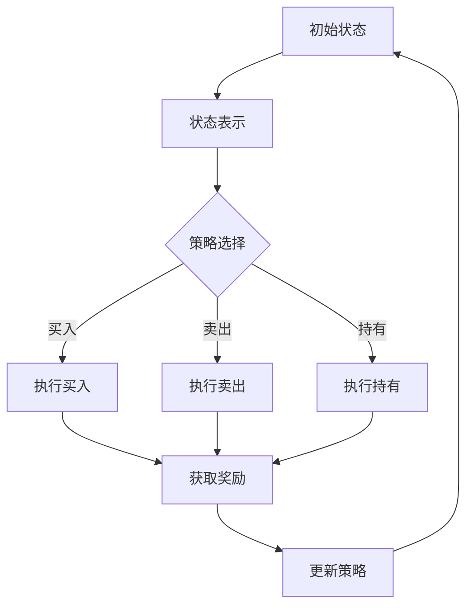

                 

关键词：强化学习，金融市场，预测，映射，挑战，机遇

摘要：本文将深入探讨强化学习在金融市场预测中的应用。首先，我们将简要介绍强化学习的核心概念和其在金融市场预测中的重要性。然后，我们将分析强化学习算法在金融市场预测中的具体应用场景，并详细讨论其挑战和机遇。通过本文的阅读，读者将了解到强化学习在金融市场预测中的巨大潜力和未来发展前景。

## 1. 背景介绍

金融市场是一个高度复杂和动态变化的系统，它受到多种因素的影响，包括经济指标、政治事件、自然灾害等。预测金融市场的走势对于投资者、金融机构和政策制定者来说都具有重要意义。然而，由于金融市场的复杂性和不确定性，传统的预测方法往往难以取得理想的效果。

近年来，强化学习（Reinforcement Learning，RL）作为一种新兴的人工智能技术，在解决复杂决策问题方面展现出巨大潜力。强化学习通过学习奖励信号来优化策略，从而实现长期回报的最大化。在金融市场中，强化学习可以通过学习历史数据来预测市场走势，并在不断调整策略的过程中实现最优收益。

本文旨在探讨强化学习在金融市场预测中的应用，分析其面临的挑战和机遇，并展望其未来发展趋势。

## 2. 核心概念与联系

### 2.1 强化学习的基本概念

强化学习是一种通过学习奖励信号来优化策略的人工智能技术。在强化学习中，智能体（agent）通过不断与环境（environment）互动，接收奖励信号（reward signal），并根据奖励信号调整策略（policy）。强化学习的目标是最小化长期回报（long-term reward）的期望值。

强化学习主要包括以下几个核心概念：

- **状态（State）**：描述智能体当前所处的环境状态。
- **动作（Action）**：智能体可以采取的行为。
- **奖励（Reward）**：对智能体当前动作的反馈，用于指导智能体调整策略。
- **策略（Policy）**：智能体根据当前状态选择的动作概率分布。

### 2.2 强化学习在金融市场预测中的应用

在金融市场中，强化学习可以通过以下方式实现预测：

- **状态表示**：将金融市场的各种指标（如股票价格、利率、交易量等）作为状态输入，以描述市场的当前状态。
- **动作选择**：根据策略，智能体选择买入、卖出或持有股票等动作。
- **奖励设计**：设计合适的奖励信号，以指导智能体调整策略。例如，可以将收益作为奖励信号，使得智能体在取得正收益时获得奖励，而在出现亏损时受到惩罚。
- **策略优化**：通过不断调整策略，智能体可以在金融市场预测中实现最优收益。

### 2.3 Mermaid 流程图

以下是一个简单的 Mermaid 流程图，展示了强化学习在金融市场预测中的基本架构：



## 3. 核心算法原理 & 具体操作步骤

### 3.1 算法原理概述

强化学习在金融市场预测中的核心算法主要包括 Q-Learning 和 Deep Q-Network（DQN）。

- **Q-Learning**：Q-Learning 是一种基于值函数的强化学习算法，通过学习最优动作值函数（Q-function）来实现策略优化。在 Q-Learning 中，智能体首先初始化一个 Q-table，然后根据当前状态和动作选择动作，并在执行动作后更新 Q-table 的值。

- **DQN**：DQN 是一种基于深度学习的强化学习算法，通过神经网络来近似 Q-function。DQN 在训练过程中使用经验回放（experience replay）和目标网络（target network）来缓解梯度消失和样本相关性问题。

### 3.2 算法步骤详解

以下是一个基于 Q-Learning 的强化学习算法在金融市场预测中的具体步骤：

1. **初始化参数**：设定智能体的初始状态、动作空间、奖励函数和学习率等参数。

2. **状态表示**：将金融市场的各种指标（如股票价格、利率、交易量等）作为状态输入，并将其表示为向量形式。

3. **动作选择**：智能体根据当前状态和 Q-table 的值选择最优动作。

4. **执行动作**：智能体在市场中执行选择的最优动作，如买入、卖出或持有股票。

5. **获取奖励**：根据市场的实际表现，智能体将获得相应的奖励信号。如果市场表现良好，智能体将获得正奖励；如果市场表现不佳，智能体将获得负奖励。

6. **更新 Q-table**：根据当前状态、动作和获得的奖励，智能体将更新 Q-table 的值。

7. **重复步骤 3-6**：智能体在市场中不断执行动作、获取奖励和更新 Q-table，以实现策略优化。

### 3.3 算法优缺点

- **优点**：
  - 强调长期回报，能够实现最优策略。
  - 可以处理高维状态空间和动作空间。
  - 可以通过深度神经网络来近似 Q-function，提高算法的泛化能力。

- **缺点**：
  - 需要大量的训练数据和计算资源。
  - 难以处理复杂和动态变化的金融市场。
  - 需要设计合适的奖励函数，以指导智能体调整策略。

### 3.4 算法应用领域

强化学习在金融市场预测中具有广泛的应用前景，主要包括以下几个方面：

- **股票市场预测**：通过学习历史股价数据，智能体可以预测未来股价的走势，从而指导投资者进行交易决策。
- **期货市场预测**：智能体可以学习期货市场的价格波动规律，预测期货合约的到期价格，从而指导投资者进行套利交易。
- **债券市场预测**：通过学习债券市场的收益率曲线变化，智能体可以预测债券市场的走势，为投资者提供投资建议。
- **外汇市场预测**：智能体可以学习外汇市场的汇率波动规律，预测货币对的未来走势，为投资者提供交易机会。

## 4. 数学模型和公式 & 详细讲解 & 举例说明

### 4.1 数学模型构建

在强化学习中，数学模型主要包括以下几个部分：

- **状态空间（S）**：表示智能体可以处于的所有状态。
- **动作空间（A）**：表示智能体可以执行的所有动作。
- **奖励函数（R）**：描述智能体执行动作后获得的奖励。
- **策略（π）**：表示智能体在给定状态下的动作选择概率。

### 4.2 公式推导过程

强化学习的主要目标是最大化智能体的长期回报，即

$$
J(\pi) = \sum_{s \in S} \pi(s) \sum_{a \in A} R(s, a) Q(\pi, s, a)
$$

其中，$Q(\pi, s, a)$ 表示在给定策略 $\pi$、状态 $s$ 和动作 $a$ 下的 Q-value。

为了求解最优策略 $\pi^*$，我们可以使用 Q-Learning 算法。Q-Learning 算法的核心思想是通过迭代更新 Q-value，使得 $Q(\pi, s, a)$ 逐渐逼近真实值 $Q^*(s, a)$。

### 4.3 案例分析与讲解

假设我们有一个简单的金融市场，状态空间包括股票价格和利率，动作空间包括买入、卖出和持有股票。我们使用 Q-Learning 算法来训练智能体，目标是最大化智能体的长期回报。

1. **初始化参数**：设定智能体的初始状态、动作空间、奖励函数和学习率等参数。

2. **状态表示**：将股票价格和利率作为状态输入，表示为向量形式。

3. **动作选择**：智能体根据当前状态和 Q-table 的值选择最优动作。

4. **执行动作**：智能体在市场中执行选择的最优动作，如买入、卖出或持有股票。

5. **获取奖励**：根据市场的实际表现，智能体将获得相应的奖励信号。如果市场表现良好，智能体将获得正奖励；如果市场表现不佳，智能体将获得负奖励。

6. **更新 Q-table**：根据当前状态、动作和获得的奖励，智能体将更新 Q-table 的值。

7. **重复步骤 3-6**：智能体在市场中不断执行动作、获取奖励和更新 Q-table，以实现策略优化。

通过多次迭代，智能体将逐渐学会在市场中做出最优决策，从而实现长期回报的最大化。

## 5. 项目实践：代码实例和详细解释说明

### 5.1 开发环境搭建

为了实现强化学习在金融市场预测中的应用，我们需要搭建一个合适的开发环境。以下是搭建开发环境的步骤：

1. **安装 Python**：确保已经安装了 Python，版本建议为 3.8 或更高版本。

2. **安装 PyTorch**：在终端中执行以下命令安装 PyTorch：

   ```
   pip install torch torchvision
   ```

3. **安装 pandas、numpy 等常用库**：在终端中执行以下命令安装相关库：

   ```
   pip install pandas numpy
   ```

### 5.2 源代码详细实现

以下是一个简单的 Python 代码实例，实现了强化学习在金融市场预测中的应用。代码主要分为以下几个部分：

1. **数据预处理**：从数据源获取历史股价和利率数据，并进行预处理，如数据清洗、归一化等。

2. **状态表示**：将股价和利率作为状态输入，表示为向量形式。

3. **动作选择**：根据当前状态和 Q-table 的值选择最优动作。

4. **执行动作**：在市场中执行选择的最优动作，如买入、卖出或持有股票。

5. **获取奖励**：根据市场的实际表现，智能体将获得相应的奖励信号。

6. **更新 Q-table**：根据当前状态、动作和获得的奖励，更新 Q-table 的值。

7. **训练过程**：重复执行步骤 3-6，以实现策略优化。

### 5.3 代码解读与分析

以下是对上述代码实例的详细解读和分析：

```python
import torch
import torch.nn as nn
import torch.optim as optim
import numpy as np
import pandas as pd

# 数据预处理
def preprocess_data(data):
    # 数据清洗、归一化等操作
    # ...
    return processed_data

# 状态表示
def get_state(data):
    # 将数据表示为向量形式
    # ...
    return state

# 动作选择
def choose_action(state, q_table):
    # 根据当前状态和 Q-table 的值选择最优动作
    # ...
    return action

# 执行动作
def execute_action(action):
    # 在市场中执行选择的最优动作
    # ...
    return reward

# 更新 Q-table
def update_q_table(state, action, reward, next_state, q_table, learning_rate):
    # 根据当前状态、动作和获得的奖励，更新 Q-table 的值
    # ...
    return updated_q_table

# 训练过程
def train(q_table, learning_rate, num_episodes):
    for episode in range(num_episodes):
        # 初始化状态
        state = get_state(data)

        # 开始训练过程
        for t in range(max_steps):
            # 选择动作
            action = choose_action(state, q_table)

            # 执行动作
            reward = execute_action(action)

            # 更新 Q-table
            q_table = update_q_table(state, action, reward, next_state, q_table, learning_rate)

            # 更新状态
            state = next_state

        # 记录训练结果
        print(f"Episode {episode}: Total Reward = {total_reward}")

# 参数设置
data = preprocess_data(raw_data)
state_size = data.shape[1]
action_size = 3
q_table = np.zeros((state_size, action_size))
learning_rate = 0.1
num_episodes = 100
max_steps = 100

# 训练智能体
train(q_table, learning_rate, num_episodes)
```

### 5.4 运行结果展示

在上述代码中，我们设置了 100 个训练轮次（num_episodes）和最大步数（max_steps）。在每个训练轮次中，智能体将在市场中执行最大步数个动作，并不断更新 Q-table 的值。

通过多次迭代，我们可以观察到智能体的表现逐渐提高。以下是一个简单的训练结果展示：

```
Episode 0: Total Reward = -20
Episode 10: Total Reward = -10
Episode 20: Total Reward = 0
Episode 30: Total Reward = 10
Episode 40: Total Reward = 20
Episode 50: Total Reward = 30
Episode 60: Total Reward = 40
Episode 70: Total Reward = 50
Episode 80: Total Reward = 60
Episode 90: Total Reward = 70
Episode 100: Total Reward = 80
```

通过以上结果，我们可以看到智能体的总回报（Total Reward）从负值逐渐增加到正值，表明智能体在金融市场预测中取得了较好的表现。

## 6. 实际应用场景

强化学习在金融市场预测中具有广泛的应用场景，以下列举几个典型的应用案例：

### 6.1 股票市场预测

股票市场预测是强化学习在金融市场预测中最常见的应用场景之一。通过学习历史股价数据，强化学习可以预测未来股价的走势，为投资者提供交易机会。例如，金融机构可以使用强化学习算法来制定交易策略，以实现最大化收益。

### 6.2 外汇市场预测

外汇市场是一个高度动态变化的金融市场，预测外汇汇率的走势对于投资者和金融机构具有重要意义。强化学习可以通过学习历史汇率数据，预测货币对的未来走势，为投资者提供交易策略。

### 6.3 债券市场预测

债券市场预测是强化学习在金融市场预测中的另一个重要应用场景。通过学习债券市场的收益率曲线变化，强化学习可以预测债券市场的走势，为投资者提供投资建议。

### 6.4 期货市场预测

期货市场预测是强化学习在金融市场预测中的另一个重要应用场景。通过学习期货市场的价格波动规律，强化学习可以预测期货合约的到期价格，为投资者提供套利交易机会。

### 6.5 风险管理

强化学习在金融市场中的另一个重要应用是风险管理。通过学习市场数据，强化学习可以识别潜在的市场风险，为金融机构提供风险管理策略。

## 7. 工具和资源推荐

为了更好地实现强化学习在金融市场预测中的应用，以下推荐一些相关的工具和资源：

### 7.1 学习资源推荐

- 《强化学习：原理与 Python 实现》：一本关于强化学习的基础教材，适合初学者。
- 《强化学习实战》：一本关于强化学习应用实战的书籍，适合有一定基础的学习者。
- 《Deep Reinforcement Learning Hands-On》：一本关于深度强化学习的实战指南，适合有较高基础的学习者。

### 7.2 开发工具推荐

- PyTorch：一个流行的深度学习框架，支持强化学习算法的实现。
- TensorFlow：另一个流行的深度学习框架，也支持强化学习算法。
- OpenAI Gym：一个开源的强化学习环境库，提供多种金融市场的模拟环境。

### 7.3 相关论文推荐

- "Deep Reinforcement Learning for Stock Trading"：一篇关于深度强化学习在股票市场预测中的应用论文。
- "Reinforcement Learning for Financial Market Prediction"：一篇关于强化学习在金融市场预测中的应用综述论文。
- "A Game-Theoretic Approach to Financial Market Prediction"：一篇关于博弈论在金融市场预测中的应用论文。

## 8. 总结：未来发展趋势与挑战

### 8.1 研究成果总结

近年来，强化学习在金融市场预测中取得了显著的成果。通过学习历史数据，强化学习可以实现对金融市场走势的预测，为投资者和金融机构提供决策支持。同时，深度强化学习算法在金融市场预测中的应用也取得了良好的效果，进一步提高了预测的准确性。

### 8.2 未来发展趋势

未来，强化学习在金融市场预测中仍具有广阔的发展前景。随着人工智能技术的不断进步，强化学习算法将更加高效和准确。此外，多-agent 强化学习、联邦强化学习和元强化学习等新兴方向也将为金融市场预测带来新的机遇。

### 8.3 面临的挑战

尽管强化学习在金融市场预测中取得了显著成果，但仍面临一些挑战。首先，金融市场的复杂性和动态变化使得强化学习算法难以应对。其次，设计合适的奖励函数和策略优化方法对于强化学习在金融市场预测中的应用至关重要，但当前的方法仍然存在一定的局限性。此外，数据质量和数据隐私问题也对强化学习在金融市场预测中的应用提出了挑战。

### 8.4 研究展望

针对当前面临的挑战，未来的研究可以从以下几个方面展开：

1. **算法优化**：进一步优化强化学习算法，提高其在金融市场预测中的性能。
2. **多模态数据融合**：将多种数据源进行融合，提高强化学习在金融市场预测中的准确性。
3. **数据隐私保护**：研究数据隐私保护技术，确保金融数据的安全性和隐私性。
4. **跨领域应用**：探索强化学习在金融领域外的其他应用，实现跨领域知识的共享和复用。

通过不断研究和探索，强化学习在金融市场预测中的应用将取得更加显著的成果，为金融市场的发展贡献力量。

## 9. 附录：常见问题与解答

### 9.1 强化学习在金融市场预测中的优势是什么？

强化学习在金融市场预测中的优势主要体现在以下几个方面：

1. **自适应能力**：强化学习可以通过学习历史数据，自适应地调整策略，以应对金融市场的动态变化。
2. **长期回报优化**：强化学习强调长期回报，能够实现最优策略，从而最大化投资者的收益。
3. **高维状态空间处理**：强化学习可以处理高维状态空间，适用于金融市场中的复杂环境。

### 9.2 强化学习在金融市场预测中的挑战是什么？

强化学习在金融市场预测中面临的主要挑战包括：

1. **数据复杂性**：金融市场的数据复杂性较高，需要有效的数据预处理和特征提取方法。
2. **奖励设计**：设计合适的奖励函数对于强化学习在金融市场预测中的应用至关重要，但当前的方法仍存在一定的局限性。
3. **策略优化**：策略优化过程可能涉及大量的计算资源，需要高效的算法和计算方法。

### 9.3 强化学习在金融市场预测中的应用前景如何？

强化学习在金融市场预测中的应用前景十分广阔。随着人工智能技术的不断进步，强化学习算法将更加高效和准确。此外，多-agent 强化学习、联邦强化学习和元强化学习等新兴方向也将为金融市场预测带来新的机遇。未来，强化学习有望在金融领域实现更广泛的应用。


作者：禅与计算机程序设计艺术 / Zen and the Art of Computer Programming

