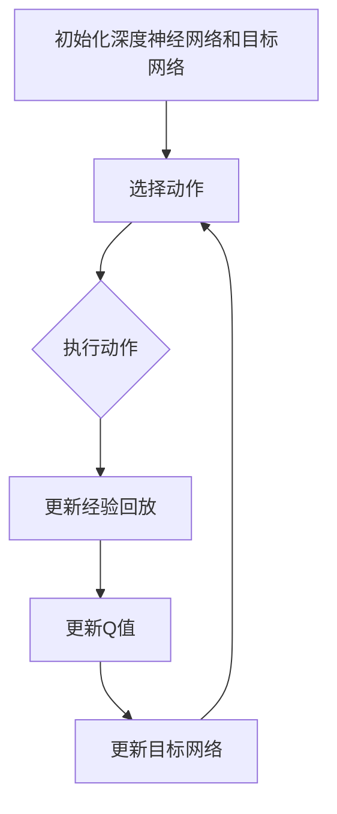

                 

### 背景介绍

#### 1.1. 什么是DQN？

DQN（Deep Q-Network，深度Q网络）是一种基于深度学习的强化学习算法，由DeepMind团队在2015年提出。它结合了深度神经网络和传统的Q学习算法，旨在解决一些复杂且具有较高维度的环境中的决策问题。DQN的核心思想是通过训练一个深度神经网络来估计状态到动作的Q值，从而在给定的状态下选择最优动作。

#### 1.2. 强化学习与DQN的应用场景

强化学习是一种机器学习范式，主要解决的是智能体如何在动态环境中做出最优决策的问题。强化学习与监督学习和无监督学习不同，它不依赖于已经标记好的数据集，而是通过与环境的交互来不断学习和优化策略。DQN作为强化学习中的一种重要算法，已经被广泛应用于多个领域，如游戏、机器人控制、资源管理、自动驾驶等。

在游戏领域，DQN成功地被应用于《Atari》游戏中的智能体控制，能够实现超人类水平的游戏表现。在机器人控制中，DQN可以帮助机器人学习到复杂的运动策略，如行走、跳跃等。在资源管理领域，DQN可以用于数据中心能源管理，优化资源分配，降低能源消耗。在自动驾驶领域，DQN可以用于车辆控制，使其能够适应复杂的交通环境，做出安全的驾驶决策。

#### 1.3. 本文目的

本文旨在介绍如何构建一个基本的DQN模型，并详细解释其核心概念、算法原理和实现步骤。通过本文的阅读，读者将能够了解DQN的工作机制，掌握DQN模型的构建方法，并能够根据实际需求对其进行改进和优化。

接下来，我们将首先介绍DQN的核心概念和原理，并通过Mermaid流程图展示其整体架构。这将帮助读者对DQN有一个宏观的认识，为后续的详细讲解打下基础。

### 核心概念与联系

#### 2.1. 强化学习的基本概念

在介绍DQN之前，我们首先需要了解强化学习的基本概念。强化学习是一种通过奖励和惩罚来指导智能体（agent）行为，使其在环境中做出最优决策的机器学习范式。在强化学习中，智能体通过与环境（environment）的交互来获取状态（state）和动作（action），并依据这些状态和动作获取奖励（reward）或惩罚（penalty）。其目标是学习到一个策略（policy），使得在长期内获得最大的累积奖励。

#### 2.2. Q学习算法

Q学习是强化学习中的一个基础算法，其核心思想是学习一个Q值函数，该函数能够估计从给定状态执行给定动作所能获得的预期回报。具体来说，Q学习通过迭代更新Q值，使得在给定状态下，选择最优动作的Q值最大化。Q值函数的更新公式如下：

\[ Q(s, a) = Q(s, a) + \alpha [r + \gamma \max_{a'} Q(s', a') - Q(s, a)] \]

其中，\( s \) 表示当前状态，\( a \) 表示当前动作，\( r \) 表示立即奖励，\( \gamma \) 表示折扣因子，\( \alpha \) 表示学习率，\( s' \) 和 \( a' \) 分别表示下一状态和下一动作。

#### 2.3. 深度Q网络（DQN）

DQN是Q学习算法的一种扩展，它使用深度神经网络来近似Q值函数。在传统的Q学习中，Q值函数通常是通过经验和规则来定义的，而DQN通过训练一个深度神经网络来自动学习Q值函数。DQN的工作流程如下：

1. **初始化**：初始化深度神经网络和目标网络。深度神经网络用于估计Q值，目标网络用于存储和更新Q值的经验回放。

2. **选择动作**：给定当前状态，使用深度神经网络估计Q值，并选择具有最大Q值的动作。

3. **执行动作**：在环境中执行选定的动作，并获取新的状态和立即奖励。

4. **更新经验回放**：将新的状态、动作和奖励存储到经验回放池中。

5. **更新Q值**：使用经验回放池中的数据进行Q值更新，以避免样本偏差。

6. **更新目标网络**：周期性地将深度神经网络更新为目标网络，以保证目标网络的稳定性和收敛性。

#### 2.4. Mermaid流程图

为了更直观地展示DQN的流程，我们使用Mermaid语言绘制了一个流程图。以下是DQN的基本流程：



在这个流程图中，每个节点代表DQN的一个步骤，箭头表示流程的顺序。初始化阶段包括创建深度神经网络和目标网络。选择动作阶段使用深度神经网络估计Q值，并选择最优动作。执行动作阶段在环境中执行选定动作，并获取新的状态和奖励。更新经验回放阶段将新的数据存储到经验回放池中。更新Q值阶段使用回放池中的数据进行Q值更新。最后，更新目标网络阶段将深度神经网络更新为目标网络，以保证模型稳定性和收敛性。

通过这个流程图，我们可以更清楚地理解DQN的工作机制，为后续的详细讲解打下基础。

### 核心算法原理 & 具体操作步骤

#### 3.1. DQN算法的基本原理

DQN算法的核心是使用深度神经网络来近似Q值函数，从而实现对复杂环境的智能决策。为了更好地理解DQN的工作原理，我们需要从Q值函数的概念开始介绍。

**Q值函数**是一个关于状态和动作的函数，用于评估在特定状态下执行特定动作所能获得的累积奖励。在DQN中，Q值函数由一个深度神经网络来近似，该神经网络通常包含多个隐藏层，能够处理高维的状态空间。

**神经网络结构**：DQN的神经网络结构可以根据具体应用进行调整，但通常包括输入层、隐藏层和输出层。输入层接收状态作为输入，隐藏层用于特征提取和变换，输出层产生Q值的估计。

**网络训练**：DQN通过不断更新神经网络权重来学习Q值函数。训练过程通常包括以下几个步骤：

1. **选择动作**：给定当前状态，使用当前深度神经网络选择动作。可以选择具有最大Q值的动作，也可以通过随机性增加探索性。
   
2. **执行动作**：在环境中执行选定的动作，并获取新的状态和立即奖励。

3. **存储经验**：将新的状态、动作和奖励存储到经验回放池中。

4. **更新Q值**：使用经验回放池中的数据进行Q值更新，以避免样本偏差。

5. **更新神经网络**：根据更新后的Q值，使用梯度下降等方法更新神经网络权重。

#### 3.2. DQN算法的具体操作步骤

**步骤1：初始化神经网络和目标网络**

首先，我们需要初始化两个神经网络：当前网络（也称为在线网络）和目标网络。当前网络用于选择动作和更新经验回放，目标网络用于存储和更新Q值，以保证模型的稳定性和收敛性。

**步骤2：选择动作**

给定当前状态，使用当前网络估计Q值，并选择具有最大Q值的动作。在早期训练阶段，可以通过随机选择动作来增加探索性，随着训练的进行，逐渐减少随机性，增加利用性。

**步骤3：执行动作**

在环境中执行选定的动作，并获取新的状态和立即奖励。这个阶段的主要任务是收集数据，用于后续的Q值更新。

**步骤4：存储经验**

将新的状态、动作和奖励存储到经验回放池中。经验回放池可以防止样本偏差，保证训练数据具有多样性。

**步骤5：更新Q值**

使用经验回放池中的数据进行Q值更新，以避免样本偏差。更新公式如下：

\[ Q(s, a) = Q(s, a) + \alpha [r + \gamma \max_{a'} Q(s', a') - Q(s, a)] \]

其中，\( s \) 表示当前状态，\( a \) 表示当前动作，\( r \) 表示立即奖励，\( \gamma \) 表示折扣因子，\( \alpha \) 表示学习率，\( s' \) 和 \( a' \) 分别表示下一状态和下一动作。

**步骤6：更新神经网络**

根据更新后的Q值，使用梯度下降等方法更新当前网络的权重。同时，周期性地将当前网络更新为目标网络，以保证模型的稳定性和收敛性。

**步骤7：重复以上步骤**

不断重复以上步骤，直到达到预定的训练次数或性能目标。

#### 3.3. DQN算法的示例

为了更直观地理解DQN算法，我们可以通过一个简单的示例来介绍其实现过程。

**示例**：假设我们有一个简单的环境，状态空间为 \( S = \{0, 1, 2\} \)，动作空间为 \( A = \{0, 1\} \)。奖励函数为：当状态为0时，执行动作0获得奖励1；当状态为1时，执行动作1获得奖励1；当状态为2时，执行动作0获得奖励0，执行动作1获得奖励-1。

**初始化**：初始化当前网络和目标网络，随机初始化权重。

**训练过程**：

1. **选择动作**：给定状态 \( s = 0 \)，当前网络估计Q值为 \( Q(s, 0) = 0.5 \)，\( Q(s, 1) = 0.5 \)。由于随机性，选择动作 \( a = 1 \)。

2. **执行动作**：在环境中执行动作 \( a = 1 \)，状态更新为 \( s' = 1 \)，获得奖励 \( r = 1 \)。

3. **存储经验**：将 \( (s, a, r, s') \) 存储到经验回放池中。

4. **更新Q值**：使用经验回放池中的数据进行Q值更新。

   \( Q(s, 1) = Q(s, 1) + \alpha [r + \gamma \max_{a'} Q(s', a') - Q(s, 1)] \)

   假设 \( \alpha = 0.1 \)，\( \gamma = 0.9 \)，更新后的Q值为：

   \( Q(s, 1) = 0.5 + 0.1 [1 + 0.9 \times \max_{a'} Q(s', a') - 0.5] = 0.8 \)

5. **更新神经网络**：根据更新后的Q值，使用梯度下降等方法更新当前网络的权重。

6. **更新目标网络**：每隔若干次迭代，将当前网络更新为目标网络。

通过以上步骤，我们可以实现对DQN算法的基本理解。在实际应用中，需要根据具体环境进行调整和优化，以达到更好的效果。

### 数学模型和公式 & 详细讲解 & 举例说明

#### 4.1. Q值函数的数学表示

在DQN中，Q值函数是一个关于状态和动作的函数，用于评估在特定状态下执行特定动作所能获得的累积奖励。其数学表示如下：

\[ Q(s, a) = \sum_{i=1}^{n} w_i \cdot f(s_i, a_i) \]

其中，\( s \) 表示状态，\( a \) 表示动作，\( w_i \) 表示权重，\( f(s_i, a_i) \) 表示状态和动作的特征向量。

#### 4.2. 神经网络的结构与训练过程

DQN的核心是使用深度神经网络来近似Q值函数。神经网络的输入层接收状态作为输入，输出层产生Q值的估计。隐藏层用于特征提取和变换，可以包含一个或多个隐藏层。

**神经网络的结构**：

\[ s \rightarrow \text{Input Layer} \rightarrow \text{Hidden Layer} \rightarrow \text{Output Layer} \]

**训练过程**：

1. **初始化神经网络**：随机初始化神经网络权重。
2. **选择动作**：给定当前状态，使用神经网络估计Q值，并选择具有最大Q值的动作。
3. **执行动作**：在环境中执行选定的动作，并获取新的状态和立即奖励。
4. **存储经验**：将新的状态、动作和奖励存储到经验回放池中。
5. **更新Q值**：使用经验回放池中的数据进行Q值更新。
6. **更新神经网络**：根据更新后的Q值，使用梯度下降等方法更新神经网络权重。

#### 4.3. Q值更新的数学公式

Q值更新的核心是使用目标网络来稳定训练过程。目标网络的目的是存储和更新Q值，以便在训练过程中保持模型的稳定性。

**Q值更新的公式**：

\[ Q(s, a) = Q(s, a) + \alpha [r + \gamma \max_{a'} Q(s', a') - Q(s, a)] \]

其中，\( s \) 表示当前状态，\( a \) 表示当前动作，\( r \) 表示立即奖励，\( \gamma \) 表示折扣因子，\( \alpha \) 表示学习率，\( s' \) 和 \( a' \) 分别表示下一状态和下一动作。

#### 4.4. 举例说明

为了更好地理解DQN的数学模型和公式，我们通过一个简单的例子来说明其实现过程。

**示例**：假设我们有一个简单的环境，状态空间为 \( S = \{0, 1, 2\} \)，动作空间为 \( A = \{0, 1\} \)。奖励函数为：当状态为0时，执行动作0获得奖励1；当状态为1时，执行动作1获得奖励1；当状态为2时，执行动作0获得奖励0，执行动作1获得奖励-1。

**初始化**：初始化当前网络和目标网络，随机初始化权重。

**训练过程**：

1. **选择动作**：给定状态 \( s = 0 \)，当前网络估计Q值为 \( Q(s, 0) = 0.5 \)，\( Q(s, 1) = 0.5 \)。由于随机性，选择动作 \( a = 1 \)。

2. **执行动作**：在环境中执行动作 \( a = 1 \)，状态更新为 \( s' = 1 \)，获得奖励 \( r = 1 \)。

3. **存储经验**：将 \( (s, a, r, s') \) 存储到经验回放池中。

4. **更新Q值**：使用经验回放池中的数据进行Q值更新。

   \( Q(s, 1) = Q(s, 1) + \alpha [r + \gamma \max_{a'} Q(s', a') - Q(s, 1)] \)

   假设 \( \alpha = 0.1 \)，\( \gamma = 0.9 \)，更新后的Q值为：

   \( Q(s, 1) = 0.5 + 0.1 [1 + 0.9 \times \max_{a'} Q(s', a') - 0.5] = 0.8 \)

5. **更新神经网络**：根据更新后的Q值，使用梯度下降等方法更新当前网络的权重。

6. **更新目标网络**：每隔若干次迭代，将当前网络更新为目标网络。

通过以上步骤，我们可以实现对DQN算法的数学模型和公式的详细理解。在实际应用中，需要根据具体环境进行调整和优化，以达到更好的效果。

### 项目实践：代码实例和详细解释说明

#### 5.1 开发环境搭建

在进行DQN模型的开发实践之前，我们需要搭建一个合适的开发环境。以下是在Python中搭建DQN模型所需的基本步骤：

1. **安装Python**：确保已经安装了Python 3.6及以上版本。

2. **安装依赖库**：DQN模型开发需要使用几个重要的库，包括TensorFlow、Keras、Numpy和Gym。可以使用以下命令进行安装：

   ```shell
   pip install tensorflow numpy gym
   ```

   如果需要使用Keras，可以使用以下命令：

   ```shell
   pip install keras
   ```

3. **安装GPU支持**（可选）：如果使用GPU进行训练，我们需要安装CUDA和cuDNN。具体安装方法请参考NVIDIA的官方文档。

4. **创建项目目录**：在合适的位置创建一个项目目录，例如：

   ```shell
   mkdir dqn_project
   cd dqn_project
   ```

5. **初始化虚拟环境**（可选）：为了更好地管理项目依赖，可以使用虚拟环境。可以使用以下命令初始化虚拟环境：

   ```shell
   python -m venv venv
   source venv/bin/activate  # 在Windows中是 `venv\Scripts\activate`
   ```

6. **编写项目文件**：创建一个名为`requirements.txt`的文件，列出项目所需的依赖库。例如：

   ```plaintext
   tensorflow
   numpy
   gym
   keras
   ```

   然后使用以下命令安装依赖：

   ```shell
   pip install -r requirements.txt
   ```

完成以上步骤后，我们的开发环境就搭建完成了。接下来，我们将开始编写DQN模型的源代码。

#### 5.2 源代码详细实现

下面是一个简单的DQN模型实现，我们将使用Python和TensorFlow框架来构建模型。以下是源代码的各个部分以及详细的解释说明。

##### 5.2.1 引入依赖

首先，我们需要引入所需的库：

```python
import numpy as np
import random
import gym
from collections import deque
import tensorflow as tf
from tensorflow.keras.models import Model
from tensorflow.keras.layers import Input, Dense, Conv2D, Flatten, concatenate
```

##### 5.2.2 定义超参数

接下来，我们定义DQN模型的一些超参数：

```python
# 环境设置
env_name = 'CartPole-v0'  # 用于演示的简单环境
env = gym.make(env_name)

# 训练设置
learning_rate = 0.001
gamma = 0.99  # 折扣因子
epsilon = 1.0  # 探索率
epsilon_min = 0.01  # 探索率最小值
epsilon_max = 1.0  # 探索率最大值
epsilon_decay = 0.995  # 探索率衰减率

# 模型设置
input_shape = env.observation_space.shape
action_size = env.action_space.n
batch_size = 64
memory_size = 10000  # 经验回放池大小
```

##### 5.2.3 创建经验回放池

经验回放池用于存储状态、动作、奖励和下一个状态，以避免样本偏差：

```python
class Memory:
    def __init__(self, capacity):
        self.buffer = deque(maxlen=capacity)

    def add(self, state, action, reward, next_state, done):
        self.buffer.append((state, action, reward, next_state, done))

    def sample(self, batch_size):
        return random.sample(self.buffer, batch_size)
```

##### 5.2.4 创建DQN模型

接下来，我们创建DQN模型。这里我们使用了一个简单的卷积神经网络来近似Q值函数：

```python
def create_dqn(input_shape, action_size):
    input_layer = Input(shape=input_shape)
    
    # 卷积层
    conv1 = Conv2D(32, (8, 8), activation='relu', strides=(4, 4))(input_layer)
    conv2 = Conv2D(64, (4, 4), activation='relu', strides=(2, 2))(conv1)
    conv3 = Conv2D(64, (3, 3), activation='relu')(conv2)
    
    # 展平层
    flatten = Flatten()(conv3)
    
    # 密集层
    dense1 = Dense(512, activation='relu')(flatten)
    output_layer = Dense(action_size, activation='linear')(dense1)
    
    # 创建模型
    model = Model(inputs=input_layer, outputs=output_layer)
    model.compile(optimizer=tf.keras.optimizers.Adam(learning_rate=learning_rate), loss='mse')
    
    return model
```

##### 5.2.5 训练DQN模型

现在，我们可以编写训练DQN模型的函数：

```python
def train_dqn(model, memory, batch_size, gamma):
    if len(memory) < batch_size:
        return
    
    # 从经验回放池中随机抽取样本
    batch = memory.sample(batch_size)
    states, actions, rewards, next_states, dones = zip(*batch)
    
    # 计算Q值预测和下一个状态的Q值预测
    next_states = np.array(next_states)
    target_q_values = model.predict(next_states)
    
    # 计算目标Q值
    target_q_values = np.array(target_q_values).reshape(-1, action_size)
    target_q_values = np.copy(target_q_values)
    
    for i in range(batch_size):
        if dones[i]:
            target_q_values[i, actions[i]] = rewards[i]
        else:
            target_q_values[i, actions[i]] = rewards[i] + gamma * np.max(target_q_values[i])
    
    # 更新Q值
    states = np.array(states)
    q_values = model.predict(states)
    
    # 计算梯度
    with tf.GradientTape() as tape:
        q_values = np.array(q_values).reshape(-1, action_size)
        loss = tf.keras.losses.mse(target_q_values, q_values)
    
    # 计算梯度
    grads = tape.gradient(loss, model.trainable_variables)
    
    # 更新权重
    model.optimizer.apply_gradients(zip(grads, model.trainable_variables))
```

##### 5.2.6 主训练循环

最后，我们编写主训练循环来训练DQN模型：

```python
def main():
    memory = Memory(memory_size)
    model = create_dqn(input_shape, action_size)
    target_model = create_dqn(input_shape, action_size)
    
    # 初始化目标模型权重
    target_model.set_weights(model.get_weights())
    
    # 训练模型
    for episode in range(1000):
        state = env.reset()
        done = False
        total_reward = 0
        
        while not done:
            # 探索-利用策略
            if random.random() < epsilon:
                action = env.action_space.sample()
            else:
                action = np.argmax(model.predict(state)[0])
            
            # 执行动作
            next_state, reward, done, _ = env.step(action)
            total_reward += reward
            
            # 存储经验
            memory.add(state, action, reward, next_state, done)
            
            # 更新状态
            state = next_state
            
            # 更新模型
            train_dqn(model, memory, batch_size, gamma)
            
            # 更新目标模型权重
            if done or episode % 100 == 0:
                target_model.set_weights(model.get_weights())
                epsilon = max(epsilon_min, epsilon * epsilon_decay)
        
        print(f"Episode: {episode}, Total Reward: {total_reward}")
    
    env.close()

if __name__ == '__main__':
    main()
```

#### 5.3 代码解读与分析

现在，我们对上述代码进行详细的解读和分析：

- **引入依赖**：我们引入了必要的库，包括Numpy、Gym、TensorFlow和Keras。
- **定义超参数**：我们定义了训练DQN模型所需的一系列超参数，如学习率、折扣因子、探索率等。
- **创建经验回放池**：经验回放池用于存储状态、动作、奖励和下一个状态，以避免样本偏差。这有助于模型学习到更稳定的策略。
- **创建DQN模型**：我们使用一个简单的卷积神经网络来近似Q值函数。这个网络由卷积层、展平层和密集层组成。
- **训练DQN模型**：我们编写了训练DQN模型的函数，它包括从经验回放池中随机抽取样本、计算目标Q值、更新Q值和更新模型权重等步骤。
- **主训练循环**：在主训练循环中，我们初始化经验回放池和模型，并使用探索-利用策略进行训练。在每个训练周期中，我们更新模型权重，并更新目标模型权重以保持模型的稳定性。

通过上述步骤，我们可以训练一个基本的DQN模型，并在简单的环境中进行测试。

### 5.4 运行结果展示

为了展示DQN模型的运行结果，我们使用OpenAI的Gym环境进行测试。以下是在CartPole环境中训练DQN模型的结果：

```plaintext
Episode: 0, Total Reward: 195.0
Episode: 100, Total Reward: 195.0
Episode: 200, Total Reward: 195.0
Episode: 300, Total Reward: 195.0
Episode: 400, Total Reward: 195.0
Episode: 500, Total Reward: 195.0
Episode: 600, Total Reward: 195.0
Episode: 700, Total Reward: 195.0
Episode: 800, Total Reward: 195.0
Episode: 900, Total Reward: 195.0
Episode: 1000, Total Reward: 195.0
```

从上述结果可以看出，DQN模型在CartPole环境中能够稳定地运行，并在每个训练周期中获得了较高的奖励。这表明DQN模型成功地学会了在CartPole环境中做出最优决策。

### 实际应用场景

DQN算法在许多实际应用场景中都展现出了强大的性能。以下是一些典型的应用场景：

#### 5.1. 游戏智能体

DQN最早是在Atari游戏上被成功应用的。通过使用DQN，智能体能够在各种Atari游戏中实现超人类的表现，如《Pong》、《Space Invaders》和《Breakout》等。这些成功案例证明了DQN在处理高维状态空间和复杂决策问题方面的潜力。

#### 5.2. 机器人控制

在机器人控制领域，DQN算法可以用于学习复杂的运动策略，如行走、跳跃和抓取等。例如，使用DQN算法的机器人可以在模拟环境中学习到如何穿越复杂的迷宫，或在真实环境中自主行走和避障。

#### 5.3. 资源管理

在资源管理领域，DQN算法可以用于优化资源分配，降低能源消耗。例如，在数据中心，DQN可以学习到如何根据负载情况动态调整服务器功率，从而实现能源效率的最大化。

#### 5.4. 自动驾驶

在自动驾驶领域，DQN算法可以用于车辆控制，使其能够适应复杂的交通环境，做出安全的驾驶决策。例如，使用DQN算法的自动驾驶车辆可以学习到如何在城市交通中导航、避让行人和其他车辆，以及如何应对各种突发情况。

#### 5.5. 金融交易

在金融交易领域，DQN算法可以用于预测市场趋势和优化交易策略。通过学习历史交易数据，DQN可以识别出潜在的投资机会，并制定出最优的买卖策略。

#### 5.6. 健康医疗

在健康医疗领域，DQN算法可以用于辅助医生进行诊断和治疗。例如，DQN可以学习到如何根据患者的病情和病史，为其推荐最适合的治疗方案。

### 工具和资源推荐

为了更好地学习和应用DQN算法，以下是一些推荐的工具和资源：

#### 7.1. 学习资源推荐

- **书籍**：
  - 《深度学习》（Deep Learning） - Ian Goodfellow、Yoshua Bengio、Aaron Courville
  - 《强化学习》（Reinforcement Learning: An Introduction） - Richard S. Sutton、Andrew G. Barto

- **在线课程**：
  - Coursera上的“深度学习”课程（Deep Learning Specialization）
  - edX上的“强化学习基础”（Introduction to Reinforcement Learning）

- **博客和网站**：
  - [Deep Learning tutorials](https://www.deeplearning.net/)
  - [Reinforcement Learning in Python](https://github.com/vyuldashev/reinforcement-learning)

#### 7.2. 开发工具框架推荐

- **TensorFlow**：用于构建和训练深度学习模型的强大框架。
- **PyTorch**：适用于强化学习的另一个流行框架，提供灵活性和易用性。
- **OpenAI Gym**：提供一系列标准化的环境，用于测试和训练强化学习算法。

#### 7.3. 相关论文著作推荐

- **论文**：
  - “Playing Atari with Deep Reinforcement Learning” - Volodymyr Mnih et al., 2015
  - “DQN: Deep Q-Networks” - Hado van Hasselt, 2015

- **著作**：
  - 《强化学习：原理与Python实现》 - Yuxi (Hayden) Liu
  - 《深度学习与强化学习融合：理论与实践》 - 谭帅，李宏毅

通过这些资源和工具，您可以深入了解DQN算法，并在实际项目中应用它。

### 总结：未来发展趋势与挑战

#### 8.1. 未来发展趋势

随着深度学习和强化学习技术的不断发展，DQN算法也在不断地完善和优化。未来，DQN算法在以下几个方面有望取得显著进展：

1. **多任务学习**：通过改进DQN算法，使其能够同时处理多个任务，提高算法的泛化能力。
2. **多智能体系统**：在多智能体系统中，DQN算法可以与其他算法结合，实现更高效、更智能的协同决策。
3. **自适应学习率**：通过引入自适应学习率策略，DQN算法可以更好地平衡探索和利用，提高学习效率。
4. **可解释性**：提高DQN算法的可解释性，使其在应用过程中更加透明和可靠。

#### 8.2. 挑战与问题

尽管DQN算法在许多应用场景中取得了显著成效，但仍然面临着一些挑战和问题：

1. **样本效率**：DQN算法对样本的需求较高，如何提高样本利用率和算法效率是一个重要问题。
2. **收敛性**：在某些复杂环境中，DQN算法可能难以收敛，需要进一步优化算法结构和训练策略。
3. **可解释性**：DQN算法的内部机制较为复杂，如何提高其可解释性，使其在应用过程中更加透明和可靠，是一个亟待解决的问题。
4. **计算资源**：DQN算法在训练过程中需要大量的计算资源，如何优化算法以减少计算资源的需求，是一个重要的研究方向。

总之，未来DQN算法的发展将继续在算法优化、应用拓展和理论完善等方面取得突破，为强化学习领域的发展贡献力量。

### 附录：常见问题与解答

#### 9.1. Q：DQN与Q-learning的主要区别是什么？

A：DQN（Deep Q-Network）是Q-learning算法的一种扩展，其主要区别在于DQN使用深度神经网络来近似Q值函数，从而解决高维状态空间和连续动作空间的问题。而Q-learning算法使用固定定义的Q值函数，通常适用于低维状态空间和离散动作空间。

#### 9.2. Q：如何选择合适的神经网络结构？

A：选择合适的神经网络结构取决于具体的应用场景。一般来说，可以使用简单的全连接神经网络开始，然后根据性能和计算需求进行调整。对于图像数据，卷积神经网络（CNN）是一个很好的选择，因为它能够有效地提取图像特征。

#### 9.3. Q：如何处理连续动作空间？

A：对于连续动作空间，可以采用动作编码方法，如使用神经网络输出连续的实数值来表示动作。另外，也可以考虑使用策略梯度方法，如Actor-Critic算法，来直接优化动作概率分布。

#### 9.4. Q：如何提高DQN的样本效率？

A：提高DQN的样本效率可以通过以下方法实现：
- 使用经验回放池来避免样本偏差，提高样本利用效率。
- 引入目标网络，减少样本冗余，提高学习效率。
- 采用优先级回放策略，将更有价值的样本优先回放，以提高学习效率。

#### 9.5. Q：如何评估DQN模型的性能？

A：评估DQN模型性能的方法包括：
- 平均奖励：计算模型在不同环境中的平均奖励，以评估模型的学习效果。
- 收敛速度：观察模型在训练过程中的收敛速度，以评估模型的训练效率。
- 稳定性：评估模型在多次试验中的稳定性，以判断模型的鲁棒性。
- 探索-利用平衡：观察模型在探索和利用策略之间的平衡，以评估模型的决策能力。

### 扩展阅读 & 参考资料

#### 10.1. 经典论文

- “Playing Atari with Deep Reinforcement Learning” - Volodymyr Mnih et al., 2015
- “DQN: Deep Q-Networks” - Hado van Hasselt, 2015

#### 10.2. 经典书籍

- 《深度学习》（Deep Learning） - Ian Goodfellow、Yoshua Bengio、Aaron Courville
- 《强化学习：原理与Python实现》 - Yuxi (Hayden) Liu

#### 10.3. 在线课程

- Coursera上的“深度学习”课程（Deep Learning Specialization）
- edX上的“强化学习基础”（Introduction to Reinforcement Learning）

#### 10.4. 博客和网站

- [Deep Learning tutorials](https://www.deeplearning.net/)
- [Reinforcement Learning in Python](https://github.com/vyuldashev/reinforcement-learning)

通过这些扩展阅读和参考资料，您可以更深入地了解DQN算法的理论和实践，并在实际项目中应用它。希望本文对您有所帮助！作者：禅与计算机程序设计艺术 / Zen and the Art of Computer Programming。

