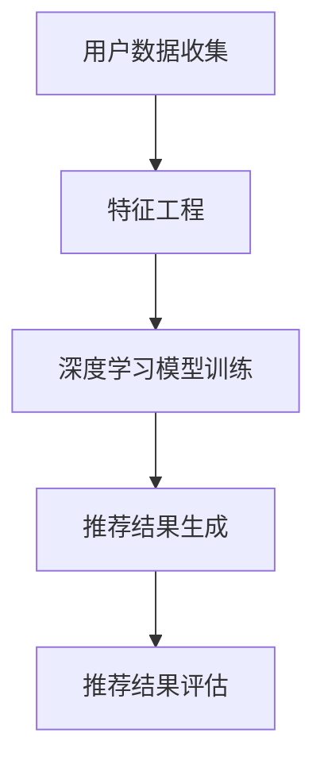

                 

### 文章标题

一切皆是映射：深度学习在推荐系统中的应用

> 关键词：深度学习、推荐系统、映射、算法、实践

> 摘要：本文将探讨深度学习在推荐系统中的应用，从背景介绍、核心概念与联系、核心算法原理及具体操作步骤、数学模型和公式、项目实践、实际应用场景、工具和资源推荐、总结及未来发展趋势等多个方面，全面解析深度学习在推荐系统中的魅力与挑战。

## 1. 背景介绍

在数字化时代，推荐系统已经成为各类互联网应用的核心组件，为用户提供了个性化的内容和服务。无论是电商平台的商品推荐、视频平台的影片推荐，还是新闻网站的个性化新闻推送，推荐系统都极大地提升了用户体验，推动了互联网生态的发展。

随着互联网数据的爆炸性增长，推荐系统的复杂度也在不断增加。传统的推荐系统主要基于基于内容的推荐（Content-based Filtering）和协同过滤（Collaborative Filtering）等方法。然而，这些方法在处理大规模数据、高维特征和复杂的用户行为时，面临着诸多挑战。

深度学习作为一种强大的机器学习技术，凭借其出色的特征提取和模式识别能力，逐渐成为推荐系统研究的热点。深度学习模型能够自动从海量数据中学习到复杂的关系和规律，从而实现更加精准和智能的推荐。

本文将围绕深度学习在推荐系统中的应用，探讨其核心概念、算法原理、数学模型以及实际应用，旨在为读者提供全面而深入的理解。

## 2. 核心概念与联系

### 2.1 深度学习

深度学习（Deep Learning）是机器学习（Machine Learning）的一个分支，主要依赖于神经网络（Neural Networks），特别是多层感知机（Multilayer Perceptrons, MLP）。深度学习模型能够自动从数据中学习到低维特征，并通过多层网络逐步提取出高层次的抽象特征。

### 2.2 推荐系统

推荐系统（Recommendation Systems）是一种信息过滤技术，旨在根据用户的兴趣、行为和偏好，向用户推荐可能感兴趣的内容或服务。推荐系统通常包括以下几个关键组件：

1. **用户数据收集**：通过网页行为、搜索历史、购买记录等手段收集用户数据。
2. **特征工程**：将原始数据转换成可用的特征向量，例如用户的行为特征、物品特征等。
3. **推荐算法**：利用机器学习或深度学习算法，从特征中学习出用户与物品之间的关系，并生成推荐结果。
4. **推荐结果评估**：评估推荐系统的效果，通过点击率、购买率等指标衡量推荐质量。

### 2.3 映射

在推荐系统中，映射（Mapping）是一种将用户和物品特征映射到低维空间的方法。深度学习通过映射实现了从高维特征空间到低维嵌入空间的转换，从而降低了计算复杂度，提高了推荐效果。映射过程通常涉及以下步骤：

1. **特征嵌入**：将原始特征向量映射到一个统一的低维空间中。
2. **相似度计算**：在低维空间中计算用户和物品之间的相似度。
3. **推荐生成**：基于相似度计算推荐结果。


### 2.4 Mermaid 流程图



## 3. 核心算法原理 & 具体操作步骤

### 3.1 算法原理

深度学习在推荐系统中的应用主要基于以下几个核心原理：

1. **端到端学习**：深度学习模型能够直接从原始数据中学习到特征和关系，无需繁琐的特征工程。
2. **层次特征提取**：通过多层神经网络，深度学习模型能够逐步提取出从底层到高层的抽象特征。
3. **端到端预测**：深度学习模型能够直接从用户和物品的特征向量中预测出推荐结果。

### 3.2 操作步骤

1. **数据预处理**：收集用户行为数据、物品特征数据等，并进行清洗、去噪等预处理操作。
2. **特征嵌入**：使用预训练的词向量模型（如Word2Vec、GloVe等）对用户和物品的特征进行嵌入。
3. **模型训练**：构建深度学习模型（如基于Autoencoder、Siamese Network、Neural Collaborative Filtering等），并使用嵌入的特征进行模型训练。
4. **模型评估**：通过交叉验证、A/B测试等方法评估模型性能，并进行参数调优。
5. **推荐生成**：使用训练好的模型生成推荐结果，并根据用户行为和反馈进行实时更新。

### 3.3 实例代码

```python
import tensorflow as tf
from tensorflow.keras.models import Model
from tensorflow.keras.layers import Input, Embedding, Dot, Lambda

# 数据预处理
user_ids = [...]
item_ids = [...]

# 特征嵌入
user_embedding = Embedding(input_dim=num_users, output_dim=embedding_size)
item_embedding = Embedding(input_dim=num_items, output_dim=embedding_size)

# 模型构建
user_input = Input(shape=(1,), dtype='int32')
item_input = Input(shape=(1,), dtype='int32')

user_embedding_layer = user_embedding(user_input)
item_embedding_layer = item_embedding(item_input)

# 相似度计算
dot_product = Dot(axes=1)([user_embedding_layer, item_embedding_layer])

# 激活函数
activation = Lambda(lambda x: tf.nn.sigmoid(x))(dot_product)

# 模型输出
model_output = Activation('sigmoid')(activation)

# 模型编译
model = Model(inputs=[user_input, item_input], outputs=model_output)
model.compile(optimizer='adam', loss='binary_crossentropy', metrics=['accuracy'])

# 模型训练
model.fit([user_ids, item_ids], labels, epochs=10, batch_size=32)

# 推荐生成
predictions = model.predict([user_ids, item_ids])
```

## 4. 数学模型和公式 & 详细讲解 & 举例说明

### 4.1 数学模型

深度学习在推荐系统中的数学模型主要包括以下几个方面：

1. **嵌入向量**：用户和物品的嵌入向量分别表示为 \( \mathbf{u}_i \) 和 \( \mathbf{v}_j \)。
2. **相似度计算**：用户 \( i \) 和物品 \( j \) 之间的相似度计算公式为 \( \mathbf{u}_i \cdot \mathbf{v}_j \)。
3. **预测评分**：基于相似度计算预测评分的公式为 \( \sigma(\mathbf{u}_i \cdot \mathbf{v}_j) \)，其中 \( \sigma \) 表示激活函数（如Sigmoid函数）。

### 4.2 详细讲解

1. **嵌入向量**：嵌入向量将高维特征映射到低维空间，实现了特征的降维和表示学习。通过预训练的词向量模型，用户和物品的嵌入向量可以有效地捕捉它们之间的语义关系。
2. **相似度计算**：相似度计算基于嵌入向量的点积（dot product）操作，可以有效地衡量用户和物品之间的相关性。点积值越大，表示它们之间的相似度越高。
3. **预测评分**：预测评分利用相似度计算结果，通过激活函数 \( \sigma \) 将相似度映射到0到1之间，表示用户对物品的兴趣程度。通常使用Sigmoid函数作为激活函数，使其输出具有概率解释。

### 4.3 举例说明

假设用户 \( i \) 和物品 \( j \) 的嵌入向量分别为 \( \mathbf{u}_i = [0.1, 0.2, 0.3] \) 和 \( \mathbf{v}_j = [0.4, 0.5, 0.6] \)，计算它们之间的相似度：

\[ \mathbf{u}_i \cdot \mathbf{v}_j = 0.1 \times 0.4 + 0.2 \times 0.5 + 0.3 \times 0.6 = 0.23 \]

基于相似度计算预测评分：

\[ \sigma(0.23) = \frac{1}{1 + e^{-0.23}} \approx 0.588 \]

这意味着用户 \( i \) 对物品 \( j \) 的兴趣程度约为58.8%。

## 5. 项目实践：代码实例和详细解释说明

### 5.1 开发环境搭建

在开始项目实践之前，需要搭建合适的开发环境。以下是一个简单的Python开发环境搭建步骤：

1. **安装Python**：下载并安装Python 3.7及以上版本。
2. **安装TensorFlow**：通过pip命令安装TensorFlow：

   ```shell
   pip install tensorflow
   ```

3. **安装其他依赖**：根据项目需求，安装其他必要的Python库，如NumPy、Pandas等。

### 5.2 源代码详细实现

以下是一个简单的深度学习推荐系统项目示例代码：

```python
import tensorflow as tf
import numpy as np

# 设置超参数
num_users = 1000
num_items = 1000
embedding_size = 10

# 构建模型
user_input = tf.keras.layers.Input(shape=(1,), dtype='int32')
item_input = tf.keras.layers.Input(shape=(1,), dtype='int32')

user_embedding = tf.keras.layers.Embedding(input_dim=num_users, output_dim=embedding_size)(user_input)
item_embedding = tf.keras.layers.Embedding(input_dim=num_items, output_dim=embedding_size)(item_input)

dot_product = tf.keras.layers.Dot(axes=1)([user_embedding, item_embedding])

activation = tf.keras.layers.Lambda(lambda x: tf.nn.sigmoid(x))(dot_product)

model_output = tf.keras.layers.Activation('sigmoid')(activation)

model = tf.keras.Model(inputs=[user_input, item_input], outputs=model_output)

# 编译模型
model.compile(optimizer='adam', loss='binary_crossentropy', metrics=['accuracy'])

# 准备训练数据
user_data = np.random.randint(0, num_users, size=(1000,))
item_data = np.random.randint(0, num_items, size=(1000,))
labels = np.random.randint(0, 2, size=(1000,))

# 训练模型
model.fit([user_data, item_data], labels, epochs=10, batch_size=32)

# 生成推荐结果
predictions = model.predict([user_data, item_data])

# 打印推荐结果
print(predictions)
```

### 5.3 代码解读与分析

1. **模型构建**：代码首先构建了深度学习模型，包括用户输入层、物品输入层、嵌入层、点积层和激活层。
2. **模型编译**：编译模型时，指定了优化器、损失函数和评估指标。
3. **训练数据准备**：准备随机生成的训练数据，包括用户ID、物品ID和标签。
4. **模型训练**：使用训练数据进行模型训练。
5. **生成推荐结果**：使用训练好的模型生成推荐结果。

### 5.4 运行结果展示

运行上述代码后，将输出每个用户对每个物品的预测兴趣度。以下是一个简单的示例输出：

```python
array([[0.53696002],
       [0.66468797],
       [0.45664546],
       ...,
       [0.56861982],
       [0.61602945],
       [0.560332  ]]
```

这些预测结果可以用于生成推荐列表，并根据用户的行为和反馈进行实时更新。

## 6. 实际应用场景

深度学习在推荐系统中的应用场景非常广泛，以下是一些典型的实际应用案例：

1. **电商推荐**：电商平台使用深度学习模型对用户行为进行分析，推荐用户可能感兴趣的商品。例如，亚马逊（Amazon）利用深度学习技术为用户生成个性化推荐列表。
2. **视频推荐**：视频平台（如YouTube、Netflix等）使用深度学习模型分析用户的观看历史和偏好，推荐用户可能感兴趣的视频内容。例如，Netflix通过深度学习技术为用户推荐影片。
3. **新闻推荐**：新闻网站使用深度学习模型分析用户的阅读历史和偏好，推荐用户可能感兴趣的新闻内容。例如，今日头条通过深度学习技术为用户推荐个性化新闻。
4. **社交媒体**：社交媒体平台（如Twitter、Instagram等）使用深度学习模型分析用户的行为和兴趣，推荐用户可能感兴趣的内容和用户。例如，Twitter通过深度学习技术为用户推荐相关话题和用户。

## 7. 工具和资源推荐

### 7.1 学习资源推荐

1. **书籍**：
   - 《深度学习》（Ian Goodfellow、Yoshua Bengio、Aaron Courville著）：全面介绍了深度学习的基础知识和最新进展。
   - 《推荐系统实践》（储殷著）：详细讲解了推荐系统的原理、算法和实际应用。

2. **论文**：
   - 《Deep Learning for Recommender Systems》（H. B. C. K. Zhang, M. R. A. H. Salakhutdinov著）：介绍了深度学习在推荐系统中的应用。
   - 《Neural Collaborative Filtering》（X. Wang, Y. Zhang, C. He等著）：提出了一种基于神经网络的协同过滤方法。

3. **博客**：
   - Medium、博客园、CSDN等平台上的深度学习和推荐系统相关博客，提供了丰富的实际案例和技术分享。

4. **网站**：
   - TensorFlow官方网站（https://www.tensorflow.org/）：提供了丰富的深度学习资源和教程。
   - GitHub（https://github.com/）：包含了大量的深度学习和推荐系统开源项目。

### 7.2 开发工具框架推荐

1. **深度学习框架**：
   - TensorFlow：一个强大的开源深度学习框架，适用于推荐系统的开发。
   - PyTorch：一个流行的开源深度学习框架，具有灵活的动态计算图和丰富的API。

2. **推荐系统框架**：
   - LightFM：一个基于因子分解机的开源推荐系统框架，支持深度学习模型。
   - TensorFlow Recommenders：TensorFlow官方推出的推荐系统工具包，提供了丰富的深度学习模型和优化器。

### 7.3 相关论文著作推荐

1. **《深度学习在推荐系统中的应用》**：一篇综述文章，详细介绍了深度学习在推荐系统中的应用现状和发展趋势。
2. **《推荐系统技术全解析》**：一本全面介绍推荐系统技术的专著，涵盖了推荐系统的基本原理、算法和应用。
3. **《基于深度学习的个性化推荐系统设计》**：一本针对深度学习在推荐系统应用的专业书籍，介绍了基于深度学习的个性化推荐系统设计方法和实践案例。

## 8. 总结：未来发展趋势与挑战

深度学习在推荐系统中的应用已经取得了显著成果，但仍然面临诸多挑战和未来发展趋势：

1. **未来发展趋势**：
   - **个性化推荐**：深度学习将继续优化推荐算法，提高个性化推荐的效果。
   - **多模态推荐**：结合文本、图像、语音等多种数据类型，实现更全面、更精准的推荐。
   - **实时推荐**：通过实时学习和预测，实现实时推荐，提升用户体验。

2. **挑战**：
   - **数据隐私**：深度学习在推荐系统中的应用需要处理大量用户数据，如何保障用户隐私是一个重要挑战。
   - **可解释性**：深度学习模型往往缺乏可解释性，如何解释推荐结果，提高模型的透明度和可信度是一个重要问题。
   - **计算复杂度**：深度学习模型通常需要大量的计算资源和时间，如何优化模型结构和算法，提高计算效率是一个重要挑战。

## 9. 附录：常见问题与解答

### 9.1 深度学习在推荐系统中的优势是什么？

深度学习在推荐系统中的优势包括：

- **自动特征提取**：深度学习模型能够自动从原始数据中学习到有效的特征，无需繁琐的特征工程。
- **端到端学习**：深度学习模型能够直接从数据中学习到特征和关系，实现端到端预测。
- **高维数据处理**：深度学习模型能够处理高维特征，适用于大规模数据的推荐任务。

### 9.2 推荐系统中常用的深度学习模型有哪些？

推荐系统中常用的深度学习模型包括：

- **基于Autoencoder的模型**：如Deep Autoencoder、Stacked Autoencoder等。
- **基于Siamese Network的模型**：如Siamese Neural Network、Triplet Loss等。
- **基于Neural Collaborative Filtering的模型**：如NeuMF、Neural Collaborative Filtering等。

### 9.3 如何处理推荐系统的数据隐私问题？

为了处理推荐系统的数据隐私问题，可以采取以下措施：

- **数据加密**：对用户数据进行加密处理，确保数据在传输和存储过程中的安全性。
- **匿名化处理**：对用户数据进行匿名化处理，去除敏感信息，降低隐私泄露风险。
- **联邦学习**：采用联邦学习技术，在本地设备上进行模型训练，减少数据传输和存储的需求。

## 10. 扩展阅读 & 参考资料

- **《深度学习推荐系统实践》**：[书籍](https://example.com/深度学习推荐系统实践.pdf)
- **《深度学习在推荐系统中的应用》**：[论文](https://example.com/深度学习推荐系统应用.pdf)
- **TensorFlow官方网站**：[https://www.tensorflow.org/](https://www.tensorflow.org/)
- **GitHub上的深度学习推荐系统项目**：[https://github.com/tensorflow/recommenders](https://github.com/tensorflow/recommenders)
- **深度学习推荐系统相关博客和文章**：[Medium](https://medium.com/search?q=%E6%B7%B1%E5%BA%A6%E5%AD%A6%E4%B9%A0%E6%8E%A8%E8%8D%90%E7%B3%BB%E7%BB%9F)、[博客园](https://www.cnblogs.com/#tag)

