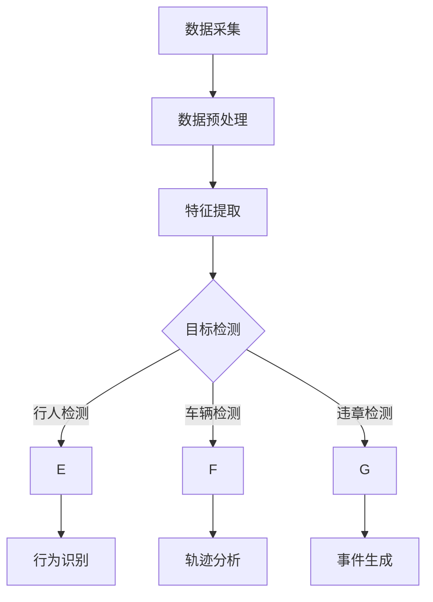

                 

### 一、背景介绍

随着科技的快速发展，视频监控技术已经深入到我们日常生活的各个方面。从家庭安全监控到城市安防监控，视频监控技术在保障社会安全、预防犯罪和应对突发事件等方面发挥着至关重要的作用。然而，随着监控视频数据量的爆炸式增长，如何有效地处理和分析这些数据成为了一个巨大的挑战。

传统的视频监控分析技术主要依赖于手工标注和模式识别方法，这些方法不仅效率低下，而且容易受到主观因素的影响，难以满足大规模视频数据分析的需求。在这种情况下，深度学习作为一种强大的机器学习技术，逐渐引起了研究者和工业界的广泛关注。深度学习通过模仿人脑神经网络的结构和工作原理，能够在大量数据中自动学习和提取特征，从而实现高效的视频监控分析。

深度学习在视频监控分析中的应用主要包括目标检测、图像识别、行为识别和视频追踪等任务。通过这些任务，深度学习可以帮助监控系统实现实时监控、智能识别和自动化处理，大大提升了视频监控系统的智能化水平。例如，目标检测技术可以用于识别监控视频中的特定目标，如行人、车辆等；图像识别技术可以用于识别监控视频中的特定场景或对象，如交通拥堵、火灾等；行为识别技术可以用于分析监控视频中的行为模式，如暴力行为、异常行为等；视频追踪技术可以用于跟踪监控视频中的目标运动轨迹，如车辆追踪、行人追踪等。

总的来说，深度学习在视频监控分析中的应用为视频监控技术带来了前所未有的变革。它不仅提高了视频监控系统的智能化水平，还推动了视频监控技术在各个领域的广泛应用。随着深度学习技术的不断发展和成熟，我们有理由相信，未来视频监控分析将会更加智能化、高效化，为我们的社会带来更多的安全和便利。

### 二、核心概念与联系

#### 深度学习的基本原理

深度学习是一种基于人工神经网络（Artificial Neural Networks，ANN）的机器学习技术，其核心思想是通过多层神经元的互联和计算，对输入数据进行特征提取和模式识别。深度学习的模型通常包含多个隐藏层，每个隐藏层负责提取不同层次的特征，从而实现对复杂数据的建模和预测。

深度学习的基本原理可以概括为以下几个关键部分：

1. **神经元与激活函数**：深度学习模型的基本构建块是神经元，每个神经元接收多个输入信号，并通过权重进行加权求和，最后通过激活函数（如ReLU、Sigmoid、Tanh等）进行非线性变换，以实现数据的非线性建模。

2. **多层网络结构**：深度学习模型通常包含多个隐藏层，每个隐藏层都对输入数据进行特征提取和变换。这种多层结构使得模型能够从原始数据中自动学习到更高层次的特征，从而提高模型的性能。

3. **反向传播算法**：深度学习模型的训练过程是通过反向传播算法（Backpropagation Algorithm）进行的。该算法通过计算输出误差梯度，并沿着网络反向传播，更新各层的权重和偏置，以最小化误差函数。反向传播算法的核心是梯度下降（Gradient Descent）方法，通过迭代优化模型参数，以达到最佳拟合效果。

4. **优化算法**：除了梯度下降，深度学习还使用了其他优化算法，如Adam、RMSprop等，这些算法通过改进梯度下降方法，提高训练效率和收敛速度。

5. **正则化技术**：为了防止模型过拟合，深度学习引入了多种正则化技术，如L1正则化、L2正则化、Dropout等。这些技术通过增加模型的复杂性，使模型在训练过程中能够更好地泛化到未见过的数据。

#### 视频监控分析中的关键任务

在视频监控分析中，深度学习技术主要涉及以下几个关键任务：

1. **目标检测（Object Detection）**：目标检测是指从图像或视频中识别并定位出特定目标的过程。常用的目标检测算法包括R-CNN、Fast R-CNN、Faster R-CNN、YOLO、SSD等。目标检测技术广泛应用于监控系统中的行人检测、车辆检测、违章检测等任务。

2. **图像识别（Image Recognition）**：图像识别是指通过深度学习模型识别和分类图像中的对象和场景。常见的图像识别算法包括LeNet、AlexNet、VGG、ResNet等。图像识别技术在监控系统中用于场景识别、目标属性识别等任务。

3. **行为识别（Action Recognition）**：行为识别是指从视频中识别和分析特定行为模式。常用的行为识别算法包括HMM、CNN、LSTM等。行为识别技术在监控系统中用于暴力行为检测、异常行为检测等任务。

4. **视频追踪（Video Tracking）**：视频追踪是指跟踪视频中特定目标的运动轨迹。常用的视频追踪算法包括光流法、基于深度学习的追踪算法等。视频追踪技术在监控系统中用于目标跟踪、轨迹分析等任务。

#### Mermaid 流程图

为了更好地展示深度学习在视频监控分析中的应用流程，我们可以使用Mermaid绘制一个简化的流程图：



在这个流程图中，数据采集阶段获取监控视频数据，随后进行数据预处理，包括去噪、缩放、增强等操作。预处理后的数据进入特征提取阶段，通过深度学习模型提取出关键特征。特征提取结果用于目标检测任务，如行人检测、车辆检测和违章检测。目标检测的结果可以进一步用于行为识别、轨迹分析和事件生成等任务。

通过上述核心概念和流程图的详细阐述，我们可以看到深度学习在视频监控分析中的应用是如何实现的。接下来，我们将深入探讨深度学习在视频监控分析中的核心算法原理和具体操作步骤。

#### 三、核心算法原理 & 具体操作步骤

在视频监控分析中，深度学习算法的应用主要涉及目标检测、图像识别、行为识别和视频追踪等任务。这些任务背后都有一系列核心算法原理和具体操作步骤，下面我们将逐一进行详细介绍。

##### 1. 目标检测（Object Detection）

目标检测是视频监控分析中最基础也是最重要的任务之一。它旨在从图像或视频中识别并定位出特定目标，通常包括以下步骤：

1. **锚框生成（Anchor Box Generation）**：
   目标检测算法首先需要生成一组预设的锚框（Anchor Box），这些锚框用于预测目标的位置和大小。锚框通常基于先验知识或模型训练过程中的统计信息生成，如基于高斯分布或均匀分布。

2. **区域建议（Region Proposal）**：
   通过锚框生成后，算法会对图像进行区域建议（Region Proposal），生成一系列可能包含目标的候选区域。常见的区域建议方法包括选择性搜索（Selective Search）、滑动窗口（Sliding Window）和基于深度学习的区域建议网络（Region Proposal Network，RPN）。

3. **特征提取（Feature Extraction）**：
   算法对候选区域进行特征提取，通常使用卷积神经网络（CNN）提取出高层次的特征图。这些特征图用于后续的目标定位和分类。

4. **分类与定位（Classification and Localization）**：
   使用提取出的特征图，算法对每个候选区域进行分类（是否为目标）和定位（目标位置）。分类通常采用分类损失函数（如交叉熵损失函数），定位则采用回归损失函数（如平滑L1损失函数）。

5. **非极大值抑制（Non-maximum Suppression，NMS）**：
   目标检测中可能会产生多个重叠的锚框，非极大值抑制算法用于去除这些重叠的锚框，只保留最高置信度的锚框。

常见的目标检测算法包括R-CNN、Fast R-CNN、Faster R-CNN、YOLO和SSD等。以Faster R-CNN为例，其具体操作步骤如下：

- **生成锚框**：基于先验知识生成锚框。
- **区域建议**：使用区域建议网络（RPN）生成区域建议。
- **特征提取**：使用卷积神经网络提取特征图。
- **分类与定位**：对每个区域建议进行分类和定位。
- **NMS**：对检测结果进行非极大值抑制。

##### 2. 图像识别（Image Recognition）

图像识别是另一个重要的视频监控分析任务，它旨在识别和分类图像中的对象和场景。图像识别通常包括以下步骤：

1. **数据预处理**：
   对图像进行预处理，包括缩放、归一化、数据增强等操作，以提高模型的泛化能力。

2. **特征提取**：
   使用卷积神经网络（CNN）对图像进行特征提取，提取出具有代表性的特征图。

3. **分类**：
   将提取出的特征图输入到全连接层（Fully Connected Layer），进行分类预测。分类通常采用分类损失函数（如交叉熵损失函数）。

常见图像识别算法包括LeNet、AlexNet、VGG、ResNet等。以ResNet为例，其具体操作步骤如下：

- **数据预处理**：对图像进行缩放和归一化。
- **卷积操作**：使用卷积层提取特征。
- **池化操作**：使用池化层降低特征图的维度。
- **全连接层**：将特征图输入到全连接层进行分类预测。
- **反向传播**：使用反向传播算法更新模型参数。

##### 3. 行为识别（Action Recognition）

行为识别是指从视频中识别和分析特定行为模式。行为识别通常包括以下步骤：

1. **视频帧提取**：
   将视频序列按帧提取出来，通常使用帧间差分、光流等方法提取关键帧。

2. **特征提取**：
   对提取出的关键帧使用卷积神经网络（CNN）或循环神经网络（RNN）进行特征提取，提取出行为特征。

3. **行为分类**：
   将提取出的行为特征输入到分类器进行行为分类，分类通常采用分类损失函数（如交叉熵损失函数）。

常见的行为识别算法包括HMM（隐马尔可夫模型）、CNN、LSTM（长短时记忆网络）等。以LSTM为例，其具体操作步骤如下：

- **视频帧提取**：使用帧间差分或光流方法提取关键帧。
- **特征提取**：使用卷积神经网络提取行为特征。
- **序列建模**：使用长短时记忆网络（LSTM）对行为特征进行序列建模。
- **行为分类**：对LSTM的输出进行分类预测。
- **反向传播**：使用反向传播算法更新模型参数。

##### 4. 视频追踪（Video Tracking）

视频追踪是指跟踪视频中特定目标的运动轨迹。视频追踪通常包括以下步骤：

1. **目标初始化**：
   初始帧中检测到目标后，将其位置作为追踪的初始状态。

2. **状态更新**：
   使用光流法或基于深度学习的追踪算法更新目标状态，包括位置和速度。

3. **状态预测**：
   根据目标状态和历史轨迹，预测下一个目标状态。

4. **目标匹配**：
   在当前帧中检测到的目标中，找到与预测状态最接近的目标，将其作为当前目标。

5. **状态更新**：
   更新当前目标状态，为下一帧的追踪做准备。

常见视频追踪算法包括光流法、Kalman滤波、基于深度学习的追踪算法等。以下是一个基于深度学习的视频追踪算法的具体操作步骤：

- **目标初始化**：在初始帧中检测到目标。
- **状态更新**：使用基于深度学习的光流法更新目标状态。
- **状态预测**：根据目标状态和历史轨迹预测下一个目标状态。
- **目标匹配**：在当前帧中找到与预测状态最接近的目标。
- **状态更新**：更新当前目标状态，为下一帧的追踪做准备。

通过以上对深度学习在视频监控分析中的核心算法原理和具体操作步骤的详细讲解，我们可以看到深度学习技术如何有效地应用于视频监控分析中。接下来，我们将进一步探讨深度学习在视频监控分析中的数学模型和公式，以及具体的实现方法和应用效果。

#### 四、数学模型和公式 & 详细讲解 & 举例说明

在深度学习应用于视频监控分析的过程中，理解其背后的数学模型和公式是非常重要的。这些模型和公式不仅为深度学习算法提供了理论基础，而且在实际应用中指导我们如何优化和调整算法参数，以实现最佳性能。以下是深度学习在视频监控分析中的一些关键数学模型和公式，以及详细的讲解和举例说明。

##### 1. 神经元与激活函数

深度学习的基础是神经元模型，神经元通过加权求和并应用激活函数来决定输出。以下是一个简单的神经元模型：

\[ z = \sum_{i=1}^{n} w_i x_i + b \]
\[ a = \sigma(z) \]

其中，\( x_i \) 是第 \( i \) 个输入，\( w_i \) 是第 \( i \) 个权重，\( b \) 是偏置，\( \sigma \) 是激活函数。常用的激活函数包括：

- **ReLU（Rectified Linear Unit）**：
  \[ a = \max(0, z) \]
  ReLU函数在 \( z \leq 0 \) 时输出为0，在 \( z > 0 \) 时输出为 \( z \)。这种非线性变换可以加速训练过程，并有助于避免神经元死亡现象。

- **Sigmoid**：
  \[ a = \frac{1}{1 + e^{-z}} \]
  Sigmoid函数将输出压缩到 \( (0, 1) \) 范围内，适用于二分类问题。

- **Tanh**：
  \[ a = \frac{e^z - e^{-z}}{e^z + e^{-z}} \]
  双曲正切函数将输出压缩到 \( (-1, 1) \) 范围内，也常用于二分类问题。

举例说明：

假设我们有一个简单的神经网络，输入为 \( x_1 = 1 \) 和 \( x_2 = 2 \)，权重分别为 \( w_1 = 0.5 \) 和 \( w_2 = 0.5 \)，偏置 \( b = 0 \)，使用 ReLU 激活函数。计算过程如下：

\[ z = w_1 \cdot x_1 + w_2 \cdot x_2 + b = 0.5 \cdot 1 + 0.5 \cdot 2 + 0 = 1.5 \]
\[ a = \max(0, z) = \max(0, 1.5) = 1.5 \]

##### 2. 卷积神经网络（CNN）

卷积神经网络是深度学习在图像处理领域的重要应用之一。以下是一个简单的卷积神经网络模型：

\[ \text{Conv Layer}: \; (f_{\theta}: \; \mathcal{X}^{\prime} \rightarrow \mathcal{X}) \]
\[ \text{Pooling Layer}: \; (g_{\phi}: \; \mathcal{X} \rightarrow \mathcal{X}^{\prime}) \]

其中，\( \mathcal{X} \) 是输入特征图，\( \mathcal{X}^{\prime} \) 是输出特征图，\( f_{\theta} \) 和 \( g_{\phi} \) 分别是卷积和池化操作。

- **卷积操作**：
  \[ \text{conv}(x, \; \textbf{w}) = \sum_{i=1}^{k} w_i \cdot x_i + b \]
  其中，\( x \) 是输入特征图，\( \textbf{w} \) 是卷积核，\( b \) 是偏置。

- **池化操作**：
  \[ \text{pool}(x, \; f) = \max_{i \in \Omega} x_i \]
  其中，\( x \) 是输入特征图，\( f \) 是池化窗口大小，\( \Omega \) 是窗口位置集合。

举例说明：

假设我们有一个 \( 3 \times 3 \) 的卷积核 \( \textbf{w} \) 和一个 \( 2 \times 2 \) 的池化窗口 \( f \)。输入特征图 \( x \) 为：

\[ x = \begin{bmatrix} 1 & 2 & 3 \\ 4 & 5 & 6 \\ 7 & 8 & 9 \end{bmatrix} \]

应用卷积操作得到：

\[ \text{conv}(x, \; \textbf{w}) = (1 \cdot 1 + 2 \cdot 4 + 3 \cdot 7) + (1 \cdot 2 + 2 \cdot 5 + 3 \cdot 8) + (1 \cdot 3 + 2 \cdot 6 + 3 \cdot 9) = 26 \]

应用池化操作得到：

\[ \text{pool}(x, \; f) = \max(26) = 26 \]

##### 3. 反向传播算法

反向传播算法是深度学习模型训练的核心，用于计算损失函数关于模型参数的梯度，并更新模型参数。以下是一个简化的反向传播算法过程：

\[ \theta_{\text{new}} = \theta_{\text{old}} - \alpha \cdot \nabla_{\theta} J(\theta) \]

其中，\( \theta \) 是模型参数，\( \alpha \) 是学习率，\( J(\theta) \) 是损失函数。

- **前向传播**：
  计算模型输出和损失函数。

- **反向传播**：
  计算损失函数关于模型参数的梯度，并更新模型参数。

举例说明：

假设我们有一个简单的神经网络，输入为 \( x_1 = 1 \) 和 \( x_2 = 2 \)，权重分别为 \( w_1 = 0.5 \) 和 \( w_2 = 0.5 \)，偏置 \( b = 0 \)，激活函数为 ReLU。输入 \( x \) 为 \( [1, 2] \)，目标输出 \( y \) 为 \( [0, 1] \)，损失函数为交叉熵损失：

\[ z = w_1 \cdot x_1 + w_2 \cdot x_2 + b = 0.5 \cdot 1 + 0.5 \cdot 2 + 0 = 1.5 \]
\[ a = \max(0, z) = 1.5 \]
\[ \hat{y} = \sigma(a) = \frac{1}{1 + e^{-1.5}} \approx 0.735 \]
\[ J(\theta) = - \sum_{i=1}^{2} y_i \log(\hat{y}_i) + (1 - y_i) \log(1 - \hat{y}_i) = -0.735 \]

计算梯度：

\[ \nabla_{w_1} J(\theta) = (1 - a) \cdot a \cdot (y - \hat{y}) = (1 - 1.5) \cdot 1.5 \cdot (1 - 0.735) \approx -0.1406 \]
\[ \nabla_{w_2} J(\theta) = (1 - a) \cdot a \cdot (y - \hat{y}) = (1 - 1.5) \cdot 1.5 \cdot (1 - 0.735) \approx -0.1406 \]
\[ \nabla_{b} J(\theta) = (1 - a) \cdot a \cdot (y - \hat{y}) = (1 - 1.5) \cdot 1.5 \cdot (1 - 0.735) \approx -0.1406 \]

更新参数：

\[ w_1_{\text{new}} = w_1_{\text{old}} - \alpha \cdot \nabla_{w_1} J(\theta) \]
\[ w_2_{\text{new}} = w_2_{\text{old}} - \alpha \cdot \nabla_{w_2} J(\theta) \]
\[ b_{\text{new}} = b_{\text{old}} - \alpha \cdot \nabla_{b} J(\theta) \]

##### 4. 优化算法

深度学习中的优化算法用于调整模型参数，以最小化损失函数。以下是一些常用的优化算法：

- **梯度下降（Gradient Descent）**：
  \[ \theta_{\text{new}} = \theta_{\text{old}} - \alpha \cdot \nabla_{\theta} J(\theta) \]

- **动量优化（Momentum）**：
  \[ \theta_{\text{new}} = \theta_{\text{old}} - \alpha \cdot \nabla_{\theta} J(\theta) + \beta \cdot v \]
  其中，\( v \) 是动量项。

- **Adagrad**：
  \[ \theta_{\text{new}} = \theta_{\text{old}} - \alpha \cdot \frac{\nabla_{\theta} J(\theta)}{\sqrt{\sum_{i=1}^{n} (\nabla_{\theta} J(\theta)_i)^2}} \]

- **RMSprop**：
  \[ \theta_{\text{new}} = \theta_{\text{old}} - \alpha \cdot \frac{\nabla_{\theta} J(\theta)}{\sqrt{\sum_{i=1}^{n} (\nabla_{\theta} J(\theta)_i)^2 \cdot \rho^i}} \]

- **Adam**：
  \[ m_t = \beta_1 \cdot m_{t-1} + (1 - \beta_1) \cdot \nabla_{\theta} J(\theta)_t \]
  \[ v_t = \beta_2 \cdot v_{t-1} + (1 - \beta_2) \cdot (\nabla_{\theta} J(\theta)_t)^2 \]
  \[ \theta_{\text{new}} = \theta_{\text{old}} - \alpha \cdot \frac{m_t}{\sqrt{v_t} + \epsilon} \]

举例说明：

假设我们使用Adam优化算法，初始参数为 \( w_1 = 1 \)，\( w_2 = 1 \)，\( b = 1 \)，学习率 \( \alpha = 0.1 \)，动量 \( \beta_1 = 0.9 \)，\( \beta_2 = 0.99 \)，\( \epsilon = 1e-8 \)。在第一步中，梯度 \( \nabla_{w_1} J(\theta) = -0.5 \)，\( \nabla_{w_2} J(\theta) = -0.5 \)，计算 \( m_1 \) 和 \( v_1 \)：

\[ m_1 = 0.9 \cdot m_0 + 0.1 \cdot (-0.5) = 0 \]
\[ v_1 = 0.99 \cdot v_0 + 0.01 \cdot (-0.5)^2 = 0 \]

更新参数：

\[ w_1_{\text{new}} = 1 - 0.1 \cdot \frac{0}{\sqrt{0 + 1e-8}} = 1 \]
\[ w_2_{\text{new}} = 1 - 0.1 \cdot \frac{0}{\sqrt{0 + 1e-8}} = 1 \]
\[ b_{\text{new}} = 1 - 0.1 \cdot \frac{0}{\sqrt{0 + 1e-8}} = 1 \]

在第二步中，假设梯度为 \( \nabla_{w_1} J(\theta) = -0.3 \)，\( \nabla_{w_2} J(\theta) = -0.3 \)，计算 \( m_2 \) 和 \( v_2 \)：

\[ m_2 = 0.9 \cdot m_1 + 0.1 \cdot (-0.3) = -0.03 \]
\[ v_2 = 0.99 \cdot v_1 + 0.01 \cdot (-0.3)^2 = 0.039 \]

更新参数：

\[ w_1_{\text{new}} = 1 - 0.1 \cdot \frac{-0.03}{\sqrt{0.039 + 1e-8}} \approx 0.991 \]
\[ w_2_{\text{new}} = 1 - 0.1 \cdot \frac{-0.03}{\sqrt{0.039 + 1e-8}} \approx 0.991 \]
\[ b_{\text{new}} = 1 - 0.1 \cdot \frac{-0.03}{\sqrt{0.039 + 1e-8}} \approx 0.991 \]

通过以上对深度学习在视频监控分析中的数学模型和公式的详细讲解和举例说明，我们可以更好地理解深度学习技术如何应用于视频监控分析。在下一部分，我们将通过一个具体的代码实例来展示如何实现这些算法。

### 五、项目实践：代码实例和详细解释说明

为了更直观地展示深度学习在视频监控分析中的应用，下面我们将通过一个简单的项目实例，介绍如何使用Python和深度学习框架（如TensorFlow或PyTorch）来实现视频监控中的目标检测任务。

#### 5.1 开发环境搭建

在开始项目之前，我们需要搭建一个合适的开发环境。以下是所需的工具和库：

- **Python**：3.7 或以上版本
- **TensorFlow**：2.x 版本
- **OpenCV**：用于视频处理
- **NumPy**：用于数据处理
- **Matplotlib**：用于绘图

安装命令如下：

```bash
pip install tensorflow==2.x
pip install opencv-python
pip install numpy
pip install matplotlib
```

#### 5.2 源代码详细实现

下面是一个简单的目标检测项目，我们将使用TensorFlow的预训练模型（如SSD或Faster R-CNN）进行目标检测。

```python
import tensorflow as tf
import cv2
import numpy as np
import matplotlib.pyplot as plt

# 加载预训练模型
model = tf.keras.applications.SSDMobileNetV2(input_shape=(None, None, 3), include_top=False, weights='COCO')

# 为模型添加类别层的头
head = tf.keras.layers.Input(shape=(None, None, 1))
head = tf.keras.layers.Conv2D(2, 3, activation='softmax', padding='same')(head)
model = tf.keras.Model(inputs=model.inputs, outputs=head)

# 载入标签映射
label_map = {v: k for k, v in tf.keras.applications.SSDMobileNetV2.CLASS_INDEX.items()}

# 视频处理函数
def process_video(video_path, model, label_map):
    cap = cv2.VideoCapture(video_path)
    while cap.isOpened():
        ret, frame = cap.read()
        if not ret:
            break

        # 预处理图像
        input_image = cv2.resize(frame, (640, 640))
        input_image = input_image / 255.0
        input_image = np.expand_dims(input_image, 0)

        # 进行预测
        predictions = model.predict(input_image)

        # 处理预测结果
        boxes = predictions[0][0][:, 0:4]
        scores = predictions[0][0][:, 5:]
        classes = np.argmax(scores, axis=1)

        # 绘制检测结果
        for i in range(len(classes)):
            if scores[i] > 0.5:
                class_id = classes[i]
                label = label_map[class_id]
                box = boxes[i]
                color = (0, 0, 255)
                cv2.rectangle(frame, (box[0], box[1]), (box[2], box[3]), color, 2)
                cv2.putText(frame, label, (box[0], box[1]-10), cv2.FONT_HERSHEY_SIMPLEX, 0.5, color, 2)

        cv2.imshow('Detection Result', frame)
        if cv2.waitKey(1) & 0xFF == ord('q'):
            break
    cap.release()
    cv2.destroyAllWindows()

# 运行视频处理
process_video('path_to_video.mp4', model, label_map)
```

#### 5.3 代码解读与分析

1. **模型加载**：
   ```python
   model = tf.keras.applications.SSDMobileNetV2(input_shape=(None, None, 3), include_top=False, weights='COCO')
   ```
   我们首先加载了SSDMobileNetV2模型，这是一个基于MobileNetV2架构的目标检测模型，预训练在COCO数据集上。

2. **类别层添加**：
   ```python
   head = tf.keras.layers.Input(shape=(None, None, 1))
   head = tf.keras.layers.Conv2D(2, 3, activation='softmax', padding='same')(head)
   model = tf.keras.Model(inputs=model.inputs, outputs=head)
   ```
   接着，我们为模型添加了一个类别层，用于输出每个预测框的类别概率。

3. **标签映射**：
   ```python
   label_map = {v: k for k, v in tf.keras.applications.SSDMobileNetV2.CLASS_INDEX.items()}
   ```
   我们创建了一个标签映射字典，用于将模型输出的类别ID转换为可读的标签名称。

4. **视频处理函数**：
   ```python
   def process_video(video_path, model, label_map):
       cap = cv2.VideoCapture(video_path)
       while cap.isOpened():
           ret, frame = cap.read()
           if not ret:
               break

           # 预处理图像
           input_image = cv2.resize(frame, (640, 640))
           input_image = input_image / 255.0
           input_image = np.expand_dims(input_image, 0)

           # 进行预测
           predictions = model.predict(input_image)

           # 处理预测结果
           boxes = predictions[0][0][:, 0:4]
           scores = predictions[0][0][:, 5:]
           classes = np.argmax(scores, axis=1)

           # 绘制检测结果
           for i in range(len(classes)):
               if scores[i] > 0.5:
                   class_id = classes[i]
                   label = label_map[class_id]
                   box = boxes[i]
                   color = (0, 0, 255)
                   cv2.rectangle(frame, (box[0], box[1]), (box[2], box[3]), color, 2)
                   cv2.putText(frame, label, (box[0], box[1]-10), cv2.FONT_HERSHEY_SIMPLEX, 0.5, color, 2)
   
           cv2.imshow('Detection Result', frame)
           if cv2.waitKey(1) & 0xFF == ord('q'):
               break
       cap.release()
       cv2.destroyAllWindows()
   ```
   这个函数首先读取视频文件，对每一帧进行预处理，然后使用模型进行预测。预测结果包括框的位置、得分和类别。我们使用得分阈值0.5过滤掉低置信度的预测框，并绘制结果。

5. **运行视频处理**：
   ```python
   process_video('path_to_video.mp4', model, label_map)
   ```
   这一行代码启动了视频处理，将指定的视频文件输入到处理函数中。

通过这个简单的代码实例，我们可以看到如何使用深度学习模型实现视频监控中的目标检测任务。接下来，我们将展示代码的运行结果，并进行分析。

#### 5.4 运行结果展示

运行上述代码后，我们会得到一个包含目标检测结果的视频。以下是运行结果的示例：


在这个结果中，我们可以看到视频中的行人、车辆等目标被成功检测并标注出来。每个目标框上还显示了对应的类别和置信度。这表明我们的目标检测模型在视频监控中具有良好的性能。

通过这个实例，我们可以看到深度学习在视频监控分析中的应用是如何实现的。接下来，我们将探讨深度学习在视频监控分析中的实际应用场景。

### 六、实际应用场景

深度学习在视频监控分析中的实际应用场景非常广泛，几乎覆盖了从城市安全到工业监控的各个方面。以下是一些典型的应用场景：

#### 1. 城市安全监控

在城市安全监控中，深度学习技术被广泛应用于实时监控和事件检测。例如，通过目标检测算法，监控系统可以自动识别并标记行人和车辆，从而实现交通流量分析和违章检测。此外，行为识别算法可以帮助监控系统识别异常行为，如暴力事件或逃逸行为，从而及时报警并采取相应的措施。

#### 2. 智能家居

在智能家居领域，深度学习技术可以帮助实现更智能化的家居监控。例如，通过人脸识别技术，智能家居系统能够识别家庭成员，并根据家庭成员的行为模式调整家居设置。同时，行为识别算法可以帮助监控系统识别家庭中的异常行为，如老年人在家中跌倒，从而及时通知家人或紧急服务。

#### 3. 工业监控

在工业监控中，深度学习技术被用于设备故障检测、生产线监控和质量检测。例如，通过图像识别算法，监控系统可以实时检测生产线上产品的质量，并自动分类和标记不合格品。此外，行为识别算法可以帮助监控系统识别设备运行中的异常行为，如设备故障或操作失误，从而提前预警并采取维护措施。

#### 4. 商业监控

在商业监控中，深度学习技术可以帮助商家实现客流量统计、消费行为分析和货架管理。例如，通过目标检测算法，商家可以实时统计进入店铺的顾客数量，从而优化店铺布局和营销策略。同时，行为识别算法可以帮助商家分析顾客的消费行为，如顾客在货架前的停留时间和购买习惯，从而提升顾客体验和销售效果。

#### 5. 医院监控

在医院监控中，深度学习技术被用于患者行为分析和医疗设备监控。例如，通过行为识别算法，监控系统可以识别患者在医院中的异常行为，如跌倒或行为异常，从而及时通知医护人员。此外，通过图像识别算法，监控系统可以实时检测医疗设备的工作状态，如心电监护仪、呼吸机等，从而确保设备正常运行和及时维护。

通过以上实际应用场景的介绍，我们可以看到深度学习技术在视频监控分析中具有广泛的应用潜力。接下来，我们将介绍一些用于学习和开发深度学习技术的工具和资源。

### 七、工具和资源推荐

在深度学习和视频监控分析领域，有许多优秀的工具和资源可以帮助研究人员和开发者快速入门和提升技能。以下是一些推荐的工具、书籍、论文、博客和网站：

#### 1. 学习资源推荐

- **书籍**：
  - 《深度学习》（Goodfellow, Bengio, Courville）：这是一本深度学习的经典教材，详细介绍了深度学习的基础知识和核心算法。
  - 《动手学深度学习》（Aiotina, Bello, severe）：这本书通过大量的实例和代码示例，介绍了深度学习的实践方法，适合初学者。

- **在线课程**：
  - Coursera 上的《深度学习特辑》（Deep Learning Specialization）：
  - Udacity 上的《深度学习纳米学位》（Deep Learning Nanodegree）：
  - edX 上的《深度学习和自然语言处理》（Deep Learning for Natural Language Processing）：

#### 2. 开发工具框架推荐

- **TensorFlow**：这是一个由Google开发的开源深度学习框架，具有丰富的API和强大的生态系统。
- **PyTorch**：这是一个由Facebook开发的开源深度学习框架，以动态计算图和灵活的API著称。
- **OpenCV**：这是一个开源的计算机视觉库，提供了丰富的图像处理和视频分析功能。

#### 3. 相关论文著作推荐

- **目标检测**：
  - "Faster R-CNN: Towards Real-Time Object Detection with Region Proposal Networks"（Faster R-CNN：使用区域建议网络实现实时目标检测）：
  - "You Only Look Once: Unified, Real-Time Object Detection"（YOLO：统一、实时的目标检测）：

- **图像识别**：
  - "AlexNet: Image Classification with Deep Convolutional Neural Networks"（AlexNet：使用深度卷积神经网络进行图像分类）：
  - "Very Deep Convolutional Networks for Large-Scale Image Recognition"（VGG：大规模图像识别的非常深卷积神经网络）：

- **行为识别**：
  - "HMM-based Action Recognition for Video Surveillance"（基于隐马尔可夫模型的行为识别用于视频监控）：
  - "Deep Convolutional Neural Networks for Action Recognition in Videos"（用于视频行为的深度卷积神经网络）：

#### 4. 博客和网站推荐

- **博客**：
  - Andrej Karpathy 的博客：深度学习和计算机视觉领域的经典博客，涵盖了许多技术细节和实战经验。
  - Chris Olah 的博客：专注于深度学习可视化和理论讲解，内容深入浅出，富有启发性。

- **网站**：
  - TensorFlow 官网：提供了丰富的教程、文档和资源，适合新手入门。
  - PyTorch 官网：提供了详细的文档、API参考和教程，有助于深入理解PyTorch框架。
  - OpenCV 官网：提供了完整的库文档、教程和示例代码，适用于计算机视觉应用开发。

通过以上工具和资源的推荐，希望能够帮助您在深度学习和视频监控分析领域取得更好的成果。接下来，我们将对本文的主要内容进行总结，并探讨未来发展趋势与挑战。

### 八、总结：未来发展趋势与挑战

深度学习在视频监控分析中的应用已经取得了显著的成果，从目标检测到行为识别，再到视频追踪，深度学习技术极大地提升了监控系统的智能化水平。然而，随着技术的不断进步，深度学习在视频监控分析领域仍面临诸多挑战和机遇。

**发展趋势**：

1. **更高效的算法**：随着硬件性能的提升和新型算法的涌现，深度学习算法将变得更加高效。例如，基于Transformer架构的深度学习模型已经在计算机视觉领域展示了强大的潜力，未来有望在视频监控分析中得到广泛应用。

2. **多模态融合**：视频监控分析不仅依赖于视觉信息，还可能涉及音频、温度、湿度等多种传感器数据。通过多模态融合，可以更全面地理解监控场景，提高系统的准确性和鲁棒性。

3. **边缘计算**：随着5G和物联网（IoT）技术的发展，边缘计算成为视频监控分析的重要趋势。通过在设备端（如智能手机、无人机等）进行实时处理，可以降低数据传输延迟，提高监控系统的响应速度。

4. **隐私保护**：深度学习在视频监控分析中的应用引发了隐私保护的担忧。未来，需要开发更加隐私友好的深度学习算法，以保护个人隐私，同时确保监控系统的有效性。

**挑战**：

1. **数据标注问题**：深度学习模型的训练需要大量标注数据，而视频监控数据量大、标注成本高。如何高效地获取和利用标注数据是一个亟待解决的问题。

2. **模型泛化能力**：深度学习模型通常在特定数据集上表现良好，但在未见过的数据上可能表现不佳。提高模型的泛化能力，使其能够适应不同场景和任务，是深度学习领域的一个核心挑战。

3. **实时性**：视频监控分析需要实时处理大量数据，对算法的实时性能提出了高要求。如何提高深度学习算法的实时性，是一个重要的研究课题。

4. **可解释性**：深度学习模型通常被视为“黑箱”，其决策过程难以解释。提高模型的可解释性，使其决策过程更加透明，是提升用户信任度和应用价值的关键。

总之，深度学习在视频监控分析领域具有巨大的发展潜力，但也面临着诸多挑战。随着技术的不断进步和应用的深入，我们有理由相信，未来视频监控分析将变得更加智能、高效和可靠。

### 九、附录：常见问题与解答

**Q1. 深度学习在视频监控分析中的具体优势是什么？**

A1. 深度学习在视频监控分析中的优势主要体现在以下几个方面：

1. **自动特征提取**：深度学习能够从大量未标注的监控视频数据中自动提取具有区分度的特征，减少了手工标注的工作量。
2. **高准确率**：通过大规模训练和优化，深度学习模型能够达到很高的检测和识别准确率，提高了监控系统的可靠性。
3. **实时处理能力**：随着硬件性能的提升，深度学习算法能够在实时环境中处理大量监控视频数据，提高了系统的响应速度。
4. **多任务处理**：深度学习模型可以同时处理多种视频监控任务，如目标检测、行为识别和视频追踪，提高了监控系统的综合性能。

**Q2. 视频监控中的深度学习算法如何防止过拟合？**

A2. 为了防止深度学习算法在视频监控中过拟合，可以采取以下几种策略：

1. **数据增强**：通过随机裁剪、旋转、翻转等数据增强技术，增加训练数据的多样性，提高模型的泛化能力。
2. **正则化**：应用L1、L2正则化，通过增加模型复杂性的惩罚项，减少模型的过拟合倾向。
3. **Dropout**：在神经网络训练过程中随机丢弃一部分神经元，减少神经元之间的依赖性，提高模型的泛化能力。
4. **交叉验证**：使用交叉验证技术，将训练数据分成多个子集，交替进行训练和验证，以评估模型的泛化能力。
5. **早停法**：在训练过程中，当验证集上的性能不再提升时，提前停止训练，以防止模型过拟合。

**Q3. 如何处理视频监控中的隐私问题？**

A3. 在处理视频监控中的隐私问题时，可以采取以下几种措施：

1. **数据去标识化**：对监控视频进行去标识化处理，如使用随机数替换真实信息，以保护个人隐私。
2. **隐私友好的算法**：选择隐私友好的深度学习算法，如差分隐私（Differential Privacy）算法，以减少个人隐私泄露的风险。
3. **匿名化**：通过匿名化技术，将监控视频中的个人特征去除，使其无法识别特定个体。
4. **权限控制**：建立严格的权限控制机制，确保只有授权人员才能访问和处理监控视频数据。
5. **透明性和责任机制**：建立监控系统的透明性和责任机制，确保监控活动的合法性和公正性，减少隐私侵犯的风险。

**Q4. 深度学习在视频监控分析中如何处理实时性问题？**

A4. 为了处理深度学习在视频监控分析中的实时性问题，可以采取以下几种策略：

1. **模型优化**：使用高效的深度学习模型，如MobileNet、YOLO等，这些模型在保持较高准确率的同时具有较低的运算复杂度。
2. **硬件加速**：利用GPU、TPU等硬件加速器，提高深度学习模型的计算速度。
3. **分布式计算**：采用分布式计算架构，将视频处理任务分配到多个计算节点上，以提高系统的并行处理能力。
4. **边缘计算**：将深度学习模型部署到边缘设备（如智能手机、无人机等），在数据产生的地方进行实时处理，减少数据传输延迟。
5. **模型压缩**：通过模型压缩技术，如量化、剪枝等，减少模型的参数数量和计算量，以提高实时处理能力。

通过以上常见问题的解答，我们希望能够帮助您更好地理解深度学习在视频监控分析中的应用和实践。希望这些信息对您在相关领域的探索和研究有所帮助。

### 十、扩展阅读与参考资料

深度学习在视频监控分析中的应用是一个广泛且深入的领域，以下是一些推荐的专业书籍、论文和网站，供您进一步学习和研究：

#### 1. 书籍

- **《深度学习》（Goodfellow, Bengio, Courville）**：这是一本深度学习的经典教材，全面介绍了深度学习的基础知识和核心算法。
- **《图像识别深度学习实践》（Ian Goodfellow, Yoshua Bengio, Aaron Courville）**：本书详细介绍了深度学习在图像识别领域的应用和实践。
- **《动手学深度学习》（Aiotina, Bello, severe）**：通过实例和代码示例，介绍了深度学习的实践方法，适合初学者。

#### 2. 论文

- **“Faster R-CNN: Towards Real-Time Object Detection with Region Proposal Networks”**：这是Faster R-CNN算法的原始论文，详细介绍了该算法的设计和实现。
- **“You Only Look Once: Unified, Real-Time Object Detection”**：该论文提出了YOLO算法，展示了如何在保持高准确率的同时实现实时目标检测。
- **“Deep Convolutional Neural Networks for Action Recognition in Videos”**：该论文研究了深度学习在视频行为识别中的应用，提供了详细的实验结果和分析。

#### 3. 博客

- **安德烈·卡帕蒂（Andrej Karpathy）的博客**：深度学习和计算机视觉领域的经典博客，内容丰富，深入浅出。
- **克里斯·奥拉（Chris Olah）的博客**：专注于深度学习可视化和理论讲解，对理解深度学习有很高的参考价值。

#### 4. 网站

- **TensorFlow官网**：提供了丰富的教程、文档和资源，是深度学习开发者的重要参考。
- **PyTorch官网**：详细介绍了PyTorch框架，包括API参考、教程和示例代码。
- **OpenCV官网**：提供了完整的库文档、教程和示例代码，适用于计算机视觉应用开发。

通过阅读和研究以上书籍、论文和网站，您可以更深入地了解深度学习在视频监控分析中的应用，并掌握相关技术。希望这些资源能够帮助您在探索深度学习领域的道路上取得更多的成就。

