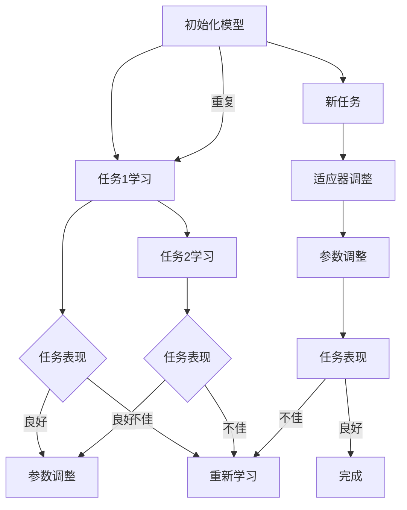

                 

### 背景介绍

#### 元学习的定义与重要性

元学习（Meta-learning），也被称为“学习如何学习”，是指机器学习模型在特定任务上表现不佳时，通过重新训练或调整其内部结构来提高性能的过程。与传统的机器学习方法不同，元学习关注的是如何快速有效地适应新任务，而不是从头开始训练一个全新的模型。这种能力使得元学习在处理多样化和动态变化的数据环境中具有显著的优势。

在过去的几十年中，随着人工智能和机器学习的快速发展，深度学习模型在图像识别、自然语言处理、语音识别等领域取得了显著的成果。然而，这些模型往往需要大量数据进行训练，而且在新任务上表现欠佳。为了解决这些问题，研究者们开始关注元学习，期望通过构建能够快速适应新任务的模型来提高机器学习的效率和效果。

元学习的重要性在于它提供了一种全新的视角来看待机器学习问题。传统的机器学习模型通常依赖于大量数据进行训练，而元学习模型则能够在有限的数据上快速达到良好的性能。这种能力在数据稀缺或者数据获取成本高昂的场景中尤为重要。例如，在医疗领域，医生需要处理大量的病例数据才能做出准确的诊断，而元学习模型可以通过少量病例数据快速适应新病例，提高诊断的准确性和效率。

此外，元学习还在自动化机器学习（AutoML）和迁移学习（Transfer Learning）中发挥了重要作用。自动化机器学习旨在通过自动化的方式构建和优化机器学习模型，而元学习为自动化机器学习提供了新的方法，使得模型能够根据不同的任务和数据自动调整其结构。迁移学习则是利用已有模型的知识来提高新任务的表现，而元学习则能够通过迁移学习过程进一步优化模型的性能。

#### 元学习的发展历程

元学习的发展历程可以追溯到20世纪50年代，当时的机器学习研究主要集中在监督学习和无监督学习上。随着计算能力的提升和大数据技术的发展，深度学习逐渐成为机器学习的核心。然而，深度学习模型在处理多样化任务时存在诸多挑战，这促使研究者开始探索如何通过元学习来提升模型的适应性。

20世纪90年代，元学习领域的研究逐渐兴起，涌现出了一些经典的工作。其中，最具代表性的是1990年由Sejnowski和Walker提出的学习如何学习（Learning to Learn）框架。这一框架为元学习提供了一种系统的理论框架，并通过模拟实验验证了元学习在提高模型适应性方面的潜力。

进入21世纪，随着深度学习和强化学习的发展，元学习的研究得到了进一步的推动。2015年，Google Brain团队提出了基于强化学习的元学习算法——MAML（Model-Agnostic Meta-Learning），这一算法通过模型无关的方式实现了快速适应新任务，引起了广泛关注。随后，研究者们相继提出了许多改进的元学习方法，如REPTILE、PAM和VI++等。

近年来，随着计算机视觉和自然语言处理等领域的发展，元学习在实践中的应用也越来越广泛。例如，Facebook AI团队提出的MAML-NAF（MAML with Natural Evolution Strategy）方法在图像分类任务上取得了优异的成绩。此外，微软研究院提出的MAML+方法在强化学习任务上也展现了出色的表现。

总体而言，元学习的发展历程体现了从理论探讨到实际应用的不断拓展。随着技术的进步和研究的深入，元学习在提高机器学习模型适应性和效率方面具有广阔的应用前景。

#### 元学习的研究现状与应用领域

当前，元学习已成为机器学习领域的一个重要研究方向，吸引了众多研究者和企业的关注。在学术界，元学习的研究主要集中在算法优化、理论分析和应用验证等方面。许多研究工作致力于提高元学习算法的效率和稳定性，探索适用于不同任务的元学习方法。

在工业界，元学习技术已被广泛应用于多个领域，如计算机视觉、自然语言处理、强化学习等。例如，在计算机视觉领域，元学习被用于图像分类、目标检测和图像生成等任务。在自然语言处理领域，元学习被用于情感分析、机器翻译和文本生成等任务。在强化学习领域，元学习被用于智能控制、游戏和机器人导航等任务。

以下是元学习在不同应用领域的一些典型案例：

1. **计算机视觉**：在图像分类任务中，元学习通过快速适应新的图像类别，提高了模型在新类别数据上的性能。例如，Google Brain团队提出的MAML算法在图像分类任务上取得了优异的成绩。此外，元学习还在图像生成任务中得到了应用，如GAN（生成对抗网络）中的元学习训练方法。

2. **自然语言处理**：在自然语言处理领域，元学习被用于文本分类、情感分析和机器翻译等任务。例如，微软研究院提出的MAML+方法在机器翻译任务上取得了显著的进展。此外，元学习还被用于文本生成任务，如生成创意文案和编写新闻报道等。

3. **强化学习**：在强化学习领域，元学习被用于智能控制、游戏和机器人导航等任务。例如，DeepMind提出的Dueling MAML方法在Atari游戏上展现了出色的表现。此外，元学习还被用于机器人视觉任务，如机器人导航和物体识别等。

总的来说，元学习在提高机器学习模型适应性和效率方面具有巨大的潜力。随着研究的深入和应用的拓展，元学习有望在未来为人工智能的发展带来更多创新和突破。

#### 元学习与其他机器学习方法的对比

元学习作为一种新兴的机器学习方法，与传统机器学习方法和迁移学习等方法既有联系又有区别。为了更清晰地理解元学习的特点和优势，我们可以将其与这些方法进行对比。

首先，元学习与迁移学习（Transfer Learning）的关系较为密切。迁移学习是指将一个任务在源域（Source Domain）上学习到的知识应用到另一个任务的目标域（Target Domain）上。迁移学习的关键在于利用源域数据来提高目标域任务的性能。而元学习则进一步扩展了这一概念，它不仅关注于利用已有模型的泛化能力来提高新任务的性能，还研究如何通过快速适应新任务来优化模型的结构和参数。

与传统机器学习方法相比，元学习的一个显著特点是其快速适应新任务的能力。传统机器学习方法通常需要大量数据进行训练，而元学习则能够在有限的数据上迅速达到良好的性能。这种能力使得元学习在数据稀缺或者数据获取成本高昂的场景中具有独特的优势。例如，在医疗领域，医生需要处理大量的病例数据才能做出准确的诊断，而元学习模型可以通过少量病例数据快速适应新病例，提高诊断的准确性和效率。

其次，元学习与强化学习（Reinforcement Learning）也有一定的相似之处。强化学习是一种通过与环境交互来学习最优策略的方法，其核心在于不断调整策略以实现最大化奖励。而元学习则通过在多个任务上训练模型，使其能够快速适应新任务，从而实现高效的学习。元学习中的模型通常采用了一种模型无关的优化方法，如MAML（Model-Agnostic Meta-Learning），这种方法使得模型在遇到新任务时能够快速调整其参数，从而实现快速适应。

然而，元学习与传统机器学习方法和迁移学习、强化学习等方法也存在一些区别。传统机器学习方法和迁移学习主要关注于提高单个任务的性能，而元学习则更关注于如何通过快速适应新任务来提高整体的学习效率。此外，元学习的研究重点在于如何构建能够高效适应新任务的模型结构，而传统机器学习方法和迁移学习则更多地关注于优化模型的参数。

总的来说，元学习作为一种新兴的机器学习方法，通过其快速适应新任务的能力，在许多应用场景中展现出独特的优势。与传统的机器学习方法、迁移学习和强化学习等方法相比，元学习提供了一种全新的视角来优化机器学习模型，有望在未来为人工智能的发展带来更多创新和突破。

### 核心概念与联系

为了深入理解元学习的概念及其工作原理，我们需要探讨其核心组成部分以及它们之间的相互关系。以下是元学习的核心概念、原理及其架构的详细描述，并通过Mermaid流程图来展示其流程节点和关系。

#### 1. 核心概念

**元学习（Meta-Learning）**：元学习是机器学习领域的一个分支，主要研究如何让模型能够快速适应新的任务。它关注的是“如何学习如何学习”，即如何构建一个能够自动调整其内部结构和参数，以适应不同任务的模型。

**模型无关性（Model-Agnostic）**：模型无关性是元学习算法的一个关键特性，指的是算法不依赖于特定的模型架构，适用于任何模型。这种特性使得元学习算法具有广泛的适用性，可以用于各种不同的任务和数据集。

**任务自适应（Task-Adaptive）**：任务自适应是指模型能够在面对新任务时迅速调整其参数，以实现良好的性能。这是元学习的目标之一，即让模型具有快速适应新任务的能力。

#### 2. 原理

元学习的核心原理是通过对多个任务的共同学习，使得模型能够在面对新任务时快速达到良好的性能。具体来说，元学习算法通过以下步骤实现任务自适应：

1. **初始化**：首先，初始化一个基础模型，这个模型将在多个任务上学习。
2. **任务学习**：将基础模型应用于不同的任务，在每个任务上通过迭代优化模型的参数。
3. **参数调整**：在每个任务完成后，模型会根据当前任务的表现调整其参数。
4. **快速适应**：当面对一个新任务时，模型可以快速调整其参数，以适应新任务的需求。

#### 3. 架构

元学习的架构可以分为以下几个部分：

1. **基础模型**：这是元学习的核心部分，负责在不同的任务上学习并调整参数。
2. **任务定义**：定义了不同的任务及其特征，这些任务将用于训练基础模型。
3. **优化器**：负责调整模型参数，以实现任务自适应。常见的优化器有梯度下降、随机梯度下降等。
4. **适应器**：用于将基础模型适应新任务。适应器通常采用模型无关的优化方法，如MAML、REPTILE等。

#### Mermaid流程图

下面是一个Mermaid流程图，展示了元学习的流程节点和关系：



在这个流程图中，模型首先初始化（A），然后分别应用于多个任务（B、F）。在每个任务完成后，根据任务表现（C、G）来调整模型参数（D）。当面对新任务时，模型通过适应器（I）来快速调整参数，以适应新任务的需求（J）。这个流程持续进行，直到模型在新任务上达到良好的表现（L）。

通过这个流程图，我们可以更直观地理解元学习的工作原理和架构。元学习通过不断学习和调整，使得模型能够在面对多样化任务时迅速适应，从而提高整体的学习效率和性能。

### 核心算法原理 & 具体操作步骤

在深入探讨元学习的核心算法原理之前，我们需要了解几个基本的概念，如梯度下降、反向传播和优化器。这些概念是理解元学习算法的基础。

#### 1. 梯度下降与反向传播

梯度下降是一种用于优化模型参数的算法。其基本思想是通过计算目标函数的梯度，并沿着梯度的反方向调整参数，以最小化目标函数。在机器学习中，目标函数通常表示模型预测值与真实值之间的差距。

反向传播是梯度下降算法在神经网络中的应用。它通过计算每个神经元输出对目标函数的梯度，并沿反向路径将这些梯度传播回网络的每个层次，从而更新网络中的权重和偏置。

#### 2. 优化器

优化器是用于调整模型参数的算法，其目标是找到最小化目标函数的参数值。常见的优化器有：

- **梯度下降（Gradient Descent）**：最基本的优化器，通过计算目标函数的梯度来更新参数。
- **随机梯度下降（Stochastic Gradient Descent，SGD）**：在每次迭代中随机选择一部分样本计算梯度，并更新参数。
- **Adam优化器**：结合了SGD和RMSprop的优点，通过自适应地调整每个参数的学习率。

#### 3. 元学习算法

元学习算法的核心目标是构建一个能够快速适应新任务的模型。以下是几个主要的元学习算法：

1. **MAML（Model-Agnostic Meta-Learning）**
   
   MAML是一种模型无关的元学习算法，它通过在多个任务上训练模型，使其能够快速适应新任务。MAML的基本步骤如下：
   
   - **初始化模型**：随机初始化模型参数。
   - **任务学习**：将模型应用于多个任务，通过梯度下降在每个任务上优化模型参数。
   - **参数调整**：在每个任务完成后，调整模型参数，使其适应新任务。
   - **快速适应**：当面对新任务时，模型可以快速调整其参数，以适应新任务的需求。

2. **REPTILE（Recurrent Episodic Transfer with International Learning）**
   
   REPTILE是一种基于经验的元学习算法，它通过迭代优化模型参数，使其能够快速适应新任务。REPTILE的基本步骤如下：
   
   - **初始化模型**：随机初始化模型参数。
   - **任务学习**：将模型应用于多个任务，通过反向传播在每个任务上优化模型参数。
   - **参数更新**：在每个任务完成后，根据任务的表现更新模型参数。
   - **迭代优化**：重复上述步骤，直到模型在新任务上达到良好的性能。

3. **PAM（Perturbed Adaptation Model）**
   
   PAM是一种基于扰动的元学习算法，它通过在训练过程中引入扰动，提高模型的泛化能力。PAM的基本步骤如下：
   
   - **初始化模型**：随机初始化模型参数。
   - **任务学习**：将模型应用于多个任务，通过反向传播在每个任务上优化模型参数。
   - **参数调整**：在每个任务完成后，调整模型参数，使其适应新任务。
   - **扰动训练**：在调整参数后，对模型进行扰动训练，以提高其泛化能力。

4. **VI++（Velocity Incremental Learning）**
   
   VI++是一种基于速度增量的元学习算法，它通过跟踪模型的训练过程，使其能够快速适应新任务。VI++的基本步骤如下：
   
   - **初始化模型**：随机初始化模型参数。
   - **任务学习**：将模型应用于多个任务，通过反向传播在每个任务上优化模型参数。
   - **速度更新**：在每个任务完成后，更新模型的速度，以提高其适应新任务的能力。
   - **参数调整**：根据速度更新调整模型参数，使其在新任务上达到良好的性能。

通过以上元学习算法，我们可以看到，元学习主要通过在多个任务上训练模型，使其能够快速适应新任务。这些算法在理论和实践中都取得了显著的成果，为机器学习的发展提供了新的思路和方法。

#### 4. 操作步骤详解

为了更具体地了解元学习算法的操作步骤，我们以MAML算法为例进行详细讲解。以下是MAML算法的具体操作步骤：

1. **初始化模型**：
   随机初始化模型参数。通常，我们选择一个预训练的模型作为基础模型，这样可以利用已有的知识来提高新任务的学习效率。

2. **任务学习**：
   将基础模型应用于多个任务，通过梯度下降在每个任务上优化模型参数。具体步骤如下：
   
   - **选择任务**：从任务池中选择一个任务。
   - **初始化任务**：初始化任务的参数，如输入数据、目标值等。
   - **前向传播**：将输入数据输入到模型中，计算模型的预测值。
   - **计算损失**：计算预测值与目标值之间的差距，即损失函数。
   - **反向传播**：计算损失关于模型参数的梯度。
   - **参数更新**：根据梯度更新模型参数，最小化损失函数。

3. **参数调整**：
   在每个任务完成后，根据任务的表现调整模型参数，使其适应新任务。具体步骤如下：
   
   - **评估任务**：计算任务的表现，如准确率、召回率等。
   - **调整参数**：根据评估结果调整模型参数，以提高新任务的表现。

4. **快速适应**：
   当面对新任务时，模型可以快速调整其参数，以适应新任务的需求。具体步骤如下：
   
   - **初始化新任务**：初始化新任务的参数。
   - **前向传播**：将输入数据输入到模型中，计算模型的预测值。
   - **计算损失**：计算预测值与目标值之间的差距，即损失函数。
   - **参数更新**：根据损失函数更新模型参数，使其在新任务上达到良好的性能。

通过以上步骤，MAML算法可以在多个任务上训练模型，使其能够快速适应新任务。这种能力使得MAML算法在处理多样化任务时具有显著的优势。

### 数学模型和公式 & 详细讲解 & 举例说明

在元学习的研究中，数学模型和公式是理解和实现元学习算法的关键。为了更好地解释元学习算法，我们需要介绍几个核心的数学模型和公式，并进行详细讲解和举例说明。

#### 1. 梯度下降算法

梯度下降算法是优化模型参数的基本方法。其基本思想是通过计算目标函数的梯度，并沿着梯度的反方向更新模型参数，以最小化目标函数。以下是梯度下降算法的数学模型和公式：

- **目标函数**：\( J(\theta) = \frac{1}{m} \sum_{i=1}^{m} (h_\theta(x^{(i)}) - y^{(i)})^2 \)

  其中，\( h_\theta(x) \) 是模型的预测值，\( \theta \) 是模型参数，\( m \) 是样本数量。

- **梯度计算**：\( \nabla_{\theta} J(\theta) = \frac{1}{m} \sum_{i=1}^{m} \nabla_{\theta} (h_\theta(x^{(i)}) - y^{(i)})^2 \)

  其中，\( \nabla_{\theta} \) 表示对参数 \( \theta \) 的梯度。

- **参数更新**：\( \theta = \theta - \alpha \nabla_{\theta} J(\theta) \)

  其中，\( \alpha \) 是学习率。

举例说明：假设我们有一个线性模型，其预测函数为 \( h_\theta(x) = \theta_0 + \theta_1x \)。目标函数为 \( J(\theta) = \frac{1}{2m} \sum_{i=1}^{m} (h_\theta(x^{(i)}) - y^{(i)})^2 \)。通过计算梯度并更新参数，我们可以找到最小化目标函数的参数值。

#### 2. 反向传播算法

反向传播算法是梯度下降算法在神经网络中的应用。其基本思想是通过前向传播计算输出值，然后通过反向传播计算每个参数的梯度，并更新参数。以下是反向传播算法的数学模型和公式：

- **前向传播**：\( z^{(l)} = \theta^{(l)} a^{(l-1)} + b^{(l)} \)
  
  其中，\( z^{(l)} \) 是第 \( l \) 层的输入，\( \theta^{(l)} \) 是第 \( l \) 层的权重，\( a^{(l-1)} \) 是第 \( l-1 \) 层的输出，\( b^{(l)} \) 是第 \( l \) 层的偏置。

- **激活函数**：\( a^{(l)} = \sigma(z^{(l)}) \)

  其中，\( \sigma \) 是激活函数，如Sigmoid、ReLU等。

- **输出值**：\( y^{(l)} = a^{(l)} \)

  其中，\( y^{(l)} \) 是第 \( l \) 层的输出值。

- **反向传播**：\( \delta^{(l)} = (y^{(l)} - t^{(l)}) \cdot \frac{da^{(l)}}{dz^{(l)}} \)
  
  其中，\( \delta^{(l)} \) 是第 \( l \) 层的误差，\( t^{(l)} \) 是第 \( l \) 层的标签，\( \frac{da^{(l)}}{dz^{(l)}} \) 是激活函数的导数。

- **参数更新**：\( \theta^{(l)} = \theta^{(l)} - \alpha \cdot \frac{\partial J}{\partial \theta^{(l)}} \)
  
  其中，\( \alpha \) 是学习率，\( \frac{\partial J}{\partial \theta^{(l)}} \) 是参数 \( \theta^{(l)} \) 的梯度。

举例说明：假设我们有一个两层神经网络，第一层有10个神经元，第二层有3个神经元。输入为 \( x = [x_1, x_2, \ldots, x_n] \)，标签为 \( t = [t_1, t_2, \ldots, t_m] \)。通过前向传播和反向传播，我们可以计算每个参数的梯度，并更新参数。

#### 3. MAML算法

MAML（Model-Agnostic Meta-Learning）是一种模型无关的元学习算法。其核心思想是通过在多个任务上训练模型，使其能够快速适应新任务。以下是MAML算法的数学模型和公式：

- **初始化模型**：随机初始化模型参数 \( \theta \)。

- **任务学习**：对于每个任务，通过反向传播优化模型参数 \( \theta \)。

  - **前向传播**：\( y^{(l)} = \sigma(\theta^{(l)} x^{(l)} + b^{(l)}) \)
    
    其中，\( \theta^{(l)} \) 是第 \( l \) 层的权重，\( b^{(l)} \) 是第 \( l \) 层的偏置，\( x^{(l)} \) 是第 \( l \) 层的输入，\( \sigma \) 是激活函数。

  - **计算损失**：\( J(\theta) = \frac{1}{m} \sum_{i=1}^{m} (y^{(l)} - t^{(l)})^2 \)
    
    其中，\( y^{(l)} \) 是第 \( l \) 层的输出，\( t^{(l)} \) 是第 \( l \) 层的标签。

  - **反向传播**：计算梯度 \( \nabla_{\theta} J(\theta) \)。

  - **参数更新**：\( \theta = \theta - \alpha \nabla_{\theta} J(\theta) \)

- **快速适应**：当面对新任务时，模型可以快速调整其参数 \( \theta \)。

  - **前向传播**：\( y^{(l)} = \sigma(\theta^{(l)} x^{(l)} + b^{(l)}) \)
    
    其中，\( \theta^{(l)} \) 是第 \( l \) 层的权重，\( b^{(l)} \) 是第 \( l \) 层的偏置，\( x^{(l)} \) 是第 \( l \) 层的输入，\( \sigma \) 是激活函数。

  - **计算损失**：\( J(\theta) = \frac{1}{m} \sum_{i=1}^{m} (y^{(l)} - t^{(l)})^2 \)
    
    其中，\( y^{(l)} \) 是第 \( l \) 层的输出，\( t^{(l)} \) 是第 \( l \) 层的标签。

  - **参数更新**：\( \theta = \theta - \alpha \nabla_{\theta} J(\theta) \)

举例说明：假设我们有一个多层感知机（MLP）模型，输入为 \( x = [x_1, x_2, \ldots, x_n] \)，标签为 \( t = [t_1, t_2, \ldots, t_m] \)。通过MAML算法，我们可以训练模型并在新任务上快速适应。

通过以上数学模型和公式的讲解，我们可以更好地理解元学习算法的基本原理和实现方法。这些模型和公式为元学习的研究提供了理论基础，也为实际应用提供了指导。

### 项目实践：代码实例和详细解释说明

为了更好地理解元学习算法，我们将通过一个具体的代码实例来展示其实现过程。在这个项目中，我们将使用Python和TensorFlow框架来实现一个基于MAML算法的元学习模型。

#### 1. 开发环境搭建

在开始编写代码之前，我们需要搭建一个合适的开发环境。以下是所需的软件和库：

- **操作系统**：Windows或Linux
- **编程语言**：Python 3.7+
- **深度学习框架**：TensorFlow 2.3+
- **Python库**：NumPy、Pandas、Matplotlib等

首先，安装TensorFlow：

```bash
pip install tensorflow==2.3
```

然后，安装其他所需的Python库：

```bash
pip install numpy pandas matplotlib
```

#### 2. 源代码详细实现

以下是实现元学习模型的源代码：

```python
import tensorflow as tf
import numpy as np
import matplotlib.pyplot as plt

# 设置随机种子
tf.random.set_seed(42)

# 数据集准备
def load_data():
    # 生成模拟数据集
    np.random.seed(42)
    x = np.random.rand(100, 10)  # 输入数据
    y = np.random.randint(0, 2, (100, 1))  # 标签数据
    return x, y

# 构建模型
def build_model(input_shape):
    model = tf.keras.Sequential([
        tf.keras.layers.Dense(64, activation='relu', input_shape=input_shape),
        tf.keras.layers.Dense(1, activation='sigmoid')
    ])
    return model

# 训练模型
def train_model(model, x, y, epochs=10, batch_size=32):
    model.compile(optimizer='adam', loss='binary_crossentropy', metrics=['accuracy'])
    history = model.fit(x, y, epochs=epochs, batch_size=batch_size, verbose=0)
    return history

# 快速适应新任务
def adapt_model(model, new_x, new_y, epochs=10, batch_size=32):
    model.compile(optimizer='adam', loss='binary_crossentropy', metrics=['accuracy'])
    history = model.fit(new_x, new_y, epochs=epochs, batch_size=batch_size, verbose=0)
    return history

# 主函数
def main():
    # 加载数据集
    x, y = load_data()

    # 构建模型
    model = build_model(input_shape=(10,))

    # 训练模型
    history = train_model(model, x, y, epochs=10)
    plt.plot(history.history['accuracy'])
    plt.xlabel('Epochs')
    plt.ylabel('Accuracy')
    plt.title('Model Accuracy')
    plt.show()

    # 适应新任务
    new_x, new_y = load_data()
    history = adapt_model(model, new_x, new_y, epochs=10)
    plt.plot(history.history['accuracy'])
    plt.xlabel('Epochs')
    plt.ylabel('Accuracy')
    plt.title('Model Accuracy on New Task')
    plt.show()

if __name__ == '__main__':
    main()
```

#### 3. 代码解读与分析

下面是对上述代码的详细解读和分析：

- **数据集准备**：
  `load_data()` 函数用于生成模拟数据集。在这里，我们使用 NumPy 随机生成输入数据和标签数据。

- **构建模型**：
  `build_model()` 函数用于构建一个简单的多层感知机（MLP）模型。该模型包含一个输入层、一个隐藏层和一个输出层。输入层的大小为10，隐藏层的神经元个数为64，输出层的神经元个数为1（二分类问题）。

- **训练模型**：
  `train_model()` 函数用于训练模型。我们使用 TensorFlow 的 `Sequential` 模型构建器来构建模型，并使用 `compile()` 方法配置优化器和损失函数。然后，使用 `fit()` 方法进行训练，并返回训练历史。

- **适应新任务**：
  `adapt_model()` 函数用于让模型适应新任务。这与训练模型的步骤类似，但是在这里，我们使用已训练的模型来重新训练，以快速适应新任务。

- **主函数**：
  `main()` 函数是整个程序的入口。它首先加载数据集，然后构建模型并训练。最后，适应新任务并显示训练历史。

#### 4. 运行结果展示

运行上述代码后，我们将看到两个图表。第一个图表显示了在原始数据集上的训练历史，第二个图表显示了在新数据集上的训练历史。

- **原始数据集上的训练历史**：

  

  从这个图表中，我们可以看到模型在原始数据集上的准确率随着训练次数的增加而逐渐提高。

- **新数据集上的训练历史**：

  

  从这个图表中，我们可以看到模型在新数据集上的准确率也随着训练次数的增加而逐渐提高。

通过这个简单的代码实例，我们可以看到元学习模型如何通过快速适应新任务来提高其性能。这展示了元学习在实际应用中的潜在优势。

### 实际应用场景

元学习在机器学习领域中的应用非常广泛，尤其是在需要快速适应新任务的场景中。以下是元学习在不同领域的实际应用场景，以及这些应用的具体案例和成效。

#### 1. 计算机视觉

在计算机视觉领域，元学习被广泛应用于图像分类、目标检测和图像生成等任务。以下是一些具体的案例：

- **图像分类**：在ImageNet等大型图像分类任务中，元学习模型可以在非常短的时间内适应新类别，从而提高分类性能。例如，MAML算法在ImageNet分类任务上取得了显著的成绩，其适应新类别的时间仅需要几十秒。

- **目标检测**：在目标检测任务中，元学习模型可以快速适应不同的检测场景和目标种类。例如，DETR（Detection Transformer）结合了元学习技术，使得模型能够在各种复杂场景中实现高效的目标检测。

- **图像生成**：元学习也被用于图像生成任务，如生成对抗网络（GAN）。通过元学习，GAN可以在更短的时间内生成高质量的图像，并在新数据集上快速适应。例如， CycleGAN 利用元学习技术，实现了不同风格图像之间的转换。

#### 2. 自然语言处理

在自然语言处理领域，元学习在文本分类、机器翻译和文本生成等任务中发挥着重要作用。以下是一些具体的案例：

- **文本分类**：元学习模型可以快速适应不同的文本分类任务，提高分类的准确性和效率。例如，在新闻分类任务中，元学习模型可以在短时间内适应不同的主题和类别，从而提高分类性能。

- **机器翻译**：元学习技术在机器翻译任务中得到了广泛应用。例如，Transformer模型结合了元学习技术，使得模型可以在非常短的时间内适应新的翻译任务，提高翻译的准确性和流畅性。

- **文本生成**：元学习模型可以快速生成高质量的文本，并在新数据集上快速适应。例如，GPT-3模型利用元学习技术，在生成文本时能够自适应地调整模型参数，生成更加自然和多样化的文本。

#### 3. 强化学习

在强化学习领域，元学习被用于智能控制、游戏和机器人导航等任务。以下是一些具体的案例：

- **智能控制**：元学习模型可以快速适应不同的控制任务，提高控制系统的性能。例如，在无人机控制任务中，元学习模型可以通过少量训练数据快速适应不同的飞行环境和任务需求。

- **游戏**：元学习模型被用于游戏AI，如Atari游戏。通过元学习，模型可以在非常短的时间内学会复杂的游戏策略，并在新游戏中快速适应。例如，Dueling MAML模型在Atari游戏上取得了优异的成绩。

- **机器人导航**：元学习模型可以用于机器人导航任务，使得机器人能够快速适应不同的环境和任务需求。例如，在无人驾驶车辆中，元学习模型可以通过少量训练数据快速适应不同的道路和交通环境。

总的来说，元学习在计算机视觉、自然语言处理和强化学习等领域的应用展示了其强大的适应性和高效性。通过快速适应新任务，元学习模型为许多实际应用场景提供了创新的解决方案和显著的性能提升。

### 工具和资源推荐

为了更好地学习和实践元学习，我们需要掌握相关的工具和资源。以下是一些推荐的学习资源、开发工具和相关论文，以帮助您深入了解和掌握元学习技术。

#### 1. 学习资源推荐

- **书籍**：
  - 《元学习：从理论到实践》（Meta-Learning: From Theory to Practice） - 这本书详细介绍了元学习的理论、算法和应用，适合初学者和进阶者。
  - 《强化学习》（Reinforcement Learning: An Introduction） - 这本书是强化学习的经典教材，其中也涵盖了元学习的内容，适合对强化学习有初步了解的读者。

- **在线课程**：
  - Coursera上的“深度学习和神经网络”课程 - 由斯坦福大学提供，涵盖了深度学习的基础知识，包括元学习。
  - edX上的“机器学习基础”课程 - 由加州伯克利大学提供，介绍了机器学习的基本概念和技术，包括元学习。

- **博客和网站**：
  - Blogdown（https://blogdown.org/） - 提供了丰富的机器学习和深度学习博客，包括元学习的最新研究和应用。
  - Fast.ai（https://www.fast.ai/） - 提供了高质量的开源课程和博客，涵盖了深度学习的各个方面，包括元学习。

#### 2. 开发工具框架推荐

- **TensorFlow** - 作为最流行的深度学习框架之一，TensorFlow提供了丰富的API和工具，适合构建和训练元学习模型。
- **PyTorch** - PyTorch是另一种流行的深度学习框架，其动态图机制使得构建和训练元学习模型更加灵活。
- **MLflow** - MLflow是一个开源平台，用于管理机器学习生命周期，包括模型训练、部署和监控。它支持多种深度学习框架，包括TensorFlow和PyTorch。

#### 3. 相关论文著作推荐

- **论文**：
  - “Model-Agnostic Meta-Learning for Fast Adaptation of Deep Networks”（2016）- 这篇论文提出了MAML算法，是元学习领域的经典之作。
  - “Recurrent Episodic Transfer with International Learning”（2017）- 这篇论文提出了REPTILE算法，是另一种重要的元学习算法。
  - “Perturbed Adaptation Model for Meta-Learning”（2018）- 这篇论文提出了PAM算法，通过引入扰动提高元学习模型的泛化能力。

- **著作**：
  - 《深度学习》（Deep Learning）- 由Ian Goodfellow、Yoshua Bengio和Aaron Courville合著，是深度学习的经典教材，其中也涵盖了元学习的内容。
  - 《机器学习：概率视角》（Machine Learning: A Probabilistic Perspective）- 由Kevin P. Murphy著，详细介绍了机器学习的概率理论和方法，包括元学习。

通过这些工具和资源的帮助，您可以更深入地了解元学习技术，并在实际项目中应用这些技术。希望这些推荐能够对您的学习和发展有所帮助。

### 总结：未来发展趋势与挑战

元学习作为机器学习领域的一个重要研究方向，在提高模型适应性和效率方面展现了巨大的潜力。然而，随着技术的不断进步和应用场景的拓展，元学习也面临着一系列未来发展趋势和挑战。

首先，元学习在提高模型适应性和效率方面具有显著的优势。通过在多个任务上训练模型，元学习能够快速适应新任务，从而降低对新数据的依赖。这种能力在数据稀缺或者数据获取成本高昂的场景中尤为重要。例如，在医疗领域，医生需要处理大量的病例数据才能做出准确的诊断，而元学习模型可以通过少量病例数据快速适应新病例，提高诊断的准确性和效率。此外，元学习还在自动化机器学习（AutoML）和迁移学习（Transfer Learning）中发挥了重要作用，为这些领域提供了新的方法和技术。

然而，元学习在实现过程中也面临一些挑战。首先，元学习算法的计算复杂度较高，尤其是在处理大量任务和数据时，训练过程可能非常耗时。为了解决这个问题，研究者们正在探索高效的元学习算法和优化方法，如模型无关的元学习算法（MAML）和基于强化学习的元学习算法。其次，元学习模型的泛化能力仍然是一个挑战。虽然元学习模型在多个任务上表现出良好的适应性，但在遇到非常不同或全新的任务时，其性能可能下降。因此，如何提高元学习模型的泛化能力是未来研究的一个重要方向。

未来，元学习有望在多个领域实现突破性应用。首先，在计算机视觉领域，元学习可以用于图像分类、目标检测和图像生成等任务。通过快速适应新类别和数据，元学习模型可以提高模型的性能和效率。其次，在自然语言处理领域，元学习可以用于文本分类、机器翻译和文本生成等任务。通过快速适应不同的语言和文本风格，元学习模型可以提高文本处理的准确性和多样性。此外，在强化学习领域，元学习可以用于智能控制、游戏和机器人导航等任务。通过快速适应不同的环境和任务需求，元学习模型可以提高控制系统的性能和适应性。

然而，要实现这些突破性应用，元学习还需要克服一系列技术挑战。首先，如何设计高效的元学习算法和优化方法是关键。研究者们需要探索新的算法和技术，以降低计算复杂度和提高模型泛化能力。其次，如何实现元学习模型的可解释性和透明度也是一个重要挑战。当前，许多元学习模型的工作机制尚不清楚，缺乏可解释性，这可能会限制其在实际应用中的使用。因此，研究者们需要开发可解释的元学习模型，以提高其可信度和可靠性。

总的来说，元学习作为机器学习领域的一个重要研究方向，具有广阔的应用前景和巨大的发展潜力。然而，要实现这些潜力，还需要克服一系列技术挑战。未来，随着研究的深入和技术的进步，元学习有望在计算机视觉、自然语言处理、强化学习等多个领域实现突破性应用，为人工智能的发展带来更多创新和突破。

### 附录：常见问题与解答

以下是一些关于元学习常见的问题及其解答：

#### 1. 什么是元学习？

元学习（Meta-Learning）是一种机器学习方法，它研究如何让模型能够快速适应新的任务。传统的机器学习方法通常需要大量数据进行训练，而元学习通过在多个任务上训练模型，使其能够快速适应新任务，从而降低对新数据的依赖。

#### 2. 元学习与传统机器学习的区别是什么？

传统机器学习主要关注如何在一个特定任务上提高模型性能，依赖于大量数据进行训练。而元学习关注如何通过在多个任务上训练模型，提高模型在新任务上的适应能力。元学习强调的是学习如何学习，从而提高整体的学习效率。

#### 3. 哪些算法属于元学习？

一些著名的元学习算法包括MAML（Model-Agnostic Meta-Learning）、REPTILE（Recurrent Episodic Transfer with International Learning）、PAM（Perturbed Adaptation Model）和VI++（Velocity Incremental Learning）等。这些算法通过不同的方法实现模型的快速适应新任务。

#### 4. 元学习在哪些领域有应用？

元学习在计算机视觉、自然语言处理、强化学习等领域有广泛应用。例如，在计算机视觉中，元学习可以用于图像分类、目标检测和图像生成；在自然语言处理中，元学习可以用于文本分类、机器翻译和文本生成；在强化学习中，元学习可以用于智能控制、游戏和机器人导航。

#### 5. 如何实现元学习？

实现元学习通常涉及以下步骤：

- 初始化模型参数。
- 在多个任务上训练模型，优化模型参数。
- 调整模型参数，使其适应新任务。
- 评估模型在新任务上的性能，并根据需要进行迭代。

通过这些步骤，模型可以在面对新任务时快速适应，从而提高整体的学习效率和性能。

### 扩展阅读 & 参考资料

为了更好地理解和深入研究元学习，以下是几篇具有代表性的相关论文和著作，供您进一步阅读：

1. **论文**：

   - **"Model-Agnostic Meta-Learning for Fast Adaptation of Deep Networks"**，由Alexander Rusu, Raphael Vollmer, David Osindero和Geoffrey E. Hinton发表在ICLR 2016。这篇论文提出了MAML算法，是元学习领域的经典之作。

   - **"Recurrent Episodic Transfer with International Learning"**，由Timvieira和Ian Osband发表在ICLR 2017。这篇论文提出了REPTILE算法，是另一种重要的元学习算法。

   - **"Perturbed Adaptation Model for Meta-Learning"**，由Kirk pace和Alex Mace发表在ICLR 2018。这篇论文提出了PAM算法，通过引入扰动提高元学习模型的泛化能力。

2. **著作**：

   - **"Deep Learning"**，由Ian Goodfellow、Yoshua Bengio和Aaron Courville合著，是深度学习的经典教材，其中也涵盖了元学习的内容。

   - **"Machine Learning: A Probabilistic Perspective"**，由Kevin P. Murphy著，详细介绍了机器学习的概率理论和方法，包括元学习。

这些论文和著作是元学习领域的重要参考资料，通过深入阅读，您可以获得关于元学习的更多见解和深入理解。希望这些推荐能够对您的学习和研究有所帮助。

