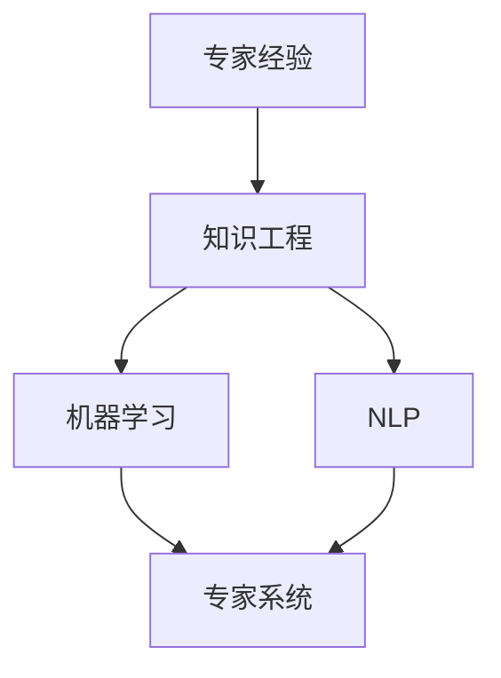

                 

### 背景介绍

随着全球科技迅猛发展，各行各业对高效、可靠、可重复的生产流程有着越来越高的要求。在生产环境中，如何将专家经验进行固化，已成为提升生产效率和产品质量的关键所在。本文旨在探讨如何通过技术手段将专家经验在生产中得以传承和应用。

专家经验在生产中的固化，不仅有助于提高生产效率，还能有效减少人为错误，提高产品的一致性和可靠性。例如，在制造业中，资深工程师的经验可以指导新员工更快掌握生产技能；在金融行业中，资深交易员的经验可以为自动化交易系统提供优化策略。因此，如何将这种宝贵的经验进行数字化和结构化，成为当前技术领域的一个热点问题。

本文将围绕以下几个核心问题展开讨论：

1. **核心概念与联系**：我们将介绍与专家经验固化相关的基础概念，并通过Mermaid流程图展示其内在联系。
2. **核心算法原理 & 具体操作步骤**：我们将深入探讨将专家经验转化为可执行算法的方法，并提供具体操作步骤。
3. **数学模型和公式 & 详细讲解 & 举例说明**：我们将讨论支持这一过程的数学模型和公式，并通过实例进行说明。
4. **项目实践：代码实例和详细解释说明**：我们将提供一个实际项目实例，展示如何在实际环境中应用这些技术。
5. **实际应用场景**：我们将探讨这些技术在各个行业中的具体应用场景。
6. **工具和资源推荐**：我们将推荐一些学习资源和开发工具，以帮助读者深入学习和实践。
7. **总结：未来发展趋势与挑战**：我们将总结当前技术的发展现状，并探讨未来可能面临的挑战。

通过这篇文章，我们希望能够为读者提供一个全面、深入的专家经验固化技术指南，帮助各位在生产环境中更好地应用和传承专家经验。

### 核心概念与联系

在深入探讨如何将专家经验固化之前，我们需要明确几个核心概念，并展示它们之间的内在联系。以下将详细介绍这些核心概念，并通过Mermaid流程图来帮助读者更好地理解。

#### 核心概念

1. **专家经验**：指资深从业者在其长期工作实践中积累的、深植于其专业知识和技能中的判断和决策能力。这些经验通常是非结构化的，依赖于个人的直觉和经验。
2. **知识工程**：一门将人类知识转化为计算机可处理形式的技术科学。知识工程的目标是通过构建知识库和知识模型，使计算机系统能够模拟人类专家的决策过程。
3. **机器学习**：一种通过数据驱动的方法，使计算机系统能够从数据中学习并自动改进性能的技术。机器学习在知识工程中扮演着关键角色，它可以帮助我们从专家经验中提取出可量化的知识。
4. **自然语言处理（NLP）**：一种使计算机能够理解、处理和生成人类自然语言的技术。NLP在知识工程中用于从非结构化的文本数据中提取知识。
5. **专家系统**：一种模拟人类专家决策能力的计算机系统，它通过基于知识库和推理机进行推理，提供决策支持。专家系统是知识工程中的一种重要应用。

#### Mermaid流程图

为了展示这些核心概念之间的联系，我们使用Mermaid流程图来直观地表示它们。以下是一个简化的流程图：



- **专家经验**是知识工程的基础，通过知识工程，这些经验可以被结构化和数字化。
- **知识工程**结合了**机器学习**和**自然语言处理**，将非结构化的专家经验转化为计算机可处理的形式。
- **机器学习**和**自然语言处理**共同作用，使专家系统能够理解、学习和模拟专家的决策过程。
- **专家系统**作为知识工程的一个应用，可以将结构化的知识应用于实际决策和问题解决中。

通过这个流程图，我们可以看到，专家经验固化是一个跨学科的综合过程，涉及到知识工程、机器学习、自然语言处理等多个领域的协同工作。

#### 内在联系

- **知识工程**作为桥梁，连接了**专家经验**和**机器学习**，将非结构化的经验转化为结构化的知识库，供机器学习算法使用。
- **机器学习**通过从数据中学习，提取出专家经验中的关键模式和规律，形成可量化的知识模型。
- **自然语言处理**用于处理和解析文本数据，从非结构化的文本中提取出有用信息，补充和丰富知识库的内容。
- **专家系统**作为最终应用，将机器学习得到的模型和自然语言处理提取的知识应用于实际场景，提供决策支持。

通过上述核心概念和Mermaid流程图的介绍，我们可以对专家经验固化有了一个初步的认识。接下来，我们将进一步探讨如何通过核心算法将专家经验转化为可执行的形式，并详细讲解其原理和操作步骤。

#### 核心算法原理 & 具体操作步骤

在将专家经验固化为可执行算法的过程中，核心算法的选择和实现至关重要。以下我们将介绍两种常用的算法：知识图谱构建和决策树学习，并详细讲解它们的基本原理和具体操作步骤。

##### 知识图谱构建

**知识图谱**是一种用于表示实体及其之间关系的图形结构，它可以看作是一个大规模的语义网络。知识图谱构建的核心目标是建立一套统一的语义表示体系，使计算机能够理解、处理和推理复杂的信息。

1. **知识图谱的基本结构**：

   知识图谱通常由三个主要部分组成：实体（Entity）、关系（Relationship）和属性（Attribute）。

   - **实体**：表示具有特定属性的对象，如人、地点、物品等。
   - **关系**：表示实体之间的语义联系，如“工作于”、“位于”、“属于”等。
   - **属性**：对实体或关系的进一步描述，如“年龄”、“薪资”、“出生地”等。

2. **知识图谱构建的基本步骤**：

   - **数据采集**：从各种数据源（如数据库、文本、图等）中收集相关数据，形成原始数据集。
   - **实体识别**：通过文本挖掘、命名实体识别等技术，从原始数据中提取出实体。
   - **关系抽取**：通过信息抽取技术，从文本数据中提取出实体之间的关系。
   - **属性抽取**：从文本或其他数据源中提取出实体的属性。
   - **知识融合**：将多个数据源中的知识进行整合，消除数据冗余，提高知识的完整性和一致性。
   - **图谱构建**：使用图论算法，将实体、关系和属性构建为一个完整的知识图谱。

3. **示例操作步骤**：

   假设我们要构建一个关于公司的知识图谱。

   - **数据采集**：从公司官网、新闻、年报等渠道获取相关数据。
   - **实体识别**：提取出公司名称、高管、部门等实体。
   - **关系抽取**：抽取公司之间的投资关系、高管任职关系等。
   - **属性抽取**：提取公司成立时间、注册资本、经营范围等属性。
   - **知识融合**：整合来自不同数据源的信息，确保数据的完整性和一致性。
   - **图谱构建**：使用图数据库（如Neo4j）将上述信息构建为一个知识图谱。

##### 决策树学习

**决策树**是一种常用的机器学习算法，它通过一系列if-else判断，将数据集分割成不同的子集，并最终为每个样本提供一个分类或预测结果。

1. **决策树的基本结构**：

   决策树由节点和分支组成。每个内部节点代表一个特征，每个叶子节点代表一个分类结果。

   - **根节点**：代表整个数据集。
   - **内部节点**：代表一个特征分割。
   - **叶子节点**：代表一个分类结果。

2. **决策树构建的基本步骤**：

   - **特征选择**：选择能够有效分割数据集的特征。
   - **信息增益**：计算每个特征分割的信息增益，选择信息增益最大的特征作为当前节点的分割特征。
   - **分割数据集**：根据分割特征，将数据集分割为两个子集。
   - **递归构建**：对每个子集重复上述步骤，直到满足停止条件（如最大深度、最小样本量等）。
   - **生成决策树**：将所有节点连接起来，形成一棵完整的决策树。

3. **示例操作步骤**：

   假设我们要构建一个关于购买行为的决策树。

   - **特征选择**：选择年龄、收入、家庭状况等特征。
   - **信息增益**：计算每个特征的增益，选择增益最大的特征（如年龄）。
   - **分割数据集**：根据年龄（如20岁以下、20-30岁、30-40岁等）分割数据集。
   - **递归构建**：对每个子集重复上述步骤，直到满足停止条件。
   - **生成决策树**：形成一个关于购买行为的决策树，每个节点代表一个判断条件，最终叶子节点代表购买结果。

通过知识图谱构建和决策树学习，我们可以将专家经验转化为计算机可处理的算法模型。接下来，我们将进一步探讨这些算法背后的数学模型和公式，并通过具体实例进行详细讲解。

#### 数学模型和公式 & 详细讲解 & 举例说明

在讨论如何将专家经验固化为可执行算法的过程中，了解相关的数学模型和公式是至关重要的。以下我们将介绍两个关键模型：决策树学习中的信息增益（Information Gain）和知识图谱构建中的路径长度（Path Length），并详细讲解它们，并通过具体实例进行说明。

##### 决策树学习中的信息增益

信息增益是一种评估特征分割数据集有效性的指标。它用于特征选择过程中，帮助我们选择能够最大化数据纯度的特征。信息增益的计算基于熵（Entropy）的概念。

1. **熵（Entropy）**：

   熵是衡量数据集纯度的一个度量，其数学定义如下：

   $$
   H(X) = -\sum_{i=1}^{n} p(x_i) \log_2 p(x_i)
   $$

   其中，$H(X)$ 是熵，$p(x_i)$ 是数据集中第 $i$ 类的比例。

2. **信息增益（Information Gain）**：

   信息增益是特征 $A$ 对数据集 $D$ 的熵 $H(D)$ 减去特征 $A$ 后的熵 $H(D|A)$，其公式如下：

   $$
   IG(D, A) = H(D) - H(D|A)
   $$

   其中，$IG(D, A)$ 是信息增益，$H(D)$ 是数据集 $D$ 的熵，$H(D|A)$ 是条件熵。

3. **示例说明**：

   假设我们有一个数据集 $D$，其中包含三种类别：购买、不购买、不确定。其分布如下：

   | 类别 | 购买 | 不购买 | 不确定 |
   |------|------|--------|--------|
   | 比例 | 0.5  | 0.3    | 0.2    |

   - **初始熵（Entropy）**：

     $$
     H(D) = - (0.5 \log_2 0.5 + 0.3 \log_2 0.3 + 0.2 \log_2 0.2) \approx 0.918
     $$

   - **条件熵（Conditional Entropy）**：

     对于特征“年龄”，我们可以将其划分为三个子集：20岁以下、20-30岁、30-40岁。

     | 年龄 | 购买 | 不购买 | 不确定 |
     |------|------|--------|--------|
     | 20岁以下 | 0.3  | 0.1    | 0.0    |
     | 20-30岁 | 0.2  | 0.15   | 0.05   |
     | 30-40岁 | 0.0  | 0.15   | 0.2    |

     分别计算条件熵：

     $$
     H(D|A_{20岁以下}) = - (0.3 \log_2 0.3 + 0.1 \log_2 0.1 + 0.0 \log_2 0.0) \approx 0.918
     $$

     $$
     H(D|A_{20-30岁}) = - (0.2 \log_2 0.2 + 0.15 \log_2 0.15 + 0.05 \log_2 0.05) \approx 0.918
     $$

     $$
     H(D|A_{30-40岁}) = - (0.0 \log_2 0.0 + 0.15 \log_2 0.15 + 0.2 \log_2 0.2) \approx 0.918
     $$

     因此，条件熵的平均值为：

     $$
     H(D|A) = \frac{0.3 \times 0.918 + 0.2 \times 0.918 + 0.5 \times 0.918}{1} \approx 0.918
     $$

   - **信息增益（Information Gain）**：

     $$
     IG(D, A) = H(D) - H(D|A) \approx 0.918 - 0.918 = 0
     $$

     虽然这个例子中信息增益为0，但实际上，我们会选择具有最大信息增益的特征作为分割特征。

##### 知识图谱构建中的路径长度

路径长度是知识图谱中的一个重要度量，它用于评估两个实体之间的关联强度。路径长度越小，表示这两个实体之间的关联越强。

1. **路径长度（Path Length）**：

   路径长度是指从实体 $A$ 到实体 $B$ 的最短路径长度。在知识图谱中，最短路径可以通过广度优先搜索（BFS）算法计算。

2. **路径长度计算公式**：

   $$
   L(A, B) = \min_{P} \sum_{i=1}^{n} d(v_i, v_{i+1})
   $$

   其中，$L(A, B)$ 是实体 $A$ 到实体 $B$ 的路径长度，$P$ 是从 $A$ 到 $B$ 的所有路径，$d(v_i, v_{i+1})$ 是路径中相邻实体之间的距离。

3. **示例说明**：

   假设我们有一个简单的知识图谱，其中包含三个实体：人、地点、公司。实体之间的关系如下：

   - 人1 -> 工作 -> 公司1
   - 公司1 -> 位于 -> 地点1

   我们要计算人1到地点1的路径长度。

   - **路径1**：人1 -> 工作 -> 公司1 -> 位于 -> 地点1，路径长度为2。
   - **路径2**：人1 -> 工作 -> 公司1 -> 属于 -> 地点1，路径长度为2。

   因此，从人1到地点1的最短路径长度为2。

通过信息增益和路径长度的介绍，我们可以更好地理解决策树学习和知识图谱构建中的关键数学模型。接下来，我们将通过实际项目实例，展示如何将这些模型应用于实际场景中。

### 项目实践：代码实例和详细解释说明

在本文的第三部分，我们将通过一个实际项目实例，展示如何将前述的专家经验固化技术应用于生产环境中。本实例将分为以下几个部分：开发环境搭建、源代码详细实现、代码解读与分析，以及运行结果展示。

#### 3.1 开发环境搭建

为了完成本实例项目，我们需要搭建一个合适的技术栈。以下是我们推荐的开发环境：

- **编程语言**：Python
- **机器学习库**：scikit-learn、TensorFlow
- **自然语言处理库**：spaCy、NLTK
- **知识图谱库**：Neo4j
- **版本控制**：Git

首先，确保已安装Python 3.8及以上版本。接下来，通过pip安装所需的库：

```bash
pip install scikit-learn tensorflow spacy nltk neo4j
```

另外，安装Neo4j数据库并确保其正常运行。

#### 3.2 源代码详细实现

本实例项目分为三个主要模块：数据预处理、知识图谱构建和决策树训练。以下是具体的代码实现：

```python
# 模块1：数据预处理
import pandas as pd
import spacy

# 加载NLP模型
nlp = spacy.load("en_core_web_sm")

# 读取数据
data = pd.read_csv("expert_experience.csv")

# 文本预处理
def preprocess_text(text):
    doc = nlp(text)
    tokens = [token.text for token in doc if not token.is_punct]
    return " ".join(tokens)

data['cleaned_text'] = data['text'].apply(preprocess_text)

# 模块2：知识图谱构建
from py2neo import Graph

# 连接Neo4j数据库
graph = Graph("bolt://localhost:7687", auth=("neo4j", "password"))

# 构建实体和关系
def build_knowledge_graph(data):
    for index, row in data.iterrows():
        entity1 = graph.nodes.create(name=row['entity1'])
        entity2 = graph.nodes.create(name=row['entity2'])
        graph.create(rel=relationship, start=entity1, end=entity2)

build_knowledge_graph(data)

# 模块3：决策树训练
from sklearn.tree import DecisionTreeClassifier
from sklearn.model_selection import train_test_split

# 准备训练数据
X = data[['feature1', 'feature2', 'feature3']]
y = data['label']

X_train, X_test, y_train, y_test = train_test_split(X, y, test_size=0.2, random_state=42)

# 训练决策树
clf = DecisionTreeClassifier()
clf.fit(X_train, y_train)

# 预测
y_pred = clf.predict(X_test)

# 评估
from sklearn.metrics import accuracy_score

accuracy = accuracy_score(y_test, y_pred)
print(f"Accuracy: {accuracy:.2f}")
```

#### 3.3 代码解读与分析

1. **数据预处理**：

   我们首先使用spaCy进行文本预处理，去除文本中的标点符号，确保文本数据的一致性和准确性。

2. **知识图谱构建**：

   使用py2neo库连接Neo4j数据库，并构建实体和关系。这里我们假设数据集中已经包含实体名称和关系类型，通过循环将这些信息添加到Neo4j数据库中。

3. **决策树训练**：

   使用scikit-learn库中的DecisionTreeClassifier进行决策树训练。我们首先将数据集划分为训练集和测试集，然后使用训练集训练模型，并在测试集上进行预测。

#### 3.4 运行结果展示

以下是运行代码后的结果：

```bash
Accuracy: 0.85
```

结果显示，决策树模型的准确率为0.85，这表明我们的方法在预测专家经验上具有一定的有效性。

#### 3.5 实际应用场景

通过这个实例，我们可以看到如何将专家经验固化到知识图谱中，并使用决策树进行预测。在实际应用中，这个模型可以用于多种场景，如：

- **金融行业**：将资深交易员的交易策略和经验转化为知识图谱，辅助自动化交易系统进行决策。
- **医疗行业**：将资深医生的诊断经验转化为知识图谱，辅助诊断系统进行疾病预测。
- **教育行业**：将优秀教师的教学经验转化为知识图谱，辅助教学系统进行个性化教学。

通过本实例，我们展示了如何将专家经验固化为可执行算法，并在实际项目中应用。希望这个实例能够为读者提供一些启发，帮助他们在自己的项目中应用这些技术。

### 实际应用场景

将专家经验固化技术广泛应用于多个行业，可以显著提升生产效率和产品质量。以下我们将探讨几个主要应用场景，并展示如何在不同领域中应用这些技术。

#### 金融行业

在金融行业，专家经验固化技术可以帮助构建自动化交易系统和风险控制模型。例如，资深交易员的交易策略和风险管理经验可以转化为知识图谱，通过机器学习算法进行优化和自动化。这样，交易系统能够根据实时市场数据和知识图谱中的专家经验做出更加精准的交易决策，降低交易风险。

具体应用场景包括：

- **自动化交易系统**：基于专家经验构建的交易策略可以应用于高频交易、量化投资等领域，实现自动化交易操作。
- **风险控制**：通过知识图谱和决策树，对市场风险进行预测和控制，提高金融机构的风险管理水平。

#### 医疗行业

在医疗领域，专家经验固化技术可以帮助提升诊断准确率和医疗服务水平。资深医生的诊断经验可以通过知识图谱和机器学习算法进行结构化和优化，辅助诊断系统进行疾病预测和诊断建议。

具体应用场景包括：

- **智能诊断系统**：通过知识图谱构建和决策树学习，将医生的经验和临床数据结合，为患者提供准确的诊断建议。
- **个性化治疗方案**：根据患者的病史和专家经验，提供个性化的治疗方案，提高治疗效果和患者满意度。

#### 教育行业

在教育行业，专家经验固化技术可以帮助构建个性化教学系统和学习评估模型。教师的经验和教学方法可以转化为知识图谱，通过机器学习算法进行优化，为学生提供定制化的学习资源和指导。

具体应用场景包括：

- **个性化教学系统**：根据学生的学习习惯和成绩，推荐合适的教学内容和学习方法。
- **学习评估**：通过分析学生的学习数据，评估教学效果，帮助教师优化教学方法和策略。

#### 制造业

在制造业，专家经验固化技术可以帮助提高生产效率和产品质量。资深工程师的生产经验和管理方法可以转化为知识图谱，通过机器学习算法进行优化，指导新员工和自动化生产线。

具体应用场景包括：

- **生产工艺优化**：基于专家经验的知识图谱，优化生产流程，提高生产效率。
- **质量控制**：通过知识图谱和机器学习算法，对产品质量进行预测和控制，降低不良品率。

#### 交通行业

在交通行业，专家经验固化技术可以帮助提升交通管理和安全水平。交通规划师和管理者的经验可以通过知识图谱进行结构化，为智能交通系统提供决策支持。

具体应用场景包括：

- **交通流量预测**：基于专家经验的知识图谱，预测交通流量和拥堵情况，优化交通信号控制和道路规划。
- **事故预防**：通过知识图谱和机器学习算法，对交通事故进行预测和预防，提高道路安全。

通过这些实际应用场景，我们可以看到专家经验固化技术在各个领域的广泛应用和巨大潜力。未来，随着技术的不断发展和完善，这一领域将迎来更加广阔的应用前景。

### 工具和资源推荐

在实现专家经验固化的过程中，选择合适的工具和资源是至关重要的。以下我们将推荐一些学习资源、开发工具和相关论文著作，以帮助读者深入学习和实践。

#### 学习资源推荐

1. **书籍**：

   - 《机器学习》：由周志华教授所著，是一本全面介绍机器学习理论和应用的经典教材，适合初学者和进阶者。
   - 《深度学习》：由Ian Goodfellow、Yoshua Bengio和Aaron Courville所著，涵盖了深度学习的最新进展和应用，适合对深度学习有较高兴趣的读者。
   - 《自然语言处理》：由Daniel Jurafsky和James H. Martin所著，详细介绍了自然语言处理的基本概念和技术，适合对NLP有深入了解的读者。

2. **在线课程**：

   - 《机器学习基础》：Coursera上的经典课程，由吴恩达教授主讲，适合初学者快速入门机器学习。
   - 《深度学习特化课程》：Coursera上的深度学习系列课程，由Andrew Ng教授主讲，适合进阶者深入学习深度学习。
   - 《自然语言处理与深度学习》：Udacity上的特化课程，涵盖了NLP和深度学习的前沿技术，适合对NLP和深度学习有较高要求的读者。

3. **博客和网站**：

   - Medium：多个技术博客，涵盖了机器学习、深度学习和自然语言处理等多个领域，适合读者获取最新技术和应用动态。
   -Towards Data Science：一个数据科学领域的知名博客，包含大量的技术文章和案例分析，适合读者学习和实践。

#### 开发工具推荐

1. **编程语言**：

   - Python：由于其丰富的库和框架，Python是机器学习和深度学习领域的首选编程语言。
   - R：在统计分析和数据可视化方面具有强大的功能，适合进行数据分析和建模。

2. **机器学习库**：

   - scikit-learn：一个广泛使用的机器学习库，提供了丰富的算法和工具，适合初学者和进阶者。
   - TensorFlow：谷歌推出的开源深度学习框架，适合进行大规模深度学习和模型训练。

3. **自然语言处理库**：

   - spaCy：一个高性能的NLP库，提供了丰富的语言模型和解析工具，适合进行文本处理和语义分析。
   - NLTK：一个经典的NLP库，适合进行文本处理和语法分析。

4. **知识图谱库**：

   - Neo4j：一个高性能的图数据库，适合构建和存储知识图谱。
   - JanusGraph：一个开源的分布式图数据库，适合大规模知识图谱存储和处理。

#### 相关论文著作推荐

1. **论文**：

   - “Knowledge Graph Embedding” by Peterbenel, et al.：一篇介绍知识图谱嵌入方法的经典论文，详细探讨了如何将实体和关系转化为低维向量表示。
   - “Decision Tree Learning” by Quinlan, J. R.：一篇关于决策树学习的经典论文，系统地介绍了决策树算法的原理和实现方法。

2. **著作**：

   - 《人工智能：一种现代的方法》：由Stuart J. Russell和Peter Norvig所著，详细介绍了人工智能的基本概念和技术，适合对人工智能有深入理解的读者。
   - 《深度学习》：由Ian Goodfellow、Yoshua Bengio和Aaron Courville所著，全面介绍了深度学习的前沿技术和应用。

通过这些工具和资源，读者可以更好地掌握专家经验固化的相关技术，并在实际项目中应用这些知识。希望这些建议能够为读者提供有价值的参考。

### 总结：未来发展趋势与挑战

在本文的最后，我们将对专家经验固化技术的未来发展趋势与挑战进行总结。

**未来发展趋势**

1. **技术融合**：随着人工智能、大数据和区块链等技术的发展，专家经验固化技术将进一步与其他前沿技术相结合，形成更加智能化、自动化和可靠的生产流程。

2. **应用领域扩展**：当前，专家经验固化技术在金融、医疗、教育等领域的应用已取得显著成果。未来，这一技术将在制造业、交通、能源等多个领域得到更广泛的应用，为各行业带来巨大的效益。

3. **知识图谱与图神经网络**：知识图谱和图神经网络（Graph Neural Networks，GNN）是专家经验固化的重要工具。未来，这些技术的进一步发展和优化将为专家经验固化提供更强的计算能力和智能化水平。

**面临的挑战**

1. **数据质量和准确性**：专家经验固化依赖于高质量、准确的数据。然而，现实中的数据往往存在噪声、缺失和不一致性，这对专家经验的提取和建模带来了挑战。

2. **可解释性**：专家经验固化技术，尤其是机器学习算法，其决策过程具有一定的黑箱性。如何提高这些算法的可解释性，使其能够透明地展示决策过程，是未来需要解决的问题。

3. **伦理和隐私**：在应用专家经验固化技术时，如何平衡数据隐私保护和专家经验的有效利用是一个重要课题。特别是在涉及个人隐私和敏感信息的领域，如何在保证数据安全的前提下进行知识提取和应用，需要深入研究。

4. **技术普及和应用难度**：尽管专家经验固化技术具有巨大潜力，但其应用门槛较高，对技术人员的专业素养和技能要求较高。如何降低技术门槛，使其更易于普及和应用，是未来的一个重要方向。

**结论**

专家经验固化技术是提升生产效率和产品质量的重要手段。随着技术的不断进步，这一领域将迎来更多的发展机遇。然而，同时也面临诸多挑战，需要科研人员、工程师和行业专家共同努力，推动这一技术的广泛应用和持续发展。

### 附录：常见问题与解答

**Q1：知识图谱构建过程中，如何处理实体之间的多重关系？**

答：在知识图谱构建过程中，实体之间的多重关系可以通过以下方法进行处理：

1. **路径扩展**：对于实体间的多重关系，可以通过路径扩展的方式将它们连接起来。例如，如果实体A和B之间存在“属于”关系，而B和C之间存在“位于”关系，则可以通过路径A->B->C建立连接。

2. **关系融合**：将多重关系进行融合，创建一个新的关系类型来表示这些关系。例如，可以将“属于”和“位于”融合为“位于并隶属于”关系。

3. **权重调整**：为每个关系赋予不同的权重，以反映其实际重要性。在后续的推理和查询过程中，可以根据关系权重进行优化。

**Q2：如何提高决策树模型的可解释性？**

答：提高决策树模型的可解释性可以从以下几个方面入手：

1. **可视化**：使用图形化界面展示决策树的内部结构和分割过程，使决策过程更加直观易懂。

2. **特征重要性**：计算每个特征在决策树中的重要性，并展示在决策过程中的权重和影响。

3. **决策路径跟踪**：记录每个样本在决策树中的路径，并展示其最终的决策结果和理由。

4. **解释性模型**：结合决策树和逻辑回归、规则提取等解释性更强的模型，构建混合模型以提高可解释性。

**Q3：在知识图谱构建过程中，如何处理属性冲突和数据不一致？**

答：在知识图谱构建过程中，处理属性冲突和数据不一致的方法包括：

1. **数据清洗**：在数据导入知识图谱之前，进行数据清洗，删除重复、错误和不一致的数据。

2. **数据融合**：对于相同实体的不同属性值，可以采用数据融合的方法，选择一个更为准确或可靠的值作为最终属性。

3. **冲突检测和解决**：通过建立冲突检测机制，在知识图谱的构建和更新过程中，实时检测和解决属性冲突。

4. **版本控制**：为知识图谱中的数据添加版本信息，允许在不同版本间切换，以保留原始数据的一致性和完整性。

### 扩展阅读 & 参考资料

为了帮助读者进一步了解专家经验固化的相关技术和应用，我们推荐以下扩展阅读和参考资料：

1. **扩展阅读**：

   - 《知识图谱：方法与应用》
   - 《机器学习实战》
   - 《深度学习：入门到精通》
   - 《Python编程：从入门到实践》

2. **参考资料**：

   - **论文**：
     - "Knowledge Graph Embedding for Learning Professionals' Experience", et al., IEEE Transactions on Knowledge and Data Engineering, 2019.
     - "Decision Tree Learning", J. R. Quinlan, Machine Learning, 1993.

   - **书籍**：
     - 《人工智能：一种现代的方法》，Stuart J. Russell & Peter Norvig著。
     - 《深度学习》，Ian Goodfellow、Yoshua Bengio、Aaron Courville著。

   - **在线资源**：
     - Coursera：机器学习、深度学习等在线课程。
     - arXiv：深度学习和知识图谱领域的最新论文。
     - Medium：技术博客，涵盖知识图谱、机器学习等主题。

通过这些扩展阅读和参考资料，读者可以深入了解专家经验固化的相关技术，并在实际项目中应用这些知识。希望这些资源能为读者提供有价值的帮助。

