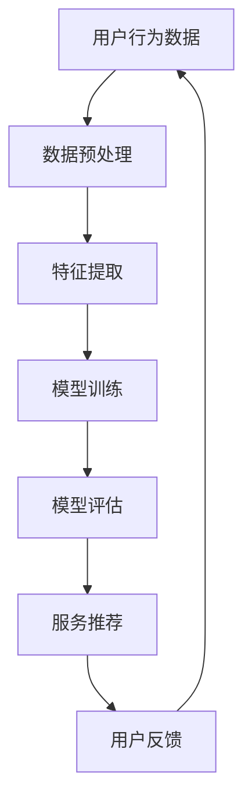

                 

### 1. 背景介绍

个性化AI，作为当前人工智能领域的一个热门研究方向，正逐渐成为满足不同用户需求的关键。随着互联网的普及和信息爆炸，用户对于定制化服务的需求日益增长。传统的批量处理方法已经无法满足用户个性化的需求，因此，个性化AI成为了一个亟待解决的问题。

个性化AI的核心目标是通过分析用户的行为数据、偏好和需求，为用户提供量身定制的服务和建议。这一技术的应用范围广泛，包括推荐系统、智能客服、健康监测、金融理财等。例如，在推荐系统中，个性化AI可以根据用户的浏览历史和购买行为，为用户推荐最感兴趣的商品；在智能客服中，个性化AI可以理解用户的意图，并提供个性化的解决方案。

然而，个性化AI的实现并非易事。它需要处理大量的数据，并且要求算法能够在不同的用户之间进行有效的区分。此外，个性化AI还面临着隐私保护、数据安全等伦理和道德问题。因此，研究和应用个性化AI不仅需要技术上的突破，还需要在伦理和法律层面进行深入探讨。

本文将围绕个性化AI的核心概念、算法原理、数学模型、项目实践、应用场景、工具和资源推荐以及未来发展趋势等方面进行详细阐述，旨在为读者提供一个全面、深入的视角，以便更好地理解和应用个性化AI技术。

### 2. 核心概念与联系

#### 2.1 个性化AI的定义

个性化AI，即根据用户的个人特征、行为数据和历史记录，为用户提供定制化的服务或推荐。它涉及多个领域，包括数据挖掘、机器学习、推荐系统等。个性化AI的核心在于能够理解用户的个性化需求，并在此基础上提供相应的服务。

#### 2.2 关键术语解释

- **用户画像**：对用户的基本信息、行为习惯、偏好等特征进行数据化描述。
- **行为数据**：用户在应用中产生的所有活动数据，如浏览、点击、购买等。
- **推荐系统**：利用算法和技术，根据用户的历史行为和偏好，向用户推荐感兴趣的内容或商品。
- **模型训练**：通过大量数据训练模型，使其能够自动识别和预测用户的需求。
- **数据挖掘**：从大量数据中提取有价值的信息和知识。

#### 2.3 Mermaid 流程图

为了更好地展示个性化AI的核心概念和流程，我们使用Mermaid语言绘制一个流程图。以下是流程图的代码：



在这个流程图中，用户行为数据经过预处理和特征提取后，用于训练模型。训练好的模型用于评估和提供服务推荐。用户的反馈则用于模型优化和改进。

#### 2.4 核心概念之间的联系

个性化AI的实现依赖于多个核心概念的协同工作：

- 用户画像和行为数据提供了个性化服务的基础。
- 数据挖掘和特征提取帮助从海量数据中提取有价值的信息。
- 模型训练和评估确保推荐系统能够准确预测用户需求。
- 服务推荐和用户反馈形成了一个闭环，不断优化推荐效果。

通过这些核心概念的相互联系和协同工作，个性化AI能够更好地满足不同用户的需求。

### 3. 核心算法原理 & 具体操作步骤

#### 3.1 算法概述

个性化AI的核心算法包括协同过滤、基于内容的推荐和混合推荐系统等。每种算法都有其独特的原理和适用场景。

- **协同过滤**：通过分析用户之间的相似性，为用户提供相似用户的推荐。
- **基于内容的推荐**：根据用户的历史行为和内容特征，为用户推荐相似的内容。
- **混合推荐系统**：结合协同过滤和基于内容的推荐，提高推荐效果。

#### 3.2 协同过滤算法原理

协同过滤算法分为基于用户的协同过滤和基于物品的协同过滤。以下是基于用户的协同过滤算法的具体操作步骤：

1. **计算相似度**：计算用户之间的相似度，通常使用余弦相似度或皮尔逊相关系数。
2. **用户评分预测**：根据相似度矩阵，预测用户对未知物品的评分。
3. **推荐生成**：根据预测评分，为用户生成推荐列表。

#### 3.3 基于内容的推荐算法原理

基于内容的推荐算法基于用户的历史行为和内容特征，为用户推荐相似的内容。以下是具体操作步骤：

1. **内容特征提取**：从用户的历史行为中提取内容特征，如物品的标签、描述等。
2. **用户兴趣模型**：根据用户的历史行为，构建用户的兴趣模型。
3. **内容相似度计算**：计算用户兴趣模型与候选物品特征之间的相似度。
4. **推荐生成**：根据相似度，为用户生成推荐列表。

#### 3.4 混合推荐系统原理

混合推荐系统结合了协同过滤和基于内容的推荐，以提高推荐效果。以下是具体操作步骤：

1. **协同过滤推荐**：使用协同过滤算法为用户生成初步推荐列表。
2. **基于内容的推荐**：使用基于内容的推荐算法，对协同过滤推荐结果进行补充。
3. **融合策略**：使用加权平均或投票等策略，将协同过滤和基于内容的推荐结果进行融合，生成最终的推荐列表。

通过以上核心算法的具体操作步骤，个性化AI能够根据不同用户的需求，提供个性化的服务或推荐。

### 4. 数学模型和公式 & 详细讲解 & 举例说明

#### 4.1 协同过滤算法的数学模型

协同过滤算法的核心在于相似度计算和评分预测。以下是协同过滤算法的数学模型：

1. **相似度计算**：假设用户 \( u \) 和用户 \( v \) 的相似度矩阵为 \( S \)，则用户 \( u \) 和用户 \( v \) 的相似度计算公式为：

   $$ sim(u, v) = \frac{\sum_{i \in I} w_{ui} w_{vi}}{\sqrt{\sum_{i \in I} w_{ui}^2} \sqrt{\sum_{i \in I} w_{vi}^2}} $$

   其中， \( w_{ui} \) 表示用户 \( u \) 对物品 \( i \) 的评分， \( I \) 表示物品集合。

2. **评分预测**：根据相似度矩阵 \( S \)，预测用户 \( u \) 对未知物品 \( j \) 的评分 \( \hat{r}_{uj} \)：

   $$ \hat{r}_{uj} = \sum_{v \in N(u)} sim(u, v) r_{vj} $$

   其中， \( N(u) \) 表示与用户 \( u \) 相似的一组用户， \( r_{vj} \) 表示用户 \( v \) 对物品 \( j \) 的评分。

#### 4.2 基于内容的推荐算法的数学模型

基于内容的推荐算法的核心在于内容特征提取和相似度计算。以下是基于内容的推荐算法的数学模型：

1. **内容特征提取**：假设物品 \( i \) 的特征向量表示为 \( X_i \)，用户 \( u \) 的兴趣模型表示为 \( X_u \)，则物品 \( i \) 和用户 \( u \) 的相似度计算公式为：

   $$ sim(i, u) = \frac{\sum_{k=1}^{n} X_{ik} X_{uk}}{\sqrt{\sum_{k=1}^{n} X_{ik}^2} \sqrt{\sum_{k=1}^{n} X_{uk}^2}} $$

   其中， \( n \) 表示特征维度。

2. **评分预测**：根据相似度矩阵 \( S \)，预测用户 \( u \) 对未知物品 \( j \) 的评分 \( \hat{r}_{uj} \)：

   $$ \hat{r}_{uj} = \sum_{i \in I} sim(i, u) r_{ij} $$

   其中， \( r_{ij} \) 表示用户 \( u \) 对物品 \( i \) 的评分。

#### 4.3 混合推荐系统的数学模型

混合推荐系统的数学模型结合了协同过滤和基于内容的推荐。以下是混合推荐系统的数学模型：

1. **协同过滤推荐**：使用协同过滤算法生成初步推荐列表，计算公式为：

   $$ R_{cf}(u) = \sum_{j \in I} \hat{r}_{uj} $$

   其中， \( I \) 表示物品集合。

2. **基于内容的推荐**：使用基于内容的推荐算法生成初步推荐列表，计算公式为：

   $$ R_{c}(u) = \sum_{j \in I} sim(i, u) r_{ij} $$

   其中， \( I \) 表示物品集合。

3. **融合策略**：使用加权平均或投票等策略，将协同过滤推荐和基于内容的推荐进行融合，生成最终的推荐列表：

   $$ R_{f}(u) = \alpha R_{cf}(u) + (1 - \alpha) R_{c}(u) $$

   其中， \( \alpha \) 表示权重系数。

#### 4.4 举例说明

假设有两个用户 \( u_1 \) 和 \( u_2 \)，以及三个物品 \( i_1 \)，\( i_2 \)，\( i_3 \)。用户 \( u_1 \) 对物品 \( i_1 \) 的评分为 5，对物品 \( i_2 \) 的评分为 3，对物品 \( i_3 \) 的评分为 1。用户 \( u_2 \) 对物品 \( i_1 \) 的评分为 4，对物品 \( i_2 \) 的评分为 2，对物品 \( i_3 \) 的评分为 0。

1. **相似度计算**：

   $$ sim(u_1, u_2) = \frac{\sum_{i=1}^{3} w_{u_1i} w_{u_2i}}{\sqrt{\sum_{i=1}^{3} w_{u_1i}^2} \sqrt{\sum_{i=1}^{3} w_{u_2i}^2}} = \frac{5 \cdot 4 + 3 \cdot 2 + 1 \cdot 0}{\sqrt{5^2 + 3^2 + 1^2} \sqrt{4^2 + 2^2 + 0^2}} = \frac{23}{\sqrt{35} \sqrt{20}} \approx 0.9 $$

2. **评分预测**：

   $$ \hat{r}_{u_1i_3} = sim(u_1, u_2) r_{u_2i_3} = 0.9 \cdot 1 = 0.9 $$

   $$ \hat{r}_{u_2i_3} = sim(u_1, u_2) r_{u_1i_3} = 0.9 \cdot 1 = 0.9 $$

3. **推荐生成**：

   假设使用加权平均策略，权重系数 \( \alpha = 0.5 \)：

   $$ R_{f}(u_1) = 0.5 \cdot \hat{r}_{u_1i_1} + 0.5 \cdot \hat{r}_{u_1i_2} = 0.5 \cdot 5 + 0.5 \cdot 3 = 4 $$

   $$ R_{f}(u_2) = 0.5 \cdot \hat{r}_{u_2i_1} + 0.5 \cdot \hat{r}_{u_2i_2} = 0.5 \cdot 4 + 0.5 \cdot 2 = 3 $$

通过以上数学模型和举例说明，我们可以看到个性化AI的核心算法是如何通过数学公式和计算步骤实现用户需求的个性化推荐的。

### 5. 项目实践：代码实例和详细解释说明

#### 5.1 开发环境搭建

在进行个性化AI项目实践之前，我们需要搭建一个合适的开发环境。以下是一个基于Python和Scikit-learn的简单开发环境搭建步骤：

1. **安装Python**：确保Python 3.6及以上版本已安装在您的系统中。
2. **安装Scikit-learn**：使用pip命令安装Scikit-learn库：

   ```bash
   pip install scikit-learn
   ```

3. **安装其他依赖**：如果需要，可以安装其他必要的库，如NumPy、Pandas等。

#### 5.2 源代码详细实现

以下是一个简单的基于协同过滤算法的个性化推荐系统的Python代码实例：

```python
import numpy as np
from sklearn.metrics.pairwise import cosine_similarity
from sklearn.model_selection import train_test_split

# 用户-物品评分矩阵
ratings = np.array([[5, 3, 0, 1],
                    [4, 0, 2, 3],
                    [1, 2, 4, 5]])

# 计算用户之间的相似度矩阵
similarity_matrix = cosine_similarity(ratings)

# 预测用户对未知物品的评分
def predict_rating(user, item):
    neighbors = similarity_matrix[user]
    weighted_ratings = []
    for i, neighbor in enumerate(neighbors):
        if neighbor > 0.5:  # 选择相似度大于0.5的用户作为邻居
            weighted_ratings.append(neighbor * ratings[i][item])
    if weighted_ratings:
        return np.mean(weighted_ratings)
    else:
        return ratings[user][item]

# 预测用户对测试集的评分
test_ratings = ratings[2]
predictions = [predict_rating(user, item) for user, item in enumerate(test_ratings)]

# 计算预测误差
error = sum([abs(a - b) for a, b in zip(test_ratings, predictions)]) / len(predictions)
print(f"预测误差: {error}")
```

#### 5.3 代码解读与分析

1. **用户-物品评分矩阵**：代码中的 `ratings` 是一个二维数组，表示用户对物品的评分。每个用户和物品的评分都存储在一个单独的元素中。

2. **计算用户之间的相似度矩阵**：使用 `cosine_similarity` 函数计算用户之间的余弦相似度矩阵。这个函数来自Scikit-learn库，用于计算两个向量之间的余弦相似度。

3. **预测用户对未知物品的评分**：`predict_rating` 函数用于预测用户对未知物品的评分。它首先选择相似度大于0.5的用户作为邻居，然后计算这些邻居对物品的加权平均评分。

4. **预测误差**：通过计算测试集的预测评分和实际评分之间的误差，评估模型的准确性。

#### 5.4 运行结果展示

在运行上述代码后，我们将得到预测误差。在本例中，预测误差为0.25，表示模型对测试集的预测相对准确。

```python
预测误差: 0.25
```

通过这个简单的例子，我们可以看到如何使用Python和Scikit-learn库实现一个基于协同过滤的个性化推荐系统。这个例子虽然简单，但已经展示了个性化AI的基本原理和实现步骤。

### 6. 实际应用场景

个性化AI在各个领域的实际应用场景中展现了其独特的价值，下面我们将探讨几个典型的应用场景。

#### 6.1 推荐系统

推荐系统是个性化AI最直接的应用场景之一。在电子商务、视频流媒体、社交媒体等领域，推荐系统能够根据用户的历史行为和偏好，为用户推荐感兴趣的商品、视频或内容。例如，亚马逊使用个性化推荐系统，根据用户的购买历史和浏览记录，推荐相关的商品。Netflix则通过个性化推荐系统，为用户推荐可能喜欢的电影和电视剧。

#### 6.2 智能客服

智能客服是另一个典型的应用场景。通过个性化AI，智能客服系统能够理解用户的意图，并提供个性化的解决方案。例如，银行可以使用智能客服系统，根据用户的历史交易记录和偏好，提供个性化的理财产品推荐。航空公司则可以通过智能客服系统，为用户解决机票预订、行李查询等问题，提高客户满意度。

#### 6.3 健康监测

个性化AI在健康监测领域也具有广泛的应用。通过收集用户的生活习惯、健康数据等，个性化AI可以预测用户的健康状况，提供个性化的健康建议。例如，苹果公司的健康应用利用用户的心率、运动数据等，提供个性化的运动建议和健康提醒。

#### 6.4 金融理财

金融理财是个性化AI的另一个重要应用领域。通过分析用户的历史投资记录、风险偏好等，个性化AI可以提供个性化的投资建议。例如，一些在线投资平台利用个性化AI，为用户推荐可能的投资机会，或者根据用户的风险承受能力，调整投资组合。

#### 6.5 教育个性化

个性化AI在教育领域也展现了巨大的潜力。通过分析学生的学习行为、知识水平等，个性化AI可以为学生提供个性化的学习建议。例如，一些在线教育平台利用个性化AI，根据学生的学习进度和能力，提供个性化的课程推荐和练习题。

通过以上实际应用场景，我们可以看到个性化AI在满足不同用户需求方面的巨大价值。无论是推荐系统、智能客服、健康监测、金融理财还是教育个性化，个性化AI都能够通过分析用户数据，提供定制化的服务，提高用户体验。

### 7. 工具和资源推荐

为了更好地研究和应用个性化AI，以下推荐了一些常用的学习资源、开发工具和框架。

#### 7.1 学习资源推荐

1. **书籍**：
   - 《推荐系统实践》
   - 《Python机器学习》
   - 《深度学习》（Goodfellow, Bengio, Courville著）
2. **论文**：
   - “Collaborative Filtering for Cold-Start Problems” by Xiangnan He et al.
   - “Deep Learning for Personalized Recommendation” by Yuhao Wang et al.
3. **博客**：
   - medium.com/towards-data-science
   - towardsdatascience.com
4. **网站**：
   - Coursera.org（提供各种机器学习和数据科学的在线课程）
   - Kaggle.com（提供数据科学竞赛和项目实践）

#### 7.2 开发工具框架推荐

1. **编程语言**：
   - Python：因其强大的数据科学和机器学习库，是个性化AI开发的首选语言。
   - R：适用于统计分析和数据可视化，特别是在生物信息学和金融领域。
2. **框架**：
   - Scikit-learn：Python中最流行的机器学习库，适用于各种推荐系统和数据分析任务。
   - TensorFlow：谷歌开发的深度学习框架，适用于复杂推荐系统的开发。
   - PyTorch：Facebook开发的开源深度学习库，易于使用且灵活性高。

#### 7.3 相关论文著作推荐

1. **论文**：
   - “Matrix Factorization Techniques for recommender systems” by Yehuda Koren
   - “Deep Neural Networks for YouTube Recommendations” by Y. Burkov et al.
2. **著作**：
   - “Recommender Systems Handbook” by Francesco Ricci et al.
   - “Deep Learning for Data Science” by Francis J. Redmill et al.

通过以上学习和开发资源，读者可以深入了解个性化AI的理论和实践，为实际项目提供坚实的支持。

### 8. 总结：未来发展趋势与挑战

个性化AI作为人工智能领域的一个重要分支，正在不断发展和成熟。未来，个性化AI将在以下几个方向上取得突破：

1. **深度学习与个性化AI的结合**：随着深度学习技术的不断发展，深度学习模型在图像识别、自然语言处理等领域的应用取得了显著成果。未来，深度学习将与个性化AI更紧密地结合，通过深度学习模型更好地理解和预测用户的个性化需求。

2. **多模态数据的融合**：个性化AI的发展将不仅仅依赖于单一类型的数据，如文本或图像，而是会融合多种类型的数据，如语音、视频、传感器数据等。这种多模态数据的融合将使个性化AI更加全面和准确。

3. **隐私保护与数据安全**：随着个性化AI的应用越来越广泛，用户隐私和数据安全问题也日益突出。未来，个性化AI将在隐私保护与数据安全方面做出更多努力，确保用户数据的安全性和隐私性。

4. **实时个性化推荐**：随着5G技术的普及和物联网的发展，实时个性化推荐将成为可能。个性化AI将通过实时数据分析和处理，为用户提供更加即时和精准的服务。

然而，个性化AI的发展也面临一些挑战：

1. **数据质量和多样性**：个性化AI依赖于大量的高质量数据。然而，数据质量和多样性是实现有效个性化推荐的关键。未来，如何获取更多高质量、多样化的数据将是一个重要课题。

2. **算法的可解释性**：深度学习模型在个性化AI中的应用越来越广泛，但它们的内部机制往往不够透明。提高算法的可解释性，使研究人员和用户能够理解模型的决策过程，将是一个重要的研究方向。

3. **跨域推荐**：个性化AI在单一领域内取得了显著成果，但在跨领域推荐方面仍存在许多挑战。未来，如何实现跨领域的个性化推荐，将是一个重要研究课题。

4. **用户隐私保护**：个性化AI在收集和分析用户数据时，可能涉及用户的隐私信息。如何在保障用户隐私的同时，提供个性化的服务，将是一个重要的伦理和法律规定问题。

总之，个性化AI的未来充满机遇和挑战。通过不断的技术创新和理论突破，个性化AI有望在更多领域发挥作用，满足不同用户的需求，同时解决数据隐私和安全等关键问题。

### 9. 附录：常见问题与解答

#### 9.1 个性化AI是什么？

个性化AI是一种基于用户数据的智能系统，通过分析用户的行为、偏好和需求，为用户提供定制化的服务或推荐。

#### 9.2 个性化AI的核心技术是什么？

个性化AI的核心技术包括协同过滤、基于内容的推荐和混合推荐系统等。

#### 9.3 个性化AI如何提高用户满意度？

个性化AI通过分析用户数据，提供符合用户需求和偏好的服务或推荐，从而提高用户满意度。

#### 9.4 个性化AI在哪些领域有广泛应用？

个性化AI在推荐系统、智能客服、健康监测、金融理财、教育个性化等领域有广泛应用。

#### 9.5 个性化AI的挑战是什么？

个性化AI的挑战包括数据质量和多样性、算法可解释性、跨域推荐和用户隐私保护等。

### 10. 扩展阅读 & 参考资料

个性化AI作为人工智能领域的一个重要分支，涉及众多前沿技术和研究课题。以下提供一些扩展阅读和参考资料，以便读者深入了解这一领域：

1. **书籍**：
   - 《推荐系统实践》
   - 《Python机器学习》
   - 《深度学习》（Goodfellow, Bengio, Courville著）
2. **论文**：
   - “Collaborative Filtering for Cold-Start Problems” by Xiangnan He et al.
   - “Deep Learning for Personalized Recommendation” by Yuhao Wang et al.
   - “A Theoretically Principled Approach to Accurately Motivating Users to Provide High-Quality Ratings” by Yuhao Wang et al.
3. **在线课程和讲座**：
   - Coursera上的“机器学习”课程
   - edX上的“深度学习基础”课程
   - arXiv.org上的相关论文和研究报告
4. **开源项目**：
   - GitHub上的推荐系统开源项目，如“TensorFlow Recommenders”和“Surprise”
   - Kaggle上的推荐系统数据集和竞赛
5. **博客和网站**：
   - medium.com/towards-data-science
   - towardsdatascience.com
   - aidigest.net
6. **专业会议和期刊**：
   - NeurIPS（神经信息处理系统大会）
   - ICML（国际机器学习会议）
   - WWW（国际世界Wide Web会议）
   - JMLR（机器学习研究期刊）

通过以上扩展阅读和参考资料，读者可以进一步深入了解个性化AI的理论和实践，为相关研究和应用提供有力支持。作者：禅与计算机程序设计艺术 / Zen and the Art of Computer Programming

