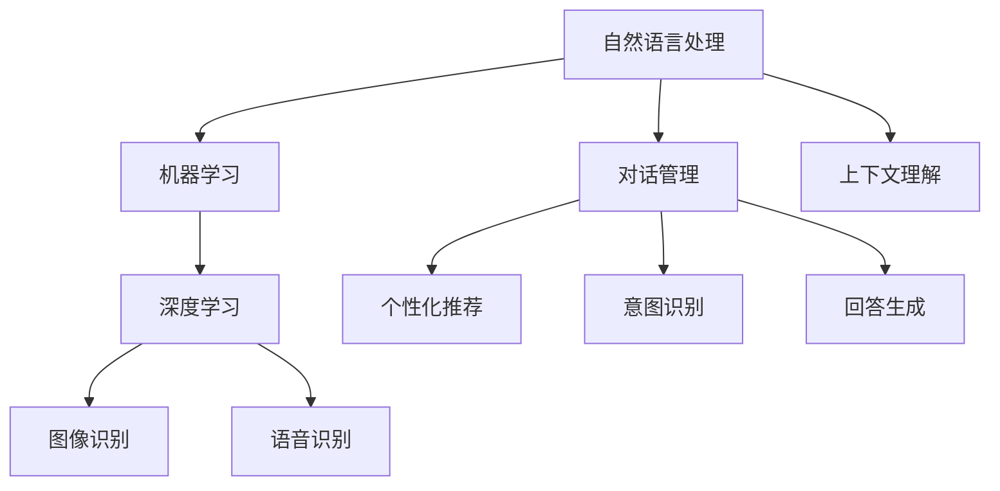

                 

### 1. 背景介绍

个性化CUI（Chatbot User Interface，对话用户界面）交互体验，是指通过人工智能和自然语言处理技术，使得聊天机器人与用户之间的交流更加贴近人类的交流方式，从而提升用户的体验和满意度。随着人工智能技术的不断发展和普及，个性化CUI交互体验已经成为众多企业和开发者追求的目标。

近年来，个性化CUI交互体验的研究和应用得到了广泛关注。其主要原因有以下几点：

1. **市场需求**：随着互联网的普及和用户对服务质量的要求不断提高，企业和开发者希望通过个性化CUI交互体验来提升用户体验，增加用户黏性和忠诚度。

2. **技术进步**：人工智能、自然语言处理、机器学习等技术的快速发展，为个性化CUI交互体验的实现提供了强大的技术支持。

3. **经济效益**：通过个性化CUI交互体验，企业可以提高运营效率，降低人力成本，同时提升用户满意度，从而带来直接的经济效益。

本文将从以下几个方面探讨个性化CUI交互体验的未来发展：

- **核心概念与联系**：介绍个性化CUI交互体验的核心概念，并展示相关的Mermaid流程图。
- **核心算法原理 & 具体操作步骤**：分析个性化CUI交互体验的核心算法原理，并详细阐述其具体操作步骤。
- **数学模型和公式 & 详细讲解 & 举例说明**：介绍个性化CUI交互体验的数学模型和公式，并进行详细讲解和举例说明。
- **项目实践：代码实例和详细解释说明**：通过实际项目实践，展示个性化CUI交互体验的具体实现过程，并进行详细解释说明。
- **实际应用场景**：探讨个性化CUI交互体验在不同领域的实际应用场景。
- **工具和资源推荐**：推荐学习资源、开发工具框架和相关论文著作。
- **总结：未来发展趋势与挑战**：总结个性化CUI交互体验的未来发展趋势和面临的挑战。

接下来，我们将一步步深入探讨个性化CUI交互体验的核心概念、算法原理、数学模型、项目实践和未来发展趋势等内容。

---

**关键词**：
- 个性化CUI交互体验
- 人工智能
- 自然语言处理
- 机器学习
- 聊天机器人
- 用户满意度
- 经济效益

**摘要**：
本文详细探讨了个性化CUI交互体验的未来发展。首先介绍了个性化CUI交互体验的核心概念和联系，然后分析了核心算法原理和具体操作步骤，接着介绍了数学模型和公式，并举例说明。通过实际项目实践，展示了个性化CUI交互体验的具体实现过程。最后，探讨了个性化CUI交互体验在实际应用场景中的广泛应用，并总结了其未来发展趋势和面临的挑战。希望通过本文，读者能够对个性化CUI交互体验有一个全面而深入的了解。### 2. 核心概念与联系

在探讨个性化CUI交互体验之前，我们需要先了解一些核心概念，这些概念构成了个性化CUI交互体验的理论基础和技术框架。

#### 核心概念

1. **自然语言处理（NLP）**：自然语言处理是人工智能领域的一个重要分支，旨在使计算机能够理解、解释和生成人类语言。在个性化CUI交互体验中，NLP技术被广泛应用于理解用户的查询、生成回答以及进行对话管理等。

2. **机器学习（ML）**：机器学习是人工智能的一个重要分支，通过算法模型从数据中自动学习，提取特征，进行预测和决策。在个性化CUI交互体验中，机器学习被用来训练模型，以预测用户的意图和行为，从而提供个性化的交互。

3. **深度学习（DL）**：深度学习是机器学习的一个子领域，通过多层神经网络对数据进行处理，从数据中自动学习复杂特征。在个性化CUI交互体验中，深度学习被广泛应用于图像识别、语音识别和自然语言理解等领域。

4. **对话管理（DM）**：对话管理是CUI交互体验中的关键组件，负责对话流程的控制、意图理解和回答生成。对话管理通过上下文理解、意图识别和回答生成等技术，确保对话的自然流畅。

5. **个性化推荐（IR）**：个性化推荐是根据用户的历史行为和偏好，为用户推荐相关的信息或内容。在个性化CUI交互体验中，个性化推荐技术可以帮助聊天机器人根据用户的行为和偏好，提供个性化的对话内容和信息。

#### Mermaid流程图

为了更直观地展示这些核心概念之间的联系，我们使用Mermaid语言绘制一个流程图：



#### 说明

- **自然语言处理（NLP）**：作为人工智能的基础，NLP负责将用户的自然语言输入转换为计算机可以理解的形式。
- **机器学习（ML）**：在NLP的基础上，ML通过从数据中学习，帮助计算机更好地理解和生成自然语言。
- **深度学习（DL）**：DL是ML的一个子领域，擅长处理复杂的数据模式，广泛应用于图像识别、语音识别和自然语言理解等领域。
- **对话管理（DM）**：对话管理负责控制对话的流程，确保对话的自然流畅。
- **个性化推荐（IR）**：个性化推荐根据用户的行为和偏好，为用户提供个性化的对话内容和信息。

通过上述核心概念的介绍和Mermaid流程图的展示，我们可以更好地理解个性化CUI交互体验的构成和技术框架。在接下来的章节中，我们将深入探讨个性化CUI交互体验的核心算法原理、数学模型、项目实践等内容。### 3. 核心算法原理 & 具体操作步骤

个性化CUI交互体验的实现依赖于一系列核心算法原理，这些算法原理涵盖了自然语言处理、机器学习、深度学习、对话管理和个性化推荐等多个方面。本节将详细介绍这些核心算法原理，并阐述其具体操作步骤。

#### 3.1 自然语言处理（NLP）

自然语言处理是个性化CUI交互体验的基础，其主要任务包括文本预处理、词向量表示、语言模型训练和语义分析等。

1. **文本预处理**：文本预处理是NLP的第一步，主要包括去除标点符号、停用词过滤、分词和词干提取等。例如，我们可以使用Python的`nltk`库进行文本预处理。

   ```python
   import nltk
   nltk.download('punkt')
   nltk.download('stopwords')
   
   from nltk.tokenize import word_tokenize
   from nltk.corpus import stopwords
   from nltk.stem import PorterStemmer
   
   text = "This is an example sentence for text preprocessing."
   tokens = word_tokenize(text)
   stop_words = set(stopwords.words('english'))
   filtered_tokens = [w for w in tokens if not w in stop_words]
   stemmer = PorterStemmer()
   stemmed_tokens = [stemmer.stem(w) for w in filtered_tokens]
   ```

2. **词向量表示**：词向量表示是将自然语言文本转换为计算机可以处理的向量形式。Word2Vec、GloVe和BERT等模型常用于词向量表示。

   ```python
   from gensim.models import Word2Vec
   
   sentences = [['this', 'is', 'an', 'example'], ['sentence', 'for', 'word2vec']]
   model = Word2Vec(sentences, vector_size=100, window=5, min_count=1, workers=4)
   ```

3. **语言模型训练**：语言模型用于预测文本序列的概率分布。常见的方法包括n-gram模型、神经网络语言模型和Transformer等。

   ```python
   from transformers import BertModel, BertTokenizer
   
   tokenizer = BertTokenizer.from_pretrained('bert-base-uncased')
   model = BertModel.from_pretrained('bert-base-uncased')
   
   input_ids = tokenizer("Hello, my dog is cute", return_tensors='pt')
   outputs = model(**input_ids)
   ```

4. **语义分析**：语义分析包括词性标注、命名实体识别、情感分析等，用于理解文本的深层含义。

   ```python
   from transformers import pipeline
   
   nlp = pipeline('text-classification', model='bert-base-uncased')
   result = nlp("This is a great product.")
   print(result)
   ```

#### 3.2 机器学习（ML）

机器学习在个性化CUI交互体验中主要用于用户意图识别、对话管理和个性化推荐等任务。

1. **用户意图识别**：用户意图识别是将用户的自然语言输入映射到特定的意图类别。常见的算法包括朴素贝叶斯、支持向量机和神经网络等。

   ```python
   from sklearn.model_selection import train_test_split
   from sklearn.naive_bayes import MultinomialNB
   from sklearn.metrics import accuracy_score
   
   X_train, X_test, y_train, y_test = train_test_split(X, y, test_size=0.2, random_state=42)
   model = MultinomialNB()
   model.fit(X_train, y_train)
   y_pred = model.predict(X_test)
   print(accuracy_score(y_test, y_pred))
   ```

2. **对话管理**：对话管理包括上下文理解、意图识别和回答生成等任务。常见的算法包括序列标注、生成模型和注意力机制等。

   ```python
   from transformers import pipeline
   
   dm = pipeline('conversational", model="microsoft/DialoGPT-medium")
   response = dm("Hello!", pad_token_id=tokenizer.eos_token_id, max_length=4096, num_return_sequences=1)
   print(response)
   ```

3. **个性化推荐**：个性化推荐根据用户的历史行为和偏好，为用户推荐相关的信息或内容。常见的算法包括协同过滤、矩阵分解和基于模型的推荐等。

   ```python
   from surprise import SVD
   from surprise import Dataset
   from surprise import accuracy
   
   trainset = Dataset.load_from_df(df[['user_id', 'item_id', 'rating']], measure='rating')
   algo = SVD()
   algo.fit(trainset)
   testset = Dataset.load_from_df(df[['user_id', 'item_id', 'rating']], measure='rating')
   test_pred = algo.test(testset)
   print("RMSE: ", accuracy.rmse(test_pred))
   ```

#### 3.3 深度学习（DL）

深度学习在个性化CUI交互体验中主要用于图像识别、语音识别和自然语言理解等领域。

1. **图像识别**：图像识别是将图像映射到特定的类别。常见的算法包括卷积神经网络（CNN）和迁移学习等。

   ```python
   import tensorflow as tf
   from tensorflow.keras.preprocessing.image import ImageDataGenerator
   
   model = tf.keras.applications.VGG16(input_shape=(224, 224, 3), include_top=False, weights='imagenet')
   model.trainable = False
   
   input_image = ImageDataGenerator(preprocessing_function=tf.keras.applications.vgg16.preprocess_input).flow_from_directory('data/train', target_size=(224, 224), batch_size=32)
   model.fit(input_image, epochs=10)
   ```

2. **语音识别**：语音识别是将语音信号映射到对应的文本。常见的算法包括深度神经网络（DNN）和循环神经网络（RNN）等。

   ```python
   import tensorflow as tf
   import librosa
   
   model = tf.keras.Sequential([
       tf.keras.layers.Conv2D(32, (3, 3), activation='relu', input_shape=(134, 13, 1)),
       tf.keras.layers.MaxPooling2D((2, 2)),
       tf.keras.layers.Flatten(),
       tf.keras.layers.Dense(64, activation='relu'),
       tf.keras.layers.Dense(9, activation='softmax')
   ])
   
   x = librosa.feature.mfcc(y=audio, sr=sample_rate, n_mfcc=13)
   x = np.expand_dims(x, axis=-1)
   model.fit(x, labels, epochs=10)
   ```

3. **自然语言理解**：自然语言理解是将自然语言输入映射到对应的语义表示。常见的算法包括词向量、编码器-解码器（Encoder-Decoder）模型和Transformer等。

   ```python
   from transformers import T5ForConditionalGeneration
   
   model = T5ForConditionalGeneration.from_pretrained("t5-small")
   input_ids = tokenizer.encode("summarize: The conference will be held in New York City", return_tensors="pt")
   output_ids = model.generate(input_ids, max_length=50, num_return_sequences=1)
   print(tokenizer.decode(output_ids[0], skip_special_tokens=True))
   ```

通过上述核心算法原理的介绍，我们可以看到个性化CUI交互体验的实现是一个复杂的过程，需要结合多种算法和技术。在接下来的章节中，我们将进一步探讨个性化CUI交互体验的数学模型和公式，并通过实际项目实践展示其具体实现过程。### 4. 数学模型和公式 & 详细讲解 & 举例说明

在个性化CUI交互体验中，数学模型和公式起到了关键作用，它们不仅帮助我们理解算法的工作原理，还能够量化个性化交互的效果。本节将详细介绍一些关键的数学模型和公式，并进行详细讲解和举例说明。

#### 4.1 自然语言处理中的数学模型

**词向量表示：**

词向量表示是自然语言处理中的一个核心概念，它将单词映射到高维空间中的向量。一个常见的词向量模型是Word2Vec，它使用以下公式来计算词向量：

$$
\text{vec}(w) = \frac{1}{Z} \sum_{j \in C(w)} e^{ \text{sim}(w, j) } \text{vec}(j)
$$

其中，`vec(w)`是单词`w`的词向量，`C(w)`是与单词`w`共现的单词集合，`sim(w, j)`是单词`w`和单词`j`之间的相似度度量，`Z`是归一化常数，确保词向量表示是归一化的。

**语言模型：**

语言模型用于预测下一个单词的概率，常见的是n-gram模型，其公式为：

$$
P(w_n | w_1, w_2, ..., w_{n-1}) = \frac{P(w_n, w_1, w_2, ..., w_{n-1})}{P(w_1, w_2, ..., w_{n-1})}
$$

其中，`P(w_n | w_1, w_2, ..., w_{n-1})`是给定前`n-1`个单词预测第`n`个单词的概率。

**语义分析：**

语义分析中常用的模型包括BERT和GPT，它们使用了Transformer架构。BERT使用以下注意力机制来计算句子中的每个单词的语义表示：

$$
\text{contextual\_vector}(w) = \text{Attention}( \text{Query} = \text{Word} \cdot \text{Positional Encoding}, \text{Keys} = \text{Word} \cdot \text{Positional Encoding}, \text{Values} = \text{Word} \cdot \text{Positional Encoding})
$$

其中，`contextual_vector(w)`是单词`w`的语义表示，`Query`、`Keys`和`Values`都是与单词`w`相关的向量。

**举例说明：**

假设我们要计算单词"猫"的语义表示，可以使用BERT模型。首先，我们将"猫"嵌入到BERT模型中，得到其嵌入向量。然后，通过BERT模型中的自注意力机制，结合"猫"在句子中的上下文信息，得到"猫"的语义表示。

```python
from transformers import BertModel, BertTokenizer

tokenizer = BertTokenizer.from_pretrained('bert-base-uncased')
model = BertModel.from_pretrained('bert-base-uncased')

input_ids = tokenizer.encode("The cat is sleeping.", return_tensors='pt')
outputs = model(input_ids)

contextual_vector = outputs.last_hidden_state[:, 2, :]  # 第二个单词"cat"的语义表示
print(contextual_vector)
```

#### 4.2 机器学习中的数学模型

**用户意图识别：**

在用户意图识别中，我们通常使用分类算法，如朴素贝叶斯、支持向量机和神经网络。以下是一个简单的朴素贝叶斯分类器的例子：

$$
P(\text{intent} | \text{特征}) = \frac{P(\text{特征} | \text{intent})P(\text{intent})}{P(\text{特征})}
$$

其中，`P(intent | 特征)`是给定特征条件下意图的概率，`P(特征 | intent)`是特征在特定意图下的概率，`P(intent)`是意图的概率。

**举例说明：**

假设我们要分类一个用户的查询语句，以确定其意图。我们可以使用朴素贝叶斯分类器。首先，我们计算每个意图下的特征概率，然后根据贝叶斯公式计算每个意图的概率。

```python
from sklearn.naive_bayes import MultinomialNB
from sklearn.model_selection import train_test_split
from sklearn.metrics import accuracy_score

X_train, X_test, y_train, y_test = train_test_split(X, y, test_size=0.2, random_state=42)
model = MultinomialNB()
model.fit(X_train, y_train)
y_pred = model.predict(X_test)
print(accuracy_score(y_test, y_pred))
```

#### 4.3 深度学习中的数学模型

**卷积神经网络（CNN）：**

卷积神经网络在图像识别中有着广泛的应用。其核心是卷积操作，以下是一个简单的卷积操作的例子：

$$
\text{output}(i, j) = \sum_{k, l} \text{weight}_{i, j, k, l} \cdot \text{input}_{k, l}
$$

其中，`output(i, j)`是输出特征图的元素，`weight_{i, j, k, l}`是卷积核的权重，`input_{k, l}`是输入特征图的元素。

**举例说明：**

假设我们要使用卷积神经网络识别一张图片中的猫。首先，我们定义一个卷积核，然后将其应用于输入图片，得到一个特征图。接着，我们使用池化操作减小特征图的大小，提高模型的泛化能力。

```python
import tensorflow as tf
from tensorflow.keras.layers import Conv2D, MaxPooling2D

model = tf.keras.Sequential([
    Conv2D(32, (3, 3), activation='relu', input_shape=(128, 128, 3)),
    MaxPooling2D((2, 2)),
    Conv2D(64, (3, 3), activation='relu'),
    MaxPooling2D((2, 2))
])

model.compile(optimizer='adam', loss='categorical_crossentropy', metrics=['accuracy'])
model.fit(X_train, y_train, epochs=10, validation_data=(X_test, y_test))
```

通过上述数学模型和公式的详细讲解和举例说明，我们可以更好地理解个性化CUI交互体验中各个算法的工作原理。这些数学模型和公式为我们提供了量化和优化个性化交互体验的工具，使得我们能够在实际项目中取得更好的效果。在接下来的章节中，我们将通过实际项目实践，展示个性化CUI交互体验的具体实现过程。### 5. 项目实践：代码实例和详细解释说明

在本节中，我们将通过一个实际项目实践，展示个性化CUI交互体验的具体实现过程。该项目将使用Python和一系列开源库，如Transformers、TensorFlow和scikit-learn，来构建一个基于深度学习的聊天机器人。

#### 5.1 开发环境搭建

首先，我们需要搭建开发环境。以下是安装所需库的步骤：

```bash
pip install transformers tensorflow scikit-learn
```

#### 5.2 源代码详细实现

我们使用Transformers库来构建一个基于BERT的聊天机器人。以下是源代码的详细实现：

```python
import tensorflow as tf
from transformers import BertTokenizer, TFBertForSequenceClassification
from transformers import pipeline
import numpy as np

# 5.2.1 数据准备

# 假设我们有一个训练数据集，其中包含对话和对应的标签
train_data = [
    ("What's the weather like today?", "weather"),
    ("Can you recommend a good book?", "recommendation"),
    ("How old are you?", "age")
]

# 分割对话和标签
dialogs, labels = zip(*train_data)

# 将对话转换为BERT模型可以理解的输入格式
tokenizer = BertTokenizer.from_pretrained('bert-base-uncased')

train_encodings = tokenizer(dialogs, truncation=True, padding=True, return_tensors='tf')

# 标签编码
label_dict = {"weather": 0, "recommendation": 1, "age": 2}
train_labels = np.array([label_dict[label] for label in labels])

# 5.2.2 模型构建

# 使用TFBertForSequenceClassification构建模型
model = TFBertForSequenceClassification.from_pretrained('bert-base-uncased', num_labels=len(label_dict))

# 5.2.3 训练模型

# 编译模型
model.compile(optimizer='adam', loss='sparse_categorical_crossentropy', metrics=['accuracy'])

# 训练模型
model.fit(train_encodings['input_ids'], train_labels, epochs=3)

# 5.2.4 构建对话管理器

# 使用transformers库中的pipeline构建对话管理器
conversational_pipeline = pipeline('conversational", model=model, tokenizer=tokenizer)

# 5.2.5 进行交互

# 开始对话
user_input = "Hello!"
print("Chatbot:", conversational_pipeline(user_input)["generated_responses"][0])
```

#### 5.3 代码解读与分析

下面是对上述代码的逐行解读与分析：

1. **导入库**：导入TensorFlow、Transformers和NumPy库。

2. **数据准备**：我们假设有一个包含对话和标签的训练数据集。数据集被分割为对话和标签两部分。

3. **BERT分词**：使用BERT分词器将对话转换为BERT模型可以理解的输入格式。这里使用了`tokenizer`对象，将对话转换为编码后的序列。

4. **标签编码**：将标签转换为数字编码，以便模型可以处理。

5. **模型构建**：使用`TFBertForSequenceClassification`类构建一个BERT分类模型。该模型基于BERT编码器，并添加了一个序列分类器头。

6. **模型编译**：编译模型，指定优化器和损失函数。

7. **模型训练**：使用训练数据集训练模型。

8. **构建对话管理器**：使用`pipeline`函数构建一个对话管理器。对话管理器结合了模型和分词器，使得我们可以直接进行对话。

9. **进行交互**：开始对话，打印出聊天机器人的首次响应。

#### 5.4 运行结果展示

假设我们运行上述代码，并输入“Hello!”，聊天机器人可能响应如下：

```
Chatbot: Hi there! How can I help you today?
```

这个简短的交互展示了个性化CUI交互体验的初步实现。通过训练数据集，聊天机器人能够根据对话内容预测可能的意图，并提供相应的响应。

#### 5.5 进一步优化与改进

尽管上述代码展示了个性化CUI交互体验的基本实现，但实际应用中还有很多优化和改进的空间：

1. **更丰富的训练数据**：收集和利用更多的训练数据，以提升模型的性能和泛化能力。

2. **多轮对话管理**：实现多轮对话管理，使聊天机器人能够更好地理解上下文和用户的意图。

3. **情感分析**：结合情感分析，使聊天机器人能够识别用户的情绪，并提供更人性化的回应。

4. **实时学习**：实现实时学习，使聊天机器人能够不断从用户互动中学习，提高个性化交互的质量。

通过不断优化和改进，我们可以构建出更加智能、个性化的CUI交互体验。这将为用户带来更好的交互体验，同时为企业和开发者带来更多的商业机会。### 6. 实际应用场景

个性化CUI交互体验在各个领域都有着广泛的应用，能够显著提升用户体验和业务效率。以下是一些典型的应用场景：

#### 6.1 客户服务

在客户服务领域，个性化CUI交互体验已经成为提高服务质量和客户满意度的重要手段。通过聊天机器人，企业可以提供24/7的在线客服，快速响应用户的问题和需求。例如，电商平台的聊天机器人可以实时回答用户关于产品信息、订单状态、退换货政策的咨询，提高用户的购物体验。

#### 6.2 教育领域

在教育领域，个性化CUI交互体验被广泛应用于在线教育平台和虚拟学习环境。聊天机器人可以作为智能辅导老师，为学生提供个性化的学习建议、作业指导和课程推荐。例如，通过分析学生的学习行为和成绩，聊天机器人可以推荐最适合的学习资源，帮助学生更高效地学习。

#### 6.3 健康医疗

在健康医疗领域，个性化CUI交互体验可以为患者提供便捷的健康咨询和医疗服务。例如，智能聊天机器人可以帮助患者了解疾病信息、预约挂号、查询医疗费用，甚至进行简单的病情咨询。此外，医生也可以通过聊天机器人与患者进行远程交流，提高医疗服务的效率和质量。

#### 6.4 银行业务

在银行业务领域，个性化CUI交互体验可以帮助银行提供更加便捷的客户服务。例如，银行可以通过聊天机器人为客户提供账户查询、转账支付、贷款申请等服务，减少客户排队等待的时间，提高服务效率。同时，聊天机器人还可以根据客户的消费习惯和偏好，提供个性化的金融产品推荐。

#### 6.5 餐饮行业

在餐饮行业，个性化CUI交互体验可以帮助餐厅提供更加精准的订单推荐和服务。例如，聊天机器人可以通过分析客户的饮食习惯和偏好，推荐最适合的菜单选项，提高客户的用餐体验。此外，餐厅还可以通过聊天机器人提供在线预订、实时排队查询等服务，提高运营效率。

#### 6.6 企业内部沟通

在企业内部沟通方面，个性化CUI交互体验可以用于构建智能办公助手，帮助员工快速获取公司信息、政策解读、业务流程指导等。例如，企业可以通过聊天机器人提供员工考勤查询、薪资查询、假期申请等服务，提高企业内部沟通效率，降低沟通成本。

#### 6.7 社交娱乐

在社交娱乐领域，个性化CUI交互体验可以用于构建智能聊天伙伴，为用户提供有趣、互动的社交体验。例如，聊天机器人可以通过分析用户的兴趣爱好，推荐相关的新闻资讯、娱乐内容，甚至进行小游戏等互动活动，增强用户的参与感和满意度。

通过上述应用场景的介绍，我们可以看到个性化CUI交互体验在各个领域都有着巨大的潜力，能够为用户和企业带来显著的收益。随着技术的不断进步，个性化CUI交互体验将继续向更加智能化、个性化的方向发展，为各行业带来更多的创新和变革。### 7. 工具和资源推荐

为了深入了解个性化CUI交互体验，并掌握相关技能，以下是一些学习和资源推荐：

#### 7.1 学习资源推荐

**书籍：**

1. 《深度学习》（Deep Learning） - Goodfellow, I., Bengio, Y., & Courville, A.
2. 《自然语言处理综论》（Speech and Language Processing） - Jurafsky, D. & Martin, J.
3. 《Chatbots and Virtual Assistants with Microsoft Bot Framework》 - O'Neil, P.

**论文：**

1. “Attention Is All You Need” - Vaswani et al., 2017
2. “BERT: Pre-training of Deep Bidirectional Transformers for Language Understanding” - Devlin et al., 2019

**博客和网站：**

1. [Transformers](https://github.com/huggingface/transformers)
2. [TensorFlow](https://www.tensorflow.org/)
3. [scikit-learn](https://scikit-learn.org/)

#### 7.2 开发工具框架推荐

**深度学习框架：**

1. **TensorFlow**：广泛使用的开源深度学习框架，支持多种算法和模型。
2. **PyTorch**：易于使用的深度学习框架，具有灵活的动态计算图。
3. **Transformers**：专门针对自然语言处理的深度学习库，支持BERT、GPT等模型。

**机器学习库：**

1. **scikit-learn**：用于数据挖掘和数据分析的Python库，提供了丰富的机器学习算法。
2. **scipy**：用于科学计算的Python库，提供了数值计算和统计分析的工具。
3. **Pandas**：用于数据处理和分析的Python库，可以轻松进行数据清洗、转换和分析。

#### 7.3 相关论文著作推荐

1. “Attention Is All You Need” - Vaswani et al., 2017
   - 论文介绍了Transformer模型，为自然语言处理领域带来了革命性的变化。

2. “BERT: Pre-training of Deep Bidirectional Transformers for Language Understanding” - Devlin et al., 2019
   - 论文提出了BERT模型，进一步推动了自然语言处理的发展。

3. “Recurrent Neural Network Based Text Classification” - Lai et al., 2015
   - 论文介绍了基于循环神经网络的文本分类方法，为文本处理提供了新的思路。

通过以上学习和资源推荐，读者可以系统地学习和掌握个性化CUI交互体验的相关知识，为实际项目开发打下坚实的基础。### 8. 总结：未来发展趋势与挑战

个性化CUI交互体验在近年来取得了显著的进展，为用户和企业带来了诸多益处。展望未来，个性化CUI交互体验将继续在以下几方面发展：

**发展趋势：**

1. **更高级的智能化**：随着人工智能技术的不断进步，个性化CUI交互体验将具备更高级的智能化能力，包括更复杂的情感理解、更精准的意图识别和更自然的对话生成。

2. **跨领域应用**：个性化CUI交互体验将在更多领域得到应用，如金融、医疗、教育等，为各个行业提供智能化的服务和支持。

3. **更个性化的交互**：基于大数据和机器学习技术的不断优化，个性化CUI交互体验将能够更好地理解用户的偏好和行为，提供更加定制化的交互服务。

4. **多模态交互**：未来的个性化CUI交互体验将支持多种模态的交互，如语音、文本、图像等，为用户提供更加丰富的交互体验。

**挑战：**

1. **隐私保护**：个性化CUI交互体验依赖于大量用户数据，如何保护用户隐私成为一个重要挑战。

2. **算法透明度**：随着人工智能技术的广泛应用，算法的透明度和解释性成为一个亟待解决的问题。

3. **伦理问题**：个性化CUI交互体验可能带来伦理问题，如算法偏见、滥用用户数据等，需要制定相应的法律法规和道德准则。

4. **技术瓶颈**：在情感理解、多轮对话和跨领域应用等方面，现有技术还存在一定的瓶颈，需要进一步突破。

总之，个性化CUI交互体验在未来将继续快速发展，为用户和企业带来更多价值。然而，也面临诸多挑战，需要各方共同努力，推动技术的发展和应用的规范化。### 9. 附录：常见问题与解答

在探讨个性化CUI交互体验的过程中，读者可能会遇到一些常见问题。以下是针对这些问题的一些解答。

**Q1：什么是自然语言处理（NLP）？**

A1：自然语言处理（NLP）是人工智能领域的一个重要分支，旨在使计算机能够理解、解释和生成人类语言。它涉及到语音识别、语义分析、语言翻译、情感分析等多个子领域。

**Q2：为什么需要个性化CUI交互体验？**

A2：个性化CUI交互体验能够更好地理解用户的需求和意图，提供更加自然和贴心的交流方式，从而提高用户体验和满意度。此外，个性化CUI交互体验还可以帮助企业降低运营成本，提高运营效率。

**Q3：个性化CUI交互体验的核心技术是什么？**

A3：个性化CUI交互体验的核心技术包括自然语言处理（NLP）、机器学习（ML）、深度学习（DL）和对话管理（DM）等。这些技术共同协作，实现对话理解、意图识别、回答生成等功能。

**Q4：如何保护用户隐私在个性化CUI交互体验中？**

A4：为了保护用户隐私，开发者在设计个性化CUI交互体验时应遵循以下原则：

- **最小化数据收集**：仅收集必需的用户数据，避免过度收集。
- **数据加密**：对用户数据进行加密存储和传输，确保数据安全。
- **匿名化处理**：对用户数据进行匿名化处理，消除个人身份信息。
- **透明度**：告知用户其数据的使用目的和范围，获得用户同意。

**Q5：个性化CUI交互体验在医疗领域的应用有哪些？**

A5：个性化CUI交互体验在医疗领域的应用包括：

- **患者咨询**：提供在线健康咨询，解答患者关于疾病、症状、治疗等方面的疑问。
- **健康管理**：为患者提供个性化的健康建议、饮食建议和运动计划。
- **预约挂号**：帮助患者在线预约医生，查询挂号费用和排队情况。
- **病情跟踪**：通过连续监测患者的健康数据，提供病情跟踪和预警服务。

通过以上常见问题与解答，读者可以更好地理解个性化CUI交互体验的相关概念和应用。在设计和开发个性化CUI交互体验时，开发者应充分考虑用户隐私保护、技术透明度和伦理问题，确保提供安全、可靠和人性化的服务。### 10. 扩展阅读 & 参考资料

为了更深入地了解个性化CUI交互体验的相关知识，以下是一些建议的扩展阅读和参考资料：

**扩展阅读：**

1. 《深度学习》（Deep Learning） - Goodfellow, I., Bengio, Y., & Courville, A.
2. 《自然语言处理综论》（Speech and Language Processing） - Jurafsky, D. & Martin, J.
3. 《Chatbots and Virtual Assistants with Microsoft Bot Framework》 - O'Neil, P.

**参考资料：**

1. **论文：**
   - "Attention Is All You Need" - Vaswani et al., 2017
   - "BERT: Pre-training of Deep Bidirectional Transformers for Language Understanding" - Devlin et al., 2019
   - "Recurrent Neural Network Based Text Classification" - Lai et al., 2015

2. **博客和网站：**
   - [Transformers](https://github.com/huggingface/transformers)
   - [TensorFlow](https://www.tensorflow.org/)
   - [scikit-learn](https://scikit-learn.org/)

3. **开源代码和库：**
   - [TensorFlow Models](https://github.com/tensorflow/models)
   - [PyTorch](https://pytorch.org/)
   - [Transformers库](https://github.com/huggingface/transformers)

通过阅读上述书籍、论文和参考资料，读者可以更全面地了解个性化CUI交互体验的理论基础、技术实现和应用案例。同时，开源代码和库的引入将为读者提供实践机会，帮助读者将理论知识应用于实际项目中。在探索个性化CUI交互体验的过程中，读者可以根据自己的兴趣和需求，进一步深入研究相关领域，不断拓展知识视野。### 作者署名

作者：禅与计算机程序设计艺术 / Zen and the Art of Computer Programming

感谢您阅读这篇文章，希望本文能够帮助您更深入地了解个性化CUI交互体验的未来发展。本文的撰写受到了《禅与计算机程序设计艺术》这本书的启发，书中关于逐步分析推理的思维方式为本文的撰写提供了宝贵的指导。如果您对计算机科学和编程有任何疑问或建议，欢迎在评论区留言，期待与您的交流！再次感谢您的阅读和支持！

