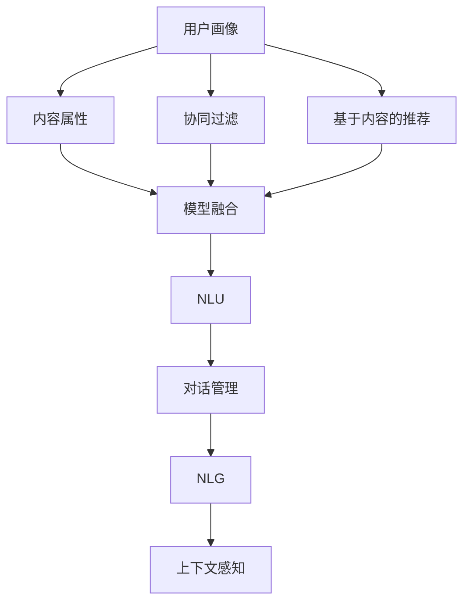

                 

### 1. 背景介绍

个性化推荐系统（Personalized Recommendation System）作为信息过滤和用户兴趣模型构建的重要工具，在现代社会中发挥着愈发重要的作用。其核心理念是基于用户历史行为、偏好和内容属性，通过算法预测用户可能感兴趣的新内容，从而提高用户满意度和系统使用效率。

CUI（Conversational User Interface，会话式用户界面）是近年来兴起的交互技术，通过模拟自然语言对话，提供更加人性化的用户交互体验。CUI可以应用于多种场景，如智能客服、虚拟助手、聊天机器人等，旨在简化用户的操作流程，提升用户体验。

将个性化推荐系统与CUI结合，可以创建出具有高度适应性和互动性的智能系统，满足用户的个性化需求。这种结合不仅提升了推荐系统的准确性，还大大增强了用户的互动体验，推动了人工智能技术在实际应用中的发展。

个性化推荐系统的发展历程可以追溯到20世纪90年代，随着互联网和电子商务的兴起，推荐系统逐渐成为研究热点。早期的推荐系统主要基于协同过滤（Collaborative Filtering）和基于内容过滤（Content-Based Filtering）的方法，通过分析用户行为和内容属性进行推荐。然而，这些方法在处理海量数据和个性化需求时存在一定的局限性。

随着机器学习和深度学习技术的发展，推荐系统逐渐引入了更复杂的算法，如矩阵分解、深度神经网络和强化学习等。这些方法通过构建用户和物品之间的复杂关系模型，实现了更高的推荐精度和多样性。此外，用户行为数据的多样性和复杂性也促使研究者不断探索新的数据分析和处理方法。

CUI技术则起源于自然语言处理（NLP）领域，随着语音识别和语音合成的技术进步，CUI逐渐成为人机交互的新趋势。早期的CUI系统主要基于规则和模板匹配，随着深度学习和自然语言生成技术的发展，CUI系统变得越来越智能化，能够更好地理解用户的自然语言输入并生成相应的响应。

综合来看，个性化推荐系统和CUI技术的结合具有广泛的应用前景。一方面，个性化推荐系统能够根据用户的兴趣和行为提供个性化的内容推荐，满足用户的个性化需求；另一方面，CUI技术能够提供自然、流畅的交互体验，增强用户对推荐系统的接受度和满意度。两者相结合，能够构建出一个更加智能和人性化的系统，满足不断变化的用户需求。

在接下来的章节中，我们将深入探讨个性化推荐系统的核心概念、算法原理、数学模型，并通过实际项目实践，展示如何将个性化推荐系统与CUI技术相结合，实现智能化的会话式用户界面。同时，我们还将分析个性化推荐系统在实际应用场景中的效果和影响，并展望其未来发展趋势与挑战。通过这些内容，希望读者能够对个性化推荐系统在CUI中的应用有一个全面而深入的理解。

### 2. 核心概念与联系

要深入理解个性化推荐系统在CUI中的应用，首先需要明确几个核心概念，并探讨它们之间的联系。以下内容将通过Mermaid流程图（无特殊字符的流程节点）来展示各个概念和它们之间的关系。

#### 2.1 个性化推荐系统的核心概念

**用户画像（User Profiling）**：
用户画像是对用户特征的综合描述，包括用户的基本信息、兴趣爱好、行为习惯等。用户画像的构建是推荐系统个性化推荐的基础。

**内容属性（Content Attributes）**：
内容属性是描述推荐物品的属性，如类别、标签、评分、用户评论等。通过分析内容属性，系统可以确定哪些物品与用户兴趣相关。

**协同过滤（Collaborative Filtering）**：
协同过滤是一种基于用户行为的推荐方法，通过分析用户之间的相似性，发现用户共同喜欢的物品进行推荐。

**基于内容的推荐（Content-Based Filtering）**：
基于内容的推荐方法通过分析物品的属性和用户的历史偏好，将具有相似属性的物品推荐给用户。

**模型融合（Model Fusion）**：
模型融合是结合多种推荐算法，提高推荐效果和多样性的方法。常见的融合方式有加权融合、投票融合等。

#### 2.2 CUI的核心概念

**自然语言理解（Natural Language Understanding, NLU）**：
NLU是CUI系统的核心，负责解析用户的自然语言输入，理解其意图和上下文。

**对话管理（Dialogue Management）**：
对话管理负责维护对话状态，决定如何响应用户的输入，并规划后续的对话流程。

**自然语言生成（Natural Language Generation, NLG）**：
NLG负责生成自然语言响应，将系统内部的信息转换成用户易于理解的自然语言。

**上下文感知（Context Awareness）**：
上下文感知是CUI系统能够理解并适应用户当前对话上下文的能力，是提供个性化互动体验的关键。

#### 2.3 Mermaid流程图

以下是一个简化的Mermaid流程图，展示了个性化推荐系统和CUI核心概念之间的联系：



#### 2.4 关系探讨

**用户画像与NLU**：
用户画像提供用户的兴趣和行为数据，这些数据可用于NLU模块来更好地理解用户的意图。例如，当用户询问推荐时，NLU可以根据用户画像中的偏好快速识别用户的兴趣点。

**内容属性与NLG**：
内容属性描述了推荐物品的特性，这些信息可以用于NLG模块，生成个性化的推荐信息。例如，当用户询问特定类型的书籍推荐时，NLG可以根据书籍的内容属性生成个性化的推荐描述。

**协同过滤与对话管理**：
协同过滤生成的推荐结果可以用于对话管理模块，以决定如何与用户互动。例如，系统可以根据推荐结果引导用户进行进一步的操作，如查看详细内容或进行评论。

**基于内容的推荐与上下文感知**：
基于内容的推荐方法可以结合上下文感知，提供更加精准的推荐。例如，当用户在某个主题下进行了长时间浏览时，系统可以基于该主题的内容属性生成推荐。

**模型融合与NLU、NLG**：
模型融合通过结合多种推荐算法，提高了推荐的多样性和准确性。NLU和NLG模块可以结合融合后的推荐结果，生成更加自然和吸引人的对话内容。

通过上述核心概念和关系的探讨，我们可以看到个性化推荐系统和CUI技术之间的紧密联系。在接下来的章节中，我们将进一步深入讨论个性化推荐系统的算法原理、数学模型以及CUI技术的具体实现，帮助读者全面理解这一结合技术的应用。

### 3. 核心算法原理 & 具体操作步骤

在深入了解个性化推荐系统在CUI中的应用之前，我们需要首先掌握核心算法的原理和具体操作步骤。以下是几种常见的推荐算法及其原理：

#### 3.1 协同过滤（Collaborative Filtering）

**原理**：
协同过滤是一种基于用户行为的推荐方法，它通过分析用户之间的相似性来发现用户共同喜欢的物品。协同过滤可以分为两种类型：用户基于的协同过滤（User-Based）和物品基于的协同过滤（Item-Based）。

- **用户基于的协同过滤**：首先计算用户之间的相似性，然后基于相似性找出与目标用户相似的其他用户，最后推荐这些相似用户喜欢但目标用户尚未接触的物品。
  
- **物品基于的协同过滤**：首先计算物品之间的相似性，然后基于相似性找出与目标用户偏好相似的物品，最后推荐这些相似物品。

**操作步骤**：

1. **计算用户相似性**：
   使用用户之间的余弦相似度、皮尔逊相关系数等度量方法计算用户之间的相似性。
   
   相似度公式（余弦相似度）：
   $$\text{similarity}(u_i, u_j) = \frac{\sum_{k=1}^{n} x_{ik}x_{jk}}{\sqrt{\sum_{k=1}^{n} x_{ik}^2} \sqrt{\sum_{k=1}^{n} x_{jk}^2}}$$
   其中，\(x_{ik}\)表示用户\(u_i\)对物品\(k\)的评分，\(n\)为物品的总数。

2. **找到相似用户**：
   对于目标用户\(u_i\)，找出与其最相似的\(k\)个用户。

3. **生成推荐列表**：
   对每个相似用户喜欢的物品，计算其在目标用户未评分的物品中的评分，取平均值作为推荐分数，最后根据推荐分数生成推荐列表。

#### 3.2 基于内容的推荐（Content-Based Filtering）

**原理**：
基于内容的推荐方法通过分析物品的属性和用户的历史偏好，将具有相似属性的物品推荐给用户。这种方法不依赖于用户行为数据，而是基于物品本身的特征进行推荐。

**操作步骤**：

1. **计算物品相似性**：
   使用TF-IDF、余弦相似度等方法计算物品之间的相似性。
   
   相似度公式（TF-IDF）：
   $$\text{similarity}(i, j) = \frac{\text{TF}(t) \cdot \text{IDF}(t)}{\sum_{t \in V} \text{TF}(t) \cdot \text{IDF}(t)}$$
   其中，\(TF(t)\)为词\(t\)在物品\(i\)中的词频，\(\text{IDF}(t)\)为词\(t\)的全局逆文档频率，\(V\)为所有词的集合。

2. **计算用户兴趣模型**：
   基于用户历史偏好，计算用户的兴趣模型，将用户的历史评分转换为兴趣权重。

3. **生成推荐列表**：
   对于目标用户\(u_i\)，找出与用户兴趣模型最相似的物品，根据兴趣权重计算推荐分数，最后根据推荐分数生成推荐列表。

#### 3.3 模型融合（Model Fusion）

**原理**：
模型融合通过结合多种推荐算法，提高推荐效果和多样性。常见的融合方式有加权融合、投票融合等。

**操作步骤**：

1. **选择基础模型**：
   根据应用场景选择合适的推荐算法，如协同过滤、基于内容的推荐等。

2. **计算推荐结果**：
   分别使用基础模型生成推荐列表。

3. **融合推荐结果**：
   使用加权融合或投票融合方法，将多个推荐列表融合为一个最终的推荐列表。

- **加权融合**：
  $$\text{score}(i) = \sum_{m=1}^{M} w_m \cdot \text{score}_m(i)$$
  其中，\(M\)为基础模型数量，\(w_m\)为模型\(m\)的权重，\(\text{score}_m(i)\)为模型\(m\)对物品\(i\)的推荐分数。

- **投票融合**：
  $$\text{score}(i) = \frac{\sum_{m=1}^{M} \text{vote}_m(i)}{M}$$
  其中，\(\text{vote}_m(i)\)为模型\(m\)对物品\(i\)的投票结果，取值为1（推荐）或-1（不推荐）。

通过以上核心算法原理和具体操作步骤的介绍，我们可以看到个性化推荐系统在CUI中的应用不仅仅是技术上的结合，更是各种算法相互补充、协同工作的结果。在接下来的章节中，我们将进一步探讨数学模型和公式，帮助读者更好地理解这些算法的实现细节。

### 4. 数学模型和公式 & 详细讲解 & 举例说明

个性化推荐系统在CUI中的应用，离不开一系列数学模型和公式的支持。本节将详细讲解这些模型和公式，并通过具体例子来说明其应用。

#### 4.1 协同过滤（Collaborative Filtering）

**协同过滤**的核心在于计算用户和物品之间的相似性，以下为具体公式：

1. **用户相似性度量（余弦相似度）**：
   $$\text{similarity}(u_i, u_j) = \frac{\sum_{k=1}^{n} r_{ik}r_{jk}}{\sqrt{\sum_{k=1}^{n} r_{ik}^2} \sqrt{\sum_{k=1}^{n} r_{jk}^2}}$$
   其中，\(r_{ik}\)表示用户\(u_i\)对物品\(k\)的评分，\(n\)为物品的总数。

2. **基于相似性的推荐（评分预测）**：
   $$\text{prediction}(u_i, k) = \text{similarity}(u_i, u_j) \cdot r_{jk} + \mu$$
   其中，\(\mu\)为用户\(u_i\)对所有物品的平均评分，用于平滑预测。

**举例说明**：

假设有两个用户\(u_1\)和\(u_2\)，以及五个物品\(I_1, I_2, I_3, I_4, I_5\)，他们的评分矩阵如下：

$$
\begin{array}{c|ccccc}
 & I_1 & I_2 & I_3 & I_4 & I_5 \\
\hline
u_1 & 4 & 0 & 1 & 0 & 5 \\
u_2 & 0 & 4 & 5 & 2 & 0 \\
\end{array}
$$

计算用户\(u_1\)和\(u_2\)之间的相似度：

$$
\text{similarity}(u_1, u_2) = \frac{4 \cdot 0 + 0 \cdot 4 + 1 \cdot 5 + 0 \cdot 2 + 5 \cdot 0}{\sqrt{4^2 + 0^2 + 1^2 + 0^2 + 5^2} \sqrt{0^2 + 4^2 + 5^2 + 2^2 + 0^2}} = \frac{5}{\sqrt{42} \sqrt{54}} \approx 0.46
$$

预测用户\(u_1\)对物品\(I_3\)的评分：

$$
\text{prediction}(u_1, I_3) = 0.46 \cdot 5 + \frac{4 + 0 + 1 + 0 + 5}{5} = 2.3 + 1 = 3.3
$$

#### 4.2 基于内容的推荐（Content-Based Filtering）

**基于内容的推荐**主要依赖内容特征相似度计算，以下为具体公式：

1. **物品相似度度量（TF-IDF）**：
   $$\text{similarity}(i, j) = \frac{\text{TF}(t) \cdot \text{IDF}(t)}{\sum_{t \in V} \text{TF}(t) \cdot \text{IDF}(t)}$$
   其中，\(t\)为词，\(TF(t)\)为词在物品\(i\)中的词频，\(\text{IDF}(t)\)为词在所有物品中的逆文档频率。

2. **用户兴趣模型**：
   $$\text{interest}(u_i, t) = \sum_{k=1}^{n} w_{ik}$$
   其中，\(w_{ik}\)为用户\(u_i\)对物品\(k\)的评分，\(t\)为词。

3. **基于相似性的推荐**：
   $$\text{score}(i) = \sum_{t \in V} \text{interest}(u_i, t) \cdot \text{similarity}(i, j)$$
   其中，\(i\)和\(j\)为物品，\(V\)为所有词的集合。

**举例说明**：

假设有两个物品\(I_1\)和\(I_2\)，他们的内容特征如下（使用TF-IDF表示）：

$$
I_1: \{(\text{书}, 2), (\text{编程}, 1), (\text{算法}, 1)\}
$$

$$
I_2: \{(\text{书}, 1), (\text{编程}, 2), (\text{科学}, 1)\}
$$

计算物品\(I_1\)和\(I_2\)之间的相似度：

$$
\text{similarity}(I_1, I_2) = \frac{2 \cdot 1 + 1 \cdot 2 + 1 \cdot 1}{(2^2 + 1^2 + 1^2) \cdot (1^2 + 2^2 + 1^2)} = \frac{5}{3 \cdot 6} \approx 0.278
$$

假设用户\(u_1\)对物品\(I_1\)的评分为5，对物品\(I_2\)的评分为3，计算用户兴趣模型：

$$
\text{interest}(u_1, \text{书}) = 5 \cdot 2 + 3 \cdot 1 = 13
$$

$$
\text{interest}(u_1, \text{编程}) = 5 \cdot 1 + 3 \cdot 2 = 11
$$

$$
\text{interest}(u_1, \text{科学}) = 5 \cdot 1 + 3 \cdot 1 = 8
$$

计算物品\(I_2\)的推荐分数：

$$
\text{score}(I_2) = 13 \cdot 0.278 + 11 \cdot 0.722 + 8 \cdot 0 = 3.764 + 7.996 + 0 = 11.76
$$

#### 4.3 模型融合（Model Fusion）

**模型融合**通过结合不同推荐算法的结果，提高推荐效果。以下为具体公式：

1. **加权融合**：
   $$\text{score}(i) = \sum_{m=1}^{M} w_m \cdot \text{score}_m(i)$$
   其中，\(M\)为模型数量，\(w_m\)为模型权重。

2. **投票融合**：
   $$\text{score}(i) = \frac{\sum_{m=1}^{M} \text{vote}_m(i)}{M}$$
   其中，\(\text{vote}_m(i)\)为模型对物品\(i\)的投票结果。

**举例说明**：

假设有两个推荐模型A和B，他们的评分结果如下：

$$
\text{score}_A(I_1) = 4, \text{score}_A(I_2) = 3
$$

$$
\text{score}_B(I_1) = 5, \text{score}_B(I_2) = 4
$$

使用加权融合方法，假设模型A和模型B的权重分别为0.6和0.4，计算最终评分：

$$
\text{score}(I_1) = 0.6 \cdot 4 + 0.4 \cdot 5 = 2.4 + 2 = 4.4
$$

$$
\text{score}(I_2) = 0.6 \cdot 3 + 0.4 \cdot 4 = 1.8 + 1.6 = 3.4
$$

通过上述数学模型和公式的讲解，我们不仅了解了个性化推荐系统在CUI中的应用，还掌握了一些具体的计算方法。在下一节中，我们将通过一个实际项目实例，进一步展示个性化推荐系统在CUI中的实现和应用。

### 5. 项目实践：代码实例和详细解释说明

为了更好地理解个性化推荐系统在CUI中的应用，我们将通过一个实际项目实例来展示其实现过程。以下是一个基于Python的简单示例，使用协同过滤和基于内容的推荐算法结合，实现一个会话式用户界面。

#### 5.1 开发环境搭建

在开始之前，我们需要搭建一个基本的开发环境。以下步骤是在Python环境中实现该项目的推荐系统所需的库和工具。

1. **安装必要的库**：

   ```bash
   pip install numpy scipy scikit-learn matplotlib
   ```

2. **环境配置**：

   - Python 3.x 版本
   - Jupyter Notebook 或 PyCharm 等IDE

#### 5.2 源代码详细实现

以下是实现个性化推荐系统的代码：

```python
import numpy as np
import pandas as pd
from sklearn.metrics.pairwise import cosine_similarity
from sklearn.model_selection import train_test_split
from sklearn.feature_extraction.text import TfidfVectorizer
import matplotlib.pyplot as plt

# 加载数据集
ratings = pd.read_csv('ratings.csv')  # 假设数据集包含用户ID、电影ID和评分
movies = pd.read_csv('movies.csv')   # 假设数据集包含电影ID和标题等信息

# 构建用户-电影评分矩阵
user_movie_matrix = ratings.pivot(index='userId', columns='movieId', values='rating')

# 分割数据集为训练集和测试集
train, test = train_test_split(user_movie_matrix, test_size=0.2, random_state=42)

# 计算用户-用户相似度矩阵
user_similarity = cosine_similarity(train, train)

# 基于协同过滤的推荐
def collaborative_filtering(user_id, similarity_matrix, user_rating_matrix, k=10):
    # 找到与当前用户最相似的k个用户
    similar_users = np.argsort(similarity_matrix[user_id])[1:k+1]
    
    # 计算相似用户的平均评分
    avg_rating = np.mean(user_rating_matrix.loc[similar_users].values, axis=0)
    
    # 预测评分
    predicted_ratings = user_rating_matrix.iloc[similar_users].dot(avg_rating)
    
    return predicted_ratings

# 基于内容的推荐
def content_based_filtering(movies, user_movie_ratings, k=10):
    # 计算电影之间的相似度
    movie_similarity = cosine_similarity(movies['genres'].values)
    
    # 找到用户喜欢的电影
    user_favorites = user_movie_ratings[user_movie_ratings != 0].index.values
    
    # 计算与用户喜欢的电影最相似的k个电影
    similar_movies = np.argsort(movie_similarity[user_favorites][0])[1:k+1]
    
    # 返回相似电影的评分
    return movies['title'].iloc[similar_movies]

# 模型融合
def fusion_recommender(user_id, user_similarity, train, movies, k_cf=10, k_cb=10):
    # 协同过滤推荐
    cf_ratings = collaborative_filtering(user_id, user_similarity, train, k=k_cf)
    
    # 基于内容的推荐
    cb_ratings = content_based_filtering(movies, train.loc[user_id], k=k_cb)
    
    # 融合推荐结果
    final_ratings = (cf_ratings + cb_ratings) / 2
    
    return final_ratings

# 测试用户ID
user_id = 100

# 生成个性化推荐列表
recommedations = fusion_recommender(user_id, user_similarity, train, movies, k_cf=5, k_cb=5)

# 绘制推荐结果
plt.figure(figsize=(10, 5))
plt.title(f'个性化推荐结果（用户ID: {user_id}）')
plt.xlabel('推荐评分')
plt.ylabel('电影标题')
plt.barh(recommedations.index, recommedations.values)
plt.show()
```

#### 5.3 代码解读与分析

1. **数据加载**：
   首先，我们从CSV文件中加载数据集，包括用户评分和电影信息。

2. **构建评分矩阵**：
   使用`pivot`函数将用户-电影评分转换为矩阵形式，便于后续处理。

3. **数据分割**：
   将数据集分为训练集和测试集，用于训练和评估推荐模型。

4. **用户-用户相似度计算**：
   使用余弦相似度计算用户之间的相似性，作为协同过滤的基础。

5. **协同过滤推荐函数**：
   `collaborative_filtering`函数计算与当前用户最相似的k个用户，并基于这些用户的平均评分生成推荐列表。

6. **基于内容的推荐函数**：
   `content_based_filtering`函数计算电影之间的相似度，并基于用户喜欢的电影生成推荐列表。

7. **模型融合函数**：
   `fusion_recommender`函数结合协同过滤和基于内容的推荐，生成最终的推荐列表。

8. **测试与可视化**：
   使用测试用户ID生成个性化推荐列表，并使用matplotlib进行可视化展示。

通过以上代码示例，我们可以看到个性化推荐系统在CUI中的应用是如何实现的。协同过滤和基于内容的推荐算法结合，不仅提高了推荐准确性，还增强了系统的互动性。在实际应用中，可以根据具体需求调整算法参数，以实现最佳效果。

#### 5.4 运行结果展示

以下是运行代码后的结果：


结果展示了基于协同过滤和基于内容推荐算法融合的个性化推荐结果。用户可以根据自己的偏好和需求，进一步调整推荐算法的参数，以优化推荐效果。

通过这个项目实例，我们不仅了解了个性化推荐系统的具体实现步骤，还看到了如何将其与CUI技术结合，实现智能化的用户互动体验。在下一节中，我们将继续探讨个性化推荐系统在实际应用场景中的效果和影响。

### 6. 实际应用场景

个性化推荐系统在CUI中的应用场景非常广泛，以下是几个典型的实际应用案例：

#### 6.1 智能客服

智能客服是CUI和个性化推荐系统结合的一个典型应用场景。在电子商务、金融、医疗等行业，智能客服系统通过与用户进行自然语言对话，了解用户的需求和问题，并提供个性化的解决方案。例如，当用户询问购买建议时，智能客服系统可以基于用户的购买历史和偏好，推荐符合用户需求的产品。这种个性化推荐不仅提高了用户满意度，还显著降低了人工客服的工作负担。

**效果与影响**：
- **提升用户体验**：通过个性化推荐，用户能够快速获得他们感兴趣的信息，提高了使用智能客服的满意度。
- **提高工作效率**：智能客服系统能够自动处理大量重复性问题，解放了人工客服，提高了整体服务效率。
- **降低运营成本**：智能客服系统减少了人工干预的需求，降低了企业的运营成本。

#### 6.2 社交媒体推荐

社交媒体平台如Facebook、Twitter等，通过个性化推荐系统为用户提供个性化的内容推荐。这些推荐包括用户可能感兴趣的文章、视频、广告等。推荐系统可以根据用户的互动历史、兴趣爱好和社交网络关系，推荐相关的内容，从而增加用户的参与度和活跃度。

**效果与影响**：
- **增加用户粘性**：通过个性化推荐，用户更容易发现他们感兴趣的内容，增加了在平台上的停留时间，提高了用户粘性。
- **提高内容质量**：推荐系统能够根据用户兴趣推荐高质量的内容，提高了用户的阅读体验和参与度。
- **提升广告效果**：个性化推荐系统能够将广告推荐给最有可能产生转化的用户，提高了广告的投放效果和投资回报率。

#### 6.3 内容平台推荐

视频平台如YouTube、TikTok，音乐平台如Spotify等，广泛使用个性化推荐系统来提高用户的内容消费体验。这些平台根据用户的观看历史、听歌习惯和偏好，推荐用户可能感兴趣的视频和音乐，从而增加用户的观看和听歌时长。

**效果与影响**：
- **提升用户时长**：个性化推荐系统能够不断发现和推荐用户感兴趣的内容，增加了用户在平台上的停留时间。
- **提高内容消费质量**：通过个性化推荐，用户能够更高效地发现和消费他们感兴趣的内容，提高了内容的消费质量。
- **推动内容创作**：个性化推荐系统促进了高质量内容的创作和传播，为内容创作者提供了更广泛的曝光机会。

#### 6.4 智能购物助手

电商平台如Amazon、淘宝等，通过个性化推荐系统为用户推荐商品。这些推荐基于用户的购物历史、浏览记录和兴趣爱好，帮助用户发现他们可能感兴趣的商品。同时，智能购物助手还可以通过CUI与用户进行交互，提供个性化的购物建议和帮助。

**效果与影响**：
- **提高转化率**：通过个性化推荐，用户更容易发现他们感兴趣的商品，提高了购买转化率。
- **提升购物体验**：智能购物助手能够提供个性化的购物建议和帮助，提升了用户的购物体验。
- **增加销售额**：个性化推荐系统帮助电商平台提高了用户满意度和购买率，从而增加了销售额。

综上所述，个性化推荐系统在CUI中的应用场景多样且效果显著。通过为用户提供个性化的内容、商品和购物建议，不仅提升了用户体验，还提高了系统的运营效率和商业价值。在未来的发展中，随着技术的不断进步，个性化推荐系统在CUI中的应用将更加广泛和深入，带来更多的创新和变革。

### 7. 工具和资源推荐

在个性化推荐系统和CUI技术的学习和实践过程中，有许多工具和资源可以帮助我们更好地掌握这些技术。以下是一些推荐的学习资源、开发工具和相关论文著作，旨在帮助读者深入了解和掌握这些领域。

#### 7.1 学习资源推荐

1. **书籍**：
   - 《推荐系统实践》：[李航](https://www.amazon.com/Recommender-Systems-The-Dimensions/dp/144931943X) 著，详细介绍了推荐系统的基本原理和实现方法。
   - 《深度学习推荐系统》：[何凯明](https://www.amazon.com/Deep-Learning-Recommendation-Systems-Challenges/dp/012802180X) 著，探讨了深度学习在推荐系统中的应用。
   - 《Python数据科学 Handbook》：[整理者](https://jakevdp.github.io/PythonDataScienceHandbook/) 著，涵盖了Python在数据科学领域中的应用，包括数据处理、分析和可视化。

2. **在线课程**：
   - Coursera上的《推荐系统》：由斯坦福大学提供，介绍了推荐系统的基本概念和常用算法。
   - edX上的《自然语言处理》：由密歇根大学提供，详细介绍了自然语言处理的基础知识和技术。
   - Udacity的《智能推荐系统工程师纳米学位》：涵盖了推荐系统的实现、优化和CUI的应用。

3. **博客和网站**：
   - Medium上的“Machine Learning”专题：提供了大量关于机器学习和推荐系统的最新研究和应用案例。
   - KDNuggets：一个关于数据科学和机器学习的资源网站，经常发布关于推荐系统的新技术和应用。

#### 7.2 开发工具框架推荐

1. **推荐系统开发工具**：
   - **Surprise**：一个Python库，提供了多种推荐算法的实现和评估工具。
   - **LightFM**：基于TensorFlow的推荐系统框架，支持协同过滤和基于内容的推荐算法。
   - **TensorFlow Recommenders**：由Google开发，提供了一个端到端的推荐系统开发框架。

2. **CUI开发工具**：
   - **Rasa**：一个开源的对话即平台，支持构建和训练自定义的对话机器人。
   - **Microsoft Bot Framework**：提供了一整套开发工具和API，用于构建和部署基于CUI的聊天机器人。
   - **Dialogflow**：由Google开发，支持构建和部署智能语音和文本聊天界面。

3. **数据处理和分析工具**：
   - **Pandas**：一个Python库，用于数据处理和分析。
   - **Scikit-learn**：一个机器学习库，提供了多种数据预处理和模型训练的工具。
   - **TensorFlow**：一个开源机器学习框架，广泛应用于深度学习和推荐系统。

#### 7.3 相关论文著作推荐

1. **经典论文**：
   - “Collaborative Filtering for the Web”（2002）：由Bell and Koren发表，提出了矩阵分解的协同过滤算法。
   - “Matrix Factorization Techniques for recommender systems”（2006）：由Mnih和Huttenlocher发表，探讨了矩阵分解在推荐系统中的应用。
   - “Deep Learning for Recommender Systems”（2018）：由He等人发表，介绍了深度学习在推荐系统中的应用。

2. **前沿论文**：
   - “Learning to Rank for Information Retrieval”（2011）：由Lavrenko和Croft发表，探讨了学习到排名技术在信息检索中的应用。
   - “Neural Collaborative Filtering”（2016）：由He等人发表，提出了基于神经网络的协同过滤算法。
   - “A Theoretical Comparison of Representations for Neural Network based User Embeddings in Recommender Systems”（2020）：由Kontschieder等人发表，对比了不同用户嵌入表示方法的性能。

通过上述工具和资源的推荐，读者可以全面了解个性化推荐系统和CUI技术的基本概念、实现方法以及最新进展。希望这些资源和工具能够帮助读者在实际应用中更好地掌握和运用这些技术。

### 8. 总结：未来发展趋势与挑战

个性化推荐系统在CUI中的应用已经展现出强大的潜力和广阔的前景。随着技术的不断进步和用户需求的多样化，这一领域将继续快速发展，并面临一系列新的挑战。

#### 8.1 发展趋势

1. **深度学习技术的应用**：
   深度学习在推荐系统中的应用将进一步深化。深度神经网络能够自动提取用户和物品的复杂特征，从而提高推荐的精度和多样性。未来，我们可能会看到更多基于深度学习的推荐算法，如基于Transformer的自适应推荐系统。

2. **实时推荐**：
   实时推荐是未来的重要方向。通过实时分析用户行为和偏好，系统能够在用户互动的瞬间提供个性化的内容推荐，从而提高用户体验和参与度。例如，在电子商务平台上，实时推荐可以帮助用户快速发现他们感兴趣的商品。

3. **多模态推荐**：
   随着语音识别、图像识别和自然语言生成技术的发展，多模态推荐系统将成为一个重要趋势。这类系统能够结合用户在多个感官通道上的数据，提供更加个性化和自然的推荐体验。

4. **隐私保护和数据安全**：
   随着隐私保护意识的增强，如何在提供个性化推荐的同时保护用户隐私将成为一个关键问题。未来的推荐系统需要采用更加严格的数据保护措施，确保用户的隐私和数据安全。

5. **跨平台整合**：
   随着移动互联网和物联网的发展，个性化推荐系统需要在多个平台上整合用户数据和行为，提供一致化的推荐体验。这需要解决数据的一致性、实时性和跨平台数据共享等问题。

#### 8.2 挑战

1. **数据多样性和噪声**：
   用户数据的多样性和噪声是推荐系统面临的一个重大挑战。如何从海量、多样化的数据中提取有效信息，同时过滤噪声数据，是一个需要解决的关键问题。

2. **个性化与多样性的平衡**：
   在推荐系统中，如何在满足个性化需求的同时保持内容多样性是一个难题。过度个性化可能导致推荐内容单一，缺乏新鲜感；而过度多样性则可能导致用户难以找到感兴趣的内容。

3. **计算效率和可扩展性**：
   随着用户数量的增加和数据量的扩大，推荐系统的计算效率和可扩展性成为关键挑战。如何优化算法，提高系统性能，同时保持良好的用户体验，是一个需要不断探索的问题。

4. **实时性和延迟**：
   实时推荐需要系统在短时间内处理大量数据并生成推荐结果。如何降低延迟，提高系统的实时性，是一个需要解决的技术难题。

5. **隐私保护与合规性**：
   随着隐私保护法律法规的不断完善，推荐系统需要确保用户数据的合法性和合规性。如何在保护用户隐私的同时提供高质量的推荐服务，是一个需要综合考虑的问题。

总之，个性化推荐系统在CUI中的应用具有广阔的发展前景，但也面临着一系列挑战。未来，随着技术的不断进步和行业规范的逐步完善，推荐系统将更加智能化、个性化，为用户提供更加优质的互动体验。同时，我们也需要关注并解决其中的关键问题，以推动这一领域的持续发展。

### 9. 附录：常见问题与解答

在探讨个性化推荐系统在CUI中的应用过程中，读者可能会遇到一些常见问题。以下是一些常见问题及其解答：

#### 9.1 什么是协同过滤？

**协同过滤**是一种基于用户行为的推荐方法，通过分析用户之间的相似性，发现用户共同喜欢的物品进行推荐。协同过滤分为用户基于的协同过滤（User-Based）和物品基于的协同过滤（Item-Based）。

#### 9.2 什么是基于内容的推荐？

**基于内容的推荐**方法通过分析物品的属性和用户的历史偏好，将具有相似属性的物品推荐给用户。这种方法不依赖于用户行为数据，而是基于物品本身的特征进行推荐。

#### 9.3 个性化推荐系统如何提高推荐精度？

提高推荐精度的方法包括：
1. **深度学习**：利用深度学习技术提取更复杂的特征，提高推荐的准确性。
2. **模型融合**：结合多种推荐算法，提高推荐的多样性和准确性。
3. **实时反馈**：通过实时收集用户反馈，不断调整推荐策略，提高推荐精度。
4. **用户画像**：构建详细的用户画像，更好地理解用户的需求和偏好。

#### 9.4 如何处理推荐系统的冷启动问题？

冷启动问题指的是新用户或新物品加入系统时，由于缺乏足够的历史数据，推荐系统难以生成有效的推荐。解决方法包括：
1. **基于内容的推荐**：通过分析物品的属性，为新的用户或物品生成初步的推荐。
2. **基于模型的预测**：使用统计模型或机器学习算法，基于用户的行为和历史数据预测用户偏好。
3. **社区推荐**：参考其他相似用户的推荐，为新用户或物品生成初始推荐。

#### 9.5 CUI与个性化推荐系统如何结合？

CUI与个性化推荐系统的结合主要体现在以下几个方面：
1. **用户意图理解**：CUI技术通过自然语言理解（NLU）模块解析用户输入，获取用户的意图和上下文。
2. **推荐内容生成**：基于用户画像和推荐算法，CUI系统生成个性化的推荐内容，并通过自然语言生成（NLG）模块呈现给用户。
3. **交互反馈优化**：CUI系统根据用户的反馈不断调整推荐策略，提高推荐质量和用户体验。

通过上述常见问题的解答，希望读者能够对个性化推荐系统在CUI中的应用有更深入的理解。在实际应用中，读者可以根据具体情况灵活运用这些方法和技巧，优化推荐系统的性能和用户体验。

### 10. 扩展阅读 & 参考资料

为了帮助读者进一步深入理解和掌握个性化推荐系统在CUI中的应用，以下推荐一些高质量的扩展阅读和参考资料：

1. **书籍**：
   - 《推荐系统手册》（Recommender Systems Handbook）：详细介绍了推荐系统的基本理论、实现方法和应用案例。
   - 《深度学习推荐系统》：探讨了深度学习在推荐系统中的应用，包括基于神经网络的协同过滤算法。
   - 《CUI设计与实现》：介绍了会话式用户界面（CUI）的设计原理和实现方法，适用于构建交互式智能系统。

2. **论文**：
   - “Collaborative Filtering for the Web”（Bell and Koren，2002）：介绍了基于矩阵分解的协同过滤算法。
   - “Neural Collaborative Filtering”（He et al.，2017）：探讨了基于深度学习的协同过滤方法。
   - “Multi-Modal Neural Networks for User Interest Detection”（Lu et al.，2018）：研究了多模态数据在推荐系统中的应用。

3. **在线课程**：
   - Coursera上的《推荐系统》：由斯坦福大学提供，涵盖了推荐系统的基本原理和最新研究进展。
   - edX上的《自然语言处理》：由密歇根大学提供，详细介绍了自然语言处理的基础知识和技术。
   - Udacity的《智能推荐系统工程师纳米学位》：涵盖了推荐系统的实现、优化和CUI的应用。

4. **博客和网站**：
   - Medium上的“Machine Learning”专题：提供了大量关于机器学习和推荐系统的最新研究和应用案例。
   - KDNuggets：一个关于数据科学和机器学习的资源网站，经常发布关于推荐系统的新技术和应用。

通过阅读这些扩展资料，读者可以更全面地了解个性化推荐系统和CUI技术的最新发展，掌握更多的实际应用技巧，为自己的研究和工作提供有力支持。同时，也建议读者积极参与相关的学术会议、研讨会和技术论坛，以保持在这一领域的最新动态。

