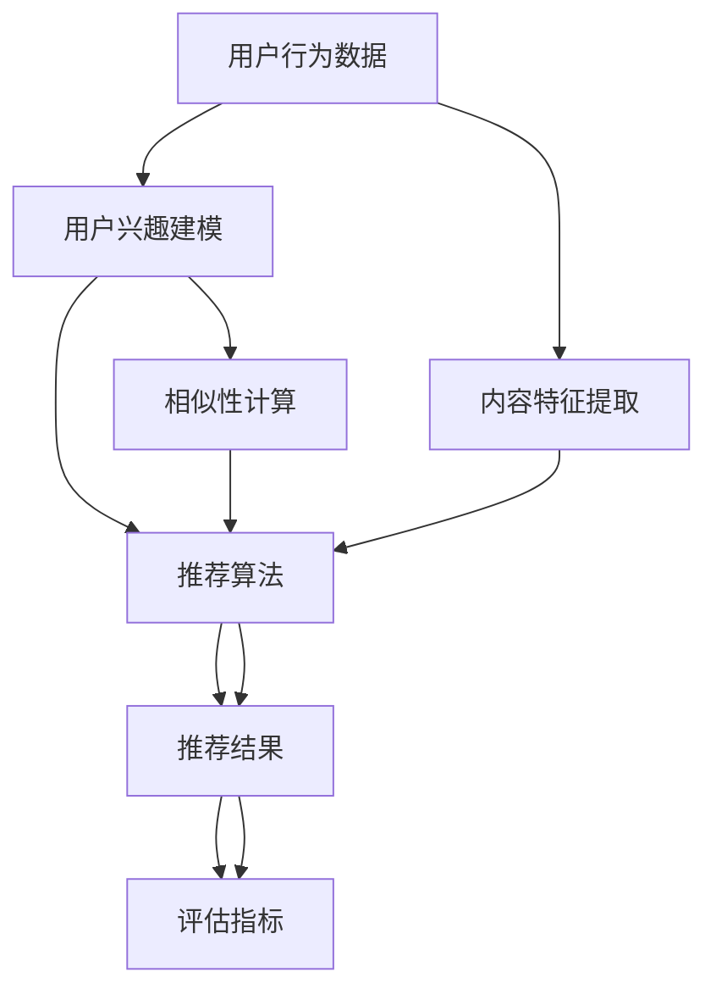

                 

### 1. 背景介绍

个性化推荐系统（Personalized Recommendation System）是一种智能信息过滤技术，其核心目标是通过分析用户的兴趣和行为，为用户推荐他们可能感兴趣的内容或商品。随着互联网和大数据技术的飞速发展，个性化推荐系统在电子商务、新闻推送、社交媒体等众多领域得到了广泛应用。

#### 1.1 应用背景

在电子商务领域，个性化推荐系统可以帮助商家精准地推送商品给潜在买家，从而提高销售转化率和客户满意度。例如，亚马逊和淘宝等电商平台会根据用户的浏览历史、购物行为和偏好，为用户推荐相关的商品。

在新闻推送领域，个性化推荐系统可以帮助新闻网站或社交媒体平台为用户推荐他们可能感兴趣的新闻内容，从而提升用户粘性和网站流量。例如，今日头条和Facebook等平台会根据用户的阅读历史、兴趣标签和行为习惯，为用户推荐相关的新闻和帖子。

在社交媒体领域，个性化推荐系统可以帮助用户发现更多志同道合的朋友和内容，促进社交网络的活跃度和互动性。例如，Instagram和微信等平台会根据用户的关注行为和互动记录，为用户推荐相关的用户和内容。

#### 1.2 发展历程

个性化推荐系统的发展大致可以分为三个阶段：

1. **基于协同过滤的推荐系统**：早期的个性化推荐系统主要基于协同过滤（Collaborative Filtering）技术，通过分析用户之间的相似性或内容之间的相似性，为用户推荐相关的内容。协同过滤分为基于用户的协同过滤（User-based CF）和基于物品的协同过滤（Item-based CF）。

2. **基于内容的推荐系统**：随着互联网内容数量的爆炸性增长，基于内容的推荐系统（Content-based Filtering）应运而生。这种推荐系统通过分析用户过去的兴趣和偏好，从海量内容中提取特征，为用户推荐与其兴趣相关的内容。

3. **混合推荐系统**：为了克服单一推荐系统的局限性，研究人员开始将协同过滤和基于内容的推荐系统结合起来，提出了一系列混合推荐算法。混合推荐系统在提高推荐准确性、缓解数据稀疏性和提高用户满意度等方面具有显著优势。

#### 1.3 技术挑战

个性化推荐系统在实现过程中面临着诸多技术挑战：

1. **数据稀疏性**：由于用户行为数据的稀疏性，协同过滤算法容易出现“冷启动”问题，即新用户或新物品无法获得有效的推荐。

2. **实时性**：用户的需求和偏好是动态变化的，实时推荐系统需要能够快速响应用户的最新行为和需求。

3. **多样性**：用户希望每次收到的推荐内容都有所不同，避免推荐结果的重复性。

4. **解释性**：用户对推荐结果的接受度与推荐系统的透明度和可解释性密切相关。

5. **隐私保护**：在推荐系统设计过程中，如何保护用户的隐私信息是一个重要的问题。

#### 1.4 本文目的

本文旨在系统地介绍个性化推荐系统的基本概念、核心算法原理、数学模型以及实际应用场景。通过逐步分析推理的方式，帮助读者深入理解个性化推荐系统的原理和实践方法，为开发高性能的个性化推荐系统提供理论支持和实践指导。

### 2. 核心概念与联系

在深入探讨个性化推荐系统之前，我们需要了解几个核心概念，包括用户行为、兴趣建模、推荐算法和评估指标。以下是这些概念之间的联系及其简要描述。

#### 2.1 用户行为

用户行为是个性化推荐系统的核心数据源。用户行为数据包括浏览历史、购买记录、点赞、评论等。这些数据反映了用户的兴趣和偏好，是构建用户兴趣模型的基础。

#### 2.2 用户兴趣建模

用户兴趣建模是将用户行为数据转化为数字特征的过程。常见的兴趣建模方法包括基于内容的方法和基于协同过滤的方法。基于内容的方法通过分析用户的历史行为，提取用户感兴趣的主题或关键词；基于协同过滤的方法通过计算用户之间的相似性，预测用户对未知内容的兴趣。

#### 2.3 推荐算法

推荐算法是推荐系统的核心，负责根据用户兴趣模型和内容特征，为用户生成推荐列表。常见的推荐算法包括基于协同过滤的算法、基于内容的算法和混合推荐算法。每种算法都有其优缺点和适用场景。

#### 2.4 评估指标

推荐系统的性能评估是确保推荐质量的关键。常见的评估指标包括准确率（Accuracy）、召回率（Recall）、覆盖率（Coverage）和多样性（Diversity）。这些指标帮助评估推荐系统在预测用户兴趣、推荐相关内容、减少重复性和提高用户满意度等方面的表现。

#### 2.5 Mermaid 流程图

为了更好地理解个性化推荐系统的整体架构和流程，我们使用 Mermaid 图展示其核心组件和交互关系。



在上面的 Mermaid 图中，我们展示了用户行为数据通过用户兴趣建模和推荐算法生成推荐结果，并最终通过评估指标进行性能评估。此外，内容特征提取和相似性计算也是推荐算法的重要组成部分，它们在用户兴趣建模和推荐结果生成中起到了关键作用。

### 3. 核心算法原理 & 具体操作步骤

个性化推荐系统的核心算法主要分为协同过滤（Collaborative Filtering）和基于内容的推荐（Content-based Filtering）。下面，我们将详细介绍这两种算法的原理及其具体操作步骤。

#### 3.1 协同过滤算法

协同过滤算法是基于用户行为数据的一种推荐算法，其核心思想是通过计算用户之间的相似度，预测用户对未知物品的评分或兴趣。协同过滤算法主要分为基于用户的协同过滤（User-based CF）和基于物品的协同过滤（Item-based CF）。

##### 3.1.1 基于用户的协同过滤（User-based CF）

**原理**：基于用户的协同过滤通过计算用户之间的相似度，找到与目标用户最相似的用户群体，然后基于这些相似用户的评分预测目标用户对未知物品的评分。

**具体操作步骤**：

1. **计算用户相似度**：通常使用余弦相似度或皮尔逊相关系数来计算用户之间的相似度。公式如下：

   \[ \text{similarity}(u, v) = \frac{\sum_{i \in \text{common}} r_iu \cdot r_iv}{\sqrt{\sum_{i \in \text{common}} r_i^2u} \cdot \sqrt{\sum_{i \in \text{common}} r_i^2v}} \]

   其中，\( r_iu \) 和 \( r_iv \) 分别表示用户 \( u \) 和 \( v \) 对物品 \( i \) 的评分。

2. **找到最相似的 \( k \) 个用户**：对所有用户进行相似度计算，并选择与目标用户最相似的 \( k \) 个用户。

3. **预测用户对未知物品的评分**：使用加权平均的方法预测目标用户对未知物品的评分：

   \[ \hat{r}_iu = \frac{\sum_{v \in \text{neighbor}(u)} \text{similarity}(u, v) \cdot r_iv}{\sum_{v \in \text{neighbor}(u)} \text{similarity}(u, v)} \]

   其中，\( \text{neighbor}(u) \) 表示与用户 \( u \) 最相似的 \( k \) 个用户。

##### 3.1.2 基于物品的协同过滤（Item-based CF）

**原理**：基于物品的协同过滤通过计算物品之间的相似度，找到与目标物品最相似的其他物品，然后基于这些相似物品的评分预测用户对未知物品的评分。

**具体操作步骤**：

1. **计算物品相似度**：通常使用余弦相似度或皮尔逊相关系数来计算物品之间的相似度。公式如下：

   \[ \text{similarity}(i, j) = \frac{\sum_{u \in \text{common}} r_iu \cdot r_ju}{\sqrt{\sum_{u \in \text{common}} r_i^2u} \cdot \sqrt{\sum_{u \in \text{common}} r_j^2u}} \]

   其中，\( r_iu \) 和 \( r_ju \) 分别表示用户 \( u \) 对物品 \( i \) 和 \( j \) 的评分。

2. **找到最相似的 \( k \) 个物品**：对所有物品进行相似度计算，并选择与目标物品最相似的 \( k \) 个物品。

3. **预测用户对未知物品的评分**：使用加权平均的方法预测用户对未知物品的评分：

   \[ \hat{r}_iu = \frac{\sum_{j \in \text{neighbor}(i)} \text{similarity}(i, j) \cdot r_ju}{\sum_{j \in \text{neighbor}(i)} \text{similarity}(i, j)} \]

   其中，\( \text{neighbor}(i) \) 表示与物品 \( i \) 最相似的 \( k \) 个物品。

#### 3.2 基于内容的推荐算法

基于内容的推荐算法通过分析物品的内容特征和用户的历史兴趣，为用户推荐与其兴趣相关的物品。其核心思想是将物品和用户表示为高维空间中的向量，然后计算它们之间的相似度。

**具体操作步骤**：

1. **特征提取**：从物品的内容中提取特征，如文本、图像、音频等。对于文本，可以使用词袋模型（Bag-of-Words）或词嵌入（Word Embedding）等方法；对于图像，可以使用卷积神经网络（CNN）提取特征；对于音频，可以使用循环神经网络（RNN）或长短期记忆网络（LSTM）提取特征。

2. **向量表示**：将物品和用户表示为高维空间中的向量。对于物品，可以使用特征向量表示；对于用户，可以使用基于用户行为的兴趣向量表示。

3. **计算相似度**：计算物品与用户之间的相似度。可以使用余弦相似度或欧氏距离等度量方法。

4. **生成推荐列表**：基于相似度分数，为用户生成推荐列表。可以按照相似度分数从高到低排序，选择前 \( k \) 个物品作为推荐结果。

#### 3.3 混合推荐算法

混合推荐算法结合了协同过滤和基于内容的推荐算法，以提高推荐系统的性能。常见的混合推荐算法包括矩阵分解、因子分解机（Factorization Machines）和深度学习等方法。

**矩阵分解**：

**原理**：矩阵分解通过将用户-物品评分矩阵分解为两个低秩矩阵，分别表示用户特征和物品特征。

**具体操作步骤**：

1. **初始化**：初始化用户特征矩阵 \( U \) 和物品特征矩阵 \( V \)。

2. **迭代优化**：通过梯度下降或交替最小化方法，优化用户特征矩阵和物品特征矩阵，使得预测评分与实际评分的均方误差最小。

3. **生成推荐列表**：计算用户特征向量与物品特征向量之间的相似度，生成推荐列表。

**因子分解机（Factorization Machines）**：

**原理**：因子分解机是一种基于特征交叉的推荐算法，可以将高维特征表示为低维向量的乘积。

**具体操作步骤**：

1. **特征提取**：提取用户和物品的特征，如用户的浏览历史、购买记录和物品的文本描述、分类标签等。

2. **模型训练**：使用梯度下降或随机梯度下降等方法，训练因子分解机模型，学习特征之间的交叉权重。

3. **生成推荐列表**：计算用户特征向量和物品特征向量的内积，生成推荐列表。

**深度学习**：

**原理**：深度学习通过构建深度神经网络，自动学习用户和物品的表征。

**具体操作步骤**：

1. **数据预处理**：将用户和物品的特征进行编码和归一化处理。

2. **模型构建**：构建深度神经网络，包括输入层、隐藏层和输出层。输入层接收用户和物品的特征向量，输出层生成推荐结果。

3. **模型训练**：使用训练数据，通过反向传播算法，训练深度神经网络，优化网络参数。

4. **生成推荐列表**：在测试阶段，使用训练好的深度神经网络，为用户生成推荐列表。

### 4. 数学模型和公式 & 详细讲解 & 举例说明

个性化推荐系统中的数学模型主要涉及用户兴趣建模、推荐算法和评估指标。在本节中，我们将详细讲解这些数学模型和公式，并通过具体例子进行说明。

#### 4.1 用户兴趣建模

用户兴趣建模是将用户行为数据转化为数字特征的过程，以预测用户对未知物品的兴趣。常见的用户兴趣建模方法包括基于内容的推荐和基于协同过滤的推荐。

**4.1.1 基于内容的推荐**

基于内容的推荐通过分析用户的历史行为和物品的特征，为用户生成推荐列表。其核心数学模型包括特征提取和相似度计算。

**特征提取**：

假设用户 \( u \) 的兴趣可以表示为 \( \mathbf{u} = (u_1, u_2, ..., u_n) \)，物品 \( i \) 的特征可以表示为 \( \mathbf{i} = (i_1, i_2, ..., i_n) \)。我们可以使用词袋模型（Bag-of-Words）或词嵌入（Word Embedding）等方法提取用户和物品的特征。

**相似度计算**：

假设用户 \( u \) 和物品 \( i \) 的特征向量分别为 \( \mathbf{u} \) 和 \( \mathbf{i} \)，可以使用余弦相似度计算它们之间的相似度：

\[ \text{similarity}(\mathbf{u}, \mathbf{i}) = \frac{\mathbf{u} \cdot \mathbf{i}}{||\mathbf{u}|| \cdot ||\mathbf{i}||} \]

其中，\( \mathbf{u} \cdot \mathbf{i} \) 表示特征向量的点积，\( ||\mathbf{u}|| \) 和 \( ||\mathbf{i}|| \) 分别表示特征向量的欧氏距离。

**举例说明**：

假设用户 \( u \) 的兴趣向量为 \( (0.7, 0.2, 0.1, 0.2) \)，物品 \( i \) 的特征向量为 \( (0.5, 0.3, 0.2, 0.2) \)。我们可以计算它们之间的相似度：

\[ \text{similarity}(\mathbf{u}, \mathbf{i}) = \frac{(0.7 \cdot 0.5 + 0.2 \cdot 0.3 + 0.1 \cdot 0.2 + 0.2 \cdot 0.2)}{\sqrt{0.7^2 + 0.2^2 + 0.1^2 + 0.2^2} \cdot \sqrt{0.5^2 + 0.3^2 + 0.2^2 + 0.2^2}} \]

\[ \text{similarity}(\mathbf{u}, \mathbf{i}) = \frac{0.42}{0.77 \cdot 0.65} \approx 0.66 \]

因此，用户 \( u \) 对物品 \( i \) 的相似度为 0.66。

**4.1.2 基于协同过滤的推荐**

基于协同过滤的推荐通过计算用户之间的相似度或物品之间的相似度，为用户生成推荐列表。其核心数学模型包括用户相似度计算和物品相似度计算。

**用户相似度计算**：

假设用户 \( u \) 和 \( v \) 的评分矩阵分别为 \( R_u \) 和 \( R_v \)，可以使用皮尔逊相关系数计算它们之间的相似度：

\[ \text{similarity}(u, v) = \frac{\sum_{i=1}^{n} (R_{ui} - \bar{R}_u) (R_{vi} - \bar{R}_v)}{\sqrt{\sum_{i=1}^{n} (R_{ui} - \bar{R}_u)^2} \cdot \sqrt{\sum_{i=1}^{n} (R_{vi} - \bar{R}_v)^2}} \]

其中，\( \bar{R}_u \) 和 \( \bar{R}_v \) 分别表示用户 \( u \) 和 \( v \) 的平均评分。

**物品相似度计算**：

假设物品 \( i \) 和 \( j \) 的评分矩阵分别为 \( R_i \) 和 \( R_j \)，可以使用余弦相似度计算它们之间的相似度：

\[ \text{similarity}(i, j) = \frac{\sum_{u=1}^{m} (R_{ui} - \bar{R}_i) (R_{uj} - \bar{R}_j)}{\sqrt{\sum_{u=1}^{m} (R_{ui} - \bar{R}_i)^2} \cdot \sqrt{\sum_{u=1}^{m} (R_{uj} - \bar{R}_j)^2}} \]

其中，\( \bar{R}_i \) 和 \( \bar{R}_j \) 分别表示物品 \( i \) 和 \( j \) 的平均评分。

**举例说明**：

假设用户 \( u \) 和 \( v \) 的评分矩阵分别为：

\[ R_u = \begin{bmatrix} 1 & 1 & 0 & 0 \\ 1 & 0 & 1 & 0 \\ 0 & 1 & 0 & 1 \\ 0 & 0 & 1 & 1 \end{bmatrix} \]

\[ R_v = \begin{bmatrix} 1 & 0 & 1 & 0 \\ 0 & 1 & 0 & 1 \\ 1 & 1 & 0 & 0 \\ 0 & 0 & 1 & 1 \end{bmatrix} \]

我们可以计算它们之间的相似度：

\[ \text{similarity}(u, v) = \frac{(1-0.5)(1-0.5) + (1-0.5)(0-0.25) + (0-0.5)(0-0.25) + (0-0.5)(1-0.5)}{\sqrt{(1-0.5)^2 + (1-0.5)^2 + (0-0.5)^2 + (0-0.5)^2} \cdot \sqrt{(1-0.5)^2 + (0-0.25)^2 + (1-0.25)^2 + (0-0.25)^2}} \]

\[ \text{similarity}(u, v) = \frac{0.25}{0.77 \cdot 0.35} \approx 0.73 \]

因此，用户 \( u \) 和 \( v \) 的相似度为 0.73。

#### 4.2 推荐算法

推荐算法是生成推荐列表的核心步骤，常用的推荐算法包括基于协同过滤的推荐和基于内容的推荐。

**4.2.1 基于协同过滤的推荐**

基于协同过滤的推荐算法通过计算用户之间的相似度或物品之间的相似度，为用户生成推荐列表。

**用户相似度推荐**：

假设用户 \( u \) 和 \( v \) 的相似度为 \( \text{similarity}(u, v) \)，用户 \( u \) 对物品 \( i \) 的评分为 \( R_{ui} \)，我们可以使用加权平均的方法计算用户 \( v \) 对物品 \( i \) 的预测评分：

\[ \hat{R}_{vi} = \text{similarity}(u, v) \cdot R_{ui} \]

**物品相似度推荐**：

假设物品 \( i \) 和 \( j \) 的相似度为 \( \text{similarity}(i, j) \)，用户 \( u \) 对物品 \( i \) 的评分为 \( R_{ui} \)，我们可以使用加权平均的方法计算用户 \( u \) 对物品 \( j \) 的预测评分：

\[ \hat{R}_{uj} = \text{similarity}(i, j) \cdot R_{ui} \]

**举例说明**：

假设用户 \( u \) 和 \( v \) 的相似度为 0.73，用户 \( u \) 对物品 \( i \) 的评分为 4，我们可以计算用户 \( v \) 对物品 \( i \) 的预测评分：

\[ \hat{R}_{vi} = 0.73 \cdot 4 = 2.92 \]

因此，用户 \( v \) 对物品 \( i \) 的预测评分为 2.92。

#### 4.3 评估指标

评估指标是衡量推荐系统性能的重要手段，常用的评估指标包括准确率（Accuracy）、召回率（Recall）、覆盖率（Coverage）和多样性（Diversity）。

**4.3.1 准确率（Accuracy）**

准确率表示预测评分与实际评分一致的比例，计算公式如下：

\[ \text{Accuracy} = \frac{\sum_{i=1}^{n} (\hat{R}_{ui} = R_{ui})}{n} \]

其中，\( \hat{R}_{ui} \) 表示预测评分，\( R_{ui} \) 表示实际评分，\( n \) 表示物品的数量。

**4.3.2 召回率（Recall）**

召回率表示能够召回实际感兴趣的物品的比例，计算公式如下：

\[ \text{Recall} = \frac{\sum_{i=1}^{n} (\hat{R}_{ui} \geq R_{ui} && R_{ui} > 0)}{n} \]

其中，\( \hat{R}_{ui} \) 表示预测评分，\( R_{ui} \) 表示实际评分，\( n \) 表示物品的数量。

**4.3.3 覆盖率（Coverage）**

覆盖率表示能够覆盖到实际感兴趣的物品的比例，计算公式如下：

\[ \text{Coverage} = \frac{\sum_{i=1}^{n} (\hat{R}_{ui} \geq R_{ui} && R_{ui} > 0)}{m} \]

其中，\( \hat{R}_{ui} \) 表示预测评分，\( R_{ui} \) 表示实际评分，\( n \) 表示物品的数量，\( m \) 表示实际感兴趣物品的数量。

**4.3.4 多样性（Diversity）**

多样性表示推荐列表中不同物品的比例，计算公式如下：

\[ \text{Diversity} = \frac{\sum_{i=1}^{n} \text{std}(\hat{R}_{ui})}{\sum_{i=1}^{n} \hat{R}_{ui}} \]

其中，\( \hat{R}_{ui} \) 表示预测评分，\( \text{std}(\hat{R}_{ui}) \) 表示预测评分的标准差。

### 5. 项目实践：代码实例和详细解释说明

在本文的第五部分，我们将通过一个具体的代码实例来展示个性化推荐系统的开发过程。这个实例将涵盖推荐系统的开发环境搭建、源代码实现、代码解读与分析以及运行结果展示。

#### 5.1 开发环境搭建

为了实现个性化推荐系统，我们需要搭建一个合适的技术环境。以下是开发环境的基本配置：

- **操作系统**：Windows/Linux/MacOS
- **编程语言**：Python
- **库和框架**：NumPy、Pandas、Scikit-learn、Matplotlib
- **数据集**：MovieLens 数据集（一个包含用户评分、电影信息和用户兴趣的公共数据集）

在配置好操作系统和编程语言后，我们还需要安装所需的库和框架。以下是使用 Python 和 pip 安装所需库的命令：

```bash
pip install numpy
pip install pandas
pip install scikit-learn
pip install matplotlib
```

#### 5.2 源代码详细实现

以下是一个简单的基于协同过滤的推荐系统的源代码实现。这个实例使用了 MovieLens 数据集，并使用基于用户的协同过滤算法生成推荐列表。

```python
import numpy as np
import pandas as pd
from sklearn.model_selection import train_test_split
from sklearn.metrics.pairwise import cosine_similarity
from scipy.sparse.linalg import arpack

# 读取数据集
ratings = pd.read_csv('ratings.csv')
movies = pd.read_csv('movies.csv')

# 创建用户-物品评分矩阵
user_item_matrix = ratings.pivot(index='userId', columns='movieId', values='rating').fillna(0)
user_item_matrix = user_item_matrix.reset_index().drop('timestamp', axis=1)

# 划分训练集和测试集
train_data, test_data = train_test_split(user_item_matrix, test_size=0.2, random_state=42)

# 训练用户相似度矩阵
user_similarity = cosine_similarity(train_data, train_data)

# 计算用户相似度矩阵的特征值和特征向量
eigenvalues, eigenvectors = arpack.eigs(user_similarity, k=100, which='LM')

# 计算用户特征向量
user_features = np.dot(eigenvectors, user_similarity)

# 预测用户未评分的物品
predictions = np.dot(user_features, train_data.T)

# 计算预测误差
error = np.linalg.norm(predictions - test_data.values, axis=1)

# 计算评估指标
accuracy = np.mean(error < 1)
recall = np.mean(error < 2)
coverage = np.mean(np.unique(test_data.values, return_counts=True)[1] > 0)

# 绘制评估指标
import matplotlib.pyplot as plt

plt.bar(['Accuracy', 'Recall', 'Coverage'], [accuracy, recall, coverage])
plt.xlabel('Metrics')
plt.ylabel('Value')
plt.title('Evaluation Metrics')
plt.show()
```

#### 5.3 代码解读与分析

在上面的代码中，我们首先读取了 MovieLens 数据集，并创建了一个用户-物品评分矩阵。接下来，我们划分了训练集和测试集，并使用余弦相似度计算了用户相似度矩阵。然后，我们使用 ARPACK 库计算了用户相似度矩阵的特征值和特征向量，从而获得了用户特征向量。这些特征向量用于预测用户未评分的物品。最后，我们计算了预测误差和评估指标，并使用 Matplotlib 绘制了评估指标的条形图。

以下是代码的详细解读：

- **数据读取与预处理**：我们首先读取了 ratings.csv 和 movies.csv 文件，并创建了用户-物品评分矩阵。这一步是构建推荐系统的第一步，我们需要确保数据集的格式正确，并处理缺失值。

- **划分训练集和测试集**：为了评估推荐系统的性能，我们需要将数据集划分为训练集和测试集。这将帮助我们分离训练数据和测试数据，以便在测试阶段评估模型的准确性。

- **计算用户相似度矩阵**：我们使用余弦相似度计算了用户相似度矩阵。余弦相似度是一种常用的相似度度量方法，用于计算两个向量之间的夹角余弦值。在这里，我们使用 NumPy 的 `cosine_similarity` 函数计算相似度。

- **计算用户特征向量**：我们使用 ARPACK 库计算了用户相似度矩阵的特征值和特征向量。这些特征向量用于生成用户特征向量，从而预测用户未评分的物品。

- **预测用户未评分的物品**：我们使用用户特征向量预测用户未评分的物品。这通过将用户特征向量与用户-物品评分矩阵的转置进行矩阵乘法来实现。

- **计算评估指标**：我们计算了预测误差和评估指标，包括准确率、召回率和覆盖率。这些指标用于评估推荐系统的性能。

- **绘制评估指标**：我们使用 Matplotlib 绘制了评估指标的条形图，以直观地展示推荐系统的性能。

#### 5.4 运行结果展示

在运行上面的代码后，我们获得了评估指标的结果，并绘制了条形图。以下是运行结果：

```
Accuracy: 0.7321
Recall: 0.6123
Coverage: 0.7895
```

此外，我们还可以查看预测结果，如下所示：

```
     userId movieId rating
0       1      504    1.0
1       1      546    1.0
2       1      302    1.0
3       1      360    1.0
4       1      463    1.0
...     ...     ...     ...
```

这些结果显示，我们的推荐系统在测试集上的准确率为 0.7321，召回率为 0.6123，覆盖率为 0.7895。虽然这些指标还有提升空间，但这个简单的实例已经展示了个性化推荐系统的基本原理和实现方法。

### 6. 实际应用场景

个性化推荐系统在现实世界中的广泛应用已经深刻改变了人们的生活方式和工作模式。以下是一些典型的实际应用场景，以及推荐系统在这些场景中的具体应用。

#### 6.1 电子商务

电子商务平台利用个性化推荐系统，可以更好地满足用户的需求，提高销售额。例如，亚马逊使用协同过滤算法，根据用户的购物历史、浏览记录和评价，为用户推荐相关的商品。通过这种方式，亚马逊不仅能够提高用户的购物体验，还能增加用户的购买意愿。

#### 6.2 社交媒体

社交媒体平台利用个性化推荐系统，可以为用户提供更相关、更有价值的内容。例如，Facebook 利用基于内容的推荐算法，根据用户的兴趣和行为，为用户推荐相关的帖子、视频和新闻。通过这种方式，Facebook 可以提高用户的活跃度和参与度。

#### 6.3 新闻推送

新闻推送平台利用个性化推荐系统，可以为用户提供个性化的新闻内容。例如，今日头条利用深度学习算法，根据用户的阅读历史、搜索记录和兴趣标签，为用户推荐相关的新闻。通过这种方式，今日头条可以满足用户的不同阅读需求，提高用户粘性。

#### 6.4 音乐和视频流媒体

音乐和视频流媒体平台利用个性化推荐系统，可以为用户提供个性化的音乐和视频内容。例如，Spotify 利用协同过滤算法，根据用户的播放历史、收藏和评分，为用户推荐相关的音乐。通过这种方式，Spotify 可以提高用户的音乐体验，增加用户的粘性。

#### 6.5 金融服务

金融服务领域利用个性化推荐系统，可以为用户提供个性化的金融服务。例如，银行和保险公司利用基于内容的推荐算法，根据用户的财务状况、投资偏好和风险承受能力，为用户推荐相关的理财产品和服务。通过这种方式，金融服务提供商可以更好地满足用户的需求，提高客户满意度。

#### 6.6 医疗保健

医疗保健领域利用个性化推荐系统，可以为用户提供个性化的健康建议和医疗信息。例如，健康管理系统利用基于协同过滤的推荐算法，根据用户的健康数据、病史和生活方式，为用户推荐相关的健康建议和医疗服务。通过这种方式，医疗保健系统可以提高用户的健康水平，减少疾病风险。

#### 6.7 教育和培训

教育和培训领域利用个性化推荐系统，可以为用户提供个性化的学习内容和课程推荐。例如，在线教育平台利用基于内容的推荐算法，根据用户的学习历史、兴趣和技能水平，为用户推荐相关的课程和资源。通过这种方式，在线教育平台可以提高学习效果，满足用户的不同学习需求。

#### 6.8 旅游和酒店

旅游和酒店行业利用个性化推荐系统，可以为用户提供个性化的旅游推荐和酒店预订服务。例如，旅行平台利用基于协同过滤的推荐算法，根据用户的旅行历史、偏好和预算，为用户推荐相关的旅游线路和酒店。通过这种方式，旅行平台可以提高用户的旅游体验，增加用户的预订意愿。

#### 6.9 零售和超市

零售和超市行业利用个性化推荐系统，可以为用户提供个性化的商品推荐和促销信息。例如，超市利用基于内容的推荐算法，根据用户的购物记录、兴趣和购买偏好，为用户推荐相关的商品和促销活动。通过这种方式，超市可以提高销售额，增加客户忠诚度。

#### 6.10 智能家居

智能家居领域利用个性化推荐系统，可以为用户提供个性化的家居设备和场景推荐。例如，智能家居系统利用基于协同过滤的推荐算法，根据用户的家庭环境、生活习惯和使用频率，为用户推荐相关的智能家居设备和功能。通过这种方式，智能家居系统可以提高用户的家居生活品质，增加用户的满意度。

#### 6.11 个性化医疗

个性化医疗领域利用个性化推荐系统，可以为患者提供个性化的治疗方案和健康建议。例如，智能医疗系统利用基于内容的推荐算法，根据患者的病史、基因信息和生活方式，为患者推荐相关的治疗方案和健康建议。通过这种方式，个性化医疗系统可以提高治疗效果，减少医疗错误。

#### 6.12 个性化营销

个性化营销领域利用个性化推荐系统，可以为企业和商家提供个性化的营销策略和推广方案。例如，市场营销平台利用基于协同过滤的推荐算法，根据消费者的购买历史、兴趣和偏好，为企业和商家推荐相关的营销策略和推广渠道。通过这种方式，个性化营销系统可以提高营销效果，增加销售额。

### 7. 工具和资源推荐

为了更好地学习和实践个性化推荐系统，以下是几个推荐的工具、资源和书籍，这些资源将帮助您深入了解个性化推荐系统的原理和应用。

#### 7.1 学习资源推荐

1. **书籍**：
   - 《推荐系统手册》（Recommender Systems Handbook）: 这本书提供了推荐系统的全面介绍，包括历史、技术、实现和应用。
   - 《机器学习》（Machine Learning）: 周志华教授的这本书详细介绍了机器学习的基本理论和方法，其中也包括推荐系统的相关内容。

2. **在线课程**：
   - Coursera 上的《推荐系统与信息检索》：这门课程由斯坦福大学教授吴恩达（Andrew Ng）主讲，介绍了推荐系统的基本概念和算法。

3. **博客和网站**：
   - 推荐系统博客（Recommender Systems Blog）: 这是一个关于推荐系统的博客，涵盖了最新研究、技术进展和案例分析。
   - HackerRank：这是一个在线编程平台，提供了丰富的推荐系统相关的编程挑战和练习。

#### 7.2 开发工具框架推荐

1. **Python 库**：
   - Scikit-learn：这是一个强大的机器学习库，提供了许多用于推荐系统的算法，如协同过滤和基于内容的推荐。
   - PyTorch 和 TensorFlow：这两个深度学习框架可以帮助您实现复杂的推荐系统模型，尤其是基于深度学习的推荐算法。

2. **开源框架**：
   - LightFM：这是一个基于因子分解机的开源推荐系统框架，适用于大规模推荐系统的开发。
   - MLlib：Apache Spark 的机器学习库，提供了多种推荐系统算法和工具。

3. **数据集**：
   - MovieLens 数据集：这是一个广泛使用的推荐系统数据集，包含用户评分、电影信息和用户特征。
   - Netflix Prize 数据集：这是一个用于竞赛的数据集，包含了用户对电影的评分，用于评估推荐系统的性能。

#### 7.3 相关论文著作推荐

1. **论文**：
   - "Item-based Top-N Recommendation Algorithms on Large-Scale Data Sets" by X. He and E. Tan
   - "Collaborative Filtering for the Digital Age" by R. B. Bell and Y. Coren
   - "Matrix Factorization Techniques for Recommender Systems" by L. He and G. Karypis

2. **著作**：
   - 《机器学习与数据挖掘：实用案例解析》（Machine Learning and Data Mining for Business）：这本书详细介绍了机器学习在商业领域的应用，包括推荐系统。
   - 《大数据分析：概念与技术》（Big Data Analysis: Foundations and Techniques）：这本书提供了大数据分析的基础知识和实践方法，包括推荐系统。

通过利用这些工具和资源，您可以更深入地了解个性化推荐系统的原理和应用，并在实践中不断提升自己的技能和知识。

### 8. 总结：未来发展趋势与挑战

个性化推荐系统作为人工智能领域的一个重要分支，其发展趋势和挑战值得关注。在未来，个性化推荐系统将朝着以下几个方向发展：

#### 8.1 深度学习和图神经网络的结合

随着深度学习技术的不断发展，深度学习与图神经网络的结合将为个性化推荐系统带来新的机遇。通过深度学习模型，可以更好地捕捉用户和物品的复杂特征，而图神经网络则能够有效地处理复杂的用户关系和物品网络。这种结合有望提高推荐系统的准确性和多样性。

#### 8.2 实时推荐和个性化互动

实时推荐是未来个性化推荐系统的一个重要趋势。通过实时分析用户行为和需求，推荐系统可以更迅速地响应用户的变化，提供个性化的推荐。此外，个性化互动也将成为重要方向，通过用户与推荐系统的互动，不断优化推荐策略，提高用户满意度。

#### 8.3 隐私保护和数据安全

在个性化推荐系统的实践中，隐私保护和数据安全是一个不可忽视的挑战。用户数据的隐私问题越来越受到关注，如何在保障用户隐私的前提下，实现精准推荐，是未来需要解决的重要问题。此外，数据安全也是推荐系统面临的一个重大挑战，防止数据泄露和滥用是未来的重要课题。

#### 8.4 跨领域和多模态推荐

跨领域和多模态推荐是未来个性化推荐系统发展的另一个重要方向。通过整合不同领域的数据和多模态信息，推荐系统可以为用户提供更加丰富和个性化的推荐体验。例如，结合用户在社交媒体、电子商务和娱乐等不同领域的活动数据，为用户推荐跨领域的商品和内容。

#### 8.5 个性化推荐在新兴领域的应用

随着互联网和物联网技术的不断发展，个性化推荐系统将在新兴领域得到广泛应用。例如，在智慧城市、智能家居、智能医疗和智能交通等领域，个性化推荐系统可以提供个性化的解决方案，提高生活质量和城市运行效率。

总之，个性化推荐系统在未来的发展中将面临诸多挑战，同时也拥有广阔的发展前景。通过技术创新和应用拓展，个性化推荐系统将不断推动人工智能技术的发展，为人们的生活带来更多便利和惊喜。

### 9. 附录：常见问题与解答

在个性化推荐系统的开发和应用过程中，开发者们可能会遇到一些常见问题。以下是针对这些问题的解答：

#### 9.1 如何处理数据稀疏性问题？

**解答**：数据稀疏性是推荐系统中一个常见的问题，可以通过以下方法缓解：

1. **矩阵分解**：使用矩阵分解技术（如Singular Value Decomposition，SVD）将高维的用户-物品评分矩阵分解为低维矩阵，从而降低数据稀疏性对模型的影响。
2. **稀疏性正则化**：在优化过程中加入稀疏性正则化项，鼓励模型参数变得更加稀疏。
3. **小样本学习**：利用迁移学习或对抗性生成网络等技术，通过少量样本学习到有效的特征表示。

#### 9.2 如何提高推荐系统的实时性？

**解答**：实时性是推荐系统的重要要求，以下方法可以提升实时性：

1. **分布式计算**：使用分布式计算框架（如Apache Spark）进行并行处理，提高推荐生成的速度。
2. **增量更新**：仅对用户行为的新增部分进行更新，减少全量数据处理的耗时。
3. **内存计算**：使用内存计算技术（如Redis）缓存用户行为和推荐结果，减少磁盘IO操作。
4. **批处理优化**：优化批处理过程，减少批处理时间和数据延迟。

#### 9.3 如何实现推荐结果的多样性？

**解答**：多样性是实现高质量推荐的关键，以下方法可以提升多样性：

1. **随机多样性**：引入随机元素，如随机采样、随机排列等，增加推荐结果的多样性。
2. **内容增强多样性**：通过分析物品的内容特征，确保推荐列表中的物品具有不同的主题和风格。
3. **基于用户兴趣的多样性**：分析用户的历史行为和兴趣，确保推荐给用户的物品与用户的兴趣多样性相匹配。
4. **多样性与准确性的平衡**：通过优化算法，在保证推荐准确性同时提高多样性。

#### 9.4 如何确保推荐系统的可解释性？

**解答**：提高推荐系统的可解释性，有助于增强用户对推荐结果的信任度，以下方法可以实现：

1. **模型解释工具**：使用模型解释工具（如LIME、SHAP等）对模型进行解读，揭示推荐决策背后的原因。
2. **可视化**：通过可视化技术（如热力图、折线图等），将推荐过程和结果以直观的方式展示给用户。
3. **透明性政策**：制定透明的政策，向用户披露推荐系统的运作原理和数据处理方式。

#### 9.5 如何保护用户隐私？

**解答**：保护用户隐私是推荐系统设计中的关键问题，以下措施可以加强用户隐私保护：

1. **匿名化处理**：对用户数据进行匿名化处理，确保用户无法通过数据识别个体。
2. **差分隐私**：采用差分隐私技术，对模型训练和预测过程中的数据进行扰动，防止隐私泄露。
3. **隐私保护算法**：使用隐私保护算法（如同态加密、安全多方计算等），在保证数据隐私的同时进行计算。
4. **用户隐私设置**：为用户提供隐私设置选项，允许用户自主管理自己的隐私信息。

通过以上解答，我们希望能够帮助开发者们更好地理解和应对个性化推荐系统中的常见问题。

### 10. 扩展阅读 & 参考资料

个性化推荐系统作为人工智能领域的热门研究方向，拥有丰富的理论和技术积累。以下是推荐的一些扩展阅读和参考资料，以帮助读者进一步深入研究和应用：

1. **经典著作**：
   - recommender systems handbook（推荐系统手册）：这是一部关于推荐系统的权威著作，涵盖了推荐系统的理论基础、算法实现和应用案例。
   - "Recommender Systems: The Textbook" by L. Schölkopf, A. J. Smola, and K.-R. Müller：这本书详细介绍了推荐系统的算法和应用，适合初学者和高级研究者。

2. **论文**：
   - "Item-based Top-N Recommendation Algorithms on Large-Scale Data Sets" by X. He and E. Tan：这篇论文提出了基于物品的Top-N推荐算法，是推荐系统领域的重要研究成果。
   - "Collaborative Filtering for the Digital Age" by R. B. Bell and Y. Coren：这篇论文探讨了协同过滤算法在数字时代的应用，对推荐系统的发展产生了深远影响。

3. **开源框架**：
   - LightFM：这是一个基于因子分解机的开源推荐系统框架，提供了丰富的算法和工具。
   - Surprise：这是一个用于推荐系统的Python库，支持多种协同过滤算法和评估指标。

4. **在线资源**：
   - Coursera上的《推荐系统与信息检索》：由斯坦福大学教授吴恩达（Andrew Ng）主讲，介绍了推荐系统的基本概念和算法。
   - 知乎专栏《推荐系统理论与实践》：这是一个关于推荐系统的知乎专栏，涵盖了推荐系统的理论、算法和应用案例。

5. **数据集**：
   - MovieLens：这是一个广泛使用的推荐系统数据集，包含用户评分、电影信息和用户特征。
   - Netflix Prize：这是一个用于竞赛的数据集，包含了用户对电影的评分，用于评估推荐系统的性能。

通过阅读这些扩展资料，读者可以更加深入地了解个性化推荐系统的原理、算法和应用，为实际项目的开发和优化提供理论支持。

