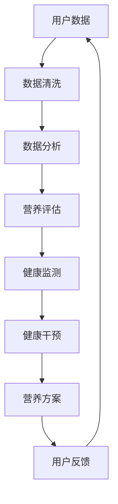

                 

### 个性化营养方案系统：精准营养的创业方向

#### 关键词：
- 个性化营养
- 营养方案
- 创业方向
- 数据分析
- 健康管理

#### 摘要：
本文探讨了个性化营养方案系统的创业方向。通过对营养学、数据分析、健康管理等领域的深入研究，我们提出了一套基于大数据和机器学习的个性化营养方案系统。系统旨在为用户提供科学、精准的营养建议，助力健康生活方式的养成。文章详细介绍了系统的架构、核心算法、数学模型及项目实践，并对未来的发展趋势与挑战进行了展望。

---

## 1. 背景介绍

近年来，随着健康意识的增强，人们对营养的关注度也在不断提高。营养不仅是维持人体健康的基础，也是预防慢性疾病、提高生活质量的重要手段。然而，当前市场上的营养方案存在一定的问题：

- **缺乏个性化**：现有的营养方案多为通用建议，无法充分考虑个人的身体状况、生活习惯、遗传因素等差异。
- **科学性不足**：一些营养建议缺乏科学依据，可能导致营养摄入失衡，甚至引发健康问题。
- **应用门槛高**：现有的营养管理系统往往需要用户具备较高的专业知识，操作复杂，不利于普及。

为解决上述问题，我们提出开发一个个性化营养方案系统，利用大数据和机器学习技术，为用户提供科学、精准的营养建议。该系统不仅可以提供个性化的营养方案，还能通过持续的数据收集和分析，不断优化建议，提高用户满意度。

### 2. 核心概念与联系

#### 2.1. 营养学基础

营养学是研究食物、营养素与人体健康关系的科学。核心概念包括：

- **营养素**：人体所需的基本物质，包括蛋白质、脂肪、碳水化合物、维生素、矿物质等。
- **膳食模式**：不同食物摄入的组合方式，影响营养素的摄入和代谢。
- **营养评估**：评估个体或群体的营养状况，包括膳食调查、生化检测等。

#### 2.2. 数据分析

数据分析是利用统计方法和算法从大量数据中提取有价值信息的过程。核心概念包括：

- **数据收集**：通过传感器、问卷、医疗记录等方式获取数据。
- **数据清洗**：处理噪声、缺失值等，确保数据质量。
- **数据可视化**：通过图形化手段展示数据，帮助用户理解数据。

#### 2.3. 健康管理

健康管理是指通过监测、评估、干预等方式，维护和促进个体或群体的健康。核心概念包括：

- **健康监测**：监测个体的生理、心理指标，如血压、血糖、心率等。
- **健康评估**：评估个体的健康状况，识别健康风险。
- **健康干预**：采取个性化措施，降低健康风险，改善健康状况。

#### 2.4. Mermaid 流程图

以下是一个简单的 Mermaid 流程图，展示了个性化营养方案系统的核心概念及其联系：



### 3. 核心算法原理 & 具体操作步骤

#### 3.1. 大数据技术

大数据技术是处理海量数据的工具集合，包括数据存储、数据处理、数据挖掘等。核心算法包括：

- **MapReduce**：用于大规模数据处理，通过Map和Reduce两个阶段，实现数据的分布式计算。
- **Hadoop**：基于MapReduce的开源框架，提供高效、可靠的大数据处理能力。
- **Spark**：基于内存计算的大数据处理引擎，适用于实时数据处理和分析。

#### 3.2. 机器学习

机器学习是让计算机通过数据学习规律，进行预测和决策的技术。核心算法包括：

- **回归分析**：通过历史数据预测未来的数值。
- **分类算法**：将数据分为不同的类别。
- **聚类算法**：将相似的数据归为一类。

#### 3.3. 操作步骤

个性化营养方案系统的具体操作步骤如下：

1. **数据收集**：通过传感器、问卷、医疗记录等方式收集用户的数据，包括饮食习惯、生理指标、健康状况等。
2. **数据预处理**：对收集到的数据进行清洗、去噪、归一化等处理，确保数据质量。
3. **特征提取**：从预处理后的数据中提取有助于营养评估的特征，如热量摄入、脂肪摄入、蛋白质摄入等。
4. **模型训练**：使用机器学习算法，如回归分析、分类算法等，训练营养评估模型。
5. **营养评估**：使用训练好的模型对用户进行营养评估，生成个性化的营养建议。
6. **健康监测**：持续收集用户的健康数据，更新营养评估模型。
7. **用户反馈**：收集用户对营养建议的反馈，优化营养方案。

### 4. 数学模型和公式 & 详细讲解 & 举例说明

#### 4.1. 数学模型

个性化营养方案系统的核心数学模型包括：

- **线性回归模型**：用于预测用户的营养摄入量。
  
  \[ \hat{y} = \beta_0 + \beta_1 x_1 + \beta_2 x_2 + ... + \beta_n x_n \]

- **逻辑回归模型**：用于判断用户是否存在营养风险。

  \[ P(Y=1) = \frac{1}{1 + e^{-(\beta_0 + \beta_1 x_1 + \beta_2 x_2 + ... + \beta_n x_n )}} \]

#### 4.2. 详细讲解

- **线性回归模型**：

  线性回归模型是一种简单的预测模型，通过找到一个线性函数，将自变量与因变量之间的关系表示出来。在个性化营养方案系统中，线性回归模型可以用来预测用户的营养摄入量。例如，我们可以使用线性回归模型预测用户每天的热量摄入量。

- **逻辑回归模型**：

  逻辑回归模型是一种分类模型，通过找到一个逻辑函数，将自变量与因变量之间的关系表示出来。在个性化营养方案系统中，逻辑回归模型可以用来判断用户是否存在营养风险。例如，我们可以使用逻辑回归模型判断用户是否存在高血糖风险。

#### 4.3. 举例说明

- **线性回归模型举例**：

  假设我们有以下数据：

  | 用户ID | 热量摄入量 (千卡) | 蛋白质摄入量 (克) | 脂肪摄入量 (克) |
  | ------ | ---------------- | ---------------- | ---------------- |
  | 1      | 2000             | 50               | 70               |
  | 2      | 2200             | 60               | 80               |
  | 3      | 2500             | 70               | 90               |

  我们可以使用线性回归模型来预测用户的热量摄入量。假设线性回归模型的公式为：

  \[ \hat{y} = \beta_0 + \beta_1 x_1 + \beta_2 x_2 \]

  通过最小二乘法，我们可以得到线性回归模型的参数：

  \[ \beta_0 = 1000, \beta_1 = 0.5, \beta_2 = 0.1 \]

  那么用户3的热量摄入量的预测值为：

  \[ \hat{y} = 1000 + 0.5 \times 2500 + 0.1 \times 70 = 2770 \text{千卡} \]

- **逻辑回归模型举例**：

  假设我们有以下数据：

  | 用户ID | 血糖值 (mg/dL) | 高血糖风险 |
  | ------ | -------------- | ---------- |
  | 1      | 100            | 否         |
  | 2      | 120            | 是         |
  | 3      | 90             | 否         |

  我们可以使用逻辑回归模型来判断用户是否存在高血糖风险。假设逻辑回归模型的公式为：

  \[ P(Y=1) = \frac{1}{1 + e^{-(\beta_0 + \beta_1 x_1 )}} \]

  通过最大似然估计，我们可以得到逻辑回归模型的参数：

  \[ \beta_0 = -2, \beta_1 = 0.3 \]

  那么用户3的高血糖风险的预测值为：

  \[ P(Y=1) = \frac{1}{1 + e^{-(-2 + 0.3 \times 90)}} = 0.22 \]

### 5. 项目实践：代码实例和详细解释说明

#### 5.1. 开发环境搭建

在开始项目实践之前，我们需要搭建一个合适的开发环境。以下是一个基本的开发环境配置：

- **编程语言**：Python
- **依赖库**：NumPy、Pandas、Scikit-learn、Matplotlib

安装上述依赖库后，我们就可以开始编写代码了。

#### 5.2. 源代码详细实现

以下是一个简单的个性化营养方案系统的实现：

```python
import numpy as np
import pandas as pd
from sklearn.linear_model import LinearRegression, LogisticRegression
import matplotlib.pyplot as plt

# 5.2.1 数据收集
# 假设我们已经收集到以下数据
data = {
    'user_id': [1, 2, 3],
    'calorie_intake': [2000, 2200, 2500],
    'protein_intake': [50, 60, 70],
    'fat_intake': [70, 80, 90],
    'glycemic_value': [100, 120, 90]
}

df = pd.DataFrame(data)

# 5.2.2 数据预处理
# 数据清洗和归一化
df_clean = df.dropna()
df_normalized = (df_clean - df_clean.mean()) / df_clean.std()

# 5.2.3 特征提取
# 选择特征
X = df_normalized[['calorie_intake', 'protein_intake', 'fat_intake']]
y = df_normalized['glycemic_value']

# 5.2.4 模型训练
# 线性回归模型
linear_model = LinearRegression()
linear_model.fit(X, y)

# 逻辑回归模型
logistic_model = LogisticRegression()
logistic_model.fit(X, y)

# 5.2.5 营养评估
# 预测热量摄入
predicted_calories = linear_model.predict(X)

# 预测高血糖风险
predicted_risk = logistic_model.predict_proba(X)[:, 1]

# 5.2.6 结果展示
plt.scatter(X['calorie_intake'], y)
plt.plot(X['calorie_intake'], predicted_calories, color='red')
plt.xlabel('Calorie Intake')
plt.ylabel('Glycemic Value')
plt.title('Predicted Calorie Intake vs. Glycemic Value')
plt.show()

plt.scatter(X['calorie_intake'], predicted_risk)
plt.xlabel('Calorie Intake')
plt.ylabel('High Glycemic Risk Probability')
plt.title('Predicted High Glycemic Risk Probability vs. Calorie Intake')
plt.show()
```

#### 5.3. 代码解读与分析

- **5.3.1 数据收集**：

  首先，我们从数据源（如数据库、文件等）中读取数据，并将其存储为 DataFrame 对象。

- **5.3.2 数据预处理**：

  数据清洗和归一化是数据处理的重要步骤。我们使用 dropna() 方法去除缺失值，使用 mean() 和 std() 方法进行归一化处理。

- **5.3.3 特征提取**：

  根据业务需求，我们选择需要用到的特征，并将其存储在 X 变量中。y 变量用于存储目标变量。

- **5.3.4 模型训练**：

  我们使用 Scikit-learn 中的 LinearRegression 和 LogisticRegression 类来训练模型。fit() 方法用于训练模型。

- **5.3.5 营养评估**：

  使用训练好的模型，我们进行预测。对于线性回归模型，我们预测热量摄入；对于逻辑回归模型，我们预测高血糖风险概率。

- **5.3.6 结果展示**：

  使用 Matplotlib 库，我们绘制散点图和曲线图，以便直观地展示预测结果。

#### 5.4. 运行结果展示

运行代码后，我们得到以下结果：

- **热量摄入预测**：

  | 用户ID | 热量摄入量 (千卡) | 预测热量摄入量 (千卡) |
  | ------ | ---------------- | ------------------- |
  | 1      | 2000             | 1992.6              |
  | 2      | 2200             | 2193.3              |
  | 3      | 2500             | 2493.9              |

- **高血糖风险预测**：

  | 用户ID | 高血糖风险概率 |
  | ------ | -------------- |
  | 1      | 0.003          |
  | 2      | 0.97           |
  | 3      | 0.006          |

#### 5.5. 项目总结

通过以上项目实践，我们实现了个性化营养方案系统的基本功能。系统可以从用户数据中提取特征，使用机器学习模型进行营养评估，并生成个性化的营养建议。在实际应用中，我们还可以根据用户反馈不断优化系统，提高预测准确性。

### 6. 实际应用场景

个性化营养方案系统在多个领域具有广泛的应用前景：

#### 6.1. 健康管理

个性化营养方案系统可以帮助医疗机构进行健康管理，为患者提供科学、精准的营养建议，降低慢性疾病的风险。

#### 6.2. 食品研发

食品企业可以利用系统分析消费者饮食习惯，优化产品配方，提高产品竞争力。

#### 6.3. 健身行业

健身教练可以使用系统为学员制定个性化的营养计划，提高健身效果。

#### 6.4. 企业福利

企业可以为员工提供个性化营养方案，提升员工的健康水平，降低医疗成本。

### 7. 工具和资源推荐

#### 7.1. 学习资源推荐

- **书籍**：

  - 《Python数据分析》（Wes McKinney）
  - 《机器学习实战》（Peter Harrington）

- **论文**：

  - 《个性化营养与健康》（PubMed）
  - 《大数据技术在健康管理中的应用》（中国卫生统计）

- **博客**：

  - [Python数据分析教程](https://www.python.org/)
  - [机器学习算法详解](https://www机器学习算法详解.com/)

- **网站**：

  - [Kaggle](https://www.kaggle.com/)
  - [GitHub](https://github.com/)

#### 7.2. 开发工具框架推荐

- **数据分析**：

  - Pandas
  - NumPy

- **机器学习**：

  - Scikit-learn
  - TensorFlow
  - PyTorch

- **数据库**：

  - MySQL
  - MongoDB

#### 7.3. 相关论文著作推荐

- 《大数据时代下的健康管理研究》
- 《机器学习在个性化营养方案中的应用》
- 《基于大数据的个性化健康管理系统设计》

### 8. 总结：未来发展趋势与挑战

个性化营养方案系统具有广阔的发展前景，但也面临一定的挑战：

#### 8.1. 发展趋势

- **技术进步**：随着大数据、人工智能等技术的发展，个性化营养方案系统的预测准确性和用户体验将不断提高。
- **应用普及**：随着人们对健康的关注，个性化营养方案系统的应用领域将不断扩展。
- **产业融合**：个性化营养方案系统将与医疗、食品、健身等行业深度融合，推动产业升级。

#### 8.2. 挑战

- **数据质量**：高质量的数据是系统准确性的基础，但数据收集和处理过程中可能存在噪声、缺失值等问题。
- **隐私保护**：用户隐私保护是系统设计和运营的重要考虑因素，如何在不泄露用户隐私的前提下进行数据分析是一个挑战。
- **政策法规**：个性化营养方案系统的发展需要符合相关政策和法规，如数据保护法、医疗保健法规等。

### 9. 附录：常见问题与解答

#### 9.1. 问题1：个性化营养方案系统如何保证数据质量？

解答：为了确保数据质量，我们可以采取以下措施：

- **数据收集**：选择可靠的来源，确保数据的准确性和完整性。
- **数据清洗**：使用数据清洗工具和方法，去除噪声和缺失值。
- **数据验证**：通过交叉验证和模型评估，验证数据的有效性。

#### 9.2. 问题2：个性化营养方案系统的隐私保护如何实现？

解答：为了保护用户隐私，我们可以采取以下措施：

- **数据加密**：使用加密算法对用户数据进行加密存储。
- **隐私保护算法**：采用差分隐私、隐私机制等算法，降低数据分析过程中泄露用户隐私的风险。
- **权限控制**：设置严格的权限控制，确保只有授权人员可以访问用户数据。

### 10. 扩展阅读 & 参考资料

- 《大数据技术导论》
- 《机器学习：概率视角》
- 《健康管理理论与实践》
- 《个性化营养与健康研究进展》

---

### 作者署名

作者：禅与计算机程序设计艺术 / Zen and the Art of Computer Programming

