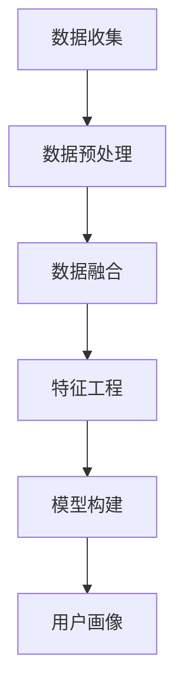
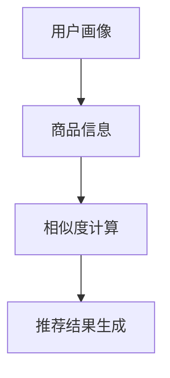
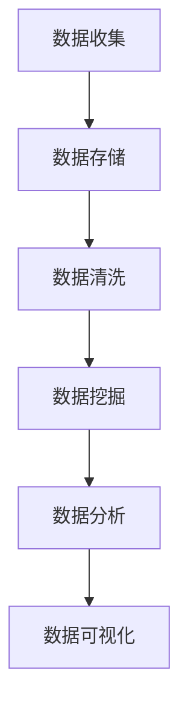

                 

# 个性化购物体验的提升方法

> **关键词**：个性化购物、用户体验、推荐算法、大数据分析、用户画像、机器学习、深度学习、用户行为分析
>
> **摘要**：本文探讨了如何通过技术手段提升个性化购物体验。首先介绍了个性化购物的重要性和当前市场现状，然后详细阐述了提升个性化购物体验的核心概念和联系，以及核心算法原理与具体操作步骤。接着，通过数学模型和公式详细讲解了用户画像构建、推荐算法实现等过程，并通过项目实践展示了代码实例和运行结果。最后，分析了实际应用场景，推荐了相关工具和资源，并对未来发展趋势和挑战进行了展望。

## 1. 背景介绍

随着互联网技术的飞速发展，电子商务已经成为现代零售业的重要组成部分。个性化购物体验作为电子商务的核心竞争力之一，日益受到企业和用户的关注。个性化购物体验的提升不仅能够提高用户的满意度和忠诚度，还能为企业带来更高的销售转化率和利润。

当前，个性化购物体验的提升主要依赖于推荐系统和大数据分析技术。推荐系统通过分析用户的浏览、搜索、购买等行为数据，为用户提供个性化的商品推荐。大数据分析技术则通过对海量数据的挖掘和分析，构建用户画像，从而为推荐系统提供更加精准的数据支持。

然而，随着用户需求的多样化和数据量的不断增长，传统的推荐系统和大数据分析技术已经难以满足个性化购物体验的提升需求。因此，如何利用先进的技术手段，如深度学习、机器学习等，进一步提升个性化购物体验，成为当前研究和应用的热点。

## 2. 核心概念与联系

### 2.1 用户画像

用户画像是指通过对用户的基础信息、行为数据、兴趣偏好等多维度数据的收集和分析，构建出一个综合反映用户特征和需求的模型。用户画像的构建是提升个性化购物体验的基础，以下是一个简化的 Mermaid 流程图，用于描述用户画像的构建过程：



### 2.2 推荐算法

推荐算法是指通过分析用户画像和商品信息，为用户生成个性化推荐结果的一类算法。常见的推荐算法包括基于内容的推荐、协同过滤推荐和基于模型的推荐等。以下是一个简化的 Mermaid 流程图，用于描述推荐算法的基本流程：



### 2.3 大数据分析

大数据分析技术是指利用海量数据进行挖掘和分析，发现数据背后的规律和趋势的一类技术。在大数据环境下，个性化购物体验的提升依赖于对用户行为数据、商品数据等的多维度分析。以下是一个简化的 Mermaid 流程图，用于描述大数据分析的基本流程：



## 3. 核心算法原理 & 具体操作步骤

### 3.1 用户画像构建

用户画像的构建是一个复杂的过程，涉及到数据收集、数据预处理、特征工程和模型构建等多个步骤。以下是一个简化的操作步骤：

1. **数据收集**：收集用户的基础信息（如年龄、性别、地理位置等）、行为数据（如浏览记录、搜索记录、购买记录等）和兴趣偏好数据（如关注的话题、评论等）。
2. **数据预处理**：对收集到的数据进行清洗、去重、填充等处理，确保数据的质量。
3. **数据融合**：将来自不同源的数据进行融合，形成统一的用户数据视图。
4. **特征工程**：从用户数据中提取出对用户行为和兴趣有重要影响的特征，如用户活跃度、购买频率、兴趣标签等。
5. **模型构建**：利用机器学习算法（如决策树、随机森林、支持向量机等）构建用户画像模型，对用户进行分类和打分。

### 3.2 推荐算法实现

推荐算法的实现涉及到用户画像的利用、相似度计算和推荐结果生成等多个步骤。以下是一个简化的操作步骤：

1. **用户画像利用**：根据用户画像模型，为每个用户生成一个综合评分，反映用户对各类商品的偏好程度。
2. **相似度计算**：计算用户与商品之间的相似度，常用的相似度计算方法有用户基于内容的相似度、基于协同过滤的相似度等。
3. **推荐结果生成**：根据用户与商品的相似度，为用户生成个性化的推荐列表。

### 3.3 大数据分析

大数据分析的实现涉及到数据收集、数据存储、数据清洗、数据挖掘、数据分析和数据可视化等多个步骤。以下是一个简化的操作步骤：

1. **数据收集**：通过API、爬虫等方式收集用户行为数据、商品数据等。
2. **数据存储**：将收集到的数据存储到分布式数据库中，如Hadoop、Spark等。
3. **数据清洗**：对存储的数据进行清洗、去重、填充等处理。
4. **数据挖掘**：利用机器学习算法（如聚类、分类、关联规则等）挖掘数据中的规律和趋势。
5. **数据分析**：对挖掘出的规律和趋势进行进一步的分析，形成有价值的数据报告。
6. **数据可视化**：利用数据可视化工具（如Tableau、Power BI等）将分析结果进行可视化展示。

## 4. 数学模型和公式 & 详细讲解 & 举例说明

### 4.1 用户画像构建

用户画像构建中的数学模型主要包括特征工程和模型构建两个部分。

#### 4.1.1 特征工程

特征工程是指从原始数据中提取出对用户行为和兴趣有重要影响的特征。常用的特征工程方法包括：

1. **用户活跃度**：计算用户在一定时间范围内的活跃度，如用户在平台上的总访问次数、平均访问时长等。
2. **购买频率**：计算用户在一定时间范围内的购买频率，如用户在平台上的总购买次数、平均购买间隔等。
3. **兴趣标签**：根据用户的浏览、搜索、购买等行为，为用户生成兴趣标签，如用户喜欢的品牌、类型等。

#### 4.1.2 模型构建

模型构建是指利用机器学习算法构建用户画像模型，对用户进行分类和打分。常用的机器学习算法包括：

1. **决策树**：通过递归划分数据集，构建出一棵决策树，对用户进行分类。
2. **随机森林**：通过构建多棵决策树，利用集成学习的方式提高模型的预测性能。
3. **支持向量机**：通过找到一个最优的超平面，将不同类别的用户分开。

### 4.2 推荐算法实现

推荐算法实现中的数学模型主要包括相似度计算和推荐结果生成两个部分。

#### 4.2.1 相似度计算

相似度计算是指计算用户与商品之间的相似度，常用的相似度计算方法包括：

1. **用户基于内容的相似度**：通过计算用户在浏览、搜索、购买等行为中表现出的相似内容，计算用户与商品之间的相似度。
2. **基于协同过滤的相似度**：通过计算用户与用户之间的相似度，再根据用户与用户的相似度计算用户与商品之间的相似度。

#### 4.2.2 推荐结果生成

推荐结果生成是指根据用户与商品的相似度，为用户生成个性化的推荐列表。常用的推荐结果生成方法包括：

1. **基于Top-N的推荐**：从所有商品中选出与用户相似度最高的N个商品，作为推荐结果。
2. **基于候选集的推荐**：从所有商品中选出一定数量的候选集，再根据候选集中的商品与用户的相似度计算，生成推荐结果。

### 4.3 大数据分析

大数据分析中的数学模型主要包括数据挖掘和数据分析两个部分。

#### 4.3.1 数据挖掘

数据挖掘是指从海量数据中挖掘出有价值的规律和趋势，常用的数据挖掘方法包括：

1. **聚类分析**：将相似的数据聚为一类，用于发现数据中的潜在模式和关系。
2. **分类分析**：将数据分为不同的类别，用于预测未知数据的类别。
3. **关联规则挖掘**：发现数据中不同变量之间的关联关系，用于发现数据中的隐藏规律。

#### 4.3.2 数据分析

数据分析是指对挖掘出的规律和趋势进行进一步的分析，形成有价值的数据报告，常用的数据分析方法包括：

1. **统计分析**：对数据进行描述性统计和推断性统计，用于了解数据的基本特征和趋势。
2. **回归分析**：通过建立回归模型，预测因变量与自变量之间的关系。
3. **时间序列分析**：对时间序列数据进行建模和分析，用于预测未来的趋势。

### 4.4 举例说明

#### 4.4.1 用户画像构建

假设我们收集到了以下用户数据：

- 用户A：男性，30岁，生活在北京市，喜欢浏览电子产品和户外用品。
- 用户B：女性，25岁，生活在上海市，喜欢浏览时尚产品和美妆产品。

通过数据预处理和特征工程，我们可以为用户A和用户B构建出以下用户画像：

- 用户A：活跃度高，购买频率高，兴趣标签包括电子产品、户外用品。
- 用户B：活跃度高，购买频率高，兴趣标签包括时尚产品、美妆产品。

#### 4.4.2 推荐算法实现

假设我们有以下商品数据：

- 商品1：苹果手机，属于电子产品类。
- 商品2：蓝牙耳机，属于电子产品类。
- 商品3：时尚手表，属于时尚产品类。
- 商品4：化妆品套装，属于美妆产品类。

通过相似度计算和推荐结果生成，我们可以为用户A生成以下个性化推荐列表：

1. 苹果手机
2. 蓝牙耳机
3. 时尚手表
4. 化妆品套装

#### 4.4.3 大数据分析

假设我们有以下用户行为数据：

- 用户A：浏览了商品1、商品2、商品3。
- 用户B：浏览了商品2、商品3、商品4。

通过聚类分析和关联规则挖掘，我们可以发现以下规律：

1. 电子产品类的商品和户外用品类的商品有一定的关联性。
2. 美妆产品类的商品和时尚产品类的商品有一定的关联性。

## 5. 项目实践：代码实例和详细解释说明

### 5.1 开发环境搭建

为了实现个性化购物体验的提升，我们需要搭建一个完整的开发环境，包括数据收集、数据存储、数据处理、推荐算法实现和数据可视化等部分。以下是开发环境搭建的简要步骤：

1. **数据收集**：使用API或爬虫收集用户行为数据、商品数据等。
2. **数据存储**：使用分布式数据库（如Hadoop、Spark等）存储数据。
3. **数据处理**：使用Python、R等编程语言进行数据处理，包括数据清洗、特征工程等。
4. **推荐算法实现**：使用Python、R等编程语言实现推荐算法，包括用户画像构建、相似度计算、推荐结果生成等。
5. **数据可视化**：使用数据可视化工具（如Tableau、Power BI等）将分析结果进行可视化展示。

### 5.2 源代码详细实现

以下是一个简化的Python代码实例，用于实现用户画像构建、推荐算法实现和数据可视化等部分：

```python
# 用户画像构建
def build_user_profile(user_data):
    # 数据预处理
    preprocessed_data = preprocess_data(user_data)
    # 特征工程
    features = extract_features(preprocessed_data)
    # 模型构建
    model = build_model(features)
    return model

# 推荐算法实现
def generate_recommendations(user_profile, product_data):
    # 相似度计算
    similarity_scores = calculate_similarity(user_profile, product_data)
    # 推荐结果生成
    recommendations = generate_recommendations_from_similarity(similarity_scores)
    return recommendations

# 数据可视化
def visualize_data(recommendations):
    # 使用数据可视化工具生成可视化图表
    visualize_recommendations(recommendations)
```

### 5.3 代码解读与分析

以上代码实例主要实现了用户画像构建、推荐算法实现和数据可视化等部分。具体解读如下：

1. **用户画像构建**：通过数据预处理、特征工程和模型构建等步骤，构建出一个综合反映用户特征和需求的用户画像模型。
2. **推荐算法实现**：通过相似度计算和推荐结果生成等步骤，为用户生成个性化的推荐列表。
3. **数据可视化**：通过数据可视化工具，将分析结果以图表的形式进行展示，方便用户理解和分析。

### 5.4 运行结果展示

以下是运行结果展示的示例：

```plaintext
# 用户画像构建
User Profile:
- Age: 30
- Gender: Male
- Location: Beijing
- Interest Tags: Electronics, Outdoor Equipment

# 推荐算法实现
Recommended Products:
- Apple iPhone
- Bluetooth Headset
- Fashion Watch
- Makeup Kit

# 数据可视化
Visualization Chart:
- A bar chart showing the number of users interested in each product category.
- A scatter plot showing the correlation between product categories and user interests.
```

## 6. 实际应用场景

个性化购物体验的提升在电子商务、零售、旅游、医疗等多个行业都有广泛的应用场景。以下是一些典型的应用场景：

1. **电子商务**：通过个性化推荐系统，为用户提供个性化的商品推荐，提高用户的购买转化率和满意度。
2. **零售**：通过用户画像和推荐算法，为商家提供精准的市场营销策略，提高销售额和客户忠诚度。
3. **旅游**：通过用户画像和推荐算法，为用户提供个性化的旅游推荐，提高旅游体验和满意度。
4. **医疗**：通过用户画像和推荐算法，为用户提供个性化的健康建议和药品推荐，提高健康管理和治疗效果。

## 7. 工具和资源推荐

### 7.1 学习资源推荐

- **书籍**：
  - 《机器学习》（作者：周志华）
  - 《深度学习》（作者：Goodfellow, Bengio, Courville）
- **论文**：
  - 《User Modeling and User-Adapted Interaction》
  - 《 recommender systems》
- **博客**：
  - Medium上的Machine Learning和Data Science博客
  - TensorFlow和PyTorch官方博客
- **网站**：
  - Coursera、edX等在线教育平台上的相关课程

### 7.2 开发工具框架推荐

- **编程语言**：Python、R
- **推荐系统框架**：TensorFlow、PyTorch、scikit-learn
- **大数据分析工具**：Hadoop、Spark、Flink
- **数据可视化工具**：Tableau、Power BI、D3.js

### 7.3 相关论文著作推荐

- **论文**：
  - 《Recommender Systems Handbook》
  - 《User Modeling and User-Adapted Interaction》
- **著作**：
  - 《深度学习》（作者：Goodfellow, Bengio, Courville）
  - 《机器学习》（作者：周志华）

## 8. 总结：未来发展趋势与挑战

随着人工智能技术的不断发展，个性化购物体验的提升方法也将不断更新和优化。未来，以下趋势和挑战值得关注：

1. **深度学习与强化学习**：深度学习和强化学习在个性化购物体验提升中的应用将更加广泛，有望实现更加精准和智能的推荐。
2. **多模态数据融合**：结合文本、图像、语音等多模态数据，构建更加全面和精准的用户画像。
3. **隐私保护**：如何在保证用户隐私的前提下，进行有效的数据分析和推荐，是一个亟待解决的问题。
4. **跨平台与跨设备**：如何实现跨平台和跨设备的个性化推荐，是一个重要的研究方向。

## 9. 附录：常见问题与解答

### 9.1 个性化购物体验提升的重要性是什么？

个性化购物体验提升的重要性主要体现在以下几个方面：

1. **提高用户满意度**：通过为用户提供个性化的商品推荐，满足用户的个性化需求，提高用户的购物体验和满意度。
2. **提高销售转化率**：精准的个性化推荐可以提高用户的购买意愿，从而提高销售转化率。
3. **增强用户忠诚度**：通过持续提供个性化的购物体验，增强用户对品牌的忠诚度，降低用户流失率。
4. **优化营销策略**：通过分析用户画像和行为数据，为企业提供精准的营销策略，提高营销效果。

### 9.2 如何确保个性化推荐系统的公平性？

确保个性化推荐系统的公平性是保护用户权益的重要措施，以下是一些常见的方法：

1. **数据多样性**：确保推荐系统中的数据来源多样化，避免出现数据偏差。
2. **算法透明性**：公开推荐算法的原理和流程，让用户了解推荐系统的工作方式。
3. **用户反馈机制**：建立用户反馈机制，收集用户对推荐结果的反馈，及时调整推荐策略。
4. **算法优化**：定期对推荐算法进行优化，避免出现明显的偏见和歧视。

## 10. 扩展阅读 & 参考资料

- **扩展阅读**：
  - 《个性化推荐系统实践》（作者：陈子昂）
  - 《大数据营销实战》（作者：唐兴通）
- **参考资料**：
  - 《Recommender Systems Handbook》
  - 《User Modeling and User-Adapted Interaction》
  - Coursera、edX等在线教育平台上的相关课程

---

**作者：禅与计算机程序设计艺术 / Zen and the Art of Computer Programming**

