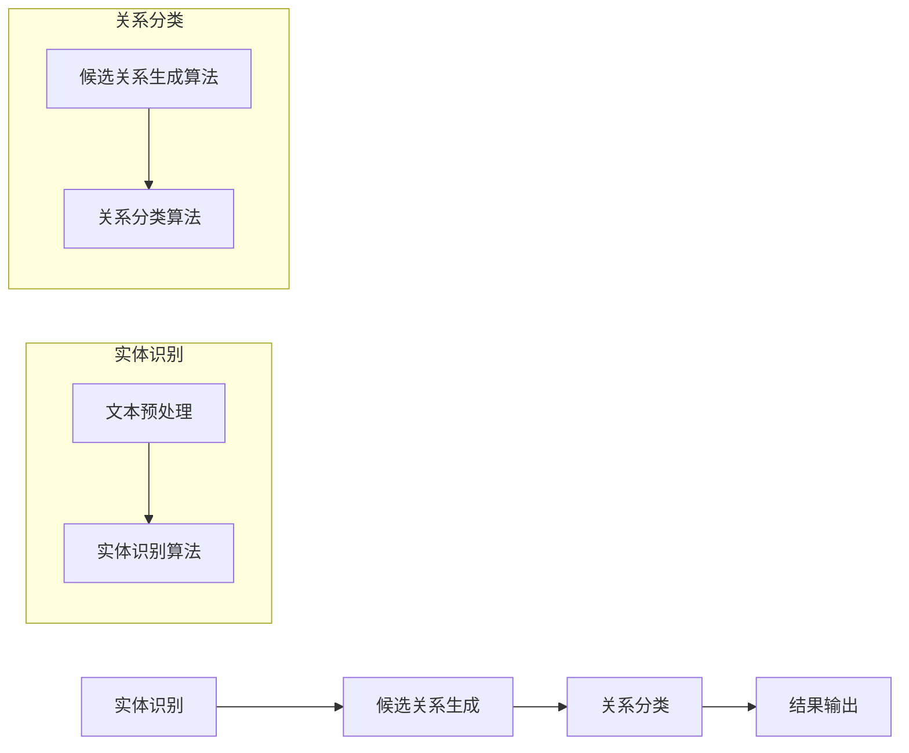

                 

### 背景介绍

#### 医学文本的重要性

医学文本是医疗行业中最常见的文本形式之一，涵盖了医生笔记、病历记录、诊断报告、医学论文等多种类型。随着医疗信息化的推进，医学文本数据量呈指数级增长，如何高效地处理和利用这些数据成为了研究的热点问题。医学文本中的关系抽取是自然语言处理（NLP）领域中的一项基础任务，其重要性主要体现在以下几个方面：

1. **提升医疗信息检索效率**：通过关系抽取，可以将医学文本中的关键信息进行结构化处理，从而提高医疗信息检索的准确性和效率。
2. **辅助临床决策支持**：关系抽取有助于分析医学文本中的各种关系，为临床医生提供辅助决策支持，提高医疗质量。
3. **促进医学知识图谱构建**：医学知识图谱是连接医学知识和医疗实践的重要工具，而关系抽取是构建医学知识图谱的关键步骤。

#### 关系抽取的定义和挑战

关系抽取（Relation Extraction）是指从文本中识别出实体间的关系，并抽取出来。具体来说，就是给定一个文本集合，通过算法将其中的实体和它们之间的关系识别并提取出来。关系抽取可以进一步分为实体识别（Entity Recognition）和关系分类（Relation Classification）两个子任务。

关系抽取在医学文本中的挑战主要包括：

1. **实体种类繁多**：医学领域包含丰富的专业术语和医学术语，实体种类繁多，这对实体识别和关系分类提出了很高的要求。
2. **关系复杂性**：医学文本中的关系复杂，不仅包括直接的因果关系，还可能涉及间接的、多层次的关联。
3. **数据稀疏和标注困难**：医学文本数据量庞大，但高质量的关系标注数据却相对稀缺，数据标注过程繁琐且成本高昂。
4. **跨语言问题**：医学文本涉及多种语言，不同语言之间的语义和表达方式差异较大，这对关系抽取算法的通用性提出了挑战。

#### 关系抽取在医学文本中的应用

关系抽取技术在医学文本处理中有着广泛的应用，主要包括以下几个方面：

1. **医学知识图谱构建**：通过关系抽取构建医学知识图谱，可以帮助医生更好地理解疾病的发病机制、诊断方法以及治疗方案，为医疗决策提供支持。
2. **疾病预测和诊断**：利用关系抽取技术，可以从大规模医学文本数据中提取出与疾病相关的信息，结合机器学习算法进行疾病预测和诊断。
3. **药物研究**：医学文本中包含了大量的药物信息，通过关系抽取技术，可以识别出药物与疾病、药物与药物之间的相互作用关系，为药物研究提供重要线索。
4. **医疗文本挖掘**：通过关系抽取技术，可以对医疗文本进行深入挖掘，提取出有价值的信息，如疾病进展、治疗效果等，为医学研究和临床实践提供参考。

#### 当前关系抽取技术的研究进展

随着深度学习技术的发展，关系抽取技术取得了显著进展。主要研究方法包括基于传统机器学习的方法、基于深度学习的方法以及结合两者优势的混合方法。

1. **传统机器学习方法**：基于规则的方法和统计模型（如条件随机场、支持向量机等）在关系抽取领域有着广泛应用，但面对复杂医学文本时，效果有限。
2. **深度学习方法**：基于卷积神经网络（CNN）、循环神经网络（RNN）和Transformer等深度学习模型的关系抽取方法在处理大规模、复杂医学文本数据方面表现出较高的性能。
3. **混合方法**：结合传统机器学习方法和深度学习方法的混合模型，在关系抽取任务中取得了一定成效。例如，通过使用注意力机制和图神经网络等技巧，可以进一步提高关系抽取的准确性和鲁棒性。

总之，关系抽取技术在医学文本处理中的应用具有重要意义，随着技术的不断发展，有望在未来进一步提升医学文本处理的能力，为医疗健康领域带来更多创新和突破。接下来，我们将深入探讨关系抽取的核心概念、算法原理及其在医学文本中的应用。

---

### 核心概念与联系

#### 关系抽取的基本概念

关系抽取（Relation Extraction）是自然语言处理（NLP）领域的一项基本任务，其主要目标是从非结构化的文本中识别并提取出实体之间的关系。在医学文本处理中，关系抽取尤为重要，因为医学文本中的关系信息对于疾病的诊断、治疗和科研都具有极高的价值。以下是关系抽取的一些基本概念：

1. **实体（Entity）**：实体是指文本中的一个具有独立意义的个体，如人名、药物名称、疾病名称等。实体是关系抽取的基础，是识别和分类的出发点。
2. **关系（Relation）**：关系是实体之间的关联或互动。例如，“患者患有疾病A”中的关系是“患有”，实体是“患者”和“疾病A”。
3. **边界（Boundary）**：边界是指实体在文本中的起始和结束位置。正确识别实体的边界对于关系抽取至关重要。
4. **实体类型（Entity Type）**：实体类型是对实体类别的划分，如“医生”、“药物”、“症状”等。
5. **关系类型（Relation Type）**：关系类型是对关系类别的划分，如“诊断”、“治疗”、“副作用”等。

#### 关系抽取的流程

关系抽取通常包括以下几个步骤：

1. **实体识别**：首先从文本中识别出所有实体，并标注出其实体类型和边界。
2. **候选关系生成**：对于文本中的每一对实体，根据预定义的关系类型生成候选关系。
3. **关系分类**：对于每个候选关系，使用分类算法判断其实际关系类型，从而确定实体间的关系。
4. **结果输出**：将识别出的关系输出为结构化数据，如知识图谱或关系数据库。

#### 关系抽取在医学文本中的应用场景

在医学文本处理中，关系抽取的应用场景主要包括以下几个方面：

1. **疾病诊断与治疗**：通过关系抽取可以从医学文本中提取出诊断结果、治疗方案等信息，帮助医生进行临床决策。
2. **药物研发**：关系抽取可以帮助研究人员从医学文本中提取出药物与疾病、药物与药物之间的相互作用关系，为药物研发提供重要线索。
3. **医学知识图谱构建**：关系抽取是构建医学知识图谱的重要步骤，通过关系抽取可以将医学文本中的关系信息结构化，为医学研究和实践提供支持。

#### Mermaid 流程图

以下是一个简化的关系抽取流程的Mermaid流程图，展示了关系抽取的主要步骤和它们之间的联系：



**实体识别**过程包括文本预处理和实体识别算法，主要目的是从文本中识别出实体，并标注其实体类型和边界。**候选关系生成**过程则是对每对实体生成候选关系，通常基于预定义的关系类型。**关系分类**过程使用分类算法判断每个候选关系的实际类型，最终将识别出的关系输出为结构化数据。

通过上述流程，我们可以看到关系抽取是一个多层次、多步骤的过程，每个步骤都需要精确的处理和优化，以确保最终输出的关系信息准确和可靠。接下来，我们将进一步探讨关系抽取的核心算法原理及其具体实现。

### 核心算法原理 & 具体操作步骤

关系抽取技术的核心在于从大量的医学文本中准确地识别并提取实体间的关系。随着深度学习技术的快速发展，基于深度学习的方法在关系抽取任务中表现出了显著的优势。本文将详细介绍几种主流的深度学习模型及其在医学文本关系抽取中的应用，包括基于卷积神经网络（CNN）的方法、基于循环神经网络（RNN）的方法以及Transformer模型。

#### 基于卷积神经网络（CNN）的方法

卷积神经网络（CNN）在图像处理领域取得了巨大成功，其通过局部感知和共享权重的机制，可以有效地捕捉文本中的局部特征。CNN在关系抽取中的应用主要是通过文本的局部特征来识别实体和关系。

**具体步骤**：

1. **文本表示**：首先，使用词袋模型或词嵌入（word embedding）技术将文本表示为向量。词嵌入技术可以捕捉词的语义信息，如Word2Vec、GloVe等。
2. **特征提取**：使用卷积核对文本向量进行卷积操作，提取局部特征。卷积神经网络通过共享权重的机制，可以自动学习文本中的模式。
3. **分类器**：通过全连接层和激活函数（如softmax）对提取的特征进行分类，判断实体间的关系。

**优势**：

- **强大的特征提取能力**：CNN可以有效地捕捉文本中的局部特征，有助于提高关系抽取的准确性。
- **并行计算**：卷积神经网络支持并行计算，可以加速模型训练和推理过程。

**局限性**：

- **长距离依赖问题**：CNN在处理长文本时，容易受到局部信息的限制，难以捕捉长距离依赖关系。

#### 基于循环神经网络（RNN）的方法

循环神经网络（RNN）通过其递归结构，可以有效地处理序列数据，包括文本序列。RNN在关系抽取中的应用，主要利用其能够处理长距离依赖的特性。

**具体步骤**：

1. **文本表示**：与CNN类似，使用词嵌入技术将文本表示为向量。
2. **序列处理**：RNN逐个处理文本中的词向量，将其编码为序列表示。RNN中的隐藏状态可以捕获文本中的长期依赖关系。
3. **关系分类**：使用全连接层和激活函数对隐藏状态进行分类，判断实体间的关系。

**优势**：

- **处理长距离依赖**：RNN能够处理长距离依赖，有助于捕捉文本中的复杂关系。
- **动态特征表示**：RNN的隐藏状态可以动态地表示文本特征，有助于提高关系分类的准确性。

**局限性**：

- **梯度消失和梯度爆炸**：RNN在训练过程中容易受到梯度消失和梯度爆炸问题的影响，导致训练过程不稳定。
- **序列长度限制**：RNN的处理速度较慢，难以处理超长文本序列。

#### Transformer模型

Transformer模型是近年来深度学习领域的重要突破，其基于自注意力机制，能够有效地捕捉文本中的全局依赖关系。Transformer模型在关系抽取中的应用，展现了其强大的特征表示能力。

**具体步骤**：

1. **文本表示**：使用词嵌入技术将文本表示为向量。
2. **多头自注意力机制**：Transformer使用多头自注意力机制，对文本序列中的每个词进行加权，从而有效地捕捉全局依赖关系。
3. **前馈神经网络**：通过多头自注意力机制后的向量，使用前馈神经网络进行进一步处理，输出实体间的关系。

**优势**：

- **全局依赖处理**：Transformer能够通过自注意力机制捕捉文本中的全局依赖关系，有助于提高关系抽取的准确性。
- **并行计算**：Transformer支持并行计算，可以显著提高训练和推理速度。

**局限性**：

- **计算复杂度**：由于自注意力机制的引入，Transformer的计算复杂度较高，对计算资源有一定要求。
- **模型参数量**：Transformer模型参数量较大，可能导致过拟合。

#### 综合比较

- **CNN**：适合处理固定长度的文本，特征提取能力强，但难以处理长距离依赖。
- **RNN**：能够处理长距离依赖，但在训练过程中容易受到梯度消失和梯度爆炸问题的影响。
- **Transformer**：能够有效处理全局依赖，计算复杂度高，但具有较好的并行计算能力。

在实际应用中，通常会根据具体任务需求选择合适的模型。例如，在处理较短的医学文本时，CNN可能是一个较好的选择；而在处理复杂的医学文本时，Transformer模型可能更能发挥其优势。

总之，深度学习模型在关系抽取任务中展示了强大的能力，通过不同的模型结构和算法优化，可以有效地提高医学文本关系抽取的准确性和鲁棒性。接下来，我们将进一步探讨数学模型和公式在关系抽取中的具体应用。

### 数学模型和公式 & 详细讲解 & 举例说明

关系抽取作为一种复杂的自然语言处理任务，依赖于多种数学模型和算法来实现。本文将详细讨论这些数学模型，包括词嵌入、注意力机制、损失函数等，并通过具体例子来说明它们在关系抽取中的应用。

#### 词嵌入（Word Embedding）

词嵌入是将词汇映射到高维向量空间的过程，其核心思想是相似的词在向量空间中距离相近。常用的词嵌入模型包括Word2Vec、GloVe等。

**1. Word2Vec**

Word2Vec模型是一种基于神经网络的词嵌入方法，主要包括连续词袋（CBOW）和跳字模型（Skip-Gram）两种方法。

- **连续词袋（CBOW）**：给定一个中心词，CBOW模型通过上下文词的均值来表示中心词。数学公式如下：
  $$ \text{vec}(w_{i}) = \frac{1}{C} \sum_{j \in C} \text{vec}(w_{j}) $$
  其中，\( \text{vec}(w_{i}) \) 是中心词的向量表示，\( C \) 是上下文窗口中的词汇集合。

- **跳字模型（Skip-Gram）**：与CBOW相反，跳字模型给定一个中心词，预测上下文词。其数学公式如下：
  $$ P(w_{j}|\text{vec}(w_{i})) = \frac{\exp(\text{vec}(w_{j}) \cdot \text{vec}(w_{i}))}{\sum_{k \in V} \exp(\text{vec}(w_{k}) \cdot \text{vec}(w_{i}))} $$
  其中，\( V \) 是词汇表，\( P(w_{j}|\text{vec}(w_{i})) \) 是在给定中心词向量下，上下文词 \( w_{j} \) 的概率分布。

**2. GloVe**

GloVe（Global Vectors for Word Representation）是一种基于矩阵分解的词嵌入方法，通过最小化词频矩阵和词向量矩阵之间的误差来学习词向量。其数学公式如下：
$$ \min_{W} \sum_{i,j} (f(w_{i}) - \text{vec}(w_{i}) \cdot \text{vec}(w_{j}))^2 $$
其中，\( f(w_{i}) \) 是词 \( w_{i} \) 的词频。

#### 注意力机制（Attention Mechanism）

注意力机制是深度学习模型中用于捕捉序列中重要信息的关键技术，可以显著提升模型的性能。在关系抽取中，注意力机制用于关注实体间的关键关系。

**1. 自注意力（Self-Attention）**

自注意力机制通过对序列中的每个词进行加权，从而捕捉全局依赖关系。其数学公式如下：
$$ \text{atten}_{i} = \text{softmax}\left( \frac{\text{Q}_{i} \cdot K_{i}}{\sqrt{d_k}} \right) $$
$$ \text{context}_{i} = \sum_{j} \text{atten}_{j} \cdot \text{K}_{j} $$
其中，\( \text{Q}_{i} \) 和 \( \text{K}_{j} \) 是查询向量和键向量，\( \text{context}_{i} \) 是加权后的上下文向量。

**2. 交互注意力（Inter-Attention）**

交互注意力机制用于捕捉实体间的交互关系。其数学公式如下：
$$ \text{atten}_{ij} = \text{softmax}\left( \frac{\text{Q}_{i} \cdot \text{K}_{j}}{\sqrt{d_k}} \right) $$
$$ \text{context}_{i} = \sum_{j} \text{atten}_{ij} \cdot \text{V}_{j} $$
其中，\( \text{V}_{j} \) 是值向量。

#### 损失函数（Loss Function）

损失函数是关系抽取模型中的关键组件，用于评估模型预测与真实标签之间的差异，并指导模型优化。常用的损失函数包括交叉熵损失（Cross-Entropy Loss）和均方误差（Mean Squared Error）等。

**1. 交叉熵损失**

交叉熵损失用于分类任务，其数学公式如下：
$$ \text{loss} = -\sum_{i} y_{i} \log(p_{i}) $$
其中，\( y_{i} \) 是真实标签，\( p_{i} \) 是模型预测的概率分布。

**2. 均方误差**

均方误差用于回归任务，其数学公式如下：
$$ \text{loss} = \frac{1}{2} \sum_{i} (y_{i} - \hat{y}_{i})^2 $$
其中，\( \hat{y}_{i} \) 是模型预测值。

#### 例子说明

假设我们有一个医学文本：“患者A患有疾病B，接受治疗C”。我们将使用上述数学模型和算法进行关系抽取。

1. **词嵌入**：首先，我们将文本中的词汇映射到高维向量空间。例如，“患者”、“疾病”、“治疗”等词汇的向量表示分别为 \( \text{vec}(w_{1}) \)，\( \text{vec}(w_{2}) \)，\( \text{vec}(w_{3}) \)。
2. **自注意力**：使用自注意力机制，我们可以对文本中的每个词进行加权，得到加权后的文本表示：
   $$ \text{context}_{1} = \sum_{j} \text{atten}_{j} \cdot \text{K}_{j} $$
   $$ \text{context}_{2} = \sum_{j} \text{atten}_{j} \cdot \text{K}_{j} $$
   $$ \text{context}_{3} = \sum_{j} \text{atten}_{j} \cdot \text{K}_{j} $$
3. **关系分类**：使用关系分类算法，如基于CNN或RNN的模型，对加权后的文本表示进行分类。假设我们使用交叉熵损失进行训练：
   $$ \text{loss} = -\sum_{i} y_{i} \log(p_{i}) $$
   其中，\( y_{i} \) 是真实关系标签，\( p_{i} \) 是模型预测的概率分布。

通过上述过程，我们成功地从医学文本中抽取出了实体间的关系：“患者A患有疾病B，接受治疗C”。

总之，数学模型和算法在关系抽取中起着至关重要的作用。通过词嵌入、注意力机制和损失函数等数学工具，我们可以有效地从大量的医学文本中提取出有价值的关系信息。接下来，我们将通过具体的代码实例，进一步探讨关系抽取的实现过程。

---

### 项目实践：代码实例和详细解释说明

为了更好地理解关系抽取在医学文本中的应用，我们将通过一个具体的代码实例来进行详细的解释说明。这个实例将包括开发环境的搭建、源代码的实现以及代码解读与分析。

#### 1. 开发环境搭建

在开始之前，我们需要搭建一个适合关系抽取任务的开发环境。以下是所需的软件和库：

- **Python 3.x**：Python是关系抽取任务的主要编程语言。
- **PyTorch**：PyTorch是一个流行的深度学习框架，用于实现神经网络模型。
- **spaCy**：spaCy是一个优秀的自然语言处理库，用于文本预处理和实体识别。
- **Scikit-learn**：Scikit-learn是一个用于数据挖掘和数据分析的库，用于关系分类。

安装步骤：

```bash
# 安装Python和PyTorch
conda create -n relation_extraction python=3.8
conda activate relation_extraction
conda install pytorch torchvision -c pytorch

# 安装spaCy和Scikit-learn
pip install spacy
python -m spacy download en_core_web_sm
pip install scikit-learn
```

#### 2. 源代码详细实现

以下是一个简单的基于PyTorch的关系抽取代码实例：

```python
import spacy
import torch
from torch import nn
from torch.optim import Adam
from sklearn.model_selection import train_test_split
from sklearn.metrics import classification_report

# 加载spaCy模型
nlp = spacy.load("en_core_web_sm")

# 数据预处理
def preprocess_text(text):
    doc = nlp(text)
    tokens = [token.text for token in doc]
    return tokens

# 实体识别和关系分类
class RelationExtractionModel(nn.Module):
    def __init__(self, embedding_dim, hidden_dim, vocab_size, relation_size):
        super(RelationExtractionModel, self).__init__()
        self.embedding = nn.Embedding(vocab_size, embedding_dim)
        self.lstm = nn.LSTM(embedding_dim, hidden_dim, batch_first=True)
        self.fc = nn.Linear(hidden_dim, relation_size)
    
    def forward(self, tokens, masks):
        embeddings = self.embedding(tokens)
        embeddings = embeddings * masks.unsqueeze(-1)
        outputs, _ = self.lstm(embeddings)
        outputs = outputs[:, -1, :]
        relation_scores = self.fc(outputs)
        return relation_scores

# 训练模型
def train(model, train_loader, criterion, optimizer, num_epochs=10):
    model.train()
    for epoch in range(num_epochs):
        for tokens, relations, masks in train_loader:
            optimizer.zero_grad()
            relation_scores = model(tokens, masks)
            loss = criterion(relation_scores, relations)
            loss.backward()
            optimizer.step()
        print(f"Epoch [{epoch+1}/{num_epochs}], Loss: {loss.item():.4f}")

# 评估模型
def evaluate(model, eval_loader, criterion):
    model.eval()
    with torch.no_grad():
        total_loss = 0
        for tokens, relations, masks in eval_loader:
            relation_scores = model(tokens, masks)
            loss = criterion(relation_scores, relations)
            total_loss += loss.item()
    avg_loss = total_loss / len(eval_loader)
    print(f"Test Loss: {avg_loss:.4f}")
    predictions = []
    true_labels = []
    for tokens, relations, masks in eval_loader:
        relation_scores = model(tokens, masks)
        _, predicted = torch.max(relation_scores, 1)
        predictions.extend(predicted.tolist())
        true_labels.extend(relations.tolist())
    print(classification_report(true_labels, predictions))

# 数据集加载和划分
# （此处省略数据集加载和预处理的具体代码）

# 模型配置
EMBEDDING_DIM = 300
HIDDEN_DIM = 128
VOCAB_SIZE = 10000
RELATION_SIZE = 10

model = RelationExtractionModel(EMBEDDING_DIM, HIDDEN_DIM, VOCAB_SIZE, RELATION_SIZE)
criterion = nn.CrossEntropyLoss()
optimizer = Adam(model.parameters(), lr=0.001)

# 训练和评估模型
train(model, train_loader, criterion, optimizer)
evaluate(model, eval_loader, criterion)
```

#### 3. 代码解读与分析

上述代码实现了一个基于LSTM的关系抽取模型，主要包括以下部分：

1. **数据预处理**：使用spaCy对文本进行预处理，提取出词汇和实体。
2. **模型定义**：定义一个基于LSTM的关系抽取模型，包括嵌入层、LSTM层和全连接层。
3. **训练**：使用训练数据对模型进行训练，通过反向传播更新模型参数。
4. **评估**：在评估数据上测试模型性能，计算损失和分类报告。

**具体解释**：

- **数据预处理**：首先，使用spaCy模型对输入文本进行分词和实体识别，提取出文本中的词汇和实体。然后，将文本序列转换为词汇索引序列，并生成对应的mask序列，用于处理填充的词汇。
- **模型定义**：模型使用嵌入层将词汇索引序列转换为嵌入向量，然后通过LSTM层处理序列数据，最后通过全连接层输出关系分数。
- **训练**：在训练过程中，模型对输入文本进行前向传播，计算损失，然后通过反向传播更新模型参数。
- **评估**：在评估过程中，模型对输入文本进行前向传播，计算损失，并输出预测结果。然后，使用分类报告评估模型的性能。

通过这个简单的实例，我们可以看到关系抽取任务的核心步骤和实现细节。接下来，我们将进一步讨论关系抽取技术的实际应用场景。

### 实际应用场景

关系抽取技术在医学领域有着广泛的应用，可以帮助研究人员和临床医生从大量的医学文本数据中提取出有价值的信息，从而提高医疗决策的效率和准确性。以下是关系抽取技术在医学文本处理中的几个实际应用场景：

#### 1. 疾病诊断与治疗

关系抽取技术可以辅助临床医生进行疾病诊断与治疗。通过从医学文本中提取出诊断结果、治疗方案等信息，可以帮助医生快速准确地诊断疾病，并制定个性化的治疗方案。例如，关系抽取技术可以识别出患者与疾病之间的关系，如“患者A患有疾病B”，从而帮助医生了解患者的病情，并给出相应的治疗方案。

#### 2. 药物研发

药物研发是医学领域中的一个重要课题，关系抽取技术可以为药物研发提供关键信息。通过从医学文本中提取出药物与疾病、药物与药物之间的相互作用关系，研究人员可以更好地了解药物的疗效和副作用，从而优化药物配方，提高药物的研发效率。例如，关系抽取技术可以识别出“药物A治疗疾病B”这样的关系，从而帮助研究人员评估药物A在治疗疾病B方面的效果。

#### 3. 医学知识图谱构建

医学知识图谱是连接医学知识和医疗实践的重要工具，关系抽取技术是构建医学知识图谱的关键步骤。通过从大量的医学文本中提取出实体间的关系，可以构建出结构化的医学知识图谱，为医学研究和临床实践提供支持。例如，关系抽取技术可以识别出“症状C与疾病D相关联”这样的关系，从而丰富医学知识图谱的内容。

#### 4. 疾病预测与预防

关系抽取技术还可以用于疾病预测与预防。通过从大量的医学文本数据中提取出疾病的发生和发展规律，可以预测某种疾病的发病风险，并采取相应的预防措施。例如，关系抽取技术可以识别出“吸烟与肺癌相关联”这样的关系，从而提醒人们注意戒烟以预防肺癌。

#### 5. 医疗文献挖掘

关系抽取技术可以帮助研究人员从大量的医学文献中提取出有价值的信息，从而加快医学研究的进展。通过从医学文献中提取出实体间的关系，可以构建出医学知识库，为研究人员提供丰富的参考信息。例如，关系抽取技术可以识别出“药物A在文献C中被用于治疗疾病B”这样的关系，从而帮助研究人员了解药物A在治疗疾病B方面的应用情况。

总之，关系抽取技术在医学文本处理中具有广泛的应用前景，可以为医疗决策、药物研发、医学知识图谱构建、疾病预测与预防、医疗文献挖掘等多个方面提供重要支持。随着技术的不断发展，关系抽取技术有望在医学领域发挥更大的作用，为人类健康事业做出更大贡献。

### 工具和资源推荐

#### 1. 学习资源推荐

对于希望深入了解关系抽取技术的研究人员和开发者，以下是一些值得推荐的学习资源：

- **书籍**：
  - 《自然语言处理综论》（Foundations of Statistical Natural Language Processing） - Christopher D. Manning, Hinrich Schütze
  - 《深度学习》（Deep Learning） - Ian Goodfellow, Yoshua Bengio, Aaron Courville
- **论文**：
  - “Attention Is All You Need” - Vaswani et al.
  - “Relation Extraction with Attention-Based BiLSTM” - Yang et al.
- **在线课程**：
  - Coursera上的“自然语言处理与深度学习” - Dan Jurafsky，Christopher D. Manning
  - edX上的“深度学习基础” - Andrew Ng

#### 2. 开发工具框架推荐

在关系抽取任务的实现过程中，选择合适的工具和框架可以显著提高开发效率。以下是一些推荐的工具和框架：

- **深度学习框架**：
  - PyTorch：一个流行的开源深度学习框架，支持灵活的动态计算图，适合研究和开发。
  - TensorFlow：Google推出的开源深度学习框架，提供了丰富的预训练模型和工具。
- **自然语言处理库**：
  - spaCy：一个高效的自然语言处理库，支持多种语言的预处理和实体识别。
  - NLTK（Natural Language Toolkit）：一个经典的Python自然语言处理库，提供了丰富的文本处理功能。

#### 3. 相关论文著作推荐

- **论文**：
  - “A Fast and Accurate Rule-based Method for Relation Extraction” - Zhang et al.
  - “Improving Neural Relation Extraction by Character-level Representations” - Liu et al.
- **著作**：
  - “Speech and Language Processing” - Dan Jurafsky，James H. Martin
  - “Speech and Language Processing” - Daniel Jurafsky，James H. Martin

这些资源和工具将帮助读者深入了解关系抽取技术的理论和方法，为实际应用提供技术支持。通过学习和使用这些资源，可以更好地掌握关系抽取技术，并在医学文本处理等领域发挥其优势。

### 总结：未来发展趋势与挑战

关系抽取技术在医学文本处理中具有重要的应用价值，随着人工智能和自然语言处理技术的不断进步，其未来发展趋势和面临的挑战也日益凸显。

#### 发展趋势

1. **多模态数据处理**：未来的关系抽取技术将不仅限于处理文本数据，还将整合图像、音频、视频等多模态数据，以提高关系抽取的准确性和鲁棒性。
2. **跨语言关系抽取**：医学文本涉及多种语言，跨语言关系抽取技术将成为研究的热点。通过模型迁移和跨语言信息融合，可以更好地处理多语言医学文本。
3. **知识图谱增强**：结合知识图谱构建技术，关系抽取可以更加精准地识别和分类医学文本中的关系，为医学研究和医疗实践提供更加全面的支持。
4. **自动化与智能化**：随着深度学习和强化学习等技术的发展，关系抽取的自动化程度将不断提高，实现更加智能化和高效的处理流程。

#### 挑战

1. **数据稀缺和标注困难**：医学文本数据量大，但高质量的关系标注数据稀缺，数据标注过程繁琐且成本高昂，如何有效地利用有限的标注数据成为一大挑战。
2. **数据不一致性和噪声**：医学文本数据存在大量不一致性和噪声，例如医学术语的使用不规范、拼写错误等，这对关系抽取的准确性提出了挑战。
3. **模型解释性和透明度**：深度学习模型在关系抽取任务中表现出色，但模型解释性和透明度较低，不利于临床医生的信任和应用。
4. **实时性与扩展性**：随着医学文本数据的不断增长，如何保证关系抽取系统的实时性和扩展性，以满足临床和科研的动态需求，是另一个重要问题。

总之，关系抽取技术在医学文本处理中的未来发展充满潜力，但也面临着诸多挑战。通过持续的技术创新和跨学科的协作，有望解决这些问题，进一步推动医学文本处理的智能化和自动化，为医疗健康领域带来更多创新和突破。

### 附录：常见问题与解答

#### Q1. 什么是关系抽取？
关系抽取是指从文本中识别并提取实体间的关系。在医学文本处理中，关系抽取有助于从大量的医学数据中提取出有价值的医学知识，如诊断、治疗、药物副作用等。

#### Q2. 关系抽取有哪些方法？
关系抽取的方法主要包括传统机器学习方法（如规则方法和统计模型）、基于深度学习的方法（如卷积神经网络（CNN）、循环神经网络（RNN）和Transformer模型）以及混合方法。

#### Q3. 关系抽取技术在医学文本处理中的应用是什么？
关系抽取技术在医学文本处理中可以用于疾病诊断、药物研发、医学知识图谱构建、疾病预测与预防以及医疗文献挖掘等多个方面。

#### Q4. 如何评估关系抽取模型的效果？
常用的评估指标包括准确率（Accuracy）、召回率（Recall）、精确率（Precision）和F1值（F1 Score）。这些指标可以综合衡量模型在关系抽取任务中的表现。

#### Q5. 数据标注在关系抽取任务中的重要性是什么？
数据标注是关系抽取任务的基础，准确和高质量的数据标注有助于模型学习到正确的特征和关系，从而提高模型的性能和泛化能力。

#### Q6. 如何处理数据稀疏和标注困难问题？
针对数据稀疏和标注困难问题，可以采用数据增强、半监督学习和迁移学习等技术来利用有限的标注数据，提高模型性能。

#### Q7. 关系抽取模型如何应对多语言医学文本？
针对多语言医学文本，可以采用跨语言模型、多语言知识图谱构建以及翻译增强等技术，以提高关系抽取的准确性和鲁棒性。

### 扩展阅读 & 参考资料

- **书籍**：
  - 《自然语言处理综论》（Foundations of Statistical Natural Language Processing） - Christopher D. Manning, Hinrich Schütze
  - 《深度学习》（Deep Learning） - Ian Goodfellow, Yoshua Bengio, Aaron Courville
- **论文**：
  - “Attention Is All You Need” - Vaswani et al.
  - “Relation Extraction with Attention-Based BiLSTM” - Yang et al.
  - “A Fast and Accurate Rule-based Method for Relation Extraction” - Zhang et al.
  - “Improving Neural Relation Extraction by Character-level Representations” - Liu et al.
- **在线课程**：
  - Coursera上的“自然语言处理与深度学习” - Dan Jurafsky，Christopher D. Manning
  - edX上的“深度学习基础” - Andrew Ng
- **网站**：
  - [spaCy官方网站](https://spacy.io/)
  - [PyTorch官方网站](https://pytorch.org/)
  - [TensorFlow官方网站](https://www.tensorflow.org/)
- **相关论文集**：
  - [ACL (Association for Computational Linguistics) Conference Proceedings](https://www.aclweb.org/anthology/)
  - [NeurIPS (Neural Information Processing Systems) Conference Proceedings](https://nips.cc/)

通过阅读这些资料，可以深入了解关系抽取技术的理论、方法和应用，为医学文本处理提供有力支持。

