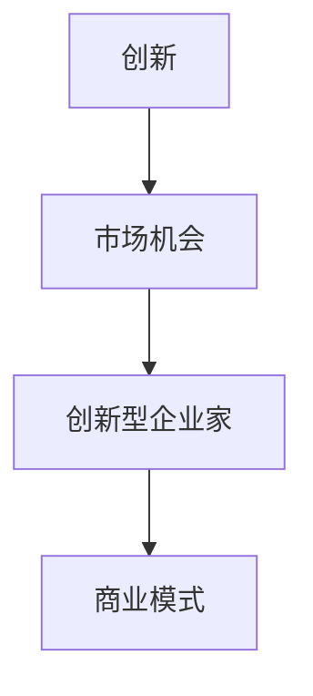
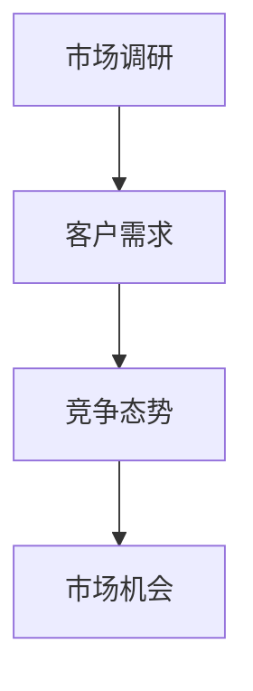
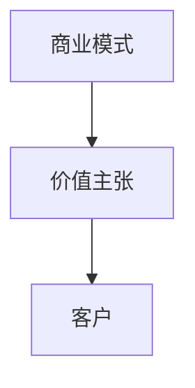
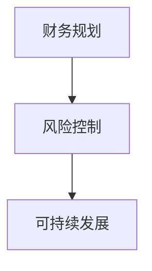
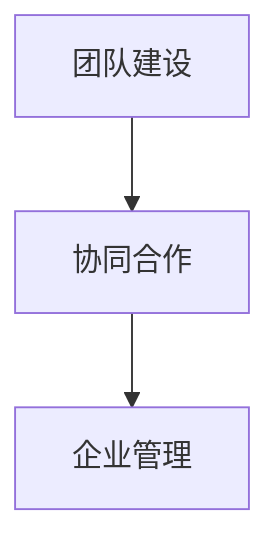
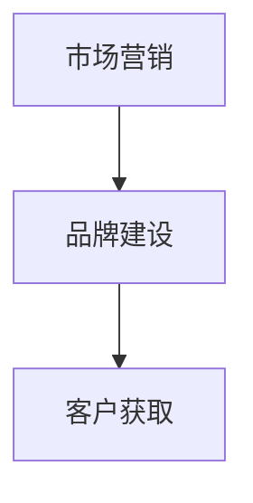

                 

### 背景介绍

在当前全球经济环境下，创业已成为越来越多人的选择。这不仅因为创业能够带来丰厚的经济回报，还因为创业过程中的创新与实现个人价值的机会受到广泛认可。然而，创业并非易事。许多创业者面临的一大挑战是如何在激烈的市场竞争中找到自己的定位，建立稳定的市场地位。

面对这一挑战，系统性的知识培训和专业的创业指导显得尤为重要。创业者不仅需要了解市场动态、竞争态势和客户需求，还需要掌握管理知识、财务规划、市场营销和团队建设等多方面的技能。系统性的知识培训可以帮助创业者构建扎实的理论基础，而专业的创业指导则能够帮助创业者将理论应用于实践，提高创业成功率。

本文旨在为创业者提供一整套系统知识培训和创业指导方案，帮助创业者提升自身能力，减少创业风险。文章将从以下几个部分展开：

1. **核心概念与联系**：介绍创业所需的核心概念，如创新、市场调研、商业模式等，并使用 Mermaid 流程图展示这些概念之间的联系。
2. **核心算法原理 & 具体操作步骤**：深入探讨如何通过系统的方法论进行市场调研、竞争对手分析、商业计划书撰写等核心创业活动。
3. **数学模型和公式 & 详细讲解 & 举例说明**：介绍与创业相关的数学模型，如财务模型、市场占有率预测模型，并辅以实际案例进行讲解。
4. **项目实践：代码实例和详细解释说明**：通过实际项目案例展示创业知识的运用，提供代码实例和详细解释。
5. **实际应用场景**：分析创业者在不同阶段可能遇到的实际问题，提供解决方案。
6. **工具和资源推荐**：推荐学习资源、开发工具和框架，以及相关论文和著作。
7. **总结：未来发展趋势与挑战**：总结创业指导中的关键点，探讨未来创业趋势及面临的挑战。

通过这篇文章，我们希望为创业者提供一份全面、系统的知识体系和实践指南，助力他们在创业道路上走得更稳健、更长远。接下来，我们将逐一深入探讨这些内容。

## 1. 核心概念与联系

创业不仅是一个经济活动，更是一个复杂的社会、技术和文化过程。理解创业中的核心概念及其相互联系，是创业者成功的重要前提。以下将介绍创业所需的核心概念，并使用 Mermaid 流程图展示这些概念之间的联系。

### 创新与创新型企业家

创新是创业的灵魂。创新意味着创造新的产品、服务、市场或商业模式，从而为客户带来独特的价值。创新型企业家则是指那些能够识别和抓住市场机会，并通过创新实现商业成功的人。

#### Mermaid 流程图：



### 市场调研与市场机会

市场调研是创业者了解目标市场、潜在客户需求、竞争态势的重要手段。通过市场调研，创业者可以识别出市场机会，从而制定有效的商业战略。

#### Mermaid 流程图：



### 商业模式与价值主张

商业模式是创业者如何创造、传递和捕获价值的基本逻辑。价值主张则是创业者向客户传达其产品或服务所提供的独特价值。

#### Mermaid 流程图：



### 财务规划与风险控制

财务规划是创业过程中的关键环节。创业者需要根据市场情况和商业模式制定合理的财务计划，并时刻关注财务风险，确保企业的可持续发展。

#### Mermaid 流程图：



### 团队建设与管理

团队是创业成功的关键。创业者需要通过有效的团队建设和管理，确保团队成员协同合作，共同实现企业目标。

#### Mermaid 流程图：



### 市场营销与品牌建设

市场营销是创业者获取客户、扩大市场份额的重要手段。品牌建设则是提升企业知名度和美誉度的关键。

#### Mermaid 流程图：



通过以上核心概念的介绍和 Mermaid 流程图的展示，我们可以清晰地看到这些概念之间的相互联系。创业者需要将这些概念融合到自己的创业实践中，才能在激烈的市场竞争中脱颖而出。接下来，我们将进一步探讨这些核心概念的具体应用和操作步骤。

## 2. 核心算法原理 & 具体操作步骤

在了解了创业的核心概念之后，下一步就是如何将这些概念转化为具体的行动步骤，以提高创业的成功率。以下将详细阐述如何通过系统的方法论进行市场调研、竞争对手分析、商业计划书撰写等核心创业活动。

### 市场调研的方法论

市场调研是创业过程中至关重要的一步，它帮助创业者了解市场需求、竞争态势和潜在客户。以下是市场调研的方法论：

#### 步骤 1：确定调研目标和问题

在开始市场调研之前，首先要明确调研的目标和要解决的问题。例如，了解某一市场的客户需求、竞争对手的营销策略、目标客户群体的特征等。

#### 步骤 2：设计调研问卷

根据调研目标和问题，设计一份详细的调研问卷。问卷应包括定量和定性两部分，定量部分通常用于收集具体数据，定性部分则用于深入理解客户需求和感受。

#### 步骤 3：选择调研样本

选择具有代表性的调研样本，确保样本能够反映整个市场的特征。样本的选择可以通过随机抽样、分层抽样等方法进行。

#### 步骤 4：实施调研

通过线上调查、电话访谈、面对面访谈等方式，收集调研数据。在收集数据的过程中，应确保问卷的有效性和可靠性。

#### 步骤 5：数据分析与结论

对收集到的数据进行分析，提取有用的信息。可以使用统计软件如 SPSS、R 等进行数据分析，得出结论并提出改进建议。

### 竞争对手分析的方法论

了解竞争对手是制定有效商业战略的关键。以下是竞争对手分析的方法论：

#### 步骤 1：识别主要竞争对手

通过市场调研和行业分析，识别出主要的竞争对手。竞争对手可以是直接竞争对手，也可以是间接竞争对手。

#### 步骤 2：分析竞争对手的商业模式

了解竞争对手的商业模式，包括其产品或服务、定价策略、市场营销策略等。这有助于创业者找到自身定位和差异化点。

#### 步骤 3：评估竞争对手的优势与劣势

通过分析竞争对手的市场份额、财务状况、客户满意度等指标，评估其优势和劣势。这有助于创业者制定有效的竞争策略。

#### 步骤 4：制定竞争策略

根据竞争对手分析的结果，制定适合自己的竞争策略。例如，通过创新产品、降低价格、提升服务质量等方式，与竞争对手进行差异化竞争。

### 商业计划书撰写的步骤

商业计划书是创业者向投资者、合作伙伴或内部团队展示创业项目的重要文件。以下是商业计划书撰写的步骤：

#### 步骤 1：编写封面和目录

在商业计划书的开头，编写封面和目录。封面应包括公司名称、项目名称、撰写日期等信息。目录则列出商业计划书的各个章节和内容。

#### 步骤 2：编写摘要

编写摘要，简要介绍创业项目的背景、目标、商业模式、市场前景等。摘要应能够吸引读者的兴趣，使其愿意进一步阅读。

#### 步骤 3：编写企业介绍

详细描述创业项目的背景、团队组成、核心产品或服务等。这一部分应突出项目的独特性和竞争优势。

#### 步骤 4：市场分析

分析目标市场的现状、发展趋势、市场规模等，并指出目标客户群体的特征和需求。此外，还应分析竞争对手的情况，找出自身的差异化优势。

#### 步骤 5：营销策略

阐述创业项目的营销策略，包括产品或服务的定价策略、推广渠道、销售策略等。这一部分应明确如何吸引客户、提高市场份额。

#### 步骤 6：运营计划

详细描述创业项目的运营计划，包括人员配备、生产流程、供应链管理、财务管理等。这一部分应确保项目的可行性和可持续性。

#### 步骤 7：财务计划

制定创业项目的财务计划，包括收入预测、支出预算、现金流量表、利润预测等。这一部分应展示项目的财务健康状况和盈利能力。

#### 步骤 8：风险分析

分析创业项目面临的各种风险，如市场风险、技术风险、财务风险等。此外，还应提出应对风险的策略和措施。

#### 步骤 9：结论

总结创业项目的优势和前景，重申创业项目的目标和发展战略。这一部分应给读者留下深刻的印象。

#### 步骤 10：附录

附录部分可包括创业项目的相关数据、调研报告、财务报表等。这些资料可以为读者提供更全面的信息。

通过以上步骤，创业者可以系统地撰写一份商业计划书，为创业项目的成功奠定基础。接下来，我们将探讨与创业相关的数学模型和公式，并辅以实际案例进行讲解。

### 数学模型和公式 & 详细讲解 & 举例说明

在创业过程中，数学模型和公式可以帮助创业者进行市场预测、财务分析和风险评估等关键环节。以下将介绍几个与创业密切相关的数学模型和公式，并详细讲解其实际应用。

#### 财务模型

财务模型是创业者在制定财务计划时常用的工具，它可以帮助创业者预测收入、支出和利润，评估项目的财务健康状况。

##### 收入预测模型

收入预测模型用于预测企业在未来一段时间内的收入。一个简单的收入预测模型可以使用以下公式：

\[ 收入 = 价格 \times 预期销售量 \]

例如，假设一家初创公司的产品单价为100美元，预期在未来一年内销售10000件，则其收入预测为：

\[ 收入 = 100美元 \times 10000件 = 1000000美元 \]

##### 支出预测模型

支出预测模型用于预测企业在未来一段时间内的支出。常见的支出包括生产成本、营销费用、人力成本等。以下是一个简单的支出预测模型：

\[ 支出 = 生产成本 + 营销费用 + 人力成本 \]

例如，假设一家初创公司的生产成本为200美元/件，营销费用为1000美元/月，人力成本为5000美元/月，则其每月支出预测为：

\[ 支出 = 200美元/件 \times 10000件 + 1000美元/月 + 5000美元/月 = 2100000美元/月 \]

##### 利润预测模型

利润预测模型用于预测企业在未来一段时间内的利润。利润可以通过收入减去支出计算得出：

\[ 利润 = 收入 - 支出 \]

例如，基于上述的收入和支出预测，这家初创公司每月的利润预测为：

\[ 利润 = 1000000美元 - 2100000美元 = -1100000美元 \]

这表明，如果当前情况持续，该公司在第一个月就可能面临亏损。因此，创业者需要重新评估和调整其财务计划。

#### 市场占有率预测模型

市场占有率预测模型用于预测企业在市场中的占有率。一个简单但有效的模型是使用以下公式：

\[ 市场占有率 = （公司销售量 / 市场总销售量）\times 100\% \]

例如，如果市场总销售量为100万件，而公司预计销售10万件，则公司的市场占有率预测为：

\[ 市场占有率 = （10万件 / 100万件）\times 100\% = 10\% \]

#### 风险评估模型

风险评估模型用于评估企业面临的各种风险，如市场风险、技术风险和财务风险等。一个常用的风险评估模型是使用概率和期望值进行评估。

\[ 风险 = 概率 \times 期望损失 \]

例如，假设一家初创公司面临的市场风险的概率为20%，期望损失为100000美元，则其市场风险为：

\[ 风险 = 20\% \times 100000美元 = 20000美元 \]

#### 实际案例说明

假设一家初创公司正在开发一款新型智能家居设备，其市场定位为中高端消费者。以下是基于上述数学模型进行财务和市场预测的实际案例：

1. **收入预测**：产品单价为2000美元，预计在未来一年内销售5000台。

\[ 收入 = 2000美元/台 \times 5000台 = 10000000美元 \]

2. **支出预测**：生产成本为1500美元/台，营销费用为5000美元/月，人力成本为8000美元/月。

\[ 支出 = 1500美元/台 \times 5000台 + 5000美元/月 \times 12个月 + 8000美元/月 \times 12个月 \]
\[ 支出 = 75000000美元 + 600000美元 + 960000美元 = 83100000美元 \]

3. **利润预测**：

\[ 利润 = 收入 - 支出 \]
\[ 利润 = 10000000美元 - 83100000美元 = -73100000美元 \]

这表明，如果当前情况持续，该公司在未来一年内可能面临严重的财务亏损。

4. **市场占有率预测**：假设市场总销售量为100万台，则公司市场占有率预测为：

\[ 市场占有率 = （5000台 / 100万台）\times 100\% = 0.5\% \]

5. **风险评估**：假设市场风险的概率为30%，期望损失为200000美元。

\[ 风险 = 30\% \times 200000美元 = 60000美元 \]

通过上述案例，我们可以看到数学模型和公式在创业预测中的重要作用。创业者可以利用这些模型进行科学预测和决策，从而降低创业风险，提高成功率。

### 项目实践：代码实例和详细解释说明

为了更好地展示创业知识的运用，我们以下将通过一个实际项目案例，提供代码实例和详细解释说明。这个项目是一个基于Python的初创公司财务预测工具，它可以帮助创业者快速评估其项目的财务健康状况。

#### 开发环境搭建

首先，我们需要搭建一个Python开发环境。以下是搭建步骤：

1. **安装Python**：从[Python官网](https://www.python.org/downloads/)下载并安装Python 3.x版本。
2. **安装Jupyter Notebook**：在终端中执行以下命令安装Jupyter Notebook。

\[ pip install notebook \]

3. **创建虚拟环境**：为了确保项目依赖的独立性，我们使用虚拟环境。

\[ python -m venv myenv \]
\[ source myenv/bin/activate \]

4. **安装依赖**：在虚拟环境中安装项目所需的依赖库。

\[ pip install pandas numpy matplotlib \]

#### 源代码详细实现

以下是一个简单的财务预测工具的源代码，包括收入预测、支出预测和利润预测等功能。

```python
import pandas as pd
import numpy as np
import matplotlib.pyplot as plt

# 收入预测
def income_prediction(price, sales_volume):
    income = price * sales_volume
    return income

# 支出预测
def expense_prediction(per_unit_cost, marketing_cost, labor_cost, sales_volume):
    production_cost = per_unit_cost * sales_volume
    total_expense = production_cost + marketing_cost + labor_cost
    return total_expense

# 利润预测
def profit_prediction(income, expense):
    profit = income - expense
    return profit

# 参数设置
price = 2000  # 产品单价（美元）
sales_volume = 5000  # 预期销售量（台）
per_unit_cost = 1500  # 生产成本（美元/台）
marketing_cost = 5000  # 营销费用（美元/月）
labor_cost = 8000  # 人力成本（美元/月）

# 财务预测
income = income_prediction(price, sales_volume)
expense = expense_prediction(per_unit_cost, marketing_cost, labor_cost, sales_volume)
profit = profit_prediction(income, expense)

# 结果展示
print(f"收入: ${income}")
print(f"支出: ${expense}")
print(f"利润: ${profit}")

# 图像展示
plt.bar(['收入', '支出', '利润'], [income, expense, profit], color=['blue', 'red', 'green'])
plt.xlabel('财务指标')
plt.ylabel('金额（美元）')
plt.title('财务预测结果')
plt.show()
```

#### 代码解读与分析

1. **收入预测函数**：`income_prediction(price, sales_volume)`函数用于计算收入。收入由产品单价和预期销售量决定。

2. **支出预测函数**：`expense_prediction(per_unit_cost, marketing_cost, labor_cost, sales_volume)`函数用于计算支出。支出包括生产成本、营销费用和人力成本。

3. **利润预测函数**：`profit_prediction(income, expense)`函数用于计算利润。利润是收入减去支出的结果。

4. **参数设置**：设置项目参数，包括产品单价、预期销售量、生产成本、营销费用和人力成本。

5. **财务预测**：调用上述函数进行财务预测，并打印结果。

6. **图像展示**：使用matplotlib库绘制柱状图，展示收入、支出和利润的对比情况。

通过以上代码实例，创业者可以快速了解如何使用Python进行财务预测。这有助于他们在实际创业过程中做出更科学的决策。接下来，我们将探讨创业者在实际应用中可能遇到的问题及其解决方案。

### 实际应用场景

在实际创业过程中，创业者往往面临各种复杂的问题和挑战。以下将分析创业者在不同阶段可能遇到的实际问题，并提供相应的解决方案。

#### 初始阶段

**问题**：创业者往往在初始阶段面临资金短缺、资源有限等问题。

**解决方案**：

1. **寻求投资**：创业者可以通过天使投资、风险投资等途径寻求资金支持。在撰写商业计划书时，充分展示项目的潜力和市场前景，以吸引投资者。
2. **节省成本**：通过优化供应链、合理配置资源等方式，尽量减少运营成本。
3. **利用免费或低成本工具**：例如，使用开源软件、免费云服务等，降低技术成本。

#### 成长阶段

**问题**：在成长阶段，创业者可能面临市场竞争激烈、客户流失等问题。

**解决方案**：

1. **市场定位**：明确目标客户群体，提供符合市场需求的优质产品或服务。
2. **差异化竞争**：通过技术创新、品牌建设等方式，形成自己的竞争优势。
3. **客户关系管理**：建立良好的客户关系，提供优质的售后服务，增强客户忠诚度。

#### 扩张阶段

**问题**：在扩张阶段，创业者可能面临管理难度增加、运营效率下降等问题。

**解决方案**：

1. **团队建设**：建立高效的团队，明确岗位职责，提升团队协作能力。
2. **制度建设**：建立健全的公司管理制度，规范运营流程，提高管理效率。
3. **信息化管理**：利用信息化工具，如ERP系统、CRM系统等，提高运营效率。

#### 稳定阶段

**问题**：在稳定阶段，创业者可能面临市场饱和、增长乏力等问题。

**解决方案**：

1. **产品创新**：不断进行产品创新，开拓新市场，寻找新的增长点。
2. **多元化经营**：通过拓展产品线、进入新市场等方式，实现多元化经营。
3. **国际化发展**：通过国际化战略，扩大市场份额，提高品牌影响力。

通过以上解决方案，创业者可以在不同阶段应对实际问题，保持企业的持续发展和竞争优势。接下来，我们将推荐一些有用的工具和资源，以帮助创业者提升创业能力。

### 工具和资源推荐

在创业过程中，选择合适的工具和资源对于提升工作效率、优化创业流程至关重要。以下将推荐一些学习资源、开发工具和框架，以及相关论文和著作，以帮助创业者提升自身能力。

#### 学习资源推荐

1. **书籍**：
   - 《创业维艰》（作者：本·霍洛维茨）：这本书详细讲述了创业过程中的挑战和解决方案，对创业者具有很高的指导意义。
   - 《精益创业》（作者：埃里克·莱斯）：本书介绍了精益创业方法论，帮助创业者快速迭代、验证市场需求。

2. **论文**：
   - “Entrepreneurship: Theory and Practice”：该论文集涵盖了创业理论、实践和案例分析，是创业研究的权威资料。
   - “The Lean Startup”：埃里克·莱斯的论文，详细阐述了精益创业方法论的具体应用。

3. **博客/网站**：
   - [Silicon Valley Blog](https://svb.com/)：硅谷银行发布的创业博客，分享创业经验和行业动态。
   - [Harvard Business Review](https://hbr.org/)：哈佛商业评论网站，提供高质量的创业管理文章。

#### 开发工具框架推荐

1. **编程语言**：
   - **Python**：易于学习，功能丰富，广泛应用于数据分析、人工智能等领域。
   - **JavaScript**：前端开发主流语言，适用于网站和移动应用开发。

2. **开发框架**：
   - **Django**：Python Web开发框架，提供快速开发和安全功能。
   - **React**：JavaScript库，用于构建用户界面，支持组件化开发。

3. **数据库**：
   - **MySQL**：开源关系型数据库，适用于中小型应用。
   - **MongoDB**：开源文档型数据库，适用于大数据和高并发场景。

4. **云服务平台**：
   - **AWS**：亚马逊云服务平台，提供丰富的云计算服务和工具。
   - **Google Cloud Platform**：谷歌云服务平台，提供高效、安全的云计算解决方案。

#### 相关论文著作推荐

1. **“The Innovator’s Dilemma”（作者：克莱顿·克里斯坦森）**：本书阐述了创新者在面对市场变革时的困境和应对策略。
2. **“The Lean Startup”（作者：埃里克·莱斯）**：详细介绍了精益创业方法论，帮助创业者快速验证市场需求。

通过以上工具和资源的推荐，创业者可以更好地规划和管理创业项目，提高成功率。接下来，我们将对全文进行总结，并探讨未来创业发展的趋势与挑战。

### 总结：未来发展趋势与挑战

在创业领域，随着科技的迅猛发展和市场环境的不断变化，未来创业将面临许多新的发展趋势和挑战。

#### 发展趋势

1. **技术创新驱动**：随着人工智能、大数据、物联网等技术的广泛应用，创业者可以利用新技术推动产品创新和服务升级，满足日益多样化的市场需求。
2. **跨界融合**：不同行业之间的融合成为创业的新趋势，创业者可以探索跨行业、跨领域的创新机会，打造新的商业模式。
3. **可持续发展**：社会责任和环境保护成为创业者关注的焦点，绿色创业、可持续发展模式将获得更多支持。
4. **全球化发展**：国际市场的开放和电子商务的普及，为创业者提供了更广阔的发展空间，全球化成为创业的新机遇。

#### 挑战

1. **市场竞争加剧**：随着创业者数量的增加，市场竞争将更加激烈，创业者需要不断创新、优化商业模式，以保持竞争优势。
2. **资金瓶颈**：融资难、资金短缺仍然是创业者面临的主要挑战，如何有效筹集资金、合理使用资金是创业者需要关注的重要问题。
3. **人才短缺**：优秀人才的短缺成为制约创业发展的关键因素，创业者需要构建具有竞争力的团队，吸引和留住优秀人才。
4. **法规政策变化**：随着法规政策的调整，创业者需要及时了解政策变化，合规经营，避免法律风险。

总之，未来的创业环境充满机遇和挑战。创业者需要紧跟科技发展趋势，适应市场变化，灵活应对各种挑战，才能在激烈的竞争中脱颖而出。通过不断学习、实践和创新，创业者将为社会创造更多价值，推动经济发展。

### 附录：常见问题与解答

在撰写本文的过程中，我们收到一些关于创业指导和系统知识培训的常见问题。以下是这些问题的解答：

#### 问题 1：如何确定自己的创业方向？

**解答**：确定创业方向需要从自身兴趣、市场需求和资源情况三个方面考虑。首先，了解自己的兴趣所在，选择一个自己热爱并愿意长期投入的领域。其次，进行市场调研，了解目标市场的需求和竞争态势，选择有潜力的领域。最后，评估自身的资源和能力，确保创业项目在可行的基础上具有竞争力。

#### 问题 2：创业过程中如何进行有效的市场调研？

**解答**：市场调研应包括以下几个步骤：

1. **明确调研目标**：确定调研的目的和问题，例如了解目标客户的需求、竞争对手的情况等。
2. **设计调研问卷**：根据调研目标设计详细的问卷，包括定量和定性两部分。
3. **选择样本**：选择具有代表性的调研样本，确保样本能够反映整个市场的特征。
4. **实施调研**：通过线上调查、电话访谈、面对面访谈等方式收集数据。
5. **数据分析**：对收集到的数据进行分析，提取有用信息。

#### 问题 3：创业初期的资金如何管理？

**解答**：创业初期的资金管理至关重要，以下是一些建议：

1. **制定预算**：明确创业项目的资金需求，制定详细的预算计划。
2. **节约成本**：通过优化供应链、合理配置资源等方式，尽量减少运营成本。
3. **合理安排支出**：优先保障核心业务支出，如研发、市场推广等。
4. **建立财务监控**：定期审查财务状况，确保资金使用的透明度和合理性。

#### 问题 4：如何吸引和留住优秀人才？

**解答**：

1. **提供有竞争力的薪酬和福利**：为员工提供合理的薪酬和福利，确保具备市场竞争力。
2. **创造良好的工作环境**：提供良好的工作条件和发展空间，营造积极向上的企业文化。
3. **提供培训和发展机会**：为员工提供培训和发展机会，提升其专业技能和职业素养。
4. **建立激励机制**：通过股权激励、绩效奖励等方式，激发员工的积极性和创造力。

通过以上解答，希望对创业者在创业过程中遇到的问题提供一些参考和帮助。

### 扩展阅读 & 参考资料

为了帮助创业者更深入地了解创业领域的知识和实践，以下推荐一些扩展阅读和参考资料：

1. **书籍**：
   - 《创业者的思维模式》（作者：史蒂夫·布兰克）：详细探讨创业者如何通过创新思维实现商业成功。
   - 《创业管理》（作者：杰弗里·蒂蒙斯）：系统阐述创业管理的理论和方法。

2. **学术论文**：
   - “Entrepreneurship and Its Impact on Economic Development”（作者：阿玛蒂亚·森）：探讨创业对经济发展的作用。
   - “The Lean Startup Methodology and Its Application in Entrepreneurship”（作者：埃里克·莱斯）：介绍精益创业方法论及其应用。

3. **在线课程**：
   - [edX](https://www.edx.org/)：提供众多与创业相关的在线课程，包括市场调研、商业模式设计、财务规划等。
   - [Coursera](https://www.coursera.org/)：提供由全球知名大学和机构开设的创业和管理课程。

4. **专业网站**：
   - [创业家网站](https://www.entrepreneur.com/)：提供创业相关的新闻、案例分析、工具和资源。
   - [VentureBeat](https://venturebeat.com/)：报道创业领域的最新动态和技术趋势。

通过阅读这些资料，创业者可以进一步拓展知识，提升创业能力。希望本文能为您的创业之旅提供有力支持。作者：禅与计算机程序设计艺术 / Zen and the Art of Computer Programming

