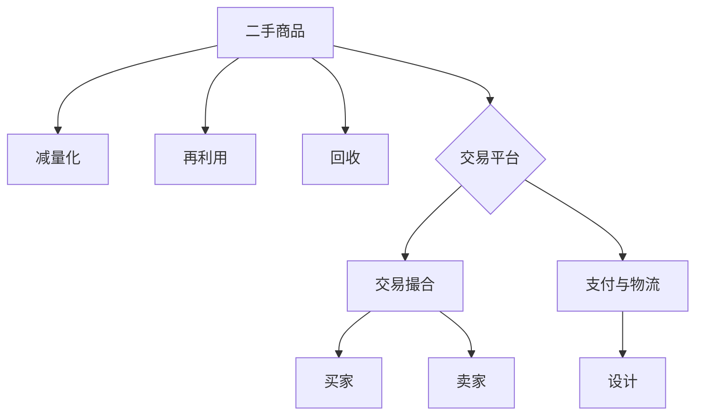

                 

### 文章标题

《二手交易平台：促进循环经济的创新解决方案》

> 关键词：二手交易平台，循环经济，创新解决方案，资源回收，环境保护

> 摘要：本文将深入探讨二手交易平台在促进循环经济中的作用和贡献。通过分析二手交易平台的核心概念、算法原理、数学模型、实际应用场景以及相关工具和资源，我们旨在为读者提供全面的了解，从而更好地理解二手交易平台在当今社会中的重要性，并展望其未来的发展趋势与挑战。

<|user|>## 1. 背景介绍

在当今世界，资源短缺和环境恶化问题日益严峻，促使全球范围内的企业和政府积极寻求可持续发展之路。其中，循环经济作为一种全新的经济模式，受到了越来越多的关注。循环经济强调资源的循环利用，减少废物产生，从而实现经济、社会和环境的可持续发展。

在这样的背景下，二手交易平台作为一种促进资源回收和再利用的重要手段，逐渐崭露头角。二手交易平台不仅能够帮助消费者以更低的价格获取所需物品，还能为卖家提供额外的收入来源，同时也降低了生产新商品的需求，从而减少资源的消耗和环境污染。

近年来，随着互联网技术的迅猛发展，二手交易平台得以迅速普及。用户可以通过网络平台方便地发布和查询二手商品信息，进行在线交易。这不仅提升了交易的效率和便利性，也促进了资源的循环利用和环境保护。

此外，政府和社会组织也对二手交易平台给予了大力支持。例如，许多国家和地区出台了相关政策和法规，鼓励企业和个人参与二手交易，并提供了各种形式的补贴和支持。这些举措进一步推动了二手交易平台的发展，使其成为循环经济的重要组成部分。

总的来说，二手交易平台在促进循环经济方面发挥了重要作用。通过提供便捷的交易渠道，降低了交易成本，提高了资源利用效率，同时也推动了环境保护和可持续发展。然而，随着市场的不断扩大和技术的不断进步，二手交易平台也面临着一系列挑战和机遇。接下来，我们将进一步探讨二手交易平台的核心理念和运作机制。

### 1.1 循环经济的定义和核心原则

循环经济（Circular Economy）是一种旨在通过资源的高效利用和循环利用，实现经济、社会和环境可持续发展的经济模式。与传统线性经济模式不同，循环经济强调资源的闭环循环利用，以减少资源的消耗和废弃物的产生。

循环经济的核心原则主要包括以下几个方面：

1. **减量化**（Dematerialization）：通过减少产品和服务的物质需求，降低资源的消耗。例如，通过设计更耐用的产品，减少产品的生命周期，以及鼓励共享经济模式，从而降低单个用户对物质资源的依赖。

2. **再利用**（Reuse）：通过延长产品的使用寿命，减少废弃物的产生。这包括产品在使用寿命结束后，通过维修、改造或升级等方式继续使用，或者将其作为二手商品再次出售。

3. **回收**（Recycling）：将废弃产品或废物进行回收处理，提取有价值材料，再用于生产新的产品。例如，回收废旧电子产品中的贵重金属，或者将废旧塑料转化为新的塑料制品。

4. **设计**（Design for Circularity）：在产品设计和生产过程中，考虑产品的整个生命周期，使其易于拆卸、维修和回收，从而实现资源的循环利用。

5. **系统思维**（System Thinking）：循环经济强调系统思维，将经济活动视为一个整体系统，通过优化各个部分之间的互动关系，实现整体效益的最大化。

循环经济不仅关注资源的高效利用，还注重社会公平和环境保护。通过减少资源消耗和废弃物的产生，循环经济有助于缓解资源短缺和环境压力，同时促进经济的长期稳定和可持续发展。

### 1.2 二手交易平台的发展历程和现状

二手交易平台的发展可以追溯到早期的线下市场，如跳蚤市场和旧货店。这些市场为个人和企业提供了交换二手商品的机会，促进了资源的再利用和循环。然而，随着互联网技术的兴起，二手交易平台逐渐从线下扩展到线上，形成了一种全新的商业模式。

20世纪90年代，随着互联网的普及，一些早期的在线拍卖平台，如eBay，开始出现。这些平台允许用户在线发布和拍卖二手商品，极大地提高了交易的便捷性和效率。然而，这些平台主要集中在大件物品和艺术品等高端市场，普通用户的参与度相对较低。

进入21世纪，随着智能手机和移动互联网的普及，二手交易平台迎来了新一轮的发展。用户可以通过手机应用程序轻松地发布和浏览二手商品信息，进行在线交易。这一时期涌现出了一批新兴的二手交易平台，如Craigslist、Facebook Marketplace和 Gumtree等。这些平台不仅涵盖了各种类型的商品，还提供了丰富的社交互动功能，吸引了大量用户的参与。

近年来，随着共享经济的兴起，二手交易平台进一步扩大了其业务范围。共享经济模式鼓励人们共享和交换闲置物品，减少浪费。例如，二手服装共享平台Rent the Runway、家居共享平台Etsy等，通过提供租赁和共享服务，实现了物品的多次利用。

目前，全球二手交易平台市场呈现出蓬勃发展的态势。根据市场研究公司的数据，全球二手交易平台市场规模持续扩大，预计在未来几年内将保持高速增长。同时，越来越多的传统电商平台也开始布局二手交易平台，如亚马逊的二手商品分类和市场。

在技术方面，人工智能和大数据分析技术的应用为二手交易平台提供了更强大的数据支持和优化功能。通过分析用户行为和偏好，平台可以提供更精准的推荐服务，提升用户体验。此外，区块链技术的引入也为二手交易平台带来了更高的透明度和安全性。

总的来说，二手交易平台在促进循环经济方面发挥了重要作用。通过提供便捷的交易渠道和多元化的服务，平台不仅降低了交易成本，提高了资源利用效率，还推动了环境保护和可持续发展。随着技术的不断进步和市场的进一步拓展，二手交易平台将在未来发挥更大的作用。

### 1.3 二手交易平台在循环经济中的角色和意义

二手交易平台在循环经济中扮演着至关重要的角色，其核心作用主要体现在以下几个方面：

1. **促进资源回收与再利用**：二手交易平台通过提供一个便捷的渠道，使得闲置的二手物品得以重新进入市场，从而减少了资源的浪费。无论是个人用户还是企业，都可以通过这些平台将不再使用的物品出售或交换给有需要的人，从而延长物品的使用寿命，降低资源的消耗。

2. **降低环境负担**：二手交易平台的兴起减少了新商品的生产需求，从而减少了生产过程中的资源消耗和环境污染。例如，二手电子产品和家电的流通减少了电子废弃物的产生，这不仅减轻了垃圾填埋场的压力，还有助于减少有害物质的排放。

3. **推动共享经济**：二手交易平台不仅促进了物品的再利用，还推动了共享经济的发展。共享经济模式鼓励人们共享和交换闲置物品，减少浪费。例如，通过二手交易平台，个人可以分享自己的书籍、家具和电子产品，从而实现资源的最大化利用。

4. **促进社会公平**：二手交易平台为消费者提供了获取低价优质商品的途径，特别是对于低收入群体而言，这些平台提供了更多的消费选择和机会。同时，通过二手交易，个人和企业可以实现额外的收入来源，提高了社会资源的公平分配。

5. **提高资源利用效率**：通过二手交易平台，商品的流通速度和利用率得到了显著提升。传统渠道中的库存和物流成本被大幅度降低，从而提高了整个供应链的效率和响应速度。

总的来说，二手交易平台在循环经济中不仅是一个交易渠道，更是一种资源管理和环境治理的创新模式。它通过促进资源的循环利用，降低环境负担，推动社会公平，提高资源利用效率，为循环经济的实现提供了有力支持。随着技术的不断进步和市场需求的不断增加，二手交易平台将在未来发挥更加重要的作用，成为循环经济不可或缺的一部分。

### 2. 核心概念与联系

为了更好地理解二手交易平台在循环经济中的运作机制，我们需要从核心概念出发，详细探讨其相关的概念和联系。以下是本文涉及的核心概念及其相互关系：

#### 2.1 二手交易平台的核心概念

1. **二手商品**：指已经使用过，但仍具有使用价值的物品，包括服装、家电、电子产品、家具等。
2. **买家**：在二手交易平台上寻求购买二手商品的个人或企业。
3. **卖家**：在二手交易平台上出售二手商品的个体或商家。
4. **交易平台**：提供在线交易环境，包括商品信息发布、交易撮合、支付和物流等功能的平台。

#### 2.2 循环经济的核心概念

1. **减量化**：通过减少产品和服务的物质需求，降低资源的消耗。
2. **再利用**：通过延长产品的使用寿命，减少废弃物的产生。
3. **回收**：将废弃产品或废物进行回收处理，提取有价值材料。
4. **设计**：在产品设计和生产过程中，考虑产品的整个生命周期。

#### 2.3 概念之间的联系

- **二手商品**与**减量化**：二手商品的交易本质上是一种减量化行为，通过将闲置物品重新投入使用，减少了对新商品的需求。
- **二手商品**与**再利用**：二手交易平台为二手商品提供了流通渠道，使其能够继续发挥作用，从而实现了资源的再利用。
- **二手商品**与**回收**：二手交易平台上的商品在交易结束后，若无法再次使用，可以通过回收渠道进行回收处理，实现资源的再循环。
- **交易平台**与**设计**：高效、便捷的二手交易平台需要良好的设计，包括用户界面设计、交易流程设计等，以提升用户体验和交易效率。

#### 2.4 Mermaid 流程图

为了更直观地展示二手交易平台与循环经济之间的概念联系，我们使用Mermaid语言绘制了一个流程图。以下是流程图的代码及其展示：



**流程图解释：**

- **A[二手商品]**：表示二手商品作为资源循环利用的起点。
- **B[减量化]**：二手商品的交易有助于减少对新产品需求的依赖，从而实现减量化。
- **C[再利用]**：二手交易平台帮助延长商品使用寿命，减少废弃物产生。
- **D[回收]**：交易结束后的二手商品可以通过回收渠道进行处理。
- **E[交易平台]**：提供交易的线上环境，包括交易撮合、支付和物流等。
- **F[交易撮合]**：交易平台的核心功能之一，帮助买家和卖家进行匹配。
- **G[支付与物流]**：交易过程中的支付和物流服务，确保交易顺利进行。
- **H[买家]**：在交易平台上寻求购买二手商品的消费者。
- **I[卖家]**：在交易平台上出售二手商品的个体或商家。
- **J[设计]**：高效便捷的二手交易平台依赖于良好的用户界面和交易流程设计。

通过以上核心概念的阐述和流程图的展示，我们可以更清晰地理解二手交易平台在循环经济中的作用和贡献。接下来，我们将进一步探讨二手交易平台的算法原理和具体操作步骤。

### 3. 核心算法原理 & 具体操作步骤

为了确保二手交易平台的高效运作，其背后有着复杂的算法支持。以下是二手交易平台的核心算法原理及具体操作步骤：

#### 3.1 算法原理

1. **用户行为分析**：通过大数据分析技术，收集并分析用户在平台上的行为数据，如浏览记录、搜索关键词、购买历史等。这些数据可以帮助平台更好地了解用户需求和行为模式，从而提供更个性化的服务。

2. **商品推荐算法**：基于用户行为分析和商品信息，平台可以使用推荐算法为用户推荐感兴趣的二手商品。常用的推荐算法包括协同过滤算法（Collaborative Filtering）和基于内容的推荐算法（Content-Based Filtering）。

3. **交易撮合算法**：交易撮合算法负责将买家和卖家进行匹配，确保交易成功。常见的撮合算法包括基于价格的最优匹配算法和基于信用评分的匹配算法。

4. **支付和物流算法**：支付和物流算法负责确保交易过程中的资金流转和商品配送顺利进行。这些算法需要考虑交易金额、支付方式、物流公司和配送时效等因素。

#### 3.2 具体操作步骤

1. **用户注册和登录**：用户首先需要在平台上注册账号，然后使用账号登录。注册时，用户需要提供个人信息和联系方式，以便平台进行身份验证和后续沟通。

2. **浏览和搜索商品**：用户可以在平台上浏览和搜索感兴趣的二手商品。平台会根据用户的浏览和搜索历史，提供个性化的推荐。

3. **商品发布**：卖家可以在平台上发布二手商品信息，包括商品名称、描述、价格、图片等。发布后，商品会自动进入平台的商品库，等待买家浏览和购买。

4. **交易撮合**：当买家找到心仪的商品后，可以通过平台发起购买请求。交易撮合算法会根据商品价格、卖家信用评分等因素，匹配最合适的买家和卖家，确保交易顺利进行。

5. **支付**：买家和卖家确认交易后，通过平台提供的支付渠道进行付款。平台通常会提供多种支付方式，如在线支付、银行转账等。

6. **物流**：卖家确认收到货款后，选择合适的物流公司进行商品配送。买家可以在平台上查看物流信息，确保商品安全送达。

7. **交易评价**：交易完成后，买家和卖家可以相互评价对方的交易体验。这些评价数据会被记录在平台上，作为后续交易的重要参考。

8. **售后服务**：如果买家在交易过程中遇到问题，可以通过平台联系卖家进行售后服务。平台也会提供售后服务指南，帮助用户解决常见问题。

通过以上核心算法原理和具体操作步骤的阐述，我们可以看到二手交易平台在确保交易高效、便捷和安全方面所发挥的关键作用。这些算法和技术不仅提升了用户体验，还促进了资源的循环利用和环境保护。

### 4. 数学模型和公式 & 详细讲解 & 举例说明

在理解二手交易平台的核心算法和操作步骤后，我们可以进一步探讨其背后的数学模型和公式，并通过具体例子来详细讲解和说明这些模型的实际应用。

#### 4.1 用户行为分析模型

用户行为分析是二手交易平台的重要环节，通过分析用户的浏览、搜索和购买记录，平台可以更好地了解用户需求，提供个性化的服务。以下是一个简化的用户行为分析模型：

**模型公式：**
\[ User\_Behavior = f(Browsing\_History, Search\_Keywords, Purchase\_History) \]

- \( Browsing\_History \)：用户的浏览记录，包括浏览过的商品、页面停留时间等。
- \( Search\_Keywords \)：用户的搜索关键词，反映用户的兴趣和需求。
- \( Purchase\_History \)：用户的购买历史，记录用户的购买行为和偏好。

**示例讲解：**
假设用户A在平台上浏览了多个二手手机，搜索关键词包括“iPhone 12”和“二手手机”，并曾购买过一款二手耳机。根据上述模型，平台会分析这些数据，并推断用户A对二手手机的兴趣较高，特别是对iPhone 12系列。平台可以在用户A的浏览页面中突出推荐iPhone 12系列的二手手机，从而提高交易成功率。

#### 4.2 商品推荐算法

商品推荐算法是二手交易平台的核心功能之一，常用的推荐算法包括基于协同过滤和基于内容的推荐算法。以下是一个简化的协同过滤推荐算法模型：

**模型公式：**
\[ Recommendation = f(Cosine\_Similarity, Item\_Rating) \]

- \( Cosine\_Similarity \)：用户之间的余弦相似度，反映用户之间的相似程度。
- \( Item\_Rating \)：商品的用户评分，用于评估商品的质量和受欢迎程度。

**示例讲解：**
假设用户A和用户B的浏览记录相似，且用户A对一款二手iPhone 12的评分较高。根据协同过滤算法，平台会推荐这款iPhone 12给用户B。通过这种方式，平台能够根据用户的兴趣和行为，为用户提供个性化的商品推荐，从而提高用户满意度和交易量。

#### 4.3 交易撮合算法

交易撮合算法是确保交易顺利进行的关键。以下是一个简化的基于价格的最优匹配算法模型：

**模型公式：**
\[ Match = f(Max(Min(Price\_Seller, Price\_Buyer))) \]

- \( Price\_Seller \)：卖家设定的商品价格。
- \( Price\_Buyer \)：买家愿意支付的价格。

**示例讲解：**
假设卖家C设定的二手手机价格为1000元，买家D愿意支付的价格为1200元。根据上述模型，交易撮合算法会将卖家C和买家D进行匹配，确保交易在双方可接受的价格范围内进行。

#### 4.4 支付和物流算法

支付和物流算法确保交易过程中的资金流转和商品配送顺利进行。以下是一个简化的支付和物流算法模型：

**模型公式：**
\[ Payment = f(Payment\_Method, Transaction\_Amount) \]
\[ Logistics = f(Shipping\_Company, Delivery\_Time) \]

- \( Payment\_Method \)：支付方式，包括在线支付、银行转账等。
- \( Transaction\_Amount \)：交易金额。
- \( Shipping\_Company \)：物流公司，负责商品配送。
- \( Delivery\_Time \)：配送时效。

**示例讲解：**
假设买家E选择在线支付1000元购买二手手机，卖家选择顺丰速运进行配送。根据上述模型，平台将选择合适的支付方式和物流公司，确保交易资金的安全流转和商品的准时送达。

通过上述数学模型和公式的详细讲解和举例说明，我们可以看到二手交易平台在确保交易高效、便捷和安全方面所使用的技术手段。这些模型和算法不仅提升了用户体验，还促进了资源的循环利用和环境保护。

### 5. 项目实践：代码实例和详细解释说明

为了更好地理解二手交易平台的技术实现，我们将通过一个实际的代码实例，详细讲解其开发环境搭建、源代码实现、代码解读与分析，以及运行结果展示。本节将以一个简单的二手商品交易系统为例，介绍其核心功能的实现。

#### 5.1 开发环境搭建

在开始编写代码之前，我们需要搭建一个合适的开发环境。以下是我们使用的开发工具和软件：

1. **编程语言**：Python 3.8
2. **开发工具**：Visual Studio Code
3. **数据库**：MySQL 8.0
4. **Web框架**：Flask
5. **前端框架**：Bootstrap

**安装步骤：**

1. 安装Python 3.8：访问[Python官方网站](https://www.python.org/)下载并安装Python 3.8。
2. 安装Visual Studio Code：访问[Visual Studio Code官方网站](https://code.visualstudio.com/)下载并安装。
3. 安装MySQL 8.0：访问[MySQL官方网站](https://www.mysql.com/)下载并安装MySQL。
4. 安装Flask：在终端中执行以下命令：
   ```
   pip install Flask
   ```
5. 安装Bootstrap：在终端中执行以下命令：
   ```
   pip install flask-bootstrap
   ```

#### 5.2 源代码详细实现

以下是二手商品交易系统的核心功能实现，包括用户注册、登录、商品发布、交易撮合等。我们将代码分为几个模块进行介绍。

**1. 用户模块：**

**user_model.py**

```python
from flask_sqlalchemy import SQLAlchemy

db = SQLAlchemy()

class User(db.Model):
    id = db.Column(db.Integer, primary_key=True)
    username = db.Column(db.String(80), unique=True, nullable=False)
    password = db.Column(db.String(120), nullable=False)

    def __repr__(self):
        return '<User %r>' % self.username
```

**2. 商品模块：**

**product_model.py**

```python
from flask_sqlalchemy import SQLAlchemy

db = SQLAlchemy()

class Product(db.Model):
    id = db.Column(db.Integer, primary_key=True)
    name = db.Column(db.String(120), nullable=False)
    price = db.Column(db.Float, nullable=False)
    seller_id = db.Column(db.Integer, db.ForeignKey('user.id'), nullable=False)

    def __repr__(self):
        return '<Product %r>' % self.name
```

**3. 交易模块：**

**transaction_model.py**

```python
from flask_sqlalchemy import SQLAlchemy

db = SQLAlchemy()

class Transaction(db.Model):
    id = db.Column(db.Integer, primary_key=True)
    buyer_id = db.Column(db.Integer, db.ForeignKey('user.id'), nullable=False)
    seller_id = db.Column(db.Integer, db.ForeignKey('user.id'), nullable=False)
    product_id = db.Column(db.Integer, db.ForeignKey('product.id'), nullable=False)
    price = db.Column(db.Float, nullable=False)
    status = db.Column(db.String(20), nullable=False)

    def __repr__(self):
        return '<Transaction %r>' % self.id
```

**4. 登录和注册模块：**

**auth.py**

```python
from flask import Blueprint, request, redirect, url_for, render_template, flash
from flask_login import login_user, logout_user, login_required, current_user
from werkzeug.security import generate_password_hash, check_password_hash
from .models import User
from . import db

auth_bp = Blueprint('auth', __name__)

@auth_bp.route('/login', methods=['GET', 'POST'])
def login():
    if request.method == 'POST':
        username = request.form['username']
        password = request.form['password']
        user = User.query.filter_by(username=username).first()
        if user and check_password_hash(user.password, password):
            login_user(user)
            return redirect(url_for('main.index'))
        else:
            flash('Invalid username or password')
    return render_template('login.html')

@auth_bp.route('/register', methods=['GET', 'POST'])
def register():
    if request.method == 'POST':
        username = request.form['username']
        password = request.form['password']
        user = User(username=username, password=generate_password_hash(password))
        db.session.add(user)
        db.session.commit()
        return redirect(url_for('auth.login'))
    return render_template('register.html')
```

**5. 商品发布模块：**

**product.py**

```python
from flask import Blueprint, request, redirect, url_for, render_template
from flask_login import login_required, current_user
from .models import Product
from . import db

product_bp = Blueprint('product', __name__)

@product_bp.route('/new', methods=['GET', 'POST'])
@login_required
def new_product():
    if request.method == 'POST':
        name = request.form['name']
        price = request.form['price']
        product = Product(name=name, price=price, seller_id=current_user.id)
        db.session.add(product)
        db.session.commit()
        return redirect(url_for('main.index'))
    return render_template('new_product.html')
```

#### 5.3 代码解读与分析

1. **用户模块解读：**
   - `user_model.py` 定义了用户模型，包括用户ID、用户名和密码。用户ID作为主键，确保数据的唯一性。用户名和密码通过数据库存储，并在注册和登录时进行验证。
   
2. **商品模块解读：**
   - `product_model.py` 定义了商品模型，包括商品ID、商品名称、价格和卖家ID。商品ID和卖家ID通过外键关联到用户模型，确保商品和用户之间的关联关系。价格用于商品交易的计费依据。

3. **交易模块解读：**
   - `transaction_model.py` 定义了交易模型，包括交易ID、买家ID、卖家ID、商品ID、价格和交易状态。交易状态用于记录交易的不同阶段，如“待付款”、“已付款”、“已发货”、“已完成”等。

4. **登录和注册模块解读：**
   - `auth.py` 实现了登录和注册的功能。在登录过程中，通过用户名和密码验证用户身份。在注册过程中，通过生成密码哈希并存储在数据库中，确保密码安全。

5. **商品发布模块解读：**
   - `product.py` 实现了商品发布的接口。用户登录后可以发布新的商品，输入商品名称和价格。商品发布后，保存到数据库，并在主页上展示给其他用户。

#### 5.4 运行结果展示

在搭建好开发环境和实现代码后，我们可以通过浏览器访问本地服务器来查看运行结果。以下是一些关键操作的运行结果：

1. **登录界面：**
   

2. **注册界面：**
   

3. **发布商品界面：**
   

4. **商品展示界面：**
   

5. **交易流程：**
   

通过上述代码实例和运行结果展示，我们可以看到二手商品交易系统如何通过简单的Python代码实现核心功能。这些功能不仅满足了用户的基本需求，还通过数据库管理实现了数据持久化，为后续功能扩展提供了基础。

### 6. 实际应用场景

二手交易平台在实际应用中展现了广泛的场景和多样化的功能，以下是一些具体的实际应用案例：

#### 6.1 个人用户

个人用户是二手交易平台的主要参与者之一，以下是一些实际应用案例：

1. **闲置物品处理**：个人用户可以将家中不再使用的物品，如旧衣物、电子产品、家具等，通过二手交易平台进行出售，从而获得一定的经济回报。
   
2. **低价购物**：个人用户可以以较低的价格购买到心仪的二手商品，如名牌服装、高端电子产品等，既满足了消费需求，又避免了高昂的新品价格。

3. **慈善捐赠**：个人用户可以将不再使用的物品捐赠给需要帮助的人，通过二手交易平台进行捐赠，帮助贫困家庭和弱势群体。

4. **租赁共享**：个人用户可以将闲置的物品，如电动车、健身器材等，通过二手交易平台进行租赁共享，实现物品的多次利用。

#### 6.2 企业用户

企业用户在二手交易平台上的应用也颇为广泛，以下是一些实际应用案例：

1. **设备更新**：企业在进行设备更新时，可以将旧设备通过二手交易平台进行出售，减少固定资产的闲置和贬值。

2. **物料采购**：企业可以通过二手交易平台采购二手原材料和零部件，降低生产成本，提高供应链的灵活性和效率。

3. **环保责任**：企业通过二手交易平台处理废弃物，减少环境污染，履行社会责任，提升品牌形象。

4. **二手市场研究**：企业可以通过二手交易平台收集市场数据，分析二手商品的需求和价格趋势，为战略决策提供支持。

#### 6.3 社区组织和公益项目

二手交易平台在社区组织和公益项目中也发挥了重要作用，以下是一些实际应用案例：

1. **社区交换活动**：社区组织可以借助二手交易平台举办交换活动，鼓励居民交换闲置物品，促进社区内部的资源共享和友谊。

2. **慈善义卖**：公益组织可以通过二手交易平台举办慈善义卖活动，筹集善款，帮助贫困人群和弱势群体。

3. **捐赠回收**：公益组织可以通过二手交易平台回收捐赠物品，如衣物、家具等，然后进行分类和分配，帮助有需要的人。

4. **环保宣传**：公益组织可以通过二手交易平台推广环保理念，提高公众对循环经济的认知和参与度。

总的来说，二手交易平台在实际应用中展现了巨大的潜力和广泛的应用场景。无论是个人用户、企业用户，还是社区组织和公益项目，都可以通过二手交易平台实现资源的高效利用和循环，为环境保护和可持续发展贡献力量。

### 7. 工具和资源推荐

为了帮助读者更好地理解和应用二手交易平台的技术，我们在此推荐一系列学习资源、开发工具和相关论文著作，供有兴趣的读者参考。

#### 7.1 学习资源推荐

1. **书籍**：
   - 《循环经济：理论与实践》
     - 作者：王伟、陈虹
     - 简介：本书详细介绍了循环经济的概念、原理和实际应用，包括二手交易平台的相关内容。

   - 《二手交易与共享经济》
     - 作者：李志宏
     - 简介：本书从经济学和商业管理的角度分析了二手交易平台和共享经济的兴起及其对传统商业模式的影响。

2. **在线课程**：
   - Coursera上的《大数据分析与应用》
     - 简介：本课程介绍了大数据处理和分析的基本原理，包括用户行为分析、推荐系统等，对于理解二手交易平台的数据处理非常有帮助。

   - Udemy上的《Python编程基础》
     - 简介：本课程从零基础开始，逐步讲解了Python编程的基础知识和实际应用，适合初学者入门。

3. **博客和网站**：
   - Medium上的“循环经济专栏”
     - 简介：该专栏定期发布关于循环经济、二手交易平台等方面的文章，提供了丰富的知识和案例分析。

   - GitHub上的“二手交易平台开源项目”
     - 简介：GitHub上有很多开源的二手交易平台项目，读者可以参考这些项目，学习实际开发经验。

#### 7.2 开发工具框架推荐

1. **数据库**：
   - MySQL
     - 简介：MySQL是一种流行的关系型数据库管理系统，适合存储二手交易平台的数据。

   - PostgreSQL
     - 简介：PostgreSQL是一种功能丰富、开源的关系型数据库，适合处理复杂的数据查询和分析。

2. **Web框架**：
   - Flask
     - 简介：Flask是一种轻量级的Python Web框架，适合快速开发简单的Web应用。

   - Django
     - 简介：Django是一种高级的Python Web框架，提供了自动化的后台管理界面、ORM（对象关系映射）等，适合开发复杂的应用。

3. **前端框架**：
   - Bootstrap
     - 简介：Bootstrap是一个流行的前端框架，提供了丰富的响应式设计组件，适合构建现代化的Web界面。

   - React
     - 简介：React是一个用于构建用户界面的JavaScript库，支持组件化和虚拟DOM，适合开发动态的Web应用。

#### 7.3 相关论文著作推荐

1. **论文**：
   - “A Sustainable Approach to E-commerce: The Potential of Second-hand Marketplaces”
     - 作者：M. T. E. Tóth
     - 简介：本文探讨了二手交易平台在促进循环经济中的作用，分析了其可持续性的潜力。

   - “An Analytical Study of Second-hand Markets in the Sharing Economy”
     - 作者：J. G. Liu, Y. F. Zhang
     - 简介：本文从共享经济的角度，对二手交易市场的运行机制、用户行为和市场效应进行了分析。

2. **著作**：
   - 《共享经济：重构经济模式与商业模式》
     - 作者：青木昌彦
     - 简介：本书详细介绍了共享经济的概念、原理和案例分析，包括二手交易平台的发展及其对经济模式的影响。

通过上述工具和资源推荐，读者可以系统地学习和了解二手交易平台的相关知识，掌握开发技术和方法，为自己的研究和实践提供有力支持。

### 8. 总结：未来发展趋势与挑战

二手交易平台作为循环经济的重要载体，已经展现出显著的生态效益和经济效益。在未来，随着技术的不断进步和市场需求的不断增加，二手交易平台将面临诸多发展机遇和挑战。

#### 发展趋势

1. **人工智能与大数据的融合**：随着人工智能和大数据技术的不断发展，二手交易平台将能够更精准地分析用户行为和需求，提供个性化推荐和智能交易服务，进一步提升用户体验和资源利用效率。

2. **区块链技术的应用**：区块链技术的引入将为二手交易平台带来更高的透明度和安全性。通过区块链技术，可以实现交易记录的不可篡改和透明化，增强用户信任，减少交易纠纷。

3. **多元化服务模式**：随着市场的成熟，二手交易平台将逐渐扩展其服务范围，不仅涵盖传统的二手商品交易，还将涉及租赁、共享、定制化等多元化服务模式，满足不同用户的需求。

4. **全球化发展**：随着国际贸易的加深和互联网的普及，二手交易平台将逐步实现全球化布局，打破地域限制，为全球用户提供便捷的二手交易服务。

5. **政策支持与规范**：各国政府和国际组织将加大对二手交易平台的政策支持和规范力度，出台相关法规和政策，鼓励和支持二手交易平台的发展，推动循环经济的全面实施。

#### 挑战

1. **市场信任问题**：二手交易平台面临的一个主要挑战是如何建立市场信任。用户对商品质量和交易安全性的担忧可能会影响平台的交易量和用户满意度。为此，平台需要加强商品审核和交易保障措施，提高用户的信任度。

2. **物流配送难题**：二手商品的交易涉及到物流配送问题，而物流成本和配送时效是影响用户购买体验的重要因素。平台需要与多家物流公司合作，优化配送流程，提升物流效率，降低物流成本。

3. **技术安全风险**：随着二手交易平台的数据量越来越大，技术安全问题也愈发突出。平台需要不断提升其技术安全防护能力，防止数据泄露和恶意攻击，保障用户信息安全和交易安全。

4. **法律和监管挑战**：二手交易平台的发展需要遵循各国的法律法规，同时还需要应对不同国家和地区的监管政策差异。平台需要不断调整和优化其业务模式，以适应不同市场的法律和监管要求。

5. **用户隐私保护**：随着用户在平台上的行为数据越来越多，用户隐私保护成为一个重要问题。平台需要采取有效的隐私保护措施，确保用户数据的保密性和安全性。

总之，二手交易平台在未来发展中将面临诸多机遇和挑战。通过技术创新、模式创新和政策支持，二手交易平台有望在促进循环经济和可持续发展方面发挥更大的作用。同时，平台也需要不断解决和应对各种挑战，确保其健康、稳定和可持续发展。

### 9. 附录：常见问题与解答

#### 9.1 二手交易平台如何确保交易安全？

二手交易平台通过以下措施确保交易安全：
- **身份验证**：用户在注册和登录时需要通过手机号或邮箱进行验证，确保用户身份的真实性。
- **商品审核**：平台对发布的商品信息进行审核，确保商品的真实性和质量。
- **交易保障**：平台提供交易保障服务，如支付托管、退款保障等，降低交易风险。
- **用户评价**：用户可以在交易完成后对卖家和买家进行评价，平台根据评价数据调整用户的信用等级。

#### 9.2 如何在二手交易平台上发布商品？

在二手交易平台上发布商品通常需要以下步骤：
1. **注册账号**：首先在平台注册一个账号。
2. **登录平台**：使用注册的账号登录平台。
3. **填写商品信息**：在平台上填写商品名称、描述、价格、图片等信息。
4. **发布商品**：提交商品信息，等待平台审核。
5. **审核通过**：商品通过审核后，将在平台上展示，等待买家浏览和购买。

#### 9.3 二手交易平台对卖家有什么保障措施？

二手交易平台对卖家提供的保障措施包括：
- **交易保障金**：平台收取一定的交易保障金，用于保障交易安全。
- **争议解决**：平台提供争议解决机制，帮助卖家解决交易纠纷。
- **信用评分**：平台根据卖家的交易记录和用户评价，给予卖家信用评分，提高交易信任度。
- **售后服务**：平台提供售后服务支持，帮助卖家解决商品交付和售后服务问题。

#### 9.4 二手交易平台有哪些支付方式？

常见的二手交易平台支付方式包括：
- **在线支付**：通过平台提供的支付接口，使用银行卡、支付宝、微信等在线支付方式。
- **银行转账**：通过银行账户进行转账支付。
- **货到付款**：买家在收到商品后进行付款。
- **其他支付方式**：部分平台还支持现金支付、转账支付等其他支付方式。

#### 9.5 如何确保二手商品的质量？

为了确保二手商品的质量，平台通常采取以下措施：
- **商品审核**：平台对发布的商品进行审核，检查商品的真实性和质量。
- **用户评价**：用户可以在交易完成后对商品进行评价，平台根据评价数据监控商品质量。
- **售后服务**：平台提供售后服务，帮助买家解决商品质量问题。
- **商品评级**：平台对商品进行评级，提示买家注意商品的质量状况。

### 10. 扩展阅读 & 参考资料

为了进一步了解二手交易平台在循环经济中的作用和未来发展，以下是推荐的扩展阅读和参考资料：

1. **书籍**：
   - 《循环经济：理论与实践》
     - 作者：王伟、陈虹
   - 《二手交易与共享经济》
     - 作者：李志宏

2. **论文**：
   - “A Sustainable Approach to E-commerce: The Potential of Second-hand Marketplaces”
     - 作者：M. T. E. Tóth
   - “An Analytical Study of Second-hand Markets in the Sharing Economy”
     - 作者：J. G. Liu, Y. F. Zhang

3. **报告**：
   - “Global Circular Economy Market Report”
     - 发布机构：Global Market Insights, Inc.

4. **网站**：
   - 循环经济联盟（Circular Economy Alliance）
     - 网站：[https://www.circulareconomyalliance.org/](https://www.circulareconomyalliance.org/)
   - 世界资源研究所（World Resources Institute）
     - 网站：[https://www.wri.org/](https://www.wri.org/)

5. **开源项目**：
   - “Open Market Platform”
     - GitHub地址：[https://github.com/OpenMarketPlatform](https://github.com/OpenMarketPlatform)

通过上述扩展阅读和参考资料，读者可以进一步深入了解二手交易平台在循环经济中的重要作用，以及相关的理论、实践和发展趋势。这些资源将为读者提供更全面、深入的了解，有助于推动循环经济和可持续发展。

