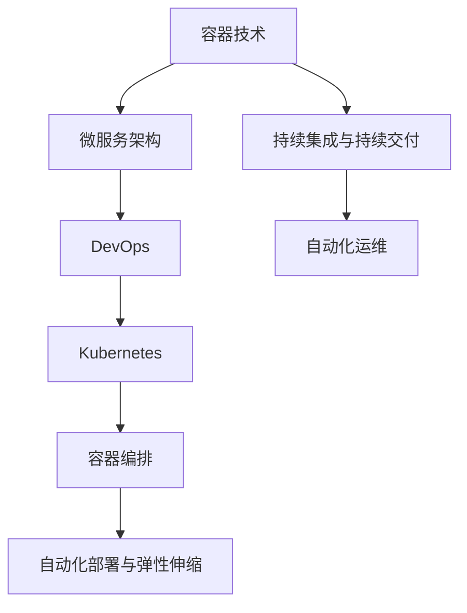

                 

### 文章标题

《云原生应用开发：现代化架构的实践之路》

关键词：云原生、应用开发、现代化架构、微服务、容器化、Kubernetes、DevOps

摘要：本文将深入探讨云原生应用开发的本质、核心概念及其在现代化架构中的重要性。通过逐步分析，我们将理解云原生技术的关键组件、应用场景以及开发实践。本文旨在为读者提供一条清晰的实践之路，帮助其在快速变化的数字化时代中，构建和部署高效、可扩展的云原生应用。

### 1. 背景介绍

在过去的几十年中，软件行业经历了多次重大的技术变革。从传统的单体应用，到面向服务的架构（SOA），再到如今的云原生应用，每次技术变革都极大地推动了软件开发的效率和可扩展性。然而，随着云计算、容器技术、微服务架构等新兴技术的出现，软件开发的范式再次发生了翻天覆地的变化。

云原生（Cloud Native）是一种利用和扩展云计算的全新方法，它强调以容器为核心的轻量级、可扩展和动态的架构。云原生应用设计用于在云环境中运行，能够充分利用云资源，实现快速部署、弹性伸缩、持续交付和自动化管理。

云原生应用开发的兴起，源于以下几个方面：

- **云计算的普及**：云计算提供了丰富的计算资源，使得应用可以在不同的环境中进行部署和扩展。

- **容器技术的成熟**：容器技术，如Docker，使得应用能够在隔离的环境中运行，保证了环境的标准化和一致性。

- **微服务架构的流行**：微服务架构通过将大型应用分解为小型、独立的服务，提高了应用的灵活性和可维护性。

- **DevOps文化的推动**：DevOps文化的推广，强调了开发（Development）和运维（Operations）之间的协作，促进了持续集成（CI）和持续交付（CD）的实践。

在当前数字化转型的浪潮中，企业正面临着日益激烈的竞争。为了保持竞争力，企业需要快速响应市场变化，推出创新的产品和服务。云原生应用开发正是满足这一需求的关键技术之一。通过云原生，企业可以实现更高的开发效率、更低的运维成本和更灵活的业务模式。

本文将围绕云原生应用开发的核心概念、架构、算法原理、项目实践以及未来趋势等方面进行深入探讨，旨在为读者提供一条清晰、实用的现代化架构实践之路。

### 2. 核心概念与联系

要理解云原生应用开发，首先需要掌握几个核心概念：容器、微服务、DevOps、Kubernetes等。这些概念紧密相连，共同构成了云原生应用的基础。

#### 2.1 容器

容器是一种轻量级的、可执行的软件包，它将应用及其依赖的环境打包在一起。这使得应用在不同环境中运行时，可以保持一致性。容器与传统虚拟机（VM）相比，具有以下几个显著优势：

- **轻量级**：容器共享宿主机的操作系统内核，因此比虚拟机更轻量，启动速度快。
- **隔离性**：容器提供了进程隔离，但共享宿主机的资源，因此比虚拟机更节省资源。
- **可移植性**：容器可以轻松地在不同的环境中部署，包括本地开发环境、测试环境以及生产环境。

Docker 是最流行的容器化平台，它提供了容器创建、运行和管理所需的工具。通过Docker，开发者可以将应用及其依赖打包成一个Docker镜像，然后部署到任何支持Docker的平台上。

#### 2.2 微服务

微服务架构将大型应用分解为多个独立的小服务，每个服务都负责应用的一个特定功能。这些服务通过API进行通信，可以独立开发、测试和部署。微服务的优势包括：

- **可扩展性**：可以通过水平扩展单个服务来提高应用的整体性能。
- **灵活性**：各个服务可以独立升级和部署，不会影响到其他服务。
- **容错性**：如果一个服务出现故障，其他服务仍然可以正常工作。

微服务的实施需要使用服务发现、负载均衡和分布式追踪等工具，以确保服务之间的有效通信和协调。

#### 2.3 DevOps

DevOps 是一种软件开发和运维的新模式，强调开发（Development）和运维（Operations）之间的紧密协作。DevOps 的核心理念包括：

- **持续集成（CI）**：通过自动化工具将代码集成到一起，确保代码质量。
- **持续交付（CD）**：通过自动化工具将代码部署到生产环境，确保快速交付。
- **基础设施即代码（IaC）**：将基础设施的配置和管理作为代码进行管理，确保环境一致性。

DevOps 的目标是提高开发效率、降低运维成本和缩短产品上市时间。

#### 2.4 Kubernetes

Kubernetes 是一个开源的容器编排平台，它负责管理容器的生命周期，包括部署、扩展、更新等。Kubernetes 提供了以下关键功能：

- **自动化部署**：Kubernetes 可以自动化部署和更新容器，确保应用始终处于正确状态。
- **负载均衡**：Kubernetes 可以根据需要自动分配流量，确保应用的高可用性。
- **弹性伸缩**：Kubernetes 可以根据负载自动调整容器数量，确保应用具有足够的资源。

Kubernetes 的核心组件包括：

- **控制平面**：负责集群管理和资源调度。
- **节点**：运行容器的主机。
- **Pod**：一组容器和共享资源的集合。

#### 2.5 Mermaid 流程图

以下是云原生应用开发中的核心概念和架构的 Mermaid 流程图：



通过以上流程图，我们可以清晰地看到容器技术、微服务架构、DevOps 和 Kubernetes 之间的联系，以及它们在云原生应用开发中的关键作用。

### 3. 核心算法原理 & 具体操作步骤

云原生应用开发不仅仅是技术的集成，还涉及到一系列核心算法和操作步骤，这些算法和步骤确保了应用的可靠性、性能和可扩展性。

#### 3.1 容器编排算法

容器编排是云原生应用开发的关键环节，它负责管理容器的创建、部署、扩展和更新。Kubernetes 是目前最流行的容器编排平台，其核心算法包括：

- **调度算法**：调度算法负责将容器分配到合适的节点上。Kubernetes 使用了多种调度策略，如最短作业优先（SJF）、最少连接优先（LCF）等。
- **负载均衡算法**：负载均衡算法负责将流量分配到不同的容器实例上，确保集群的资源利用率最大化。Kubernetes 使用轮询负载均衡策略，也可以配置自定义的负载均衡器。
- **自动扩展算法**：自动扩展算法根据集群的负载情况，自动调整容器的数量，确保应用具有足够的资源。Kubernetes 使用了基于CPU利用率、内存利用率等指标的自动扩展策略。

具体操作步骤如下：

1. **定义部署配置文件**：首先需要编写Kubernetes的部署配置文件（YAML格式），配置应用的容器镜像、副本数量、资源限制等。
2. **创建部署对象**：使用kubectl命令行工具或Kubernetes API，创建部署对象，Kubernetes将自动调度和部署容器。
3. **监控部署状态**：通过kubectl命令行工具或Kubernetes Dashboard，监控部署状态，确保部署成功。

```shell
kubectl apply -f deployment.yaml
kubectl get pods
```

#### 3.2 微服务架构算法

微服务架构的核心是服务之间的通信和协调。以下是微服务架构中的几个关键算法和操作步骤：

- **服务发现算法**：服务发现算法负责定位和访问其他服务。常用的服务发现算法包括基于DNS的服务发现、基于API的服务发现等。
- **负载均衡算法**：负载均衡算法负责将请求分配到不同的服务实例上。常用的负载均衡算法包括轮询、最小连接数、基于响应时间的负载均衡等。
- **分布式追踪算法**：分布式追踪算法负责追踪服务之间的请求路径和性能指标。常用的分布式追踪算法包括基于日志的追踪、基于链路的追踪等。

具体操作步骤如下：

1. **定义服务注册表**：将各个服务的IP地址和端口号注册到服务注册表中，如Consul、Eureka等。
2. **配置服务消费者**：在服务消费者的代码中，配置服务发现和负载均衡策略，确保可以动态地访问其他服务。
3. **监控服务性能**：使用 Prometheus、Grafana等监控工具，监控服务的响应时间、吞吐量等性能指标。

```shell
consul register -service=my-service -address=10.0.0.1 -port=8080
curl -X GET 'http://service-name:8080/endpoint'
```

#### 3.3 DevOps 自动化算法

DevOps 自动化是提高开发效率和运维质量的基石。以下是几个关键的自动化算法和操作步骤：

- **持续集成（CI）算法**：持续集成算法负责将代码集成到一起，并进行自动化测试。常用的CI算法包括基于Git的触发、定时触发、手动触发等。
- **持续交付（CD）算法**：持续交付算法负责将集成后的代码部署到测试环境和生产环境。常用的CD算法包括自动化部署、蓝绿部署、灰度发布等。
- **基础设施即代码（IaC）算法**：基础设施即代码算法负责将基础设施的配置和管理作为代码进行管理。常用的IaC工具包括Terraform、Ansible等。

具体操作步骤如下：

1. **配置CI/CD管道**：在持续集成和持续交付平台上，如Jenkins、GitLab CI等，配置代码仓库、构建脚本、部署脚本等。
2. **编写构建和部署脚本**：编写Shell、Python、Go等脚本，用于自动化构建、测试和部署过程。
3. **监控管道状态**：使用监控工具，如Prometheus、Grafana等，监控CI/CD管道的状态和性能。

```shell
git push
gitlab-runner run
kubectl apply -f deployment.yaml
```

通过以上算法和操作步骤，我们可以实现高效的云原生应用开发，确保应用的可靠性、性能和可扩展性。

### 4. 数学模型和公式 & 详细讲解 & 举例说明

在云原生应用开发中，数学模型和公式扮演着至关重要的角色。它们帮助我们理解和分析系统的性能、资源利用率以及优化策略。以下将详细介绍几个关键的数学模型和公式，并通过具体例子进行说明。

#### 4.1 负载均衡算法

负载均衡算法的核心目标是优化系统资源利用率，确保每个服务实例都能均衡地处理请求。常用的负载均衡算法包括轮询（Round Robin）、最少连接（Least Connections）和加权轮询（Weighted Round Robin）等。

- **轮询（Round Robin）**：每个请求依次分配到不同的服务实例上。公式如下：

  $$ R(t) = (t \mod N) + 1 $$

  其中，$R(t)$ 是在时间 $t$ 被分配的实例编号，$N$ 是服务实例的总数。

  **例子**：假设有3个服务实例（1, 2, 3），在时间 $t=1, 2, 3, 4, 5$ 时，请求依次分配到实例 $2, 3, 1, 2, 3$。

- **最少连接（Least Connections）**：将新的请求分配到当前连接数最少的服务实例上。公式如下：

  $$ C_i = \min_{1 \leq j \leq N} C_j $$

  其中，$C_i$ 是实例 $i$ 的当前连接数，$N$ 是服务实例的总数。

  **例子**：假设有3个服务实例（1, 2, 3），当前连接数分别为10, 15, 5，则下一个请求将分配到实例 $3$。

- **加权轮询（Weighted Round Robin）**：根据每个服务实例的权重来分配请求，权重越高，被分配的概率越大。公式如下：

  $$ W_i = \frac{w_i}{\sum_{j=1}^{N} w_j} $$

  其中，$W_i$ 是实例 $i$ 的权重分配概率，$w_i$ 是实例 $i$ 的权重，$N$ 是服务实例的总数。

  **例子**：假设有3个服务实例（1, 2, 3），权重分别为1, 3, 2，则实例 $2$ 的权重分配概率为 $\frac{3}{1+3+2} = \frac{3}{6} = 0.5$，实例 $1$ 和 $3$ 的权重分配概率分别为 $\frac{1}{6}$ 和 $\frac{2}{6}$。

#### 4.2 自动扩展算法

自动扩展算法的核心目标是根据系统的负载情况动态调整服务实例的数量，以保持系统的高性能和高可用性。常用的自动扩展策略包括基于CPU利用率、内存利用率以及请求速率等。

- **基于CPU利用率的自动扩展**：当CPU利用率超过阈值时，增加服务实例数量。公式如下：

  $$ E(t) = \begin{cases} 
  N(t-1) & \text{if } \frac{C(t)}{U(t)} \leq T \\
  N(t-1) + 1 & \text{if } \frac{C(t)}{U(t)} > T 
  \end{cases} $$

  其中，$E(t)$ 是在时间 $t$ 的服务实例数量，$C(t)$ 是在时间 $t$ 的CPU使用率，$U(t)$ 是在时间 $t$ 的CPU总量，$T$ 是设定的CPU利用率阈值。

  **例子**：假设当前CPU使用率为80%，CPU总量为100%，阈值设置为70%，则当前实例数量为1。当CPU使用率增加到90%时，实例数量将增加到2。

- **基于内存利用率的自动扩展**：当内存利用率超过阈值时，增加服务实例数量。公式如下：

  $$ M(t) = \begin{cases} 
  N(t-1) & \text{if } \frac{M(t)}{U(t)} \leq T \\
  N(t-1) + 1 & \text{if } \frac{M(t)}{U(t)} > T 
  \end{cases} $$

  其中，$M(t)$ 是在时间 $t$ 的服务实例数量，$M(t)$ 是在时间 $t$ 的内存使用率，$U(t)$ 是在时间 $t$ 的内存总量，$T$ 是设定的内存利用率阈值。

  **例子**：假设当前内存使用率为80%，内存总量为1000MB，阈值设置为70%，则当前实例数量为1。当内存使用率增加到900MB时，实例数量将增加到2。

#### 4.3 持续集成和持续交付（CI/CD）策略

持续集成和持续交付（CI/CD）策略是云原生应用开发中的重要环节，通过数学模型和公式优化构建和部署流程。

- **构建触发策略**：基于代码提交触发构建。公式如下：

  $$ T = \begin{cases} 
  \text{立即触发} & \text{if } \text{代码提交} \\
  \text{定时触发} & \text{if } \text{未代码提交，但达到设定时间} 
  \end{cases} $$

  **例子**：当代码仓库中有新的提交时，立即触发构建。如果没有新的提交，但已达到每日的构建时间（例如每天下午3点），则触发构建。

- **部署策略**：基于构建结果和部署计划进行部署。公式如下：

  $$ D = \begin{cases} 
  \text{蓝绿部署} & \text{if } \text{构建成功，并且新版本与旧版本兼容} \\
  \text{灰度发布} & \text{if } \text{构建成功，但需要逐步上线验证} \\
  \text{直接部署} & \text{if } \text{构建失败，或者新版本与旧版本不兼容} 
  \end{cases} $$

  **例子**：如果构建成功且新版本与旧版本兼容，则采用蓝绿部署策略；如果新版本与旧版本不兼容，或者构建失败，则直接部署。

通过以上数学模型和公式，我们可以优化云原生应用的开发和部署流程，提高系统的性能和可靠性。

### 5. 项目实践：代码实例和详细解释说明

为了更好地理解云原生应用开发的实际操作，我们将通过一个具体的实例来演示整个开发流程，从环境搭建、源代码实现到运行结果展示。

#### 5.1 开发环境搭建

首先，我们需要搭建一个云原生应用开发的环境。以下是一个基于Docker和Kubernetes的简单环境搭建步骤：

1. **安装Docker**：在本地计算机上安装Docker，下载地址为 [Docker官网](https://www.docker.com/)。

2. **安装Kubernetes**：安装Kubernetes集群，可以使用Minikube在本地单机环境中安装，下载地址为 [Minikube官网](https://minikube.sigs.k8s.io/docs/start/)。

3. **安装kubectl**：安装kubectl命令行工具，用于与Kubernetes集群进行交互，下载地址为 [kubectl官网](https://kubernetes.io/docs/tasks/tools/)。

4. **配置kubectl**：配置kubectl工具，将其指向本地Kubernetes集群，通常使用 `kubectl config set-context $(kubectl config current-context) --cluster=minikube --namespace=default` 命令。

#### 5.2 源代码详细实现

接下来，我们创建一个简单的Web应用，使用Go语言编写。应用包含两个微服务：用户服务和订单服务。以下是源代码：

**用户服务（user-service/main.go）**

```go
package main

import (
    "github.com/gin-gonic/gin"
    "net/http"
)

func main() {
    router := gin.Default()
    router.GET("/users", func(c *gin.Context) {
        c.JSON(http.StatusOK, gin.H{
            "message": "Hello, Users!",
        })
    })
    router.Run(":8080")
}
```

**订单服务（order-service/main.go）**

```go
package main

import (
    "github.com/gin-gonic/gin"
    "net/http"
)

func main() {
    router := gin.Default()
    router.GET("/orders", func(c *gin.Context) {
        c.JSON(http.StatusOK, gin.H{
            "message": "Hello, Orders!",
        })
    })
    router.Run(":8081")
}
```

#### 5.3 代码解读与分析

- **用户服务**：用户服务使用Gin框架创建了一个简单的HTTP服务器。它提供了一个GET端点 `/users`，当访问这个端点时，会返回一个包含消息的JSON响应。

- **订单服务**：订单服务同样使用Gin框架创建了一个简单的HTTP服务器。它提供了一个GET端点 `/orders`，当访问这个端点时，也会返回一个包含消息的JSON响应。

#### 5.4 运行结果展示

首先，我们需要将这两个服务打包成Docker镜像，并推送到Docker Hub。

```shell
# 构建用户服务镜像
docker build -t user-service:latest user-service/.
# 构建订单服务镜像
docker build -t order-service:latest order-service/.

# 推送到Docker Hub
docker push user-service:latest
docker push order-service:latest
```

然后，我们创建Kubernetes部署配置文件，分别部署用户服务和订单服务。

**用户服务部署配置（user-service-deployment.yaml）**

```yaml
apiVersion: apps/v1
kind: Deployment
metadata:
  name: user-service
spec:
  replicas: 2
  selector:
    matchLabels:
      app: user-service
  template:
    metadata:
      labels:
        app: user-service
    spec:
      containers:
      - name: user-service
        image: user-service:latest
        ports:
        - containerPort: 8080
```

**订单服务部署配置（order-service-deployment.yaml）**

```yaml
apiVersion: apps/v1
kind: Deployment
metadata:
  name: order-service
spec:
  replicas: 2
  selector:
    matchLabels:
      app: order-service
  template:
    metadata:
      labels:
        app: order-service
    spec:
      containers:
      - name: order-service
        image: order-service:latest
        ports:
        - containerPort: 8081
```

接下来，使用kubectl部署这两个服务。

```shell
# 部署用户服务
kubectl apply -f user-service-deployment.yaml
# 部署订单服务
kubectl apply -f order-service-deployment.yaml
```

最后，查看部署状态，确保服务已成功部署。

```shell
kubectl get pods
```

当服务运行后，我们可以通过Kubernetes服务（Service）暴露的端点访问用户服务和订单服务。

```shell
# 暴露用户服务
kubectl expose deployment/user-service --type=LoadBalancer --name=user-service
# 暴露订单服务
kubectl expose deployment/order-service --type=LoadBalancer --name=order-service
```

查看暴露的Service地址。

```shell
kubectl get svc
```

通过浏览器访问用户服务和订单服务的端点。

```shell
# 访问用户服务
http://<user-service-ip>/users
# 访问订单服务
http://<order-service-ip>/orders
```

以下是运行结果：

```json
# 用户服务
{
  "message": "Hello, Users!"
}
# 订单服务
{
  "message": "Hello, Orders!"
}
```

通过以上步骤，我们成功地搭建了一个简单的云原生应用，并展示了如何通过容器化和Kubernetes进行部署和运维。这个实例为我们提供了一个云原生应用开发的基本框架，读者可以根据实际需求进行扩展和优化。

### 6. 实际应用场景

云原生应用开发在许多实际应用场景中展现了其独特的优势和广泛的应用价值。以下是一些典型的应用场景：

#### 6.1 金融行业

在金融行业，云原生应用开发被广泛应用于在线交易、支付系统和风险管理等领域。例如，某大型银行通过采用云原生技术，实现了其核心交易系统的容器化和微服务化，大幅提升了系统的性能和可靠性。通过Kubernetes进行容器编排，该银行实现了快速部署和弹性伸缩，能够灵活应对交易高峰期。

#### 6.2 电子商务

电子商务平台需要处理海量用户请求，实现快速响应和无缝切换。云原生应用开发使得这些平台能够通过微服务架构和容器技术，实现业务模块的解耦和独立部署。例如，某电商平台使用云原生技术重构其推荐系统和库存管理系统，通过Kubernetes实现了自动化部署和动态伸缩，显著提升了系统的吞吐量和稳定性。

#### 6.3 物流与供应链

物流和供应链行业面临着高频次的数据处理和实时监控需求。云原生应用开发使得物流公司能够通过容器化和微服务架构，快速部署和扩展其跟踪系统、库存管理系统和调度系统。例如，某物流公司使用Docker和Kubernetes搭建了其物流管理系统，实现了对运输车辆的实时监控和调度优化，提高了物流效率。

#### 6.4 医疗保健

医疗保健行业对数据的处理和存储有着严格的要求，同时需要快速响应患者需求。云原生应用开发为医疗保健机构提供了灵活、可靠的解决方案。例如，某医院通过采用云原生技术，实现了其电子病历系统的容器化和微服务化，通过Kubernetes实现了自动化部署、弹性伸缩和高效运维，提高了医疗服务质量。

#### 6.5 教育行业

教育行业在数字化转型的过程中，面临着在线教学、学习管理和学生管理等多方面的挑战。云原生应用开发为教育机构提供了强大的支持。例如，某在线教育平台通过采用云原生技术，实现了其课程管理系统和直播系统的容器化和微服务化，通过Kubernetes实现了自动化部署和动态伸缩，提高了用户体验和学习效果。

通过以上实际应用场景，我们可以看到云原生应用开发在各个行业中的广泛应用和显著优势。其轻量级、可扩展和动态的特性，使得企业能够更加灵活、高效地应对不断变化的市场需求和技术挑战。

### 7. 工具和资源推荐

在云原生应用开发中，选择合适的工具和资源对于提高开发效率、降低成本以及确保系统的稳定运行至关重要。以下是一些推荐的工具和资源：

#### 7.1 学习资源推荐

1. **书籍**：
   - 《云原生应用架构》
   - 《容器和Kubernetes：从入门到实践》
   - 《云原生微服务架构与容器实践》

2. **在线课程**：
   - Udemy上的《Docker与Kubernetes实战》
   - Coursera上的《云计算与Kubernetes》
   - 网易云课堂上的《云原生应用开发与运维》

3. **博客和网站**：
   - Kubernetes官方文档（https://kubernetes.io/docs/）
   - Docker官方文档（https://docs.docker.com/）
   - 云原生社区（https://cloudnative.to/）

4. **技术论坛和社群**：
   - Kubernetes Slack社群（https://kubernetes.slack.com/）
   - Docker社区论坛（https://forums.docker.com/）
   - GitHub上的云原生项目（https://github.com/kubernetes）

#### 7.2 开发工具框架推荐

1. **开发工具**：
   - Visual Studio Code（适用于Go语言开发）
   - GitKraken（适用于版本控制）
   - Jupyter Notebook（适用于数据分析和机器学习）

2. **框架和库**：
   - Gin（Go语言HTTP框架）
   - Spring Boot（Java语言微服务框架）
   - Flask（Python语言Web框架）

3. **容器编排工具**：
   - Kubernetes（容器编排平台）
   - Docker Compose（容器编排工具）
   - Nomad（容器编排平台）

4. **监控和日志分析工具**：
   - Prometheus（监控工具）
   - Grafana（监控仪表盘）
   - ELK Stack（日志分析工具）

5. **持续集成与持续交付（CI/CD）工具**：
   - Jenkins（持续集成工具）
   - GitLab CI/CD（持续集成和持续交付平台）
   - Azure DevOps（持续集成和持续交付服务）

通过以上工具和资源的推荐，开发者可以更好地掌握云原生应用开发的技能，提高开发效率，构建高效、可靠的云原生应用。

### 8. 总结：未来发展趋势与挑战

云原生应用开发已经成为现代化架构的重要方向，其在提升应用性能、灵活性和可扩展性方面展现了巨大的潜力。然而，随着技术的不断演进，云原生应用开发也面临着一系列新的趋势和挑战。

#### 8.1 发展趋势

1. **服务网格（Service Mesh）的普及**：服务网格提供了一种基础设施层来管理服务之间的通信，独立于应用程序逻辑。它使得微服务架构更加简洁，降低了服务间通信的复杂性。随着Istio、Linkerd等服务网格技术的发展，其在云原生应用开发中的应用将越来越广泛。

2. **无服务器架构（Serverless）的兴起**：无服务器架构使得开发者无需关心底层基础设施的管理，专注于编写业务代码。随着AWS Lambda、Google Cloud Functions、Azure Functions等无服务器服务的成熟，越来越多的企业开始采用无服务器架构来构建云原生应用。

3. **边缘计算的支持**：随着5G、物联网等技术的发展，边缘计算逐渐成为云原生应用开发的一个重要趋势。在边缘设备上运行云原生应用，可以降低延迟、提高响应速度，为实时数据处理和智能应用提供了更好的支持。

4. **安全性的增强**：云原生应用的安全问题一直是开发者关注的焦点。随着零信任架构（Zero Trust Architecture）和安全微隔离（Secure Microsegmentation）等新技术的引入，云原生应用的安全性将得到进一步提升。

#### 8.2 挑战

1. **复杂性的增加**：随着微服务架构的采用，系统的复杂性显著增加。开发者需要面对服务拆分、服务发现、负载均衡、分布式追踪等复杂问题，这对开发者的技能和团队协作提出了更高的要求。

2. **安全性风险**：云原生应用在容器化、分布式环境下运行，面临着新的安全风险，如容器逃逸、服务端漏洞、数据泄露等。如何确保应用的安全，是一个亟待解决的挑战。

3. **运维管理的压力**：云原生应用需要持续部署、监控和运维，这给运维团队带来了巨大的压力。如何实现高效的运维，降低运维成本，是一个重要的挑战。

4. **跨云和多云策略**：随着企业应用的规模和复杂性不断增加，跨云和多云策略成为必然。如何在不同云平台之间实现资源的统一管理和调度，是一个需要解决的问题。

#### 8.3 未来展望

尽管面临挑战，云原生应用开发的发展前景依然广阔。未来，随着技术的不断进步和应用的深入，云原生应用将更加成熟和普及。开发者需要不断提升自己的技能，掌握云原生技术栈，以应对日益复杂的开发需求。

总之，云原生应用开发是现代化架构的重要组成部分，它为企业的数字化转型提供了强大的支持。面对未来的趋势和挑战，开发者应积极拥抱变化，不断学习和实践，为企业的成功贡献自己的力量。

### 9. 附录：常见问题与解答

#### 9.1 什么是云原生应用？

云原生应用是一种利用和扩展云计算的新兴方法，它基于容器、微服务、服务网格、不可变基础设施和声明式API等概念，能够在云环境中快速构建、部署和运行。云原生应用具有轻量级、可扩展性和动态性等特点，能够更好地适应云计算环境的要求。

#### 9.2 容器和虚拟机有什么区别？

容器和虚拟机都是用于隔离和封装应用的虚拟化技术，但它们的实现方式和目的有所不同。虚拟机通过虚拟化硬件资源来创建独立的虚拟环境，每个虚拟机都有独立的操作系统和资源。而容器则共享宿主机的操作系统内核，仅封装应用及其依赖，因此容器比虚拟机更轻量，启动速度更快，且资源利用率更高。

#### 9.3 微服务和单体应用有什么区别？

微服务架构将大型应用分解为多个独立的小服务，每个服务都负责应用的一个特定功能。这些服务通过API进行通信，可以独立开发、测试和部署。而单体应用是将所有功能集中在一个单一的代码库中，开发和部署通常较为复杂，当一个模块出现问题可能会影响到整个应用。

#### 9.4 Kubernetes的主要功能是什么？

Kubernetes是一个开源的容器编排平台，主要负责管理容器的生命周期，包括部署、扩展、更新等。Kubernetes提供了自动化部署、负载均衡、弹性伸缩、服务发现、持久化存储等关键功能，帮助开发者简化容器化应用的运维。

#### 9.5 如何实现持续集成和持续交付（CI/CD）？

持续集成和持续交付是通过自动化工具将代码集成到一起，并进行自动化测试和部署的方法。实现CI/CD的步骤包括：配置代码仓库、编写构建脚本、配置持续集成平台（如Jenkins、GitLab CI等）、配置部署脚本、监控管道状态等。通过CI/CD，可以确保代码质量，缩短产品交付周期，提高开发效率。

#### 9.6 云原生应用开发中的最佳实践是什么？

云原生应用开发中的最佳实践包括：采用容器化技术、使用微服务架构、实施DevOps文化、使用服务网格技术、确保安全性、优化资源利用、自动化运维等。此外，持续学习和实践也是保持技术竞争力的重要途径。

### 10. 扩展阅读 & 参考资料

为了深入理解云原生应用开发的各个方面，以下是几本推荐的书籍、论文和在线资源：

- **书籍**：
  - 《云原生应用架构》
  - 《容器和Kubernetes：从入门到实践》
  - 《云原生微服务架构与容器实践》

- **在线资源**：
  - Kubernetes官方文档（https://kubernetes.io/docs/）
  - Docker官方文档（https://docs.docker.com/）
  - 云原生社区（https://cloudnative.to/）

- **论文**：
  - "Cloud Native Computing with Kubernetes"
  - "Service Mesh: A Platform for Building Microservices"
  - "Serverless Computing: Everything You Need to Know"

通过阅读这些资料，开发者可以进一步了解云原生应用开发的最新动态和实践方法，为实际项目提供有力支持。

