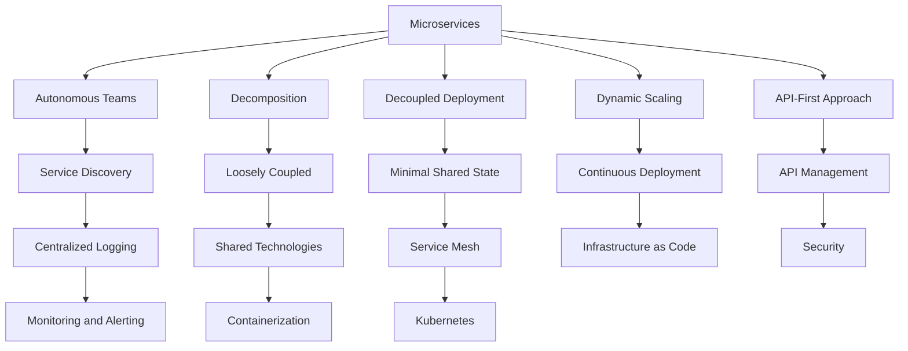
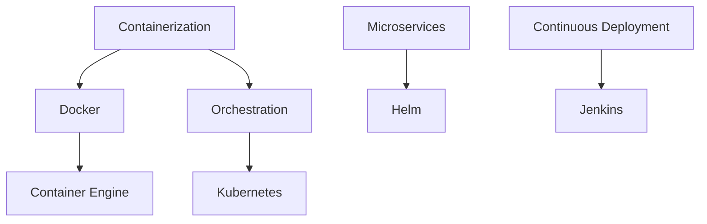
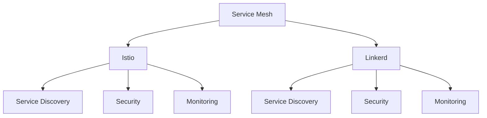
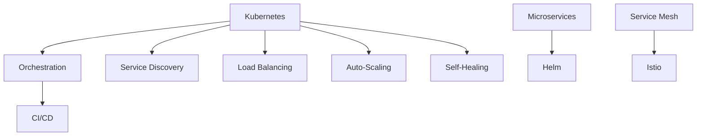

                 

### 云原生架构设计：构建可扩展的云端应用

#### 关键词 Keywords

- 云原生（Cloud Native）
- 微服务（Microservices）
- 可扩展性（Scalability）
- 虚拟化（Virtualization）
- 容器化（Containerization）
- 服务网格（Service Mesh）
- Kubernetes（K8s）
- 无状态（Stateless）

#### 摘要 Abstract

本文将深入探讨云原生架构的设计原则及其在构建可扩展云端应用中的应用。我们将从背景介绍、核心概念与联系、核心算法原理与具体操作步骤、数学模型和公式、项目实践、实际应用场景、工具和资源推荐以及未来发展趋势与挑战等多个角度，系统地阐述云原生架构的精髓。通过本文的阅读，读者将对云原生架构有一个全面而深入的理解，为后续在云端应用开发中的实践提供有力支持。

## 1. 背景介绍

在现代IT环境中，随着云计算、大数据、物联网等技术的快速发展，企业对应用程序的灵活性和可扩展性要求越来越高。传统的架构设计往往难以满足这些需求，因此云原生架构（Cloud Native Architecture）应运而生。云原生架构是一种利用云计算和分布式系统优势的新型应用架构，其核心特点是基于微服务（Microservices）和容器化（Containerization）技术，使得应用具有高度的可扩展性、高可用性、自动化和弹性。

云原生架构的兴起，源于以下几个方面：

1. **云计算的普及**：云计算提供了丰富的资源，使得企业能够按需扩展和缩应用规模，降低了IT基础设施的投入成本。
2. **容器技术的成熟**：容器技术，如Docker，使得应用的打包、部署和管理更加高效和灵活，成为云原生架构实现的基础。
3. **DevOps文化的普及**：DevOps文化的普及推动了持续集成（CI）和持续部署（CD）的实践，加快了应用的迭代速度。
4. **微服务架构的流行**：微服务架构将应用拆分成多个独立的小服务，使得开发、测试和部署更加灵活，易于管理和扩展。

## 2. 核心概念与联系

云原生架构涉及多个核心概念和技术，以下是这些概念之间的联系和关系：

#### 2.1 微服务架构（Microservices Architecture）

微服务架构是一种将应用程序拆分为一组独立的、小型、可独立部署的服务的方法。这些服务通常围绕业务功能进行组织，每个服务都可以独立开发、测试和部署。

**关系图**：



#### 2.2 容器化技术（Containerization Technology）

容器化技术，如Docker，提供了一种轻量级、可移植的应用封装方法。容器将应用程序及其运行时环境打包在一起，确保应用在不同环境中运行的一致性。

**关系图**：



#### 2.3 服务网格（Service Mesh）

服务网格（如Istio、Linkerd）提供了一种透明的服务间通信管理方法。它抽象了服务间的通信细节，使得开发者无需关心服务之间的网络交互，专注于业务逻辑的实现。

**关系图**：



#### 2.4 Kubernetes（Kubernetes）

Kubernetes是一个开源的容器编排平台，用于自动化部署、扩展和管理容器化应用。它是实现云原生架构的核心工具之一。

**关系图**：



## 3. 核心算法原理 & 具体操作步骤

云原生架构的实现依赖于多个核心算法和技术，以下是这些技术的原理和具体操作步骤：

#### 3.1 容器编排（Container Orchestration）

容器编排是一种管理容器生命周期的方法，包括容器的部署、扩展、更新和监控。Kubernetes 是最常用的容器编排工具。

**操作步骤**：

1. **编写Dockerfile**：定义容器的构建过程。
   ```dockerfile
   FROM python:3.8
   WORKDIR /app
   COPY requirements.txt .
   RUN pip install -r requirements.txt
   COPY . .
   CMD ["python", "app.py"]
   ```

2. **构建Docker镜像**：
   ```bash
   docker build -t myapp:1.0 .
   ```

3. **部署到Kubernetes集群**：
   ```yaml
   apiVersion: apps/v1
   kind: Deployment
   metadata:
     name: myapp
   spec:
     replicas: 3
     selector:
       matchLabels:
         app: myapp
     template:
       metadata:
         labels:
           app: myapp
       spec:
         containers:
         - name: myapp
           image: myapp:1.0
           ports:
           - containerPort: 80
   ```

4. **应用部署**：
   ```bash
   kubectl apply -f deployment.yaml
   ```

#### 3.2 服务发现（Service Discovery）

服务发现是一种自动发现和注册服务的方法，使客户端能够找到所需的服务实例。

**操作步骤**：

1. **部署服务注册中心**，如Consul。
2. **配置服务注册**：
   ```bash
   consul register -service=myapp -address=10.0.0.1:8080
   ```

3. **客户端发现服务**：
   ```bash
   curl http://consul agent/services | grep myapp
   ```

#### 3.3 负载均衡（Load Balancing）

负载均衡是一种分配网络流量到多个服务器的方法，以防止单点故障并提高系统的吞吐量。

**操作步骤**：

1. **部署负载均衡器**，如HAProxy。
2. **配置负载均衡规则**：
   ```bash
   haproxy -f /etc/haproxy/haproxy.cfg
   ```

3. **配置服务监听**：
   ```haproxy
   frontend myapp
     bind *:80
     mode http
     option http-log
     option http-close-on-retry
     balance roundrobin
     server myapp1 10.0.0.1:8080
     server myapp2 10.0.0.2:8080
   ```

#### 3.4 自愈机制（Self-Healing）

自愈机制是一种在系统出现故障时自动恢复服务的方法，以提高系统的可用性。

**操作步骤**：

1. **部署监控工具**，如Prometheus。
2. **配置告警规则**：
   ```yaml
   groups:
     - name: myapp-alerts
       rules:
       - alert: MyAppDown
         for: 5m
         expr: (1 - (myapp_http_200{job="myapp"} / myapp_http_request_total{job="myapp"})) * 100 > 10
         labels:
           severity: critical
         annotations:
           summary: "MyApp is down!"
           description: "HTTP 200 response rate is below 10%"
   ```

3. **配置自愈策略**：
   ```yaml
   kubectl rollout restart deployment/myapp
   ```

## 4. 数学模型和公式 & 详细讲解 & 举例说明

在云原生架构的设计中，一些数学模型和公式被用于评估系统的性能、可扩展性和可靠性。以下是一些常见的数学模型和公式的讲解与举例说明：

#### 4.1 可扩展性计算（Scalability Calculation）

可扩展性计算用于评估系统在负载增加时的性能变化。以下是一个简单的公式：

$$
\text{Scalability} = \frac{\text{Initial Load}}{\text{Final Load}} \times 100\%
$$

**举例说明**：

假设一个系统在初始负载时能处理1000个请求/秒，在最终负载时能处理5000个请求/秒，则其可扩展性为：

$$
\text{Scalability} = \frac{1000}{5000} \times 100\% = 80\%
$$

#### 4.2 吞吐量计算（Throughput Calculation）

吞吐量计算用于评估系统在单位时间内能处理的数据量。以下是一个简单的公式：

$$
\text{Throughput} = \frac{\text{Total Data Processed}}{\text{Time}}
$$

**举例说明**：

假设一个系统在1小时内处理了100GB的数据，则其吞吐量为：

$$
\text{Throughput} = \frac{100GB}{1h} = 100GB/h
$$

#### 4.3 可靠性计算（Reliability Calculation）

可靠性计算用于评估系统在特定时间内的无故障运行概率。以下是一个简单的公式：

$$
\text{Reliability} = \frac{\text{Number of Successful Runs}}{\text{Total Number of Runs}}
$$

**举例说明**：

假设一个系统在100次运行中成功运行了90次，则其可靠性为：

$$
\text{Reliability} = \frac{90}{100} = 0.9
$$

## 5. 项目实践：代码实例和详细解释说明

#### 5.1 开发环境搭建

在进行云原生架构的项目实践之前，需要搭建一个合适的开发环境。以下是一个基于Docker和Kubernetes的简单开发环境搭建步骤：

1. **安装Docker**：
   ```bash
   sudo apt-get update
   sudo apt-get install docker.io
   sudo systemctl start docker
   sudo systemctl enable docker
   ```

2. **安装Kubernetes**：
   - 使用Minikube在本地计算机上运行Kubernetes集群：
     ```bash
     minikube start --vm-driver=virtualbox
     ```

   - 安装Kubernetes命令行工具：
     ```bash
     curl -LO "https://storage.googleapis.com/kubernetes-release/release/$(curl -s https://storage.googleapis.com/kubernetes-release/release/stable.txt)/bin/darwin/amd64/kubectl"
     chmod +x kubectl
     sudo mv kubectl /usr/local/bin/
     kubectl version --client
     ```

3. **安装Helm**：
   - Helm是一个Kubernetes的包管理工具，用于简化应用的部署和管理。
   ```bash
   curl -fsSL -o get_helm.sh https://raw.githubusercontent.com/helm/helm/main/scripts/get-helm-3
   chmod 700 get_helm.sh
   ./get_helm.sh
   helm version
   ```

#### 5.2 源代码详细实现

以下是一个简单的微服务应用示例，包含用户服务（User Service）和订单服务（Order Service）。

**用户服务（User Service）**：

```python
# user_service.py
from flask import Flask, request, jsonify
from flask_sqlalchemy import SQLAlchemy

app = Flask(__name__)
app.config['SQLALCHEMY_DATABASE_URI'] = 'sqlite:///users.db'
db = SQLAlchemy(app)

class User(db.Model):
    id = db.Column(db.Integer, primary_key=True)
    username = db.Column(db.String(80), unique=True, nullable=False)
    email = db.Column(db.String(120), unique=True, nullable=False)

@app.route('/users', methods=['POST'])
def create_user():
    data = request.get_json()
    new_user = User(username=data['username'], email=data['email'])
    db.session.add(new_user)
    db.session.commit()
    return jsonify({'message': 'User created successfully.'})

if __name__ == '__main__':
    db.create_all()
    app.run(host='0.0.0.0', port=5000)
```

**订单服务（Order Service）**：

```python
# order_service.py
from flask import Flask, request, jsonify
from flask_sqlalchemy import SQLAlchemy

app = Flask(__name__)
app.config['SQLALCHEMY_DATABASE_URI'] = 'sqlite:///orders.db'
db = SQLAlchemy(app)

class Order(db.Model):
    id = db.Column(db.Integer, primary_key=True)
    user_id = db.Column(db.Integer, db.ForeignKey('user.id'))
    product = db.Column(db.String(120), nullable=False)

@app.route('/orders', methods=['POST'])
def create_order():
    data = request.get_json()
    new_order = Order(user_id=data['user_id'], product=data['product'])
    db.session.add(new_order)
    db.session.commit()
    return jsonify({'message': 'Order created successfully.'})

if __name__ == '__main__':
    db.create_all()
    app.run(host='0.0.0.0', port=5001)
```

#### 5.3 代码解读与分析

上述代码展示了两个微服务的基本实现。用户服务负责处理用户注册和存储，而订单服务负责处理订单创建和存储。以下是代码的解读与分析：

1. **用户服务**：
   - 使用Flask框架实现。
   - 使用SQLAlchemy作为ORM来操作SQLite数据库。
   - 提供了创建用户的功能，通过接收JSON格式的请求，创建新的用户记录。

2. **订单服务**：
   - 同样使用Flask框架实现。
   - 使用SQLAlchemy作为ORM来操作SQLite数据库。
   - 提供了创建订单的功能，通过接收JSON格式的请求，创建新的订单记录。

这两个服务可以通过REST API进行交互，例如，当创建新用户时，订单服务可以查询用户服务以获取用户信息，然后创建与之相关的订单。

#### 5.4 运行结果展示

在本地开发环境中，启动用户服务和订单服务后，可以通过以下命令进行测试：

```bash
# 启动用户服务
python user_service.py

# 启动订单服务
python order_service.py
```

通过Postman或其他工具，可以发送POST请求到`http://localhost:5000/users`创建新用户，然后发送POST请求到`http://localhost:5001/orders`创建新订单。例如：

```json
# 创建新用户的请求示例
POST http://localhost:5000/users
{
  "username": "john_doe",
  "email": "john.doe@example.com"
}

# 创建新订单的请求示例
POST http://localhost:5001/orders
{
  "user_id": 1,
  "product": "iPhone 13"
}
```

通过这种方式，我们可以验证微服务的正常工作。

## 6. 实际应用场景

云原生架构在现代IT领域中的应用场景广泛，以下是几个典型的应用案例：

#### 6.1 企业级应用

企业级应用，如电子商务平台、银行系统等，需要高可用性、高可靠性和高可扩展性。通过云原生架构，这些应用可以拆分成多个微服务，每个服务独立部署和管理，使得系统能够快速响应业务需求的变化。

#### 6.2 物联网（IoT）

物联网应用通常需要处理大量数据，并且设备可能分布在不同的地理位置。云原生架构提供了容器化和微服务化技术，使得IoT应用能够高效地部署和管理，同时保持系统的弹性和可扩展性。

#### 6.3 人工智能（AI）

人工智能应用，如机器学习、深度学习等，通常需要大量的计算资源。云原生架构利用云计算的资源池，可以动态分配计算资源，满足AI应用的需求，同时降低成本。

#### 6.4 游戏开发

游戏开发领域对实时性和可扩展性有较高要求。通过云原生架构，游戏服务可以拆分为多个微服务，实现高并发处理和弹性伸缩，同时降低开发和运维的复杂度。

## 7. 工具和资源推荐

在云原生架构的设计和实现过程中，选择合适的工具和资源至关重要。以下是一些建议：

### 7.1 学习资源推荐

- **书籍**：
  - 《云原生应用架构》
  - 《容器化和微服务实战》
  - 《Docker Deep Dive》

- **论文**：
  - 《Microservices: Designing Scalable Systems》
  - 《The Design of the UNIX Operating System》

- **博客**：
  - Kubernetes官方博客
  - Docker官方博客

- **网站**：
  - Kubernetes官网
  - Docker官网

### 7.2 开发工具框架推荐

- **开发框架**：
  - Flask
  - Django
  - Spring Boot

- **容器编排工具**：
  - Kubernetes
  - Docker Swarm

- **服务网格工具**：
  - Istio
  - Linkerd

### 7.3 相关论文著作推荐

- 《云原生技术全景图》
- 《Docker容器与容器云》
- 《Kubernetes权威指南》

## 8. 总结：未来发展趋势与挑战

云原生架构作为现代IT领域的重要技术趋势，其未来发展充满机遇与挑战。以下是未来发展趋势和挑战的总结：

### 发展趋势

1. **持续集成与持续部署（CI/CD）**：随着DevOps文化的普及，CI/CD将更加自动化和高效，加快应用的迭代速度。
2. **边缘计算**：边缘计算与云原生架构的结合，将使得数据更接近源头，提高响应速度和系统性能。
3. **自动化与智能化**：人工智能和机器学习将在云原生架构中发挥更大作用，提高系统的自动化水平和智能化程度。
4. **开源生态**：开源技术将在云原生架构中占据主导地位，推动技术革新和行业进步。

### 挑战

1. **复杂性与安全性**：随着云原生架构的复杂度增加，如何确保系统的安全性成为一个重要挑战。
2. **人才短缺**：云原生技术的快速发展导致了人才短缺，企业需要培养更多的专业人才。
3. **标准化**：缺乏统一的云原生架构标准和规范，不利于技术的普及和应用。
4. **迁移成本**：将现有系统迁移到云原生架构可能面临高昂的成本和风险。

## 9. 附录：常见问题与解答

### 问题1：什么是云原生架构？

**解答**：云原生架构是一种利用云计算和分布式系统优势的新型应用架构，其核心特点是基于微服务架构和容器化技术，使得应用具有高度的可扩展性、高可用性、自动化和弹性。

### 问题2：云原生架构与传统架构的区别是什么？

**解答**：传统架构通常采用单体应用和紧密耦合的服务，而云原生架构采用微服务架构和容器化技术，使得服务更加独立、可扩展和易于管理。

### 问题3：如何选择合适的容器编排工具？

**解答**：常见的容器编排工具有Kubernetes、Docker Swarm等。选择时主要考虑系统的规模、可扩展性、社区支持和生态系统。

### 问题4：云原生架构如何确保安全性？

**解答**：云原生架构通过安全编码实践、服务网格、自动化安全测试和持续监控来确保安全性。此外，应遵循最佳实践，如最小权限原则、安全配置和管理。

## 10. 扩展阅读 & 参考资料

- [Kubernetes官方文档](https://kubernetes.io/docs/)
- [Docker官方文档](https://docs.docker.com/)
- [云原生计算基金会（CNCF）网站](https://www.cncf.io/)
- [《云原生应用架构》](https://www.oreilly.com/library/view/cloud-native-application/9781492040771/)
- [《容器化和微服务实战》](https://www.oreilly.com/library/view/practical-container-and-microservices/9781449369768/)

