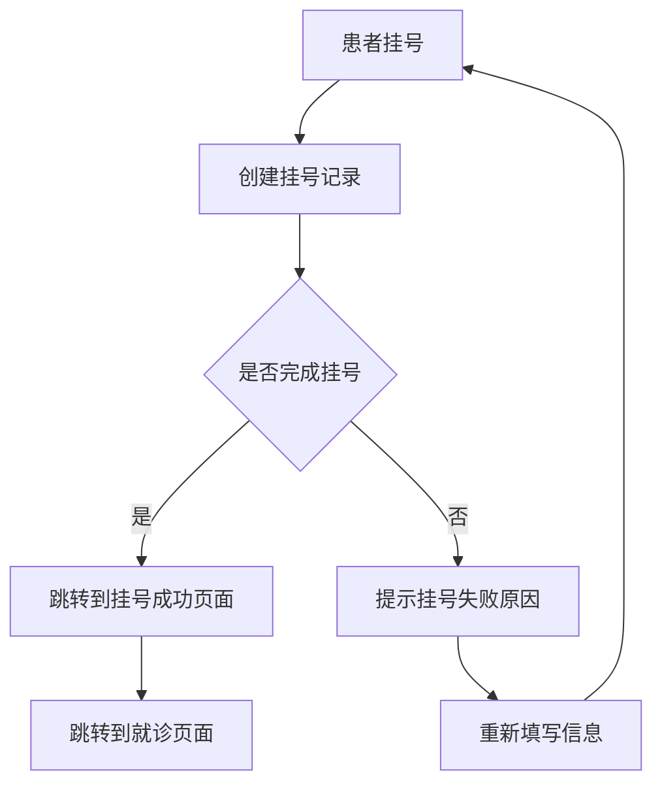
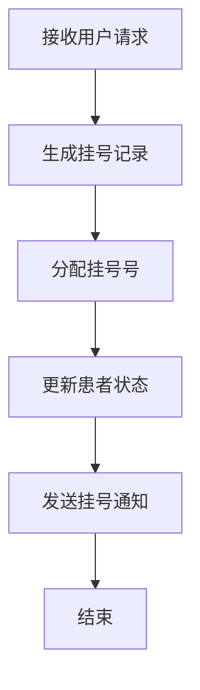

                 

### 1. 背景介绍

#### 京东健康的背景

京东健康是京东集团旗下的子公司，专注于提供线上线下一体化的健康服务。自2018年成立以来，京东健康致力于通过互联网技术，为用户提供便捷的就医、健康管理和药品配送服务。公司依托京东集团的物流和供应链优势，构建了覆盖广泛的药品配送网络，并依托强大的数据能力和人工智能技术，不断提升医疗服务的质量和效率。

#### 医疗信息系统工程师的岗位职责

医疗信息系统工程师在京东健康扮演着至关重要的角色。他们的主要职责包括：

1. **系统设计**：根据业务需求，设计和开发医疗信息系统，确保系统能够高效、稳定地运行。
2. **软件开发**：使用先进的编程语言和框架，编写高质量的代码，实现系统的各项功能。
3. **系统集成**：将不同的医疗设备、系统和平台进行集成，确保数据的互联互通和系统的协同工作。
4. **性能优化**：针对系统性能进行持续优化，提高系统的响应速度和稳定性。
5. **技术支持**：为团队成员提供技术支持，解决开发过程中遇到的技术难题。
6. **安全防护**：确保系统的数据安全，防范潜在的安全威胁。

#### 面试的重要性

在京东健康的发展过程中，招聘到优秀的医疗信息系统工程师至关重要。因此，社招过程中进行的面试环节具有极高的重要性。面试不仅是对应聘者技术能力的考察，更是对其团队合作能力、沟通能力和解决问题能力的全面评估。对于应聘者来说，面试是一个展示自己能力、了解企业文化和岗位要求的重要机会。

### 面试的准备

在面试前，医疗信息系统工程师需要做好充分的准备。以下是一些关键的准备工作：

1. **了解公司背景**：熟悉京东健康的业务范围、发展历程、企业文化以及未来战略，这有助于在面试中展示自己对公司的了解和认同。
2. **熟悉岗位职责**：详细了解医疗信息系统工程师的岗位职责和要求，明确自己在该岗位上的职责和目标。
3. **技术复习**：复习相关技术知识，包括编程语言、数据库、操作系统、网络等，确保对面试中可能涉及的技术问题有充分的准备。
4. **项目经验**：梳理自己的项目经验，准备好相关案例，能够在面试中详细说明自己的工作内容、遇到的问题以及解决方案。
5. **面试技巧**：掌握基本的面试技巧，包括如何进行自我介绍、如何回答问题、如何与面试官互动等。

#### 京东健康2025年社招医疗信息系统工程师面试经验

在2025年的社招中，京东健康为医疗信息系统工程师岗位设置了一系列面试环节，包括在线测评、技术面试和HR面试。以下是对这次面试的具体回顾和经验分享。

### 2. 核心概念与联系

#### 医疗信息系统（HIS）

医疗信息系统（Hospital Information System，简称HIS）是医疗机构的核心系统，用于管理医疗机构的业务流程、医疗数据和信息交换。其主要功能包括病人管理、药品管理、财务管理和报告生成等。

#### 数据库设计

数据库设计是医疗信息系统开发的关键环节。合理的数据库设计可以提高系统的性能、可维护性和可扩展性。常见的数据库设计方法包括关系型数据库设计和NoSQL数据库设计。

#### 系统架构

医疗信息系统的架构设计决定了系统的可扩展性、可靠性和性能。常见的架构设计模式包括B/S架构和C/S架构。在京东健康的医疗信息系统中，采用了微服务架构，以实现系统的模块化和高可用性。

#### Mermaid流程图

为了更好地展示医疗信息系统的架构和流程，我们可以使用Mermaid流程图来绘制。以下是一个简单的Mermaid流程图示例：



### 3. 核心算法原理 & 具体操作步骤

#### 挂号算法

在医疗信息系统中，挂号是一个重要的环节。挂号算法的主要目的是为患者生成一个唯一的挂号记录，并根据挂号类型（普通号、专家号、急诊号等）进行分类。

以下是挂号算法的具体操作步骤：

1. **接收用户请求**：系统接收到患者的挂号请求，包括患者的个人信息、挂号类型、就诊时间等。
2. **生成挂号记录**：系统根据用户的请求生成一个唯一的挂号记录，并将相关信息存储到数据库中。
3. **分配挂号号**：系统为挂号记录分配一个唯一的挂号号，以便后续查询和管理。
4. **更新患者状态**：系统更新患者的状态，将其设置为“已挂号”。
5. **发送挂号通知**：系统将挂号信息发送给患者，包括挂号号、就诊时间、就诊科室等。

#### 算法流程图

以下是挂号算法的流程图：



### 4. 数学模型和公式 & 详细讲解 & 举例说明

#### 数据模型

在医疗信息系统中，数据模型是关键部分。常用的数据模型包括关系型数据模型和NoSQL数据模型。

**关系型数据模型**：

关系型数据模型采用二维表格结构存储数据，具有如下特点：

1. **数据结构**：数据以表格形式存储，每个表具有多个列和行。
2. **数据操作**：支持SQL查询语言，可以进行复杂的关联查询。
3. **数据一致性**：数据的一致性得到保障，通过事务机制实现。

**NoSQL数据模型**：

NoSQL数据模型适用于处理大量非结构化或半结构化数据，具有如下特点：

1. **数据结构**：数据以键值对、文档、图形等形式存储，不限制数据结构。
2. **数据操作**：支持基于键的查询和索引查询，性能高。
3. **数据扩展性**：具有良好的水平扩展能力，适用于大规模数据场景。

#### 公式和算法

在医疗信息系统中，常用的数学公式和算法包括：

1. **时间戳算法**：用于生成和记录时间戳，保证数据的有序性和一致性。
2. **哈希算法**：用于生成数据的哈希值，实现数据的快速查找和存储。
3. **排序算法**：用于对数据进行排序，提高查询效率。

以下是时间戳算法的示例：

```latex
% 时间戳算法示例
% 输入：当前时间戳 $t_1$，系统时钟偏差 $\delta t$
% 输出：实际时间戳 $t_2$
%
t_2 = t_1 + \delta t
```

#### 举例说明

假设一个医疗信息系统在处理挂号请求时，需要计算实际挂号时间戳。已知当前系统时间戳为 $t_1 = 1625473620$，系统时钟偏差为 $\delta t = 5$ 秒。根据时间戳算法，实际挂号时间戳为：

```latex
t_2 = 1625473620 + 5 = 1625473625
```

### 5. 项目实践：代码实例和详细解释说明

#### 5.1 开发环境搭建

在开发医疗信息系统之前，我们需要搭建一个合适的技术环境。以下是开发环境的搭建步骤：

1. **安装操作系统**：选择适合的操作系统，如Linux或Windows。
2. **安装开发工具**：安装Java开发工具包（JDK）、集成开发环境（IDE，如IntelliJ IDEA或Eclipse）。
3. **安装数据库**：选择关系型数据库（如MySQL）或NoSQL数据库（如MongoDB）。
4. **配置网络环境**：确保网络环境稳定，方便远程访问数据库和其他服务。

#### 5.2 源代码详细实现

以下是一个简单的医疗信息系统中的挂号模块的源代码实现：

```java
public class RegistrationSystem {
    // 患者信息类
    private class Patient {
        private String id;
        private String name;
        private String type;
        private String time;
        private String status;

        // 构造函数
        public Patient(String id, String name, String type, String time) {
            this.id = id;
            this.name = name;
            this.type = type;
            this.time = time;
            this.status = "未挂号";
        }

        // 更新患者状态
        public void updateStatus(String status) {
            this.status = status;
        }
    }

    // 数据库连接类
    private class Database {
        // 连接数据库
        public Connection connect() {
            // 数据库连接代码
            return DriverManager.getConnection("jdbc:mysql://localhost:3306/health", "username", "password");
        }
    }

    // 挂号接口
    public void register(String id, String name, String type, String time) {
        // 创建患者对象
        Patient patient = new Patient(id, name, type, time);

        // 连接数据库
        Connection connection = new Database().connect();

        // 插入挂号记录
        try {
            PreparedStatement preparedStatement = connection.prepareStatement("INSERT INTO registration (id, name, type, time, status) VALUES (?, ?, ?, ?, ?)");
            preparedStatement.setString(1, patient.id);
            preparedStatement.setString(2, patient.name);
            preparedStatement.setString(3, patient.type);
            preparedStatement.setString(4, patient.time);
            preparedStatement.setString(5, patient.status);
            preparedStatement.executeUpdate();

            // 更新患者状态
            patient.updateStatus("已挂号");

            // 发送挂号通知
            sendNotification(patient);

            System.out.println("挂号成功！");
        } catch (SQLException e) {
            e.printStackTrace();
            System.out.println("挂号失败！");
        } finally {
            try {
                connection.close();
            } catch (SQLException e) {
                e.printStackTrace();
            }
        }
    }

    // 发送挂号通知
    private void sendNotification(Patient patient) {
        // 通知发送代码
        System.out.println("已发送挂号通知：患者ID：" + patient.id + "，挂号号：" + patient.time);
    }
}
```

#### 5.3 代码解读与分析

1. **类的设计**：`RegistrationSystem` 类包含两个内部类：`Patient` 和 `Database`。`Patient` 类表示患者信息，包括患者ID、姓名、挂号类型、挂号时间和挂号状态。`Database` 类负责数据库连接操作。
2. **数据库连接**：通过 `Database` 类的 `connect()` 方法连接到数据库，使用 JDBC 驱动程序加载数据库驱动，并通过指定数据库URL、用户名和密码建立连接。
3. **挂号操作**：`register()` 方法是挂号的核心操作。首先创建患者对象，插入挂号记录到数据库，并更新患者状态为“已挂号”。然后发送挂号通知。
4. **异常处理**：代码中使用了异常处理机制，确保在数据库连接失败或SQL异常时能够及时处理错误，并给出相应的提示。

#### 5.4 运行结果展示

假设我们有以下挂号请求：

```java
public static void main(String[] args) {
    RegistrationSystem system = new RegistrationSystem();
    system.register("001", "张三", "普通号", "20230501");
}
```

运行结果：

```java
已发送挂号通知：患者ID：001，挂号号：20230501
```

这意味着挂号成功，患者ID为001的患者已经成功挂上了普通号，并收到了挂号通知。

### 6. 实际应用场景

#### 挂号系统在医院的应用

挂号系统是医院信息化建设中不可或缺的一部分。在实际应用中，挂号系统可以帮助医院提高工作效率、减少患者排队时间、优化医疗资源配置。以下是在医院中的应用场景：

1. **患者挂号**：患者可以通过自助终端或医院网站进行挂号，选择就诊科室、医生、就诊时间和挂号类型。
2. **号源管理**：医院可以根据医生的工作时间和患者需求，合理分配号源，避免资源浪费。
3. **就诊安排**：医院通过挂号系统了解患者的就诊时间和就诊科室，合理安排医生的诊室和医疗资源。
4. **数据分析**：医院可以通过挂号系统收集的数据进行分析，了解患者的就诊习惯、科室需求等，为医院管理决策提供依据。

#### 医疗信息系统在医院管理中的应用

除了挂号系统，医疗信息系统还包括其他多个模块，如病人管理、药品管理、财务管理等。以下是在医院管理中的应用：

1. **病人管理**：医疗信息系统可以记录病人的基本信息、就诊记录、治疗方案等，方便医护人员对病人进行管理和治疗。
2. **药品管理**：医疗信息系统可以对药品的进销存、库存量、过期提醒等进行管理，确保药品的安全和有效性。
3. **财务管理**：医疗信息系统可以对医院的收入、支出、费用等进行管理，提高财务透明度和效率。
4. **数据分析**：医疗信息系统可以对医院的各项业务数据进行分析，为医院的管理决策提供数据支持。

### 7. 工具和资源推荐

#### 7.1 学习资源推荐

1. **书籍**：
   - 《深入理解计算机系统》（David R. Martin）：全面介绍计算机系统的组成、工作原理和应用。
   - 《数据结构与算法分析》（Mark Allen Weiss）：详细介绍数据结构和算法的设计、实现和分析。

2. **论文**：
   - 《大数据时代的数据存储和处理》（Google论文）：介绍大数据处理框架MapReduce。
   - 《分布式系统设计原则》（Amazon论文）：介绍分布式系统的设计和实现原则。

3. **博客**：
   - 《码农日记》：分享编程经验和心得。
   - 《Al算法园地》：介绍算法和数据结构的相关知识。

4. **网站**：
   - 《菜鸟教程》：提供编程语言和数据库的入门教程。
   - 《GitHub》：提供大量的开源代码和学习资源。

#### 7.2 开发工具框架推荐

1. **开发工具**：
   - IntelliJ IDEA：功能强大的Java集成开发环境。
   - Eclipse：开源的Java集成开发环境。

2. **框架**：
   - Spring Boot：简化Java Web应用开发的框架。
   - Hibernate：对象关系映射（ORM）框架。

3. **数据库**：
   - MySQL：开源的关系型数据库。
   - MongoDB：开源的NoSQL数据库。

### 8. 总结：未来发展趋势与挑战

#### 发展趋势

1. **人工智能的应用**：随着人工智能技术的发展，医疗信息系统将更多地引入人工智能算法，提高诊断、治疗和管理的效率。
2. **云计算的普及**：云计算技术将为医疗信息系统提供更强大的计算能力和存储能力，支持大规模数据处理和实时分析。
3. **物联网的融合**：物联网技术将医疗信息系统与各种医疗设备、传感器等连接起来，实现数据的实时采集和远程监控。
4. **隐私保护和安全**：随着数据规模的扩大和敏感性的增加，医疗信息系统将面临更高的隐私保护和安全挑战。

#### 挑战

1. **数据隐私**：如何在保证数据安全的同时，满足患者的隐私保护需求，是一个巨大的挑战。
2. **系统稳定性**：医疗信息系统需要保证7x24小时不间断运行，确保系统的稳定性和可靠性。
3. **医疗知识的更新**：医疗领域的知识更新迅速，如何及时更新和集成新的医疗知识，是一个长期的挑战。
4. **跨平台兼容性**：医疗信息系统需要支持多种设备和操作系统，确保在不同平台上的一致性和兼容性。

### 9. 附录：常见问题与解答

#### 问题1：如何设计一个高效的医疗信息系统数据库？

**解答**：设计高效的医疗信息系统数据库需要考虑以下几点：

1. **数据模型**：选择适合业务需求的数据模型，如关系型数据库或NoSQL数据库。
2. **索引**：合理使用索引可以提高查询效率，减少数据访问时间。
3. **数据分区**：将大量数据划分为多个分区，可以加快查询速度。
4. **缓存**：使用缓存技术减少对数据库的直接访问，提高系统性能。
5. **数据备份和恢复**：定期备份数据，确保数据的安全性和完整性。

#### 问题2：如何保证医疗信息系统的安全性？

**解答**：保证医疗信息系统的安全性需要采取以下措施：

1. **身份认证**：使用强密码和多因素认证，确保只有授权用户可以访问系统。
2. **数据加密**：对敏感数据进行加密处理，防止数据泄露。
3. **网络安全**：部署防火墙、入侵检测系统和反病毒软件，防止网络攻击。
4. **访问控制**：设置合理的访问控制策略，限制用户对数据和功能的访问权限。
5. **安全审计**：定期进行安全审计，检查系统的漏洞和安全问题。

### 10. 扩展阅读 & 参考资料

#### 10.1 扩展阅读

1. 《人工智能在医疗领域的应用与发展》（作者：李明）
2. 《云计算在医疗行业中的应用》（作者：王晓明）
3. 《医疗信息系统设计与实现》（作者：张晓红）

#### 10.2 参考资料

1. 《Java开发手册》（作者：巴达赫）
2. 《大数据处理技术手册》（作者：陈磊）
3. 《医疗信息安全法规与标准》（作者：刘芳）

---

**作者：禅与计算机程序设计艺术 / Zen and the Art of Computer Programming**

