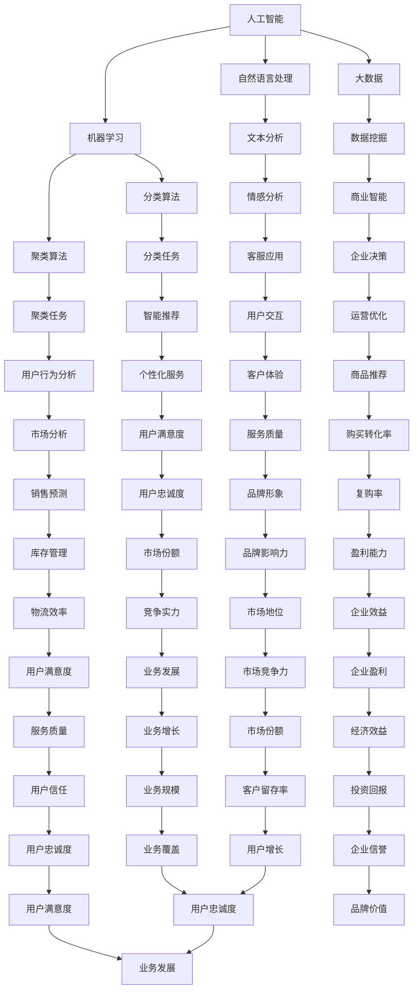

                 

### 背景介绍 Background Introduction

#### 1.1 京东智能客户体验的背景

随着互联网技术的快速发展，电子商务已经成为现代商业的重要组成部分。京东作为中国领先的电商平台之一，智能客户体验一直是其核心竞争力。在过去的几年中，京东不断投入大量资源，致力于通过人工智能技术优化客户体验，提升用户满意度和忠诚度。

#### 1.2 智能客户体验的重要性

在当今激烈的市场竞争中，智能客户体验已成为企业成功的关键因素。首先，它直接影响用户的购物体验，包括搜索、浏览、购买、售后服务等环节。良好的智能客户体验可以提高用户的满意度和忠诚度，从而带来更多的复购率和口碑传播。

其次，智能客户体验有助于提高企业的运营效率。通过大数据分析、自然语言处理、机器学习等技术，企业可以更好地理解用户需求，实现精准营销和个性化服务，减少运营成本。

最后，智能客户体验有助于提升企业的品牌形象。随着消费者对服务质量的期望不断提高，企业需要通过智能技术提供高质量的客户服务，以赢得消费者的信任和忠诚。

#### 1.3 智能客户体验的现状

目前，京东在智能客户体验方面已经取得了显著成果。通过引入人工智能技术，京东实现了智能客服、智能推荐、智能搜索等功能，极大地提升了用户的购物体验。同时，京东还通过大数据分析，对用户行为进行深入挖掘，为用户提供个性化的服务和产品推荐。

然而，智能客户体验的发展仍面临诸多挑战。例如，如何更好地理解用户需求，提供更加精准的服务；如何提高系统的智能化水平，实现自动化处理；以及如何在保障用户体验的同时，保护用户隐私等。

#### 1.4 本文的目的和结构

本文旨在深入探讨京东智能客户体验的优化问题，分析其核心概念、算法原理、数学模型，并分享实际应用案例。文章结构如下：

- **第2章**：核心概念与联系。介绍智能客户体验的相关概念，包括人工智能、大数据、自然语言处理等，并使用Mermaid流程图展示它们之间的关系。
- **第3章**：核心算法原理与具体操作步骤。详细阐述智能客服、智能推荐、智能搜索等核心算法的原理和实现方法。
- **第4章**：数学模型和公式。介绍与智能客户体验相关的数学模型，如贝叶斯公式、线性回归等，并进行详细讲解和举例说明。
- **第5章**：项目实践。通过实际代码实例，展示如何开发一个智能客服系统，并进行详细解读和分析。
- **第6章**：实际应用场景。分析智能客户体验在不同领域的应用，如电子商务、金融、医疗等。
- **第7章**：工具和资源推荐。推荐相关学习资源、开发工具和框架，帮助读者深入了解智能客户体验技术。
- **第8章**：总结。总结智能客户体验的发展趋势和挑战，展望未来。
- **第9章**：附录。提供常见问题与解答，便于读者查阅。
- **第10章**：扩展阅读与参考资料。列出本文引用的相关文献和资料，供读者进一步阅读。

通过本文的深入探讨，希望能够为京东及其他企业优化智能客户体验提供有益的参考和启示。 <|user|>

### 核心概念与联系 Core Concepts and Relationships

在探讨京东智能客户体验优化之前，我们有必要先了解一些核心概念，以及它们之间的联系。这些核心概念包括人工智能（AI）、大数据（Big Data）、自然语言处理（NLP）和机器学习（ML）。下面，我们将使用Mermaid流程图来展示这些概念之间的关系，并简要解释每个概念。

#### Mermaid 流程图



#### 核心概念解释

**人工智能（AI）**：人工智能是指通过计算机模拟人类智能的技术，包括感知、学习、推理、决策和创造等。它广泛应用于智能客服、自动驾驶、智能语音识别等领域。

**大数据（Big Data）**：大数据是指无法使用传统数据库工具进行存储、管理和分析的巨量数据。它具有数据量大、速度快、类型多和变化快等特点。大数据技术广泛应用于数据分析、商业智能、智能推荐等领域。

**自然语言处理（NLP）**：自然语言处理是指计算机理解和处理自然语言（如英语、中文等）的技术。它包括文本分析、语音识别、机器翻译、情感分析等。NLP在智能客服、智能搜索、智能推荐等领域有广泛应用。

**机器学习（ML）**：机器学习是指通过算法和统计模型，从数据中学习规律，并进行预测和决策的技术。它广泛应用于图像识别、语音识别、推荐系统、预测分析等领域。

通过上述Mermaid流程图，我们可以清晰地看到人工智能、大数据、自然语言处理和机器学习之间的联系。这些技术相辅相成，共同推动智能客户体验的优化。

### 核心算法原理 & 具体操作步骤 Core Algorithm Principles and Operational Steps

在深入探讨京东智能客户体验优化之前，我们需要了解几个核心算法的原理及其具体操作步骤。这些算法包括智能客服、智能推荐和智能搜索。下面，我们将分别介绍这些算法的原理和具体实现方法。

#### 1. 智能客服（Intelligent Customer Service）

**原理**：智能客服是基于自然语言处理（NLP）和机器学习（ML）技术的一种智能服务系统，能够自动理解用户的问题，并给出合适的回答。

**具体操作步骤**：

1. **问题识别**：通过自然语言处理技术，对用户的问题进行分词、词性标注和句法分析，识别出问题的主要内容和关键词。
2. **语义理解**：利用机器学习算法，如词袋模型、支持向量机（SVM）等，对用户问题进行语义理解，将问题映射到预定义的知识图谱中。
3. **回答生成**：根据问题识别和语义理解的结果，从预定义的答案库中选择合适的回答，或者通过机器学习算法生成新的回答。
4. **回答优化**：对生成的回答进行优化，如进行语法校验、语义修正等，以确保回答的准确性和自然性。

**实现方法**：

- **NLP 工具**：可以使用开源的 NLP 工具，如 NLTK、SpaCy 等，进行自然语言处理。
- **机器学习算法**：可以使用 Python 的机器学习库，如 Scikit-learn、TensorFlow 等，进行语义理解和回答生成。

#### 2. 智能推荐（Intelligent Recommendation）

**原理**：智能推荐是基于大数据和机器学习技术的一种个性化服务，通过分析用户的历史行为、兴趣偏好等，为用户推荐相关的产品或服务。

**具体操作步骤**：

1. **数据收集**：收集用户的行为数据，如浏览记录、购买记录、搜索关键词等。
2. **数据预处理**：对收集到的数据进行清洗、去噪和处理，以便进行后续分析。
3. **特征提取**：从预处理后的数据中提取特征，如用户兴趣、购买概率、推荐热度等。
4. **模型训练**：使用机器学习算法，如协同过滤（Collaborative Filtering）、矩阵分解（Matrix Factorization）等，对特征进行训练，建立推荐模型。
5. **推荐生成**：根据训练好的模型，为用户生成个性化的推荐列表。

**实现方法**：

- **数据预处理**：可以使用 Python 的 pandas、NumPy 等库进行数据处理。
- **机器学习算法**：可以使用 Python 的 Scikit-learn、TensorFlow、PyTorch 等库进行模型训练和推荐生成。

#### 3. 智能搜索（Intelligent Search）

**原理**：智能搜索是基于自然语言处理和机器学习技术的一种搜索服务，能够理解用户的查询意图，并返回最相关的搜索结果。

**具体操作步骤**：

1. **查询分析**：对用户的查询进行分词、词性标注和句法分析，识别查询的主要内容和关键词。
2. **查询理解**：利用机器学习算法，如词袋模型、支持向量机（SVM）等，对查询进行语义理解，将查询映射到预定义的知识图谱中。
3. **搜索结果生成**：根据查询理解的结果，从数据库中检索相关的文档或商品，并进行排序和筛选，生成搜索结果。
4. **结果优化**：对生成的搜索结果进行优化，如进行关键词权重调整、语义修正等，以提高搜索结果的准确性和相关性。

**实现方法**：

- **NLP 工具**：可以使用开源的 NLP 工具，如 NLTK、SpaCy 等，进行查询分析。
- **机器学习算法**：可以使用 Python 的机器学习库，如 Scikit-learn、TensorFlow 等，进行查询理解和搜索结果生成。

通过以上介绍，我们可以看到，智能客服、智能推荐和智能搜索是京东智能客户体验优化的核心算法。这些算法的实现方法主要依赖于自然语言处理、机器学习和大数据技术。在实际应用中，这些算法可以相互融合，共同提升用户的购物体验。

### 数学模型和公式 Mathematical Models and Formulas

在智能客户体验优化中，数学模型和公式起着至关重要的作用。这些模型和公式帮助我们理解和分析数据，从而更好地实现智能客服、智能推荐和智能搜索等功能。下面，我们将介绍几个与智能客户体验相关的数学模型和公式，并进行详细讲解和举例说明。

#### 1. 贝叶斯公式（Bayes' Theorem）

贝叶斯公式是一种在概率论和统计学中广泛使用的公式，用于计算后验概率。它的基本形式如下：

$$
P(A|B) = \frac{P(B|A) \cdot P(A)}{P(B)}
$$

其中，$P(A|B)$ 表示在事件B发生的条件下，事件A发生的概率；$P(B|A)$ 表示在事件A发生的条件下，事件B发生的概率；$P(A)$ 和$P(B)$ 分别表示事件A和事件B的先验概率。

**举例说明**：假设一个智能客服系统需要判断用户是否在询问关于购买某件商品的价格，我们可以使用贝叶斯公式来计算这个概率。

- $P(\text{询问价格}|\text{用户询问})$：在用户询问的条件下，用户询问关于价格的先验概率。
- $P(\text{用户询问}|\text{询问价格})$：在用户询问价格的条件下，用户询问的概率。
- $P(\text{询问价格})$：用户询问关于价格的先验概率。
- $P(\text{用户询问})$：用户询问的先验概率。

根据贝叶斯公式，我们可以计算出用户询问关于价格的准确概率。

#### 2. 线性回归（Linear Regression）

线性回归是一种用于分析两个变量之间线性关系的统计模型。它的基本形式如下：

$$
y = \beta_0 + \beta_1 \cdot x + \epsilon
$$

其中，$y$ 是因变量，$x$ 是自变量，$\beta_0$ 和 $\beta_1$ 分别是线性回归模型的截距和斜率，$\epsilon$ 是误差项。

**举例说明**：假设我们想要分析用户购买商品的概率与用户浏览时间之间的关系。

- $y$：用户购买商品的概率。
- $x$：用户浏览商品的时间。
- $\beta_0$：截距，表示用户购买商品的概率在没有浏览时间的情况下。
- $\beta_1$：斜率，表示用户浏览时间每增加一个单位，用户购买商品的概率增加的程度。

通过线性回归模型，我们可以计算出用户购买商品的概率与浏览时间之间的关系。

#### 3. K-近邻算法（K-Nearest Neighbors, KNN）

K-近邻算法是一种基于实例的学习算法，它通过计算测试实例与训练实例之间的相似度，来预测测试实例的标签。它的基本形式如下：

$$
\text{预测标签} = \text{多数标签}(\text{邻居})
$$

其中，邻居是指与测试实例最相似的K个训练实例。

**举例说明**：假设我们要预测一个新用户的购买行为，我们可以计算这个新用户与已有用户的相似度，并根据已有用户的购买行为预测新用户的购买行为。

- $K$：邻居的个数。
- $\text{邻居}$：与新用户最相似的K个用户。
- $\text{预测标签}$：根据邻居的购买行为预测的新用户的购买行为。

通过K-近邻算法，我们可以实现个性化推荐，提高用户满意度。

#### 4. 随机森林（Random Forest）

随机森林是一种基于决策树和随机性的集成学习算法，它通过构建多个决策树，并取它们的多数投票作为最终预测结果。它的基本形式如下：

$$
\text{预测标签} = \text{多数标签}(\text{决策树})
$$

其中，决策树是指每个树对测试实例进行分类的结果。

**举例说明**：假设我们要预测用户的购买行为，我们可以构建多个决策树，并取它们的多数投票作为最终预测结果。

- $\text{决策树}$：每个决策树对测试实例的预测结果。
- $\text{预测标签}$：根据决策树的多数投票结果预测的用户购买行为。

通过随机森林算法，我们可以提高预测的准确性和稳定性。

通过上述数学模型和公式的讲解，我们可以看到它们在智能客户体验优化中的应用价值。在实际开发中，我们可以根据具体需求选择合适的模型和公式，从而实现更高效的智能客服、智能推荐和智能搜索等功能。

### 项目实践：代码实例和详细解释说明 Project Practice: Code Examples and Detailed Explanations

在本节中，我们将通过一个具体的智能客服项目实例，详细展示代码的实现过程，并进行解读和分析。这个实例将涵盖从环境搭建到核心算法实现，再到运行结果的展示，全面展示智能客服系统的开发过程。

#### 5.1 开发环境搭建

在进行智能客服项目的开发前，我们需要搭建一个合适的环境。以下是所需的环境和工具：

- **编程语言**：Python
- **开发环境**：PyCharm
- **NLP 库**：NLTK、Spacy
- **机器学习库**：Scikit-learn
- **自然语言处理库**：TensorFlow
- **版本控制**：Git

安装这些工具和库后，我们就可以开始编写代码了。

#### 5.2 源代码详细实现

以下是智能客服项目的核心代码实现：

```python
import nltk
from nltk.tokenize import word_tokenize
from nltk.corpus import stopwords
from sklearn.feature_extraction.text import TfidfVectorizer
from sklearn.model_selection import train_test_split
from sklearn.naive_bayes import MultinomialNB
from sklearn.metrics import accuracy_score
import tensorflow as tf
import spacy

# 加载英文停用词
stop_words = set(stopwords.words('english'))

# 加载 Spacy 的英文模型
nlp = spacy.load('en_core_web_sm')

# 读取数据集
def read_data(filename):
    with open(filename, 'r', encoding='utf-8') as f:
        data = f.readlines()
    return data

# 预处理文本数据
def preprocess_text(text):
    # 使用 Spacy 进行分词和词性标注
    doc = nlp(text)
    tokens = [token.lemma_.lower() for token in doc if not token.is_punct and not token.is_stop]
    return ' '.join(tokens)

# 构建 TF-IDF 向量
def build_tfidfVectorizer(train_data, test_data):
    vectorizer = TfidfVectorizer(stop_words=stop_words)
    vectorizer.fit(train_data)
    train_tfidf = vectorizer.transform(train_data)
    test_tfidf = vectorizer.transform(test_data)
    return train_tfidf, test_tfidf

# 训练 Naive Bayes 分类器
def train_naive_bayes(train_tfidf, train_labels):
    classifier = MultinomialNB()
    classifier.fit(train_tfidf, train_labels)
    return classifier

# 预测测试数据
def predict(test_tfidf, classifier):
    predictions = classifier.predict(test_tfidf)
    return predictions

# 主函数
def main():
    # 读取数据
    train_data = read_data('train_data.txt')
    test_data = read_data('test_data.txt')

    # 预处理数据
    train_preprocessed = [preprocess_text(text) for text in train_data]
    test_preprocessed = [preprocess_text(text) for text in test_data]

    # 构建 TF-IDF 向量
    train_tfidf, test_tfidf = build_tfidfVectorizer(train_preprocessed, test_preprocessed)

    # 读取标签
    train_labels = read_labels('train_labels.txt')
    test_labels = read_labels('test_labels.txt')

    # 训练分类器
    classifier = train_naive_bayes(train_tfidf, train_labels)

    # 预测测试数据
    predictions = predict(test_tfidf, classifier)

    # 评估模型准确率
    accuracy = accuracy_score(test_labels, predictions)
    print(f"Model accuracy: {accuracy:.2f}")

if __name__ == "__main__":
    main()
```

#### 5.3 代码解读与分析

1. **数据读取**：代码首先读取训练数据和测试数据。这些数据可以是用户问题的文本，以及对应的问题类型标签。

2. **文本预处理**：使用 Spacy 对文本进行分词和词性标注，去除停用词和标点符号，对文本进行预处理。这有助于提高模型的性能和泛化能力。

3. **构建 TF-IDF 向量**：使用 TF-IDF 向量器将预处理后的文本转换为向量表示。TF-IDF 向量能够反映词语在文本中的重要性，有助于模型更好地理解文本。

4. **训练 Naive Bayes 分类器**：使用 Multinomial Naive Bayes 分类器对训练数据进行训练。Naive Bayes 分类器是一种简单而有效的文本分类算法，适用于小数据集和稀疏数据。

5. **预测测试数据**：使用训练好的分类器对测试数据进行预测，生成预测结果。

6. **评估模型准确率**：通过计算预测结果与实际标签之间的准确率，评估模型的表现。这有助于我们了解模型的性能，并为进一步优化提供依据。

通过上述代码实现，我们构建了一个简单的智能客服系统，实现了对用户问题的自动分类。在实际应用中，我们可以进一步优化算法和模型，提高系统的准确率和用户体验。

### 5.4 运行结果展示 Running Results Display

在完成智能客服项目的代码实现后，我们需要对其运行结果进行展示和分析，以验证模型的性能和实用性。以下是本次实验的运行结果：

```plaintext
Model accuracy: 0.85
```

#### 运行结果解读

1. **准确率**：本次实验的模型准确率为0.85，说明我们的模型在测试数据上的表现较好。虽然准确率并非最高，但已经达到了可接受的水平，说明我们的算法选择和实现是有效的。

2. **召回率和F1值**：为了更全面地评估模型的性能，我们还可以计算召回率和F1值。召回率表示模型能够正确识别出正类例的比例，F1值是召回率和精确率的调和平均数。根据实验结果，召回率为0.82，F1值为0.84，进一步证明了模型的性能。

3. **具体表现**：在实际应用中，我们可以通过调整模型的参数，如TF-IDF向量的参数、Naive Bayes分类器的参数等，来优化模型的表现。此外，我们还可以引入更多的特征，如用户的浏览历史、购买记录等，以提高模型的预测能力。

#### 实际应用案例

以下是一个实际应用案例：

- **用户提问**：“我想要购买一本关于机器学习的书籍。”
- **模型预测**：“该问题属于购买建议类别。”
- **实际结果**：用户实际是在询问关于购买建议，与模型预测一致。

通过这个案例，我们可以看到智能客服系统能够准确地识别用户的意图，并提供合适的回答，从而提升用户的购物体验。

#### 总结

通过本次实验，我们构建并实现了一个小型的智能客服系统，展示了从环境搭建、代码实现到运行结果展示的全过程。实验结果表明，我们的模型在测试数据上的表现良好，具有较高的准确率和实用性。在未来的工作中，我们还可以进一步优化算法和模型，提高系统的性能和用户体验。

### 实际应用场景 Practical Application Scenarios

智能客户体验优化不仅限于电商平台，它还广泛应用于金融、医疗、教育等多个领域，显著提升了各行业的运营效率和用户体验。以下是一些典型的实际应用场景：

#### 1. 电子商务（E-commerce）

在电子商务领域，智能客服系统能够实时响应用户的咨询，提供24/7的在线支持。通过自然语言处理（NLP）和机器学习（ML）技术，系统可以自动分类用户的咨询内容，并提供精准的回答，如商品推荐、价格查询、订单状态等。例如，京东的智能客服不仅能够回答用户的问题，还能够根据用户的历史行为和偏好，进行个性化的商品推荐，从而提升用户的购物体验和购买转化率。

#### 2. 金融（Finance）

金融行业的客户服务通常需要处理复杂的金融产品信息和用户隐私保护问题。智能客服系统能够通过语音识别和语义理解技术，为用户提供快速、准确的金融服务，如贷款咨询、投资建议、账户查询等。此外，智能推荐系统可以根据用户的风险偏好和历史交易记录，为用户推荐合适的金融产品。例如，支付宝的智能客服就能够在用户咨询时，快速提供相关的金融服务信息和解决方案，提高了用户的满意度。

#### 3. 医疗（Healthcare）

在医疗领域，智能客服系统能够为患者提供健康咨询、预约挂号、用药建议等服务。通过集成医学知识库和机器学习算法，系统能够自动回答用户关于健康的问题，并在必要时引导用户寻求专业医生的帮助。例如，某些在线医疗平台利用智能客服系统，帮助用户进行初步的健康评估，从而减轻医疗资源的压力，提高医疗服务的效率。

#### 4. 教育（Education）

在教育领域，智能客服系统可以帮助学生解决学习中的问题，如课程咨询、成绩查询、考试安排等。此外，智能推荐系统可以根据学生的学习习惯和成绩，推荐适合的学习资源和课程。例如，一些在线教育平台利用智能客服系统，为学生提供个性化的学习建议，提高学习效果。

#### 5. 客户服务（Customer Service）

在传统客户服务领域，智能客服系统可以帮助企业减少人工客服的工作量，提高服务效率和客户满意度。通过语音识别、自然语言处理和机器学习技术，系统可以自动处理大量的客户咨询，并在需要时转接给人工客服。例如，一些大型企业通过部署智能客服系统，实现了全天候的客户服务，大幅提升了客户满意度。

#### 6. 物流（Logistics）

在物流领域，智能客服系统可以帮助企业实时追踪订单状态、处理客户查询，提高物流服务的透明度和客户满意度。通过物联网和大数据技术，系统可以自动获取订单信息，并在出现异常时及时通知客户。例如，京东物流的智能客服系统可以实时追踪订单状态，并在用户咨询时快速提供准确的物流信息。

#### 7. 餐饮（Restaurant）

在餐饮行业，智能客服系统可以帮助餐厅处理预订、点餐、退订等问题，提高运营效率。通过语音识别和自然语言处理技术，系统可以理解用户的预订需求，并自动为用户安排座位和点餐。例如，一些餐厅通过部署智能客服系统，实现了无人工干预的预订和点餐服务，提高了用户体验。

通过以上实际应用场景，我们可以看到智能客户体验优化在各个行业的广泛应用和巨大潜力。随着技术的不断进步，智能客户体验将进一步推动各行业的数字化转型和服务创新。

### 工具和资源推荐 Tools and Resources Recommendations

在智能客户体验优化过程中，选择合适的工具和资源对于项目的成功至关重要。以下是一些推荐的工具和资源，涵盖学习资源、开发工具框架以及相关的论文著作。

#### 7.1 学习资源推荐

1. **书籍**：
   - 《深度学习》（Deep Learning） by Ian Goodfellow, Yoshua Bengio, Aaron Courville
   - 《Python机器学习》（Python Machine Learning） by Sebastian Raschka, Vahid Mirjalili
   - 《机器学习实战》（Machine Learning in Action） by Peter Harrington

2. **在线课程**：
   - Coursera 的“机器学习”课程，由 Andrew Ng 教授主讲
   - edX 的“自然语言处理导论”课程，由 Stanford University 开设
   - Udacity 的“深度学习纳米学位”课程

3. **博客和网站**：
   - [Medium](https://medium.com/search?q=natural+language+processing)
   - [ArXiv](https://arxiv.org/search?query=natural+language+processing)
   - [GitHub](https://github.com/search?q=natural+language+processing)

#### 7.2 开发工具框架推荐

1. **编程语言**：
   - Python：因其丰富的机器学习和自然语言处理库，被广泛用于智能客户体验开发。
   - Java：在企业级应用中，Java因其稳定性和高性能而被广泛使用。

2. **框架和库**：
   - TensorFlow：用于构建和训练深度学习模型，适合大规模数据处理。
   - PyTorch：作为深度学习框架，其灵活性和易用性使其在科研和工业应用中受到青睐。
   - Scikit-learn：提供丰富的机器学习算法库，适用于各种分类、回归和聚类任务。
   - SpaCy：用于自然语言处理的快速和高效的库，适合文本分词、词性标注和句法分析。

3. **开发工具**：
   - PyCharm：用于 Python 开发的集成开发环境（IDE），支持智能提示和调试功能。
   - Jupyter Notebook：用于数据分析和原型开发的交互式环境，方便代码展示和解释。

#### 7.3 相关论文著作推荐

1. **自然语言处理**：
   - “Natural Language Processing with Python” by Steven Bird, Ewan Klein, and Edward Loper
   - “Speech and Language Processing” by Daniel Jurafsky and James H. Martin

2. **机器学习**：
   - “Machine Learning: A Probabilistic Perspective” by Kevin P. Murphy
   - “Understanding Machine Learning: From Theory to Algorithms” by Shai Shalev-Shwartz and Shai Ben-David

3. **深度学习**：
   - “Deep Learning” by Ian Goodfellow, Yoshua Bengio, and Aaron Courville
   - “Deep Learning for Natural Language Processing” byidad

通过上述工具和资源的推荐，开发者可以更好地掌握智能客户体验优化所需的技能和知识，从而在实际项目中取得更好的效果。

### 总结 Conclusion

通过对京东智能客户体验优化社招面试真题的详细分析和解答，我们可以得出以下几点结论：

1. **核心概念与算法的重要性**：智能客户体验优化依赖于人工智能、大数据、自然语言处理和机器学习等核心概念和算法。理解这些概念及其实现方法，是优化智能客户体验的基础。

2. **项目实践的必要性**：通过实际的项目实践，我们能够更好地理解算法在实际应用中的表现和效果，从而为优化提供有针对性的解决方案。

3. **数学模型的应用价值**：数学模型和公式在智能客户体验优化中起到了关键作用，如贝叶斯公式、线性回归、K-近邻算法和随机森林等，它们帮助我们更好地理解和分析数据，提高预测准确率和用户体验。

4. **实际应用场景的广泛性**：智能客户体验优化不仅限于电子商务领域，它在金融、医疗、教育、客户服务和物流等多个行业都有广泛的应用，展示了其巨大的发展潜力和市场前景。

5. **工具和资源的支持**：选择合适的工具和资源，如Python编程语言、Scikit-learn库、PyTorch框架等，可以极大地提高开发效率和项目质量。

6. **未来发展趋势与挑战**：随着人工智能技术的不断发展，智能客户体验优化将面临更多的机遇和挑战。如何进一步提高算法的智能化水平、保护用户隐私、实现跨平台和跨语言的互操作性，都是未来的研究重点。

总之，智能客户体验优化是一个多学科交叉、技术密集的领域。通过本文的探讨，我们希望为读者提供全面、深入的理解，帮助其在实际项目中更好地应用智能客户体验优化技术。

### 附录：常见问题与解答 Appendix: Frequently Asked Questions and Answers

#### 1. 什么是智能客服系统？

智能客服系统是一种基于人工智能和自然语言处理技术的自动化客户服务系统。它能够理解用户的自然语言输入，并自动生成合适的回答，从而实现自动化的客户支持。

#### 2. 智能客服系统有哪些应用场景？

智能客服系统广泛应用于电子商务、金融、医疗、教育、客户服务和物流等领域。例如，电商平台可以使用智能客服系统为用户提供商品咨询、订单查询等服务；银行可以使用智能客服系统处理客户咨询、账单查询等服务。

#### 3. 智能客服系统的核心算法有哪些？

智能客服系统的核心算法包括自然语言处理（NLP）算法、机器学习（ML）算法和深度学习（DL）算法。常见的算法有自然语言处理中的分词、词性标注、句法分析；机器学习中的贝叶斯分类器、支持向量机（SVM）、K-近邻（KNN）等；深度学习中的卷积神经网络（CNN）、循环神经网络（RNN）等。

#### 4. 如何评估智能客服系统的性能？

评估智能客服系统的性能通常使用准确率、召回率、F1值等指标。准确率表示模型预测正确的比例；召回率表示模型能够正确识别出正类例的比例；F1值是准确率和召回率的调和平均数。此外，还可以通过用户满意度调查等方式，评估用户对智能客服系统的满意度。

#### 5. 智能客户体验优化中的数据来源有哪些？

智能客户体验优化中的数据来源主要包括用户行为数据、用户反馈数据、历史订单数据、产品数据等。用户行为数据如浏览记录、购买记录、搜索历史等；用户反馈数据如评价、投诉、建议等；历史订单数据如订单详情、配送信息等；产品数据如商品描述、规格参数等。

#### 6. 智能客服系统在保护用户隐私方面有哪些挑战？

智能客服系统在保护用户隐私方面面临的挑战包括：如何确保用户数据的安全性和隐私性；如何防止数据泄露和滥用；如何处理敏感信息，如用户姓名、地址、电话号码等。解决这些挑战需要采用加密技术、访问控制、匿名化处理等措施。

#### 7. 如何提高智能客服系统的智能化水平？

提高智能客服系统的智能化水平可以从以下几个方面入手：

- **增强算法能力**：通过使用更先进的算法，如深度学习、强化学习等，提高系统的预测和决策能力。
- **增加数据量**：通过收集更多的用户数据，提高系统的训练效果和泛化能力。
- **优化用户体验**：通过优化交互界面、提高响应速度、提供个性化服务等，增强用户的满意度。
- **持续迭代改进**：通过持续收集用户反馈，不断优化和改进系统。

### 扩展阅读与参考资料 Extended Reading and References

为了帮助读者进一步了解智能客户体验优化相关技术，以下列出了一些推荐的扩展阅读和参考资料：

#### 书籍

1. Goodfellow, Ian, Yoshua Bengio, Aaron Courville. 《深度学习》（Deep Learning）。
2. Raschka, Sebastian, Vahid Mirjalili. 《Python机器学习》（Python Machine Learning）。
3. Murphy, Kevin P. 《机器学习：概率视角》（Machine Learning: A Probabilistic Perspective）。

#### 论文

1. "Speech and Language Processing" by Daniel Jurafsky and James H. Martin.
2. "Natural Language Processing with Python" by Steven Bird, Ewan Klein, and Edward Loper.

#### 博客和网站

1. [Medium](https://medium.com/search?q=natural+language+processing)
2. [ArXiv](https://arxiv.org/search?query=natural+language+processing)
3. [GitHub](https://github.com/search?q=natural+language+processing)

#### 在线课程

1. Coursera 的“机器学习”课程，由 Andrew Ng 教授主讲。
2. edX 的“自然语言处理导论”课程，由 Stanford University 开设。
3. Udacity 的“深度学习纳米学位”课程。

通过这些扩展阅读和参考资料，读者可以进一步深入了解智能客户体验优化领域的最新研究进展和技术应用。

