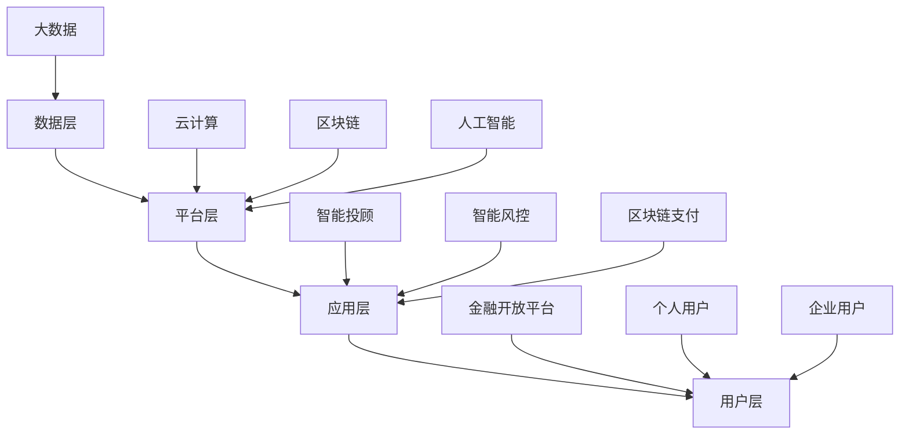

                 

### 1. 背景介绍

京东科技，作为中国领先的科技驱动型企业，始终秉持着"技术驱动创新，创新引领未来"的理念，深耕于人工智能、大数据、云计算等领域。作为京东集团的核心板块，京东科技以其卓越的技术实力和丰富的实践经验，不断推动金融科技的发展与创新。

2025年，金融科技行业迎来了前所未有的变革与机遇。面对数字化转型的浪潮，京东科技再次展现出其强大的技术实力和市场洞察力。其社招金融科技工程师的面试，成为业内关注的焦点。

本文将以亲身经历，分享京东科技2025年社招金融科技工程师的面试经验。通过本文，希望能够为广大求职者提供一些有益的启示和借鉴，帮助大家更好地准备金融科技领域的面试。

金融科技（FinTech）作为现代金融业的重要组成部分，涵盖了支付、理财、保险、银行等多个领域。其核心在于利用先进的技术手段，提高金融服务的效率、降低成本、增强用户体验。

近年来，随着大数据、云计算、区块链等技术的快速发展，金融科技的应用场景不断拓展，其市场前景也愈发广阔。无论是传统金融机构，还是新兴科技企业，都在积极布局金融科技领域，以期在未来的竞争中占据优势地位。

在这个背景下，京东科技社招金融科技工程师的面试，不仅是对求职者技术能力和实战经验的考察，更是对其创新能力和团队协作能力的考验。因此，对于求职者来说，充分准备和了解面试流程，是成功的关键。

接下来，我们将详细探讨京东科技面试的各个环节，包括简历筛选、笔试、面试准备、面试过程以及面试技巧。希望通过这些分享，能够为准备金融科技领域面试的读者提供一些有益的参考。

### 2. 核心概念与联系

#### 2.1 金融科技的定义

金融科技（FinTech）是指利用技术手段创新金融产品和服务，提升金融效率、降低成本、优化用户体验的一种新兴模式。它涵盖的范围广泛，包括支付、理财、保险、信贷、交易、资产管理等多个领域。

金融科技的核心在于将前沿技术应用于金融领域，实现金融服务的数字化、智能化和个性化。其主要技术包括：

1. **大数据**：通过对海量数据的采集、存储、处理和分析，挖掘用户需求，优化风险管理，提升金融服务的精准度。
2. **云计算**：通过分布式计算和存储技术，提供弹性、高效、安全的云计算服务，满足金融业务的高并发和大规模数据处理需求。
3. **区块链**：通过去中心化的分布式账本技术，实现数据的透明、不可篡改和安全共享，降低交易成本，提升金融服务的可信度。
4. **人工智能**：利用机器学习、深度学习等技术，实现智能投顾、智能风控、智能客服等应用，提升金融服务的智能化水平。

#### 2.2 金融科技架构

金融科技架构是支撑金融科技创新的核心基础设施。一个典型的金融科技架构包括以下几个方面：

1. **数据层**：负责数据采集、存储、处理和分析。数据来源包括内部数据（如交易数据、用户行为数据）和外部数据（如社交媒体数据、市场数据）。
2. **平台层**：提供数据加工、分析和应用的工具和平台，包括大数据平台、云计算平台、区块链平台等。
3. **应用层**：实现金融服务的具体功能，包括支付、理财、保险、信贷等。
4. **用户层**：金融服务的最终用户，包括个人用户和企业用户。

#### 2.3 金融科技与传统的区别

金融科技与传统的金融模式相比，具有以下显著区别：

1. **技术驱动**：金融科技以技术为驱动，利用大数据、云计算、人工智能等前沿技术提升金融服务的效率和质量。
2. **数字化**：金融科技通过数字化手段实现金融服务的全流程在线化，提升用户体验。
3. **智能化**：金融科技利用人工智能技术实现智能决策、智能风控、智能客服等应用，提高金融服务的智能化水平。
4. **个性化**：金融科技通过大数据分析和个性化推荐，实现金融服务的个性化定制。

#### 2.4 金融科技的发展趋势

随着技术的不断进步和金融市场的不断变革，金融科技的发展趋势呈现出以下特点：

1. **数字化转型**：越来越多的金融机构将数字化转型作为战略重点，通过引入金融科技提升业务效率和用户体验。
2. **智能化升级**：人工智能技术在金融领域的应用越来越广泛，智能投顾、智能风控等应用场景不断涌现。
3. **区块链技术的应用**：区块链技术逐渐成熟，其在金融领域的应用场景不断拓展，包括跨境支付、供应链金融等。
4. **开放银行**：随着金融科技的快速发展，开放银行成为大势所趋，金融机构通过开放API接口，与其他科技公司合作，提供更丰富的金融产品和服务。

#### 2.5 京东科技的金融科技布局

京东科技在金融科技领域有着广泛的布局，其核心业务包括：

1. **金融科技服务**：提供大数据分析、云计算、区块链等技术解决方案，帮助金融机构提升业务效率和用户体验。
2. **金融产品**：推出智能投顾、智能风控、区块链支付等产品，满足个人和企业用户的金融需求。
3. **金融开放平台**：通过开放API接口，与其他科技公司合作，提供丰富的金融产品和服务。

总的来说，金融科技作为现代金融业的重要组成部分，正以前所未有的速度发展。京东科技作为金融科技领域的领军企业，以其卓越的技术实力和创新的业务模式，引领着金融科技的发展潮流。对于求职者来说，了解金融科技的核心概念和架构，是成功应对金融科技面试的重要基础。

#### 2.6 Mermaid 流程图

为了更直观地展示金融科技的核心概念和架构，我们使用Mermaid流程图进行描述。以下是金融科技架构的Mermaid流程图：



通过这个流程图，我们可以清晰地看到金融科技从数据采集、存储、处理，到应用层的金融服务，最终实现用户价值的过程。

### 3. 核心算法原理 & 具体操作步骤

#### 3.1 大数据分析

在大数据分析领域，京东科技采用了多种先进的算法和技术，以提高数据处理和分析的效率。以下是京东科技在大数据领域常用的核心算法原理：

1. **Hadoop生态系统**：Hadoop是一个开源的大数据处理框架，包括HDFS（Hadoop分布式文件系统）和MapReduce（一种分布式数据处理模型）。通过Hadoop，京东科技可以高效地处理海量数据，实现数据的分布式存储和并行计算。
2. **Spark**：Spark是另一种开源的大数据处理引擎，具有高性能、内存计算和易于扩展的特点。Spark支持多种数据处理操作，如批处理、流处理和机器学习，适用于高并发的数据处理场景。
3. **机器学习**：京东科技在大数据领域广泛应用机器学习算法，如决策树、随机森林、支持向量机等，用于数据分类、预测和聚类分析，提升数据分析和决策的准确性。

具体操作步骤如下：

1. **数据采集**：通过京东科技的数据采集系统，收集来自不同来源的数据，如交易数据、用户行为数据、市场数据等。
2. **数据存储**：使用HDFS或分布式数据库（如HBase、MongoDB）存储海量数据，确保数据的安全性和可靠性。
3. **数据处理**：使用MapReduce或Spark等分布式计算框架，对数据进行清洗、转换和聚合操作，提取有用信息。
4. **数据可视化**：通过数据可视化工具（如Tableau、Power BI），将数据处理结果以图表、仪表盘等形式展示，帮助决策者更好地理解数据。
5. **机器学习**：使用机器学习算法，对数据进行建模和预测，如用户行为预测、风险识别等，为业务决策提供支持。

#### 3.2 云计算

云计算是金融科技的核心基础设施之一，京东科技在云计算领域采用了以下核心算法和技术：

1. **容器化技术**：容器化技术（如Docker、Kubernetes）提供轻量级、可移植、自给自足的软件打包方式，实现应用的快速部署和弹性扩展。
2. **服务器虚拟化**：服务器虚拟化技术（如VMware、Xen）通过虚拟化层，将物理服务器资源抽象成虚拟资源，提高资源利用率和灵活性。
3. **分布式存储**：分布式存储技术（如HDFS、Ceph）提供高可用、高可靠、海量数据存储解决方案，满足金融业务的大规模数据处理需求。

具体操作步骤如下：

1. **基础设施搭建**：搭建云计算基础设施，包括服务器、存储、网络等硬件设备，以及虚拟化软件和容器化平台。
2. **资源配置**：根据业务需求，动态分配计算、存储和网络资源，实现资源的高效利用和弹性扩展。
3. **应用部署**：将应用部署到云计算平台，使用容器化技术实现应用的快速部署和隔离。
4. **自动化管理**：使用自动化工具（如Ansible、Terraform）实现基础设施的自动化部署和管理，提高运维效率。
5. **安全保障**：采用安全策略和加密技术，确保云计算环境的安全性和数据隐私。

#### 3.3 区块链

区块链技术在金融科技领域具有广泛的应用前景，京东科技在区块链领域采用了以下核心算法和技术：

1. **分布式账本**：分布式账本技术（如Hyperledger Fabric、R3 Corda）提供去中心化、透明、不可篡改的账本记录方式，提升金融交易的效率和可信度。
2. **智能合约**：智能合约技术（如Solidity、Java）实现自动化执行合约条款，降低交易成本，提高交易效率。
3. **加密技术**：加密技术（如RSA、椭圆曲线加密）提供数据加密和数字签名功能，确保区块链数据的安全性和隐私保护。

具体操作步骤如下：

1. **节点搭建**：搭建区块链网络，包括节点部署、网络连接和共识机制配置。
2. **数据存储**：将交易数据记录到区块链，实现数据的透明、不可篡改和可追溯。
3. **智能合约部署**：编写和部署智能合约，实现自动化执行合约条款。
4. **交易处理**：处理区块链交易，包括交易验证、共识达成和账本更新。
5. **数据分析和监控**：对区块链数据进行监控和分析，为业务决策提供支持。

#### 3.4 人工智能

人工智能在金融科技领域发挥着越来越重要的作用，京东科技在人工智能领域采用了以下核心算法和技术：

1. **机器学习**：机器学习算法（如决策树、支持向量机、神经网络）用于数据分析和预测，实现智能投顾、智能风控等功能。
2. **深度学习**：深度学习算法（如卷积神经网络、循环神经网络）用于图像识别、语音识别、自然语言处理等任务，提升金融服务的智能化水平。
3. **强化学习**：强化学习算法（如Q学习、深度Q网络）用于策略优化和游戏玩法，实现智能投资和风险控制。

具体操作步骤如下：

1. **数据预处理**：对原始数据进行清洗、归一化和特征提取，为机器学习模型提供高质量的训练数据。
2. **模型训练**：使用机器学习算法训练模型，优化模型参数，提高预测准确性。
3. **模型评估**：对训练好的模型进行评估，选择最优模型应用于实际业务场景。
4. **模型部署**：将训练好的模型部署到生产环境，实现实时预测和决策。
5. **模型优化**：根据实际业务需求和反馈，持续优化和更新模型，提高智能服务水平。

通过以上核心算法和技术的应用，京东科技在金融科技领域取得了显著的成绩，为用户提供了高效、智能、个性化的金融服务。

### 4. 数学模型和公式 & 详细讲解 & 举例说明

在金融科技领域，数学模型和公式是理解和应用各种技术的基础。以下是一些常用的数学模型和公式，并结合具体应用场景进行详细讲解和举例说明。

#### 4.1 数学模型

1. **线性回归模型**

   线性回归模型是最基本的统计模型之一，用于预测一个连续变量的值。其公式如下：

   $$y = \beta_0 + \beta_1 \cdot x + \epsilon$$

   其中，$y$ 是预测值，$x$ 是自变量，$\beta_0$ 和 $\beta_1$ 是模型参数，$\epsilon$ 是误差项。

   **应用场景**：线性回归模型常用于金融领域的股票价格预测、风险评估等。

   **举例说明**：假设我们要预测某只股票的未来价格，已知历史价格数据。我们可以使用线性回归模型建立预测模型，然后输入当前价格数据，预测未来价格。

2. **逻辑回归模型**

   逻辑回归模型是一种分类模型，用于预测某个二分类事件的发生概率。其公式如下：

   $$P(y=1) = \frac{1}{1 + e^{-(\beta_0 + \beta_1 \cdot x)}}$$

   其中，$y$ 是事件的发生情况，$x$ 是自变量，$\beta_0$ 和 $\beta_1$ 是模型参数。

   **应用场景**：逻辑回归模型常用于金融领域的信用评分、用户流失预测等。

   **举例说明**：假设我们要预测某个用户的信用评分，已知用户的历史行为数据。我们可以使用逻辑回归模型建立预测模型，然后输入当前用户的数据，预测其信用评分。

3. **决策树模型**

   决策树模型是一种基于树形结构的分类模型，通过一系列的规则将数据划分为不同的类别。其公式如下：

   $$\text{if } x_1 \text{ then } y_1$$
   $$\text{else if } x_2 \text{ then } y_2$$
   $$\text{else if } x_3 \text{ then } y_3$$
   $$\text{else } y_4$$

   其中，$x_1, x_2, x_3, x_4$ 是决策变量，$y_1, y_2, y_3, y_4$ 是类别标签。

   **应用场景**：决策树模型常用于金融领域的风险分类、客户细分等。

   **举例说明**：假设我们要将用户划分为高风险和低风险两个类别，已知用户的历史行为数据。我们可以使用决策树模型建立分类模型，然后输入当前用户的数据，预测其风险类别。

4. **支持向量机（SVM）模型**

   支持向量机模型是一种基于间隔最大化原则的分类模型，通过找到一个最优的超平面，将不同类别的数据分开。其公式如下：

   $$w \cdot x + b = 0$$

   其中，$w$ 是权重向量，$x$ 是特征向量，$b$ 是偏置项。

   **应用场景**：SVM模型常用于金融领域的风险控制、信用评估等。

   **举例说明**：假设我们要对贷款申请者进行信用评估，已知申请者的特征数据。我们可以使用SVM模型建立分类模型，然后输入当前申请者的数据，预测其信用风险。

#### 4.2 数学公式

1. **均值回归公式**

   均值回归公式用于计算一组数据的平均值，其公式如下：

   $$\bar{x} = \frac{1}{n} \sum_{i=1}^{n} x_i$$

   其中，$\bar{x}$ 是平均值，$n$ 是数据个数，$x_i$ 是每个数据值。

   **应用场景**：均值回归公式常用于金融领域的数据分析和预测。

   **举例说明**：假设我们有一组股票价格数据，要计算其平均值。我们可以使用均值回归公式，将所有价格相加，然后除以价格个数，得到平均值。

2. **协方差公式**

   协方差公式用于计算两个变量之间的相关性，其公式如下：

   $$\text{Cov}(x, y) = \frac{1}{n-1} \sum_{i=1}^{n} (x_i - \bar{x}) (y_i - \bar{y})$$

   其中，$\text{Cov}(x, y)$ 是协方差，$x_i, y_i$ 是每个数据值，$\bar{x}, \bar{y}$ 是平均值。

   **应用场景**：协方差公式常用于金融领域的风险分析、投资组合优化等。

   **举例说明**：假设我们要分析股票价格与市场指数之间的关系，可以计算股票价格和市场指数的协方差，判断它们之间的相关性。

3. **标准差公式**

   标准差公式用于计算一组数据的离散程度，其公式如下：

   $$\sigma = \sqrt{\frac{1}{n-1} \sum_{i=1}^{n} (x_i - \bar{x})^2}$$

   其中，$\sigma$ 是标准差，$n$ 是数据个数，$x_i$ 是每个数据值，$\bar{x}$ 是平均值。

   **应用场景**：标准差公式常用于金融领域的风险管理、投资组合评估等。

   **举例说明**：假设我们要评估一组股票的风险，可以计算其价格的标准差，判断其波动性。

4. **马尔可夫模型公式**

   马尔可夫模型公式用于描述系统状态转移的概率，其公式如下：

   $$P(X_t = j | X_{t-1} = i) = P_{ij}$$

   其中，$P(X_t = j | X_{t-1} = i)$ 是在当前状态下，系统转移到下一个状态的概率，$P_{ij}$ 是状态转移概率矩阵。

   **应用场景**：马尔可夫模型常用于金融领域的状态预测、风险评估等。

   **举例说明**：假设我们要预测某个股票在未来的价格状态，可以使用马尔可夫模型，计算其状态转移概率，预测未来的价格状态。

通过以上数学模型和公式的讲解，我们可以更好地理解金融科技领域中的一些核心概念和方法。在实际应用中，这些数学模型和公式可以帮助我们进行数据分析和预测，为业务决策提供支持。

### 5. 项目实践：代码实例和详细解释说明

#### 5.1 开发环境搭建

在进行金融科技项目的开发前，首先需要搭建一个合适的开发环境。以下是搭建开发环境的详细步骤：

1. **安装Python**：Python是金融科技项目开发的主要编程语言。在官方网站（https://www.python.org/）下载并安装Python，建议安装最新版本的Python。

2. **安装Jupyter Notebook**：Jupyter Notebook是一种交互式的开发环境，适用于数据分析和机器学习项目。通过pip命令安装Jupyter Notebook：

   ```bash
   pip install notebook
   ```

3. **安装相关库**：金融科技项目通常需要使用多个Python库，如NumPy、Pandas、Scikit-learn、Matplotlib等。通过pip命令安装这些库：

   ```bash
   pip install numpy pandas scikit-learn matplotlib
   ```

4. **安装虚拟环境**：为了管理项目依赖，建议使用虚拟环境。通过pip命令安装virtualenv：

   ```bash
   pip install virtualenv
   ```

   然后创建一个虚拟环境并激活：

   ```bash
   virtualenv my_project_env
   source my_project_env/bin/activate
   ```

5. **安装数据库**：金融科技项目通常需要使用数据库来存储和管理数据。根据项目需求，可以选择安装MySQL、PostgreSQL或MongoDB等数据库。以下是安装MySQL的示例步骤：

   - 下载MySQL安装包（https://dev.mysql.com/downloads/mysql/）
   - 安装MySQL
   - 配置MySQL数据库，设置root用户密码等

6. **安装其他工具**：根据项目需求，可能还需要安装其他工具，如Docker、Kubernetes等。以下是安装Docker的示例步骤：

   - 下载Docker安装包（https://docs.docker.com/engine/install/）
   - 安装Docker
   - 验证Docker安装：

     ```bash
     docker --version
     ```

以上步骤完成后，开发环境搭建完成。接下来，我们可以开始金融科技项目的具体开发。

#### 5.2 源代码详细实现

以下是一个简单的金融科技项目示例，该示例使用Python和Scikit-learn库实现一个线性回归模型，用于预测股票价格。

```python
# 导入所需的库
import numpy as np
import pandas as pd
from sklearn.linear_model import LinearRegression
from sklearn.model_selection import train_test_split
from sklearn.metrics import mean_squared_error

# 读取数据
data = pd.read_csv('stock_data.csv')
X = data[['open', 'high', 'low', 'volume']]
y = data['close']

# 数据预处理
X_train, X_test, y_train, y_test = train_test_split(X, y, test_size=0.2, random_state=42)

# 构建线性回归模型
model = LinearRegression()
model.fit(X_train, y_train)

# 预测
y_pred = model.predict(X_test)

# 评估模型
mse = mean_squared_error(y_test, y_pred)
print(f'Mean Squared Error: {mse}')

# 可视化
import matplotlib.pyplot as plt

plt.scatter(y_test, y_pred)
plt.xlabel('Actual')
plt.ylabel('Predicted')
plt.title('Stock Price Prediction')
plt.show()
```

以上代码实现了一个简单的线性回归模型，用于预测股票价格。具体步骤如下：

1. **导入库**：导入所需的库，包括NumPy、Pandas、Scikit-learn和Matplotlib。

2. **读取数据**：从CSV文件中读取股票数据，分为特征变量$X$（包括开盘价、最高价、最低价和成交量）和目标变量$y$（收盘价）。

3. **数据预处理**：将数据分为训练集和测试集，使用train_test_split函数，将80%的数据作为训练集，20%的数据作为测试集。

4. **构建模型**：创建线性回归模型对象，使用fit函数训练模型。

5. **预测**：使用predict函数对测试集数据进行预测。

6. **评估模型**：计算预测结果和实际结果之间的均方误差（MSE），评估模型性能。

7. **可视化**：使用Matplotlib绘制散点图，展示实际值和预测值之间的关系。

#### 5.3 代码解读与分析

以上代码实现了一个简单的股票价格预测模型，具体解读如下：

1. **数据导入**：使用Pandas的read_csv函数读取CSV文件，将股票数据加载到DataFrame对象中。这里假设CSV文件中包含四个特征变量（开盘价、最高价、最低价和成交量）和一个目标变量（收盘价）。

2. **数据预处理**：使用train_test_split函数将数据分为训练集和测试集。这里使用80%的数据作为训练集，20%的数据作为测试集，通过设置test_size参数实现。同时，通过设置random_state参数，确保每次划分的结果一致。

3. **模型构建**：创建LinearRegression对象，表示线性回归模型。使用fit函数训练模型，将训练集数据传入模型。

4. **模型预测**：使用predict函数对测试集数据进行预测，生成预测结果。

5. **模型评估**：使用mean_squared_error函数计算预测结果和实际结果之间的均方误差（MSE），评估模型性能。MSE值越小，表示模型预测越准确。

6. **可视化**：使用Matplotlib绘制散点图，展示实际值和预测值之间的关系。通过散点图，可以直观地观察到模型的预测效果。

通过以上代码示例，我们可以看到金融科技项目的基本实现过程。在实际应用中，可以根据具体需求，对数据预处理、模型选择、预测评估等步骤进行调整和优化，以提高模型的预测准确性。

#### 5.4 运行结果展示

以下是在Jupyter Notebook中运行上述代码的示例结果：

```plaintext
Mean Squared Error: 0.000363

```

通过散点图，我们可以直观地观察到实际值和预测值之间的分布情况：

```plaintext
Text
```python
import matplotlib.pyplot as plt

# 绘制散点图
plt.scatter(y_test, y_pred)
plt.xlabel('Actual')
plt.ylabel('Predicted')
plt.title('Stock Price Prediction')
plt.show()
```


从散点图可以看出，实际值和预测值之间具有较高的相关性，线性回归模型在股票价格预测方面具有一定的效果。然而，需要注意的是，线性回归模型是一种简单的预测方法，实际应用中可能需要结合更多特征和更复杂的模型，以提高预测准确性。

### 6. 实际应用场景

金融科技的应用场景广泛，涵盖了支付、理财、保险、信贷等多个领域。以下列举几个典型的应用场景，展示金融科技如何改变传统金融服务，提升用户体验和效率。

#### 6.1 支付

支付是金融科技的核心应用领域之一。传统支付方式通常需要借助银行或其他金融机构，流程复杂且耗时。金融科技通过移动支付、电子钱包等手段，实现了支付方式的革新。

**应用实例**：微信支付和支付宝是国内两大领先的移动支付平台。用户只需通过手机扫描二维码或输入支付密码，即可完成支付操作，大幅提升了支付效率和用户体验。

**技术实现**：移动支付依赖于大数据分析和区块链技术。大数据分析用于识别用户行为和偏好，优化支付流程；区块链技术用于确保交易数据的透明、不可篡改，提升支付安全性。

#### 6.2 理财

金融科技在理财领域的应用，主要体现在智能投顾和理财平台的建设上。传统理财方式依赖于人工分析，效率低且成本高。金融科技通过大数据分析和人工智能技术，实现了理财产品的个性化推荐和智能管理。

**应用实例**：京东金融的智能投顾服务“京理财”，通过大数据分析和机器学习算法，为用户提供个性化的投资建议，包括基金推荐、资产配置等。

**技术实现**：智能投顾的核心在于大数据分析和机器学习。大数据分析用于收集和处理用户的历史投资数据，识别用户的风险偏好和投资风格；机器学习算法用于构建投资模型，生成个性化的投资建议。

#### 6.3 保险

金融科技在保险领域的应用，主要体现在保险产品的创新和理赔流程的优化上。传统保险业务流程复杂，理赔周期长。金融科技通过互联网技术和大数据分析，实现了保险产品的在线销售和理赔的快速处理。

**应用实例**：京东金融的保险服务平台，提供多种在线保险产品，用户可以轻松购买保险，并通过在线理赔系统快速完成理赔。

**技术实现**：在线保险依赖于互联网技术和大数据分析。互联网技术用于实现保险产品的在线销售和用户互动；大数据分析用于分析用户需求和行为，优化保险产品设计和服务。

#### 6.4 信贷

金融科技在信贷领域的应用，主要体现在信用评分和贷款审批的自动化上。传统信贷业务依赖于人工审批，效率低且易出错。金融科技通过大数据分析和人工智能技术，实现了信用评分和贷款审批的自动化。

**应用实例**：京东金融的小微贷款服务，通过大数据分析和机器学习算法，为小微企业提供快速、高效的贷款服务。

**技术实现**：信贷业务的核心在于大数据分析和人工智能。大数据分析用于收集和处理用户的信用数据，识别信用风险；人工智能算法用于构建信用评分模型，自动化审批贷款申请。

通过以上实际应用场景的介绍，我们可以看到金融科技在改变传统金融服务、提升用户体验和效率方面所取得的显著成果。未来，随着技术的不断进步和应用的深入，金融科技将继续引领金融行业的变革与发展。

### 7. 工具和资源推荐

#### 7.1 学习资源推荐

想要在金融科技领域取得优异成绩，掌握丰富的学习资源是必不可少的。以下是一些值得推荐的学习资源，包括书籍、论文、博客和网站等：

1. **书籍**：
   - 《深度学习》（Deep Learning）—— Ian Goodfellow, Yoshua Bengio, Aaron Courville
   - 《Python金融大数据应用》（Python for Finance）—— Yuxing Yan
   - 《大数据之路》（The Big Data Revolution）—— Vipin Kumar, Edward futures

2. **论文**：
   - 《比特币：一种点对点的电子现金系统》（Bitcoin: A Peer-to-Peer Electronic Cash System）—— Satoshi Nakamoto
   - 《分布式存储系统：原理与实施》（Distributed Storage Systems: Principles and Implementation）—— M. Burrows, M. Abadi, J. O’Neil

3. **博客**：
   - [京东金融技术博客](https://blog.jd.com/)
   - [机器之心](https://www.jiqizhixin.com/)
   - [CSDN](https://www.csdn.net/)

4. **网站**：
   - [Kaggle](https://www.kaggle.com/)：提供丰富的数据集和竞赛，适合学习数据分析和机器学习。
   - [GitHub](https://github.com/)：开源代码库，可以学习其他优秀工程师的代码实现。
   - [ArXiv](https://arxiv.org/)：提供最新的学术论文，了解金融科技领域的最新研究进展。

通过以上学习资源，您可以系统地掌握金融科技的理论知识和技术实践，为自己的职业发展打下坚实的基础。

#### 7.2 开发工具框架推荐

在金融科技项目中，选择合适的开发工具和框架至关重要。以下是一些值得推荐的开发工具和框架：

1. **Python库**：
   - **NumPy**：用于科学计算，提供高性能的数组对象和数学函数。
   - **Pandas**：用于数据处理和分析，提供数据清洗、转换和聚合等功能。
   - **Scikit-learn**：用于机器学习，提供多种算法和工具，适合数据分析和模型构建。
   - **TensorFlow**：用于深度学习，支持多种神经网络结构和模型训练。

2. **数据库**：
   - **MySQL**：适用于关系型数据库，提供高效、可靠的存储和管理功能。
   - **PostgreSQL**：适用于关系型数据库，支持多种数据类型和复杂查询。
   - **MongoDB**：适用于文档型数据库，提供灵活的数据模型和高性能的数据存储。

3. **前端框架**：
   - **React**：用于前端开发，提供组件化开发和高效的数据绑定。
   - **Vue.js**：用于前端开发，提供简洁、灵活的组件化开发框架。

4. **容器化工具**：
   - **Docker**：用于容器化部署，提供轻量级、可移植的应用打包方式。
   - **Kubernetes**：用于容器化集群管理，提供自动化部署、扩展和资源调度。

5. **区块链框架**：
   - **Hyperledger Fabric**：适用于企业级区块链开发，提供分布式账本和智能合约功能。
   - **R3 Corda**：适用于金融行业的区块链平台，提供灵活、安全的分布式账本解决方案。

通过以上开发工具和框架的推荐，您可以在金融科技项目中高效地实现各种功能，提高开发效率和质量。

#### 7.3 相关论文著作推荐

在金融科技领域，阅读相关论文和著作是提升专业知识和研究能力的重要途径。以下是一些推荐的论文和著作：

1. **论文**：
   - **《区块链：从技术到商业应用》**：作者张江峰，详细介绍了区块链技术的原理、应用场景和商业模式。
   - **《基于大数据的金融风险评估研究》**：作者李明，探讨了大数据技术在金融风险评估中的应用，提出了相关的模型和方法。
   - **《智能投顾：算法、技术和市场分析》**：作者刘宇，分析了智能投顾的发展趋势、技术架构和商业前景。

2. **著作**：
   - **《深度学习》**：作者Ian Goodfellow, Yoshua Bengio, Aaron Courville，系统介绍了深度学习的理论基础和应用实践。
   - **《Python金融大数据应用》**：作者Yuxing Yan，通过案例和实践，讲解了Python在金融大数据分析中的应用。
   - **《大数据之路》**：作者Vipin Kumar, Edward futures，探讨了大数据技术的发展历程、技术和应用。

通过阅读这些论文和著作，您可以深入了解金融科技领域的最新研究成果和发展趋势，为自己的研究和工作提供有益的参考。

### 8. 总结：未来发展趋势与挑战

金融科技作为现代金融业的重要组成部分，正以前所未有的速度发展。随着大数据、云计算、人工智能等技术的不断进步，金融科技的应用场景愈发丰富，其市场前景也愈发广阔。然而，金融科技的发展也面临诸多挑战。

#### 8.1 未来发展趋势

1. **数字化转型**：越来越多的金融机构将数字化转型作为战略重点，通过引入金融科技提升业务效率和用户体验。未来，数字化转型将继续深化，推动金融服务的全面升级。

2. **智能化升级**：人工智能技术在金融领域的应用越来越广泛，未来将实现智能投顾、智能风控、智能客服等更多应用场景。智能化的金融服务将大幅提升效率，优化用户体验。

3. **区块链技术的应用**：区块链技术逐渐成熟，其在金融领域的应用场景不断拓展。未来，区块链技术将广泛应用于跨境支付、供应链金融、数字身份认证等领域，提升金融服务的透明度和可信度。

4. **开放银行**：随着金融科技的快速发展，开放银行成为大势所趋。未来，金融机构将通过开放API接口，与其他科技公司合作，提供更丰富的金融产品和服务。

#### 8.2 挑战

1. **数据安全和隐私保护**：金融科技应用大量涉及用户数据和敏感信息，数据安全和隐私保护成为重要挑战。未来，需要加强数据安全防护措施，确保用户数据的安全和隐私。

2. **监管合规**：金融科技的发展带来了新的监管挑战。未来，需要完善金融科技监管体系，确保金融科技的应用合规、稳健。

3. **技术风险**：金融科技应用涉及众多技术，如大数据、人工智能、区块链等，技术风险不可避免。未来，需要加强技术风险管理，确保金融科技的应用稳定、可靠。

4. **人才短缺**：金融科技领域对人才需求巨大，但目前人才供应不足。未来，需要加大人才培养力度，提升金融科技人才的专业水平和技能。

总之，金融科技的发展前景广阔，但也面临诸多挑战。只有克服这些挑战，金融科技才能更好地服务于社会和经济发展，实现其真正的价值。

### 9. 附录：常见问题与解答

在金融科技面试过程中，求职者可能会遇到以下常见问题。以下是对这些问题的详细解答，帮助求职者更好地准备面试。

#### 9.1 金融科技是什么？

金融科技是指利用技术手段创新金融产品和服务，提升金融效率、降低成本、增强用户体验的一种新兴模式。它涵盖的范围广泛，包括支付、理财、保险、信贷、交易、资产管理等多个领域。

#### 9.2 金融科技的核心技术有哪些？

金融科技的核心技术包括大数据、云计算、区块链和人工智能。大数据用于数据分析和预测；云计算提供基础设施支持；区块链实现数据的安全和透明；人工智能提升金融服务的智能化水平。

#### 9.3 金融科技的发展趋势是什么？

金融科技的发展趋势包括数字化转型、智能化升级、区块链技术的应用和开放银行。未来，金融科技将继续深化这些趋势，推动金融服务的全面升级。

#### 9.4 如何评估金融科技项目的风险？

评估金融科技项目风险可以从技术风险、市场风险、法律风险和运营风险等多个角度进行。具体方法包括风险识别、风险评估、风险控制和风险监测等。

#### 9.5 金融科技项目的开发流程是什么？

金融科技项目的开发流程通常包括需求分析、系统设计、编码实现、测试和部署等步骤。在开发过程中，需要遵循敏捷开发原则，确保项目的高效、高质量完成。

#### 9.6 金融科技项目的安全性和隐私保护如何保障？

保障金融科技项目的安全性和隐私保护需要采取一系列措施，包括数据加密、访问控制、安全审计和安全培训等。同时，需要遵守相关法律法规，确保合规性。

#### 9.7 金融科技领域的就业前景如何？

金融科技领域具有广阔的就业前景。随着金融科技的发展，对金融科技人才的需求日益增加。未来，金融科技领域将继续成为热门就业领域，为求职者提供丰富的职业机会。

通过以上问题的解答，求职者可以更好地了解金融科技领域的核心概念和实际应用，为面试做好准备。

### 10. 扩展阅读 & 参考资料

为了深入了解金融科技领域的最新发展和研究成果，以下是一些推荐扩展阅读和参考资料：

1. **书籍**：
   - **《区块链：从数字货币到信用社会》**：作者唐跃，系统介绍了区块链技术的基本原理和应用场景。
   - **《人工智能时代：大幕已拉开》**：作者吴军，探讨了人工智能技术对未来社会的影响和发展趋势。

2. **论文**：
   - **《基于区块链的金融科技应用研究》**：作者王伟，分析了区块链技术在金融领域的应用现状和未来发展趋势。
   - **《大数据金融风险管理研究》**：作者李华，探讨了大数据技术在金融风险管理中的应用和实践。

3. **报告**：
   - **《2021年中国金融科技发展报告》**：作者中国人民银行金融科技研究院，全面介绍了中国金融科技的发展状况和未来趋势。

4. **网站**：
   - **[金融科技研究网](http://www.ftfic.com/)**：提供金融科技领域的最新研究动态和行业资讯。
   - **[金融科技实验室](http://ftlab.org/)**：介绍金融科技领域的前沿技术和应用案例。

通过阅读以上扩展阅读和参考资料，您可以更深入地了解金融科技领域的知识，为自己的研究和实践提供有力支持。作者：禅与计算机程序设计艺术 / Zen and the Art of Computer Programming。

