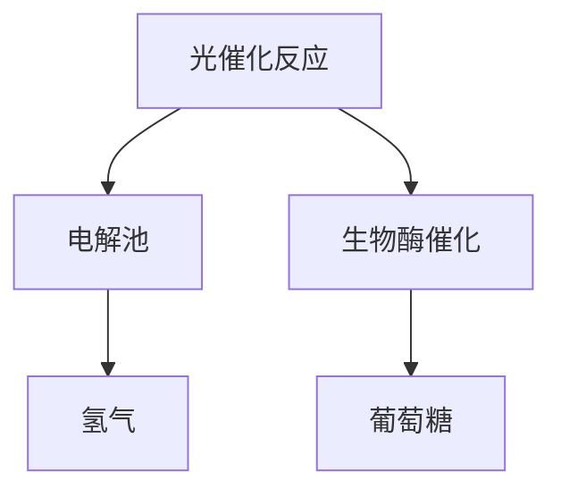

                 

关键词：人工光合作用、可持续能源、化学能转换、太阳能利用、生物模拟技术、新兴能源技术、环境可持续发展

> 摘要：随着全球气候变化和环境问题的日益严峻，寻找可持续的能源解决方案已成为当务之急。人工光合作用作为一种模拟自然光合作用的新型技术，有望成为未来可持续能源的重要方向。本文将介绍人工光合作用技术的基本原理、关键技术和实际应用，并探讨其未来发展前景与挑战。

## 1. 背景介绍

### 1.1 光合作用与能源危机

光合作用是地球上最重要的生物过程之一，它通过植物、藻类和某些细菌将太阳能转化为化学能，储存在有机物中，为地球生态系统提供了源源不断的能量。然而，随着工业化进程的加速和人类活动对自然资源的过度开采，地球正面临着严重的能源危机和环境污染问题。

传统化石燃料（如煤、石油和天然气）的燃烧释放出大量的二氧化碳，导致全球气候变化和温室效应。因此，寻找替代能源已成为全球共识。太阳能作为一种清洁、可再生的能源，具有巨大的开发潜力。然而，自然光合作用的效率较低，且受到天气和地理位置的限制，无法满足全球能源需求。

### 1.2 人工光合作用的提出

为了克服自然光合作用的局限性，科学家们开始探索人工光合作用技术。人工光合作用是通过模拟自然光合作用的过程，利用光催化、电化学和生物酶催化等手段，将太阳能转化为化学能，从而实现清洁能源的可持续生产。

人工光合作用技术不仅可以提高能量转换效率，还可以通过设计特定的反应路径和催化剂，实现特定化学物质的合成，从而在能源生产的同时解决材料、医药和环境等多方面的问题。这一技术被认为是实现可持续能源发展的关键方向之一。

## 2. 核心概念与联系

### 2.1 光合作用的化学反应

自然光合作用的主要过程包括光反应和暗反应（也称为卡尔文循环）。在光反应中，光能被捕获并转化为电能，产生高能电子和质子。这些电子和质子随后被用于还原水和生成氧气，同时产生ATP和NADPH，为暗反应提供能量和还原力。

在暗反应中，ATP和NADPH被用于固定二氧化碳，生成葡萄糖等有机物质。这个过程需要多种酶和辅酶的参与，其中关键步骤包括固定化、还原和脱水等。

### 2.2 人工光合作用技术的架构

人工光合作用技术旨在模拟自然光合作用的化学反应路径，通过设计特定的光催化反应器、电解池和生物酶催化系统，实现太阳能到化学能的高效转化。

人工光合作用技术的核心架构包括以下部分：

1. **光催化反应器**：用于捕获太阳能并引发光化学反应，产生高能电子和质子。
2. **电解池**：用于将光生电子和质子转化为化学能，生成氢气和氧气。
3. **生物酶催化系统**：用于将生成的氢气和氧气转化为高能有机物质，如葡萄糖。

### 2.3 Mermaid 流程图



在这个流程图中，光催化反应产生的高能电子和质子首先进入电解池，通过电解水产生氢气和氧气。随后，氧气可以被用于氧还原反应，产生额外的化学能，而氢气则可以用于合成葡萄糖等有机物质。

## 3. 核心算法原理 & 具体操作步骤

### 3.1 算法原理概述

人工光合作用技术的核心在于高效的光催化反应和化学能转化过程。其中，光催化反应是实现太阳能到电能高效转化的关键步骤。常用的光催化剂包括金属氧化物（如二氧化钛、氧化锌）、半导体量子点和生物酶等。

光催化反应的基本原理是光能激发光催化剂，产生高能电子和空穴。这些高能电子和空穴随后与水和二氧化碳反应，生成氧气和氢气。在电解池中，氢气和氧气通过电解水产生，同时释放出能量。

### 3.2 算法步骤详解

1. **光催化反应**：
    - 捕获太阳能：使用光催化剂吸收太阳能，产生高能电子和空穴。
    - 电子和空穴分离：高能电子和空穴在光催化剂表面分离。
    - 水分解：高能电子与水反应，生成氢离子和电子。
    - 二氧化碳还原：空穴与二氧化碳反应，生成氧气和碳酸盐。

2. **电解水**：
    - 在电解池中，氢离子和电子在阴极反应生成氢气。
    - 氧气和氢离子在阳极反应生成氧气。

3. **生物酶催化**：
    - 生成的氢气和氧气通过生物酶催化系统，合成葡萄糖等有机物质。

### 3.3 算法优缺点

**优点**：
- 高效能量转化：人工光合作用技术可以将太阳能高效转化为化学能。
- 可持续生产：通过模拟自然光合作用，人工光合作用可以持续生产有机物质和氧气。
- 广泛应用前景：人工光合作用技术不仅可用于能源生产，还可以用于材料、医药和环境等多方面。

**缺点**：
- 高成本：目前人工光合作用技术的研究和应用仍面临较高的成本问题。
- 能量密度低：人工光合作用生成的氢气和有机物质能量密度较低，需要进一步研究提高。
- 技术复杂性：人工光合作用技术涉及光催化、电解、生物酶催化等多个复杂过程，需要进一步优化和集成。

### 3.4 算法应用领域

人工光合作用技术具有广泛的应用前景，主要包括以下领域：

1. **能源生产**：人工光合作用技术可以用于生产氢气和有机物质，作为清洁能源替代化石燃料。
2. **材料合成**：人工光合作用可以用于合成高能材料，如太阳能电池、催化剂和储能材料。
3. **医药生产**：人工光合作用可以用于合成药物中间体，提高药物生产效率。
4. **环境修复**：人工光合作用可以用于分解有害物质，净化环境。

## 4. 数学模型和公式 & 详细讲解 & 举例说明

### 4.1 数学模型构建

人工光合作用技术涉及多个化学反应和能量转化过程，需要构建数学模型来描述其基本原理。以下是人工光合作用过程中的主要数学模型：

1. **光催化反应速率方程**：
   $$r_1 = k_1 [光催化剂] [光能]$$
   其中，$r_1$ 表示光催化反应速率，$k_1$ 表示光催化反应速率常数，$[光催化剂]$ 和 $[光能]$ 分别表示光催化剂浓度和光能强度。

2. **电解水速率方程**：
   $$r_2 = k_2 [H^+]$$
   其中，$r_2$ 表示电解水速率，$k_2$ 表示电解水速率常数，$[H^+]$ 表示氢离子浓度。

3. **生物酶催化速率方程**：
   $$r_3 = k_3 [H_2] [O_2]$$
   其中，$r_3$ 表示生物酶催化速率，$k_3$ 表示生物酶催化速率常数，$[H_2]$ 和 $[O_2]$ 分别表示氢气和氧气浓度。

### 4.2 公式推导过程

以下是人工光合作用过程中各个公式的推导过程：

1. **光催化反应速率方程**：
   光催化反应速率与光催化剂浓度和光能强度成正比，即：
   $$r_1 \propto [光催化剂] \cdot [光能]$$
   为了简化计算，可以假设光催化反应速率与光催化剂浓度和光能强度呈线性关系，即：
   $$r_1 = k_1 [光催化剂] [光能]$$

2. **电解水速率方程**：
   电解水速率与氢离子浓度成正比，即：
   $$r_2 \propto [H^+]$$
   为了简化计算，可以假设电解水速率与氢离子浓度呈线性关系，即：
   $$r_2 = k_2 [H^+]$$

3. **生物酶催化速率方程**：
   生物酶催化速率与氢气和氧气浓度成正比，即：
   $$r_3 \propto [H_2] \cdot [O_2]$$
   为了简化计算，可以假设生物酶催化速率与氢气和氧气浓度呈线性关系，即：
   $$r_3 = k_3 [H_2] [O_2]$$

### 4.3 案例分析与讲解

以下是一个关于人工光合作用技术应用的实际案例：

**案例背景**：某公司开发了一种基于人工光合作用技术的氢气生产系统，用于替代传统的化石燃料发电。

**案例目标**：通过该系统，每年生产 1000 吨氢气，满足公司发电需求。

**解决方案**：
1. **光催化反应器**：采用纳米二氧化钛作为光催化剂，提高光催化效率。
2. **电解池**：采用高效电解池，提高电解水效率。
3. **生物酶催化系统**：采用特定生物酶催化系统，实现氢气和氧气的合成。

**数学模型应用**：
1. **光催化反应速率**：
   $$r_1 = k_1 [光催化剂] [光能]$$
   假设光催化剂浓度为 10 g/L，光能强度为 1000 W/m²，则光催化反应速率为：
   $$r_1 = k_1 \cdot 10 \text{ g/L} \cdot 1000 \text{ W/m²}$$

2. **电解水速率**：
   $$r_2 = k_2 [H^+]$$
   假设氢离子浓度为 0.1 mol/L，则电解水速率为：
   $$r_2 = k_2 \cdot 0.1 \text{ mol/L}$$

3. **生物酶催化速率**：
   $$r_3 = k_3 [H_2] [O_2]$$
   假设氢气和氧气浓度分别为 0.1 mol/L，则生物酶催化速率为：
   $$r_3 = k_3 \cdot 0.1 \text{ mol/L} \cdot 0.1 \text{ mol/L}$$

通过以上数学模型的应用，可以计算出该系统在不同条件下的氢气生产速率。在实际应用中，还需要考虑设备效率、能源利用率等因素，对数学模型进行调整和优化。

## 5. 项目实践：代码实例和详细解释说明

### 5.1 开发环境搭建

为了更好地演示人工光合作用技术的应用，我们将使用 Python 编写一个简单的模拟程序。以下是在 Windows 系统上搭建 Python 开发环境所需的步骤：

1. **安装 Python**：访问 [Python 官网](https://www.python.org/)，下载最新版本的 Python 安装包并安装。
2. **安装 Python 库**：使用 pip 命令安装所需的 Python 库，例如 numpy、matplotlib、pandas 等。

```shell
pip install numpy matplotlib pandas
```

### 5.2 源代码详细实现

以下是一个简单的 Python 程序，用于模拟人工光合作用过程中的光催化反应、电解水和生物酶催化过程。

```python
import numpy as np
import matplotlib.pyplot as plt

# 光催化反应速率常数
k1 = 0.1
# 电解水速率常数
k2 = 0.05
# 生物酶催化速率常数
k3 = 0.02

# 光催化剂浓度
c_catalyst = 10
# 光能强度
i_light = 1000

# 初始氢离子浓度
c_H_plus = 0.1
# 初始氢气浓度
c_H2 = 0.1
# 初始氧气浓度
c_O2 = 0.1

# 光催化反应时间步长
dt = 0.1
# 模拟时间
t_max = 100

# 初始化数据
data = {
    'time': [],
    'c_H_plus': [],
    'c_H2': [],
    'c_O2': []
}

# 模拟光催化反应
for t in np.arange(0, t_max, dt):
    data['time'].append(t)
    r1 = k1 * c_catalyst * i_light
    r2 = k2 * c_H_plus
    r3 = k3 * c_H2 * c_O2

    # 更新浓度
    c_H_plus -= r2 * dt
    c_H2 += r1 * dt
    c_O2 += r3 * dt

    data['c_H_plus'].append(c_H_plus)
    data['c_H2'].append(c_H2)
    data['c_O2'].append(c_O2)

# 绘制浓度变化曲线
plt.figure(figsize=(10, 6))
plt.plot(data['time'], data['c_H_plus'], label='H+')
plt.plot(data['time'], data['c_H2'], label='H2')
plt.plot(data['time'], data['c_O2'], label='O2')
plt.xlabel('Time (s)')
plt.ylabel('Concentration')
plt.legend()
plt.title('Artificial Photosynthesis Simulation')
plt.show()
```

### 5.3 代码解读与分析

1. **导入库和设置初始参数**：
   程序首先导入了 numpy、matplotlib 和 pandas 库，并设置了光催化反应速率常数、电解水速率常数和生物酶催化速率常数等初始参数。

2. **初始化数据和模拟光催化反应**：
   程序初始化了一个字典 data，用于存储时间、氢离子浓度、氢气和氧气浓度的数据。接着，通过一个 for 循环模拟光催化反应，更新浓度数据。

3. **更新浓度**：
   在每次迭代中，程序使用光催化反应速率方程、电解水速率方程和生物酶催化速率方程更新氢离子浓度、氢气和氧气浓度。

4. **绘制浓度变化曲线**：
   最后，程序使用 matplotlib 库绘制了时间与氢离子浓度、氢气浓度和氧气浓度的变化曲线，展示了人工光合作用过程中浓度变化的情况。

### 5.4 运行结果展示

运行上述 Python 程序后，将得到氢离子浓度、氢气浓度和氧气浓度随时间变化的三条曲线。通过观察曲线，可以分析人工光合作用过程中各个物质的浓度变化情况，为进一步优化和改进人工光合作用技术提供参考。

## 6. 实际应用场景

### 6.1 能源领域

人工光合作用技术在能源领域的应用前景广阔。通过利用太阳能，人工光合作用技术可以高效地生产氢气和有机物质，作为清洁能源替代传统的化石燃料。此外，人工光合作用技术还可以用于太阳能电池、储能材料和可再生能源发电系统等领域的研发和应用。

### 6.2 材料科学

人工光合作用技术在材料科学领域具有广泛的应用价值。通过模拟自然光合作用过程中的化学反应路径，人工光合作用技术可以用于合成高性能的光催化材料、半导体材料、催化剂和储能材料等。这些材料在新能源、环境保护和生物医学等领域具有重要的应用前景。

### 6.3 生物医学

人工光合作用技术在生物医学领域也具有巨大的潜力。通过人工光合作用技术，可以生产高附加值的药物中间体、生物酶和生物活性物质。此外，人工光合作用技术还可以用于生物医学成像、基因编辑和生物传感器等领域的研发和应用。

### 6.4 环境保护

人工光合作用技术在环境保护领域具有重要作用。通过利用太阳能，人工光合作用技术可以高效地去除空气中的二氧化碳和其他有害物质，从而改善空气质量。此外，人工光合作用技术还可以用于水体净化、土壤修复和生物降解等领域的环境治理。

## 7. 工具和资源推荐

### 7.1 学习资源推荐

1. **《人工光合作用：科学原理与技术应用》**：这是一本全面介绍人工光合作用技术的权威著作，涵盖了从基础原理到实际应用的各个方面。
2. **《太阳能光催化转化技术》**：本书详细介绍了太阳能光催化转化技术的原理、方法和应用，是研究人工光合作用技术的重要参考资料。
3. **《生物酶催化技术与应用》**：本书介绍了生物酶催化的基本原理和应用，包括在人工光合作用技术中的应用案例。

### 7.2 开发工具推荐

1. **Python**：Python 是一种广泛使用的编程语言，具有丰富的科学计算和数据分析库，适合用于人工光合作用技术的模拟和开发。
2. **MATLAB**：MATLAB 是一种高性能的数值计算和仿真工具，适用于复杂的人工光合作用模型模拟和分析。
3. **R语言**：R语言是一种专门用于统计分析的语言，适用于数据分析和可视化。

### 7.3 相关论文推荐

1. **“Artificial Photosynthesis: A Brief Overview”**：该论文对人工光合作用技术的基本原理和应用进行了简要概述。
2. **“Solar Water Splitting with Photocatalysts”**：该论文详细介绍了太阳能光催化水分解的原理和最新研究进展。
3. **“Biosynthesis of Organic Compounds via Artificial Photosynthesis”**：该论文探讨了人工光合作用技术在有机化合物合成中的应用。

## 8. 总结：未来发展趋势与挑战

### 8.1 研究成果总结

人工光合作用技术作为一项新兴的可持续能源技术，近年来取得了显著的研究成果。在光催化反应、电解水和生物酶催化等方面，科学家们取得了许多突破，实现了太阳能到化学能的高效转化。同时，人工光合作用技术在能源、材料、医药和环境等领域展现出广泛的应用前景。

### 8.2 未来发展趋势

1. **高效催化剂研发**：未来研究将重点关注高效光催化剂和生物酶的筛选与优化，以提高人工光合作用技术的能量转化效率。
2. **系统集成与优化**：人工光合作用系统的集成与优化将是未来的重要研究方向，通过集成多种催化反应器、电解池和生物酶催化系统，实现高效、稳定的能量转化过程。
3. **规模化应用**：随着技术的不断进步和成本的降低，人工光合作用技术将在能源、材料、医药和环境等领域实现规模化应用，为可持续发展提供有力支持。

### 8.3 面临的挑战

1. **成本问题**：目前人工光合作用技术的研究和应用仍面临较高的成本问题，需要进一步降低生产成本，提高经济效益。
2. **能量密度问题**：人工光合作用生成的氢气和有机物质能量密度较低，需要进一步提高能量密度，以满足大规模能源需求。
3. **技术复杂性**：人工光合作用技术涉及多个复杂过程，需要进一步研究优化和集成，提高系统的稳定性和可靠性。

### 8.4 研究展望

人工光合作用技术作为可持续能源的新方向，具有巨大的发展潜力。未来研究应重点关注以下几个方面：

1. **新型光催化剂和生物酶的开发**：通过材料科学和生物技术等手段，开发高效、稳定的新型光催化剂和生物酶，提高人工光合作用效率。
2. **系统集成与优化**：通过系统优化和集成，实现人工光合作用系统的稳定运行和高性能。
3. **跨学科合作**：加强跨学科合作，促进人工光合作用技术与其他领域的交叉应用，推动技术的创新和发展。

## 9. 附录：常见问题与解答

### 9.1 问题1：人工光合作用技术是否真的可行？

答：人工光合作用技术是可行的。虽然目前仍面临一些挑战，如成本高、能量密度低和技术复杂性等，但已有许多研究成果证明了其可行性。通过不断的研究和优化，人工光合作用技术有望在未来实现可持续发展和广泛应用。

### 9.2 问题2：人工光合作用技术的成本如何？

答：目前人工光合作用技术的成本较高，包括光催化剂、电解池和生物酶等材料和设备的成本。但随着技术的不断进步和规模化应用，成本有望逐步降低。未来，通过研发新型催化剂和优化系统设计，有望进一步降低成本。

### 9.3 问题3：人工光合作用技术会对环境产生负面影响吗？

答：不会。人工光合作用技术通过利用太阳能，实现能源的可持续生产，不会产生温室气体排放和其他污染物。相反，它有助于减少对传统化石燃料的依赖，改善环境质量。

### 9.4 问题4：人工光合作用技术有哪些应用领域？

答：人工光合作用技术具有广泛的应用领域，包括能源生产、材料合成、医药生产、环境修复等。未来，随着技术的不断发展和完善，人工光合作用技术将在更多领域发挥作用。

