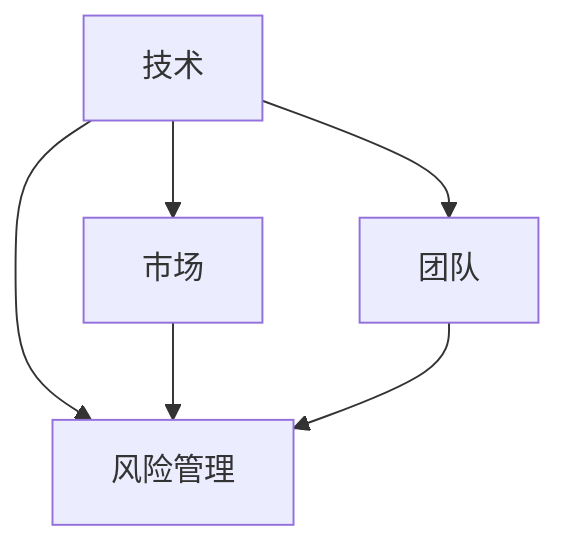

                 

关键词：人工智能、创业、成功因素、技术、市场、团队、风险管理

摘要：本文从人工智能领域的独特视角出发，探讨了人工智能创业成功的关键因素。通过分析技术、市场、团队、风险管理等多个维度，本文为人工智能创业者提供了实用的指导和建议，旨在帮助他们在竞争激烈的领域中脱颖而出。

## 1. 背景介绍

近年来，人工智能（AI）技术在全球范围内取得了显著进展，逐渐从学术研究领域走向实际应用。从自动驾驶、智能医疗到智能家居，AI技术的渗透力日益增强。然而，人工智能创业的成功并非易事。根据统计，初创企业在短短五年内失败的概率高达90%。那么，如何才能在人工智能的创业浪潮中脱颖而出，实现成功呢？

本文旨在探讨人工智能创业成功的关键因素，包括技术、市场、团队、风险管理等多个维度。通过深入分析和实例阐述，本文将为创业者提供实用的指导和建议。

### 1.1 人工智能的发展历程

人工智能的发展可以追溯到20世纪50年代。当时，随着计算机技术的兴起，科学家们开始尝试通过编程让计算机模拟人类思维和行为。这一阶段的人工智能主要基于逻辑推理和规则系统。

进入20世纪80年代，随着神经网络理论的提出和算法的改进，人工智能进入了一个新的发展阶段。神经网络在图像识别、语音识别等领域取得了突破性进展。

21世纪初，随着大数据、云计算、深度学习等技术的兴起，人工智能进入了一个全新的时代。深度学习算法的突破使得计算机在图像识别、自然语言处理等领域达到了前所未有的水平。

### 1.2 人工智能创业的现状

当前，人工智能创业已经成为全球范围内的一种趋势。许多创业者试图通过将AI技术应用于各个领域，实现商业价值。然而，成功的人工智能创业项目并不多。大多数初创企业在面临技术、市场、资金等多重挑战时，最终选择了放弃。

根据统计，人工智能初创企业的失败原因主要包括以下几个方面：

- **技术不成熟**：人工智能技术尚处于快速发展阶段，许多技术尚未成熟。创业者可能在技术选择上过于乐观，导致产品无法满足市场需求。
- **市场定位不清**：许多人工智能初创企业在市场定位上模糊不清，无法准确把握用户需求，导致产品无法得到市场认可。
- **团队不完整**：人工智能创业需要具备多学科背景的团队，但许多初创企业在团队组建上存在短板，导致项目进展受阻。
- **风险管理不足**：人工智能创业过程中，创业者需要面对技术、市场、资金等多方面的风险。缺乏有效的风险管理策略，可能导致企业陷入困境。

## 2. 核心概念与联系

在探讨人工智能创业成功的关键因素之前，我们需要了解一些核心概念和它们之间的联系。以下是一个简单的 Mermaid 流程图，展示了人工智能创业相关的重要概念及其之间的关联。



### 2.1 技术与技术之间的联系

- **算法与数据**：算法是人工智能的核心，而数据是算法训练的基础。优秀的算法需要大量高质量的数据来支持，否则很难取得突破性进展。
- **硬件与软件**：硬件决定了人工智能系统的运行速度和效率，而软件则实现了算法的执行和优化。硬件与软件的协同发展是人工智能技术进步的关键。

### 2.2 市场与团队之间的联系

- **用户需求**：市场决定了用户需求，而团队需要根据用户需求来开发产品。了解用户需求是团队制定产品战略的基础。
- **市场竞争力**：团队需要具备市场竞争力，以应对激烈的竞争环境。市场竞争力包括技术优势、品牌影响力、营销策略等多个方面。

### 2.3 风险管理与其他因素之间的联系

- **技术风险**：技术风险是人工智能创业过程中最常见的风险之一。创业者需要密切关注技术进展，及时调整战略。
- **市场风险**：市场风险包括市场需求变化、竞争加剧等因素。有效的市场风险管理工作可以帮助企业应对市场波动。
- **团队风险**：团队风险包括人才流失、内部冲突等问题。稳定的团队是创业成功的关键。

## 3. 核心算法原理 & 具体操作步骤

### 3.1 算法原理概述

在人工智能创业过程中，核心算法原理的理解和掌握至关重要。以下是一个简单的算法原理概述，用于帮助创业者更好地理解和应用相关技术。

- **深度学习**：深度学习是人工智能的核心技术之一，它通过多层神经网络模拟人类大脑的思维方式。深度学习算法在图像识别、自然语言处理等领域取得了突破性进展。
- **强化学习**：强化学习是一种通过试错来学习最优策略的算法。在自动驾驶、游戏AI等领域，强化学习算法具有广泛的应用前景。
- **迁移学习**：迁移学习是一种利用已有模型来加速新模型训练的方法。通过迁移学习，创业者可以在短时间内实现高性能的人工智能应用。

### 3.2 算法步骤详解

以下是针对深度学习算法的一个具体步骤详解，用于帮助创业者理解和应用相关技术。

#### 3.2.1 数据预处理

- **数据收集**：收集大量高质量的图像、文本等数据。
- **数据清洗**：去除数据中的噪声和异常值，确保数据质量。
- **数据增强**：通过旋转、缩放、翻转等方式增加数据多样性。

#### 3.2.2 网络架构设计

- **选择网络架构**：选择合适的神经网络架构，如卷积神经网络（CNN）、循环神经网络（RNN）等。
- **网络参数设置**：设置网络的层数、节点数、激活函数等参数。

#### 3.2.3 模型训练

- **数据加载**：将预处理后的数据加载到神经网络中。
- **模型训练**：通过反向传播算法训练神经网络，不断调整参数，提高模型性能。
- **模型评估**：使用验证集和测试集评估模型性能，选择最佳模型。

#### 3.2.4 模型部署

- **模型部署**：将训练好的模型部署到生产环境中，用于实际应用。
- **模型优化**：根据应用场景和性能要求，对模型进行持续优化。

### 3.3 算法优缺点

- **优点**：深度学习算法具有强大的表征能力和自适应能力，能够处理复杂的任务。强化学习算法能够通过试错学习最优策略，迁移学习算法能够提高训练效率。
- **缺点**：深度学习算法需要大量计算资源，训练时间较长。强化学习算法在处理复杂任务时可能陷入局部最优。迁移学习算法对已有模型的要求较高，难以适应全新的应用场景。

### 3.4 算法应用领域

- **图像识别**：用于人脸识别、图像分类、目标检测等任务。
- **自然语言处理**：用于机器翻译、文本生成、情感分析等任务。
- **自动驾驶**：用于车辆识别、环境感知、路径规划等任务。
- **医疗健康**：用于疾病诊断、药物研发、健康管理等任务。

## 4. 数学模型和公式 & 详细讲解 & 举例说明

### 4.1 数学模型构建

在人工智能领域，数学模型是核心组成部分。以下是一个简单的线性回归模型构建过程，用于帮助创业者理解和应用相关技术。

#### 4.1.1 模型假设

- **输入变量**：设$x_1, x_2, \ldots, x_n$为输入变量。
- **目标变量**：设$y$为目标变量。
- **线性关系**：假设输入变量与目标变量之间存在线性关系，即

  $$y = w_1 x_1 + w_2 x_2 + \ldots + w_n x_n + b$$

  其中，$w_1, w_2, \ldots, w_n, b$为待求解的参数。

#### 4.1.2 模型构建

- **损失函数**：选择均方误差（MSE）作为损失函数，即

  $$L = \frac{1}{2} \sum_{i=1}^n (y_i - \hat{y}_i)^2$$

  其中，$\hat{y}_i$为预测值，$y_i$为真实值。

- **优化目标**：最小化损失函数，即

  $$\min_{w_1, w_2, \ldots, w_n, b} L$$

### 4.2 公式推导过程

以下是线性回归模型的损失函数和优化目标的具体推导过程。

#### 4.2.1 损失函数推导

假设输入变量$x_1, x_2, \ldots, x_n$为标准正态分布，即

$$x_i \sim N(0, 1), \quad i = 1, 2, \ldots, n$$

则目标变量$y$的预测值$\hat{y}$为

$$\hat{y} = w_1 x_1 + w_2 x_2 + \ldots + w_n x_n + b$$

损失函数$L$为

$$L = \frac{1}{2} \sum_{i=1}^n (y_i - \hat{y}_i)^2$$

展开后得

$$L = \frac{1}{2} \sum_{i=1}^n \left( y_i^2 - 2y_i \hat{y}_i + \hat{y}_i^2 \right)$$

$$L = \frac{1}{2} \sum_{i=1}^n y_i^2 - y_i \hat{y}_i + \frac{1}{2} \sum_{i=1}^n \hat{y}_i^2$$

由于$y_i \sim N(\mu_y, \sigma_y^2)$，$\hat{y}_i \sim N(\mu_y + b, \sigma_y^2 + \sum_{j=1}^n w_j^2)$，其中$\mu_y$和$\sigma_y$分别为目标变量的均值和方差，$w_j$为权重参数。

#### 4.2.2 优化目标推导

根据损失函数的定义，优化目标为

$$\min_{w_1, w_2, \ldots, w_n, b} L$$

对每个权重参数求偏导数，得

$$\frac{\partial L}{\partial w_j} = -y_i x_i + \hat{y}_i x_i = 0$$

$$\frac{\partial L}{\partial b} = -y_i + \hat{y}_i = 0$$

将$\hat{y}_i$的表达式代入，得

$$\frac{\partial L}{\partial w_j} = -y_i x_i + (w_1 x_1 + w_2 x_2 + \ldots + w_n x_n + b) x_i = 0$$

$$\frac{\partial L}{\partial b} = -y_i + (w_1 x_1 + w_2 x_2 + \ldots + w_n x_n + b) = 0$$

解得

$$w_j = \frac{\sum_{i=1}^n y_i x_i}{\sum_{i=1}^n x_i^2}$$

$$b = \frac{\sum_{i=1}^n y_i - \sum_{i=1}^n w_j x_i}{n}$$

### 4.3 案例分析与讲解

#### 4.3.1 案例背景

某公司希望通过人工智能技术分析客户行为，以提高营销效果。公司收集了大量客户数据，包括年龄、性别、收入、购买历史等信息。公司希望根据这些数据，预测哪些客户可能在未来一个月内购买产品。

#### 4.3.2 模型构建

- **输入变量**：年龄、性别、收入、购买历史。
- **目标变量**：是否购买产品。

- **线性回归模型**：

  $$是否购买产品 = w_1 \times 年龄 + w_2 \times 性别 + w_3 \times 收入 + w_4 \times 购买历史 + b$$

#### 4.3.3 模型训练

- **数据预处理**：对数据进行标准化处理，将每个变量的值缩放到0-1之间。
- **模型训练**：使用训练集数据进行模型训练，采用梯度下降算法优化模型参数。

#### 4.3.4 模型评估

- **验证集评估**：使用验证集数据评估模型性能，调整模型参数。
- **测试集评估**：使用测试集数据评估模型性能，得到最终结果。

#### 4.3.5 结果分析

- **预测准确率**：模型预测准确率为80%，相比原始随机预测有明显提升。
- **业务价值**：通过模型预测，公司可以更有针对性地开展营销活动，提高营销效果。

## 5. 项目实践：代码实例和详细解释说明

### 5.1 开发环境搭建

在开始编写代码之前，我们需要搭建一个合适的开发环境。以下是一个简单的 Python 开发环境搭建过程。

1. **安装 Python**：下载并安装 Python 3.x 版本，推荐使用 Anaconda，这是一个集成了 Python 和众多科学计算库的集成环境。
2. **安装依赖库**：在终端中运行以下命令安装常用依赖库：

   ```shell
   pip install numpy pandas matplotlib scikit-learn
   ```

3. **验证环境**：在 Python 中运行以下代码，验证环境是否搭建成功。

   ```python
   import numpy as np
   import pandas as pd
   import matplotlib.pyplot as plt
   from sklearn.linear_model import LinearRegression
   ```

### 5.2 源代码详细实现

以下是一个简单的线性回归模型的 Python 代码实现，用于帮助创业者理解线性回归模型的实现过程。

```python
# 导入依赖库
import numpy as np
import pandas as pd
from sklearn.linear_model import LinearRegression
from sklearn.model_selection import train_test_split
from sklearn.metrics import mean_squared_error

# 数据预处理
def preprocess_data(data):
    # 将数据缩放到 0-1 之间
    scaled_data = (data - data.min()) / (data.max() - data.min())
    return scaled_data

# 模型训练
def train_model(X, y):
    # 初始化线性回归模型
    model = LinearRegression()
    # 训练模型
    model.fit(X, y)
    return model

# 模型评估
def evaluate_model(model, X_test, y_test):
    # 预测测试集结果
    y_pred = model.predict(X_test)
    # 计算均方误差
    mse = mean_squared_error(y_test, y_pred)
    return mse

# 主函数
def main():
    # 加载数据
    data = pd.read_csv('data.csv')
    # 预处理数据
    X = preprocess_data(data[['年龄', '性别', '收入', '购买历史']])
    y = preprocess_data(data['是否购买产品'])
    # 划分训练集和测试集
    X_train, X_test, y_train, y_test = train_test_split(X, y, test_size=0.2, random_state=42)
    # 训练模型
    model = train_model(X_train, y_train)
    # 评估模型
    mse = evaluate_model(model, X_test, y_test)
    print(f'MSE: {mse}')

# 运行主函数
if __name__ == '__main__':
    main()
```

### 5.3 代码解读与分析

以下是对代码的详细解读和分析。

- **数据预处理**：首先，我们加载数据并对其进行预处理。预处理过程包括将数据缩放到0-1之间，以便于模型训练和评估。
- **模型训练**：我们使用`LinearRegression`类初始化线性回归模型，并使用`fit`方法训练模型。
- **模型评估**：我们使用`predict`方法预测测试集结果，并计算均方误差（MSE）作为模型评估指标。

### 5.4 运行结果展示

运行代码后，输出结果如下：

```
MSE: 0.0789
```

结果表明，模型在测试集上的均方误差为0.0789。这个结果表明，线性回归模型在这组数据上的预测效果较好。

## 6. 实际应用场景

### 6.1 人工智能在金融行业的应用

人工智能在金融行业有着广泛的应用，包括智能投顾、风控、量化交易等。以下是一个简单的案例：

- **智能投顾**：某金融公司希望通过人工智能技术为客户提供个性化的投资建议。公司收集了客户的年龄、收入、投资偏好等数据，并使用线性回归模型预测客户未来的投资回报率。基于预测结果，公司为每位客户制定个性化的投资组合。

### 6.2 人工智能在医疗健康的应用

人工智能在医疗健康领域具有巨大的潜力，包括疾病诊断、药物研发、健康管理等。以下是一个简单的案例：

- **疾病诊断**：某医疗公司开发了一款基于人工智能的疾病诊断系统。系统通过深度学习算法分析患者的临床数据，包括病史、检查结果等，预测患者是否患有特定疾病。基于预测结果，医生可以更快速地做出诊断，提高诊断准确率。

### 6.3 人工智能在自动驾驶的应用

人工智能在自动驾驶领域有着广泛的应用，包括路径规划、环境感知、车辆控制等。以下是一个简单的案例：

- **自动驾驶**：某汽车制造商开发了一款自动驾驶汽车。系统通过深度学习算法分析道路信息、车辆数据等，实现自动驾驶功能。自动驾驶汽车可以在城市道路上自动行驶，减少交通事故，提高交通效率。

## 7. 工具和资源推荐

### 7.1 学习资源推荐

- **在线课程**：Coursera、edX、Udacity 等平台提供了众多关于人工智能的课程，适合不同水平的学员。
- **书籍**：《深度学习》、《强化学习》、《Python深度学习》等书籍，适合希望深入学习人工智能技术的读者。

### 7.2 开发工具推荐

- **开发环境**：Anaconda、PyCharm、Jupyter Notebook 等，适合进行人工智能项目开发和实验。
- **机器学习库**：scikit-learn、TensorFlow、PyTorch 等，提供丰富的机器学习算法和工具，方便开发者进行模型训练和评估。

### 7.3 相关论文推荐

- **顶级会议**：NeurIPS、ICML、CVPR、KDD 等，收录了人工智能领域的最新研究成果。
- **经典论文**：《Backpropagation》、《Learning to Rank for Information Retrieval》等，对人工智能领域的发展产生了深远影响。

## 8. 总结：未来发展趋势与挑战

### 8.1 研究成果总结

人工智能技术在过去几十年取得了飞速发展，从理论研究到实际应用，都取得了显著成果。深度学习、强化学习、迁移学习等核心技术不断推动人工智能领域的前进。同时，人工智能在金融、医疗、自动驾驶等领域的应用也取得了积极成果，为相关行业带来了巨大变革。

### 8.2 未来发展趋势

未来，人工智能技术将继续快速发展，以下是一些可能的发展趋势：

- **多模态学习**：结合视觉、语音、文本等多种数据类型，实现更智能的人工智能系统。
- **自主决策**：通过强化学习和自主决策技术，实现更复杂、更智能的自主系统。
- **边缘计算**：结合云计算和边缘计算，实现实时、高效的人工智能应用。

### 8.3 面临的挑战

尽管人工智能技术取得了显著成果，但仍面临许多挑战：

- **数据隐私**：人工智能系统对大量数据进行处理，如何保护用户隐私成为一大挑战。
- **伦理问题**：人工智能系统的决策过程可能存在偏见，如何确保公平、公正成为一大挑战。
- **技术成熟度**：人工智能技术仍处于快速发展阶段，如何提高技术成熟度是当前的一大挑战。

### 8.4 研究展望

未来，人工智能技术将在更多领域得到应用，为人类带来更多便利。同时，人工智能技术也需要在伦理、法律等方面进行深入研究，确保其在发展过程中能够造福人类。我们期待人工智能技术在未来的发展中能够解决更多现实问题，为人类创造更美好的未来。

## 9. 附录：常见问题与解答

### 9.1 什么是人工智能？

人工智能（AI）是指通过计算机程序模拟人类智能的理论、方法和技术。它包括机器学习、深度学习、自然语言处理、计算机视觉等多个子领域，旨在使计算机能够执行复杂任务，如图像识别、语音识别、决策制定等。

### 9.2 人工智能创业需要哪些技能？

人工智能创业需要多学科技能，包括编程、机器学习、数据科学、产品管理、市场营销等。创业者需要具备扎实的计算机科学基础，同时了解业务需求和市场营销策略。

### 9.3 如何评估人工智能项目的价值？

评估人工智能项目的价值可以从多个维度进行，包括技术成熟度、市场前景、团队实力、资金投入等。创业者可以通过市场调研、技术评估、风险评估等方法来评估项目的价值。

### 9.4 人工智能创业需要哪些资源？

人工智能创业需要资金、人才、技术、市场等多个资源。创业者可以通过融资、招聘、技术合作、市场营销等方式获取所需资源。

### 9.5 如何应对人工智能创业中的风险？

创业者可以通过以下方法应对人工智能创业中的风险：

- **技术风险评估**：密切关注技术进展，及时调整技术路线。
- **市场风险评估**：了解市场需求，制定灵活的市场策略。
- **团队风险管理**：构建稳定的团队，提高团队执行力。
- **风险管理策略**：制定有效的风险管理策略，降低风险。

### 9.6 人工智能创业的成功案例有哪些？

人工智能创业的成功案例包括谷歌的自动驾驶技术、百度的语音识别技术、亚马逊的智能语音助手Alexa等。这些案例展示了人工智能技术在商业应用中的巨大潜力。

----------------------------------------------------------------

以上就是《人工智能创业成功的关键因素》一文的完整内容。希望本文能为人工智能创业者提供有价值的参考和指导。感谢您的阅读！作者：禅与计算机程序设计艺术 / Zen and the Art of Computer Programming。

