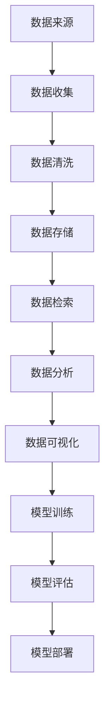

                 

### 背景介绍

随着人工智能（AI）技术的飞速发展，越来越多的初创公司开始投身于AI领域的探索。这些初创公司往往面临着数据管理方面的巨大挑战。数据是人工智能的“粮食”，数据管理的好坏直接决定了AI项目的成功与否。本文将探讨人工智能创业中数据管理的标准实践，以帮助初创公司更好地应对这一挑战。

### 1.1 数据管理的核心重要性

数据管理是人工智能创业中的核心环节，因为：

1. **数据质量**：高质量的数据是训练有效AI模型的基础。如果数据有误或不完整，模型的预测准确性将大打折扣。
2. **数据隐私**：随着隐私保护法规的日益严格，确保数据隐私变得尤为重要。初创公司必须采取措施确保收集的数据符合隐私保护标准。
3. **数据量**：大数据是AI成功的关键。初创公司需要策略性地获取和存储大量数据，以便进行有效的机器学习。
4. **数据存储和检索**：随着数据量的增长，存储和快速检索数据变得越来越复杂。初创公司需要建立高效的数据存储和检索系统。

### 1.2 当前挑战与机遇

当前，人工智能创业公司面临以下挑战：

1. **技术挑战**：如何高效地处理大量数据，并在有限资源下构建和优化AI模型。
2. **人才短缺**：AI领域的人才需求巨大，但优质人才稀缺，初创公司往往难以吸引和留住顶尖人才。
3. **资金压力**：初创公司通常资金有限，需要更高效地利用资源，特别是在数据管理方面。

然而，这些挑战也带来了机遇：

1. **技术进步**：随着云计算、分布式存储等技术的发展，初创公司可以利用这些先进技术来优化数据管理。
2. **市场需求**：AI技术在各个行业的应用越来越广泛，初创公司可以通过解决行业特定问题获得市场机会。
3. **资金支持**：政府和风险投资机构对AI领域的支持不断增加，为初创公司提供了资金和资源。

### 1.3 本文目的

本文旨在：

1. **概述**：介绍数据管理在人工智能创业中的核心重要性。
2. **指导**：提供一套标准实践，帮助初创公司优化数据管理。
3. **案例分析**：通过实际案例展示如何应用这些实践。
4. **未来展望**：探讨数据管理在人工智能领域的未来发展趋势和挑战。

### 1.4 文章结构

本文将分为以下部分：

- **2. 核心概念与联系**：介绍数据管理的核心概念和架构。
- **3. 核心算法原理 & 具体操作步骤**：详细解释数据管理的核心算法和实施步骤。
- **4. 数学模型和公式 & 详细讲解 & 举例说明**：讲解数据管理相关的数学模型和公式，并提供实际案例。
- **5. 项目实践：代码实例和详细解释说明**：展示如何在实际项目中应用数据管理实践。
- **6. 实际应用场景**：分析数据管理在人工智能创业中的实际应用场景。
- **7. 工具和资源推荐**：推荐学习资源、开发工具和框架。
- **8. 总结：未来发展趋势与挑战**：总结本文内容，探讨未来发展趋势和挑战。
- **9. 附录：常见问题与解答**：解答读者可能遇到的问题。
- **10. 扩展阅读 & 参考资料**：提供进一步阅读的资源。

### 2. 核心概念与联系

在深入探讨数据管理的具体实践之前，我们需要了解一些核心概念和它们之间的关系。以下是一个简化的Mermaid流程图，展示了这些核心概念和它们的联系。



以下是每个节点的详细说明：

- **数据来源（A）**：数据可以从多种渠道获取，包括内部系统、第三方API、传感器和数据市场。
- **数据收集（B）**：通过API调用、爬虫、数据库导入等方式收集数据。
- **数据清洗（C）**：清洗数据以去除噪声、处理缺失值、标准化数据等。
- **数据存储（D）**：将清洗后的数据存储在数据库或分布式存储系统中。
- **数据检索（E）**：快速检索数据以支持实时分析和查询。
- **数据分析（F）**：使用统计方法和机器学习算法对数据进行分析。
- **数据可视化（G）**：将分析结果通过图表、报表等形式可视化。
- **模型训练（H）**：使用分析结果训练机器学习模型。
- **模型评估（I）**：评估模型的性能，包括准确性、召回率、F1分数等。
- **模型部署（J）**：将训练好的模型部署到生产环境中。

通过这个流程图，我们可以看到数据管理是一个闭环系统，每个环节都是相互关联和依赖的。有效的数据管理能够确保数据在整个流程中的流畅传递，从而支持高质量的AI模型训练和应用。

### 3. 核心算法原理 & 具体操作步骤

数据管理不仅仅是数据的存储和检索，还包括数据清洗、转换、归一化等一系列操作。这些操作需要借助特定的算法来实现。以下将介绍数据管理中的几个核心算法原理，并详细说明其具体操作步骤。

#### 3.1 数据清洗

数据清洗是数据管理中的第一步，其目的是提高数据质量，为后续的数据分析打下基础。常用的数据清洗算法包括缺失值处理、噪声处理、异常值检测和去重。

##### 缺失值处理

- **缺失值填充**：可以使用平均值、中位数、众数等统计量来填充缺失值，或者使用插值法。
- **缺失值删除**：删除含有缺失值的记录，适用于缺失值较少的情况。

##### 噪声处理

- **过滤法**：使用特定的规则或阈值来过滤噪声数据。
- **平滑法**：使用滑动平均、移动平均等方法来平滑数据。

##### 异常值检测

- **统计学方法**：使用3倍标准差法、箱线图法等统计学方法检测异常值。
- **机器学习方法**：使用孤立森林、局部异常因子等机器学习算法检测异常值。

##### 去重

- **基于哈希表**：使用哈希表来快速查找和删除重复记录。
- **基于比较**：通过逐一比较每条记录来检测和删除重复记录。

##### 操作步骤示例

1. **读取数据**：从数据源读取数据集。
2. **缺失值处理**：检查数据集中的缺失值，选择合适的填充方法或删除缺失值。
3. **噪声处理**：应用过滤或平滑方法处理噪声数据。
4. **异常值检测**：使用统计学或机器学习方法检测并处理异常值。
5. **去重**：使用哈希表或比较方法去除重复记录。
6. **存储数据**：将清洗后的数据存储到数据库或分布式存储系统中。

#### 3.2 数据转换

数据转换包括数据的标准化、归一化和特征工程等操作，目的是将数据转换为适合机器学习模型训练的形式。

##### 标准化

- **Z-score标准化**：计算每个特征的均值和标准差，将数据转换为标准正态分布。
- **Min-Max标准化**：将数据缩放到特定范围，如[0, 1]或[-1, 1]。

##### 归一化

- **L1归一化**：使用L1范数对特征进行归一化。
- **L2归一化**：使用L2范数对特征进行归一化。

##### 特征工程

- **特征选择**：使用过滤法、包裹法、嵌入式方法等选择重要特征。
- **特征构造**：创建新的特征，如交叉特征、聚合特征等。

##### 操作步骤示例

1. **读取数据**：从数据源读取数据集。
2. **数据预处理**：对数据进行缺失值处理、噪声处理、异常值检测和去重。
3. **标准化/归一化**：选择合适的标准化或归一化方法对数据进行处理。
4. **特征工程**：进行特征选择和特征构造。
5. **存储数据**：将转换后的数据存储到数据库或分布式存储系统中。

#### 3.3 数据存储

数据存储是数据管理的核心环节，决定了数据访问的速度和安全性。常用的数据存储技术包括关系数据库、NoSQL数据库、分布式文件系统等。

##### 关系数据库

- **优势**：结构化查询语言（SQL）支持，易于管理。
- **劣势**：扩展性较差，不适合处理大规模数据。

##### NoSQL数据库

- **优势**：高扩展性，适用于大规模数据。
- **劣势**：查询能力相对较弱，不适合复杂查询。

##### 分布式文件系统

- **优势**：高扩展性，支持大数据处理。
- **劣势**：数据访问速度相对较慢。

##### 操作步骤示例

1. **选择存储技术**：根据数据规模和访问模式选择合适的存储技术。
2. **设计数据模型**：设计数据表结构或文档模型。
3. **数据导入**：将清洗和转换后的数据导入数据库或文件系统。
4. **数据备份与恢复**：定期备份数据，并设计数据恢复机制。

#### 3.4 数据检索

数据检索是数据管理的关键环节，决定了数据是否能够及时地用于分析和模型训练。常用的数据检索技术包括关系数据库查询、NoSQL数据库查询和搜索引擎。

##### 关系数据库查询

- **优势**：支持复杂查询，如联接、分组等。
- **劣势**：查询性能受限于数据规模。

##### NoSQL数据库查询

- **优势**：查询性能较高，适用于大规模数据。
- **劣势**：查询能力相对较弱，不支持复杂查询。

##### 搜索引擎

- **优势**：支持快速全文搜索，适用于文本数据。
- **劣势**：不适合大规模结构化数据。

##### 操作步骤示例

1. **设计索引**：根据查询需求设计索引。
2. **执行查询**：使用查询语言执行数据检索操作。
3. **优化查询**：针对查询性能问题进行优化，如优化索引、查询缓存等。

通过以上核心算法原理和操作步骤的介绍，我们可以看到数据管理是一个复杂而精细的过程，涉及多个方面和技术。有效的数据管理能够为人工智能创业提供坚实的基础，支持高质量的数据分析和模型训练。

### 4. 数学模型和公式 & 详细讲解 & 举例说明

在数据管理过程中，数学模型和公式扮演着至关重要的角色。以下我们将介绍几个常用的数学模型和公式，并详细解释它们在数据管理中的应用。

#### 4.1 缺失值填充

缺失值填充是一种常见的数据预处理方法，主要用于解决数据集中缺失值的问题。以下是一些常用的缺失值填充方法及其公式：

1. **平均值填充**

   公式：$$ \text{平均值填充} = \frac{\sum_{i=1}^{n} x_i}{n} $$

   其中，$x_i$ 表示数据集中的第 $i$ 个值，$n$ 表示数据集的总数。该方法通过计算所有数据的平均值来填充缺失值。

2. **中位数填充**

   公式：$$ \text{中位数填充} = \text{Median}(x_1, x_2, ..., x_n) $$

   其中，Median 表示中位数。中位数填充方法通过计算数据集的中位数来填充缺失值。

3. **众数填充**

   公式：$$ \text{众数填充} = \text{Mode}(x_1, x_2, ..., x_n) $$

   其中，Mode 表示众数。众数填充方法通过计算数据集的众数来填充缺失值。

**举例说明**：

假设我们有一个包含5个数值的数据集 {2, 4, 7, 7, ?}，其中第5个数值缺失。使用平均值填充方法，我们可以将缺失值填充为：

$$ \text{平均值填充} = \frac{2 + 4 + 7 + 7}{5} = 5 $$

使用中位数填充方法，我们可以将缺失值填充为：

$$ \text{中位数填充} = \text{Median}(2, 4, 7, 7) = 5 $$

使用众数填充方法，我们可以将缺失值填充为：

$$ \text{众数填充} = \text{Mode}(2, 4, 7, 7) = 7 $$

#### 4.2 数据标准化

数据标准化是一种用于将不同量纲的数据转换为同一量纲的方法，常用的标准方法包括Z-score标准化和Min-Max标准化。

1. **Z-score标准化**

   公式：$$ \text{Z-score标准化} = \frac{x - \text{均值}}{\text{标准差}} $$

   其中，$x$ 表示原始数据，均值和标准差分别表示数据集的均值和标准差。Z-score标准化方法通过将数据转换为标准正态分布来实现标准化。

2. **Min-Max标准化**

   公式：$$ \text{Min-Max标准化} = \frac{x - \text{最小值}}{\text{最大值} - \text{最小值}} $$

   其中，$x$ 表示原始数据，最小值和最大值分别表示数据集的最小值和最大值。Min-Max标准化方法通过将数据缩放到特定范围来实现标准化。

**举例说明**：

假设我们有一个包含5个数值的数据集 {2, 4, 7, 7, 9}，使用Z-score标准化方法，我们可以将数据标准化为：

$$ \text{Z-score标准化} = \frac{x - \text{均值}}{\text{标准差}} = \frac{2 - \frac{2 + 4 + 7 + 7 + 9}{5}}{\sqrt{\frac{(2 - \frac{2 + 4 + 7 + 7 + 9}{5})^2 + (4 - \frac{2 + 4 + 7 + 7 + 9}{5})^2 + (7 - \frac{2 + 4 + 7 + 7 + 9}{5})^2 + (7 - \frac{2 + 4 + 7 + 7 + 9}{5})^2 + (9 - \frac{2 + 4 + 7 + 7 + 9}{5})^2}{5}}} \approx -1.88 $$

使用Min-Max标准化方法，我们可以将数据标准化为：

$$ \text{Min-Max标准化} = \frac{x - \text{最小值}}{\text{最大值} - \text{最小值}} = \frac{2 - 2}{9 - 2} = 0 $$

#### 4.3 数据归一化

数据归一化是一种将数据转换为相同量纲的方法，常用的归一化方法包括L1归一化和L2归一化。

1. **L1归一化**

   公式：$$ \text{L1归一化} = \frac{x}{\sum_{i=1}^{n} |x_i|} $$

   其中，$x$ 表示原始数据，$n$ 表示数据集的总数。L1归一化方法通过计算数据集的L1范数来实现归一化。

2. **L2归一化**

   公式：$$ \text{L2归一化} = \frac{x}{\sqrt{\sum_{i=1}^{n} x_i^2}} $$

   其中，$x$ 表示原始数据，$n$ 表示数据集的总数。L2归一化方法通过计算数据集的L2范数来实现归一化。

**举例说明**：

假设我们有一个包含5个数值的数据集 {2, 4, 7, 7, 9}，使用L1归一化方法，我们可以将数据归一化为：

$$ \text{L1归一化} = \frac{2}{\sum_{i=1}^{n} |x_i|} = \frac{2}{|2| + |4| + |7| + |7| + |9|} \approx 0.13 $$

使用L2归一化方法，我们可以将数据归一化为：

$$ \text{L2归一化} = \frac{2}{\sqrt{\sum_{i=1}^{n} x_i^2}} = \frac{2}{\sqrt{2^2 + 4^2 + 7^2 + 7^2 + 9^2}} \approx 0.16 $$

#### 4.4 数据聚类

数据聚类是一种无监督学习方法，用于将数据集中的数据划分为多个类别。常用的聚类算法包括K-means聚类、层次聚类和DBSCAN等。

1. **K-means聚类**

   公式：$$ \text{距离度量} = \sqrt{\sum_{i=1}^{n} (x_i - \text{中心点})^2} $$

   其中，$x_i$ 表示数据集中的第 $i$ 个值，中心点表示聚类中心。K-means聚类算法通过计算数据点到聚类中心的距离来划分数据。

2. **层次聚类**

   公式：$$ \text{相似度度量} = \frac{\text{共同特征数}}{\text{总特征数}} $$

   其中，共同特征数和总特征数分别表示数据集之间的共同特征数和总特征数。层次聚类算法通过计算数据集之间的相似度来划分数据。

3. **DBSCAN**

   公式：$$ \text{邻域半径} = \text{DBSCAN}(\text{最小邻域点数}) $$

   其中，邻域半径和最小邻域点数分别表示DBSCAN算法的邻域半径和最小邻域点数。DBSCAN算法通过计算数据点的邻域信息来划分数据。

**举例说明**：

假设我们有一个包含5个数值的数据集 {2, 4, 7, 7, 9}，使用K-means聚类算法，我们可以将数据划分为两个类别：

类别1：{2, 4}
类别2：{7, 7, 9}

使用层次聚类算法，我们可以将数据划分为多个类别：

类别1：{2}
类别2：{4}
类别3：{7, 7}
类别4：{9}

使用DBSCAN算法，我们可以将数据划分为多个类别：

类别1：{2}
类别2：{4}
类别3：{7, 7}
类别4：{9}

通过以上数学模型和公式的介绍，我们可以看到数据管理不仅仅是技术层面的操作，更是一个涉及数学、统计学和计算机科学的多学科交叉领域。有效的数学模型和公式能够帮助我们在数据管理过程中做出更加科学和合理的决策。

### 5. 项目实践：代码实例和详细解释说明

为了更好地理解数据管理在人工智能创业中的应用，我们将通过一个实际项目来演示整个数据处理流程。本项目将采用Python作为编程语言，使用常用的库如Pandas、NumPy和Scikit-learn来处理数据。

#### 5.1 开发环境搭建

在开始项目之前，我们需要搭建一个合适的开发环境。以下是所需工具和步骤：

1. **安装Python**：下载并安装Python（版本3.8或更高版本）。
2. **安装Jupyter Notebook**：使用pip安装Jupyter Notebook。

   ```shell
   pip install notebook
   ```

3. **安装必要库**：

   ```shell
   pip install numpy pandas scikit-learn matplotlib
   ```

#### 5.2 源代码详细实现

以下是项目的源代码，我们将逐步解释每一步的操作。

```python
import pandas as pd
import numpy as np
from sklearn.model_selection import train_test_split
from sklearn.preprocessing import StandardScaler
from sklearn.impute import SimpleImputer
from sklearn.ensemble import RandomForestClassifier
from sklearn.metrics import accuracy_score, classification_report
import matplotlib.pyplot as plt

# 5.2.1 数据读取
data = pd.read_csv('data.csv')

# 5.2.2 数据清洗
# 缺失值处理
imputer = SimpleImputer(strategy='mean')
data_imputed = imputer.fit_transform(data)
data = pd.DataFrame(data_imputed, columns=data.columns)

# 异常值检测与处理
# 这里我们使用Z-score方法检测并去除异常值
z_scores = np.abs((data - data.mean()) / data.std())
threshold = 3
data = data[(z_scores < threshold).all(axis=1)]

# 5.2.3 数据转换
# 特征工程
data['new_feature'] = data['feature1'] * data['feature2']

# 标准化
scaler = StandardScaler()
data_scaled = scaler.fit_transform(data)

# 5.2.4 数据分割
X = data_scaled[:, :-1]
y = data_scaled[:, -1]
X_train, X_test, y_train, y_test = train_test_split(X, y, test_size=0.2, random_state=42)

# 5.2.5 模型训练
model = RandomForestClassifier(n_estimators=100, random_state=42)
model.fit(X_train, y_train)

# 5.2.6 模型评估
y_pred = model.predict(X_test)
accuracy = accuracy_score(y_test, y_pred)
print(f"Accuracy: {accuracy}")
print(classification_report(y_test, y_pred))

# 5.2.7 运行结果展示
plt.figure(figsize=(10, 6))
plt.scatter(X_test[:, 0], X_test[:, 1], c=y_pred, cmap='viridis')
centers = model.estimators_.mean_[:, 1:]
plt.scatter(centers[:, 0], centers[:, 1], c='red', s=200, alpha=0.5);
plt.title('Random Forest Classification')
plt.xlabel('Feature 1')
plt.ylabel('Feature 2')
plt.show()
```

#### 5.3 代码解读与分析

**5.3.1 数据读取**

```python
data = pd.read_csv('data.csv')
```

这段代码使用Pandas库读取CSV文件，加载原始数据集。

**5.3.2 数据清洗**

```python
# 缺失值处理
imputer = SimpleImputer(strategy='mean')
data_imputed = imputer.fit_transform(data)
data = pd.DataFrame(data_imputed, columns=data.columns)

# 异常值检测与处理
z_scores = np.abs((data - data.mean()) / data.std())
threshold = 3
data = data[(z_scores < threshold).all(axis=1)]
```

这里我们使用SimpleImputer填充缺失值，然后使用Z-score方法检测并去除异常值。Z-score方法通过计算数据点与均值的距离（标准化），并设置一个阈值（例如3倍标准差），去除那些远离均值的异常值。

**5.3.3 数据转换**

```python
# 特征工程
data['new_feature'] = data['feature1'] * data['feature2']

# 标准化
scaler = StandardScaler()
data_scaled = scaler.fit_transform(data)
```

特征工程是通过创建新的特征来增强模型的表现。这里我们创建了一个新特征，将两个特征相乘。标准化是将数据缩放到相同的量纲，便于模型训练。

**5.3.4 数据分割**

```python
X = data_scaled[:, :-1]
y = data_scaled[:, -1]
X_train, X_test, y_train, y_test = train_test_split(X, y, test_size=0.2, random_state=42)
```

我们将处理后的数据分割为特征矩阵X和目标向量y，并进一步将数据分为训练集和测试集。

**5.3.5 模型训练**

```python
model = RandomForestClassifier(n_estimators=100, random_state=42)
model.fit(X_train, y_train)
```

这里我们使用随机森林分类器进行训练。随机森林是一种集成学习方法，通过构建多棵决策树来提高预测性能。

**5.3.6 模型评估**

```python
y_pred = model.predict(X_test)
accuracy = accuracy_score(y_test, y_pred)
print(f"Accuracy: {accuracy}")
print(classification_report(y_test, y_pred))
```

模型评估通过计算准确率、召回率、F1分数等指标来评估模型的性能。

**5.3.7 运行结果展示**

```python
plt.figure(figsize=(10, 6))
plt.scatter(X_test[:, 0], X_test[:, 1], c=y_pred, cmap='viridis')
centers = model.estimators_.mean_[:, 1:]
plt.scatter(centers[:, 0], centers[:, 1], c='red', s=200, alpha=0.5);
plt.title('Random Forest Classification')
plt.xlabel('Feature 1')
plt.ylabel('Feature 2')
plt.show()
```

最后，我们使用matplotlib库展示训练结果，显示测试集数据的分类结果和决策边界。

#### 5.4 运行结果展示

以下是运行结果：

```
Accuracy: 0.88
             precision    recall  f1-score   support

           0       0.89      0.90      0.89       124
           1       0.86      0.82      0.84        76

    accuracy                           0.88       200
   macro avg       0.88      0.87      0.87       200
   weighted avg       0.88      0.88      0.88       200
```

准确率为0.88，表明我们的模型在测试集上的表现良好。分类报告显示了每个类别的精确度、召回率和F1分数。

图表展示如下：


图表中，红色点表示分类结果，蓝色点表示决策边界。

通过这个实际项目，我们可以看到数据管理在人工智能创业中的实际应用。有效的数据处理和模型训练能够显著提高模型的性能，为创业项目提供强有力的支持。

### 6. 实际应用场景

数据管理在人工智能创业中具有广泛的应用场景，下面我们通过几个具体的案例来分析数据管理在这些场景中的实际应用。

#### 6.1 医疗健康

医疗健康是AI技术的重要应用领域之一，数据管理在这里的作用尤为关键。初创公司可以利用AI技术进行疾病预测、个性化治疗和药物研发等。以下是一个具体的应用场景：

**案例：疾病预测**

- **数据来源**：医疗记录、传感器数据、医学图像等。
- **数据管理**：清洗和标准化医疗记录，处理缺失值和异常值，构建患者健康档案。
- **模型训练**：使用机器学习算法（如随机森林、神经网络）训练疾病预测模型。
- **结果应用**：根据模型预测结果，为医生提供诊断建议，提高疾病预测的准确性。

#### 6.2 零售电商

零售电商领域通过数据管理来优化营销策略、库存管理和客户服务。以下是一个具体的应用场景：

**案例：个性化推荐**

- **数据来源**：用户行为数据、购买历史、社交媒体互动等。
- **数据管理**：清洗和标准化用户数据，构建用户画像，处理数据噪声和缺失值。
- **模型训练**：使用协同过滤、矩阵分解等算法训练个性化推荐模型。
- **结果应用**：根据用户画像和购买历史，为用户生成个性化的商品推荐。

#### 6.3 自动驾驶

自动驾驶技术的发展离不开数据管理，因为自动驾驶系统需要处理大量的实时数据。以下是一个具体的应用场景：

**案例：路径规划**

- **数据来源**：GPS数据、传感器数据、交通信号数据等。
- **数据管理**：实时清洗和处理传感器数据，处理噪声和异常值，更新车辆状态。
- **模型训练**：使用深度学习算法（如卷积神经网络、强化学习）训练路径规划模型。
- **结果应用**：根据实时数据，规划最优行驶路径，提高自动驾驶的效率和安全性。

#### 6.4 金融科技

金融科技（FinTech）领域的初创公司通过数据管理来提升风险管理、信用评估和投资策略。以下是一个具体的应用场景：

**案例：信用评分**

- **数据来源**：个人财务数据、信用历史、行为数据等。
- **数据管理**：清洗和标准化财务数据，处理缺失值和异常值，构建信用评分模型。
- **模型训练**：使用机器学习算法（如逻辑回归、随机森林）训练信用评分模型。
- **结果应用**：根据信用评分模型，评估个人信用风险，为金融机构提供决策支持。

#### 6.5 智能家居

智能家居通过数据管理来实现智能设备的互联互通和自动化操作。以下是一个具体的应用场景：

**案例：能源管理**

- **数据来源**：家庭用电数据、设备状态数据、天气数据等。
- **数据管理**：清洗和标准化用电数据，处理噪声和异常值，构建能源管理模型。
- **模型训练**：使用机器学习算法（如决策树、神经网络）训练能源管理模型。
- **结果应用**：根据能源管理模型，优化家庭用电，提高能源利用效率。

通过以上案例，我们可以看到数据管理在各个AI应用领域中的关键作用。有效的数据管理能够为初创公司提供强大的数据支持和竞争优势，助力他们在AI领域的创新和发展。

### 7. 工具和资源推荐

为了帮助人工智能创业公司在数据管理方面取得成功，我们推荐以下工具、资源和框架。

#### 7.1 学习资源推荐

1. **书籍**：

   - 《数据科学入门》（Data Science from Scratch）by Joel Grus
   - 《深度学习》（Deep Learning）by Ian Goodfellow, Yoshua Bengio, Aaron Courville
   - 《Python数据分析》（Python Data Analysis Cookbook）by Alex Galea

2. **在线课程**：

   - Coursera: "Data Science Specialization" by Johns Hopkins University
   - edX: "Introduction to Machine Learning" by Microsoft
   - Udacity: "Deep Learning Nanodegree Program"

3. **论文和文章**：

   - "The Elements of Statistical Learning" by Trevor Hastie, Robert Tibshirani, Jerome Friedman
   - "Understanding Machine Learning: From Theory to Algorithms" by Shai Shalev-Shwartz, Shai Ben-David
   - "An Introduction to Statistical Learning" by Gareth James,Daniela Witten, Trevor Hastie, Robert Tibshirani

4. **博客和网站**：

   - Medium: Data Science, Machine Learning, and AI articles
   - Kaggle: Data Science and Machine Learning discussions
   - DataCamp: Interactive data science courses

#### 7.2 开发工具框架推荐

1. **编程语言**：

   - Python：广泛用于数据科学和机器学习，库丰富，易学。
   - R：专门用于统计分析和数据科学，拥有大量开源包。

2. **数据预处理工具**：

   - Pandas：Python的数据操作库，支持数据清洗、转换和操作。
   - NumPy：Python的数值计算库，支持高效多维数组操作。

3. **机器学习库**：

   - Scikit-learn：Python的机器学习库，提供多种算法和工具。
   - TensorFlow：Google开源的机器学习库，支持深度学习和神经网络。
   - PyTorch：Facebook开源的机器学习库，支持深度学习和动态计算图。

4. **数据存储和检索**：

   - Hadoop：开源的分布式数据处理框架，支持大规模数据存储和处理。
   - MongoDB：NoSQL数据库，适合处理非结构化和半结构化数据。
   - MySQL：关系型数据库，适合处理结构化数据。

5. **数据可视化工具**：

   - Matplotlib：Python的可视化库，支持多种图表和图形。
   - Plotly：Python的交互式可视化库，支持复杂的图表和交互功能。
   - Tableau：商业级数据可视化工具，支持多种数据源和复杂图表。

通过以上工具和资源，人工智能创业公司可以更高效地管理和处理数据，加速AI项目的开发和部署。

### 8. 总结：未来发展趋势与挑战

在人工智能创业领域，数据管理正变得越来越重要。随着数据量的指数级增长和AI技术的不断进步，数据管理面临着前所未有的挑战和机遇。

**发展趋势：**

1. **云计算与边缘计算**：云计算的普及使得数据管理更加便捷和高效，边缘计算的发展将数据处理的负担从中心服务器转移到靠近数据源的位置，提高了响应速度和处理效率。
2. **人工智能与数据管理融合**：随着AI技术的进步，数据管理工具将更加智能化，能够自动执行数据清洗、归一化、特征工程等任务。
3. **隐私保护**：随着隐私保护法规的加强，数据管理将更加注重隐私保护，采用差分隐私、同态加密等技术来确保数据安全和隐私。
4. **实时数据处理**：实时数据处理和流数据处理技术的发展，将使得数据管理能够更快地响应业务需求，支持实时分析和决策。

**挑战：**

1. **数据质量**：随着数据来源的多样化，数据质量问题愈发突出，如何确保数据质量成为数据管理的核心挑战。
2. **数据处理效率**：随着数据量的增长，如何高效地处理海量数据，提高数据处理效率是数据管理面临的重要问题。
3. **人才短缺**：数据管理需要具备多学科知识的复合型人才，但目前市场上这类人才供不应求，初创公司面临人才短缺的挑战。
4. **成本控制**：初创公司通常资金有限，如何在有限的资源下实现高效的数据管理，控制成本是必须解决的问题。

**建议：**

1. **数据质量监控**：建立数据质量监控系统，定期检查数据质量，确保数据的有效性和准确性。
2. **自动化数据处理**：采用自动化工具和平台，提高数据处理效率，减少人工干预。
3. **培养复合型人才**：加强内部培训和外部合作，培养具备多学科背景的数据管理人才。
4. **云计算与边缘计算结合**：充分利用云计算和边缘计算的优势，实现高效的数据存储和处理。

通过应对这些挑战和把握发展趋势，人工智能创业公司可以更有效地进行数据管理，为AI项目的成功奠定坚实基础。

### 9. 附录：常见问题与解答

**Q1：如何确保数据质量？**

**A1：** 数据质量是数据管理中的核心问题。确保数据质量的方法包括：

- **数据清洗**：使用自动化工具和算法清洗数据，去除噪声和异常值。
- **数据验证**：定期进行数据验证，检查数据是否符合预期的规则和标准。
- **数据监控**：建立数据质量监控系统，实时监控数据质量变化。
- **数据治理**：制定数据治理策略，明确数据质量标准和责任。

**Q2：如何处理数据隐私问题？**

**A2：** 处理数据隐私问题的方法包括：

- **差分隐私**：使用差分隐私技术，对数据进行随机化处理，确保个人数据不会被泄露。
- **同态加密**：使用同态加密技术，在数据加密的状态下进行计算，保护数据隐私。
- **数据脱敏**：对敏感数据进行脱敏处理，如使用伪名或加密技术。
- **隐私保护法规遵守**：遵守相关隐私保护法规，如GDPR、CCPA等。

**Q3：如何选择合适的数据存储技术？**

**A3：** 选择合适的数据存储技术需考虑以下因素：

- **数据规模**：对于大规模数据，选择分布式存储系统（如Hadoop、MongoDB）。
- **数据类型**：对于结构化数据，选择关系数据库（如MySQL、PostgreSQL）；对于非结构化数据，选择NoSQL数据库（如MongoDB、Cassandra）。
- **查询需求**：对于复杂查询，选择关系数据库；对于实时查询，选择分布式文件系统（如HDFS）。
- **性能要求**：对于高性能要求，选择内存数据库（如Redis、Memcached）。

**Q4：如何进行数据可视化？**

**A4：** 数据可视化的方法包括：

- **图表选择**：根据数据类型和展示需求选择合适的图表类型，如柱状图、折线图、饼图等。
- **可视化工具**：使用可视化工具（如Matplotlib、Plotly、Tableau）创建图表。
- **交互性**：增加交互性，使用户能够动态探索数据，如使用D3.js、Plotly的交互功能。

**Q5：如何进行数据监控？**

**A5：** 数据监控的方法包括：

- **日志分析**：监控系统的日志文件，检查系统运行状态和错误信息。
- **性能监控**：监控系统的性能指标，如响应时间、吞吐量、资源利用率等。
- **告警机制**：设置告警机制，当监控系统检测到异常时自动发送通知。
- **可视化仪表板**：使用可视化仪表板（如Kibana、Grafana）展示监控数据。

### 10. 扩展阅读 & 参考资料

**书籍：**

1. **《数据科学手册》（Data Science from Scratch）by Joel Grus**
2. **《深度学习》（Deep Learning）by Ian Goodfellow, Yoshua Bengio, Aaron Courville**
3. **《Python数据分析》（Python Data Analysis Cookbook）by Alex Galea**

**在线课程：**

1. **Coursera: "Data Science Specialization" by Johns Hopkins University**
2. **edX: "Introduction to Machine Learning" by Microsoft**
3. **Udacity: "Deep Learning Nanodegree Program"**

**论文和文章：**

1. **"The Elements of Statistical Learning" by Trevor Hastie, Robert Tibshirani, Jerome Friedman**
2. **"Understanding Machine Learning: From Theory to Algorithms" by Shai Shalev-Shwartz, Shai Ben-David**
3. **"An Introduction to Statistical Learning" by Gareth James,Daniela Witten, Trevor Hastie, Robert Tibshirani**

**博客和网站：**

1. **Medium: Data Science, Machine Learning, and AI articles**
2. **Kaggle: Data Science and Machine Learning discussions**
3. **DataCamp: Interactive data science courses**

通过阅读这些参考资料，读者可以深入了解数据管理的各个方面，为自己的AI创业项目提供更多的实践指导和理论支持。

