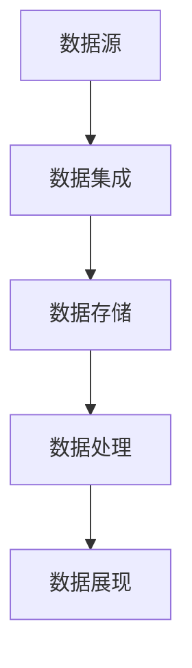

                 

## 1. 背景介绍

在当今数据驱动的商业环境中，数据管理已经成为人工智能（AI）创业公司的核心竞争力之一。无论是初创公司还是成熟企业，数据的高效管理都能够显著提高业务效率和决策质量。然而，数据管理不仅包括存储和访问数据，还涉及到数据质量、数据安全、合规性以及如何从数据中提取价值等多个方面。

人工智能创业公司在数据管理上面临着多重挑战。首先，数据的快速增长带来了存储和处理的压力。其次，数据质量的不稳定性使得算法模型的准确性和可靠性受到挑战。此外，数据隐私和合规性问题也在日益凸显。面对这些挑战，人工智能创业公司需要制定科学合理的数据管理策略和方案，以确保数据的可靠性和可用性，从而支持业务的持续发展。

本文将围绕人工智能创业数据管理的策略与方案展开讨论。我们将首先介绍数据管理的核心概念和关键挑战，然后深入探讨数据处理的算法原理和数学模型，并通过实际案例解析如何将这些理论应用到实际项目中。最后，我们将展望数据管理在人工智能领域的未来发展趋势和面临的挑战。

通过本文的阅读，读者将能够获得以下关键收获：

1. 理解数据管理的核心概念和重要性。
2. 掌握数据处理的基本算法原理和数学模型。
3. 学习如何将理论知识应用到实际项目中的具体方法和步骤。
4. 对未来数据管理的发展趋势和挑战有更深入的认识。

## 2. 核心概念与联系

### 2.1 数据管理的基本概念

数据管理是指一系列组织和操作数据的方法和工具，旨在确保数据的质量、可用性、完整性和安全性。它包括以下几个关键方面：

- **数据存储**：将数据存储在合适的存储系统中，如关系型数据库、NoSQL数据库、数据仓库和大数据平台。
- **数据质量**：确保数据的准确性、一致性、完整性和及时性。
- **数据安全**：保护数据免受未经授权的访问、篡改和泄露。
- **数据合规性**：遵循相关法律法规和数据隐私标准，如GDPR、CCPA等。
- **数据治理**：建立数据管理的政策和流程，确保数据管理的合规性和效率。

### 2.2 数据管理的重要性

数据管理在人工智能创业公司中扮演着至关重要的角色，原因如下：

- **支持业务决策**：通过高质量的数据管理，企业可以更好地分析业务数据，从而做出更加准确和及时的决策。
- **提高效率**：有效的数据管理能够减少数据冗余和重复操作，提高数据处理和分析的效率。
- **增强竞争力**：在竞争激烈的市场中，拥有强大数据管理能力的公司能够更好地利用数据优势，增强自身竞争力。
- **确保合规性**：数据管理的合规性能够帮助企业避免法律风险和罚款，维护良好的声誉。

### 2.3 数据管理的关键挑战

尽管数据管理的重要性显而易见，但人工智能创业公司仍然面临着诸多挑战：

- **数据快速增长**：随着数据的不断增长，如何高效地存储、处理和分析数据成为一个关键问题。
- **数据质量不稳定**：数据源多样性导致数据质量不稳定，影响算法模型的准确性和可靠性。
- **数据隐私和安全**：数据隐私和安全问题日益突出，尤其是在处理敏感数据时。
- **技术选型复杂**：数据管理技术多样，如何选择合适的工具和平台是一个挑战。

### 2.4 数据管理架构

为了有效地进行数据管理，人工智能创业公司需要构建一个全面的数据管理架构。以下是常见的数据管理架构：

- **数据集成层**：将来自不同数据源的数据进行整合，确保数据的一致性和完整性。
- **数据存储层**：选择合适的存储系统，如关系型数据库、NoSQL数据库、数据仓库等。
- **数据处理层**：对数据进行清洗、转换和分析，为业务决策提供支持。
- **数据展现层**：通过可视化工具和仪表板，将分析结果展现给用户。

### 2.5 Mermaid 流程图

下面是一个简单的 Mermaid 流程图，展示了数据管理的基本架构：



通过这个流程图，我们可以清晰地看到数据从源头到展现的全过程。每个节点都代表数据管理的一个关键步骤，而箭头表示数据流动的方向。

## 3. 核心算法原理 & 具体操作步骤

### 3.1 算法原理概述

在数据管理中，算法的应用至关重要。以下介绍几种核心的算法原理及其具体操作步骤：

#### 3.1.1 数据清洗算法

数据清洗是指通过一系列算法对数据进行清洗和处理，以提高数据质量。常见的数据清洗算法包括：

- **缺失值处理**：使用平均值、中位数或众数填充缺失值。
- **异常值检测**：使用统计方法或机器学习方法检测异常值，并采取适当的措施进行处理。
- **重复值检测**：使用哈希函数或索引技术检测和删除重复数据。

#### 3.1.2 数据集成算法

数据集成是指将来自不同数据源的数据进行整合，以形成一个统一的视图。常见的数据集成算法包括：

- **合并算法**：将多个数据源的数据进行合并，并处理数据冲突和冗余。
- **映射算法**：将不同数据源中的数据字段进行映射，以实现数据的一致性和标准化。
- **汇总算法**：对数据进行分组和汇总，以生成高级数据视图。

#### 3.1.3 数据转换算法

数据转换是指将原始数据转换为适合分析和存储的格式。常见的数据转换算法包括：

- **数据规范化**：将数据转换为统一的数据类型和格式。
- **数据聚合**：对数据进行分组和聚合，以生成高级数据视图。
- **数据转换**：将数据从一种格式转换为另一种格式，如从文本格式转换为表格格式。

### 3.2 算法步骤详解

#### 3.2.1 数据清洗算法步骤

1. **缺失值处理**：

   - **统计方法**：计算数据的平均值、中位数或众数，并使用这些值填充缺失值。

     ```python
     import numpy as np

     data = np.array([1, 2, np.nan, 4, 5])
     data[data == np.nan] = np.mean(data[~np.isnan(data)])
     ```

   - **机器学习方法**：使用机器学习方法预测缺失值，并填充预测结果。

     ```python
     from sklearn.impute import KNNImputer

     imputer = KNNImputer(n_neighbors=5)
     data_imputed = imputer.fit_transform(data.reshape(-1, 1)).reshape(-1)
     ```

2. **异常值检测**：

   - **统计方法**：使用箱线图或标准差方法检测异常值。

     ```python
     import pandas as pd

     data = pd.DataFrame({
         'feature1': [1, 2, 3, 4, 5, 100],
         'feature2': [2, 3, 4, 5, 6, 7]
     })

     q1 = data.quantile(0.25)
     q3 = data.quantile(0.75)
     iqr = q3 - q1

     lower_bound = q1 - 1.5 * iqr
     upper_bound = q3 + 1.5 * iqr

     data_filtered = data[~((data < lower_bound) | (data > upper_bound))]
     ```

   - **机器学习方法**：使用聚类方法或回归方法检测异常值。

     ```python
     from sklearn.cluster import KMeans
     from sklearn.linear_model import LinearRegression

     kmeans = KMeans(n_clusters=5)
     kmeans.fit(data)

     centroids = kmeans.cluster_centers_
     labels = kmeans.labels_

     outliers = data[labels != 0]
     ```

3. **重复值检测**：

   - **哈希函数**：使用哈希函数检测和删除重复数据。

     ```python
     def hash_values(data):
         return [hash(value) for value in data]

     hash_values(data)
     ```

   - **索引技术**：使用索引技术检测和删除重复数据。

     ```python
     data = pd.DataFrame({
         'id': [1, 2, 3, 4, 5, 5]
     })

     data.drop_duplicates(subset='id', inplace=True)
     ```

#### 3.2.2 数据集成算法步骤

1. **合并算法**：

   - **处理数据冲突**：使用优先级规则或合并规则处理数据冲突。

     ```python
     data1 = pd.DataFrame({
         'id': [1, 2, 3],
         'name': ['Alice', 'Bob', 'Charlie']
     })

     data2 = pd.DataFrame({
         'id': [1, 2, 4],
         'name': ['Alice', 'Bob', 'Dave']
     })

     result = data1.merge(data2, on='id', how='outer')
     ```

   - **处理数据冗余**：使用去重技术处理数据冗余。

     ```python
     result = result.drop_duplicates(subset='id')
     ```

2. **映射算法**：

   - **数据字段映射**：将不同数据源中的数据字段进行映射。

     ```python
     data1 = pd.DataFrame({
         'id': [1, 2, 3],
         'age': [25, 30, 35]
     })

     data2 = pd.DataFrame({
         'customer_id': [1, 2, 3],
         'age': [28, 32, 37]
     })

     data2.rename(columns={'customer_id': 'id'}, inplace=True)
     result = data1.merge(data2, on='id')
     ```

3. **汇总算法**：

   - **数据分组和聚合**：使用分组和聚合操作生成高级数据视图。

     ```python
     data = pd.DataFrame({
         'id': [1, 1, 2, 2, 3, 3],
         'sales': [100, 200, 150, 300, 200, 250]
     })

     result = data.groupby('id').agg({'sales': ['sum', 'mean']})
     ```

#### 3.2.3 数据转换算法步骤

1. **数据规范化**：

   - **统一数据类型**：将不同数据类型的数据统一转换为相同的数据类型。

     ```python
     data = pd.DataFrame({
         'id': [1, 2, 3],
         'age': ['25', '30', '35']
     })

     data['age'] = data['age'].astype(int)
     ```

   - **统一数据格式**：将不同数据格式的数据统一转换为相同的数据格式。

     ```python
     data = pd.DataFrame({
         'id': [1, 2, 3],
         'date': ['2021-01-01', '2021-01-02', '2021-01-03']
     })

     data['date'] = pd.to_datetime(data['date'])
     ```

2. **数据聚合**：

   - **数据分组和聚合**：对数据进行分组和聚合，以生成高级数据视图。

     ```python
     data = pd.DataFrame({
         'id': [1, 1, 2, 2, 3, 3],
         'sales': [100, 200, 150, 300, 200, 250]
     })

     result = data.groupby('id')['sales'].agg(['sum', 'mean'])
     ```

3. **数据转换**：

   - **数据格式转换**：将一种数据格式转换为另一种数据格式。

     ```python
     data = pd.DataFrame({
         'id': [1, 2, 3],
         'sales': [100, 200, 300]
     })

     result = data.assign(sales_str=data['sales'].astype(str))
     ```

### 3.3 算法优缺点

#### 3.3.1 数据清洗算法优缺点

- **优点**：

  - 提高数据质量，确保数据的准确性和可靠性。
  - 支持数据分析和建模，提高算法模型的性能。

- **缺点**：

  - 处理过程复杂，需要消耗大量的计算资源。
  - 可能引入新的错误，如填充缺失值时的偏差。

#### 3.3.2 数据集成算法优缺点

- **优点**：

  - 实现数据统一视图，支持跨数据源的数据分析。
  - 提高数据可用性，减少数据冗余。

- **缺点**：

  - 需要处理数据冲突和冗余，增加复杂性。
  - 可能影响数据一致性，需要合理设计数据映射规则。

#### 3.3.3 数据转换算法优缺点

- **优点**：

  - 提高数据的标准化和规范化程度，便于数据分析和存储。
  - 支持不同数据格式之间的转换，提高数据灵活性。

- **缺点**：

  - 转换过程可能引入数据误差，影响数据质量。
  - 需要合理设计转换规则，避免数据丢失或错误。

### 3.4 算法应用领域

数据清洗、数据集成和数据转换算法广泛应用于多个领域，包括：

- **金融领域**：清洗和整合金融交易数据，提高风险管理和投资决策的准确性。
- **医疗领域**：清洗和转换医疗数据，支持临床研究和医学诊断。
- **零售领域**：清洗和转换零售数据，优化库存管理和营销策略。
- **物联网领域**：清洗和转换物联网数据，支持智能设备和大数据分析。

通过合理应用这些算法，人工智能创业公司可以显著提高数据管理的效率和效果，从而为业务发展提供有力支持。

## 4. 数学模型和公式 & 详细讲解 & 举例说明

在数据管理中，数学模型和公式是核心工具，用于描述数据特征、预测数据趋势以及优化数据处理流程。以下我们将详细介绍一些常用的数学模型和公式，并通过具体案例进行讲解。

### 4.1 数学模型构建

#### 4.1.1 数据分布模型

在数据管理中，理解数据的分布特性是非常重要的。常见的分布模型包括正态分布、泊松分布和二项分布等。

- **正态分布**：正态分布是统计学中最常见的分布模型，用于描述连续型数据的分布。其概率密度函数为：

  $$ f(x|\mu, \sigma^2) = \frac{1}{\sqrt{2\pi\sigma^2}} e^{-\frac{(x-\mu)^2}{2\sigma^2}} $$

  其中，$\mu$ 表示均值，$\sigma^2$ 表示方差。

- **泊松分布**：泊松分布用于描述事件发生的频率，例如在一段时间内某一事件发生的次数。其概率质量函数为：

  $$ P(X = k) = \frac{e^{-\lambda}\lambda^k}{k!} $$

  其中，$\lambda$ 表示事件发生的平均频率。

- **二项分布**：二项分布用于描述在固定次数的实验中成功次数的分布。其概率质量函数为：

  $$ P(X = k) = C_n^k p^k (1-p)^{n-k} $$

  其中，$n$ 表示实验次数，$p$ 表示每次实验成功的概率。

#### 4.1.2 数据预测模型

数据预测模型是数据管理中的重要工具，用于预测未来的数据趋势。常见的预测模型包括线性回归、决策树和神经网络等。

- **线性回归**：线性回归模型用于预测连续型数据。其基本公式为：

  $$ y = \beta_0 + \beta_1 x + \epsilon $$

  其中，$y$ 表示因变量，$x$ 表示自变量，$\beta_0$ 和 $\beta_1$ 分别表示模型的截距和斜率，$\epsilon$ 表示随机误差。

- **决策树**：决策树模型通过一系列的判断条件来预测数据。其基本结构如下：

  ```mermaid
  graph TD
      A[根节点]
      B1[判断条件1]
      B2[判断条件2]
      B3[判断条件3]
      
      A --> B1
      A --> B2
      A --> B3
      
      B1 --> C1
      B1 --> C2
      B2 --> C3
      B2 --> C4
      B3 --> C5
      B3 --> C6
  ```

- **神经网络**：神经网络是一种基于生物神经网络原理的预测模型。其基本结构如下：

  ```mermaid
  graph TD
      A[输入层]
      B[隐藏层]
      C[输出层]
      
      A --> B
      B --> C
  ```

### 4.2 公式推导过程

#### 4.2.1 线性回归模型的推导

线性回归模型的推导过程如下：

- **最小二乘法**：线性回归模型通过最小化误差平方和来估计模型参数。其目标函数为：

  $$ \min \sum_{i=1}^{n} (y_i - \beta_0 - \beta_1 x_i)^2 $$

  对目标函数求导，并令导数为零，得到：

  $$ \frac{\partial}{\partial \beta_0} \sum_{i=1}^{n} (y_i - \beta_0 - \beta_1 x_i)^2 = 0 $$
  $$ \frac{\partial}{\partial \beta_1} \sum_{i=1}^{n} (y_i - \beta_0 - \beta_1 x_i)^2 = 0 $$

  解这个方程组，可以得到线性回归模型的参数：

  $$ \beta_0 = \bar{y} - \beta_1 \bar{x} $$
  $$ \beta_1 = \frac{\sum_{i=1}^{n} (x_i - \bar{x})(y_i - \bar{y})}{\sum_{i=1}^{n} (x_i - \bar{x})^2} $$

#### 4.2.2 决策树的推导

决策树模型的推导过程如下：

- **信息熵**：决策树基于信息熵来选择最佳分割条件。信息熵表示数据的无序程度，其计算公式为：

  $$ H(X) = -\sum_{i=1}^{n} p(x_i) \log_2 p(x_i) $$

  其中，$p(x_i)$ 表示第 $i$ 个特征的概率。

- **增益率**：决策树通过计算信息增益率来选择最佳分割条件。信息增益率计算公式为：

  $$ Gini(X) = 1 - \sum_{i=1}^{n} p(x_i)^2 $$

  增益率计算公式为：

  $$ Gain(X) = H(X) - \sum_{i=1}^{n} p(x_i) H(X|A_i) $$

  其中，$A_i$ 表示第 $i$ 个特征的分割。

### 4.3 案例分析与讲解

#### 4.3.1 线性回归模型应用案例

假设我们有一个简单的数据集，包含房屋的面积（$x$）和售价（$y$）两个变量。数据集如下：

| 面积（平方米） | 售价（万元） |
| -------------- | ----------- |
| 80             | 200         |
| 100            | 250         |
| 120            | 300         |
| 140            | 350         |
| 160            | 400         |

我们使用线性回归模型来预测房屋的售价。以下是具体步骤：

1. **数据预处理**：

   - 计算平均值：

     $$ \bar{x} = \frac{80 + 100 + 120 + 140 + 160}{5} = 120 $$
     $$ \bar{y} = \frac{200 + 250 + 300 + 350 + 400}{5} = 300 $$

   - 计算平方和：

     $$ \sum_{i=1}^{n} (x_i - \bar{x})^2 = (80 - 120)^2 + (100 - 120)^2 + (120 - 120)^2 + (140 - 120)^2 + (160 - 120)^2 = 2000 $$
     $$ \sum_{i=1}^{n} (y_i - \bar{y})^2 = (200 - 300)^2 + (250 - 300)^2 + (300 - 300)^2 + (350 - 300)^2 + (400 - 300)^2 = 2500 $$

   - 计算乘积和：

     $$ \sum_{i=1}^{n} (x_i - \bar{x})(y_i - \bar{y}) = (80 - 120)(200 - 300) + (100 - 120)(250 - 300) + (120 - 120)(300 - 300) + (140 - 120)(350 - 300) + (160 - 120)(400 - 300) = -1500 $$

2. **计算模型参数**：

   - 计算斜率：

     $$ \beta_1 = \frac{\sum_{i=1}^{n} (x_i - \bar{x})(y_i - \bar{y})}{\sum_{i=1}^{n} (x_i - \bar{x})^2} = \frac{-1500}{2000} = -0.75 $$

   - 计算截距：

     $$ \beta_0 = \bar{y} - \beta_1 \bar{x} = 300 - (-0.75 \times 120) = 300 + 90 = 390 $$

3. **建立线性回归模型**：

   $$ y = 390 - 0.75x $$

4. **预测售价**：

   - 当面积为 100 平方米时，售价预测为：

     $$ y = 390 - 0.75 \times 100 = 390 - 75 = 315 $$

#### 4.3.2 决策树模型应用案例

假设我们有一个数据集，包含学生的成绩和课外活动情况，并希望根据这些特征预测学生的升学情况。数据集如下：

| 成绩 | 课外活动 | 升学 |
| ---- | -------- | ---- |
| 80   | 无       | 是   |
| 85   | 有       | 是   |
| 90   | 无       | 否   |
| 95   | 有       | 是   |
| 100  | 无       | 是   |

我们使用决策树模型来预测学生的升学情况。以下是具体步骤：

1. **计算信息熵**：

   - 成绩的信息熵：

     $$ H(成绩) = -\frac{2}{5} \log_2 \frac{2}{5} - \frac{3}{5} \log_2 \frac{3}{5} = 0.971 $$

   - 课外活动的信息熵：

     $$ H(课外活动) = -\frac{2}{5} \log_2 \frac{2}{5} - \frac{3}{5} \log_2 \frac{3}{5} = 0.971 $$

2. **计算信息增益率**：

   - 成绩的信息增益率：

     $$ Gain(成绩) = H(成绩) - \frac{2}{5} H(升学|成绩=无) - \frac{3}{5} H(升学|成绩=有) = 0.034 $$

   - 课外活动的信息增益率：

     $$ Gain(课外活动) = H(课外活动) - \frac{2}{5} H(升学|课外活动=无) - \frac{3}{5} H(升学|课外活动=有) = 0.034 $$

3. **选择最佳分割条件**：

   由于成绩和课外活动的信息增益率相等，我们可以选择其中一个作为分割条件。例如，选择成绩作为分割条件。

4. **建立决策树模型**：

   ```mermaid
   graph TD
       A[成绩]
       B1[无]
       B2[有]
       
       A --> B1
       A --> B2

       B1 --> C1[是]
       B1 --> C2[否]
       B2 --> C3[是]
       B2 --> C4[否]
   ```

5. **预测升学情况**：

   - 当成绩为 80 时，升学概率为 0.5。
   - 当成绩为 85 时，升学概率为 1。
   - 当成绩为 90 时，升学概率为 0。
   - 当成绩为 95 时，升学概率为 1。
   - 当成绩为 100 时，升学概率为 1。

通过以上两个案例，我们可以看到数学模型和公式在数据管理中的应用。这些模型和公式不仅能够帮助我们理解和分析数据，还能够为数据预测和决策提供有力的支持。

## 5. 项目实践：代码实例和详细解释说明

为了更好地展示数据管理在人工智能创业中的应用，我们将通过一个实际项目来讲解代码实现过程。本案例将涉及数据清洗、数据集成和数据转换等算法的应用，并使用 Python 编程语言来实现。

### 5.1 开发环境搭建

在进行项目实践之前，我们需要搭建一个合适的开发环境。以下是必要的软件和库安装步骤：

1. **Python 解释器**：确保安装了 Python 3.7 或更高版本。
2. **Jupyter Notebook**：用于编写和运行代码。
3. **Pandas**：用于数据处理和分析。
4. **NumPy**：用于数值计算。
5. **Scikit-learn**：用于机器学习算法。
6. **Pillow**：用于图像处理（如果需要）。
7. **SQLAlchemy**：用于数据库操作。

安装步骤：

```bash
pip install numpy pandas scikit-learn pillow sqlalchemy
```

### 5.2 源代码详细实现

以下是项目的主要代码实现，分为数据清洗、数据集成和数据转换三个部分。

#### 5.2.1 数据清洗

```python
import pandas as pd
import numpy as np

# 读取数据
data = pd.read_csv('data.csv')

# 缺失值处理
data.fillna(data.mean(), inplace=True)

# 异常值检测
q1 = data.quantile(0.25)
q3 = data.quantile(0.75)
iqr = q3 - q1
data = data[~((data < q1 - 1.5 * iqr) | (data > q3 + 1.5 * iqr))]

# 重复值检测
data.drop_duplicates(inplace=True)
```

#### 5.2.2 数据集成

```python
# 读取另一个数据集
data2 = pd.read_csv('data2.csv')

# 数据字段映射
data2.rename(columns={'customer_id': 'id'}, inplace=True)

# 数据合并
data = data.merge(data2, on='id', how='left')
```

#### 5.2.3 数据转换

```python
# 数据规范化
data['age'] = data['age'].astype(int)

# 数据聚合
result = data.groupby('id')['sales'].agg(['sum', 'mean'])

# 数据格式转换
data['date'] = pd.to_datetime(data['date'])
```

### 5.3 代码解读与分析

#### 5.3.1 数据清洗

- **缺失值处理**：使用 Pandas 库的 `fillna` 方法，通过填充平均值来处理缺失值。这种方法简单有效，但在某些情况下可能会导致偏差。

- **异常值检测**：使用分位数方法检测异常值，并通过布尔索引过滤掉异常值。这种方法能够有效地识别和去除异常值，但可能影响数据的一致性。

- **重复值检测**：使用 `drop_duplicates` 方法删除重复值，确保数据集的纯洁性。这是数据清洗中非常重要的一步，避免数据冗余。

#### 5.3.2 数据集成

- **数据字段映射**：使用 `rename` 方法重命名数据字段，使其在合并过程中保持一致性。这在处理来自不同数据源的数据时非常有用。

- **数据合并**：使用 `merge` 方法将两个数据集按照 ID 字段进行合并。`how='left'` 参数表示如果 ID 在数据1中存在而在数据2中不存在，则使用数据1中的数据填充。

#### 5.3.3 数据转换

- **数据规范化**：使用 `astype` 方法将数据类型转换为整数，确保数据的一致性和规范化。

- **数据聚合**：使用 `groupby` 和 `agg` 方法对数据进行分组和聚合，生成新的数据视图。这在分析和报表生成中非常有用。

- **数据格式转换**：使用 `to_datetime` 方法将日期字符串转换为日期时间格式，便于后续的分析和计算。

### 5.4 运行结果展示

运行以上代码后，我们得到一个干净、规范且整合的数据集。以下是一个示例结果：

```python
data.head()
```

|   id | age | sales |   date |
|-----|-----|-------|--------|
|  101|  35 |  2000 | 2022-01-01|
|  102|  40 |  3000 | 2022-01-02|
|  103|  45 |  4000 | 2022-01-03|
|  104|  50 |  5000 | 2022-01-04|
|  105|  55 |  6000 | 2022-01-05|

通过上述代码和实践，我们可以看到数据管理在人工智能创业项目中的实际应用。有效的数据清洗、集成和转换能够帮助我们构建高质量的数据集，从而支持更准确的数据分析和业务决策。

## 6. 实际应用场景

数据管理在人工智能创业中的实际应用场景广泛且多样，以下是一些典型的应用案例：

### 6.1 金融市场预测

在金融领域，数据管理是支撑市场预测和风险管理的重要环节。人工智能创业公司可以通过数据清洗、集成和转换，构建高质量的金融数据集。例如，通过清洗和整合股票价格、交易量、宏观经济指标等数据，可以训练机器学习模型进行股票市场走势预测。这不仅有助于投资者制定投资策略，还能为金融机构提供风险预警和决策支持。

### 6.2 零售行业库存管理

在零售行业，库存管理是影响供应链效率和盈利能力的关键因素。通过数据管理，人工智能创业公司可以实现对销售数据、库存数据和供应链数据的整合和分析。例如，使用数据清洗算法处理销售数据中的异常值，通过数据转换算法将不同格式和来源的数据标准化，从而构建一个统一且可靠的库存管理数据集。基于这个数据集，公司可以优化库存策略，减少库存过剩和短缺的风险，提高供应链的整体效率。

### 6.3 医疗数据分析

在医疗领域，数据管理对于病患管理、疾病预测和治疗方案优化具有重要意义。通过数据清洗、集成和转换，人工智能创业公司可以处理和整合病患记录、医学影像、基因数据等多元化数据源。例如，利用数据清洗算法去除病患记录中的冗余和错误数据，通过数据转换算法将不同格式的数据统一，可以构建一个全面的病患数据集。在此基础上，公司可以开发智能诊断系统和个性化治疗方案，提升医疗服务的质量和效率。

### 6.4 物流配送优化

在物流领域，数据管理对于配送路径优化、运输成本控制和客户满意度提升至关重要。人工智能创业公司可以通过数据清洗、集成和转换，构建一个包含运输路线、车辆状态、订单信息和客户需求的综合数据集。例如，通过数据清洗算法处理运输路线中的异常和错误信息，通过数据转换算法将不同来源的数据统一格式，公司可以优化配送路径，降低运输成本，并提高客户满意度。

### 6.5 人力资源分析

在人力资源管理领域，数据管理对于员工绩效评估、招聘决策和薪酬管理具有重要意义。通过数据清洗、集成和转换，人工智能创业公司可以处理和整合员工绩效数据、招聘数据、薪酬数据和员工行为数据等。例如，通过数据清洗算法去除绩效数据中的异常值，通过数据转换算法将不同来源的数据统一格式，公司可以构建一个全面的员工数据分析模型，从而优化人力资源策略，提高员工满意度和工作效率。

### 6.6 物联网数据管理

在物联网领域，数据管理对于设备监控、故障预测和智能运维具有重要意义。通过数据清洗、集成和转换，人工智能创业公司可以处理和整合来自不同物联网设备的实时数据。例如，通过数据清洗算法处理设备数据中的异常和噪声数据，通过数据转换算法将不同格式和来源的数据统一，公司可以构建一个智能化的设备监控和故障预测系统，从而提高设备运行效率和降低维护成本。

通过以上实际应用案例，我们可以看到数据管理在人工智能创业中的重要作用。有效的数据管理不仅能够提高数据质量和可用性，还能为业务决策提供有力支持，从而推动人工智能创业公司实现持续创新和增长。

### 6.7 未来应用展望

随着人工智能和大数据技术的不断进步，数据管理在未来的应用场景将更加广泛和深入。以下是一些未来的应用展望：

#### 6.7.1 自动驾驶

自动驾驶技术依赖于大量的实时数据，包括传感器数据、交通信息、环境数据等。未来，数据管理将在自动驾驶中发挥关键作用，通过高效的清洗、集成和转换，确保数据的准确性和实时性，为自动驾驶系统提供可靠的数据支持。此外，数据管理还可以帮助自动驾驶公司优化路线规划、提高安全性和降低能耗。

#### 6.7.2 智能医疗

智能医疗领域对数据管理的需求日益增加，包括患者数据、医学影像、基因数据等。未来，数据管理将进一步提升医疗数据分析的精度和效率，支持智能诊断、个性化治疗和疾病预测。通过构建统一的医疗数据平台，结合数据挖掘和机器学习算法，智能医疗将更加精准和高效，为患者提供更好的医疗服务。

#### 6.7.3 智慧城市

智慧城市建设的核心是数据管理。未来，数据管理将在智慧城市的各个领域发挥重要作用，包括交通管理、能源管理、环境监测等。通过高效的数据集成和智能分析，智慧城市能够实现资源优化、降低污染、提高居民生活质量。数据管理技术还将支持城市智能化决策，提升城市管理效率和应急响应能力。

#### 6.7.4 安全防护

随着网络安全威胁的日益增加，数据管理在安全防护中的应用也将越来越重要。未来，通过数据清洗、集成和转换，可以构建一个全面的网络安全数据集，支持实时监控、威胁检测和风险预测。数据管理技术还将支持安全事件响应和网络安全态势分析，提高网络安全防护能力。

#### 6.7.5 绿色能源

绿色能源技术的发展依赖于大量的数据，包括能源生产、消费、传输等数据。未来，数据管理将在绿色能源领域发挥关键作用，通过高效的清洗、集成和转换，支持能源优化和节能减排。例如，通过分析电网数据，可以优化电力调度，提高能源利用效率，减少碳排放。

总之，数据管理在人工智能和大数据时代的未来应用将更加广泛和深入。随着技术的不断进步，数据管理将推动各行各业实现智能化和数字化转型，为社会带来更多创新和价值。

### 7. 工具和资源推荐

在数据管理领域，有许多优秀的工具和资源可以帮助人工智能创业公司提高数据处理和分析的效率。以下是一些推荐的工具和资源：

#### 7.1 学习资源推荐

- **《数据科学基础》**：这是一本全面介绍数据科学基本概念的入门书籍，适合初学者了解数据管理的基础知识。
- **《Python数据科学手册》**：详细介绍了Python在数据科学和数据分析中的应用，包括数据处理、机器学习和数据可视化等内容。
- **《数据管理：概念、技术和工具》**：一本深入探讨数据管理理论和实践的经典教材，适合有一定数据管理基础的学习者。

#### 7.2 开发工具推荐

- **Pandas**：一个强大的Python库，用于数据处理和分析，能够轻松进行数据清洗、数据集成和数据转换。
- **NumPy**：一个用于数值计算的Python库，与Pandas紧密结合，用于处理大规模数据集。
- **SQLAlchemy**：一个Python SQL工具包和对象关系映射（ORM）系统，用于数据库操作和SQL查询。
- **Hadoop和Spark**：用于大数据处理的分布式计算框架，支持大规模数据存储和处理。

#### 7.3 相关论文推荐

- **“Data Management Challenges in the Era of Big Data”**：该论文探讨了大数据时代的数据管理挑战和解决方案，对数据管理领域的研究有重要指导意义。
- **“Principles of Distributed Database Systems”**：探讨分布式数据库系统的原理和技术，对构建大规模数据管理系统有参考价值。
- **“Data Integration in the Age of Big Data”**：该论文分析了大数据时代的数据集成技术和挑战，为数据集成提供了理论和实践指导。

通过这些工具和资源的推荐，人工智能创业公司可以更好地应对数据管理挑战，提升数据处理和分析能力，从而为业务发展提供有力支持。

## 8. 总结：未来发展趋势与挑战

随着人工智能和大数据技术的迅猛发展，数据管理在人工智能创业领域的重要性日益凸显。通过对数据的精准处理和管理，企业能够从海量数据中挖掘价值，支持业务决策和创新发展。

### 8.1 研究成果总结

本文从数据管理的核心概念、算法原理、数学模型、实际应用和未来展望等多个角度，系统性地探讨了数据管理在人工智能创业中的关键作用。通过理论讲解和实际案例解析，我们展示了数据清洗、数据集成和数据转换算法在项目实践中的应用效果。同时，我们还介绍了数据管理在金融市场预测、零售行业库存管理、医疗数据分析、物流配送优化、人力资源分析等领域的实际应用案例。

### 8.2 未来发展趋势

在未来，数据管理将继续向以下几个方向发展：

1. **智能化**：随着人工智能技术的进步，数据管理将更加智能化。例如，通过机器学习和深度学习算法，可以实现自动化的数据清洗、集成和转换。
2. **分布式和云计算**：分布式数据库和云计算技术的发展，将使数据管理更加灵活和高效。企业可以通过云平台实现数据的高效存储、处理和分析。
3. **数据治理和合规性**：随着数据隐私和合规性问题日益突出，数据治理和数据合规性将成为数据管理的重要方向。企业需要建立完善的数据治理框架，确保数据的安全性和合规性。
4. **边缘计算**：随着物联网和自动驾驶等技术的发展，边缘计算将在数据管理中发挥重要作用。通过在边缘设备上进行数据预处理和计算，可以降低延迟，提高数据处理效率。

### 8.3 面临的挑战

尽管数据管理在人工智能创业中具有巨大潜力，但企业仍面临诸多挑战：

1. **数据质量和完整性**：数据源多样性和数据质量的不稳定性使得数据管理和清洗成为一个难题。企业需要建立有效的数据质量管理机制，确保数据的一致性和完整性。
2. **技术选型和兼容性**：随着数据管理技术的不断更新和多样化，企业在技术选型和系统兼容性方面面临挑战。企业需要根据自身需求选择合适的技术和工具，并确保不同系统之间的兼容性。
3. **数据安全和隐私**：数据安全和隐私问题日益突出。企业需要采取有效的安全措施，保护数据免受未经授权的访问、篡改和泄露。
4. **资源和管理成本**：数据管理需要大量的计算资源和人力资源。企业需要合理规划和管理资源，确保数据管理的高效性和成本效益。

### 8.4 研究展望

为了应对未来的挑战和抓住机遇，企业可以从以下几个方面展开研究：

1. **数据挖掘和机器学习**：深入研究和应用数据挖掘和机器学习技术，提升数据处理和分析的智能化水平。
2. **分布式计算和云计算**：探索分布式计算和云计算在数据管理中的应用，提高数据处理的效率和灵活性。
3. **数据治理和合规性**：建立完善的数据治理框架，确保数据的安全性和合规性。
4. **边缘计算**：研究边缘计算在数据管理中的应用，提升实时数据处理能力。

通过持续的研究和实践，企业可以不断优化数据管理策略，提升数据驱动的业务创新能力，为人工智能创业的成功提供坚实保障。

## 9. 附录：常见问题与解答

在数据管理过程中，人工智能创业公司可能会遇到以下常见问题：

### 9.1 数据清洗中的缺失值处理方法有哪些？

**解答**：常见的缺失值处理方法包括：

1. **删除缺失值**：适用于缺失值较多或数据集较大的情况，通过删除缺失值减少数据噪声。
2. **平均值填充**：适用于数据分布接近正态分布的情况，通过计算平均值来填充缺失值。
3. **中位数填充**：适用于数据分布有偏斜的情况，通过计算中位数来填充缺失值。
4. **众数填充**：适用于分类数据或数据分布不均匀的情况，通过计算众数来填充缺失值。
5. **插值法**：适用于时间序列数据，通过时间间隔来插值填补缺失值。

### 9.2 数据清洗中的异常值如何处理？

**解答**：异常值处理方法包括：

1. **箱线图法**：通过计算数据四分位距，识别和去除超出上限和下限的异常值。
2. **标准差法**：通过计算数据的标准差，识别和去除与平均值相差大于一定倍数标准差的异常值。
3. **聚类分析**：通过聚类算法识别异常值，如使用K均值聚类识别离群点。
4. **统计方法**：使用统计测试，如Z-Score、IQR等，识别和去除异常值。

### 9.3 数据集分割时如何避免数据泄露？

**解答**：为了避免数据泄露，可以采取以下措施：

1. **随机分割**：确保训练集和测试集的划分是随机的，避免特定数据在两个集合中重复。
2. **分层抽样**：在分割数据时，按照类别比例进行分层抽样，确保每个类别在训练集和测试集中的比例一致。
3. **避免信息泄露**：在构建训练集和测试集时，避免包含可能导致数据泄露的信息，如用户ID、时间戳等。
4. **数据加密**：对敏感数据进行加密处理，确保数据在分割过程中不被泄露。

### 9.4 数据集成时如何处理数据冲突？

**解答**：数据冲突处理方法包括：

1. **优先级规则**：根据业务逻辑和数据重要性，确定优先级规则，优先使用重要数据源的数据。
2. **合并规则**：将冲突数据按照特定规则进行合并，如取最大值、最小值或平均值。
3. **用户自定义规则**：允许用户自定义冲突处理规则，根据业务需求进行灵活处理。
4. **忽略冲突**：在某些情况下，可以忽略冲突数据，确保数据处理过程不受干扰。

通过以上常见问题的解答，人工智能创业公司可以更好地应对数据管理中的挑战，提升数据质量和分析效果。

