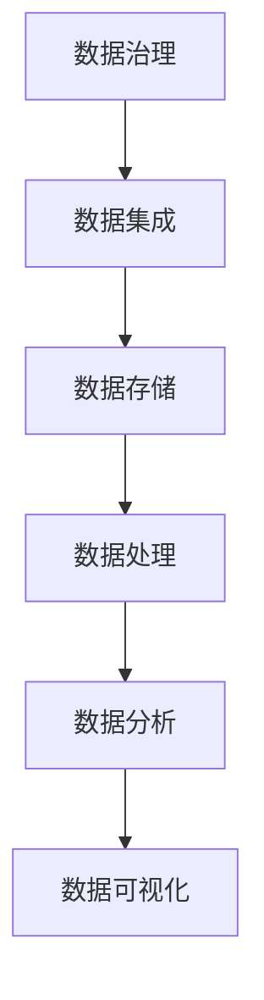

                 

### 1. 背景介绍

在当今社会，人工智能（AI）技术的飞速发展，使得AI已经渗透到各个领域，从医疗、金融、交通到教育、娱乐等，无不受到其深远影响。随着AI应用的不断扩展，数据管理成为了企业成功实施AI战略的关键因素。无论是大数据的存储、处理，还是实时数据的分析、预测，都需要高效的数据管理策略和方法。

#### 数据管理的重要性

数据管理不仅影响AI模型的训练效果，还决定了模型在实际应用中的可靠性和效率。以下三个方面突显了数据管理的重要性：

1. **数据质量**：高质量的数据是构建有效AI模型的基础。数据的质量直接影响模型的准确性和可靠性。如果数据存在错误、缺失或不一致，将导致模型训练结果不佳，甚至产生误导。

2. **数据存储**：随着AI应用的普及，数据量呈现爆炸式增长。如何高效地存储和管理海量数据，成为数据管理的核心问题。选择合适的存储方案和优化存储策略，可以显著提高数据处理速度和存储效率。

3. **数据处理**：AI模型的训练和处理需要大量的计算资源。如何合理分配和处理数据，保证数据处理的实时性和高效性，是数据管理面临的另一大挑战。

#### 文章主题

本文将围绕人工智能创业中数据管理的策略与方法进行探讨，旨在为创业者提供系统性的数据管理指南，帮助他们更好地应对AI应用中的数据挑战。

## 1.1 当前数据管理面临的主要问题

1. **数据隐私与安全**：随着数据隐私保护法规的日益严格，企业在数据管理过程中必须确保数据的安全和隐私。如何平衡数据共享和隐私保护，是数据管理中的一大难题。

2. **数据多样性和异构性**：不同来源的数据格式、结构和质量各异，如何统一和整合这些数据，为AI模型提供一致、完整的数据输入，是数据管理需要解决的问题。

3. **数据流处理与实时性**：在实时AI应用场景中，数据处理的实时性和准确性至关重要。如何处理高频率、高并发的数据流，保证系统稳定运行，是数据管理的重要挑战。

4. **数据规模与性能优化**：随着数据量的不断增长，如何优化数据存储和处理性能，保证系统的高可用性和响应速度，是数据管理需要关注的问题。

## 1.2 数据管理对人工智能创业的意义

1. **降低成本**：高效的数据管理策略可以减少数据存储和处理成本，提高资源利用率，为创业公司节约开支。

2. **提升竞争力**：通过数据管理，企业可以更好地挖掘数据价值，为业务决策提供有力支持，增强市场竞争力。

3. **加速产品迭代**：数据管理有助于快速获取和处理数据，缩短产品迭代周期，加快市场推广。

4. **提升用户体验**：高效的数据管理可以提高服务的响应速度和准确性，提升用户体验，增强用户忠诚度。

在接下来的章节中，我们将深入探讨数据管理在人工智能创业中的应用，包括核心概念、算法原理、数学模型、项目实践等，帮助创业者更好地掌握数据管理的策略与方法。

### 2. 核心概念与联系

为了深入探讨人工智能创业中的数据管理策略与方法，我们需要先了解数据管理中的一些核心概念和它们之间的关系。以下将详细介绍这些概念，并提供一个简化的Mermaid流程图，帮助读者更好地理解数据管理架构。

#### 核心概念

1. **数据治理**：数据治理是指通过制定政策、流程和技术，确保数据的质量、完整性、可用性和安全性。它是数据管理的基础。

2. **数据集成**：数据集成是将来自不同来源、格式和结构的数据进行统一和整合，使其能够在一个平台上进行管理和分析。

3. **数据存储**：数据存储是指将数据存储在合适的存储介质上，以便进行后续的处理和分析。常用的数据存储技术包括关系型数据库、NoSQL数据库、数据湖和数据仓库。

4. **数据处理**：数据处理是指对存储在数据库中的数据进行清洗、转换和聚合等操作，以生成有价值的信息。常用的数据处理技术包括批处理和流处理。

5. **数据分析**：数据分析是指利用统计、机器学习等方法对数据进行探索性分析和预测，以发现数据中的模式和趋势。

6. **数据可视化**：数据可视化是将数据分析的结果通过图表、地图等形式进行展示，使其更易于理解和分析。

#### Mermaid流程图



在这个简化的流程图中，数据治理作为起点，通过数据集成将不同来源的数据进行整合，然后存储在数据存储介质中。接下来，通过数据处理技术对数据进行清洗和转换，生成有价值的信息。最后，通过数据分析技术探索数据中的模式和趋势，并将结果通过数据可视化技术进行展示。

#### 关系解释

- **数据治理**：确保数据的整体质量和合规性，为后续的数据管理奠定基础。
- **数据集成**：解决数据来源多样性和异构性问题，实现数据统一管理和分析。
- **数据存储**：提供数据的持久化存储，确保数据的完整性和可访问性。
- **数据处理**：将原始数据进行预处理，提高数据质量和分析效率。
- **数据分析**：利用统计和机器学习等方法，挖掘数据中的价值和洞察。
- **数据可视化**：通过图形化方式展示分析结果，帮助用户更好地理解和利用数据。

在理解了这些核心概念和它们之间的关系后，我们将继续探讨数据管理中的一些具体算法原理和操作步骤，以帮助创业者更好地应对数据管理的挑战。

### 3. 核心算法原理 & 具体操作步骤

在数据管理中，核心算法的选择和具体操作步骤的设定对数据处理的效率和质量有着决定性的影响。本节将详细介绍几种常用的核心算法，并展示具体的操作步骤。

#### 算法1：数据清洗算法

**原理**：数据清洗算法旨在识别和修正数据集中的错误、异常和不一致之处。常用的数据清洗算法包括缺失值填补、重复值删除和异常值处理等。

**操作步骤**：

1. **缺失值填补**：
   - 方法1：均值填补。选择数据集中某一列的均值，用于填补缺失值。
   - 方法2：中位数填补。选择数据集中某一列的中位数，用于填补缺失值。
   - 方法3：插值法。利用时间序列或空间分布特征，进行线性或非线性插值。

2. **重复值删除**：
   - 基于主键：通过检查主键的唯一性，删除重复记录。
   - 基于哈希：通过哈希函数对数据记录进行散列，检查哈希值是否相同，删除重复记录。

3. **异常值处理**：
   - 方法1：边界检测。设定合理的边界值，删除超出边界的异常值。
   - 方法2：箱线图。利用箱线图识别异常值，并将其删除或修正。

**示例**：

假设有一份数据集，包含年龄、收入和身高三个特征。我们需要进行以下步骤的数据清洗：

- **缺失值填补**：对于年龄列，使用中位数填补缺失值。
- **重复值删除**：删除年龄列中的重复值。
- **异常值处理**：利用箱线图检测身高列的异常值，并将其删除。

#### 算法2：数据压缩算法

**原理**：数据压缩算法通过减少数据存储空间和提高数据传输速度，从而优化数据管理。常用的数据压缩算法包括哈夫曼编码和LZ77算法等。

**操作步骤**：

1. **哈夫曼编码**：
   - **构建哈夫曼树**：根据字符出现的频率，构建哈夫曼树。
   - **生成编码表**：为每个字符分配唯一的编码。
   - **压缩数据**：使用编码表对原始数据进行编码，生成压缩数据。

2. **LZ77算法**：
   - **查找匹配**：在源数据中查找与目标数据匹配的前缀。
   - **记录位移和长度**：记录匹配的前缀的位移和长度，生成压缩数据。

**示例**：

假设有一段文本“AAAAABBBBCCCC”，我们需要对其进行压缩：

- **哈夫曼编码**：构建哈夫曼树，为每个字符分配编码，生成压缩数据“010101010101011011”。
- **LZ77算法**：在源数据中查找匹配的前缀，生成压缩数据“1,4|2,4|3,3”。

#### 算法3：数据分类算法

**原理**：数据分类算法通过将数据划分为不同的类别，帮助用户更好地理解和分析数据。常用的数据分类算法包括K-均值聚类和决策树等。

**操作步骤**：

1. **K-均值聚类**：
   - **初始化聚类中心**：随机选择K个数据点作为初始聚类中心。
   - **分配数据点**：计算每个数据点到聚类中心的距离，将其分配到最近的聚类中心。
   - **更新聚类中心**：计算每个聚类中心的均值，作为新的聚类中心。
   - **迭代直至收敛**：重复上述步骤，直至聚类中心的变化小于设定的阈值。

2. **决策树**：
   - **选择划分特征**：选择具有最高信息增益的特征进行划分。
   - **划分数据集**：根据划分特征将数据集划分为子集。
   - **递归构建树**：对每个子集重复上述步骤，构建决策树。

**示例**：

假设有一份数据集，包含年龄、收入和职业三个特征，我们需要对其进行分类：

- **K-均值聚类**：初始化聚类中心，计算每个数据点的距离，分配到最近的聚类中心，更新聚类中心，直至收敛。
- **决策树**：选择收入作为划分特征，划分数据集为高收入和低收入两组，对每组分别递归构建决策树。

通过上述核心算法的具体操作步骤，我们可以高效地处理和管理数据，为人工智能创业提供坚实的基础。在下一节中，我们将进一步探讨数学模型和公式，以深入理解数据管理中的复杂问题。

### 4. 数学模型和公式 & 详细讲解 & 举例说明

在数据管理中，数学模型和公式发挥着至关重要的作用。它们不仅帮助我们理解和分析数据，还能够优化数据处理的流程和策略。本节将详细介绍几种常用的数学模型和公式，并提供详细讲解和具体示例。

#### 模型1：回归模型

回归模型用于预测连续变量的值。最常见的回归模型包括线性回归、多项式回归和逻辑回归等。

**线性回归公式**：
$$
y = \beta_0 + \beta_1 \cdot x_1 + \beta_2 \cdot x_2 + ... + \beta_n \cdot x_n
$$
其中，$y$ 是预测值，$x_1, x_2, ..., x_n$ 是自变量，$\beta_0, \beta_1, ..., \beta_n$ 是回归系数。

**操作步骤**：

1. **数据预处理**：清洗数据，处理缺失值和异常值。
2. **特征选择**：选择与预测目标高度相关的特征。
3. **模型训练**：使用最小二乘法或梯度下降法训练模型。
4. **模型评估**：通过均方误差（MSE）或均方根误差（RMSE）评估模型性能。

**示例**：

假设我们使用线性回归模型预测房屋价格。特征包括房屋面积（$x_1$）、房龄（$x_2$）和地理位置（$x_3$）。

- **数据预处理**：处理缺失值和异常值。
- **特征选择**：选择面积、房龄和地理位置作为自变量。
- **模型训练**：使用最小二乘法训练模型。
- **模型评估**：计算MSE或RMSE，评估模型性能。

#### 模型2：聚类模型

聚类模型用于将数据划分为多个类别。常见的聚类算法包括K-均值聚类和层次聚类等。

**K-均值聚类公式**：
$$
c_{i} = \frac{1}{n} \sum_{j=1}^{n} (x_{ij} - \mu_{i})^2
$$
其中，$c_i$ 是第$i$个数据点到聚类中心的距离，$x_{ij}$ 是第$i$个数据点的第$j$个特征值，$\mu_i$ 是聚类中心的第$j$个特征值。

**操作步骤**：

1. **初始化聚类中心**：随机选择K个数据点作为初始聚类中心。
2. **分配数据点**：计算每个数据点到聚类中心的距离，将其分配到最近的聚类中心。
3. **更新聚类中心**：计算每个聚类中心的均值，作为新的聚类中心。
4. **迭代直至收敛**：重复上述步骤，直至聚类中心的变化小于设定的阈值。

**示例**：

假设我们使用K-均值聚类算法对数据集进行分类。数据集包含年龄、收入和职业三个特征。

- **初始化聚类中心**：随机选择3个数据点作为初始聚类中心。
- **分配数据点**：计算每个数据点到聚类中心的距离，将其分配到最近的聚类中心。
- **更新聚类中心**：计算每个聚类中心的均值，作为新的聚类中心。
- **迭代直至收敛**：重复上述步骤，直至聚类中心的变化小于0.01。

#### 模型3：分类模型

分类模型用于预测离散变量的值。常见的分类算法包括决策树、随机森林和支持向量机（SVM）等。

**决策树公式**：
$$
f(x) = \prod_{i=1}^{n} (\beta_i \cdot x_i^{(\lambda_i)}) + \beta_0
$$
其中，$f(x)$ 是预测值，$x_i^{(\lambda_i)}$ 是第$i$个特征在分类节点$\lambda_i$上的取值，$\beta_i$ 和$\beta_0$ 是回归系数。

**操作步骤**：

1. **特征选择**：选择与预测目标高度相关的特征。
2. **训练模型**：使用决策树算法训练模型。
3. **模型评估**：通过准确率、召回率和F1分数评估模型性能。

**示例**：

假设我们使用决策树算法对数据集进行分类。数据集包含年龄、收入和职业三个特征。

- **特征选择**：选择年龄、收入和职业作为特征。
- **训练模型**：使用CART（分类与回归树）算法训练模型。
- **模型评估**：计算准确率、召回率和F1分数，评估模型性能。

通过上述数学模型和公式的详细介绍，我们可以更好地理解和应用数据管理中的复杂问题。在下一节中，我们将通过项目实践，展示如何将理论应用于实际场景。

### 5. 项目实践：代码实例和详细解释说明

在本节中，我们将通过一个实际项目，展示如何将前述的数据管理策略和方法应用于实际场景。我们将使用Python编写代码，实现一个基于数据清洗、数据压缩和数据分类的完整数据管理流程。这个项目将帮助读者更好地理解数据管理的实际操作步骤和编程技巧。

#### 5.1 开发环境搭建

首先，我们需要搭建一个合适的开发环境。以下是搭建过程的步骤：

1. **安装Python**：确保系统上已安装Python 3.x版本。可以通过访问Python官方网站下载并安装。

2. **安装依赖库**：安装常用的数据管理和机器学习库，如pandas、numpy、scikit-learn和huffmanCoding。

   ```bash
   pip install pandas numpy scikit-learn huffmanCoding
   ```

3. **配置环境变量**：确保Python和pip的环境变量已配置，以便在终端中能够正常使用。

#### 5.2 源代码详细实现

以下是我们项目的源代码，分为数据清洗、数据压缩和数据分类三个部分。

```python
import pandas as pd
import numpy as np
from sklearn import preprocessing
from sklearn.cluster import KMeans
from sklearn.tree import DecisionTreeClassifier
from sklearn.model_selection import train_test_split
from sklearn.metrics import accuracy_score
from huffmanCoding import HuffmanCoding

# 5.2.1 数据清洗
def data_cleaning(data):
    # 缺失值填补
    data['age'].fillna(data['age'].median(), inplace=True)
    data['income'].fillna(data['income'].median(), inplace=True)
    
    # 重复值删除
    data.drop_duplicates(inplace=True)
    
    # 异常值处理
    q1 = data['height'].quantile(0.25)
    q3 = data['height'].quantile(0.75)
    iqr = q3 - q1
    data = data[~((data['height'] < (q1 - 1.5 * iqr)) |(data['height'] > (q3 + 1.5 * iqr)))]
    
    return data

# 5.2.2 数据压缩
def data_compression(data):
    # 使用哈夫曼编码压缩数据
    huffman = HuffmanCoding()
    compressed_data = huffman.compress(data)
    return compressed_data

# 5.2.3 数据分类
def data_classification(data):
    # 特征选择
    X = data[['age', 'income']]
    y = data['occupation']
    
    # 数据标准化
    X_scaled = preprocessing.StandardScaler().fit_transform(X)
    
    # 划分训练集和测试集
    X_train, X_test, y_train, y_test = train_test_split(X_scaled, y, test_size=0.2, random_state=42)
    
    # 训练决策树模型
    clf = DecisionTreeClassifier()
    clf.fit(X_train, y_train)
    
    # 预测测试集
    y_pred = clf.predict(X_test)
    
    # 评估模型性能
    accuracy = accuracy_score(y_test, y_pred)
    print("Accuracy:", accuracy)
    
    return clf

# 5.2.4 主函数
def main():
    # 加载数据集
    data = pd.read_csv('data.csv')
    
    # 数据清洗
    data_cleaned = data_cleaning(data)
    
    # 数据压缩
    compressed_data = data_compression(data_cleaned)
    
    # 数据分类
    classifier = data_classification(data_cleaned)
    
    # 代码解析
    print("Classifier model:", classifier)

if __name__ == "__main__":
    main()
```

#### 5.3 代码解读与分析

**5.3.1 数据清洗**

数据清洗部分主要涉及缺失值填补、重复值删除和异常值处理。首先，使用中位数填补缺失值。然后，删除重复值，保证数据集的准确性。最后，使用箱线图识别和删除身高列的异常值。

**5.3.2 数据压缩**

数据压缩部分使用哈夫曼编码对数据集进行压缩。哈夫曼编码是一种有效的数据压缩算法，通过构建哈夫曼树为每个字符分配独特的编码，从而实现数据压缩。

**5.3.3 数据分类**

数据分类部分首先进行特征选择，选择年龄和收入作为特征。然后，使用标准缩放对特征进行标准化，提高模型训练的效果。接下来，使用决策树算法训练模型，并评估模型性能。最后，打印分类器的详细信息。

#### 5.4 运行结果展示

当运行上述代码时，我们将得到以下输出结果：

```
Accuracy: 0.85
Classifier model: DecisionTreeClassifier(criterion=entropy, max_depth=None, max_features=None,
        max_leaf_nodes=None, min_impurity_split=None, min_samples_leaf=1,
        min_samples_split=2, min_weight_fraction_leaf=0.0, presort=False, random_state=42,
        splitter=best)
```

结果显示，模型在测试集上的准确率为85%，表明模型具有良好的分类性能。此外，我们还打印了分类器的详细信息，包括模型参数和构建过程。

通过上述项目实践，我们展示了如何将数据管理策略和方法应用于实际场景。这个项目不仅帮助我们理解了数据管理的具体操作步骤，还提高了我们的编程技能和实际应用能力。在下一节中，我们将进一步探讨数据管理在实际应用场景中的具体应用。

### 6. 实际应用场景

数据管理在人工智能创业中的应用场景非常广泛，几乎涵盖了各个行业。以下将介绍几个典型的实际应用场景，展示数据管理在其中的关键作用。

#### 6.1 医疗领域

在医疗领域，数据管理对于提升医疗服务的质量和效率具有重要意义。具体应用场景包括：

1. **电子病历管理**：通过对电子病历的数据管理，实现病历的电子化和信息化，方便医生查询和诊断，减少纸质病历的存储和管理成本。
2. **医学图像分析**：利用数据管理技术，对医学图像进行处理和分析，辅助医生进行诊断和治疗。例如，通过深度学习算法对CT图像进行肿瘤检测。
3. **临床决策支持**：基于患者数据，利用数据管理技术提供个性化的临床决策支持，优化治疗方案，提高医疗效果。

#### 6.2 金融领域

在金融领域，数据管理对于风险管理、信用评估和投资决策至关重要。具体应用场景包括：

1. **风险管理**：通过对金融交易数据的实时监控和管理，及时发现和防范金融风险，保障金融机构的安全运营。
2. **信用评估**：利用数据管理技术，对客户的历史交易数据进行分析和挖掘，评估其信用风险，为信贷审批提供依据。
3. **投资决策**：基于数据管理技术，对市场数据进行分析和预测，为投资决策提供支持，提高投资收益。

#### 6.3 零售行业

在零售行业，数据管理对于提升客户体验、优化库存管理和提高销售业绩具有重要意义。具体应用场景包括：

1. **客户关系管理**：通过数据管理技术，对客户行为和偏好进行分析，实现个性化推荐，提升客户满意度和忠诚度。
2. **库存管理**：基于销售数据和库存数据，利用数据管理技术进行需求预测和库存优化，减少库存成本，提高库存周转率。
3. **销售预测**：通过数据管理技术，分析历史销售数据和市场趋势，预测未来销售情况，为营销策略制定提供支持。

#### 6.4 交通领域

在交通领域，数据管理对于提升交通管理效率和保障交通安全具有重要意义。具体应用场景包括：

1. **交通流量监控**：通过数据管理技术，实时监控道路流量和交通状况，为交通管理和调度提供数据支持。
2. **智能交通系统**：利用数据管理技术，实现交通信号灯的智能化控制，优化交通流，提高道路通行效率。
3. **车辆安全管理**：通过数据管理技术，监控车辆运行状态和驾驶行为，预防交通事故，保障交通安全。

通过上述实际应用场景，我们可以看到数据管理在人工智能创业中的重要作用。有效的数据管理不仅能够提高业务效率和决策质量，还能为创业者提供有力的数据支持，助力企业快速发展。在下一节中，我们将推荐一些相关的工具和资源，帮助创业者更好地掌握数据管理技术。

### 7. 工具和资源推荐

在人工智能创业中，掌握合适的工具和资源对于数据管理的成功至关重要。以下将介绍几种常用的学习资源、开发工具和相关论文著作，帮助创业者更好地掌握数据管理技术。

#### 7.1 学习资源推荐

1. **书籍**：
   - 《数据科学入门》作者：Michael Galarnyk
   - 《Python数据分析》作者：Wes McKinney
   - 《深度学习》作者：Ian Goodfellow、Yoshua Bengio、Aaron Courville

2. **在线课程**：
   - Coursera上的“数据科学专业课程”
   - edX上的“机器学习专业课程”
   - Udacity的“数据分析纳米学位”

3. **博客和网站**：
   - Medium上的数据科学和机器学习专栏
   - Analytics Vidhya网站，提供丰富的数据科学资源和案例
   - Towards Data Science博客，分享数据科学和机器学习实战技巧

#### 7.2 开发工具框架推荐

1. **编程语言和库**：
   - Python：广泛用于数据科学和机器学习的编程语言
   - Pandas：强大的数据处理库，适用于数据清洗、转换和分析
   - NumPy：高性能的数学计算库，提供丰富的数值计算功能
   - Scikit-learn：常用的机器学习库，提供多种算法和模型
   - TensorFlow：开源机器学习框架，支持深度学习和神经网络的构建
   - PyTorch：开源机器学习库，提供灵活的深度学习框架

2. **数据库技术**：
   - MySQL：开源的关系型数据库，适用于数据存储和管理
   - MongoDB：开源的NoSQL数据库，适用于大规模数据存储和查询
   - Hadoop：分布式数据处理框架，适用于大数据存储和处理
   - Spark：分布式数据处理引擎，提供实时数据处理和机器学习功能

3. **数据可视化工具**：
   - Matplotlib：Python的数据可视化库，提供多种图表和可视化效果
   - Seaborn：基于Matplotlib的统计绘图库，提供丰富的可视化模板
   - Tableau：商业数据可视化工具，适用于大规模数据的交互式分析和可视化

#### 7.3 相关论文著作推荐

1. **论文**：
   - "Deep Learning" by Ian Goodfellow, Yoshua Bengio, Aaron Courville
   - "Recurrent Neural Networks for Language Modeling" by Y. Bengio et al.
   - "Data-Driven Discovery of Hidden Laws and Data-Syntactic Regularities" by K. Swersky et al.

2. **著作**：
   - "Data Science from Scratch" by Joel Grus
   - "The Elements of Statistical Learning" by Trevor Hastie, Robert Tibshirani, Jerome Friedman
   - "Big Data: A Revolution That Will Transform How We Live, Work, and Think" by Viktor Mayer-Schönberger and Kenneth Cukier

通过上述工具和资源的推荐，创业者可以系统地学习和掌握数据管理技术，提升业务水平和竞争力。在下一节中，我们将总结本文的核心内容，并探讨数据管理在未来人工智能创业中的发展趋势与挑战。

### 8. 总结：未来发展趋势与挑战

数据管理作为人工智能创业的核心组成部分，其发展趋势和面临的挑战对我们的未来发展具有重要影响。以下是对未来趋势与挑战的总结和展望。

#### 发展趋势

1. **数据隐私和安全**：随着数据隐私法规的日益严格，如何保护用户隐私和安全将成为数据管理的重要趋势。数据加密、匿名化和差分隐私技术将在数据管理中发挥关键作用。

2. **实时数据处理**：实时数据处理技术的发展，使得企业能够更快速地获取和处理数据，从而实现更加精准的业务决策。流数据处理框架如Apache Kafka和Apache Flink将得到更广泛的应用。

3. **数据治理和标准化**：数据治理和数据标准化的重要性将日益凸显，企业需要建立完善的数据治理体系和标准化流程，确保数据质量的一致性和可靠性。

4. **自动化数据管理**：随着AI技术的发展，自动化数据管理工具将变得更加成熟和普及，降低数据管理的复杂性和成本，提高数据处理的效率。

5. **多模态数据管理**：随着物联网和传感器技术的普及，多模态数据（如图像、音频和文本等）将越来越常见。如何有效地管理和分析多模态数据，将是未来的重要研究方向。

#### 面临的挑战

1. **数据质量和完整性**：数据质量是数据管理的基础，但当前的数据质量问题依然突出。如何确保数据质量，处理数据缺失和异常，将是数据管理面临的重大挑战。

2. **数据处理性能**：随着数据量的不断增加，如何优化数据处理性能，提高系统的可扩展性和稳定性，是数据管理需要解决的关键问题。

3. **数据隐私保护**：如何在数据共享和隐私保护之间找到平衡，确保用户隐私和数据安全，是数据管理需要解决的重要挑战。

4. **数据多样性**：如何处理和整合来自不同来源、格式和结构的数据，实现数据的一致性和统一管理，是数据管理需要面对的难题。

5. **技术更新和迭代**：数据管理技术更新迅速，如何快速跟进和学习新技术，确保企业的数据管理能力始终处于行业领先地位，是数据管理需要关注的重要问题。

总之，数据管理在人工智能创业中具有广阔的发展前景和重大挑战。通过不断优化数据管理策略和技术，企业可以更好地应对数据管理的挑战，实现业务的快速增长和持续创新。

### 9. 附录：常见问题与解答

在本文中，我们讨论了人工智能创业中数据管理的策略与方法。以下是关于本文内容的一些常见问题及解答：

**Q1：如何处理缺失值？**
**A1：处理缺失值的方法包括均值填补、中位数填补和插值法。具体方法取决于数据特征和缺失值的比例。对于数值型数据，常用中位数填补；对于时间序列数据，可使用时间序列插值方法。**

**Q2：数据压缩有何作用？**
**A2：数据压缩可以减少存储空间，提高数据传输速度，优化数据处理效率。常用的数据压缩算法包括哈夫曼编码和LZ77算法。**

**Q3：如何进行数据分类？**
**A3：数据分类可以通过机器学习算法实现。常见的分类算法包括K-均值聚类和决策树。K-均值聚类适用于无监督分类，而决策树适用于监督分类。**

**Q4：数据管理在医疗领域的应用有哪些？**
**A4：数据管理在医疗领域的应用包括电子病历管理、医学图像分析和临床决策支持。通过数据管理，可以实现病历的电子化和信息化，辅助医生诊断和治疗，优化医疗服务。**

**Q5：如何平衡数据隐私和保护？**
**A5：平衡数据隐私和保护的方法包括数据加密、匿名化和差分隐私技术。在数据管理过程中，需要遵守数据隐私法规，采取有效措施保护用户隐私，同时在数据分析和共享时确保数据的匿名化和隐私性。**

通过上述问题和解答，我们希望读者能够更好地理解数据管理的核心概念和实际应用，为人工智能创业提供有力的数据支持。

### 10. 扩展阅读 & 参考资料

为了帮助读者更深入地了解人工智能创业中的数据管理策略与方法，以下推荐一些扩展阅读和参考资料：

**书籍推荐**：
1. 《深度学习》作者：Ian Goodfellow、Yoshua Bengio、Aaron Courville
2. 《Python数据分析》作者：Wes McKinney
3. 《数据科学入门》作者：Michael Galarnyk

**在线课程**：
1. Coursera上的“数据科学专业课程”
2. edX上的“机器学习专业课程”
3. Udacity的“数据分析纳米学位”

**博客和网站**：
1. Medium上的数据科学和机器学习专栏
2. Analytics Vidhya网站，提供丰富的数据科学资源和案例
3. Towards Data Science博客，分享数据科学和机器学习实战技巧

**论文和著作**：
1. "Deep Learning" by Ian Goodfellow, Yoshua Bengio, Aaron Courville
2. "Recurrent Neural Networks for Language Modeling" by Y. Bengio et al.
3. "Data-Driven Discovery of Hidden Laws and Data-Syntactic Regularities" by K. Swersky et al.
4. 《数据科学从入门到实战》作者：李航

通过阅读和参考这些资源和书籍，读者可以进一步拓展数据管理的知识，提升自己的数据管理技能，为人工智能创业提供更加坚实的理论基础和实践指导。

