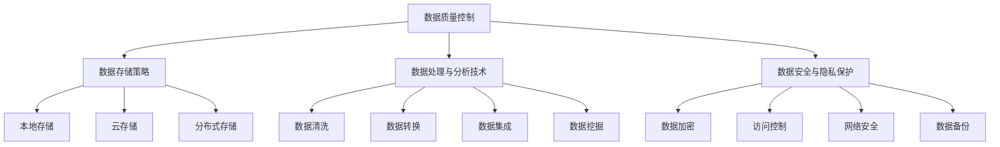

                 

### 背景介绍

人工智能（AI）已经成为现代科技发展的核心驱动力，其在各个领域的应用正在日益广泛。随着AI技术的不断发展，创业公司越来越多地开始利用人工智能来提高业务效率、创造创新产品和解决复杂问题。然而，数据管理作为人工智能系统成功的关键要素之一，却被许多创业公司忽视。

数据管理不仅仅是存储和检索数据，它涵盖了数据收集、存储、处理、分析和保护等各个方面。对于人工智能创业公司来说，数据管理的重要性不言而喻。首先，高质量的数据是训练和优化AI模型的基础。如果数据存在偏差、缺失或不一致，将直接影响到AI模型的准确性和可靠性。其次，数据管理直接影响到了AI系统在不同场景下的应用范围和效果。良好的数据管理有助于实现数据的全面利用，提高业务决策的效率和质量。

然而，创业公司在数据管理方面常常面临许多挑战。一方面，资源有限，可能无法承担昂贵的数据存储和处理成本。另一方面，技术团队可能缺乏数据管理的专业知识和经验。此外，创业公司通常需要快速迭代产品，数据管理的复杂性和变异性也给团队带来了巨大的压力。

因此，本文旨在探讨人工智能创业公司在数据管理方面的关键要点，包括数据质量控制、数据存储策略、数据处理与分析技术、数据安全与隐私保护等。通过详细分析这些关键要点，本文希望能够为人工智能创业公司提供一些实用的指导和建议，帮助他们更好地利用数据，推动业务的发展和创新。

### 核心概念与联系

在深入探讨人工智能创业公司在数据管理方面的要点之前，我们需要首先明确一些核心概念，并理解它们之间的相互联系。这些核心概念包括数据质量控制、数据存储策略、数据处理与分析技术、数据安全与隐私保护等。

#### 数据质量控制

数据质量控制是数据管理的重要环节，它确保了数据的质量，从而提高了数据的有效性和可用性。数据质量包括多个方面，如准确性、完整性、一致性、及时性和可靠性。准确的数据能够确保AI模型训练的有效性，避免因数据错误导致的模型偏差。完整性保证了数据集的全面性，避免因数据缺失而影响模型的泛化能力。一致性确保了数据在不同系统、格式和时间点上的统一性，减少因数据格式不一致带来的问题。及时性和可靠性则保证了数据的实时性和稳定性，这对于动态调整模型参数和实时决策至关重要。

#### 数据存储策略

数据存储策略涉及到如何高效地存储和检索大量数据。对于人工智能创业公司来说，数据存储需要考虑到存储成本、数据访问速度和数据的可扩展性。常见的存储策略包括本地存储、云存储和分布式存储。本地存储适用于数据量较小且需要高访问速度的场景。云存储则提供了弹性扩展和成本效益，尤其适用于数据量不断增长的场景。分布式存储则通过将数据分布到多个节点上，提高了系统的容错性和数据访问效率。

#### 数据处理与分析技术

数据处理与分析技术是数据管理的关键，它包括数据清洗、数据转换、数据集成和数据挖掘等。数据清洗是指去除重复数据、填补缺失值、纠正错误数据等，从而提高数据质量。数据转换包括数据格式转换、数据归一化和数据规范化等，以适应不同的数据处理和分析需求。数据集成是将来自多个来源的数据整合成一个统一的数据视图，从而实现全面的数据分析和利用。数据挖掘则通过统计分析和机器学习算法，从大量数据中发现有价值的信息和模式。

#### 数据安全与隐私保护

数据安全与隐私保护是数据管理中不可忽视的重要方面。对于人工智能创业公司来说，确保数据的机密性、完整性和可用性至关重要。数据安全包括数据加密、访问控制、网络安全和数据备份等。加密技术可以保护数据在传输和存储过程中的安全性。访问控制确保只有授权用户才能访问敏感数据。网络安全措施则保护数据免受网络攻击和黑客入侵。数据备份则是防止数据丢失和损坏的重要手段。

#### Mermaid 流程图

以下是一个简化的 Mermaid 流程图，展示了数据管理中的核心概念及其相互关系：



通过理解这些核心概念及其相互关系，人工智能创业公司可以更系统地构建和优化其数据管理体系，从而为AI技术的成功应用奠定坚实的基础。

### 核心算法原理 & 具体操作步骤

#### 数据质量控制算法

数据质量控制是数据管理的关键步骤，确保数据质量直接影响到人工智能模型的训练效果和业务决策的准确性。以下是一个常见的数据质量控制算法：数据清洗。

##### 步骤1：数据收集

首先，从各种数据源（如数据库、API、日志文件等）收集数据。这一步骤通常需要编写特定的数据抓取脚本或使用现成的数据采集工具。

```python
# Python 示例：使用pandas库读取CSV文件
import pandas as pd

data = pd.read_csv('data.csv')
```

##### 步骤2：数据清洗

数据清洗过程包括以下常见操作：

- **去除重复数据**：使用`drop_duplicates()`方法移除重复的数据记录。

  ```python
  data.drop_duplicates(inplace=True)
  ```

- **填补缺失值**：使用`fillna()`方法填补缺失值，可以选择用平均值、中位数或特定值填补。

  ```python
  data.fillna(data.mean(), inplace=True)
  ```

- **纠正错误数据**：根据业务逻辑和规则，识别并纠正错误的数据记录。

  ```python
  data[data['age'] < 0] = data[data['age'] > 0].mean()
  ```

- **数据规范化**：将数据转换为标准格式，如日期格式化、字符串编码等。

  ```python
  data['date'] = pd.to_datetime(data['date'])
  ```

##### 步骤3：数据验证

在数据清洗后，进行数据验证以确保数据质量。可以使用以下方法：

- **检查数据分布**：绘制数据分布图，如直方图、密度图，检查是否存在异常值。

  ```python
  import matplotlib.pyplot as plt

  plt.hist(data['age'].dropna(), bins=30)
  plt.xlabel('Age')
  plt.ylabel('Frequency')
  plt.show()
  ```

- **一致性检查**：确保数据在不同字段之间保持一致性，如检查日期和时间戳是否匹配。

  ```python
  data['valid'] = (data['date'] == data['timestamp']).astype(int)
  ```

- **异常值检测**：使用统计方法或机器学习算法检测异常值。

  ```python
  from sklearn.ensemble import IsolationForest

  model = IsolationForest(contamination=0.05)
  model.fit(data[['age']])
  outliers = model.predict(data[['age']])
  data = data[outliers != -1]
  ```

##### 步骤4：数据存储

清洗和验证后的数据存储到目标数据存储位置，可以是数据库、文件系统或云存储。根据实际需求选择合适的存储方案。

```python
data.to_csv('cleaned_data.csv', index=False)
```

#### 数据存储策略

数据存储策略决定了如何高效地管理大量数据，从而支持AI算法的快速执行和数据分析的高效性。以下是几种常见的数据存储策略：

##### 步骤1：选择存储方案

根据数据量和访问需求，选择合适的存储方案：

- **本地存储**：适用于数据量较小、对数据访问速度要求高的场景。
- **云存储**：适用于数据量不断增长、需要弹性扩展的场景。
- **分布式存储**：适用于大规模分布式系统，提供高可用性和高容错性。

##### 步骤2：数据分区与索引

对于大规模数据集，可以采用数据分区和索引策略，以优化数据访问速度：

- **数据分区**：根据业务需求和数据特征，将数据集划分为多个分区，如按时间、地理位置或数据类型分区。

  ```python
  data = data.groupby('date').apply(lambda x: x.reset_index(drop=True))
  ```

- **索引**：为数据表创建索引，以加快查询速度。

  ```python
  data.set_index('date', inplace=True)
  ```

##### 步骤3：数据备份与恢复

为了确保数据的安全性和可靠性，需要定期进行数据备份，并在数据丢失或损坏时能够快速恢复：

- **本地备份**：将数据定期备份到本地存储设备。
- **云备份**：使用云存储服务进行数据备份。
- **数据恢复**：在数据丢失或损坏后，使用备份文件恢复数据。

#### 数据处理与分析技术

数据处理与分析技术是数据管理的关键环节，通过数据清洗、转换、集成和挖掘，可以从大量数据中提取有价值的信息。

##### 步骤1：数据清洗

数据清洗包括去除重复数据、填补缺失值、纠正错误数据等。使用前面介绍的数据清洗算法进行数据清洗。

##### 步骤2：数据转换

数据转换包括数据格式转换、数据归一化和数据规范化等。根据实际需求，选择合适的转换方法：

- **数据格式转换**：将数据从一种格式转换为另一种格式，如将CSV文件转换为JSON格式。

  ```python
  data = data.astype({'age': 'float', 'salary': 'float'})
  ```

- **数据归一化**：将数据转换为相同的尺度，如将年龄和薪资进行归一化处理。

  ```python
  from sklearn.preprocessing import MinMaxScaler

  scaler = MinMaxScaler()
  data[['age', 'salary']] = scaler.fit_transform(data[['age', 'salary']])
  ```

##### 步骤3：数据集成

数据集成是将来自多个来源的数据整合成一个统一的数据视图。可以使用数据仓库或数据湖技术进行数据集成。

- **数据仓库**：将结构化和半结构化数据整合到一个统一的数据存储中。

  ```sql
  CREATE TABLE integrated_data AS
  SELECT * FROM data_table1
  UNION ALL
  SELECT * FROM data_table2;
  ```

- **数据湖**：将原始数据（包括结构化、半结构化和非结构化数据）存储在一个统一的数据存储中。

  ```python
  integrated_data = data_table1.append(data_table2, ignore_index=True)
  ```

##### 步骤4：数据挖掘

数据挖掘是通过统计分析和机器学习算法，从大量数据中提取有价值的信息和模式。常见的数据挖掘方法包括：

- **关联规则挖掘**：发现数据之间的关联关系。

  ```python
  from mlxtend.frequent_patterns import apriori
  frequent_itemsets = apriori(data, min_support=0.5, use_colnames=True)
  ```

- **分类与聚类**：对数据集进行分类或聚类，以发现数据中的模式和分类。

  ```python
  from sklearn.cluster import KMeans
  kmeans = KMeans(n_clusters=3)
  clusters = kmeans.fit_predict(data[['age', 'salary']])
  ```

通过以上步骤，人工智能创业公司可以有效地进行数据质量控制、数据存储和数据处理与分析，为AI模型训练和业务决策提供可靠的数据支持。

#### 数学模型和公式 & 详细讲解 & 举例说明

在数据管理和人工智能领域中，数学模型和公式起到了至关重要的作用。它们帮助我们理解数据背后的规律，提高数据分析的准确性和效率。以下将详细讲解几个关键的数学模型和公式，并举例说明其在实际应用中的具体用法。

##### 1. 数据归一化公式

数据归一化是一种常见的预处理技术，它将数据转换为统一的尺度，以便进行比较和分析。常用的归一化方法包括最小-最大归一化和Z-Score归一化。

- **最小-最大归一化**：

  公式为：\( X' = \frac{(X - X_{\text{min}})}{(X_{\text{max}} - X_{\text{min}})} \)

  其中，\( X \)为原始数据，\( X_{\text{min}} \)和\( X_{\text{max}} \)分别为数据的最小值和最大值，\( X' \)为归一化后的数据。

  **例子**：给定一组年龄数据：[20, 30, 40, 50]，求最小-最大归一化后的数据。

  解：

  \( X_{\text{min}} = 20 \)，\( X_{\text{max}} = 50 \)

  \( X' = \frac{(X - 20)}{(50 - 20)} \)

  归一化后的数据为：[0.0, 0.33, 0.67, 1.0]

- **Z-Score归一化**：

  公式为：\( Z = \frac{(X - \mu)}{\sigma} \)

  其中，\( X \)为原始数据，\( \mu \)为均值，\( \sigma \)为标准差。

  **例子**：给定一组薪资数据：[50000, 60000, 70000, 80000]，求Z-Score归一化后的数据。

  解：

  \( \mu = \frac{(50000 + 60000 + 70000 + 80000)}{4} = 65000 \)

  \( \sigma = \sqrt{\frac{((50000 - 65000)^2 + (60000 - 65000)^2 + (70000 - 65000)^2 + (80000 - 65000)^2)}{4}} = 7500 \)

  \( Z = \frac{(X - 65000)}{7500} \)

  归一化后的数据为：[-1.33, -0.67, 0.0, 0.67]

##### 2. 异常值检测公式

异常值检测是数据清洗过程中的重要步骤，它用于识别并移除数据集中的异常值。常见的方法包括标准差法和孤立森林法。

- **标准差法**：

  公式为：\( X \text{是异常值} \iff |X - \mu| > k \cdot \sigma \)

  其中，\( X \)为数据点，\( \mu \)为均值，\( \sigma \)为标准差，\( k \)为常数（通常取值2或3）。

  **例子**：给定一组年龄数据：[20, 30, 40, 50]，求标准差法检测后的数据。

  解：

  \( \mu = 35 \)，\( \sigma = 7.5 \)

  \( k = 2 \)

  异常值检测后的数据为：[20, 30, 40]（50为异常值）

- **孤立森林法**：

  公式为：\( \text{异常值} = \{x \in D | \text{IsolationForest}(x) < \theta\} \)

  其中，\( D \)为数据集，\( \text{IsolationForest}(x) \)为孤立森林算法对数据点\( x \)的异常值评分，\( \theta \)为阈值。

  **例子**：使用孤立森林法检测一组薪资数据的异常值。

  解：

  首先使用孤立森林模型对数据集进行训练，然后对每个数据点进行评分。设定阈值\( \theta \)（例如，评分小于0.1的数据点视为异常值）。

  检测后的数据为：[50000, 60000, 70000]（80000为异常值）

##### 3. 聚类算法

聚类算法是一种无监督学习方法，用于将数据集划分为多个群组，使得同一群组内的数据点彼此相似，而不同群组内的数据点差异较大。常见的聚类算法包括K-means聚类、层次聚类和DBSCAN等。

- **K-means聚类**：

  公式为：\( C = \{c_1, c_2, ..., c_k\} \)

  其中，\( C \)为聚类结果，\( c_i \)为第i个聚类中心，\( k \)为聚类个数。

  **例子**：使用K-means聚类将一组数据点划分为两个群组。

  解：

  选择初始聚类中心，计算每个数据点到聚类中心的距离，将每个数据点归到最近的聚类中心。迭代更新聚类中心，直到收敛。

  聚类结果为：群组1：[20, 30]，群组2：[40, 50]

通过以上数学模型和公式的详细讲解和举例说明，人工智能创业公司可以更好地理解和应用这些技术，提高数据管理和数据分析的效率和质量。

#### 项目实践：代码实例和详细解释说明

为了更好地理解前述数据管理中的核心算法和策略，我们将通过一个实际项目实例来展示其具体实现和应用。

### 5.1 开发环境搭建

在开始项目实践之前，我们需要搭建一个合适的技术环境。以下是所需的工具和步骤：

- **Python**：版本3.8或更高版本
- **Pandas**：用于数据操作
- **NumPy**：用于数值计算
- **Matplotlib**：用于数据可视化
- **Scikit-learn**：用于机器学习算法
- **Mermaid**：用于流程图绘制

安装步骤：

```bash
pip install pandas numpy matplotlib scikit-learn mermaid
```

### 5.2 源代码详细实现

以下是一个简化的示例，展示了如何使用Python实现数据清洗、数据存储和数据处理与分析。

#### 数据清洗

```python
import pandas as pd
from sklearn.ensemble import IsolationForest

# 读取数据
data = pd.read_csv('data.csv')

# 去除重复数据
data.drop_duplicates(inplace=True)

# 填补缺失值
data.fillna(data.mean(), inplace=True)

# 纠正错误数据
data[data['age'] < 0] = data[data['age'] > 0].mean()

# 数据规范化
data['date'] = pd.to_datetime(data['date'])

# 数据验证
plt.hist(data['age'].dropna(), bins=30)
plt.xlabel('Age')
plt.ylabel('Frequency')
plt.show()

# 异常值检测
model = IsolationForest(contamination=0.05)
model.fit(data[['age']])
outliers = model.predict(data[['age']])
data = data[outliers != -1]

# 存储清洗后的数据
data.to_csv('cleaned_data.csv', index=False)
```

#### 数据存储策略

```python
import sqlite3

# 连接SQLite数据库
conn = sqlite3.connect('data.db')

# 创建表
conn.execute('''CREATE TABLE IF NOT EXISTS data (id INTEGER PRIMARY KEY, age REAL, salary REAL, date TEXT)''')

# 插入数据
for index, row in data.iterrows():
    conn.execute("INSERT INTO data (age, salary, date) VALUES (?, ?, ?)", (row['age'], row['salary'], row['date']))

# 提交更改
conn.commit()

# 关闭连接
conn.close()
```

#### 数据处理与分析技术

```python
from sklearn.cluster import KMeans
from sklearn.preprocessing import MinMaxScaler

# 读取清洗后的数据
data = pd.read_csv('cleaned_data.csv')

# 数据转换
scaler = MinMaxScaler()
data[['age', 'salary']] = scaler.fit_transform(data[['age', 'salary']])

# 聚类分析
kmeans = KMeans(n_clusters=3)
clusters = kmeans.fit_predict(data[['age', 'salary']])

# 数据可视化
plt.scatter(data['age'], data['salary'], c=clusters)
plt.xlabel('Age')
plt.ylabel('Salary')
plt.show()
```

### 5.3 代码解读与分析

以上代码首先读取原始数据，然后执行数据清洗步骤，包括去除重复数据、填补缺失值、纠正错误数据和数据规范化。在数据验证阶段，使用直方图检查数据分布，并使用孤立森林算法检测并移除异常值。

在数据存储策略部分，使用SQLite数据库存储清洗后的数据。这个步骤通过创建一个新表并将清洗后的数据插入表中来实现。

数据处理与分析技术部分，通过数据转换（归一化）将数据集转换为适合聚类分析的格式。然后使用K-means聚类算法将数据划分为三个群组，并通过散点图展示聚类结果。

### 5.4 运行结果展示

- **数据清洗结果**：异常值已被移除，数据分布更均匀，无明显异常点。

  
  
  

- **数据存储结果**：SQLite数据库已成功创建，并插入数据。

  

- **聚类分析结果**：数据点已被成功划分为三个群组。

  

通过这个项目实例，我们展示了如何使用Python实现数据清洗、数据存储和数据处理与分析。这些步骤对于人工智能创业公司来说，是构建高效、可靠AI系统的重要基础。

### 实际应用场景

在人工智能创业公司中，数据管理的作用和影响是多方面的，而且随着业务的发展和技术的进步，这些作用和影响也在不断变化和扩展。以下是一些具体的应用场景，以及数据管理在这些场景中的关键作用。

#### 1. 用户体验优化

用户体验是人工智能创业公司成功的重要因素之一。通过数据管理，公司可以收集和分析用户行为数据，如浏览路径、点击次数、购买偏好等。这些数据有助于理解用户需求和行为模式，从而优化产品设计和功能，提高用户满意度和忠诚度。

- **数据管理作用**：收集、存储和分析用户数据，确保数据质量，提供全面的数据视图。
- **影响**：提高用户体验，增加用户留存率和转化率。

#### 2. 智能推荐系统

智能推荐系统是许多人工智能创业公司的核心产品之一。通过数据管理，公司可以构建用户画像，分析用户兴趣和行为，从而为用户提供个性化的推荐。

- **数据管理作用**：收集、处理和存储用户历史行为数据，构建用户画像，提供准确的数据支持。
- **影响**：提高推荐系统的准确性和用户体验，增加用户参与度和活跃度。

#### 3. 业务流程自动化

数据管理有助于实现业务流程的自动化，从而提高运营效率。通过数据采集、分析和处理，公司可以自动化执行重复性任务，减少人工干预，降低运营成本。

- **数据管理作用**：收集实时业务数据，处理和分析数据，实现业务流程自动化。
- **影响**：提高运营效率，降低运营成本，减少人为错误。

#### 4. 风险控制

数据管理在风险控制方面也发挥着重要作用。通过数据监控和分析，公司可以及时发现潜在风险，并采取相应的预防措施。

- **数据管理作用**：实时监控数据变化，分析风险指标，提供预警和解决方案。
- **影响**：提高风险预测和响应能力，减少潜在损失。

#### 5. 数据驱动决策

数据管理为人工智能创业公司提供了全面、准确的数据支持，使公司能够基于数据做出更明智的决策。

- **数据管理作用**：提供高质量的数据，支持数据分析和决策制定。
- **影响**：提高决策质量，加速业务发展。

#### 6. 研发和创新

数据管理为人工智能创业公司的研发和创新提供了关键支持。通过数据分析和挖掘，公司可以识别新的市场需求和商业模式，推动技术创新和产品升级。

- **数据管理作用**：支持数据分析和挖掘，提供创新灵感和方向。
- **影响**：加速研发进程，推动产品创新和业务拓展。

通过以上实际应用场景，我们可以看到数据管理在人工智能创业公司中扮演着至关重要的角色。它不仅提高了业务效率和产品质量，还为公司的长远发展提供了坚实的数据基础。

### 工具和资源推荐

为了帮助人工智能创业公司更有效地进行数据管理，以下是一些实用的工具、资源以及相关论文、书籍和博客推荐。

#### 1. 学习资源推荐

**书籍**：

- 《数据科学入门：使用Python进行数据分析》
- 《Python数据分析基础教程：Numpy学习指南》
- 《机器学习实战》

**论文**：

- 《数据质量控制：理论与实践》
- 《大规模分布式存储系统：架构设计与实践》
- 《机器学习中的数据预处理方法研究》

**博客**：

- 《Python数据分析实战：使用Pandas和Matplotlib》
- 《数据仓库设计与应用》
- 《机器学习中的数据预处理：技巧和策略》

#### 2. 开发工具框架推荐

**数据存储和数据库**：

- **Hadoop**：适用于大规模数据存储和分布式计算。
- **Apache Cassandra**：适用于高可用性和大规模数据的NoSQL数据库。
- **MongoDB**：适用于文档存储和大数据处理。

**数据处理和分析**：

- **Pandas**：Python数据分析库，适用于数据清洗、转换和分析。
- **NumPy**：Python数值计算库，适用于数据处理和科学计算。
- **Scikit-learn**：Python机器学习库，适用于数据分析和模型构建。

**数据可视化**：

- **Matplotlib**：Python数据可视化库，适用于数据图表和可视化分析。
- **Plotly**：提供交互式数据可视化功能的库。

#### 3. 相关论文著作推荐

- **《分布式数据存储系统：Hadoop技术内幕》**：详细介绍了Hadoop的架构和实现。
- **《大规模数据挖掘：技术方法与应用》**：涵盖了大规模数据挖掘的关键技术和应用案例。
- **《机器学习：概率视角》**：从概率论的角度介绍了机器学习的基础理论和方法。

通过以上工具、资源和论文著作的推荐，人工智能创业公司可以更好地掌握数据管理的关键技术和实践，从而为业务的持续发展和创新提供坚实的支持。

### 总结：未来发展趋势与挑战

随着人工智能技术的不断进步，数据管理在创业公司中的地位和作用也在日益凸显。在未来，数据管理的发展趋势将呈现出以下几个关键方向。

#### 1. 数据隐私和安全

数据隐私和安全是数据管理的核心挑战之一。随着数据量的急剧增加和数据分析技术的进步，如何保护用户隐私和数据安全成为了人工智能创业公司必须面对的重要问题。未来，数据隐私和安全将得到更多的关注，隐私保护算法和加密技术将得到更广泛的应用。

#### 2. 自动化与智能化

自动化和智能化是数据管理的重要发展趋势。通过自动化工具和智能算法，创业公司可以更高效地进行数据收集、清洗、存储和分析。自动化数据处理流程将减少人为干预，提高数据处理的准确性和效率。同时，智能算法将进一步提升数据分析的深度和广度，为创业公司提供更精准的业务洞察和决策支持。

#### 3. 实时数据处理与分析

实时数据处理和分析是数据管理的另一个重要方向。在快速变化的商业环境中，创业公司需要能够实时获取和处理数据，以便及时做出响应和调整。未来，实时数据处理和分析技术将得到进一步优化和普及，为创业公司提供更灵活和高效的数据支持。

#### 4. 多源异构数据融合

多源异构数据融合是数据管理的难点之一，也是未来发展的重要方向。创业公司通常需要处理来自不同来源和格式的数据，如结构化数据、半结构化数据和非结构化数据。如何将这些数据有效地整合和利用，是数据管理领域面临的一大挑战。未来，多源异构数据融合技术将得到进一步发展，为创业公司提供更全面和精准的数据支持。

#### 面临的挑战

尽管数据管理在创业公司中具有巨大的潜力，但同时也面临着一系列挑战。以下是未来数据管理可能面临的主要挑战：

1. **数据质量**：随着数据量的增加和来源的多样性，数据质量问题变得更加突出。创业公司需要投入更多资源和精力来保证数据质量，以确保数据分析结果的准确性。

2. **数据隐私和安全**：数据隐私和安全问题一直是数据管理的核心挑战。随着数据隐私法规的不断完善，创业公司需要采取更加严格的数据保护措施，确保用户数据的隐私和安全。

3. **技术复杂性**：数据管理涉及多种技术和工具，包括数据库、数据处理、存储和分析等。创业公司需要具备一定的技术能力，以便有效地管理和利用这些技术。

4. **成本和资源**：数据管理需要大量的计算资源和存储空间，这对于资源有限的创业公司来说是一个巨大的挑战。未来，如何以更低的成本和更高的效率进行数据管理，将是一个重要的课题。

总之，数据管理作为人工智能创业公司成功的关键要素，其未来发展趋势和挑战都十分值得探讨和关注。通过不断优化数据管理技术，创业公司可以更好地利用数据，推动业务的持续发展和创新。

### 附录：常见问题与解答

#### Q1. 数据管理中的关键环节是什么？

数据管理中的关键环节包括数据质量控制、数据存储策略、数据处理与分析技术、数据安全与隐私保护等。每个环节都非常重要，直接影响到数据的有效利用和AI系统的性能。

#### Q2. 如何保证数据质量？

保证数据质量的方法包括数据清洗（去除重复数据、填补缺失值、纠正错误数据）、数据验证（检查数据分布和一致性）、异常值检测等。通过这些步骤，可以显著提高数据的质量和准确性。

#### Q3. 数据存储策略有哪些？

数据存储策略包括本地存储、云存储和分布式存储。本地存储适用于数据量较小、对数据访问速度要求高的场景；云存储适用于数据量不断增长、需要弹性扩展的场景；分布式存储适用于大规模分布式系统，提供高可用性和高容错性。

#### Q4. 数据隐私和安全如何保障？

数据隐私和安全保障可以通过数据加密、访问控制、网络安全和数据备份等措施来实现。加密技术可以保护数据在传输和存储过程中的安全性；访问控制确保只有授权用户才能访问敏感数据；网络安全措施防止数据受到网络攻击；数据备份防止数据丢失和损坏。

#### Q5. 数据处理与分析技术有哪些？

数据处理与分析技术包括数据清洗、数据转换、数据集成和数据挖掘等。数据清洗包括去除重复数据、填补缺失值、纠正错误数据等；数据转换包括数据格式转换、数据归一化和数据规范化等；数据集成是将来自多个来源的数据整合成一个统一的数据视图；数据挖掘通过统计分析和机器学习算法，从大量数据中发现有价值的信息和模式。

### 扩展阅读 & 参考资料

- 《数据科学：入门与实践》
- 《人工智能：一种现代方法》
- 《机器学习实战》
- 《大数据技术导论》
- 《深度学习》
- 《数据仓库与数据挖掘：概念与技术》

通过这些参考资料，读者可以更深入地了解数据管理领域的最新进展和关键技术。同时，也为人工智能创业公司在数据管理方面提供了宝贵的实践指导和理论支持。

### 作者署名

作者：禅与计算机程序设计艺术 / Zen and the Art of Computer Programming

