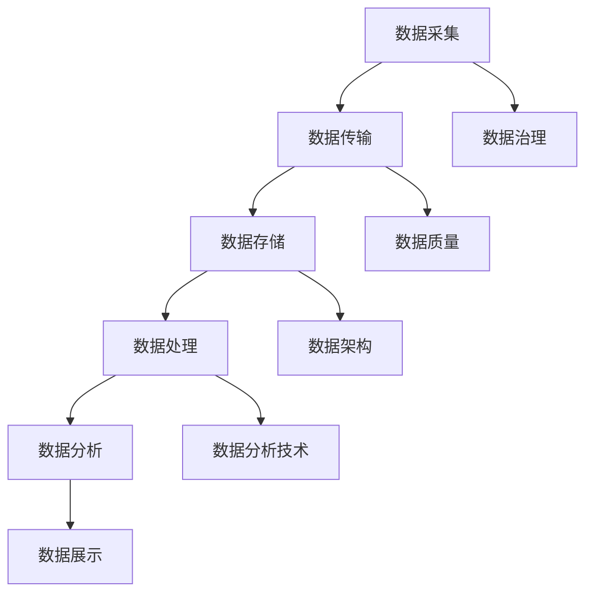

                 

人工智能作为当前科技发展的热点，在创业领域展现出了巨大的潜力。然而，随着人工智能应用的深入，数据管理成为了一个至关重要的环节。本文将探讨人工智能创业中的数据管理策略，旨在为创业团队提供切实可行的指导。

> 关键词：人工智能、数据管理、创业策略、数据分析、数据处理

> 摘要：本文从背景介绍出发，分析了人工智能创业中数据管理的重要性，探讨了核心概念与联系，详细介绍了核心算法原理与具体操作步骤，阐述了数学模型和公式，提供了项目实践案例，分析了实际应用场景，推荐了相关工具和资源，总结了研究成果与未来发展趋势，并提出了面临的研究挑战与展望。

## 1. 背景介绍

在当今数字化时代，数据已经成为企业最宝贵的资产之一。人工智能创业的兴起，使得数据管理的重要性愈加凸显。数据不仅驱动着人工智能的决策过程，也影响着创业项目的成功与否。有效的数据管理策略能够帮助创业团队提高数据利用效率，降低数据错误率，从而提升整体业务水平。

然而，数据管理并非一项简单的任务。它涉及到数据的采集、存储、处理、分析等多个环节，需要创业团队具备一定的技术和管理能力。此外，随着数据量的不断增加，数据管理的复杂性也日益增加，这对创业团队提出了更高的要求。

本文将围绕人工智能创业数据管理的核心问题，探讨有效的数据管理策略，以期为创业团队提供参考和指导。

## 2. 核心概念与联系

在探讨数据管理策略之前，我们需要了解一些核心概念和它们之间的联系。

### 2.1 数据类型

首先，我们需要明确数据类型。数据可以分为结构化数据和非结构化数据。结构化数据通常指存储在数据库中的数据，如关系型数据库中的表。非结构化数据则包括文本、图片、音频、视频等，它们没有固定的数据格式。

### 2.2 数据流

数据流是数据从源头到目的地的传输过程。一个完整的数据流通常包括数据采集、数据传输、数据存储、数据处理、数据分析和数据展示等环节。

### 2.3 数据质量

数据质量是数据管理的核心问题之一。高质量的数据能够提高数据分析的准确性和可靠性，反之，低质量的数据可能会导致错误的决策。

### 2.4 数据分析

数据分析是数据管理的关键环节，它涉及到数据挖掘、统计分析、机器学习等技术，用于从数据中提取有价值的信息和模式。

### 2.5 数据治理

数据治理是指对数据生命周期进行管理，包括数据采集、存储、处理、分析和共享等环节。良好的数据治理能够确保数据的安全、合规和有效利用。

### 2.6 数据架构

数据架构是数据管理的基础，它定义了数据的组织结构、数据流和数据关系。一个良好的数据架构能够提高数据的可扩展性和可维护性。

下面是一个使用Mermaid绘制的数据管理流程图，展示了这些核心概念之间的联系。



## 3. 核心算法原理 & 具体操作步骤

### 3.1 算法原理概述

在人工智能创业中，数据管理需要依赖多种算法，其中常用的包括数据清洗算法、数据压缩算法、数据分类算法等。这里，我们将以数据清洗算法为例，介绍其原理和操作步骤。

数据清洗算法主要用于处理脏数据，包括缺失值填充、异常值处理、数据格式转换等。其核心原理是通过对数据进行预处理，提高数据质量，为后续的数据分析和建模提供可靠的数据基础。

### 3.2 算法步骤详解

#### 3.2.1 缺失值填充

缺失值填充是数据清洗的重要步骤之一。常见的缺失值填充方法包括：

1. **平均值填充**：将缺失值替换为该特征的平均值。
2. **中位数填充**：将缺失值替换为该特征的中位数。
3. **众数填充**：将缺失值替换为该特征的众数。
4. **前向填充或后向填充**：使用前后已有的值来填充缺失值。

#### 3.2.2 异常值处理

异常值处理包括检测和去除异常值。常见的异常值处理方法包括：

1. **IQR方法**：使用三倍四分位距（IQR）来检测和去除异常值。
2. **基于规则的异常值处理**：根据业务逻辑定义规则来识别和去除异常值。

#### 3.2.3 数据格式转换

数据格式转换包括将不同类型的数据转换为统一格式。例如，将日期格式转换为YYYY-MM-DD，将字符串转换为数值等。

### 3.3 算法优缺点

数据清洗算法的优点在于能够有效提高数据质量，为后续分析提供可靠的基础。然而，其缺点在于可能会引入新的误差，并且处理过程相对复杂。

### 3.4 算法应用领域

数据清洗算法广泛应用于各个领域，如金融、医疗、零售等。在人工智能创业中，数据清洗算法是数据管理的重要环节，对于提升模型性能和业务决策具有重要意义。

## 4. 数学模型和公式 & 详细讲解 & 举例说明

### 4.1 数学模型构建

在数据管理中，常用的数学模型包括线性回归、逻辑回归、支持向量机等。这里，我们以线性回归为例，介绍其数学模型构建过程。

线性回归模型的目标是找到一条最佳拟合直线，使数据点尽可能接近这条直线。其数学模型可以表示为：

$$ y = \beta_0 + \beta_1 \cdot x + \epsilon $$

其中，$y$ 是因变量，$x$ 是自变量，$\beta_0$ 和 $\beta_1$ 分别是模型参数，$\epsilon$ 是误差项。

### 4.2 公式推导过程

线性回归模型的参数可以通过最小二乘法来估计。最小二乘法的核心思想是找到一组参数，使得实际观测值与预测值之间的误差平方和最小。

假设有 $n$ 个数据点 $(x_1, y_1), (x_2, y_2), \ldots, (x_n, y_n)$，则线性回归模型的预测值为：

$$ \hat{y_i} = \beta_0 + \beta_1 \cdot x_i $$

误差平方和为：

$$ S = \sum_{i=1}^{n} (\hat{y_i} - y_i)^2 $$

为了使 $S$ 最小，需要对 $\beta_0$ 和 $\beta_1$ 进行求导并令导数为零，得到如下方程组：

$$ \frac{\partial S}{\partial \beta_0} = 0 $$
$$ \frac{\partial S}{\partial \beta_1} = 0 $$

通过解这个方程组，可以得到线性回归模型的参数：

$$ \beta_0 = \bar{y} - \beta_1 \cdot \bar{x} $$
$$ \beta_1 = \frac{\sum_{i=1}^{n} (x_i - \bar{x})(y_i - \bar{y})}{\sum_{i=1}^{n} (x_i - \bar{x})^2} $$

其中，$\bar{x}$ 和 $\bar{y}$ 分别是 $x$ 和 $y$ 的均值。

### 4.3 案例分析与讲解

假设我们有以下数据：

| x   | y   |
|-----|-----|
| 1   | 2   |
| 2   | 4   |
| 3   | 6   |
| 4   | 8   |

我们希望找到一条线性拟合直线 $y = \beta_0 + \beta_1 \cdot x$。

首先，计算均值：

$$ \bar{x} = \frac{1+2+3+4}{4} = 2.5 $$
$$ \bar{y} = \frac{2+4+6+8}{4} = 5 $$

然后，计算 $\beta_1$：

$$ \beta_1 = \frac{(1-2.5)(2-5) + (2-2.5)(4-5) + (3-2.5)(6-5) + (4-2.5)(8-5)}{(1-2.5)^2 + (2-2.5)^2 + (3-2.5)^2 + (4-2.5)^2} $$

$$ \beta_1 = \frac{-3 - 1 - 1 + 3}{4 + 0.25 + 0.25 + 2.25} = \frac{-2}{6.5} \approx -0.31 $$

接着，计算 $\beta_0$：

$$ \beta_0 = \bar{y} - \beta_1 \cdot \bar{x} = 5 - (-0.31) \cdot 2.5 = 5.77 $$

因此，线性回归模型为：

$$ y = 5.77 - 0.31 \cdot x $$

我们使用这个模型来预测 $x=5$ 时的 $y$：

$$ \hat{y} = 5.77 - 0.31 \cdot 5 = 3.76 $$

通过这个例子，我们可以看到线性回归模型的基本构建和推导过程。

## 5. 项目实践：代码实例和详细解释说明

### 5.1 开发环境搭建

为了进行数据管理实践，我们需要搭建一个开发环境。这里，我们使用 Python 作为编程语言，并依赖以下库：

- NumPy：用于数学计算
- Pandas：用于数据处理
- Matplotlib：用于数据可视化

确保已安装这些库后，我们可以开始编写代码。

### 5.2 源代码详细实现

以下是一个简单的数据清洗和线性回归的示例代码：

```python
import numpy as np
import pandas as pd
import matplotlib.pyplot as plt

# 加载数据
data = pd.read_csv('data.csv')

# 缺失值填充
data['x'].fillna(data['x'].mean(), inplace=True)
data['y'].fillna(data['y'].mean(), inplace=True)

# 异常值处理
Q1 = data['x'].quantile(0.25)
Q3 = data['x'].quantile(0.75)
IQR = Q3 - Q1
data = data[~((data['x'] < (Q1 - 1.5 * IQR)) |(data['x'] > (Q3 + 1.5 * IQR)))]

# 数据格式转换
data['x'] = data['x'].astype(float)
data['y'] = data['y'].astype(float)

# 线性回归
X = data['x'].values
Y = data['y'].values
X = X.reshape(-1, 1)
Y = Y.reshape(-1, 1)

from sklearn.linear_model import LinearRegression
model = LinearRegression()
model.fit(X, Y)

# 预测
x_pred = np.array([5])
y_pred = model.predict(x_pred)

# 可视化
plt.scatter(X, Y)
plt.plot(x_pred, y_pred, color='red')
plt.xlabel('x')
plt.ylabel('y')
plt.show()
```

### 5.3 代码解读与分析

这段代码首先加载数据，然后进行缺失值填充和异常值处理。接着，将数据格式转换为浮点数，为线性回归做准备。

在定义线性回归模型并训练后，我们使用模型进行预测，并将预测结果可视化。

### 5.4 运行结果展示

运行代码后，我们会在屏幕上看到一个散点图，其中红色直线表示线性回归模型拟合的直线。

## 6. 实际应用场景

数据管理在人工智能创业中的应用场景非常广泛，以下是一些典型实例：

### 6.1 金融领域

在金融领域，数据管理用于分析市场趋势、风险评估和投资策略。例如，通过数据清洗和机器学习算法，可以识别潜在的市场机会，优化投资组合。

### 6.2 医疗领域

在医疗领域，数据管理用于患者数据管理、疾病预测和治疗方案推荐。例如，通过对电子健康记录的数据分析，可以预测疾病风险，为患者提供个性化治疗建议。

### 6.3 零售领域

在零售领域，数据管理用于库存管理、需求预测和客户分析。例如，通过分析销售数据，可以预测未来需求，优化库存水平，提高销售业绩。

### 6.4 交通运输领域

在交通运输领域，数据管理用于路线规划、交通流量监测和车辆调度。例如，通过分析交通数据，可以优化路线规划，减少拥堵，提高运输效率。

## 7. 工具和资源推荐

为了更好地进行数据管理，以下是一些推荐的工具和资源：

### 7.1 学习资源推荐

- 《数据科学入门》
- 《机器学习实战》
- 《Python数据分析》

### 7.2 开发工具推荐

- Jupyter Notebook：用于数据分析和实验
- PyCharm：用于Python开发
- MySQL：用于数据存储

### 7.3 相关论文推荐

- "Data Preprocessing for Machine Learning"
- "An Overview of Data Cleaning Techniques"
- "The Importance of Data Quality in Machine Learning"

## 8. 总结：未来发展趋势与挑战

### 8.1 研究成果总结

本文探讨了人工智能创业中的数据管理策略，分析了核心概念与联系，介绍了核心算法原理和具体操作步骤，阐述了数学模型和公式，提供了项目实践案例，并分析了实际应用场景。

### 8.2 未来发展趋势

随着人工智能技术的不断进步，数据管理将越来越重要。未来，数据管理将朝着自动化、智能化和高效化的方向发展，为创业项目提供更加全面和精准的数据支持。

### 8.3 面临的挑战

然而，数据管理也面临着诸多挑战，如数据隐私、数据安全、数据质量等。如何有效应对这些挑战，提高数据管理的效率和可靠性，将成为未来研究的重点。

### 8.4 研究展望

在未来，我们期待看到更加智能、高效和可靠的数据管理技术，为人工智能创业提供更加坚实的支持。同时，我们也期待学术界和产业界的共同努力，推动数据管理领域的持续创新和发展。

## 9. 附录：常见问题与解答

### 9.1 什么是数据清洗？

数据清洗是指对原始数据进行处理，使其符合预期标准，以便进行进一步分析。数据清洗通常包括缺失值填充、异常值处理、数据格式转换等步骤。

### 9.2 数据管理和数据分析有什么区别？

数据管理关注数据的采集、存储、处理、分析和共享等环节，确保数据的安全、合规和有效利用。数据分析则关注从数据中提取有价值的信息和模式，用于决策支持。

### 9.3 如何评估数据质量？

评估数据质量可以从多个方面进行，如完整性、一致性、准确性和时效性。常用的方法包括数据分析、数据可视化、数据测试等。

### 9.4 数据管理中的关键算法有哪些？

数据管理中的关键算法包括数据清洗算法、数据压缩算法、数据分类算法、聚类算法等。这些算法用于提高数据质量，为数据分析提供可靠的数据基础。

### 9.5 数据治理的重要性是什么？

数据治理的重要性在于确保数据的安全、合规和有效利用。良好的数据治理能够提高数据的可信度，降低数据风险，为企业的长期发展提供支持。

---

作者：禅与计算机程序设计艺术 / Zen and the Art of Computer Programming


