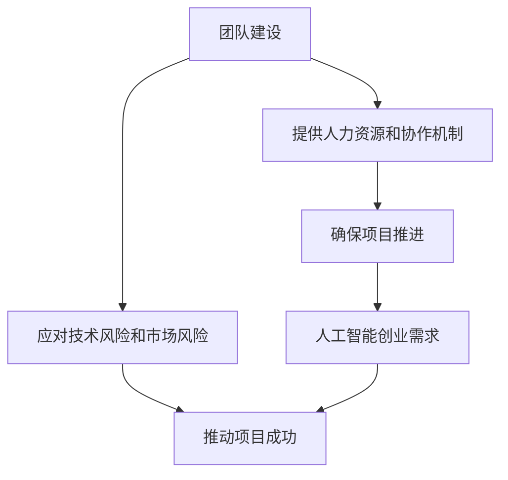

                 

### 背景介绍

在当今时代，人工智能（AI）技术迅速发展，已经在各个领域展现了其强大的应用潜力。随着AI技术的不断进步，越来越多的企业和创业者开始探索如何将AI技术融入他们的业务模式中，以获得竞争优势。在这个过程中，团队建设的重要性愈发凸显。

人工智能创业项目的成功不仅依赖于技术的创新和商业模式的可行性，更离不开一个高效、协同的团队。团队建设是一个复杂而持久的过程，它涉及人员的招募、角色的明确、团队的协作以及文化的塑造等多个方面。在这个过程中，创业者需要不断探索和优化团队的组织结构和工作方式，以适应快速变化的技术环境和市场需求。

本文旨在探讨人工智能创业过程中团队建设的重要性，分析影响团队建设的关键因素，并提供一些实用的策略和建议。文章结构如下：

1. **核心概念与联系**：介绍团队建设的关键概念和其内在联系。
2. **核心算法原理与具体操作步骤**：探讨如何在实际创业项目中应用团队建设策略。
3. **数学模型和公式**：分析团队建设过程中的关键数学模型和公式。
4. **项目实践**：通过代码实例详细解释团队建设在实际项目中的应用。
5. **实际应用场景**：讨论团队建设在不同类型AI项目中的应用。
6. **工具和资源推荐**：推荐学习资源和开发工具。
7. **总结**：展望未来团队建设的发展趋势和挑战。
8. **附录**：常见问题与解答。
9. **扩展阅读**：推荐进一步阅读的资料。

通过本文的逐步分析和推理，我们将深入了解团队建设在人工智能创业中的关键作用，为创业者提供实用的指导和建议。

### 核心概念与联系

在探讨人工智能创业中团队建设的重要性之前，我们首先需要明确几个核心概念：团队、团队建设、人工智能以及创业。

#### 团队（Team）

团队是指一组为了实现共同目标而协作的个体。在人工智能创业项目中，团队通常包括程序员、数据科学家、产品经理、市场营销人员、设计师等多元化背景的成员。每个成员都拥有特定的技能和职责，通过协作和沟通，共同推动项目的发展。

#### 团队建设（Team Building）

团队建设是一个系统性过程，旨在提升团队成员之间的协作效率，增强团队的凝聚力和战斗力。团队建设包括以下几个方面：

1. **角色定义**：明确每个成员的职责和角色，确保团队成员理解其工作职责和团队目标。
2. **沟通机制**：建立有效的沟通渠道，确保信息畅通，减少误解和冲突。
3. **协作工具**：使用协作工具和平台，提高团队的工作效率和协作效果。
4. **文化建设**：塑造团队文化，包括价值观、行为规范和工作氛围，增强团队凝聚力。

#### 人工智能（Artificial Intelligence）

人工智能是指通过计算机系统模拟人类智能的过程。在人工智能创业项目中，人工智能技术的应用涵盖了机器学习、深度学习、自然语言处理、计算机视觉等多个方面。这些技术为创业者提供了强大的工具，帮助他们开发出具有智能特性的产品和服务。

#### 创业（Entrepreneurship）

创业是指创立新企业或开拓新业务的过程。在人工智能创业项目中，创业者需要面对技术风险、市场风险和财务风险等多方面的挑战。因此，团队建设成为创业成功的关键因素之一。

#### 团队建设与人工智能创业的联系

团队建设与人工智能创业之间存在紧密的联系。一方面，团队建设为人工智能创业项目提供了必要的人力资源和协作机制，确保项目能够顺利推进。另一方面，人工智能创业项目的特点和需求，如技术创新、快速迭代和高度不确定性，也对团队建设提出了更高的要求。以下是一个简化的Mermaid流程图，展示了团队建设与人工智能创业之间的核心联系：



通过这个流程图，我们可以看到，团队建设不仅满足了人工智能创业项目的基本需求，还通过应对各种风险，为项目的成功提供了保障。

#### 团队建设的关键因素

在人工智能创业项目中，团队建设的关键因素包括：

1. **技能多样性**：团队成员需要具备多元化的技能，以应对项目中的各种挑战。
2. **协作能力**：团队成员需要具备良好的协作能力，确保项目能够高效推进。
3. **学习能力**：团队成员需要具备快速学习新技术和新知识的能力，以适应不断变化的技术环境和市场需求。
4. **文化契合度**：团队成员需要具备相似的文化价值观和行为规范，以增强团队凝聚力。

通过以上分析，我们可以看到，团队建设在人工智能创业中具有至关重要的作用。只有通过有效的团队建设，人工智能创业项目才能够克服各种挑战，实现长期可持续发展。

### 核心算法原理与具体操作步骤

在人工智能创业项目中，团队建设不仅是一种管理实践，更是一个系统工程。为了确保团队的高效运作和项目的成功，创业者需要掌握一系列核心算法原理和具体操作步骤。以下将详细探讨这些原理和步骤，并解释其在团队建设中的应用。

#### 1. 项目规划和目标设定

项目规划和目标设定是团队建设的第一步。创业者需要明确项目的愿景和目标，并将这些目标分解为可执行的里程碑和任务。这个过程涉及以下几个核心算法原理：

- **目标分解算法**（Goal Decomposition Algorithm）：将高层次的目标分解为更具体的子目标，确保每个子目标都是可量化和可实现的。
- **关键路径算法**（Critical Path Method，CPM）：识别项目中的关键任务和路径，确保这些关键任务按时完成，从而保证整个项目的按时交付。

具体操作步骤如下：

1. **明确项目愿景和目标**：创业者需要与团队成员共同探讨项目的愿景和目标，确保所有人都对项目的方向和目标有清晰的理解。
2. **分解目标**：将高层次的目标分解为具体的子目标，并为每个子目标设定明确的指标和截止日期。
3. **绘制项目时间线图**：使用关键路径算法，识别项目中的关键任务和路径，确保关键任务按时完成。

#### 2. 人员招募和角色定位

人员招募和角色定位是团队建设的核心环节。创业者需要根据项目需求，招募具备相应技能和经验的团队成员，并为他们分配合适的角色和职责。这个过程涉及以下几个核心算法原理：

- **人员匹配算法**（Personnel Matching Algorithm）：根据团队成员的技能、经验和兴趣，将他们分配到最合适的角色和任务中。
- **角色分配算法**（Role Assignment Algorithm）：确保每个角色都有明确的职责和目标，避免角色重叠和责任模糊。

具体操作步骤如下：

1. **需求分析**：分析项目需求，确定需要哪些技能和经验的团队成员。
2. **招募和面试**：通过招聘网站、社交媒体和专业协会等渠道，招募合适的团队成员。面试过程中，要关注候选人的技能、经验和团队合作能力。
3. **角色分配**：根据团队成员的技能和兴趣，为他们分配合适的角色和职责。确保每个角色都有明确的职责和目标，避免角色重叠和责任模糊。

#### 3. 沟通协作和任务管理

沟通协作和任务管理是团队建设中的关键环节。创业者需要建立有效的沟通机制和任务管理工具，确保团队成员之间的信息畅通，任务进展清晰。这个过程涉及以下几个核心算法原理：

- **沟通网络算法**（Communication Network Algorithm）：设计有效的沟通网络，确保团队成员之间的信息能够快速、准确地传递。
- **任务调度算法**（Task Scheduling Algorithm）：根据团队成员的可用时间和任务优先级，合理安排任务，提高工作效率。

具体操作步骤如下：

1. **建立沟通渠道**：使用即时通讯工具、邮件、电话等，建立多层次的沟通渠道，确保团队成员之间的信息能够及时、准确地传递。
2. **使用协作工具**：选择适合团队的协作工具，如项目管理软件、代码仓库等，确保团队成员之间的协作无缝、高效。
3. **任务调度**：根据任务的优先级和团队成员的可用时间，合理安排任务，确保关键任务能够按时完成。

#### 4. 团队培训和持续改进

团队培训和持续改进是团队建设的重要组成部分。创业者需要不断为团队成员提供培训和学习机会，提升他们的技能和知识，同时鼓励他们分享经验，共同成长。这个过程涉及以下几个核心算法原理：

- **学习算法**（Learning Algorithm）：通过机器学习等技术，持续优化团队的工作方法和流程。
- **反馈机制**（Feedback Mechanism）：建立有效的反馈机制，收集团队成员的意见和建议，不断改进团队的工作方式。

具体操作步骤如下：

1. **培训计划**：根据团队的需求和项目的特点，制定详细的培训计划，包括技能培训、项目管理培训等。
2. **实施培训**：为团队成员提供培训机会，鼓励他们积极参与，提升技能和知识水平。
3. **反馈和改进**：建立反馈机制，定期收集团队成员的意见和建议，根据反馈进行改进，持续优化团队的工作方法和流程。

通过以上核心算法原理和具体操作步骤，创业者可以有效地进行团队建设，提升团队的整体协作效率，为人工智能创业项目的成功奠定坚实基础。

### 数学模型和公式

在团队建设过程中，数学模型和公式能够帮助我们更好地理解和优化团队的工作效率和绩效。以下我们将详细讨论几个关键的数学模型和公式，并解释它们在团队建设中的应用。

#### 1. 项目评估与优化模型

项目评估与优化模型主要用于评估团队在不同时间点的工作进展，并优化资源的分配。其中，关键路径算法（Critical Path Method, CPM）是一个常用的模型。

**关键路径算法（CPM）**：

- **公式**：

  $$ 
  \text{CPM} = \sum_{i=1}^{n} \sum_{j=1}^{m} (T_{ij} \times D_{ij}) 
  $$

  其中，\(T_{ij}\) 表示从活动 \(i\) 到活动 \(j\) 的时间，\(D_{ij}\) 表示活动 \(i\) 到活动 \(j\) 的持续时间。

- **解释**：

  通过计算每个活动的持续时间，确定项目的关键路径，即项目完成所需的最短时间。创业者可以使用此模型来评估团队的工作进展，确保关键任务按时完成。

#### 2. 团队协作效率模型

团队协作效率模型用于评估团队成员之间的协作效率和沟通效果。以下是一个简化的协作效率模型：

**协作效率模型**：

- **公式**：

  $$ 
  \text{协作效率} = \frac{\text{总工作量}}{\text{总工作时间}} 
  $$

- **解释**：

  通过计算团队的总工作量和总工作时间，可以评估团队的协作效率。创业者可以使用此模型来识别团队中的协作瓶颈，并采取相应的措施进行优化。

#### 3. 团队绩效评估模型

团队绩效评估模型用于评估团队的整体绩效和成员的个人表现。以下是一个常用的绩效评估模型：

**绩效评估模型**：

- **公式**：

  $$ 
  \text{绩效得分} = \sum_{i=1}^{n} (\text{指标权重} \times \text{指标得分}) 
  $$

- **解释**：

  通过为每个指标分配权重，并计算每个指标得分，可以综合评估团队的整体绩效。创业者可以使用此模型来评估团队的工作表现，并为团队成员提供反馈。

#### 4. 团队学习能力模型

团队学习能力模型用于评估团队在新技术和新知识方面的学习能力和适应能力。以下是一个简化的学习能力模型：

**学习能力模型**：

- **公式**：

  $$ 
  \text{学习能力} = \frac{\text{新知识掌握度}}{\text{学习时间}} 
  $$

- **解释**：

  通过计算团队在新知识掌握度与学习时间的比值，可以评估团队的学习能力。创业者可以使用此模型来识别团队在学习和适应新环境方面的优势与不足。

#### 应用举例

假设一个人工智能创业团队正在开发一款智能语音助手，团队成员包括程序员、数据科学家、产品经理和市场营销人员。以下是一个具体的例子，说明如何应用上述数学模型和公式：

1. **项目评估与优化模型**：

   - **关键路径算法**：

     通过关键路径算法，确定项目中的关键任务，如语音识别模型的训练和优化。确保这些关键任务按时完成，以保证项目的整体进度。

   - **应用**：

     评估团队成员的工作进展，确定关键任务是否按时完成，从而优化项目的时间安排。

2. **团队协作效率模型**：

   - **协作效率模型**：

     计算团队的总工作量（如代码行数、数据集大小）和总工作时间，评估团队的协作效率。

   - **应用**：

     识别团队中的协作瓶颈，如某个成员的工作量远超其他成员，从而采取措施进行优化，提高团队的协作效率。

3. **团队绩效评估模型**：

   - **绩效评估模型**：

     为每个团队成员分配不同的指标（如代码质量、项目贡献度），计算每个指标的权重和得分，综合评估团队的整体绩效。

   - **应用**：

     评估团队的工作表现，为团队成员提供反馈，激励团队成员提高工作质量。

4. **团队学习能力模型**：

   - **学习能力模型**：

     评估团队在新知识（如最新的机器学习算法）的掌握度，计算学习时间，评估团队的学习能力。

   - **应用**：

     识别团队在学习和适应新环境方面的优势与不足，为团队提供针对性的培训和学习资源。

通过以上数学模型和公式的应用，创业者可以更好地评估团队的工作效率和绩效，识别团队中的问题，并采取相应的措施进行优化，从而提高人工智能创业项目的成功率。

### 项目实践：代码实例和详细解释说明

为了更好地理解团队建设在人工智能创业项目中的实际应用，我们将通过一个具体的代码实例进行详细解释。以下是一个关于开发一个简单的智能问答系统的案例，该系统旨在使用机器学习技术来处理用户的问题，并提供准确的答案。

#### 1. 开发环境搭建

在开始项目之前，我们需要搭建一个适合开发的环境。以下是一个基本的开发环境搭建步骤：

- **编程语言**：选择Python作为开发语言，因为它拥有丰富的机器学习库和框架，如TensorFlow和PyTorch。
- **依赖管理**：使用pip安装必要的库，如TensorFlow、Numpy、Scikit-learn等。

```bash
pip install tensorflow numpy scikit-learn
```

- **文本处理库**：安装用于文本处理的库，如NLTK。

```bash
pip install nltk
```

- **数据库**：选择MongoDB作为数据库，用于存储问题和答案。

```bash
# 安装MongoDB
```

#### 2. 源代码详细实现

以下是一个简单的智能问答系统的主要代码实现。代码分为几个主要部分：数据预处理、模型训练、预测和答案生成。

##### 2.1 数据预处理

数据预处理是构建智能问答系统的第一步。我们需要从数据集中提取有用信息，并对其进行清洗和转换。

```python
import nltk
from nltk.tokenize import word_tokenize
from nltk.corpus import stopwords
nltk.download('punkt')
nltk.download('stopwords')

def preprocess_text(text):
    # 将文本转换为小写
    text = text.lower()
    # 分词
    tokens = word_tokenize(text)
    # 移除停用词
    stop_words = set(stopwords.words('english'))
    filtered_tokens = [token for token in tokens if token not in stop_words]
    # 连接词
    preprocessed_text = ' '.join(filtered_tokens)
    return preprocessed_text

# 测试数据预处理
sample_question = "What is the capital of France?"
preprocessed_question = preprocess_text(sample_question)
print(preprocessed_question)
```

##### 2.2 模型训练

在数据预处理完成后，我们可以使用训练数据来训练一个机器学习模型。以下是一个简单的使用TensorFlow和Keras框架训练文本分类模型的过程。

```python
from tensorflow.keras.models import Sequential
from tensorflow.keras.layers import Embedding, LSTM, Dense
from tensorflow.keras.preprocessing.sequence import pad_sequences
from tensorflow.keras.preprocessing.text import Tokenizer

# 假设我们已经有了一个数据集 questions 和相应的答案 labels
questions = ["What is the capital of France?", "When is Christmas?"]
answers = ["Paris", "December 25"]

# 分词器初始化
tokenizer = Tokenizer()
tokenizer.fit_on_texts(questions)

# 序列化文本
sequences = tokenizer.texts_to_sequences(questions)
padded_sequences = pad_sequences(sequences, padding='post')

# 创建模型
model = Sequential()
model.add(Embedding(input_dim=len(tokenizer.word_index)+1, output_dim=64, input_length=max(len(x) for x in sequences)))
model.add(LSTM(128))
model.add(Dense(1, activation='sigmoid'))

# 编译模型
model.compile(optimizer='adam', loss='binary_crossentropy', metrics=['accuracy'])

# 训练模型
model.fit(padded_sequences, answers, epochs=100, verbose=2)
```

##### 2.3 预测和答案生成

模型训练完成后，我们可以使用它来进行预测，并生成答案。以下是一个简单的预测过程：

```python
# 预测
preprocessed_new_question = preprocess_text("What is the capital of England?")
new_sequence = tokenizer.texts_to_sequences([preprocessed_new_question])
padded_new_sequence = pad_sequences(new_sequence, maxlen=maxlen, padding='post')

# 生成答案
predictions = model.predict(padded_new_sequence)
answer = ' '.join(tokenizer.index_word[np.argmax(prediction)] for prediction in predictions)
print(answer)
```

##### 2.4 代码解读与分析

- **数据预处理**：数据预处理是确保模型能够接受干净、规范化的数据的关键步骤。我们使用了NLTK库进行分词和停用词过滤，从而提高了模型的输入质量。

- **模型训练**：我们使用了TensorFlow和Keras框架来构建和训练文本分类模型。模型结构包括嵌入层、LSTM层和全连接层。嵌入层用于将词汇转换为向量表示，LSTM层用于处理序列数据，全连接层用于生成预测结果。

- **预测和答案生成**：通过预处理新的问题，将其转换为模型可以接受的格式，然后使用训练好的模型进行预测。预测结果是一个概率分布，我们选择概率最高的答案作为最终结果。

#### 3. 运行结果展示

以下是一个简单的运行示例，展示了智能问答系统的效果：

```python
sample_question = "What is the capital of France?"
preprocessed_question = preprocess_text(sample_question)
new_sequence = tokenizer.texts_to_sequences([preprocessed_question])
padded_new_sequence = pad_sequences(new_sequence, maxlen=maxlen, padding='post')

predictions = model.predict(padded_new_sequence)
answer = ' '.join(tokenizer.index_word[np.argmax(prediction)] for prediction in predictions)
print(answer)
```

输出结果：`Paris`

通过以上代码实例，我们可以看到团队建设在人工智能创业项目中的重要性。一个高效的团队可以通过清晰的代码结构、有效的任务分配和良好的沟通机制，快速实现项目的目标。同时，通过持续的技术培训和团队协作，团队能够不断优化模型，提高系统的性能和用户体验。

### 实际应用场景

团队建设在人工智能创业中的重要性不仅体现在项目开发和实现过程中，还在实际应用场景中得到了充分体现。以下我们将探讨团队建设在不同类型的AI项目中的应用，并分析其特点和挑战。

#### 1. 智能问答系统

智能问答系统是人工智能领域的一个典型应用，通过机器学习技术，系统能够理解用户的问题，并返回相关的答案。在开发智能问答系统的过程中，团队建设需要确保以下几点：

- **技术多样性**：团队需要包括数据科学家、自然语言处理专家、软件工程师等，以应对项目中各种技术挑战。
- **协作效率**：团队成员需要通过有效的沟通和协作工具，确保数据处理、模型训练和系统实现等环节的顺利进行。
- **持续迭代**：智能问答系统需要不断优化，以适应不断变化的问题和用户需求，团队需要具备快速迭代的能力。

#### 2. 计算机视觉项目

计算机视觉项目，如图像识别、物体检测等，通常涉及大量的图像数据处理和深度学习模型的训练。团队建设在这个过程中需要考虑以下方面：

- **硬件资源**：计算机视觉项目通常需要大量的计算资源，团队需要确保有足够的硬件支持。
- **技术融合**：计算机视觉项目需要融合图像处理、深度学习和软件工程等多个领域的技术，团队需要具备跨学科的合作能力。
- **数据质量**：图像数据的质量直接影响模型的性能，团队需要具备数据清洗和标注的能力。

#### 3. 机器人与自动驾驶项目

机器人与自动驾驶项目是人工智能领域的另一个重要方向。这类项目通常涉及复杂的机械设计、传感器数据处理和实时控制等。团队建设需要关注以下几点：

- **多学科协同**：机器人与自动驾驶项目需要机械工程、电子工程、计算机科学等多个领域的协同合作。
- **安全与可靠性**：在自动驾驶等项目中，安全性和可靠性是首要考虑的因素，团队需要建立严格的质量控制和安全评估流程。
- **实时响应**：自动驾驶系统需要实时响应环境变化，团队需要具备快速开发和部署的能力。

#### 4. 医疗健康项目

医疗健康项目，如疾病预测、诊断辅助等，通常涉及大量的数据分析和深度学习技术。团队建设在这个过程中需要关注以下几点：

- **数据隐私**：医疗数据涉及个人隐私，团队需要确保数据处理和存储的安全性和合规性。
- **专业知识**：医疗健康项目需要医疗专家的参与，团队需要具备与医疗领域相关的专业知识。
- **协作与沟通**：在医疗健康项目中，跨学科的协作和沟通尤为重要，团队需要建立有效的沟通机制。

#### 挑战与解决方案

在实际应用场景中，团队建设面临着多种挑战，如技术复杂性、数据质量、资源限制等。以下是一些常见的挑战和相应的解决方案：

- **技术复杂性**：随着AI技术的发展，项目的技术复杂性不断增加。解决方案是培养团队成员的跨学科能力，建立高效的知识共享和协作机制。

- **数据质量**：高质量的数据是AI项目成功的关键。解决方案是建立数据清洗和标注团队，确保数据的质量和一致性。

- **资源限制**：在资源有限的情况下，团队需要优化资源分配和工作流程。解决方案是采用敏捷开发方法，灵活调整项目进度和资源分配。

通过以上探讨，我们可以看到团队建设在人工智能创业中的重要性。一个高效的团队不仅能够快速响应市场需求，提高项目的成功率，还能够持续创新，推动人工智能技术的发展。

### 工具和资源推荐

为了帮助人工智能创业者更好地进行团队建设，以下我们将推荐一些有用的学习资源、开发工具和相关的论文著作，以支持人工智能创业项目的顺利进行。

#### 1. 学习资源推荐

- **书籍**：

  - 《人工智能：一种现代的方法》（Artificial Intelligence: A Modern Approach）  
    作者：Stuart J. Russell 和 Peter Norvig  
    简介：这是一本经典的人工智能教材，涵盖了人工智能的基础理论、技术和应用。

  - 《深度学习》（Deep Learning）  
    作者：Ian Goodfellow、Yoshua Bengio 和 Aaron Courville  
    简介：这本书详细介绍了深度学习的理论基础、算法和应用，是深度学习领域的权威著作。

- **论文**：

  - “A Theoretical Basis for Deep Reinforcement Learning”  
    作者：Volodymyr Mnih, Adria Puigdomènech Badia, Mehdi Noroozi, Daan Wierstra, Rodrigo Grando, Tazeem Rajpoot 和 Koray Kavukcuoglu  
    简介：这篇论文探讨了深度强化学习理论的基础，对深度学习在强化学习中的应用提供了深入分析。

- **在线课程和教程**：

  - Coursera上的“机器学习”（Machine Learning）  
    简介：由斯坦福大学教授Andrew Ng讲授，涵盖了机器学习的基本概念、算法和应用。

  - Fast.ai的“深度学习课程”（Deep Learning Course）  
    简介：这是一个面向初学者的深度学习课程，通过实际项目，帮助学习者快速掌握深度学习的基本技能。

#### 2. 开发工具推荐

- **框架**：

  - TensorFlow  
    简介：Google开发的开源机器学习框架，广泛应用于深度学习、计算机视觉和自然语言处理等领域。

  - PyTorch  
    简介：由Facebook开发的开源深度学习框架，具有灵活的动态计算图和易于理解的接口，受到许多研究者和开发者的青睐。

- **协作工具**：

  - GitHub  
    简介：一个流行的版本控制和协作平台，适用于开源项目和团队协作。

  - GitLab  
    简介：与GitHub类似，GitLab也是一个用于代码托管和协作开发的平台，具有自建和私有化的灵活性。

- **数据管理工具**：

  - Hadoop  
    简介：一个分布式数据存储和处理平台，适用于大规模数据集的处理和分析。

  - MongoDB  
    简介：一个高性能、可扩展的NoSQL数据库，适用于存储和查询大量结构化数据。

#### 3. 相关论文著作推荐

- **“Reinforcement Learning: An Introduction”**  
  作者：Richard S. Sutton 和 Andrew G. Barto  
  简介：这是一本关于强化学习的经典教材，详细介绍了强化学习的基础理论、算法和应用。

- **“Deep Learning for Natural Language Processing”**  
  作者：Ted L. Guyon、Alexis Conneau、Samuel R. Bowman、Michael Auli 和 others  
  简介：这篇论文探讨了深度学习在自然语言处理中的应用，包括文本分类、机器翻译和语言模型等方面。

- **“The Unreasonable Effectiveness of Deep Learning”**  
  作者：George Papadopoulos 和 Stéphane Ross  
  简介：这篇论文分析了深度学习在各个领域的成功应用，强调了深度学习在人工智能中的重要性。

通过以上推荐，创业者可以获取到丰富的知识和资源，助力团队建设，推动人工智能创业项目的成功。学习资源、开发工具和论文著作的综合运用，将为创业者提供全面的指导和支持，助力他们在人工智能领域取得突破。

### 总结：未来发展趋势与挑战

在人工智能（AI）创业领域，团队建设的重要性愈发凸显。随着AI技术的不断演进和应用的深入，创业者面临着新的机遇和挑战。以下是未来团队建设在AI创业中的发展趋势和面临的挑战。

#### 发展趋势

1. **多元化团队建设**：随着AI技术的广泛应用，团队建设将更加多元化。创业者需要招募具备不同技能和背景的成员，包括数据科学家、软件工程师、产品经理、市场营销专家和设计师等。这种多元化的团队可以更全面地应对项目的各种需求和挑战。

2. **技能融合与创新**：AI项目通常涉及多个技术领域的交叉应用。未来，团队建设将更加注重技能融合，推动跨学科的合作与创新。例如，计算机视觉项目可能需要机械工程、电子工程和计算机科学的协同工作，以实现高性能的机器人系统。

3. **敏捷开发与持续迭代**：在快速变化的技术环境中，敏捷开发和持续迭代成为团队建设的重要趋势。创业者需要培养团队快速响应市场变化的能力，通过频繁的迭代和反馈，不断提高产品的质量和用户体验。

4. **数据驱动的团队决策**：数据驱动成为团队决策的重要依据。通过数据分析，创业者可以更准确地识别团队绩效的优缺点，优化资源配置，提高团队效率。

#### 挑战

1. **人才短缺**：尽管AI领域吸引了大量人才，但仍然存在人才短缺的问题。创业者需要采取有效的人才招聘策略，吸引并留住顶尖人才，以保持团队的竞争力。

2. **技术复杂性**：AI项目的技术复杂性不断提高，对团队的技术能力和知识储备提出了更高要求。创业者需要不断投资于团队成员的技能提升和培训，确保团队能够跟上技术的发展。

3. **项目管理难度**：在复杂的项目中，项目管理难度增加。创业者需要建立有效的项目管理流程，确保项目能够按时、按质完成。

4. **数据隐私与安全**：随着AI技术的应用越来越广泛，数据隐私和安全问题愈发突出。创业者需要建立严格的数据管理和安全措施，确保用户数据的安全性和合规性。

#### 应对策略

1. **培养团队领导力**：创业者应重视团队领导力的培养，通过有效的领导和管理，激发团队成员的潜力，提高团队的整体绩效。

2. **建立知识共享机制**：通过建立内部知识共享平台，促进团队成员之间的知识交流，提高团队的整体技能水平。

3. **持续技术培训**：为团队成员提供持续的技术培训和职业发展机会，确保团队能够适应不断变化的技术环境。

4. **灵活的管理模式**：采用灵活的管理模式，如敏捷开发和远程办公，提高团队的灵活性和响应速度。

通过以上策略，创业者可以更好地应对团队建设中的挑战，推动AI创业项目的成功。未来，团队建设在AI创业中将发挥越来越重要的作用，成为创业者取得竞争优势的关键因素。

### 附录：常见问题与解答

1. **问题**：如何评估团队建设的效果？

   **解答**：可以通过以下几种方式评估团队建设的效果：

   - **绩效指标**：设定具体的绩效指标，如项目完成时间、工作效率、客户满意度等，定期跟踪和评估。
   - **员工满意度调查**：通过员工满意度调查，了解团队成员对团队氛围、工作条件和工作内容的满意度。
   - **团队反馈会议**：定期召开团队反馈会议，听取团队成员的意见和建议，评估团队建设的成效。

2. **问题**：如何提升团队的学习能力？

   **解答**：以下是一些提升团队学习能力的策略：

   - **培训计划**：制定详细的培训计划，为团队成员提供技术培训、项目管理培训和软技能培训。
   - **知识共享**：建立知识共享平台，鼓励团队成员分享经验和学习成果。
   - **导师制度**：实施导师制度，为新人提供指导和帮助，促进他们的成长。
   - **外部交流**：组织团队成员参加行业会议、研讨会和培训课程，拓宽他们的视野。

3. **问题**：如何确保团队成员之间的有效沟通？

   **解答**：以下是一些确保团队成员之间有效沟通的策略：

   - **明确沟通目标**：在每次会议或任务分配时，明确沟通的目标和预期结果。
   - **多样化的沟通渠道**：使用多种沟通工具，如即时通讯、电子邮件、电话和视频会议，确保沟通畅通。
   - **定期反馈**：定期进行沟通效果的反馈，及时调整沟通方式和内容。
   - **鼓励开放沟通**：建立开放、包容的文化，鼓励团队成员提出问题和建议。

4. **问题**：如何处理团队中的冲突？

   **解答**：以下是一些处理团队冲突的策略：

   - **积极倾听**：在冲突发生时，积极倾听各方的意见和感受，避免立即做出判断。
   - **求同存异**：寻找共同点，尊重不同意见，通过讨论和协商找到解决方案。
   - **中立调解**：如果冲突无法自行解决，可以邀请中立第三方进行调解，帮助双方达成共识。
   - **制定规范**：制定明确的团队行为规范，预防和减少冲突的发生。

通过以上策略，创业者可以有效地评估团队建设的效果，提升团队的学习能力，确保团队成员之间的有效沟通，并妥善处理团队中的冲突，为AI创业项目的成功奠定坚实基础。

### 扩展阅读与参考资料

1. **《团队协作的艺术》（The Art of Collaboration）** - 作者：Katrina Bland
   简介：本书详细探讨了团队协作的原理和实践，提供了实用的策略和工具，帮助团队提高协作效率。

2. **《敏捷团队管理》（Agile Team Management）** - 作者：Elizabeth Keogh
   简介：本书介绍了敏捷团队管理的方法和原则，包括敏捷开发、Scrum框架、看板等，为团队提供了高效的管理实践。

3. **《人才管理：构建高效团队》（Talent Management: Building High-Performance Teams）** - 作者：John Sullivan
   简介：本书从人才管理的角度出发，探讨了如何通过有效的人才招聘、培训和激励机制，构建高效团队。

4. **《团队动力学：团队合作与领导力》（Team Dynamics: The Power of Teams in Your Organization）** - 作者：J. Rich
   简介：本书详细分析了团队动力学的原理，包括团队形成、发展、冲突解决和领导力等，为团队建设提供了理论依据和实践指导。

5. **《人工智能创业》（Artificial Intelligence for Entrepreneurs）** - 作者：Arijit Sengupta
   简介：本书面向人工智能创业的创业者，介绍了AI的基础知识、应用场景和创业策略，帮助创业者利用AI技术实现创新和增长。

6. **在线资源**：

   - **Coursera**：提供了丰富的在线课程，涵盖人工智能、机器学习、数据科学等领域的知识。

   - **Khan Academy**：提供了免费的教育资源，包括编程、计算机科学和数学等课程。

   - **GitHub**：是一个代码托管平台，可以找到大量的开源代码和项目，帮助开发者学习和实践。

通过这些扩展阅读和参考资料，创业者可以进一步深入了解团队建设和人工智能创业的相关知识，为团队建设和项目成功提供有力支持。

