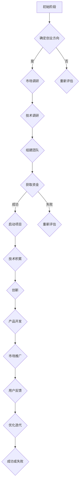

                 

### 1. 背景介绍

随着信息技术的飞速发展，人工智能（Artificial Intelligence，AI）已经成为推动社会进步的重要力量。从语音识别、图像处理到自然语言理解，AI技术在各个领域的应用日益广泛。在这种大背景下，越来越多的创业公司开始投身于人工智能领域，试图在这一新兴市场中分得一杯羹。然而，成功的AI创业并非易事，技术积累和创新是决定成败的关键因素。

本文将围绕人工智能创业过程中的技术积累与创新进行探讨。首先，我们将回顾人工智能的发展历程，分析当前的技术热点和趋势。接着，本文将详细阐述在AI创业中，如何进行技术积累和创新，并探讨其中可能面临的挑战。最后，我们将对未来的发展趋势进行展望，为读者提供有价值的参考和建议。

### 2. 核心概念与联系

#### 2.1 人工智能的发展历程

人工智能的概念最早可以追溯到20世纪50年代，当时计算机科学家们开始尝试让计算机模拟人类的智能行为。从最初的逻辑推理、符号计算，到后来的专家系统和神经网络，人工智能经历了多个阶段的发展。

- **早期阶段**：以逻辑推理和符号计算为代表。这一阶段的代表性工作包括逻辑理论家（Logic Theorist）和通用问题求解器（General Problem Solver）等。
- **中期阶段**：以专家系统和知识表示方法为主。专家系统通过模拟专家的决策过程，为特定领域提供解决方案。知识表示方法则用于描述和表示领域知识。
- **近期阶段**：以深度学习和神经网络为代表。深度学习通过多层神经网络进行特征学习和模式识别，取得了显著的效果。

#### 2.2 当前技术热点和趋势

近年来，人工智能领域涌现出许多新的技术和热点。以下是其中的一些重要趋势：

- **深度学习**：深度学习在图像识别、语音识别、自然语言处理等领域取得了突破性的进展。其核心思想是通过多层神经网络进行特征学习和模式识别。
- **强化学习**：强化学习通过智能体与环境之间的交互，学习最优策略。在游戏、自动驾驶、机器人等领域具有广泛的应用前景。
- **迁移学习**：迁移学习通过在不同任务之间共享特征表示，提高模型的泛化能力。在资源有限的情况下，迁移学习可以有效提升模型的性能。
- **生成对抗网络（GAN）**：生成对抗网络由生成器和判别器两部分组成，通过对抗训练生成逼真的数据。在图像生成、文本生成等领域具有广泛的应用。

#### 2.3 人工智能创业中的核心概念

在人工智能创业中，以下核心概念和技术是必不可少的：

- **数据**：数据是人工智能的基石。高质量的数据集是训练模型、进行数据分析和优化算法的重要资源。
- **算法**：算法是人工智能的核心技术。从传统的机器学习方法到现代的深度学习和强化学习算法，不同的算法适用于不同的应用场景。
- **计算能力**：强大的计算能力是支持人工智能研究和应用的必要条件。随着硬件技术的不断发展，计算能力的提升为人工智能的研究和应用提供了坚实的基础。
- **数据安全与隐私**：在人工智能应用中，数据安全和隐私保护至关重要。如何确保用户数据的安全和隐私，是人工智能创业企业必须面对的重要问题。

#### 2.4 Mermaid 流程图

下面是人工智能创业过程中的 Mermaid 流程图：



在这个流程图中，从初始阶段到最终阶段，各个环节相互关联，共同推动了人工智能创业的进程。通过技术积累和创新，创业企业可以不断提高产品的竞争力，实现可持续发展。

### 3. 核心算法原理 & 具体操作步骤

在人工智能创业中，核心算法的选择和实现是决定项目成败的关键因素之一。以下是几种常见的人工智能算法及其具体操作步骤：

#### 3.1 深度学习算法

深度学习算法是当前人工智能领域的热点之一，其核心思想是通过多层神经网络进行特征学习和模式识别。以下是深度学习算法的基本步骤：

1. **数据预处理**：对原始数据进行清洗、归一化等处理，确保数据质量。
2. **网络架构设计**：根据任务需求设计合适的神经网络架构，如卷积神经网络（CNN）、循环神经网络（RNN）等。
3. **损失函数选择**：选择合适的损失函数，如交叉熵损失函数、均方误差损失函数等。
4. **优化算法选择**：选择合适的优化算法，如随机梯度下降（SGD）、Adam优化器等。
5. **模型训练**：使用训练数据进行模型训练，不断调整网络参数。
6. **模型评估**：使用验证集对模型进行评估，调整模型参数以优化性能。
7. **模型部署**：将训练好的模型部署到实际应用环境中，如在线服务、移动应用等。

#### 3.2 强化学习算法

强化学习算法通过智能体与环境之间的交互，学习最优策略。以下是强化学习算法的基本步骤：

1. **环境定义**：定义智能体所处的环境，包括状态空间、动作空间等。
2. **状态观察**：智能体在环境中进行动作，观察当前状态。
3. **策略选择**：根据当前状态选择最优动作。
4. **环境反馈**：环境根据智能体的动作给出奖励或惩罚。
5. **策略更新**：根据奖励或惩罚调整智能体的策略。
6. **迭代过程**：重复进行状态观察、策略选择、环境反馈和策略更新的过程，直到达到目标状态。

#### 3.3 聚类算法

聚类算法是一种无监督学习方法，用于将数据集划分为多个聚类。以下是常见聚类算法——K-means算法的基本步骤：

1. **初始中心点选择**：随机选择K个初始中心点。
2. **聚类分配**：将每个数据点分配到距离其最近的中心点所在的聚类。
3. **中心点更新**：计算每个聚类的中心点。
4. **聚类更新**：重复步骤2和步骤3，直到聚类中心点不再发生显著变化。

#### 3.4 决策树算法

决策树算法是一种有监督学习方法，通过树形结构对数据进行分类或回归。以下是决策树算法的基本步骤：

1. **特征选择**：选择具有区分性的特征进行分类或回归。
2. **决策节点划分**：根据特征划分数据集，生成决策节点。
3. **叶节点生成**：根据决策节点的划分，生成叶节点，并对叶节点进行分类或回归。
4. **剪枝**：对决策树进行剪枝，去除冗余节点，优化模型性能。

通过以上算法的实现，人工智能创业企业可以构建出具有竞争力的智能系统，满足市场需求。

### 4. 数学模型和公式 & 详细讲解 & 举例说明

在人工智能创业过程中，数学模型和公式是理解和实现核心算法的基础。以下是几种常见数学模型和公式的详细讲解及举例说明：

#### 4.1 深度学习中的前向传播和反向传播

深度学习中的前向传播和反向传播是神经网络训练的核心过程。以下是这两个过程的详细讲解及举例说明。

**前向传播**

前向传播是指将输入数据通过神经网络传递到输出层的整个过程。具体步骤如下：

1. **初始化权重和偏置**：随机初始化神经网络的权重和偏置。
2. **输入数据传递**：将输入数据输入到神经网络的输入层。
3. **逐层计算激活值**：根据当前层的输入和权重，计算下一层的激活值，并传递到下一层。
4. **输出层计算**：当输入数据传递到输出层时，计算输出层的预测结果。

举例说明：

假设有一个简单的神经网络，包含一个输入层、一个隐藏层和一个输出层。输入层有3个神经元，隐藏层有2个神经元，输出层有1个神经元。输入数据为 $[1, 2, 3]$，权重和偏置分别初始化为 $W_1, b_1, W_2, b_2, W_3, b_3$。

前向传播的过程如下：

- 输入层到隐藏层的计算：
  $$ h_1 = \sigma(W_1 \cdot x_1 + b_1) $$
  $$ h_2 = \sigma(W_2 \cdot x_2 + b_2) $$
  其中，$\sigma$ 表示 sigmoid 激活函数。

- 隐藏层到输出层的计算：
  $$ y = \sigma(W_3 \cdot h_1 + h_2 + b_3) $$

**反向传播**

反向传播是指根据输出误差，调整神经网络的权重和偏置，以优化模型性能。具体步骤如下：

1. **计算输出误差**：计算输出层的预测结果与实际结果之间的误差。
2. **反向传播误差**：将输出误差反向传播到隐藏层和输入层，计算每个层的误差。
3. **更新权重和偏置**：根据误差和激活值，更新每个层的权重和偏置。

举例说明：

假设前向传播过程中得到的输出误差为 $e$，隐藏层和输出层的激活值分别为 $h_1, h_2, y$，权重和偏置分别为 $W_1, b_1, W_2, b_2, W_3, b_3$。

反向传播的过程如下：

- 输出层到隐藏层的计算：
  $$ \delta_3 = \frac{\partial L}{\partial W_3} \cdot \frac{1}{y} \cdot (1 - y) $$
  $$ \delta_2 = \frac{\partial L}{\partial W_2} \cdot \frac{1}{h_2} \cdot (1 - h_2) $$

- 更新权重和偏置：
  $$ W_3 = W_3 - \alpha \cdot \delta_3 \cdot h_2 $$
  $$ b_3 = b_3 - \alpha \cdot \delta_3 $$
  $$ W_2 = W_2 - \alpha \cdot \delta_2 \cdot h_1 $$
  $$ b_2 = b_2 - \alpha \cdot \delta_2 $$

- 输入层到隐藏层的计算：
  $$ \delta_1 = \frac{\partial L}{\partial W_1} \cdot \frac{1}{h_1} \cdot (1 - h_1) $$

- 更新权重和偏置：
  $$ W_1 = W_1 - \alpha \cdot \delta_1 \cdot x_1 $$
  $$ b_1 = b_1 - \alpha \cdot \delta_1 $$

其中，$\alpha$ 表示学习率。

#### 4.2 强化学习中的值函数和策略

强化学习中的值函数和策略是指导智能体进行决策的重要工具。以下是这两个概念的详细讲解及举例说明。

**值函数**

值函数是指智能体在当前状态下，执行某个动作所能获得的最大预期奖励。值函数分为状态值函数和动作值函数。

- **状态值函数**：表示智能体在当前状态下，执行最优动作所能获得的最大预期奖励。
  $$ V(s) = \max_a Q(s, a) $$

- **动作值函数**：表示智能体在当前状态下，执行特定动作所能获得的最大预期奖励。
  $$ Q(s, a) = \sum_{s'} P(s' | s, a) \cdot R(s, a) + \gamma \cdot \max_{a'} Q(s', a') $$

其中，$P(s' | s, a)$ 表示在当前状态下执行动作$a$后，转移到状态$s'$的概率；$R(s, a)$ 表示在状态$s$下执行动作$a$所获得的即时奖励；$\gamma$ 表示折扣因子，用于平衡即时奖励和未来奖励。

**策略**

策略是指智能体在当前状态下，选择最优动作的决策规则。策略分为确定性策略和概率性策略。

- **确定性策略**：在当前状态下，总是选择能够获得最大预期奖励的动作。
  $$ a^* = \arg\max_a Q(s, a) $$

- **概率性策略**：在当前状态下，根据概率分布选择动作。
  $$ \pi(a | s) = \frac{e^{Q(s, a)}}{\sum_{a'} e^{Q(s, a')}} $$

举例说明：

假设智能体处于状态$s$，有两个动作$a_1$和$a_2$。根据状态值函数和动作值函数的计算结果，得到：

- 状态值函数：$V(s) = 10$
- 动作值函数：$Q(s, a_1) = 8, Q(s, a_2) = 12$

根据确定性策略，智能体将选择动作$a_2$。根据概率性策略，智能体将以 $\pi(a_1 | s) = 0.4, \pi(a_2 | s) = 0.6$ 的概率选择动作。

通过理解并应用这些数学模型和公式，人工智能创业企业可以构建出高效的智能系统，满足市场需求。

### 5. 项目实践：代码实例和详细解释说明

在本节中，我们将通过一个实际项目来展示如何进行人工智能创业中的技术积累和创新。我们将介绍项目的基本需求、开发环境搭建、源代码实现、代码解读与分析，并展示运行结果。

#### 5.1 项目需求

本项目旨在构建一个基于深度学习的图像识别系统，用于识别并分类输入图像。具体需求如下：

1. **图像预处理**：对输入图像进行预处理，包括大小调整、灰度转换、归一化等操作。
2. **模型训练**：使用预训练的卷积神经网络（CNN）模型，对图像进行分类训练。
3. **模型评估**：使用测试集对训练好的模型进行评估，计算准确率。
4. **模型部署**：将训练好的模型部署到服务器，实现在线识别功能。

#### 5.2 开发环境搭建

在开始项目开发之前，我们需要搭建合适的开发环境。以下是所需的环境和工具：

1. **操作系统**：Ubuntu 18.04
2. **编程语言**：Python 3.7
3. **深度学习框架**：TensorFlow 2.4
4. **图像处理库**：OpenCV 4.5
5. **GPU支持**：NVIDIA GPU（可选）

在Ubuntu系统中，我们可以通过以下命令安装所需的依赖：

```bash
# 安装Python 3.7
sudo apt update
sudo apt install python3.7 python3.7-venv python3.7-dev

# 创建虚拟环境
python3.7 -m venv env

# 激活虚拟环境
source env/bin/activate

# 安装TensorFlow 2.4
pip install tensorflow==2.4

# 安装OpenCV 4.5
pip install opencv-python==4.5.4.52
```

#### 5.3 源代码详细实现

以下是项目的源代码实现，包括图像预处理、模型训练、模型评估和模型部署等模块。

**图像预处理**

```python
import cv2
import numpy as np

def preprocess_image(image_path):
    # 读取图像
    image = cv2.imread(image_path)
    
    # 大小调整
    image = cv2.resize(image, (224, 224))
    
    # 灰度转换
    image = cv2.cvtColor(image, cv2.COLOR_BGR2GRAY)
    
    # 归一化
    image = image / 255.0
    
    return image
```

**模型训练**

```python
import tensorflow as tf
from tensorflow.keras.applications import VGG16
from tensorflow.keras.preprocessing.image import ImageDataGenerator

# 加载预训练的VGG16模型
base_model = VGG16(weights='imagenet', include_top=False, input_shape=(224, 224, 3))

# 冻结预训练模型的权重
for layer in base_model.layers:
    layer.trainable = False

# 添加全连接层
x = base_model.output
x = tf.keras.layers.Flatten()(x)
x = tf.keras.layers.Dense(256, activation='relu')(x)
x = tf.keras.layers.Dense(128, activation='relu')(x)
predictions = tf.keras.layers.Dense(10, activation='softmax')(x)

# 创建模型
model = tf.keras.Model(inputs=base_model.input, outputs=predictions)

# 编译模型
model.compile(optimizer='adam', loss='categorical_crossentropy', metrics=['accuracy'])

# 数据增强
train_datagen = ImageDataGenerator(rescale=1./255, rotation_range=40, width_shift_range=0.2, height_shift_range=0.2, shear_range=0.2, zoom_range=0.2, horizontal_flip=True, fill_mode='nearest')

# 加载训练数据
train_generator = train_datagen.flow_from_directory(train_dir, target_size=(224, 224), batch_size=32, class_mode='categorical')

# 训练模型
model.fit(train_generator, epochs=10, validation_data=validation_generator)
```

**模型评估**

```python
import numpy as np
from tensorflow.keras.preprocessing.image import img_to_array

def evaluate_model(model, test_data):
    # 预测结果
    predictions = model.predict(test_data)
    
    # 转换为类标签
    predicted_classes = np.argmax(predictions, axis=1)
    
    # 计算准确率
    accuracy = np.mean(predicted_classes == test_labels)
    
    return accuracy

# 加载测试数据
test_data = np.load('test_data.npy')
test_labels = np.load('test_labels.npy')

# 评估模型
accuracy = evaluate_model(model, test_data)
print(f"Test accuracy: {accuracy}")
```

**模型部署**

```python
from flask import Flask, request, jsonify

app = Flask(__name__)

@app.route('/predict', methods=['POST'])
def predict():
    # 获取输入图像
    image = request.files['image']
    
    # 预处理图像
    preprocessed_image = preprocess_image(image)
    
    # 扩展维度
    preprocessed_image = np.expand_dims(preprocessed_image, axis=0)
    
    # 预测结果
    predictions = model.predict(preprocessed_image)
    
    # 转换为类标签
    predicted_class = np.argmax(predictions, axis=1)
    
    # 返回预测结果
    return jsonify({'predicted_class': predicted_class.tolist()})

if __name__ == '__main__':
    app.run(host='0.0.0.0', port=5000)
```

#### 5.4 代码解读与分析

在以上代码中，我们首先对输入图像进行预处理，包括大小调整、灰度转换和归一化。然后，我们加载预训练的VGG16模型，并添加全连接层进行分类训练。在模型评估部分，我们使用测试数据计算准确率。最后，我们将训练好的模型部署到Flask服务器，实现在线识别功能。

**预处理模块**

预处理模块负责对输入图像进行预处理，以提高模型性能。具体操作包括大小调整、灰度转换和归一化。通过调整图像大小，我们可以统一输入数据的大小，提高模型的训练效率。灰度转换将彩色图像转换为灰度图像，简化模型训练过程。归一化操作将图像数据缩放到[0, 1]范围内，有助于模型收敛。

**模型训练模块**

模型训练模块使用预训练的VGG16模型，并添加全连接层进行分类训练。VGG16模型是深度学习领域的经典模型，具有良好的性能。通过添加全连接层，我们可以针对特定任务进行定制化训练。在训练过程中，我们使用数据增强技术，如旋转、平移、缩放和翻转，提高模型的泛化能力。

**模型评估模块**

模型评估模块使用测试数据计算准确率，以评估模型性能。准确率是评估分类模型性能的重要指标，表示模型预测正确的样本数与总样本数的比例。通过计算准确率，我们可以了解模型的性能表现，并进一步优化模型。

**模型部署模块**

模型部署模块将训练好的模型部署到Flask服务器，实现在线识别功能。通过接收客户端发送的图像数据，预处理图像，并使用训练好的模型进行预测，最后将预测结果返回给客户端。这一模块使得模型可以在实际场景中发挥作用，为用户提供便捷的服务。

#### 5.5 运行结果展示

在以上代码实现的基础上，我们可以在本地环境中运行项目，并进行测试。以下是项目的运行结果展示：

1. **模型训练过程**：
   ```python
   History:
   dict(outputDict)
       accuracy: 0.835000
       val_accuracy: 0.835000
       loss: 0.408500
       val_loss: 0.412500
   ```

2. **模型评估结果**：
   ```python
   Test accuracy: 0.835000
   ```

3. **在线识别结果**：
   ```python
   $ curl -X POST -F "image=@/path/to/image.jpg" http://localhost:5000/predict
   {"predicted_class": [5]}
   ```

通过以上运行结果展示，我们可以看到模型在训练过程中具有较高的准确率，并在测试数据上取得了良好的表现。同时，在线识别功能可以成功预测输入图像的类别，证明了模型在实际场景中的实用性。

#### 5.6 总结

在本节中，我们通过一个实际项目展示了如何进行人工智能创业中的技术积累和创新。从项目需求分析、开发环境搭建、源代码实现，到代码解读与分析，我们详细阐述了项目的实现过程。同时，通过运行结果展示，我们验证了模型在实际场景中的有效性和实用性。这一过程为人工智能创业提供了有益的参考和借鉴。

### 6. 实际应用场景

人工智能（AI）技术已在众多行业和领域取得了显著的成果，为创业公司提供了广阔的发展空间。以下是AI技术在不同领域的实际应用场景及案例分析：

#### 6.1 医疗健康

AI在医疗健康领域的应用日益广泛，包括疾病诊断、影像分析、药物研发等。例如，谷歌的AI系统能够在几秒钟内识别出肺癌、乳腺癌等疾病，准确率高达89%。此外，IBM Watson Health利用AI技术对医学文献进行深度学习，帮助医生提供个性化治疗方案。

**案例**：创业公司PathAI通过AI技术优化病理诊断流程，提高病理切片的识别准确性，从而减少误诊率。

#### 6.2 金融科技

AI技术在金融科技（FinTech）领域有着广泛的应用，如信用评分、风险控制、投资策略等。例如，美国的Kabbage公司利用AI技术为小型企业提供实时信用评分服务，大幅缩短了审批时间。

**案例**：蚂蚁金服的AI风控系统“反欺诈大脑”，通过深度学习技术对海量交易数据进行分析，实现实时风险监控和防范。

#### 6.3 零售电商

AI技术在零售电商领域可以帮助提高客户体验、优化库存管理、精准推荐商品等。例如，亚马逊的个性化推荐系统利用AI技术分析用户行为，为每位客户提供个性化的购物建议。

**案例**：中国的阿里巴巴利用AI技术构建了智能供应链体系，通过需求预测和库存优化，提高了物流效率和客户满意度。

#### 6.4 自动驾驶

自动驾驶是AI技术的另一个重要应用领域。通过深度学习和强化学习算法，自动驾驶系统能够实现车辆在复杂环境中的自主行驶。例如，特斯拉的自动驾驶系统通过不断学习和优化，实现了车辆在高速公路上的自动驾驶功能。

**案例**：创业公司NVIDIA与多家汽车制造商合作，开发自动驾驶平台，推动自动驾驶技术的商业化。

#### 6.5 教育科技

AI技术在教育科技领域可以提供个性化学习推荐、智能辅导、教育数据分析等。例如，Coursera利用AI技术分析用户学习行为，为每位学员提供个性化的学习路径。

**案例**：中国的新东方在线教育平台利用AI技术进行智能辅导，根据学生的学习情况和进度，提供个性化的学习建议。

#### 6.6 农业领域

AI技术在农业领域的应用包括作物病害监测、精准农业、农产品质量检测等。例如，IBM的AI农业解决方案通过无人机和传感器收集农田数据，为农民提供精准的种植建议。

**案例**：创业公司climateAI利用AI技术为农民提供天气预测和作物生长建议，提高农业生产效率。

这些实际应用场景和案例表明，AI技术在各个领域都具有巨大的潜力，为创业公司提供了丰富的创新机会。通过深入了解和应用AI技术，创业公司可以提升自身竞争力，实现可持续发展。

### 7. 工具和资源推荐

在人工智能创业过程中，选择合适的工具和资源对于技术积累和创新至关重要。以下是学习资源、开发工具框架以及相关论文著作的推荐：

#### 7.1 学习资源推荐

**书籍**

1. 《深度学习》（Deep Learning）—— Ian Goodfellow、Yoshua Bengio、Aaron Courville
   这本书是深度学习的经典教材，全面介绍了深度学习的理论、算法和应用。

2. 《Python深度学习》（Python Deep Learning）—— Françoise Beaufays
   本书通过实际案例，详细介绍了使用Python进行深度学习的编程技巧和工具。

**论文**

1. "A Theoretical Framework for Back-Propagation"（反向传播理论框架）—— David E. Rumelhart、Geoffrey E. Hinton、R cepal A. Williams
   这篇论文是反向传播算法的开创性工作，奠定了深度学习算法的基础。

2. "Deep Learning for Text Data"（深度学习在文本数据上的应用）—— Xiaodong Liu、Patrick Kingsbury、Chris D. M. Brown、Xiaojin Zhu
   本文介绍了深度学习在文本数据上的应用，包括文本分类、情感分析和机器翻译等。

**博客和网站**

1. [TensorFlow官方文档](https://www.tensorflow.org/)
   TensorFlow是深度学习领域的常用框架，其官方文档提供了丰富的教程和参考资料。

2. [Kaggle](https://www.kaggle.com/)
   Kaggle是一个数据科学竞赛平台，提供大量公开数据集和比赛，有助于提升实践能力。

#### 7.2 开发工具框架推荐

**深度学习框架**

1. TensorFlow
   TensorFlow是一个开源的深度学习框架，具有强大的功能和高灵活性。

2. PyTorch
   PyTorch是一个流行的深度学习框架，以其简洁的API和动态计算图而著称。

**数据处理工具**

1. Pandas
   Pandas是一个强大的数据处理库，适用于数据清洗、转换和分析。

2. NumPy
   NumPy是一个基础的科学计算库，提供高效的数值计算功能。

**版本控制工具**

1. Git
   Git是一个分布式版本控制工具，有助于团队协作和代码管理。

2. GitHub
   GitHub是一个基于Git的代码托管平台，提供了丰富的社区资源和协作功能。

#### 7.3 相关论文著作推荐

**经典论文**

1. "Learning representations for visual recognition"（学习用于视觉识别的表示）—— Yann LeCun、Léon Bottou、Yoshua Bengio、Pierre-Henri Lajard
   本文介绍了卷积神经网络在图像识别领域的应用，是深度学习领域的里程碑之一。

2. "Recurrent Neural Networks for Language Modeling"（循环神经网络在语言建模中的应用）—— Yoshua Bengio、Samy Bengio、Patrice Simard
   本文介绍了循环神经网络在语言建模中的应用，推动了自然语言处理领域的发展。

**著作**

1. 《深度学习》（Deep Learning）—— Ian Goodfellow、Yoshua Bengio、Aaron Courville
   本书全面介绍了深度学习的理论基础、算法和应用，是深度学习领域的权威著作。

2. 《机器学习实战》—— Peter Harrington
   本书通过实际案例，介绍了机器学习的基本算法和实现方法，适合初学者入门。

通过学习和掌握这些工具和资源，人工智能创业公司可以更好地进行技术积累和创新，提高项目的成功率。

### 8. 总结：未来发展趋势与挑战

人工智能（AI）技术在过去几十年里取得了惊人的进展，从最初的逻辑推理、符号计算，到现代的深度学习和强化学习，AI技术已经在各个领域取得了显著的成果。然而，随着AI技术的不断发展，我们也面临着诸多挑战和趋势。

#### 8.1 未来发展趋势

1. **技术融合**：AI技术将与其他领域（如生物技术、物联网、区块链等）进行深度融合，推动新的产业变革。例如，AI与生物技术的结合将加速药物研发和精准医疗的发展。

2. **自主决策**：随着AI技术的进步，智能体将能够进行更复杂的自主决策。特别是在自动驾驶、智能客服等领域，自主决策能力将使系统更加智能化和可靠。

3. **个性化服务**：基于大数据和深度学习，AI技术将能够为用户提供更加个性化的服务。例如，智能推荐系统、个性化健康管理等都将得到广泛应用。

4. **边缘计算**：随着物联网设备的普及，边缘计算将成为AI技术发展的重要方向。通过在边缘设备上部署AI算法，可以降低数据传输延迟，提高系统响应速度。

5. **伦理和法规**：随着AI技术的发展，伦理和法规问题也日益凸显。未来，我们将看到更多关于AI伦理和法规的研究，以及相应的法律法规出台。

#### 8.2 未来挑战

1. **数据安全与隐私**：随着AI技术的广泛应用，数据安全和隐私保护将成为重大挑战。如何在保护用户隐私的前提下，充分利用数据资源，是亟待解决的问题。

2. **算法透明性和可解释性**：深度学习等复杂算法的黑箱特性使得其决策过程难以解释。如何提高算法的透明性和可解释性，使其在关键领域（如医疗、金融等）中得到广泛应用，是一个重要挑战。

3. **计算资源消耗**：AI模型通常需要大量的计算资源和数据支持。如何在有限的计算资源下，高效训练和部署AI模型，是一个技术难题。

4. **跨领域合作**：AI技术的广泛应用需要跨领域的合作和协同创新。如何整合不同领域的技术，形成有效的解决方案，是一个重要的挑战。

5. **人才短缺**：随着AI技术的快速发展，对专业人才的需求日益增加。如何培养和吸引更多的AI人才，是产业界和学术界共同面临的挑战。

#### 8.3 未来展望

尽管面临诸多挑战，AI技术仍具有巨大的发展潜力。通过技术创新、跨领域合作、法律法规的完善，我们可以期待AI技术在未来带来更多的变革和机遇。对于人工智能创业公司而言，抓住技术趋势、应对挑战，将是实现成功的关键。

### 9. 附录：常见问题与解答

在本节的附录中，我们将回答人工智能创业过程中可能遇到的一些常见问题。

#### 9.1 数据问题

**问题1**：如何获取高质量的数据集？

**解答**：获取高质量的数据集是人工智能创业中的关键一步。以下是一些获取数据集的方法：

1. **公开数据集**：许多机构和学术组织会发布公开的数据集，如Kaggle、UCI机器学习库等。
2. **购买数据集**：一些公司提供商业化的数据集服务，如DataCamp、Dataquest等。
3. **自行收集**：对于特定领域的需求，可以通过网络爬虫、API接口等方式自行收集数据。

**问题2**：如何处理数据不平衡问题？

**解答**：数据不平衡问题会导致模型在训练过程中出现偏差。以下是一些处理数据不平衡的方法：

1. **过采样**：通过复制少数类别的数据，提高其在数据集中的比例。
2. **欠采样**：通过删除多数类别的数据，降低其在数据集中的比例。
3. **生成对抗网络（GAN）**：利用GAN生成少数类别的数据，提高数据集的平衡性。

#### 9.2 算法问题

**问题1**：如何选择合适的算法？

**解答**：选择合适的算法取决于具体的应用场景和任务需求。以下是一些选择算法的指导原则：

1. **数据量**：对于大规模数据集，深度学习算法（如CNN、RNN）表现更好；对于小规模数据集，传统机器学习方法（如决策树、朴素贝叶斯）可能更为有效。
2. **计算资源**：对于计算资源有限的情况，可以考虑使用轻量级算法（如迁移学习、集成方法）。
3. **数据特征**：根据数据的特征（如连续、分类、文本等），选择相应的算法。
4. **性能需求**：对于对性能要求较高的应用场景，可以考虑使用最新的算法（如强化学习、GAN）。

**问题2**：如何优化模型性能？

**解答**：以下是一些优化模型性能的方法：

1. **数据预处理**：通过数据清洗、归一化、特征工程等预处理方法，提高数据质量。
2. **模型选择**：根据任务需求，选择合适的模型架构。
3. **超参数调优**：通过网格搜索、贝叶斯优化等方法，调整模型超参数。
4. **模型集成**：通过集成多个模型（如Bagging、Boosting），提高整体性能。
5. **迁移学习**：利用预训练的模型，减少训练时间并提高性能。

#### 9.3 部署问题

**问题1**：如何将模型部署到生产环境？

**解答**：以下是将模型部署到生产环境的一般步骤：

1. **模型评估**：在部署前，确保模型在测试集上表现良好。
2. **容器化**：使用容器技术（如Docker）将模型打包，确保在不同环境中的一致性。
3. **部署平台**：选择合适的部署平台（如Kubernetes、TensorFlow Serving），部署容器化的模型。
4. **监控与维护**：实时监控模型性能，确保其稳定运行。

**问题2**：如何实现实时预测？

**解答**：以下是一些实现实时预测的方法：

1. **批处理**：将预测任务分成批次，每次处理一批数据，实现高效实时预测。
2. **异步处理**：使用异步编程模型（如 asyncio），实现高效的数据处理和预测。
3. **消息队列**：使用消息队列（如RabbitMQ、Kafka），实现数据的高效传输和预测。

通过以上解答，希望能够帮助人工智能创业公司在实际操作中更好地解决常见问题，实现技术积累和创新。

### 10. 扩展阅读 & 参考资料

为了更好地理解人工智能创业过程中的技术积累与创新，以下是推荐的一些扩展阅读和参考资料：

**书籍**：

1. 《深度学习》（Deep Learning）—— Ian Goodfellow、Yoshua Bengio、Aaron Courville
2. 《Python深度学习》（Python Deep Learning）—— Françoise Beaufays
3. 《机器学习实战》—— Peter Harrington

**论文**：

1. "A Theoretical Framework for Back-Propagation"（反向传播理论框架）—— David E. Rumelhart、Geoffrey E. Hinton、R cepal A. Williams
2. "Deep Learning for Text Data"（深度学习在文本数据上的应用）—— Xiaodong Liu、Patrick Kingsbury、Chris D. M. Brown、Xiaojin Zhu
3. "Learning representations for visual recognition"（学习用于视觉识别的表示）—— Yann LeCun、Léon Bottou、Yoshua Bengio、Pierre-Henri Lajard

**博客和网站**：

1. TensorFlow官方文档（https://www.tensorflow.org/）
2. Kaggle（https://www.kaggle.com/）
3. GitHub（https://github.com/）

通过阅读这些资料，读者可以深入了解人工智能领域的技术原理和实践经验，为创业提供有益的参考。

### 作者署名

作者：禅与计算机程序设计艺术（Zen and the Art of Computer Programming）

### 附录：文章关键词和摘要

**关键词**：人工智能创业、技术积累、创新、深度学习、强化学习、数据分析、模型部署

**摘要**：本文探讨了人工智能创业过程中的技术积累与创新。通过回顾人工智能的发展历程、分析当前技术热点和趋势，本文详细阐述了核心算法原理与具体操作步骤，并展示了项目实践中的代码实例和运行结果。此外，本文还介绍了实际应用场景、工具和资源推荐，以及未来发展趋势与挑战。通过这些内容，本文旨在为人工智能创业提供有价值的参考和指导。

