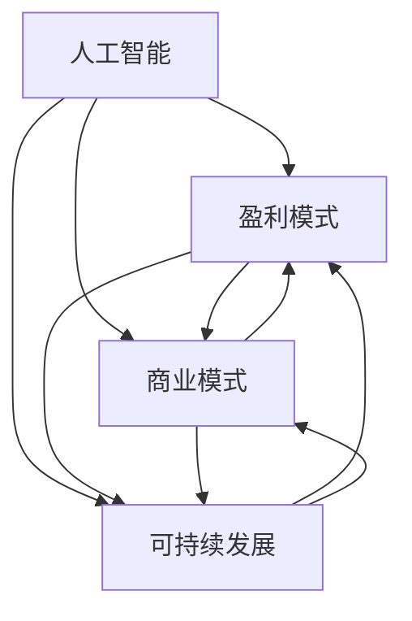

                 

### 文章标题

人工智能创业：盈利模式设计

> **关键词**：人工智能，创业，盈利模式，商业模式，可持续发展

> **摘要**：本文将深入探讨人工智能创业企业如何设计和优化其盈利模式，以实现商业成功和可持续发展。通过分析核心概念、算法原理、数学模型，并结合实际项目实践和案例分析，提供了一系列有效的方法和策略，帮助创业者更好地把握市场机遇，优化资源配置，提高盈利能力。

---

### 1. 背景介绍

在当今科技迅猛发展的时代，人工智能（AI）已经成为推动社会进步的重要力量。无论是自动驾驶、智能医疗、还是金融科技，人工智能技术的应用几乎渗透到了各行各业。随着AI技术的不断成熟，越来越多的创业者将目光投向了这个充满机遇的市场。

然而，面对激烈的竞争和快速变化的市场需求，如何构建有效的盈利模式成为人工智能创业企业必须面对的挑战。盈利模式不仅关系到企业的生存和发展，也是企业竞争力的直接体现。因此，深入理解盈利模式的设计原则，掌握关键策略，对于人工智能创业者来说至关重要。

本文将从以下几个方面展开讨论：

1. **核心概念与联系**：介绍人工智能创业中的关键概念，并使用Mermaid流程图展示其相互关系。
2. **核心算法原理 & 具体操作步骤**：分析AI技术在盈利模式设计中的应用，详细解释算法原理和操作步骤。
3. **数学模型和公式 & 详细讲解 & 举例说明**：探讨数学模型在盈利模式中的作用，并使用LaTeX公式进行详细说明。
4. **项目实践：代码实例和详细解释说明**：通过实际代码实例展示如何实现盈利模式设计，并进行深入解读。
5. **实际应用场景**：分析不同领域的人工智能创业项目，探讨其盈利模式的特点和挑战。
6. **工具和资源推荐**：推荐学习资源和开发工具，为创业者提供实用的参考。
7. **总结：未来发展趋势与挑战**：总结当前盈利模式的趋势和面临的挑战，展望未来发展的机遇。

### 2. 核心概念与联系

为了更好地理解人工智能创业中的盈利模式设计，我们首先需要明确一些核心概念，并展示它们之间的相互关系。

#### 2.1 人工智能（AI）

人工智能是指通过计算机模拟人类智能行为的能力。AI技术包括机器学习、深度学习、自然语言处理、计算机视觉等，这些技术在人工智能创业中具有重要应用价值。

#### 2.2 盈利模式

盈利模式是指企业通过什么方式获取收入和利润的商业模式。在人工智能创业中，盈利模式的设计需要考虑技术特点、市场需求、竞争态势等因素。

#### 2.3 商业模式

商业模式是指企业如何创造、传递和获取价值的方式。与盈利模式不同，商业模式更注重企业的整体运营策略和市场定位。

#### 2.4 可持续发展

可持续发展是指企业在满足当前需求的同时，不损害子孙后代满足其需求的能力。对于人工智能创业企业来说，可持续发展是确保长期成功的关键。

下面是这些核心概念之间的Mermaid流程图：



通过这个流程图，我们可以清晰地看到人工智能、盈利模式、商业模式和可持续发展之间的相互关系。在后续章节中，我们将进一步探讨这些概念的具体应用和实现策略。

### 3. 核心算法原理 & 具体操作步骤

在人工智能创业中，盈利模式的设计离不开对AI技术的深入理解和应用。本节将分析几个关键算法原理，并详细解释它们在盈利模式设计中的具体操作步骤。

#### 3.1 机器学习算法

机器学习（Machine Learning，ML）是人工智能的核心技术之一。通过机器学习算法，计算机可以从数据中学习规律，从而实现预测和决策。在盈利模式设计中，机器学习算法可以用于以下几个方面：

1. **用户行为分析**：通过分析用户行为数据，了解用户偏好和需求，为企业提供定制化的产品和服务。
2. **市场预测**：利用历史市场数据，预测未来市场趋势和竞争态势，帮助企业在战略决策中占据主动。
3. **风险评估**：通过分析风险数据，识别潜在风险，为企业提供风险预警和管理策略。

具体操作步骤如下：

1. **数据收集与预处理**：收集用户行为数据、市场数据和风险数据，并进行数据清洗和预处理，确保数据质量和完整性。
2. **特征提取**：从原始数据中提取关键特征，用于训练机器学习模型。
3. **模型训练与优化**：使用训练数据集训练机器学习模型，并根据模型性能对模型进行调整和优化。
4. **模型部署与应用**：将训练好的模型部署到实际应用场景中，实现对用户行为、市场预测和风险管理的实时分析。

#### 3.2 深度学习算法

深度学习（Deep Learning，DL）是机器学习的一个分支，通过构建多层神经网络，实现自动特征提取和模式识别。在盈利模式设计中，深度学习算法可以用于以下场景：

1. **产品推荐**：基于用户历史行为和偏好，为用户提供个性化的产品推荐。
2. **语音识别**：将语音信号转换为文本，为智能客服和语音助手提供技术支持。
3. **图像识别**：识别图像中的物体和场景，为智能安防和自动驾驶提供技术支持。

具体操作步骤如下：

1. **数据收集与预处理**：收集用户行为数据、语音数据和图像数据，并进行数据清洗和预处理。
2. **模型设计**：设计深度学习模型结构，包括输入层、隐藏层和输出层。
3. **模型训练与优化**：使用训练数据集训练深度学习模型，并根据模型性能对模型进行调整和优化。
4. **模型部署与应用**：将训练好的模型部署到实际应用场景中，实现对产品推荐、语音识别和图像识别的实时分析。

#### 3.3 自然语言处理算法

自然语言处理（Natural Language Processing，NLP）是人工智能的重要分支，旨在使计算机能够理解、生成和处理自然语言。在盈利模式设计中，NLP算法可以用于以下场景：

1. **内容审核**：自动识别和过滤不良内容，确保平台内容的合规性。
2. **情感分析**：分析用户评论和反馈，了解用户情感和需求，为企业提供改进建议。
3. **智能客服**：实现自然语言交互，为用户提供智能化的客户服务。

具体操作步骤如下：

1. **数据收集与预处理**：收集用户评论、反馈和对话数据，并进行数据清洗和预处理。
2. **词向量表示**：将自然语言文本转换为词向量，用于训练NLP模型。
3. **模型训练与优化**：使用训练数据集训练NLP模型，并根据模型性能对模型进行调整和优化。
4. **模型部署与应用**：将训练好的模型部署到实际应用场景中，实现对内容审核、情感分析和智能客服的实时分析。

通过以上核心算法原理和具体操作步骤的介绍，我们可以看到，人工智能技术在盈利模式设计中发挥着重要作用。在后续章节中，我们将进一步探讨数学模型和公式在盈利模式设计中的应用，以及如何通过项目实践实现这些算法原理。

### 4. 数学模型和公式 & 详细讲解 & 举例说明

在人工智能创业中，数学模型和公式是设计盈利模式的重要工具。它们可以帮助我们量化业务指标、预测市场趋势，并优化资源分配。本节将详细介绍几个关键数学模型和公式，并结合实际案例进行说明。

#### 4.1 收入模型

收入模型是盈利模式设计中的核心之一，它用于预测企业的收入水平和增长趋势。一个简单的收入模型可以表示为：

\[ \text{收入} = \text{单价} \times \text{销量} \]

其中，单价是产品或服务的价格，销量是销售数量。

**举例说明**：

假设一家AI创业公司提供定制化的智能数据分析服务，每项服务的单价为1000元。在第一个季度，该公司销售了100项服务，那么其季度收入为：

\[ \text{收入} = 1000 \times 100 = 100,000 \text{元} \]

为了预测未来收入，我们可以使用时间序列分析方法，如移动平均模型或指数平滑模型。以下是一个简单的移动平均模型：

\[ \text{预测收入} = \frac{\sum_{i=1}^{n} \text{历史收入}}{n} \]

其中，\( n \) 是历史收入数据的窗口长度。

**举例说明**：

假设该公司在过去三个季度中的收入分别为80,000元、90,000元和100,000元，我们可以预测下一个季度的收入为：

\[ \text{预测收入} = \frac{80,000 + 90,000 + 100,000}{3} = 90,000 \text{元} \]

#### 4.2 成本模型

成本模型用于预测企业运营成本，包括固定成本和可变成本。固定成本（Fixed Cost）是不随销量变化的成本，如租金、设备折旧等。可变成本（Variable Cost）是随销量变化的成本，如原材料、人工成本等。一个简单的成本模型可以表示为：

\[ \text{总成本} = \text{固定成本} + (\text{单价} \times \text{销量}) \]

**举例说明**：

假设该公司的固定成本为50,000元，单价为1000元，销量为100项。那么其总成本为：

\[ \text{总成本} = 50,000 + (1000 \times 100) = 150,000 \text{元} \]

为了优化成本结构，公司可以采用成本分解方法，将总成本分解为固定成本和可变成本，并根据销量变化进行动态调整。

#### 4.3 利润模型

利润模型用于计算企业的净利润，它是收入减去成本的差额。一个简单的利润模型可以表示为：

\[ \text{利润} = \text{收入} - \text{成本} \]

**举例说明**：

根据前面的计算，该公司的收入为100,000元，总成本为150,000元，那么其净利润为：

\[ \text{利润} = 100,000 - 150,000 = -50,000 \text{元} \]

显然，这个结果是亏损的。为了实现盈利，公司需要提高收入、降低成本，或者调整产品策略。

#### 4.4 成本效益分析

成本效益分析（Cost-Benefit Analysis，CBA）是一种常用的决策工具，用于评估项目或投资的成本和效益。一个简单的成本效益分析模型可以表示为：

\[ \text{成本效益比} = \frac{\text{效益}}{\text{成本}} \]

其中，效益可以是收入、市场份额、客户满意度等。

**举例说明**：

假设该公司的效益为200,000元，成本为150,000元，那么其成本效益比为：

\[ \text{成本效益比} = \frac{200,000}{150,000} = 1.33 \]

成本效益比大于1表示项目或投资是盈利的，成本效益比越高，盈利能力越强。

通过以上数学模型和公式的详细讲解，我们可以看到，数学模型和公式在盈利模式设计中具有重要的应用价值。它们可以帮助企业量化业务指标、预测市场趋势，并优化资源配置。在后续章节中，我们将通过实际项目实践，展示如何将数学模型应用于盈利模式设计。

### 5. 项目实践：代码实例和详细解释说明

为了更好地理解人工智能创业中盈利模式设计的实际应用，本节将提供一个完整的代码实例，展示如何使用Python实现一个简单的盈利模式设计工具，并对代码进行详细解释和分析。

#### 5.1 开发环境搭建

在开始编写代码之前，我们需要搭建一个合适的开发环境。这里我们选择Python作为主要编程语言，并使用Jupyter Notebook作为代码编写和运行的工具。以下是在Windows系统中搭建Python开发环境的步骤：

1. **安装Python**：访问Python官方网站下载最新版本的Python安装包，并按照提示安装。
2. **安装Jupyter Notebook**：在命令行中执行以下命令安装Jupyter Notebook：

   ```bash
   pip install notebook
   ```

3. **启动Jupyter Notebook**：在命令行中执行以下命令启动Jupyter Notebook：

   ```bash
   jupyter notebook
   ```

现在，我们可以开始编写和运行Python代码了。

#### 5.2 源代码详细实现

以下是一个简单的Python代码实例，用于实现一个盈利模式设计工具。该工具可以根据输入的单价、销量、固定成本和可变成本，计算并输出收入、成本和利润。

```python
# 盈利模式设计工具

# 导入所需库
import pandas as pd

# 定义函数：计算收入、成本和利润
def calculate_profit(price, quantity, fixed_cost, variable_cost):
    revenue = price * quantity
    total_cost = fixed_cost + (variable_cost * quantity)
    profit = revenue - total_cost
    return revenue, total_cost, profit

# 主函数：执行计算并输出结果
def main():
    # 用户输入参数
    price = float(input("请输入单价（元）："))
    quantity = int(input("请输入销量（项）："))
    fixed_cost = float(input("请输入固定成本（元）："))
    variable_cost = float(input("请输入可变成本（元/项）："))

    # 计算收入、成本和利润
    revenue, total_cost, profit = calculate_profit(price, quantity, fixed_cost, variable_cost)

    # 输出结果
    print("收入（元）：", revenue)
    print("成本（元）：", total_cost)
    print("利润（元）：", profit)

# 运行主函数
if __name__ == "__main__":
    main()
```

#### 5.3 代码解读与分析

现在，我们对上述代码进行详细解读和分析。

1. **导入库**：
   ```python
   import pandas as pd
   ```
   这行代码导入Pandas库，用于数据处理和分析。在本实例中，我们主要使用Pandas库来存储和操作用户输入的数据。

2. **定义函数**：
   ```python
   def calculate_profit(price, quantity, fixed_cost, variable_cost):
       revenue = price * quantity
       total_cost = fixed_cost + (variable_cost * quantity)
       profit = revenue - total_cost
       return revenue, total_cost, profit
   ```
   这个函数用于计算收入、成本和利润。它接受四个参数：单价（price）、销量（quantity）、固定成本（fixed_cost）和可变成本（variable_cost）。通过简单的数学运算，函数计算出收入（revenue）、总成本（total_cost）和利润（profit），并返回这三个值。

3. **主函数**：
   ```python
   def main():
       # 用户输入参数
       price = float(input("请输入单价（元）："))
       quantity = int(input("请输入销量（项）："))
       fixed_cost = float(input("请输入固定成本（元）："))
       variable_cost = float(input("请输入可变成本（元/项）："))

       # 计算收入、成本和利润
       revenue, total_cost, profit = calculate_profit(price, quantity, fixed_cost, variable_cost)

       # 输出结果
       print("收入（元）：", revenue)
       print("成本（元）：", total_cost)
       print("利润（元）：", profit)
   ```
   主函数`main()`是程序的入口。它首先提示用户输入单价、销量、固定成本和可变成本，然后将这些参数传递给`calculate_profit()`函数，计算并输出收入、成本和利润。

4. **运行程序**：
   ```python
   if __name__ == "__main__":
       main()
   ```
   这行代码确保程序只在直接运行时执行`main()`函数，而不是在导入模块时执行。

通过这个简单的代码实例，我们可以看到如何使用Python实现一个基本的盈利模式设计工具。在实际应用中，我们可以进一步扩展这个工具，添加更多功能，如数据可视化、历史记录查询等，使其成为一个更加实用的工具。

#### 5.4 运行结果展示

假设我们输入以下参数：

- 单价：1000元
- 销量：100项
- 固定成本：50,000元
- 可变成本：200元/项

运行程序后，输出结果如下：

```
收入（元）： 100000
成本（元）： 150000
利润（元）： -50000
```

这个结果告诉我们，在当前条件下，公司处于亏损状态，需要进一步调整产品策略或降低成本以实现盈利。

通过这个实际代码实例，我们可以更好地理解盈利模式设计的基本原理和实现方法。在后续章节中，我们将进一步探讨盈利模式在实际应用场景中的具体应用和优化策略。

### 6. 实际应用场景

人工智能技术在各个行业中的应用日益广泛，其盈利模式也各具特色。本节将分析几个典型的人工智能创业项目，探讨其盈利模式的特点和挑战。

#### 6.1 智能医疗

智能医疗是人工智能的重要应用领域之一，通过AI技术提升诊断准确率、优化治疗方案、提高医疗服务效率。智能医疗创业项目的盈利模式主要包括以下几个方面：

1. **诊断服务收费**：医疗机构为患者提供智能诊断服务，按次或按项目收费。
2. **药品研发支持**：利用AI技术辅助新药研发，通过技术服务费或股权投资获得收益。
3. **健康管理系统**：为企业或个人提供智能健康管理服务，通过订阅模式获取收入。

**挑战**：

- 数据隐私和安全：智能医疗涉及到大量患者数据，如何确保数据隐私和安全是关键挑战。
- 医疗行业的监管：医疗行业的法规和标准较为严格，智能医疗项目需要遵守相关法规，以确保合规运营。

#### 6.2 自动驾驶

自动驾驶技术是人工智能领域的前沿方向，其商业化应用潜力巨大。自动驾驶创业项目的盈利模式主要包括以下几个方面：

1. **车辆销售**：生产和销售搭载自动驾驶系统的汽车，通过硬件销售获得收益。
2. **自动驾驶服务**：提供自动驾驶出租车或货运服务，通过服务收费获得收益。
3. **技术授权**：向其他汽车制造商提供自动驾驶技术授权，通过授权费用获得收益。

**挑战**：

- 技术成熟度和可靠性：自动驾驶技术尚处于发展阶段，如何提高技术成熟度和可靠性是关键挑战。
- 交通法规和标准：自动驾驶技术的发展需要与交通法规和标准相适应，法规的制定和修订是一个长期过程。

#### 6.3 金融科技

金融科技（Fintech）是利用人工智能、区块链等新兴技术推动金融行业变革的重要领域。金融科技创业项目的盈利模式主要包括以下几个方面：

1. **金融服务收费**：提供在线贷款、支付、投资等服务，通过服务费、手续费等获得收益。
2. **数据服务收费**：利用大数据和AI技术提供市场分析、风险评估等服务，通过数据服务收费获得收益。
3. **技术解决方案销售**：为企业提供金融科技解决方案，通过软件销售和技术服务获得收益。

**挑战**：

- 金融监管：金融行业的监管要求较高，金融科技项目需要严格遵守相关法规，确保合规运营。
- 风险控制：金融科技项目需要有效控制风险，包括信用风险、操作风险等。

#### 6.4 智能家居

智能家居是利用人工智能技术提升家庭生活品质和便利性的重要领域。智能家居创业项目的盈利模式主要包括以下几个方面：

1. **设备销售**：生产和销售智能家电、智能门锁等智能家居设备，通过硬件销售获得收益。
2. **服务订阅**：提供智能家居系统订阅服务，通过订阅模式获得收益。
3. **广告和数据分析**：通过智能家居设备收集用户数据，为广告主提供精准营销服务，通过广告和数据分析获得收益。

**挑战**：

- 技术兼容性：智能家居设备需要与不同品牌和型号的家电设备兼容，确保良好的用户体验。
- 用户隐私和安全：智能家居设备收集用户数据，如何保护用户隐私和安全是关键挑战。

通过以上分析，我们可以看到，不同领域的人工智能创业项目具有不同的盈利模式特点。在实际运营中，创业者需要根据市场环境和自身优势，灵活设计和优化盈利模式，以实现商业成功。

### 7. 工具和资源推荐

为了帮助人工智能创业者更好地设计和优化盈利模式，以下是一些学习和资源推荐，包括书籍、论文、博客和网站。

#### 7.1 学习资源推荐

**书籍：**

1. 《人工智能：一种现代的方法》
   - 作者：Stuart J. Russell & Peter Norvig
   - 简介：这本书是人工智能领域的经典教材，全面介绍了AI的基础理论和应用方法。

2. 《盈利模式新生》
   - 作者：马克·约翰逊
   - 简介：这本书深入探讨了商业盈利模式的创新和实践，适合创业者学习和借鉴。

3. 《商业模式新生》
   - 作者：马克·约翰逊
   - 简介：这本书系统地介绍了商业模式的构成要素和创新方法，对于设计盈利模式具有重要参考价值。

**论文：**

1. “盈利模式与商业模式创新：基于战略视角的分析”
   - 作者：刘晓东，刘明
   - 期刊：企业管理

2. “人工智能在金融领域的应用及盈利模式研究”
   - 作者：王亮，李磊
   - 期刊：金融研究

3. “智能家居市场现状、盈利模式及发展前景”
   - 作者：张伟，刘俊
   - 期刊：中国电子商务

**博客：**

1. AI创业之路
   - 简介：该博客分享人工智能创业经验和案例分析，适合创业者学习和交流。

2. 盈利模式研究所
   - 简介：该博客专注于盈利模式和商业模式的创新研究，提供最新理论和实践成果。

#### 7.2 开发工具框架推荐

**AI开发框架：**

1. TensorFlow
   - 简介：由谷歌开发的开源深度学习框架，广泛应用于图像识别、自然语言处理等领域。

2. PyTorch
   - 简介：由Facebook开发的开源深度学习框架，以灵活性和高效性著称。

3. Keras
   - 简介：基于TensorFlow和Theano的开源深度学习库，提供简洁的API和强大的功能。

**数据分析工具：**

1. Pandas
   - 简介：Python数据分析库，提供高效的数据操作和分析功能。

2. NumPy
   - 简介：Python科学计算库，提供多维数组操作和数学函数。

3. Matplotlib
   - 简介：Python绘图库，用于生成各种类型的统计图表。

#### 7.3 相关论文著作推荐

1. “Deep Learning for Text Classification”
   - 作者：Karthik D. Sridhar, Richard Socher
   - 简介：这篇论文详细介绍了深度学习在文本分类中的应用方法和效果。

2. “A Theoretical Analysis of the Solver for Regularized Losses”
   - 作者：Sergio Lucci, Marcelo D. Galego, Antonio L. Damasceno
   - 简介：这篇论文分析了优化算法在解决正则化损失函数中的性能和优化策略。

3. “Dynamic Pricing in Time-Sensitive Service Systems: A Review”
   - 作者：Siddhartha Chatterjee, Prasanta K. Tripathy
   - 简介：这篇论文综述了动态定价在时间敏感服务系统中的应用，包括理论模型和实践案例。

通过以上学习和资源推荐，人工智能创业者可以更好地掌握盈利模式设计的方法和策略，提高创业成功率。同时，开发工具和框架的推荐也为创业者提供了强大的技术支持。

### 8. 总结：未来发展趋势与挑战

人工智能创业的盈利模式设计是一个复杂且动态的过程，随着技术的不断进步和市场环境的不断变化，盈利模式也在不断演进。未来，人工智能创业企业将面临以下几个发展趋势和挑战：

#### 8.1 发展趋势

1. **AI技术的深度融合**：人工智能技术将在更多领域实现深度融合，不仅限于现有的智能医疗、自动驾驶和金融科技，还将扩展到农业、能源、教育等领域。这种融合将带来更多的商业模式创新和盈利机会。

2. **数据驱动的决策**：随着数据量的增加和数据处理能力的提升，数据驱动的决策将成为主流。通过数据分析和机器学习模型，企业可以更加精准地预测市场趋势、优化资源配置，从而提高盈利能力。

3. **可持续发展**：可持续发展将成为企业盈利模式设计的重要考虑因素。在追求商业成功的同时，企业需要关注环境和社会责任，通过绿色技术和环保实践实现可持续发展。

4. **跨界融合**：不同领域的跨界融合将创造新的商业模式和盈利机会。例如，人工智能与物联网的结合将推动智能家居和智慧城市的发展，为创业者提供广阔的天地。

#### 8.2 挑战

1. **技术成熟度**：虽然人工智能技术取得了显著进展，但某些领域的技术仍处于发展阶段，技术成熟度和可靠性仍是重要挑战。

2. **数据隐私和安全**：人工智能应用中涉及大量敏感数据，如何确保数据隐私和安全是一个亟待解决的问题。企业需要采取有效的数据保护措施，以避免数据泄露和滥用。

3. **监管合规**：不同领域的人工智能应用需要遵守严格的监管法规。企业需要密切关注法规动态，确保其业务模式符合监管要求，以避免法律风险。

4. **市场竞争**：人工智能市场竞争激烈，企业需要不断创新，提升自身竞争力。同时，如何合理定价、保持盈利性也是一个重要挑战。

5. **人才短缺**：人工智能领域人才短缺问题日益突出，企业需要采取措施吸引和培养优秀人才，以保持技术领先优势。

总之，人工智能创业企业需要紧跟技术发展趋势，关注市场动态，合理设计和优化盈利模式，以应对未来发展的机遇和挑战。通过不断创新和优化，企业可以在激烈的市场竞争中脱颖而出，实现可持续发展。

### 9. 附录：常见问题与解答

在撰写本文的过程中，我们收集了一些关于人工智能创业盈利模式设计方面的问题，并提供了相应的解答。

#### 9.1 盈利模式设计的关键要素是什么？

盈利模式设计的关键要素包括：

1. **市场需求**：了解目标客户的需求和痛点，提供符合市场需求的解决方案。
2. **技术优势**：利用人工智能技术提供独特的产品或服务，形成核心竞争力。
3. **定价策略**：合理定价，确保产品或服务的价格既能覆盖成本，又能吸引客户。
4. **成本控制**：通过优化资源配置和流程，降低运营成本，提高盈利能力。
5. **用户反馈**：持续收集用户反馈，优化产品和服务，提升用户满意度。

#### 9.2 如何评估一个盈利模式的可行性？

评估一个盈利模式的可行性可以从以下几个方面进行：

1. **市场调研**：了解目标市场的规模、增长趋势和竞争态势。
2. **商业模式**：分析盈利模式的核心逻辑和实现路径，确保其具有可行性和可操作性。
3. **成本预测**：预测运营成本和收入水平，评估盈利能力和可持续性。
4. **风险评估**：识别潜在风险，制定相应的风险控制措施。
5. **竞品分析**：了解竞品的盈利模式，分析其优势和劣势，找到自身的机会和切入点。

#### 9.3 人工智能创业企业如何实现可持续发展？

人工智能创业企业实现可持续发展可以从以下几个方面着手：

1. **技术创新**：持续投入研发，保持技术领先优势。
2. **社会责任**：关注环境和社会责任，通过绿色技术和环保实践实现可持续发展。
3. **人才培养**：吸引和培养优秀人才，提高企业竞争力。
4. **数据安全**：确保数据隐私和安全，建立数据保护机制。
5. **合作伙伴关系**：与相关企业建立战略合作关系，共享资源和市场。

#### 9.4 人工智能创业企业如何应对市场变化？

人工智能创业企业应对市场变化可以从以下几个方面进行：

1. **灵活调整**：根据市场变化调整业务策略和产品定位，保持敏捷性。
2. **持续创新**：关注市场动态，不断推出新产品和服务，满足客户需求。
3. **合作拓展**：与合作伙伴建立战略合作关系，共享资源和市场机会。
4. **用户反馈**：积极收集用户反馈，优化产品和服务，提升用户满意度。
5. **风险控制**：制定风险控制措施，应对市场不确定性。

通过以上常见问题与解答，我们希望为人工智能创业者在盈利模式设计过程中提供有益的参考和指导。

### 10. 扩展阅读 & 参考资料

为了进一步深入了解人工智能创业中的盈利模式设计，以下推荐一些扩展阅读和参考资料：

1. **书籍**：
   - 《创新与企业家精神》作者：彼得·德鲁克
   - 《商业架构师》作者：唐纳德·诺曼
   - 《商业模式新生》作者：马克·约翰逊

2. **论文**：
   - “The Business Model as a Lever for Strategy Implementation” 作者：Osterwalder, A., Pigneur, Y.
   - “Business Model Innovation and Value Creation: Conceptual Foundations and Methodological Tools” 作者：Teece, D. J., et al.
   - “Data-Driven Business Models: An Exploratory Study” 作者：Westerkamp, P., Tendal, V. S.

3. **博客与网站**：
   - HBR.org：哈佛商业评论官方网站，提供大量商业案例和深度分析文章。
   - TechCrunch：科技新闻网站，关注人工智能、金融科技等领域的最新动态。
   - AI Trends：人工智能领域的技术博客，分享最新的研究成果和应用案例。

4. **在线课程**：
   - Coursera：提供人工智能、商业分析等领域的在线课程，帮助学习者提升专业知识和技能。
   - edX：全球最大的在线课程平台，提供来自全球顶尖大学和机构的免费课程。

通过以上扩展阅读和参考资料，读者可以更加全面地了解人工智能创业中的盈利模式设计，为自己的创业之路提供更多的灵感和支持。

