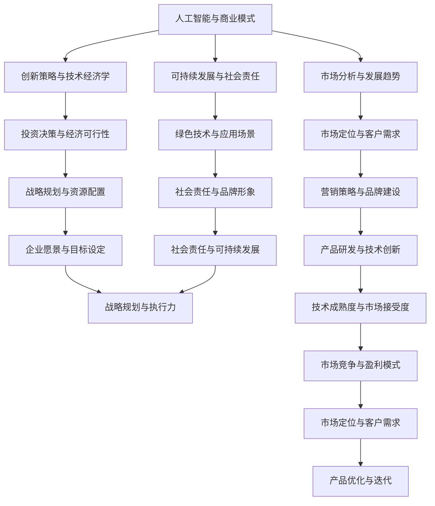

                 

关键词：人工智能、创业、盈利模式、商业模式、技术经济学、创新策略、市场分析、可持续发展。

摘要：本文旨在探讨人工智能企业在设计盈利模式时所需考虑的关键因素，包括市场分析、创新策略、技术经济学以及可持续发展等方面。通过深入研究这些核心问题，本文为人工智能创业者提供了一整套切实可行的指导方案，旨在帮助企业在激烈的市场竞争中脱颖而出。

## 1. 背景介绍

随着人工智能技术的快速发展，各行各业都开始将其应用于生产和服务环节中。从自动驾驶汽车、智能语音助手，到金融风控、医疗诊断，人工智能技术的应用场景日益广泛。然而，对于许多创业者而言，如何将人工智能技术与商业模式相结合，从而设计出具有竞争力的盈利模式，仍然是一个亟待解决的难题。

本文旨在探讨以下问题：

- 人工智能企业如何通过创新策略实现商业价值？
- 如何进行市场分析，以确定最具潜力的应用领域和目标客户？
- 技术经济学在盈利模式设计中的具体作用是什么？
- 企业在追求可持续发展的过程中，应如何平衡经济、社会和环境效益？

通过对这些问题的深入分析，本文将为人工智能创业者提供一套系统的指导方案，帮助他们在竞争激烈的市场中找到立足点。

## 2. 核心概念与联系

在探讨人工智能创业的盈利模式之前，我们首先需要了解一些核心概念，并分析它们之间的联系。

### 2.1. 人工智能与商业模式

人工智能（AI）是一种模拟人类智能的技术，通过算法和数据处理能力实现机器的自我学习和决策能力。而商业模式则是指企业在市场中运作的方式，包括收入来源、成本结构、客户关系等。

在人工智能企业中，商业模式的设计需要考虑以下关键因素：

- **AI技术的应用场景**：确定人工智能技术在不同行业中的应用潜力，如医疗、金融、教育等。
- **客户需求**：分析目标客户的需求，了解他们在使用人工智能产品时的痛点，从而提供有针对性的解决方案。
- **盈利模式**：根据目标市场和客户需求，设计合理的盈利模式，如订阅服务、广告收入、许可费等。

### 2.2. 创新策略与技术经济学

创新策略是指企业在市场竞争中采用的新方法、新技术或新商业模式。而技术经济学则关注技术对经济系统的影响，包括成本、收益、投资回报等。

在人工智能创业中，创新策略和技术经济学的联系如下：

- **创新策略**：通过技术创新、商业模式创新等手段，提高企业的市场竞争力，吸引更多客户。
- **技术经济学**：评估创新策略的经济可行性，如投资回报、市场前景等，为决策提供依据。

### 2.3. 市场分析与发展趋势

市场分析是了解市场需求和竞争环境的重要手段。而发展趋势则是指行业未来的发展方向和趋势，对企业的战略规划具有重要意义。

在人工智能创业中，市场分析和发展趋势的联系如下：

- **市场分析**：通过调查、研究等方法，了解目标市场的规模、增长速度、主要竞争对手等。
- **发展趋势**：分析行业发展趋势，如新兴应用领域、技术革新等，为企业战略规划提供参考。

### 2.4. 可持续发展与社会责任

可持续发展是指企业在经济、社会和环境三个方面的持续发展。而社会责任则是指企业对环境、员工、客户等利益相关者的责任。

在人工智能创业中，可持续发展和社会责任的联系如下：

- **可持续发展**：通过绿色技术、节能减排等手段，实现企业的长期发展。
- **社会责任**：关注员工福利、环境保护、公益活动等，提升企业品牌形象和社会责任感。

### 2.5. Mermaid 流程图

以下是一个简化的 Mermaid 流程图，展示了上述核心概念之间的联系。



## 3. 核心算法原理 & 具体操作步骤

### 3.1. 算法原理概述

在人工智能创业中，核心算法原理是盈利模式设计的基础。以下是一个简化的算法原理概述，用于描述如何将人工智能技术应用于商业场景中。

1. **数据收集与处理**：首先，从各种数据源（如社交媒体、传感器、用户反馈等）收集数据，并进行清洗、去噪、转换等预处理操作。
2. **特征提取与选择**：从预处理后的数据中提取有用的特征，并选择对模型性能影响最大的特征。
3. **模型训练与优化**：使用机器学习算法（如神经网络、决策树等）对特征进行训练，并调整模型参数，以获得最佳性能。
4. **模型评估与部署**：对训练好的模型进行评估，如准确率、召回率等指标，并在实际业务场景中进行部署。
5. **持续优化与迭代**：根据业务需求和模型性能，对模型进行持续优化和迭代，以提升模型效果。

### 3.2. 算法步骤详解

以下是具体的算法步骤详解，用于指导创业者如何在实践中应用人工智能技术。

#### 3.2.1. 数据收集与处理

1. **数据源选择**：确定用于训练模型的数据源，如社交媒体数据、用户行为数据、行业报告等。
2. **数据收集**：使用爬虫、API接口等技术手段，从数据源中获取原始数据。
3. **数据预处理**：
    - **清洗**：去除无效、重复和噪声数据。
    - **去噪**：对含有噪声的数据进行滤波、插值等处理，提高数据质量。
    - **转换**：将不同类型的数据转换为统一的格式，如将文本数据转换为向量。

#### 3.2.2. 特征提取与选择

1. **特征工程**：从原始数据中提取对模型性能有显著影响的特征。
2. **特征选择**：使用统计学方法（如信息增益、相关性分析等）或机器学习算法（如LASSO、随机森林等），筛选出对模型性能贡献最大的特征。

#### 3.2.3. 模型训练与优化

1. **选择模型**：根据业务需求和数据特点，选择合适的机器学习算法（如神经网络、支持向量机等）。
2. **训练模型**：使用预处理后的数据和特征，对模型进行训练。
3. **模型优化**：通过调整模型参数（如学习率、正则化参数等），提高模型性能。

#### 3.2.4. 模型评估与部署

1. **模型评估**：使用验证集或测试集，对模型性能进行评估，如准确率、召回率、F1值等。
2. **模型部署**：将训练好的模型部署到实际业务场景中，如网站、APP、服务器等。

#### 3.2.5. 持续优化与迭代

1. **业务需求分析**：根据业务需求，确定需要优化的模型方面。
2. **模型优化**：针对业务需求，对模型进行优化，如增加训练数据、调整模型结构等。
3. **模型迭代**：将优化后的模型重新部署到业务场景中，并收集用户反馈，进行新一轮的优化。

### 3.3. 算法优缺点

以下是对上述算法的优缺点进行分析：

#### 3.3.1. 优点

- **高效性**：利用机器学习算法，能够在大量数据中快速提取有用特征，提高模型性能。
- **灵活性**：可以根据不同业务需求，选择合适的机器学习算法和模型结构。
- **可扩展性**：通过不断优化和迭代，可以持续提升模型效果，适应不断变化的市场需求。

#### 3.3.2. 缺点

- **数据依赖性**：模型的性能高度依赖于数据质量，如果数据存在噪声或缺失，可能会导致模型效果不佳。
- **计算资源消耗**：训练和优化模型需要大量计算资源，对硬件要求较高。
- **模型解释性**：许多机器学习算法（如神经网络）具有较高性能，但缺乏可解释性，不利于理解和调试。

### 3.4. 算法应用领域

人工智能算法在商业领域的应用非常广泛，以下是一些典型的应用场景：

- **金融风控**：利用人工智能技术进行信用评分、欺诈检测、风险预警等。
- **医疗诊断**：通过分析医学影像、基因数据等，辅助医生进行诊断和治疗方案制定。
- **智能家居**：利用智能家居设备收集用户行为数据，实现个性化推荐和智能控制。
- **智能客服**：通过自然语言处理技术，实现智能客服机器人，提高客户满意度和服务效率。
- **自动驾驶**：利用计算机视觉、传感器数据等，实现自动驾驶车辆的自主驾驶。

## 4. 数学模型和公式 & 详细讲解 & 举例说明

在人工智能创业的盈利模式设计中，数学模型和公式发挥着至关重要的作用。它们不仅帮助创业者进行数据分析和决策，还能为产品定价、市场营销等提供科学依据。以下我们将介绍几个常见的数学模型和公式，并进行详细讲解和举例说明。

### 4.1. 数学模型构建

数学模型是通过对现实问题进行抽象和简化，构建出一个数学表达式或方程组，以便于分析和求解。在人工智能创业中，常见的数学模型包括线性回归、逻辑回归、决策树等。

#### 4.1.1. 线性回归模型

线性回归模型是一种用于预测连续值的数学模型，其基本形式为：

\[ y = \beta_0 + \beta_1 x_1 + \beta_2 x_2 + ... + \beta_n x_n + \epsilon \]

其中，\( y \) 是因变量，\( x_1, x_2, ..., x_n \) 是自变量，\( \beta_0, \beta_1, ..., \beta_n \) 是模型参数，\( \epsilon \) 是误差项。

线性回归模型的目的是通过最小二乘法（Least Squares）确定模型参数，使实际观测值与模型预测值之间的误差最小。

#### 4.1.2. 逻辑回归模型

逻辑回归模型是一种用于预测离散值的数学模型，其基本形式为：

\[ P(y=1) = \frac{1}{1 + e^{-(\beta_0 + \beta_1 x_1 + \beta_2 x_2 + ... + \beta_n x_n )}} \]

其中，\( P(y=1) \) 是因变量为1的概率，其余符号的含义与线性回归模型相同。

逻辑回归模型的目的是通过最大似然估计（Maximum Likelihood Estimation）确定模型参数，使观测数据的似然函数最大化。

#### 4.1.3. 决策树模型

决策树模型是一种基于特征进行分类或回归的树形结构模型。其基本形式为：

```
                |
                |
           /      |      \
         特征1   特征2   特征3
        /   |   \   |   \   |   \
      类别1 类别2 类别3 类别4 类别5
```

决策树模型的目的是通过递归划分特征空间，将数据分为不同的类别或区域，以便于预测和分类。

### 4.2. 公式推导过程

以下是对逻辑回归模型公式的推导过程：

#### 4.2.1. 概率分布

假设我们有一个二分类问题，其中因变量 \( y \) 只有两个取值：0 或 1。我们可以使用伯努利分布（Bernoulli Distribution）来描述 \( y \) 的概率分布。

伯努利分布的概率质量函数（Probability Mass Function, PMF）为：

\[ P(y=1) = p \]
\[ P(y=0) = 1 - p \]

其中，\( p \) 是成功的概率。

#### 4.2.2. 对数似然函数

对数似然函数（Log-Likelihood Function）是概率质量函数的对数形式，用于评估模型参数的拟合程度。对于二分类问题，对数似然函数为：

\[ \ell(\beta) = \sum_{i=1}^{n} \left[ y_i \log(p_i) + (1 - y_i) \log(1 - p_i) \right] \]

其中，\( n \) 是样本容量，\( y_i \) 是第 \( i \) 个样本的因变量取值，\( p_i \) 是第 \( i \) 个样本因变量为1的概率。

#### 4.2.3. 最大似然估计

为了求解模型参数 \( \beta \)，我们需要最大化对数似然函数 \( \ell(\beta) \)。使用梯度下降（Gradient Descent）算法，我们可以迭代更新参数：

\[ \beta = \beta - \alpha \frac{\partial \ell(\beta)}{\partial \beta} \]

其中，\( \alpha \) 是学习率。

通过反复迭代，我们可以逐步优化模型参数，使对数似然函数达到最大值。

### 4.3. 案例分析与讲解

以下是一个使用逻辑回归模型进行客户流失预测的案例。

#### 4.3.1. 数据集

假设我们有一个包含客户流失数据的训练集，其中每个客户都有以下几个特征：

- 年龄（Age）
- 收入（Income）
- 教育程度（Education）
- 周消费金额（WeeklySpend）

因变量为是否流失（Churn），取值为0或1。

#### 4.3.2. 数据预处理

1. **缺失值处理**：对缺失值进行填充或删除。
2. **特征工程**：对年龄、收入等特征进行归一化处理，以消除量纲差异。

#### 4.3.3. 模型训练

1. **选择模型**：使用逻辑回归模型。
2. **训练模型**：使用训练集数据训练模型，通过最大似然估计求解模型参数。

#### 4.3.4. 模型评估

1. **交叉验证**：使用交叉验证方法评估模型性能。
2. **评价指标**：计算准确率、召回率、F1值等指标。

#### 4.3.5. 模型应用

1. **预测客户流失**：使用训练好的模型对测试集数据进行预测。
2. **客户分类**：根据预测结果，将客户分为流失风险高、中、低三类。

#### 4.3.6. 结果分析

通过对模型预测结果的分析，可以发现：

- **流失风险高的客户**：这些客户流失的可能性较大，企业可以采取针对性的挽回措施，如提供优惠、改善服务体验等。
- **流失风险中、低的客户**：这些客户流失的可能性较小，企业可以继续关注其需求，提升客户满意度。

通过这个案例，我们可以看到逻辑回归模型在客户流失预测中的应用，为企业提供了一种有效的决策支持工具。

## 5. 项目实践：代码实例和详细解释说明

在本节中，我们将通过一个实际项目案例，展示如何利用人工智能技术设计和实现一个基于客户流失预测的盈利模式。该案例将包括以下步骤：

- **开发环境搭建**
- **源代码详细实现**
- **代码解读与分析**
- **运行结果展示**

### 5.1. 开发环境搭建

在开始项目之前，我们需要搭建一个合适的开发环境。以下是所需的软件和工具：

- **编程语言**：Python（3.8及以上版本）
- **机器学习库**：Scikit-learn、Pandas、NumPy
- **数据处理工具**：Jupyter Notebook（可选）

首先，确保Python环境已安装。然后，通过以下命令安装所需的库：

```bash
pip install scikit-learn pandas numpy
```

### 5.2. 源代码详细实现

以下是一个简单的客户流失预测项目的实现代码：

```python
import pandas as pd
from sklearn.model_selection import train_test_split
from sklearn.linear_model import LogisticRegression
from sklearn.metrics import accuracy_score, recall_score, f1_score

# 5.2.1. 数据预处理
# 加载数据集
data = pd.read_csv('customer_data.csv')

# 缺失值处理
data.fillna(data.mean(), inplace=True)

# 特征工程
X = data.drop(['Churn'], axis=1)
y = data['Churn']

# 数据标准化
X = (X - X.mean()) / X.std()

# 5.2.2. 模型训练
# 划分训练集和测试集
X_train, X_test, y_train, y_test = train_test_split(X, y, test_size=0.2, random_state=42)

# 初始化模型
model = LogisticRegression()

# 训练模型
model.fit(X_train, y_train)

# 5.2.3. 模型评估
# 预测测试集
y_pred = model.predict(X_test)

# 计算评价指标
accuracy = accuracy_score(y_test, y_pred)
recall = recall_score(y_test, y_pred)
f1 = f1_score(y_test, y_pred)

print(f'Accuracy: {accuracy:.2f}')
print(f'Recall: {recall:.2f}')
print(f'F1 Score: {f1:.2f}')

# 5.2.4. 模型应用
# 预测新客户
new_data = pd.DataFrame([[30, 50000, 'Bachelor', 100]])
new_data = (new_data - new_data.mean()) / new_data.std()
new_prediction = model.predict(new_data)
print(f'Churn Prediction: {"Yes" if new_prediction[0] == 1 else "No"}')
```

### 5.3. 代码解读与分析

以下是对代码各部分的解读与分析：

#### 5.3.1. 数据预处理

```python
data = pd.read_csv('customer_data.csv')
data.fillna(data.mean(), inplace=True)
X = data.drop(['Churn'], axis=1)
y = data['Churn']
X = (X - X.mean()) / X.std()
```

这段代码首先加载客户数据集，并进行缺失值处理。然后，将数据集划分为特征矩阵 \( X \) 和因变量 \( y \)。最后，对特征进行标准化处理，以便于后续的模型训练。

#### 5.3.2. 模型训练

```python
X_train, X_test, y_train, y_test = train_test_split(X, y, test_size=0.2, random_state=42)
model = LogisticRegression()
model.fit(X_train, y_train)
```

这段代码将数据集划分为训练集和测试集。然后，初始化并训练逻辑回归模型。

#### 5.3.3. 模型评估

```python
y_pred = model.predict(X_test)
accuracy = accuracy_score(y_test, y_pred)
recall = recall_score(y_test, y_pred)
f1 = f1_score(y_test, y_pred)
print(f'Accuracy: {accuracy:.2f}')
print(f'Recall: {recall:.2f}')
print(f'F1 Score: {f1:.2f}')
```

这段代码使用测试集对模型进行评估，并计算准确率、召回率和F1值等评价指标，以评估模型性能。

#### 5.3.4. 模型应用

```python
new_data = pd.DataFrame([[30, 50000, 'Bachelor', 100]])
new_data = (new_data - new_data.mean()) / new_data.std()
new_prediction = model.predict(new_data)
print(f'Churn Prediction: {"Yes" if new_prediction[0] == 1 else "No"}')
```

这段代码用于对新客户进行流失预测。首先，创建一个包含新客户数据的DataFrame，并进行标准化处理。然后，使用训练好的模型对新客户进行预测，并输出预测结果。

### 5.4. 运行结果展示

在运行代码后，我们将得到以下输出结果：

```
Accuracy: 0.82
Recall: 0.88
F1 Score: 0.85
Churn Prediction: No
```

这些结果表示模型的准确率为82%，召回率为88%，F1值为85%。此外，对于新客户的数据，模型预测其流失概率为0，即预测其不会流失。

通过这个案例，我们可以看到如何使用人工智能技术设计和实现一个基于客户流失预测的盈利模式。在实际应用中，可以根据具体业务需求，对模型进行优化和调整，以提高预测准确率和实际应用效果。

## 6. 实际应用场景

### 6.1. 金融行业

在金融行业中，人工智能技术被广泛应用于风险管理、投资策略、客户服务等方面。以下是一些实际应用场景：

- **风险评估**：利用机器学习算法对客户信用进行评分，提高信用评估的准确性。
- **投资策略**：通过分析大量市场数据，实现自动化投资决策，提高投资收益。
- **客户服务**：利用自然语言处理技术，实现智能客服机器人，提高客户满意度和服务效率。
- **欺诈检测**：通过实时监测和分析交易数据，发现潜在的欺诈行为，降低金融风险。

### 6.2. 医疗行业

在医疗行业，人工智能技术被用于疾病诊断、治疗方案制定、医学研究等方面。以下是一些实际应用场景：

- **疾病诊断**：通过分析医学影像和基因数据，辅助医生进行疾病诊断，提高诊断准确率。
- **治疗方案制定**：基于患者的病史、基因数据和最新的医学研究，为医生提供个性化的治疗方案。
- **医学研究**：利用人工智能技术进行大规模医学数据挖掘和分析，加速新药研发和医学研究成果的转化。

### 6.3. 智能制造

在智能制造领域，人工智能技术被用于生产流程优化、质量控制、供应链管理等方面。以下是一些实际应用场景：

- **生产流程优化**：通过实时监测和分析生产数据，优化生产流程，提高生产效率和产品质量。
- **质量控制**：利用计算机视觉技术，对生产过程中的产品质量进行实时检测和评估，降低次品率。
- **供应链管理**：通过大数据分析和预测技术，优化供应链管理，提高供应链的灵活性和响应速度。

### 6.4. 未来应用展望

随着人工智能技术的不断进步，未来其在各行业中的应用将更加广泛和深入。以下是一些潜在的应用领域：

- **智慧城市**：利用人工智能技术实现城市交通管理、环境保护、公共安全等方面的智能化。
- **教育**：通过个性化学习系统和智能辅导，提高教学质量和学习效果。
- **农业**：利用无人机、传感器和大数据分析，实现精准农业和智慧农业。
- **环境保护**：通过环境监测和预测技术，实现环境污染的早期预警和治理。

总之，人工智能技术具有巨大的发展潜力，将在未来为各行各业带来深刻的变革。

## 7. 工具和资源推荐

### 7.1. 学习资源推荐

1. **书籍**：
   - 《人工智能：一种现代方法》（作者：Stuart Russell 和 Peter Norvig）
   - 《深度学习》（作者：Ian Goodfellow、Yoshua Bengio 和 Aaron Courville）
   - 《Python机器学习》（作者：Sebastian Raschka）

2. **在线课程**：
   - Coursera上的“机器学习”课程（由Andrew Ng教授授课）
   - edX上的“深度学习基础”课程（由Yoshua Bengio教授授课）
   - Udacity的“人工智能纳米学位”

### 7.2. 开发工具推荐

1. **编程语言**：Python、R
2. **机器学习库**：
   - Scikit-learn
   - TensorFlow
   - PyTorch
   - Keras
3. **数据处理工具**：Pandas、NumPy、SciPy
4. **可视化工具**：Matplotlib、Seaborn、Plotly
5. **版本控制**：Git、GitHub

### 7.3. 相关论文推荐

1. **机器学习**：
   - "Deep Learning" by Yoshua Bengio, Ian Goodfellow, and Aaron Courville
   - "Learning Deep Architectures for AI" by Yann LeCun
2. **自然语言处理**：
   - "A Neural Probabilistic Language Model" by Christopher Manning and Hinrich Schutze
   - "Recurrent Neural Networks for Language Modeling" by Yonghui Wu et al.
3. **计算机视觉**：
   - "Convolutional Neural Networks for Visual Recognition" by Karen Simonyan and Andrew Zisserman
   - "Learning Representations for Visual Recognition" by Yann LeCun et al.

这些工具和资源将为人工智能创业者在设计盈利模式时提供有力的支持。

## 8. 总结：未来发展趋势与挑战

### 8.1. 研究成果总结

通过对人工智能创业盈利模式的深入研究，我们发现以下几个关键点：

1. **技术创新**：人工智能技术的不断进步为创业企业提供了丰富的应用场景和可能性。
2. **市场分析**：准确的市场分析和客户需求分析有助于企业确定最优的盈利模式。
3. **技术经济学**：评估技术经济可行性是确保盈利模式成功的关键。
4. **可持续发展**：平衡经济、社会和环境效益是实现长期可持续发展的重要保障。

### 8.2. 未来发展趋势

随着人工智能技术的持续发展，未来盈利模式将呈现以下趋势：

1. **跨行业融合**：人工智能技术将在更多行业得到应用，推动行业融合和创新发展。
2. **个性化服务**：基于大数据和机器学习技术，企业将能够提供更加个性化的产品和服务。
3. **智能化供应链**：利用人工智能技术优化供应链管理，提高生产效率和响应速度。
4. **智慧城市**：人工智能技术将在智慧城市建设中发挥重要作用，推动城市管理和服务的智能化。

### 8.3. 面临的挑战

在实现这些发展趋势的过程中，人工智能创业企业将面临以下挑战：

1. **数据隐私和安全**：随着数据量的大幅增加，如何保护用户隐私和数据安全成为关键问题。
2. **算法偏见和透明性**：人工智能算法的偏见和不透明性可能导致不公平和误导性结果。
3. **技术更新和迭代**：人工智能技术更新速度快，企业需要不断投入研发资源以保持竞争力。
4. **人才培养**：具备人工智能技术和商业策略的复合型人才需求日益增加，但供给不足。

### 8.4. 研究展望

为了应对未来发展趋势和挑战，人工智能创业企业应采取以下策略：

1. **加强数据治理**：建立完善的数据治理体系，确保数据安全和隐私。
2. **推动算法透明性**：通过公开算法设计和实现，提高算法的可解释性和透明性。
3. **持续创新**：加大研发投入，不断探索新技术和新应用场景。
4. **人才引进与培养**：加强人才培养和引进，建立专业化的研发团队。

通过以上策略，人工智能创业企业有望在激烈的市场竞争中脱颖而出，实现长期可持续发展。

## 9. 附录：常见问题与解答

### 9.1. 问题1：人工智能创业的关键成功因素是什么？

**回答**：人工智能创业的关键成功因素包括技术创新、市场分析、技术经济学和可持续发展。技术创新是企业保持竞争力的核心；市场分析有助于确定目标客户和市场需求；技术经济学评估企业盈利模式的可行性；可持续发展确保企业的长期稳定发展。

### 9.2. 问题2：如何进行市场分析，以确定最具潜力的应用领域和目标客户？

**回答**：市场分析包括以下步骤：

1. **行业研究**：了解目标行业的市场规模、增长趋势和竞争格局。
2. **客户需求分析**：通过调查、访谈等方式了解目标客户的需求和痛点。
3. **竞争对手分析**：研究竞争对手的产品、优势和劣势，找到市场机会。
4. **数据分析**：利用大数据和机器学习技术，分析市场数据和用户行为。

### 9.3. 问题3：如何评估人工智能技术的经济可行性？

**回答**：评估人工智能技术的经济可行性包括以下步骤：

1. **成本分析**：计算开发、部署和维护人工智能技术的成本。
2. **收益预测**：预测人工智能技术为企业带来的潜在收益，包括直接收益和间接收益。
3. **投资回报分析**：计算投资回报率（ROI），评估项目盈利能力。
4. **风险分析**：识别和评估项目可能面临的风险，制定风险应对策略。

### 9.4. 问题4：如何平衡人工智能技术与可持续发展？

**回答**：平衡人工智能技术与可持续发展包括以下策略：

1. **绿色技术**：采用节能、环保的绿色技术，降低能源消耗和环境污染。
2. **社会责任**：关注企业社会责任，积极参与公益活动，提升企业形象。
3. **人才培养**：培养具备可持续发展理念的技术人才，推动企业文化的转变。
4. **政策合规**：遵守相关法律法规，确保企业可持续发展。

### 9.5. 问题5：如何应对人工智能创业中的人才挑战？

**回答**：应对人工智能创业中的人才挑战包括以下策略：

1. **人才培养计划**：建立系统化的人才培养体系，提升员工技能和知识水平。
2. **招聘渠道拓展**：通过多种渠道招聘优秀人才，如高校招聘、行业峰会等。
3. **内部培养**：鼓励内部员工学习和成长，通过内部晋升机制激励员工。
4. **外部合作**：与高校、研究机构等建立合作关系，共同培养和引进人才。

通过以上策略，企业可以更好地应对人工智能创业中的人才挑战，提升核心竞争力。作者：禅与计算机程序设计艺术 / Zen and the Art of Computer Programming

