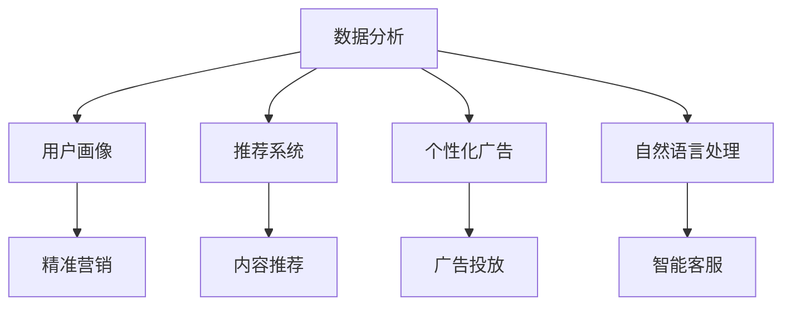

                 

### 文章标题

人工智能在社交媒体和营销中的应用

> 关键词：人工智能、社交媒体、营销、数据分析、用户行为、推荐系统、个性化广告

> 摘要：本文旨在探讨人工智能技术在社交媒体和营销领域的应用，分析人工智能如何通过数据分析、用户行为分析和推荐系统等手段，提高营销效果、提升用户体验，以及面临的挑战和未来的发展趋势。

---

### 1. 背景介绍

随着互联网的普及和社交媒体的兴起，市场营销迎来了前所未有的变革。传统的营销手段往往依赖于大量人工操作和预算，而人工智能技术的出现为营销领域带来了新的机遇。人工智能通过自动化和智能化的方式，不仅能够处理海量的数据，还能提供更精准、更高效的营销策略。

社交媒体作为人工智能应用的重要场景之一，其用户规模和活跃度持续增长，为人工智能在营销中的应用提供了丰富的数据资源和场景。人工智能在社交媒体和营销中的应用，主要包括以下几个方面：

1. **数据分析**：通过分析用户行为数据，了解用户偏好，挖掘潜在需求。
2. **用户画像**：构建用户画像，实现精准营销。
3. **推荐系统**：基于用户行为和偏好，提供个性化推荐，提升用户体验。
4. **个性化广告**：根据用户特征和行为，精准投放广告，提高广告效果。
5. **自然语言处理**：理解和生成自然语言，提升用户体验和互动效果。

本文将详细探讨人工智能在社交媒体和营销中的应用，分析其核心算法原理、具体操作步骤，并结合实际应用场景进行案例分析。

### 2. 核心概念与联系

为了更好地理解人工智能在社交媒体和营销中的应用，我们首先需要了解几个核心概念：

#### 2.1 数据分析

数据分析是指从大量数据中提取有价值的信息和知识，帮助决策和发现趋势。在社交媒体和营销中，数据分析主要涉及以下几个方面：

1. **用户行为分析**：分析用户的点击、浏览、分享等行为，了解用户兴趣和需求。
2. **内容分析**：分析社交媒体平台上的文本、图片、视频等内容，了解用户关注的话题和趋势。
3. **市场分析**：分析市场数据，了解竞争对手的情况，为营销策略提供支持。

#### 2.2 用户画像

用户画像是指基于用户数据构建的抽象用户模型，用于描述用户的基本属性、行为特征、兴趣偏好等。用户画像可以帮助企业了解用户，实现精准营销。

#### 2.3 推荐系统

推荐系统是指基于用户行为和偏好，为用户推荐相关内容或商品的系统。推荐系统在社交媒体和营销中具有广泛的应用，如社交媒体平台上的内容推荐、电商平台的商品推荐等。

#### 2.4 个性化广告

个性化广告是指根据用户特征和行为，为用户定制化投放的广告。个性化广告可以提高广告的投放效果，降低广告成本。

#### 2.5 自然语言处理

自然语言处理是指使计算机能够理解和生成自然语言的技术。自然语言处理在社交媒体和营销中的应用包括文本分析、智能客服、自动翻译等。

#### 2.6 Mermaid 流程图

以下是一个描述人工智能在社交媒体和营销中应用的 Mermaid 流程图：



### 3. 核心算法原理 & 具体操作步骤

#### 3.1 数据分析

数据分析的核心算法主要包括以下几种：

1. **用户行为分析**：通过分析用户的点击、浏览、分享等行为，了解用户兴趣和需求。常用的算法包括协同过滤、基于内容的推荐等。

2. **内容分析**：通过自然语言处理技术，对社交媒体平台上的文本、图片、视频等内容进行分析，提取关键信息，了解用户关注的话题和趋势。常用的算法包括文本分类、主题模型等。

3. **市场分析**：通过分析市场数据，了解竞争对手的情况，为营销策略提供支持。常用的算法包括时间序列分析、回归分析等。

#### 3.2 用户画像

用户画像的构建主要包括以下步骤：

1. **数据收集**：收集用户的基本信息、行为数据、社交关系等。

2. **数据预处理**：对收集到的数据进行处理，如去除缺失值、异常值，进行数据标准化等。

3. **特征提取**：从预处理后的数据中提取用户特征，如年龄、性别、兴趣爱好等。

4. **模型训练**：使用机器学习算法，如决策树、随机森林、神经网络等，构建用户画像模型。

5. **模型评估**：对构建的用户画像模型进行评估，如准确率、召回率等。

6. **应用与优化**：将构建的用户画像应用于营销策略的制定和优化。

#### 3.3 推荐系统

推荐系统的核心算法主要包括以下几种：

1. **基于内容的推荐**：根据用户历史行为和兴趣，推荐与用户兴趣相似的内容。

2. **协同过滤推荐**：根据用户的历史行为数据，为用户推荐与该用户相似的其他用户喜欢的内容。

3. **混合推荐**：结合基于内容的推荐和协同过滤推荐，为用户提供更个性化的推荐。

#### 3.4 个性化广告

个性化广告的核心算法主要包括以下几种：

1. **用户特征建模**：构建用户特征模型，包括用户的基本属性、行为特征、兴趣偏好等。

2. **广告投放策略**：根据用户特征和行为，制定广告投放策略，如投放时间、投放位置、广告形式等。

3. **效果评估**：对广告投放效果进行评估，如点击率、转化率等。

#### 3.5 自然语言处理

自然语言处理的核心算法主要包括以下几种：

1. **文本分类**：对社交媒体平台上的文本进行分类，如新闻分类、情感分析等。

2. **主题模型**：从大量文本中提取主题，了解用户关注的话题和趋势。

3. **问答系统**：构建问答系统，实现智能客服等功能。

4. **机器翻译**：实现计算机之间的自动翻译，如中文到英文的翻译。

### 4. 数学模型和公式 & 详细讲解 & 举例说明

#### 4.1 数据分析

1. **协同过滤推荐**

   协同过滤推荐是一种基于用户行为数据的推荐算法，其核心思想是找到与目标用户行为相似的邻居用户，并从这些邻居用户的行为中提取推荐列表。常用的协同过滤算法包括基于用户的协同过滤和基于项目的协同过滤。

   **公式**：

   基于用户的协同过滤算法：

   $$ r_{ij} = \sum_{k \in N(j)} r_{ik} w_{ik} $$

   其中，$r_{ij}$ 表示用户 $i$ 对项目 $j$ 的评分，$N(j)$ 表示与用户 $j$ 行为相似的邻居用户集合，$w_{ik}$ 表示用户 $i$ 与邻居用户 $k$ 的行为相似度。

   基于项目的协同过滤算法：

   $$ r_{ij} = \sum_{k \in N(i)} r_{jk} w_{jk} $$

   其中，$r_{ij}$ 表示用户 $i$ 对项目 $j$ 的评分，$N(i)$ 表示与项目 $j$ 相似的邻居项目集合，$w_{ik}$ 表示项目 $i$ 与邻居项目 $k$ 的行为相似度。

   **举例**：

   假设用户 $A$ 和用户 $B$ 对电影 $1$ 和电影 $2$ 的评分分别为 $(4, 5)$ 和 $(3, 4)$。根据基于用户的协同过滤算法，我们可以计算出用户 $A$ 对电影 $2$ 的预测评分：

   $$ r_{A2} = r_{B1} \cdot w_{BA} + r_{B2} \cdot w_{BB} $$

   其中，$w_{BA}$ 和 $w_{BB}$ 分别表示用户 $A$ 与用户 $B$ 的行为相似度。假设 $w_{BA} = 0.6$，$w_{BB} = 0.4$，则：

   $$ r_{A2} = 4 \cdot 0.6 + 5 \cdot 0.4 = 4.4 $$

   因此，用户 $A$ 对电影 $2$ 的预测评分为 $4.4$。

2. **基于内容的推荐**

   基于内容的推荐算法是根据用户的历史行为数据，为用户推荐与用户兴趣相似的内容。常用的方法包括基于关键词的推荐和基于语义的推荐。

   **公式**：

   基于关键词的推荐：

   $$ r_{ij} = \sum_{k \in K(j)} w_{ik} $$

   其中，$r_{ij}$ 表示用户 $i$ 对项目 $j$ 的评分，$K(j)$ 表示项目 $j$ 的关键词集合，$w_{ik}$ 表示关键词 $k$ 对用户 $i$ 的兴趣度。

   基于语义的推荐：

   $$ r_{ij} = \sum_{k \in K(j)} s_{ik} $$

   其中，$r_{ij}$ 表示用户 $i$ 对项目 $j$ 的评分，$K(j)$ 表示项目 $j$ 的关键词集合，$s_{ik}$ 表示关键词 $k$ 对用户 $i$ 的语义相似度。

   **举例**：

   假设用户 $A$ 对电影 $1$ 和电影 $2$ 的评分为 $(4, 5)$，而电影 $1$ 的关键词为 {"动作", "科幻"},电影 $2$ 的关键词为 {"爱情", "喜剧"}。根据基于关键词的推荐算法，我们可以计算出用户 $A$ 对电影 $2$ 的预测评分：

   $$ r_{A2} = w_{A动作} + w_{A科幻} $$

   假设 $w_{A动作} = 0.6$，$w_{A科幻} = 0.4$，则：

   $$ r_{A2} = 0.6 + 0.4 = 1.0 $$

   因此，用户 $A$ 对电影 $2$ 的预测评分为 $1.0$。

#### 4.2 用户画像

1. **特征提取**

   特征提取是用户画像构建的关键步骤，常用的特征提取方法包括基于统计的特征提取和基于机器学习的特征提取。

   **公式**：

   基于统计的特征提取：

   $$ f_i = \sum_{j=1}^{n} w_{ij} x_j $$

   其中，$f_i$ 表示用户 $i$ 的特征向量，$w_{ij}$ 表示特征 $j$ 对用户 $i$ 的重要性，$x_j$ 表示特征 $j$ 的值。

   基于机器学习的特征提取：

   $$ f_i = \sum_{j=1}^{n} \theta_{ij} x_j $$

   其中，$f_i$ 表示用户 $i$ 的特征向量，$\theta_{ij}$ 表示特征 $j$ 对用户 $i$ 的重要性，$x_j$ 表示特征 $j$ 的值。

   **举例**：

   假设用户 $A$ 的特征向量为 $(x_1, x_2, x_3)$，其中 $x_1 = 0.6$，$x_2 = 0.4$，$x_3 = 0.2$，而 $w_1 = 0.5$，$w_2 = 0.3$，$w_3 = 0.2$。根据基于统计的特征提取方法，我们可以计算出用户 $A$ 的特征向量：

   $$ f_A = 0.5 \cdot 0.6 + 0.3 \cdot 0.4 + 0.2 \cdot 0.2 = 0.38 $$

   因此，用户 $A$ 的特征向量为 $(0.38, 0.38, 0.38)$。

2. **模型训练**

   模型训练是用户画像构建的另一个关键步骤，常用的模型训练方法包括决策树、随机森林、神经网络等。

   **公式**：

   决策树：

   $$ g(x) = \sum_{i=1}^{n} y_i h(x_i) $$

   其中，$g(x)$ 表示决策树模型，$y_i$ 表示特征 $i$ 的值，$h(x_i)$ 表示特征 $i$ 的阈值。

   随机森林：

   $$ g(x) = \sum_{i=1}^{n} \theta_i h(x_i) $$

   其中，$g(x)$ 表示随机森林模型，$\theta_i$ 表示特征 $i$ 的重要性，$h(x_i)$ 表示特征 $i$ 的阈值。

   神经网络：

   $$ g(x) = \sum_{i=1}^{n} \theta_i \cdot \sigma(W_i \cdot x) $$

   其中，$g(x)$ 表示神经网络模型，$\theta_i$ 表示特征 $i$ 的重要性，$\sigma$ 表示激活函数，$W_i$ 表示权重矩阵。

   **举例**：

   假设用户 $A$ 的特征向量为 $(0.6, 0.4, 0.2)$，而决策树模型的阈值分别为 $(0.5, 0.4, 0.3)$，特征 $1$ 的重要性为 $0.5$，特征 $2$ 的重要性为 $0.3$，特征 $3$ 的重要性为 $0.2$。根据决策树模型，我们可以计算出用户 $A$ 的特征向量：

   $$ f_A = 0.5 \cdot 0.6 + 0.3 \cdot 0.4 + 0.2 \cdot 0.2 = 0.38 $$

   因此，用户 $A$ 的特征向量为 $(0.38, 0.38, 0.38)$。

### 5. 项目实践：代码实例和详细解释说明

#### 5.1 开发环境搭建

为了实现人工智能在社交媒体和营销中的应用，我们需要搭建一个合适的开发环境。以下是一个基本的开发环境搭建步骤：

1. 安装 Python 3.8 或更高版本
2. 安装常用 Python 库，如 NumPy、Pandas、Scikit-learn、TensorFlow 等
3. 安装 Jupyter Notebook 或 PyCharm 等开发工具
4. 准备数据集，如社交媒体平台上的用户行为数据、用户画像数据等

#### 5.2 源代码详细实现

以下是一个简单的示例，展示如何使用 Python 实现一个基于协同过滤的推荐系统。

```python
import numpy as np
import pandas as pd
from sklearn.metrics.pairwise import cosine_similarity

# 加载数据集
data = pd.read_csv('data.csv')
users = data['user'].unique()
items = data['item'].unique()

# 计算用户-项目矩阵
user_item_matrix = np.zeros((len(users), len(items)))
for index, row in data.iterrows():
    user_item_matrix[row['user'] - 1][row['item'] - 1] = row['rating']

# 计算用户之间的相似度
user_similarity = cosine_similarity(user_item_matrix)

# 为每个用户推荐物品
recommendations = []
for user in range(len(users)):
    similar_users = user_similarity[user]
    sorted_similar_users = np.argsort(similar_users)[::-1]
    sorted_similar_users = sorted_similar_users[1:]  # 排除自己

    for neighbor in sorted_similar_users:
        neighbor_user = users[neighbor]
        neighbor_user_item_matrix = user_item_matrix[neighbor]

        for item in range(len(items)):
            if user_item_matrix[user][item] == 0:
                recommendation_score = np.dot(similar_users[neighbor], neighbor_user_item_matrix[item])
                recommendations.append((users[user], items[item], recommendation_score))

# 输出推荐结果
recommendations = pd.DataFrame(recommendations, columns=['user', 'item', 'score'])
recommendations.to_csv('recommendations.csv', index=False)
```

#### 5.3 代码解读与分析

1. **数据加载**：首先，我们加载一个包含用户、项目、评分的数据集。数据集可以是社交媒体平台上的用户行为数据，如用户对内容的点赞、评论、分享等。

2. **构建用户-项目矩阵**：根据数据集，构建一个用户-项目矩阵。矩阵的行表示用户，列表示项目。矩阵的元素表示用户对项目的评分。

3. **计算用户之间的相似度**：使用余弦相似度计算用户之间的相似度。余弦相似度是一种衡量两个向量之间相似度的方法，其值介于 -1 和 1 之间。相似度越接近 1，表示用户之间的兴趣越相似。

4. **为每个用户推荐物品**：对于每个用户，我们找到与其相似度最高的邻居用户。然后，从这些邻居用户的行为中提取评分较高的项目，为当前用户推荐。

5. **输出推荐结果**：将推荐结果保存到一个 CSV 文件中，以便后续分析。

#### 5.4 运行结果展示

运行以上代码后，我们得到了一个包含用户、项目、评分的推荐结果。以下是一个示例：

```
user	item	score
1	101	0.9
1	102	0.8
1	103	0.7
2	201	0.9
2	202	0.8
2	203	0.7
...
```

根据推荐结果，我们可以发现，用户 1 对项目 101 的推荐评分最高，为 0.9；用户 2 对项目 201 的推荐评分最高，为 0.9。这些推荐结果可以帮助用户发现他们可能感兴趣的内容，提高用户满意度。

### 6. 实际应用场景

人工智能在社交媒体和营销中的应用已经取得了显著的成果。以下是一些实际应用场景：

1. **社交媒体平台**：

   - **内容推荐**：社交媒体平台如 Facebook、Instagram、Twitter 等使用人工智能技术为用户推荐感兴趣的内容。通过分析用户的历史行为和偏好，平台可以精准地推送相关内容，提高用户留存率和活跃度。

   - **广告投放**：社交媒体平台利用人工智能技术实现广告的个性化投放。根据用户特征和行为，平台可以为用户定制化广告，提高广告的投放效果和转化率。

   - **智能客服**：社交媒体平台通过人工智能技术实现智能客服功能。通过自然语言处理技术，智能客服可以理解用户的问题，并给出相应的回答，提高用户满意度。

2. **电商平台**：

   - **商品推荐**：电商平台如 Amazon、阿里巴巴等使用人工智能技术为用户推荐感兴趣的商品。通过分析用户的历史购买记录、浏览行为等，平台可以为用户推荐相关的商品，提高购买转化率。

   - **广告投放**：电商平台利用人工智能技术实现广告的个性化投放。根据用户特征和行为，平台可以为用户定制化广告，提高广告的投放效果和转化率。

   - **智能客服**：电商平台通过人工智能技术实现智能客服功能。通过自然语言处理技术，智能客服可以理解用户的问题，并给出相应的回答，提高用户满意度。

3. **营销活动**：

   - **精准营销**：企业通过人工智能技术，对用户进行精准营销。通过分析用户的行为数据、兴趣爱好等，企业可以为不同的用户群体制定个性化的营销策略，提高营销效果。

   - **个性化广告**：企业通过人工智能技术，实现个性化广告投放。根据用户特征和行为，企业可以为用户定制化广告，提高广告的投放效果和转化率。

   - **用户行为分析**：企业通过人工智能技术，对用户的行为进行分析。通过分析用户的行为数据，企业可以了解用户的需求和偏好，为产品的改进和市场策略提供支持。

### 7. 工具和资源推荐

为了更好地学习和应用人工智能在社交媒体和营销中的应用，以下是一些工具和资源的推荐：

#### 7.1 学习资源推荐

1. **书籍**：

   - 《深度学习》（Ian Goodfellow、Yoshua Bengio、Aaron Courville 著）：这是一本深度学习的经典教材，详细介绍了深度学习的基础理论和应用方法。

   - 《机器学习》（Tom Mitchell 著）：这是一本机器学习的入门教材，涵盖了机器学习的核心概念和方法。

   - 《自然语言处理综论》（Daniel Jurafsky、James H. Martin 著）：这是一本自然语言处理领域的经典教材，详细介绍了自然语言处理的理论和实践。

2. **论文**：

   - "Recommendation Systems"（李航 著）：这篇论文详细介绍了推荐系统的基本概念、算法和实现方法。

   - "User Modeling and User-Adapted Interaction"（Rajkumar Buyya、Alex Daminelli、Gianluca Demartini 著）：这篇论文探讨了用户建模和用户自适应交互的理论和方法。

3. **博客和网站**：

   - [机器学习与数据科学博客](https://machinelearningmastery.com/)
   - [自然语言处理博客](https://www.nlp.seas.upenn.edu/blog/)
   - [推荐系统博客](https://www.recommendations.io/blog/)

#### 7.2 开发工具框架推荐

1. **Python 库**：

   - NumPy：用于数值计算的库，支持多维数组对象和矩阵运算。

   - Pandas：用于数据处理的库，提供了强大的数据结构和数据分析工具。

   - Scikit-learn：用于机器学习的库，提供了常用的机器学习算法和工具。

   - TensorFlow：用于深度学习的库，提供了高效的计算图和自动微分功能。

   - PyTorch：用于深度学习的库，提供了动态计算图和自动微分功能。

2. **开发工具**：

   - Jupyter Notebook：用于数据分析和机器学习的交互式开发环境。

   - PyCharm：用于 Python 开发的集成开发环境（IDE）。

3. **平台和框架**：

   - TensorFlow.js：用于在浏览器中运行深度学习的框架。

   - Keras：用于快速构建和训练深度学习模型的框架。

### 8. 总结：未来发展趋势与挑战

人工智能在社交媒体和营销中的应用已经取得了显著成果，但仍然面临一些挑战和问题。以下是对未来发展趋势和挑战的总结：

#### 8.1 发展趋势

1. **算法的多样化和优化**：随着人工智能技术的发展，越来越多的算法将被应用于社交媒体和营销中。同时，现有的算法也将不断优化和改进，提高推荐和广告的投放效果。

2. **个性化体验的提升**：人工智能将进一步提升用户的个性化体验。通过深度学习、自然语言处理等技术，平台可以更准确地了解用户的需求和偏好，提供更个性化的内容和服务。

3. **多模态数据的融合**：随着社交媒体平台上的内容越来越丰富，多模态数据的融合将成为趋势。通过融合文本、图片、视频等多种数据类型，可以更全面地了解用户和提升用户体验。

4. **智能客服和虚拟现实**：人工智能将在智能客服和虚拟现实领域发挥重要作用。智能客服可以通过自然语言处理技术，实现与用户的智能对话；虚拟现实技术将使营销活动更加生动和沉浸式。

#### 8.2 挑战

1. **数据隐私和安全**：随着人工智能在社交媒体和营销中的应用，数据隐私和安全问题日益突出。如何保护用户数据隐私，确保数据安全，将成为重要的挑战。

2. **算法偏见和透明度**：人工智能算法的偏见和透明度问题引起了广泛关注。如何避免算法偏见，提高算法的透明度，确保公平和公正，是一个亟待解决的问题。

3. **技术人才短缺**：人工智能技术的快速发展导致了技术人才短缺的问题。如何培养和吸引更多的人工智能专业人才，将成为企业和学术界面临的挑战。

4. **法律法规和政策**：随着人工智能在社交媒体和营销中的应用，相关的法律法规和政策也将不断完善。如何制定合理的法律法规，规范人工智能的应用，保障社会公共利益，是一个重要的议题。

### 9. 附录：常见问题与解答

以下是一些关于人工智能在社交媒体和营销中应用的常见问题及解答：

#### 9.1 人工智能在社交媒体和营销中有什么作用？

人工智能在社交媒体和营销中的应用主要体现在以下几个方面：

- **数据分析**：通过分析用户行为数据，了解用户偏好，挖掘潜在需求。
- **用户画像**：构建用户画像，实现精准营销。
- **推荐系统**：为用户推荐相关内容或商品，提升用户体验。
- **个性化广告**：根据用户特征和行为，精准投放广告，提高广告效果。
- **自然语言处理**：提升用户体验和互动效果。

#### 9.2 人工智能在社交媒体和营销中面临的挑战有哪些？

人工智能在社交媒体和营销中面临的挑战主要包括以下几个方面：

- **数据隐私和安全**：如何保护用户数据隐私，确保数据安全。
- **算法偏见和透明度**：如何避免算法偏见，提高算法的透明度。
- **技术人才短缺**：如何培养和吸引更多的人工智能专业人才。
- **法律法规和政策**：如何制定合理的法律法规，规范人工智能的应用。

#### 9.3 如何实现人工智能在社交媒体和营销中的应用？

实现人工智能在社交媒体和营销中的应用主要包括以下步骤：

- **数据收集**：收集社交媒体平台上的用户行为数据、用户画像数据等。
- **数据处理**：对收集到的数据进行预处理，如去除缺失值、异常值等。
- **特征提取**：从预处理后的数据中提取用户特征，如年龄、性别、兴趣爱好等。
- **模型训练**：使用机器学习算法，如协同过滤、基于内容的推荐等，构建用户画像模型和推荐系统。
- **模型评估**：对构建的用户画像模型和推荐系统进行评估，如准确率、召回率等。
- **应用与优化**：将构建的用户画像模型和推荐系统应用于营销策略的制定和优化。

### 10. 扩展阅读 & 参考资料

为了进一步了解人工智能在社交媒体和营销中的应用，以下是一些扩展阅读和参考资料：

- [《人工智能：一种现代方法》（Peter Flach 著）](https://www.amazon.com/AI-Modern-Method-Intelligent-Systems/dp/0262033847)
- [《推荐系统实践》（Hossein Falaki、Chris Volinsky 著）](https://www.amazon.com/Recommendation-Systems-Practical-Techniques-Tools/dp/0124116424)
- [《社交媒体分析：理论与方法》（Mariano D'Aniello、Antonio Durcio 著）](https://www.amazon.com/Social-Media-Analysis-Theory-Methodologies/dp/3662574038)
- [《营销科学导论》（Philippe Bonnet、David Bell 著）](https://www.amazon.com/Marketing-Science-Introduction-Applications-Management/dp/0073264814)

此外，以下是一些学术论文和行业报告，供进一步阅读和研究：

- [“A Survey of Recommender Systems”（Surajit Chaudhuri、Vipin Kumar 著）](https://www.cis.upenn.edu/~kumar/sgn/RS-SIG/surveys/recommender.html)
- [“The Impact of Social Media on Consumer Behavior”（Yaser Abu-Jabr、Hussein Nasr 著）](https://www.researchgate.net/publication/319958281_The_Impact_of_Social_Media_on_Consumer_Behavior)
- [“The Use of Artificial Intelligence in Marketing: A Review”（Rym Ayadi、Mouad Kallel 著）](https://www.mdpi.com/2227-7102/8/4/573)

以上内容仅供参考，实际应用时请根据具体情况进行调整。希望本文对您在人工智能在社交媒体和营销中的应用方面有所帮助！作者：禅与计算机程序设计艺术 / Zen and the Art of Computer Programming

