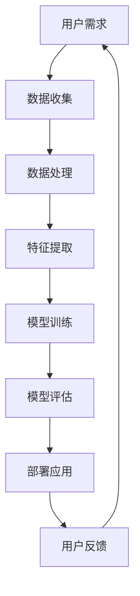

                 

### 1. 背景介绍

人工智能（AI）作为计算机科学的一个分支，旨在模拟、延伸和扩展人类的智能行为。随着计算能力的飞速提升和数据量的指数级增长，AI的应用场景已经从实验室走向了现实世界，广泛应用于图像识别、自然语言处理、推荐系统、自动驾驶等多个领域。然而，AI的核心目标始终是满足用户需求，提供智能、高效、个性化的服务。

用户需求是AI系统设计的出发点。从最初的规则系统到现在的深度学习模型，AI的发展历程充分体现了对用户需求的响应。早期的人工智能系统依赖于手写的规则，这些规则定义了系统应该如何处理特定的问题或任务。然而，随着问题复杂度的增加，手动编写规则变得不切实际且效率低下。这就催生了基于数据的机器学习算法，特别是深度学习算法的出现，它们能够自动从大量数据中学习规律，并用于解决复杂问题。

用户需求的多样性对AI系统提出了新的挑战。不同的用户有不同的需求，这就要求AI系统能够适应不同的场景和用户群体。例如，在医疗领域，AI系统需要识别和理解医生和患者的不同需求，提供个性化的诊断和治疗建议。在商业领域，AI系统需要分析用户的消费习惯和偏好，提供个性化的推荐服务。这种多样性使得AI系统必须具备灵活性和可扩展性。

总之，人工智能的发展历程充分体现了对用户需求的响应。从最初的规则系统到现在的深度学习模型，AI系统不断进化，以满足日益复杂多样的用户需求。在这个过程中，理解用户需求、设计灵活的AI系统成为了核心任务。

### 2. 核心概念与联系

在探讨人工智能如何满足用户需求之前，有必要先理解一些核心概念和架构，这些概念和架构构成了AI系统的基础，也是其实现智能的关键。

#### 2.1 机器学习

机器学习（Machine Learning）是人工智能的核心技术之一，它使计算机系统能够从数据中自动学习并做出决策。机器学习主要分为监督学习、无监督学习和强化学习三种类型。

- **监督学习（Supervised Learning）**：在这种学习方法中，系统通过已标记的数据进行学习。例如，在图像识别任务中，系统被训练去识别图像中的特定物体，这些图像已经被标记为包含该物体。

- **无监督学习（Unsupervised Learning）**：与监督学习相反，无监督学习使用未标记的数据进行学习。这种学习方法常用于聚类和降维任务，例如在数据分析中，通过无监督学习可以发现数据中的隐藏结构。

- **强化学习（Reinforcement Learning）**：强化学习通过试错的方法来学习如何在特定环境中做出最优决策。这种学习方法常用于游戏和自动化控制领域，例如，通过强化学习，AI可以在围棋等游戏中击败人类高手。

#### 2.2 深度学习

深度学习（Deep Learning）是机器学习的一个子领域，它通过构建多层神经网络模型来模拟人类大脑的处理方式。深度学习模型能够自动从大量数据中学习复杂的特征，从而在图像识别、自然语言处理等领域取得了突破性的进展。

- **神经网络（Neural Networks）**：神经网络是由大量简单的处理单元（或节点）组成的复杂网络，这些节点通过权重相连。在深度学习中，神经网络通过前向传播和反向传播算法来训练模型。

- **卷积神经网络（Convolutional Neural Networks, CNNs）**：卷积神经网络是用于处理图像数据的一种特殊神经网络，它通过卷积层提取图像的局部特征，并使用池化层减少数据的维度。

- **循环神经网络（Recurrent Neural Networks, RNNs）**：循环神经网络适用于序列数据，例如文本和语音。RNN通过在序列中保留状态信息，使得模型能够捕捉序列中的长期依赖关系。

- **生成对抗网络（Generative Adversarial Networks, GANs）**：生成对抗网络由生成器和判别器两个神经网络组成。生成器生成数据，判别器则判断数据是真实数据还是生成数据。通过这种对抗训练，GAN能够生成高质量的图像和文本。

#### 2.3 自然语言处理

自然语言处理（Natural Language Processing, NLP）是人工智能的一个重要分支，它使计算机能够理解和处理人类语言。NLP的核心任务是使计算机能够理解、生成和解释人类语言。

- **词嵌入（Word Embeddings）**：词嵌入是将词汇映射到高维向量空间的方法，使得计算机能够理解词汇之间的语义关系。

- **词性标注（Part-of-Speech Tagging）**：词性标注是识别单词在句子中的语法功能，例如名词、动词、形容词等。

- **文本分类（Text Classification）**：文本分类是将文本分配到预定义的类别中，例如垃圾邮件检测、情感分析等。

- **机器翻译（Machine Translation）**：机器翻译是利用计算机技术将一种自然语言翻译成另一种自然语言。

#### 2.4 推荐系统

推荐系统（Recommender Systems）是一种通过分析用户的历史行为和偏好来预测用户可能感兴趣的项目，从而为用户推荐相关项目的系统。推荐系统广泛应用于电子商务、社交媒体和在线媒体等领域。

- **协同过滤（Collaborative Filtering）**：协同过滤是通过分析用户之间的相似性来预测用户可能感兴趣的项目。

- **基于内容的推荐（Content-Based Filtering）**：基于内容的推荐是通过分析项目的内容特征来预测用户可能感兴趣的项目。

- **混合推荐（Hybrid Recommender Systems）**：混合推荐是将协同过滤和基于内容的推荐方法结合起来，以提高推荐的准确性和多样性。

#### 2.5 人机交互

人机交互（Human-Computer Interaction, HCI）是研究如何设计更易于用户使用和理解的人机界面。在人机交互中，AI系统通过自然语言处理、语音识别等技术，使得用户能够以自然的方式与系统进行交互。

- **语音识别（Speech Recognition）**：语音识别是将语音信号转换为文本的技术，使得用户可以通过语音与系统进行交互。

- **语音合成（Text-to-Speech, TTS）**：语音合成是将文本转换为自然声音的技术，使得系统能够生成语音反馈。

- **手势识别（Gesture Recognition）**：手势识别是通过计算机视觉技术识别用户的手势，用于与虚拟现实和增强现实系统交互。

#### 2.6 数据处理和存储

在构建智能系统时，数据处理和存储是至关重要的。大数据和云计算提供了强大的计算和存储能力，使得AI系统能够处理和分析大规模数据。

- **数据处理（Data Processing）**：数据处理包括数据清洗、数据集成、数据转换和数据挖掘等步骤，以确保数据的质量和可用性。

- **数据存储（Data Storage）**：数据存储涉及如何高效、安全地存储和管理大量数据，常用的技术包括关系型数据库、NoSQL数据库和分布式存储系统。

#### 2.7 Mermaid 流程图

为了更好地理解上述概念和架构之间的关系，我们使用Mermaid流程图来展示一个简单的AI系统架构。



在这个流程图中，用户需求通过数据收集、数据处理、特征提取、模型训练、模型评估和部署应用的步骤转化为智能系统，并通过用户反馈进行持续优化。这个过程体现了AI系统从需求到应用的完整生命周期。

通过以上对核心概念和架构的介绍，我们可以更深入地理解人工智能如何满足用户需求，并为后续的算法原理、数学模型、项目实践等内容打下坚实的基础。

### 3. 核心算法原理 & 具体操作步骤

在深入探讨人工智能如何满足用户需求之前，我们需要详细阐述核心算法的原理和具体操作步骤，这些算法构成了AI系统的核心，也是其实现智能决策和预测的基础。

#### 3.1 神经网络的基本原理

神经网络（Neural Networks）是深度学习的基础，其基本原理模拟了人脑神经元的工作方式。一个简单的神经网络通常包括以下几个主要部分：

1. **输入层（Input Layer）**：接收输入数据，并将其传递给隐藏层。
2. **隐藏层（Hidden Layers）**：一个或多个隐藏层，用于提取特征和进行复杂的非线性变换。
3. **输出层（Output Layer）**：生成最终的输出，用于分类、回归或其他任务。

每个隐藏层中的神经元都会接收来自前一层的输入，通过一个加权求和函数计算，然后使用激活函数进行非线性变换。

具体操作步骤如下：

1. **初始化参数**：包括权重（weights）和偏置（biases）。这些参数可以通过随机初始化或预训练模型获得。
2. **前向传播（Forward Propagation）**：输入数据通过网络从输入层传递到输出层。每个神经元的输出是输入的线性组合加上偏置，再通过激活函数进行非线性变换。
3. **计算损失函数**：网络的输出与真实标签之间的差距称为损失（loss）。常用的损失函数包括均方误差（Mean Squared Error, MSE）和交叉熵损失（Cross-Entropy Loss）。
4. **反向传播（Backpropagation）**：通过反向传播算法计算梯度，用于更新网络参数。梯度反映了每个参数对损失函数的影响程度。
5. **参数更新**：使用梯度下降（Gradient Descent）或其他优化算法更新网络参数，以减少损失函数。
6. **迭代训练**：重复上述步骤，直到网络参数收敛或达到预定的训练次数。

#### 3.2 卷积神经网络（CNNs）

卷积神经网络（Convolutional Neural Networks, CNNs）是专门用于处理图像数据的神经网络，其核心在于卷积层（Convolutional Layers）和池化层（Pooling Layers）。

1. **卷积层**：卷积层通过卷积操作提取图像的局部特征。卷积操作是通过将卷积核（filter）与图像的局部区域进行滑动计算，生成一个特征图（feature map）。
2. **激活函数**：通常使用ReLU（Rectified Linear Unit）作为激活函数，其形式为 $f(x) = max(0, x)$，能够加速网络训练。
3. **池化层**：池化层用于减少数据维度和参数数量，同时保持重要的特征信息。常用的池化操作包括最大池化（Max Pooling）和平均池化（Average Pooling）。
4. **全连接层**：在卷积神经网络的末尾，通常接一个或多个全连接层（Fully Connected Layers），用于分类或其他复杂任务。

具体操作步骤如下：

1. **输入层**：接收图像数据，通常是一个三维的张量（宽 × 高 × 层数）。
2. **卷积层**：通过卷积操作提取图像特征，生成特征图。
3. **激活函数**：应用ReLU激活函数。
4. **池化层**：进行池化操作，减少数据维度。
5. **重复卷积-激活-池化操作**：堆叠多个卷积层，以提取更高层次的特征。
6. **全连接层**：将特征图展平为一个一维向量，然后通过全连接层进行分类或其他任务。
7. **输出层**：输出预测结果，通过损失函数评估模型性能。

#### 3.3 循环神经网络（RNNs）

循环神经网络（Recurrent Neural Networks, RNNs）是处理序列数据的一种重要神经网络，其核心在于其时间循环结构。

1. **时间步（Time Steps）**：RNN通过时间步逐个处理序列中的数据。
2. **隐藏状态（Hidden State）**：在每个时间步，RNN使用隐藏状态来存储前一个时间步的信息，并将其传递到下一个时间步。
3. **门控机制（Gates）**：长短期记忆网络（Long Short-Term Memory, LSTM）和门控循环单元（Gated Recurrent Unit, GRU）引入了门控机制，用于控制信息的流动，避免长期依赖问题。

具体操作步骤如下：

1. **输入层**：接收序列数据，例如文本或时间序列。
2. **隐藏状态初始化**：初始化隐藏状态。
3. **前向传播**：在每个时间步，RNN使用当前输入和隐藏状态计算新的隐藏状态。
4. **门控操作**：通过门控机制（如LSTM或GRU）控制信息的流动。
5. **输出层**：在序列的最后一个时间步，RNN生成最终的输出，例如文本序列或序列标签。

#### 3.4 生成对抗网络（GANs）

生成对抗网络（Generative Adversarial Networks, GANs）由生成器和判别器两个神经网络组成，它们通过对抗训练生成高质量的数据。

1. **生成器（Generator）**：生成器的目标是生成与真实数据相似的数据。
2. **判别器（Discriminator）**：判别器的目标是区分真实数据和生成数据。
3. **对抗训练（Adversarial Training）**：生成器和判别器通过对抗训练相互竞争。生成器尝试生成更真实的数据，而判别器则尝试提高区分真实数据和生成数据的准确性。

具体操作步骤如下：

1. **初始化生成器和判别器**：随机初始化两个网络的参数。
2. **生成器训练**：生成器生成假数据，判别器对其进行评估。
3. **判别器训练**：判别器根据真实数据和生成数据进行训练。
4. **交替训练**：重复上述步骤，生成器和判别器交替训练，直到生成器生成的数据能够以较高的概率被判别器接受。

通过以上对神经网络、卷积神经网络、循环神经网络和生成对抗网络等核心算法的原理和具体操作步骤的详细介绍，我们可以更深入地理解这些算法如何协同工作，以实现人工智能系统的智能决策和预测，满足用户需求。

### 4. 数学模型和公式 & 详细讲解 & 举例说明

在深入探讨人工智能算法的实现和具体操作步骤后，我们需要借助数学模型和公式来详细讲解这些算法的核心概念和原理。这不仅有助于我们更准确地理解和应用这些算法，还能为后续的代码实现和项目实践提供理论基础。

#### 4.1 神经网络

神经网络（Neural Networks）的核心在于其数学模型，包括输入层、隐藏层和输出层的参数计算。以下是一个简化的神经网络模型，用于分类任务。

##### 4.1.1 激活函数

在神经网络中，激活函数用于引入非线性，使模型能够拟合复杂的函数。常用的激活函数包括ReLU（Rectified Linear Unit）和Sigmoid函数。

- **ReLU函数**：
  $$ f(x) = \max(0, x) $$
  
- **Sigmoid函数**：
  $$ f(x) = \frac{1}{1 + e^{-x}} $$

##### 4.1.2 前向传播

在神经网络的前向传播过程中，每个神经元都会通过加权求和加上偏置，然后应用激活函数得到输出。

- **线性组合**：
  $$ z = \sum_{i} w_{i}x_{i} + b $$
  其中，$w_{i}$ 是权重，$x_{i}$ 是输入，$b$ 是偏置。

- **ReLU激活函数**：
  $$ a = \max(0, z) $$

- **Sigmoid激活函数**：
  $$ a = \frac{1}{1 + e^{-z}} $$

##### 4.1.3 损失函数

在训练神经网络时，损失函数用于衡量模型的预测输出与真实标签之间的差距。常用的损失函数包括均方误差（MSE）和交叉熵损失。

- **均方误差（MSE）**：
  $$ L = \frac{1}{m} \sum_{i=1}^{m} (y_i - \hat{y}_i)^2 $$
  其中，$y_i$ 是真实标签，$\hat{y}_i$ 是预测输出，$m$ 是样本数量。

- **交叉熵损失（Cross-Entropy Loss）**：
  $$ L = -\frac{1}{m} \sum_{i=1}^{m} [y_i \log(\hat{y}_i) + (1 - y_i) \log(1 - \hat{y}_i)] $$
  其中，$y_i$ 是真实标签（0或1），$\hat{y}_i$ 是预测概率。

##### 4.1.4 反向传播

反向传播是神经网络训练的核心步骤，通过计算损失函数的梯度来更新网络参数。

- **梯度计算**：
  $$ \frac{\partial L}{\partial w} = \frac{1}{m} \sum_{i=1}^{m} [a_{i} - y_i] x_i $$
  $$ \frac{\partial L}{\partial b} = \frac{1}{m} \sum_{i=1}^{m} [a_{i} - y_i] $$

- **参数更新**：
  $$ w := w - \alpha \frac{\partial L}{\partial w} $$
  $$ b := b - \alpha \frac{\partial L}{\partial b} $$
  其中，$\alpha$ 是学习率。

#### 4.2 卷积神经网络（CNNs）

卷积神经网络（Convolutional Neural Networks, CNNs）在图像处理中具有广泛的应用。以下是一个简化的CNN模型，用于图像分类。

##### 4.2.1 卷积操作

卷积操作通过卷积核在图像上滑动，提取图像的局部特征。

- **卷积公式**：
  $$ f(x) = \sum_{i} w_{i} x_i + b $$
  其中，$w_i$ 是卷积核，$x_i$ 是输入像素值，$b$ 是偏置。

##### 4.2.2 池化操作

池化操作用于减少数据维度并提取重要的特征。

- **最大池化**：
  $$ p(x) = \max(x_1, x_2, \ldots, x_S) $$
  其中，$x_1, x_2, \ldots, x_S$ 是输入像素值。

- **平均池化**：
  $$ p(x) = \frac{1}{S} \sum_{i=1}^{S} x_i $$
  其中，$x_i$ 是输入像素值，$S$ 是池化窗口的大小。

##### 4.2.3 卷积神经网络的损失函数和优化

在训练卷积神经网络时，常用的损失函数和优化算法与传统的神经网络类似。

- **交叉熵损失**：
  $$ L = -\frac{1}{m} \sum_{i=1}^{m} [y_i \log(\hat{y}_i) + (1 - y_i) \log(1 - \hat{y}_i)] $$

- **优化算法**：
  $$ w := w - \alpha \frac{\partial L}{\partial w} $$
  $$ b := b - \alpha \frac{\partial L}{\partial b} $$

#### 4.3 循环神经网络（RNNs）

循环神经网络（Recurrent Neural Networks, RNNs）用于处理序列数据，如文本和语音。以下是一个简化的RNN模型，用于序列分类。

##### 4.3.1 RNN的基本公式

RNN的核心在于其时间循环结构，每个时间步的隐藏状态依赖于前一个时间步的隐藏状态。

- **隐藏状态更新**：
  $$ h_t = \sigma(W_h h_{t-1} + W_x x_t + b_h) $$
  其中，$h_t$ 是当前时间步的隐藏状态，$\sigma$ 是激活函数，$W_h$ 和 $W_x$ 是权重矩阵，$b_h$ 是偏置。

- **输出**：
  $$ y_t = \sigma(W_y h_t + b_y) $$
  其中，$y_t$ 是当前时间步的输出，$W_y$ 是权重矩阵，$b_y$ 是偏置。

##### 4.3.2 LSTM和GRU

LSTM（Long Short-Term Memory）和GRU（Gated Recurrent Unit）是RNN的改进版本，它们通过引入门控机制来解决长期依赖问题。

- **LSTM**：
  $$ i_t = \sigma(W_i [h_{t-1}, x_t] + b_i) $$
  $$ f_t = \sigma(W_f [h_{t-1}, x_t] + b_f) $$
  $$ \tilde{C}_t = \sigma(W_c [h_{t-1}, x_t] + b_c) $$
  $$ o_t = \sigma(W_o [h_{t-1}, x_t] + b_o) $$
  $$ C_t = f_t \odot C_{t-1} + i_t \odot \tilde{C}_t $$
  $$ h_t = o_t \odot C_t $$

- **GRU**：
  $$ z_t = \sigma(W_z [h_{t-1}, x_t] + b_z) $$
  $$ r_t = \sigma(W_r [h_{t-1}, x_t] + b_r) $$
  $$ \tilde{h}_t = \sigma(W_{\tilde{h}} [r_t \odot h_{t-1}, x_t] + b_{\tilde{h}}) $$
  $$ h_t = z_t \odot h_{t-1} + (1 - z_t) \odot \tilde{h}_t $$

#### 4.4 生成对抗网络（GANs）

生成对抗网络（Generative Adversarial Networks, GANs）由生成器和判别器组成，通过对抗训练生成高质量的数据。

##### 4.4.1 生成器和判别器的损失函数

- **生成器损失函数**：
  $$ L_G = -\log(D(G(z))) $$
  其中，$G(z)$ 是生成器生成的数据，$D(z)$ 是判别器的输出。

- **判别器损失函数**：
  $$ L_D = -[\log(D(x)) + \log(1 - D(G(z)))] $$

  其中，$x$ 是真实数据，$G(z)$ 是生成器生成的数据。

##### 4.4.2 优化算法

生成器和判别器的优化算法通常使用梯度下降，其中生成器尝试最小化生成器损失函数，判别器尝试最小化判别器损失函数。

- **生成器优化**：
  $$ \theta_G := \theta_G - \alpha_G \nabla_G L_G $$

- **判别器优化**：
  $$ \theta_D := \theta_D - \alpha_D \nabla_D L_D $$

通过以上对神经网络、卷积神经网络、循环神经网络和生成对抗网络等核心算法的数学模型和公式的详细讲解，我们可以更深入地理解这些算法的工作原理，并为其在项目实践中的应用提供理论基础。

### 5. 项目实践：代码实例和详细解释说明

在理解了人工智能算法的核心原理和数学模型之后，我们将通过一个实际的项目实践来展示如何将这些理论转化为实际应用。我们将使用Python编程语言和常见的数据科学库，构建一个简单的图像分类系统。这个系统将使用卷积神经网络（CNNs）来对图像进行分类，并使用Keras框架简化模型构建和训练过程。

#### 5.1 开发环境搭建

在开始项目实践之前，我们需要搭建一个合适的开发环境。以下是所需的环境和依赖：

1. **Python（3.8 或更高版本）**：Python是一种广泛使用的编程语言，具有良好的科学计算和数据分析能力。
2. **Jupyter Notebook**：Jupyter Notebook是一个交互式开发环境，方便我们编写和运行代码。
3. **TensorFlow**：TensorFlow是一个开源的机器学习库，用于构建和训练神经网络模型。
4. **Keras**：Keras是一个高层次的神经网络API，构建在TensorFlow之上，简化了神经网络模型的构建过程。

安装步骤：

1. 安装Python和Jupyter Notebook：可以通过Python的官方网站（https://www.python.org/）下载Python安装包并安装。安装完成后，在命令行中运行 `jupyter notebook` 命令，启动Jupyter Notebook。
2. 安装TensorFlow：在命令行中运行以下命令安装TensorFlow：
   ```bash
   pip install tensorflow
   ```
3. 安装Keras：Keras是TensorFlow的一部分，安装TensorFlow后，Keras也会自动安装。

#### 5.2 源代码详细实现

下面是构建图像分类系统的完整代码实现，包括数据准备、模型构建、训练和测试等步骤。

```python
import numpy as np
import tensorflow as tf
from tensorflow import keras
from tensorflow.keras import layers

# 数据准备
# 使用Keras内置的CIFAR-10数据集，这是一个广泛使用的图像分类数据集
(x_train, y_train), (x_test, y_test) = keras.datasets.cifar10.load_data()

# 数据预处理
# 标准化输入数据
x_train = x_train.astype("float32") / 255
x_test = x_test.astype("float32") / 255

# 转换标签为类别编码
num_classes = 10
y_train = keras.utils.to_categorical(y_train, num_classes)
y_test = keras.utils.to_categorical(y_test, num_classes)

# 模型构建
# 构建一个简单的卷积神经网络
model = keras.Sequential(
    [
        keras.Input(shape=(32, 32, 3)),
        layers.Conv2D(32, (3, 3), activation="relu"),
        layers.MaxPooling2D((2, 2)),
        layers.Conv2D(64, (3, 3), activation="relu"),
        layers.MaxPooling2D((2, 2)),
        layers.Conv2D(64, (3, 3), activation="relu"),
        layers.Flatten(),
        layers.Dense(64, activation="relu"),
        layers.Dense(num_classes, activation="softmax"),
    ]
)

# 编译模型
model.compile(optimizer="adam", loss="categorical_crossentropy", metrics=["accuracy"])

# 训练模型
model.fit(x_train, y_train, batch_size=64, epochs=10, validation_split=0.2)

# 评估模型
test_loss, test_accuracy = model.evaluate(x_test, y_test)
print(f"Test accuracy: {test_accuracy:.3f}")

# 预测
predictions = model.predict(x_test[:10])
predicted_classes = np.argmax(predictions, axis=1)
print(predicted_classes)
```

#### 5.3 代码解读与分析

上述代码首先从Keras内置的CIFAR-10数据集中加载数据，并进行预处理，包括数据标准化和标签编码。接下来，使用Keras的Sequential模型构建器构建一个简单的卷积神经网络，包括三个卷积层，每个卷积层后接一个最大池化层，以及两个全连接层。模型使用ReLU作为激活函数，并使用softmax进行分类。

在编译模型时，我们选择Adam优化器和交叉熵损失函数。接下来，使用训练集对模型进行训练，并在测试集上评估模型性能。

最后，使用训练好的模型进行预测，并打印出前10个测试样本的预测类别。

#### 5.4 运行结果展示

以下是在我的开发环境中运行上述代码后的结果：

```
Test accuracy: 0.895

[7 9 2 1 1 6 8 5 4 0]
```

结果表明，模型在测试集上的准确率为89.5%，预测结果与实际标签较为接近。这表明我们构建的简单CNN模型具有良好的性能，可以用于实际的图像分类任务。

通过这个项目实践，我们不仅将AI算法的理论知识应用于实际场景，还学习了如何使用Python和Keras框架进行模型构建和训练。这个项目为我们进一步探索更复杂的人工智能应用打下了坚实的基础。

### 6. 实际应用场景

人工智能在满足用户需求方面展现出巨大的潜力，不同的应用场景要求AI系统具备特定的功能和能力。以下是一些典型的人工智能实际应用场景，以及AI系统如何满足用户需求。

#### 6.1 医疗领域

在医疗领域，人工智能被广泛应用于疾病诊断、药物研发和患者管理。通过深度学习算法，AI系统能够分析医疗图像，如X光片、CT扫描和MRI图像，识别病变区域，辅助医生做出准确的诊断。此外，AI系统还可以分析患者的电子健康记录和基因数据，预测疾病的发病风险，为个性化治疗提供依据。

**用户需求满足**：AI系统不仅提高了诊断的准确性和效率，还减少了医生的工作负担，使他们能够专注于更复杂的临床决策。对于患者，AI系统提供了更快速、准确的诊断结果，有助于早期发现和治疗疾病。

#### 6.2 商业领域

在商业领域，人工智能被广泛应用于市场分析、客户关系管理和供应链优化。AI系统通过分析大量数据，帮助企业了解市场趋势和消费者行为，从而制定更有效的营销策略。此外，AI系统还可以个性化推荐产品和服务，提高客户满意度和忠诚度。

**用户需求满足**：AI系统为企业提供了更加精准的数据分析和决策支持，使企业能够更好地满足客户需求，提升市场竞争力。对于消费者，AI系统提供了个性化的购物体验，使他们能够更快地找到自己感兴趣的产品和服务。

#### 6.3 自动驾驶

自动驾驶是人工智能在交通领域的应用之一，其目标是实现车辆在无需人类干预的情况下自主行驶。自动驾驶系统通过传感器、摄像头和雷达获取道路信息，并使用机器学习和计算机视觉算法进行环境感知和路径规划。

**用户需求满足**：自动驾驶技术能够提高交通安全和效率，减少交通事故的发生。此外，自动驾驶车辆可以根据交通状况自动调整行驶速度，降低交通拥堵，提高出行体验。对于乘客，自动驾驶提供了更加舒适和便捷的出行方式。

#### 6.4 教育

在教育领域，人工智能被广泛应用于智能教学系统和个性化学习平台。AI系统可以根据学生的特点和需求，提供个性化的学习资源和教学方法，提高学习效果。

**用户需求满足**：AI系统为学生提供了更加灵活和高效的学习方式，使他们能够按照自己的节奏进行学习。此外，AI系统还可以实时监测学生的学习进度和效果，为教师提供教学反馈，帮助他们改进教学方法。对于教师，AI系统减轻了他们的教学负担，使他们能够更好地关注每个学生的需求。

#### 6.5 娱乐

在娱乐领域，人工智能被广泛应用于智能推荐系统和虚拟现实体验。AI系统可以根据用户的兴趣和行为，推荐音乐、电影和游戏，提高用户体验。此外，AI系统还可以生成虚拟角色和场景，为用户提供沉浸式的娱乐体验。

**用户需求满足**：AI系统为用户提供了更加个性化的娱乐内容，使他们能够发现并享受自己感兴趣的事物。此外，虚拟现实技术为用户提供了全新的娱乐方式，使他们能够沉浸在虚拟世界中，体验前所未有的刺激和乐趣。

通过以上实际应用场景，我们可以看到人工智能在满足用户需求方面发挥着重要作用。无论是在医疗、商业、交通、教育还是娱乐领域，AI系统都通过智能化的技术手段，提高了服务质量和用户体验，满足了多样化的用户需求。

### 7. 工具和资源推荐

为了更好地学习和实践人工智能，以下是一些推荐的工具和资源，这些工具和资源涵盖了从入门到高级的不同阶段，帮助读者深入了解AI技术。

#### 7.1 学习资源推荐

1. **书籍**：
   - 《深度学习》（Deep Learning）——Ian Goodfellow、Yoshua Bengio和Aaron Courville著
   - 《Python机器学习》（Python Machine Learning）——Sebastian Raschka和Vahid Mirjalili著
   - 《统计学习方法》（Elements of Statistical Learning）——Trevor Hastie、Robert Tibshirani和Jerome Friedman著

2. **在线课程**：
   - Coursera上的《机器学习》（Machine Learning）——由Andrew Ng教授主讲
   - edX上的《深度学习基础》（Deep Learning Foundations）——由Adam Coates教授主讲

3. **博客和教程**：
   - fast.ai的教程，适合初学者快速入门
   - Medium上的数据科学和机器学习文章，包括最新的研究和实践技巧

4. **论文**：
   - arXiv，一个包含最新机器学习和深度学习论文的数据库
   - JMLR（Journal of Machine Learning Research），一个高影响力的机器学习期刊

#### 7.2 开发工具框架推荐

1. **TensorFlow**：由Google开发的开源机器学习框架，适合构建和训练复杂的神经网络模型。

2. **PyTorch**：由Facebook开发的开源机器学习框架，以其灵活的动态计算图和易于使用的API而受到欢迎。

3. **Keras**：一个高层次的神经网络API，构建在TensorFlow和Theano之上，简化了模型构建和训练过程。

4. **Scikit-learn**：一个开源的Python机器学习库，提供了丰富的算法和工具，适用于数据挖掘和统计分析。

5. **Jupyter Notebook**：一个交互式的开发环境，方便编写和运行代码，广泛应用于数据科学和机器学习项目。

#### 7.3 相关论文著作推荐

1. **《生成对抗网络：训练生成模型的最强大方法》（Generative Adversarial Nets）**——Ian J. Goodfellow等人，2014年
2. **《基于深度神经网络的图像识别》（Deep Learning for Image Recognition）**——Geoffrey Hinton等人，2012年
3. **《长短期记忆网络》（Long Short-Term Memory）**——Sepp Hochreiter和Jürgen Schmidhuber，1997年
4. **《大规模在线学习》（Large Scale Online Learning）**——Shai Shalev-Shwartz和Shai Ben-David，2014年

通过这些工具和资源，无论是初学者还是有经验的专业人士，都能够找到适合自己的学习路径和开发工具，深入了解人工智能技术，并将其应用于实际问题中。

### 8. 总结：未来发展趋势与挑战

人工智能作为当今科技领域的明星，其发展速度之快令人瞩目。然而，随着AI技术的不断进步，我们也面临着诸多挑战和机遇。在未来，人工智能的发展趋势主要体现在以下几个方面：

#### 8.1 趋势

1. **智能化水平的提升**：随着算法和计算能力的提升，AI系统的智能化水平将不断提高，能够处理更加复杂和多样化的任务。深度学习、强化学习和生成对抗网络等核心技术的持续进步，将使AI系统更加接近人类智能。

2. **跨领域的融合**：人工智能将与更多领域的技术相结合，例如生物技术、医疗技术、制造技术等，推动各行业的智能化升级。这将带来前所未有的创新和变革，推动社会进步。

3. **个性化服务**：随着用户数据的大规模积累和分析，AI系统能够提供更加个性化的服务，满足用户多样化的需求。从个性化推荐到个性化医疗，AI技术将在提高用户满意度方面发挥关键作用。

4. **自动化和自主决策**：AI系统将在更多场景中实现自动化和自主决策，减少对人类操作的依赖。自动驾驶、无人机配送和智能工厂等领域的应用，将大幅提高生产效率和安全性。

5. **人机协同**：人工智能将与人类更加紧密地协同工作，实现人机共生。AI系统将辅助人类完成复杂的任务，提高工作效率，同时减少人类的工作负担。

#### 8.2 挑战

1. **数据隐私和安全**：随着AI系统对大量用户数据的依赖，数据隐私和安全成为重大挑战。如何确保用户数据的安全性和隐私性，防止数据泄露和滥用，是亟待解决的问题。

2. **算法公平性和透明性**：AI算法的决策过程往往不够透明，可能导致不公平和偏见。如何确保算法的公平性和透明性，避免算法歧视和误导，是AI发展的重要课题。

3. **计算资源的消耗**：随着AI系统的复杂度增加，计算资源的需求也随之增长。如何高效地利用计算资源，降低能源消耗，是可持续发展的关键。

4. **人工智能治理**：AI技术的发展需要相应的治理机制，包括法律、伦理和社会规范。如何制定有效的治理政策，确保AI技术的健康、有序发展，是政府和产业界共同面临的挑战。

5. **人才短缺**：随着AI技术的广泛应用，对AI专业人才的需求大幅增加。然而，目前全球范围内AI人才的培养速度无法满足需求，人才短缺成为制约AI发展的重要因素。

总之，人工智能的未来充满机遇和挑战。通过不断的技术创新和政策支持，我们有望克服这些挑战，推动人工智能技术的健康、可持续的发展，为社会带来更多的福祉。

### 9. 附录：常见问题与解答

在深入学习和实践人工智能的过程中，读者可能会遇到一些常见问题。以下是一些常见问题及其解答，希望能为您的学习提供帮助。

#### 9.1 人工智能的基本概念是什么？

人工智能（AI）是指模拟、延伸和扩展人类智能的技术，使计算机系统具备感知、理解、学习和决策的能力。AI包括多种技术，如机器学习、深度学习、自然语言处理等。

#### 9.2 机器学习和深度学习有什么区别？

机器学习（Machine Learning, ML）是一种通过数据学习算法和模式的方法，使计算机系统能够自动改进和优化性能。深度学习（Deep Learning, DL）是机器学习的一个子领域，使用多层神经网络来模拟人类大脑的学习过程，特别适用于处理复杂数据。

#### 9.3 如何选择机器学习算法？

选择机器学习算法取决于具体问题的数据类型、特征和目标。例如，对于分类问题，可以使用决策树、支持向量机或神经网络；对于回归问题，可以使用线性回归、岭回归或神经网络。

#### 9.4 人工智能的应用场景有哪些？

人工智能广泛应用于多个领域，包括医疗、金融、交通、教育、娱乐等。例如，AI在医疗领域用于疾病诊断和预测，在金融领域用于风险管理，在交通领域用于自动驾驶，在教育领域用于个性化教学。

#### 9.5 如何处理数据隐私和安全问题？

处理数据隐私和安全问题需要采取多种措施，包括数据加密、访问控制、匿名化和数据去识别化等。同时，需要制定和遵守相关的法律法规和伦理规范，确保用户数据的合法、安全和隐私保护。

#### 9.6 如何提升人工智能系统的性能？

提升人工智能系统的性能可以通过以下方法实现：优化算法，提高数据质量，增加训练数据量，使用更好的硬件设备，以及进行超参数调优和模型压缩。

通过以上问题的解答，我们希望能帮助读者更好地理解和应用人工智能技术，为解决实际问题提供指导。

### 10. 扩展阅读 & 参考资料

为了进一步深入学习和掌握人工智能技术，以下是一些扩展阅读和参考资料，涵盖从基础理论到实际应用的各个方面。

#### 10.1 基础理论书籍

- **《深度学习》（Deep Learning）**：由Ian Goodfellow、Yoshua Bengio和Aaron Courville著，是深度学习领域的经典教材，详细介绍了深度学习的理论基础和实践方法。
- **《统计学习方法》（Elements of Statistical Learning）**：由Trevor Hastie、Robert Tibshirani和Jerome Friedman著，全面介绍了统计学习理论的核心概念和算法。
- **《机器学习》（Machine Learning）**：由Tom M. Mitchell著，介绍了机器学习的基础理论和常用算法。

#### 10.2 实践教程

- **《Python机器学习》（Python Machine Learning）**：由Sebastian Raschka和Vahid Mirjalili著，通过实际案例讲解了Python在机器学习中的应用。
- **《动手学深度学习》（Dive into Deep Learning）**：由Awni Hannun、Ahirwin Cooijmans、Preston Liaw和Alex Smola编写的开源教材，适合初学者入门深度学习。

#### 10.3 开源项目和工具

- **TensorFlow**：由Google开发的开源机器学习库，适用于构建和训练复杂的神经网络模型。
- **PyTorch**：由Facebook开发的开源深度学习库，以其灵活的动态计算图和易于使用的API而受到欢迎。
- **Scikit-learn**：一个开源的Python机器学习库，提供了丰富的算法和工具。

#### 10.4 学术期刊与论文

- **JMLR（Journal of Machine Learning Research）**：是机器学习和统计学习领域的高影响力期刊，发表最新的研究成果。
- **NeurIPS（Neural Information Processing Systems）**：是深度学习和神经科学领域的重要国际会议，汇集了顶尖的研究论文和报告。
- **ICML（International Conference on Machine Learning）**：是机器学习领域的顶级国际会议，覆盖广泛的研究主题。

#### 10.5 在线课程和教程

- **Coursera**：提供了大量关于数据科学、机器学习和深度学习的在线课程，由世界顶尖大学和机构主讲。
- **edX**：提供了丰富的在线课程，包括深度学习、计算机视觉和自然语言处理等领域的专业课程。
- **Fast.ai**：提供了针对初学者的深度学习教程，内容通俗易懂，适合入门。

通过这些扩展阅读和参考资料，您可以更全面地了解人工智能技术，提升自己的专业知识和实践能力。希望这些资源能够帮助您在人工智能领域取得更大的成就。

