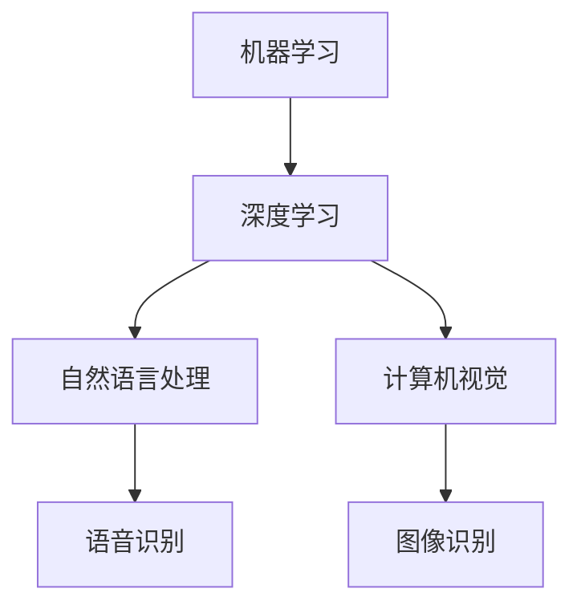

                 

### 背景介绍

#### 人工智能的发展历程

人工智能（Artificial Intelligence，简称AI）作为一门集计算机科学、心理学、认知科学和统计学等多学科于一体的交叉学科，其发展历程可以追溯到上个世纪中期。1950年，英国数学家、逻辑学家艾伦·图灵提出了著名的图灵测试，这被视为人工智能发展的开端。图灵测试旨在通过机器与人类之间的交互来判断机器是否具备智能。

随后的几十年里，人工智能经历了数次起伏，从早期的符号主义、知识表示和推理，到基于规则的系统，再到基于统计学和神经网络的机器学习方法，人工智能逐渐摆脱了早期“硅智人”的形象，开始逐步展现出强大的数据处理和分析能力。

进入21世纪，随着大数据、云计算、物联网和深度学习等技术的发展，人工智能迎来了新的高潮。深度学习作为机器学习的一个分支，以其在图像识别、语音识别、自然语言处理等领域的突破性成果，使得人工智能的应用场景不断扩展，成为当今科技界的热门话题。

#### 人工智能的现状

目前，人工智能已经广泛应用于各个行业，如医疗、金融、交通、教育、制造业等。其中，图像识别、语音识别和自然语言处理是人工智能最为成熟的领域。例如，自动驾驶技术正在逐步从实验室走向实际应用，AI助手如Siri、Alexa和Google Assistant等已经成为人们日常生活中不可或缺的一部分。

然而，人工智能的发展也面临着诸多挑战，如数据隐私、算法公平性、伦理问题等。此外，人工智能的发展速度之快也引发了关于其可能对就业市场、社会结构带来的影响的讨论。

#### 人工智能的重要性

人工智能不仅改变了传统的生产方式，提高了效率，还极大地拓展了人类的能力边界。例如，通过AI，我们能够实现更加精准的疾病诊断、更加高效的金融服务、更加智能的城市管理，甚至通过AI辅助人类探索宇宙的奥秘。

在未来的发展中，人工智能有望成为推动社会进步的重要力量。因此，深入探讨人工智能的未来发展方向，对于把握科技发展的脉搏，引导人工智能健康、可持续发展具有重要意义。

### 核心概念与联系

#### 定义

人工智能的核心概念包括：

1. **机器学习**：一种让计算机从数据中学习规律、模式的能力。
2. **深度学习**：一种基于多层神经网络的机器学习方法。
3. **自然语言处理**：让计算机能够理解、生成和处理自然语言的技术。
4. **计算机视觉**：使计算机能够“看”和理解图像的技术。

#### 关系图

为了更好地理解这些概念之间的关系，我们可以使用Mermaid流程图进行展示。



#### 解释

- **机器学习**是人工智能的基础，它涵盖了多种学习方法，包括监督学习、无监督学习和强化学习。
- **深度学习**是机器学习的一个重要分支，它通过构建多层神经网络，模拟人脑的工作方式，从而实现更复杂的模式识别和预测。
- **自然语言处理**和**计算机视觉**则是深度学习的两大应用领域。自然语言处理使计算机能够理解和生成自然语言，而计算机视觉使计算机能够理解和解释视觉信息。

通过以上核心概念的介绍和关系图的展示，我们可以更清晰地理解人工智能的各个组成部分及其相互关系。这也为后续讨论人工智能的具体算法原理和应用场景打下了基础。

### 核心算法原理 & 具体操作步骤

#### 深度学习算法原理

深度学习是人工智能中一个非常重要的领域，其核心思想是通过构建多层神经网络来模拟人类大脑的学习过程。以下是深度学习算法的基本原理：

1. **前向传播（Forward Propagation）**：输入数据通过网络的各个层，每个神经元将输入与权重相乘并经过激活函数处理后传递到下一层。
2. **反向传播（Back Propagation）**：通过计算损失函数的梯度，将误差反向传播回网络，从而更新权重和偏置，以减少误差。
3. **激活函数（Activation Function）**：如ReLU（Rectified Linear Unit）、Sigmoid、Tanh等，用于引入非线性特性，使得网络能够学习复杂函数。

#### 自然语言处理算法原理

自然语言处理（NLP）是深度学习在语言领域的应用，其核心算法包括：

1. **词向量（Word Vectors）**：通过将单词映射到高维空间中的向量，使得具有相似意义的词在空间中靠近。
2. **循环神经网络（RNN）**：用于处理序列数据，如文本。RNN通过内部状态记忆来捕捉序列中的时间依赖关系。
3. **长短时记忆网络（LSTM）**：RNN的变体，能够更好地处理长序列数据，避免梯度消失和爆炸问题。
4. **Transformer模型**：基于自注意力机制，能够在处理长文本时保持高效和并行化，是当前NLP任务中最常用的模型之一。

#### 计算机视觉算法原理

计算机视觉（CV）是深度学习在图像处理领域的应用，其核心算法包括：

1. **卷积神经网络（CNN）**：通过卷积操作和池化操作，从图像中提取特征。
2. **生成对抗网络（GAN）**：通过生成器和判别器的对抗训练，能够生成逼真的图像。
3. **目标检测（Object Detection）**：用于识别图像中的多个目标物体，常用的模型有Faster R-CNN、SSD和YOLO等。
4. **语义分割（Semantic Segmentation）**：将图像中的每个像素分类到不同的类别，常用的模型有FCN和U-Net等。

#### 深度学习算法的应用步骤

1. **数据预处理**：包括数据清洗、数据归一化、数据增强等，以准备训练数据。
2. **模型设计**：根据任务需求设计网络结构，选择合适的损失函数和优化器。
3. **模型训练**：通过前向传播和反向传播训练模型，不断更新权重和偏置。
4. **模型评估**：使用验证集或测试集评估模型性能，选择最优模型。
5. **模型部署**：将训练好的模型部署到生产环境中，进行实际应用。

通过以上对核心算法原理和具体操作步骤的详细讲解，我们可以更好地理解深度学习、自然语言处理和计算机视觉在人工智能中的应用。这些算法不仅为人工智能的发展提供了强大的技术支持，也为各个领域的应用创新提供了新的可能性。

### 数学模型和公式 & 详细讲解 & 举例说明

#### 深度学习中的数学基础

深度学习算法中涉及大量的数学公式和模型，以下是其中几个重要的数学模型和公式的详细讲解与举例。

##### 梯度下降算法

梯度下降是一种优化算法，用于调整神经网络中的权重和偏置，以减少损失函数的值。以下是梯度下降算法的核心公式：

$$
w_{\text{new}} = w_{\text{old}} - \alpha \cdot \nabla W
$$

其中，$w_{\text{old}}$ 表示当前权重，$w_{\text{new}}$ 表示更新后的权重，$\alpha$ 是学习率，$\nabla W$ 是权重矩阵的梯度。

**举例说明**：

假设我们有一个简单的一层神经网络，其中只有一个权重 $w$，损失函数为 $L = (y - \sigma(w \cdot x))^2$，其中 $y$ 是实际输出，$\sigma$ 是激活函数（如Sigmoid函数）。

如果当前权重 $w = 2$，输入 $x = 1$，实际输出 $y = 0.5$，损失函数值为 $L = 0.25$。我们希望通过梯度下降算法更新权重，使得损失函数值最小。

首先，我们需要计算损失函数关于权重 $w$ 的梯度：

$$
\nabla W = \frac{\partial L}{\partial w} = 2 \cdot (y - \sigma(w \cdot x))
$$

代入具体值，得到：

$$
\nabla W = 2 \cdot (0.5 - \sigma(2 \cdot 1)) = 2 \cdot (0.5 - 0.693) = -0.193
$$

然后，使用梯度下降公式更新权重：

$$
w_{\text{new}} = w_{\text{old}} - \alpha \cdot \nabla W
$$

假设学习率 $\alpha = 0.1$，代入计算得到：

$$
w_{\text{new}} = 2 - 0.1 \cdot (-0.193) = 2 + 0.0193 = 2.0193
$$

这样，我们通过一次梯度下降迭代，更新了权重 $w$。

##### 反向传播算法

反向传播是深度学习训练过程中用于计算梯度的重要算法，其核心思想是将误差从输出层反向传播到网络的各个层，从而更新权重和偏置。以下是反向传播算法的基本步骤：

1. **前向传播**：计算输入层到隐藏层、隐藏层到输出层的输出值。
2. **计算输出层误差**：计算实际输出与预测输出之间的误差。
3. **反向传播误差**：从输出层开始，逐层计算隐藏层和输入层的误差。
4. **更新权重和偏置**：根据误差的梯度，使用梯度下降算法更新权重和偏置。

**举例说明**：

假设我们有一个简单的多层神经网络，包含两个隐藏层，输出层有一个神经元。输入 $x$ 和目标 $y$ 已知，我们需要通过反向传播计算隐藏层1和隐藏层2的误差，并更新权重和偏置。

首先，进行前向传播，计算输出层的输出值：

$$
\hat{y} = \sigma(w_3 \cdot z_2)
$$

其中，$z_2 = w_3 \cdot a_2$，$a_2$ 是隐藏层2的输出，$w_3$ 是隐藏层2到输出层的权重。

然后，计算输出层的误差：

$$
e = y - \hat{y}
$$

接下来，计算隐藏层2的误差：

$$
e_2 = \frac{d\sigma(z_2)}{dz_2} \cdot (w_3 \cdot e)
$$

其中，$\frac{d\sigma(z_2)}{dz_2}$ 是激活函数的导数。

最后，计算隐藏层1的误差：

$$
e_1 = \frac{d\sigma(z_1)}{dz_1} \cdot (w_2 \cdot e_2)
$$

使用上述误差值，可以更新隐藏层1和隐藏层2的权重和偏置。具体公式如下：

$$
w_2_{\text{new}} = w_2_{\text{old}} - \alpha \cdot \frac{\partial L}{\partial w_2} = w_2_{\text{old}} - \alpha \cdot (a_1^T \cdot e_2)
$$

$$
b_2_{\text{new}} = b_2_{\text{old}} - \alpha \cdot \frac{\partial L}{\partial b_2} = b_2_{\text{old}} - \alpha \cdot e_2
$$

$$
w_3_{\text{new}} = w_3_{\text{old}} - \alpha \cdot \frac{\partial L}{\partial w_3} = w_3_{\text{old}} - \alpha \cdot (a_2^T \cdot e)
$$

$$
b_3_{\text{new}} = b_3_{\text{old}} - \alpha \cdot \frac{\partial L}{\partial b_3} = b_3_{\text{old}} - \alpha \cdot e
$$

通过以上反向传播和权重更新过程，我们可以逐步减小网络的误差，提高模型的预测能力。

##### 神经网络的损失函数

在深度学习中，常用的损失函数包括均方误差（MSE）、交叉熵（Cross-Entropy）等。

**均方误差（MSE）**：

$$
L = \frac{1}{2} \sum_{i=1}^{n} (y_i - \hat{y}_i)^2
$$

其中，$y_i$ 是实际输出，$\hat{y}_i$ 是预测输出，$n$ 是样本数量。

**交叉熵（Cross-Entropy）**：

$$
L = - \sum_{i=1}^{n} y_i \log(\hat{y}_i)
$$

其中，$y_i$ 是实际输出（通常为概率分布），$\hat{y}_i$ 是预测输出。

**举例说明**：

假设我们有一个二分类问题，实际输出为 $y = [0, 1, 0, 0]$，预测输出为 $\hat{y} = [0.3, 0.6, 0.4, 0.1]$。

对于均方误差（MSE），损失函数计算如下：

$$
L = \frac{1}{2} \sum_{i=1}^{4} (y_i - \hat{y}_i)^2 = \frac{1}{2} \cdot (0 - 0.3)^2 + (1 - 0.6)^2 + (0 - 0.4)^2 + (0 - 0.1)^2 = 0.0225 + 0.16 + 0.16 + 0.01 = 0.3525
$$

对于交叉熵（Cross-Entropy），损失函数计算如下：

$$
L = - \sum_{i=1}^{4} y_i \log(\hat{y}_i) = - (0 \cdot \log(0.3) + 1 \cdot \log(0.6) + 0 \cdot \log(0.4) + 0 \cdot \log(0.1)) = - (\log(0.6) + 0 + 0 + 0) = - \log(0.6) \approx 0.5108
$$

通过以上数学模型和公式的讲解与举例，我们可以更好地理解深度学习中的关键数学原理，为深入研究和应用深度学习技术打下坚实的基础。

### 项目实践：代码实例和详细解释说明

为了更好地理解深度学习的实际应用，我们将在本节中通过一个简单的项目实例，介绍如何搭建一个基于深度学习的图像分类模型。我们将使用Python语言和TensorFlow框架来实现这一项目。

#### 开发环境搭建

首先，我们需要搭建一个合适的开发环境。以下是所需的软件和库：

1. **Python（版本3.6及以上）**
2. **TensorFlow（版本2.0及以上）**
3. **Numpy**
4. **Matplotlib**

您可以通过以下命令安装所需的库：

```bash
pip install python==3.8 tensorflow==2.7 numpy matplotlib
```

#### 数据集准备

我们使用著名的CIFAR-10数据集进行图像分类，该数据集包含60000张32x32彩色图像，分为10个类别，每个类别6000张图像。

1. **下载数据集**：可以使用TensorFlow内置的数据集加载器。

```python
import tensorflow as tf

(x_train, y_train), (x_test, y_test) = tf.keras.datasets.cifar10.load_data()
```

2. **数据预处理**：对图像进行归一化处理，并将标签转换为独热编码。

```python
import numpy as np

# 数据归一化
x_train = x_train.astype(np.float32) / 255.0
x_test = x_test.astype(np.float32) / 255.0

# 转换标签为独热编码
num_classes = 10
y_train = tf.keras.utils.to_categorical(y_train, num_classes)
y_test = tf.keras.utils.to_categorical(y_test, num_classes)
```

#### 模型搭建

接下来，我们搭建一个简单的卷积神经网络（CNN）模型。

```python
from tensorflow.keras.models import Sequential
from tensorflow.keras.layers import Conv2D, MaxPooling2D, Flatten, Dense, Dropout

model = Sequential([
    Conv2D(32, (3, 3), activation='relu', input_shape=(32, 32, 3)),
    MaxPooling2D((2, 2)),
    Conv2D(64, (3, 3), activation='relu'),
    MaxPooling2D((2, 2)),
    Conv2D(64, (3, 3), activation='relu'),
    Flatten(),
    Dense(64, activation='relu'),
    Dropout(0.5),
    Dense(num_classes, activation='softmax')
])
```

1. **卷积层（Conv2D）**：用于提取图像特征，包含32个和64个卷积核。
2. **池化层（MaxPooling2D）**：用于降低特征图的维度，提高计算效率。
3. **全连接层（Dense）**：用于分类，包含64个神经元和10个神经元。
4. **Dropout层**：用于防止过拟合。

#### 模型编译

我们需要编译模型，指定优化器、损失函数和评估指标。

```python
model.compile(optimizer='adam',
              loss='categorical_crossentropy',
              metrics=['accuracy'])
```

#### 模型训练

接下来，我们使用训练集训练模型。

```python
model.fit(x_train, y_train, epochs=20, batch_size=64, validation_split=0.2)
```

1. **epochs**：训练轮次。
2. **batch_size**：每个批次的样本数量。
3. **validation_split**：用于验证集的比例。

#### 评估模型

训练完成后，我们对测试集进行评估。

```python
test_loss, test_accuracy = model.evaluate(x_test, y_test)
print(f"Test accuracy: {test_accuracy:.3f}")
```

#### 预测新样本

最后，我们使用训练好的模型对新的图像进行预测。

```python
new_image = x_test[0]
predicted_label = model.predict(new_image.reshape(1, 32, 32, 3))
predicted_class = np.argmax(predicted_label)

print(f"Predicted class: {predicted_class}")
```

通过以上代码实例，我们搭建并训练了一个简单的深度学习模型，用于对图像进行分类。这一过程不仅展示了深度学习的基本步骤，也为实际项目开发提供了宝贵的经验。

### 实际应用场景

人工智能在各个行业中的应用已经日益广泛，以下列举几个典型的应用场景，详细讨论人工智能在这些场景中的具体应用和成果。

#### 医疗领域

人工智能在医疗领域的应用主要包括疾病预测、诊断辅助、药物研发和医疗管理等方面。

1. **疾病预测**：通过分析患者的病历、基因数据和生活习惯等，人工智能可以预测患者患某种疾病的可能性。例如，IBM的Watson for Oncology系统通过分析海量医学文献，为医生提供个性化的治疗方案。
   
2. **诊断辅助**：人工智能在医学影像分析方面具有显著优势。通过深度学习算法，计算机可以辅助医生进行X光、CT和MRI等影像的自动诊断，提高诊断的准确性和效率。谷歌的DeepMind在眼科疾病的诊断上取得了突破性成果，准确率达到了与专业医生相当的水平。

3. **药物研发**：人工智能在药物研发中用于发现新的药物候选分子、预测药物与蛋白质的结合亲和力等。例如，英特尔的研究团队利用深度学习技术，成功预测了多种药物的新作用机制，加速了药物研发过程。

4. **医疗管理**：人工智能可以帮助医院进行患者流量管理、资源分配和手术排程等。例如，微软的Azure Health Bot可以自动回复患者的问题，减轻医院的工作压力。

#### 金融领域

人工智能在金融领域的应用主要集中在风险控制、欺诈检测、智能投顾和自动化交易等方面。

1. **风险控制**：人工智能可以通过分析大量历史交易数据，识别潜在的信用风险和市场风险。例如，银行可以使用机器学习算法进行贷款审批和风险评估，提高信贷业务的安全性。

2. **欺诈检测**：人工智能可以实时监控交易活动，识别异常行为，从而有效防范欺诈行为。例如，Visa使用AI技术进行交易监控，每年能够阻止数十亿美元欺诈损失。

3. **智能投顾**：智能投顾通过分析用户的风险偏好和财务状况，为用户推荐最优的投资组合。例如，Wealthfront和Betterment等平台利用人工智能技术，为用户提供个性化的投资建议。

4. **自动化交易**：高频交易和算法交易依赖于人工智能技术，通过分析市场数据，实现自动化交易决策。例如，摩根士丹利利用人工智能技术，实现了全球范围内的自动化交易，大幅提高了交易效率。

#### 交通领域

人工智能在交通领域的应用主要包括自动驾驶、交通管理和智能物流等方面。

1. **自动驾驶**：自动驾驶技术利用人工智能技术，通过感知环境、规划路径和决策控制，实现无人驾驶。例如，特斯拉的Autopilot系统和谷歌的Waymo项目都是自动驾驶技术的代表，它们已经在实际道路上进行了广泛的测试和部署。

2. **交通管理**：人工智能可以帮助交通管理部门进行交通流量监控、事故预警和智能信号控制。例如，纽约市的智能交通系统利用AI技术，优化交通信号灯的时序，减少了交通拥堵。

3. **智能物流**：人工智能在物流领域用于路径优化、货物追踪和仓库管理。例如，亚马逊使用人工智能技术，优化仓库中的货架摆放和拣选路径，提高了物流效率。

#### 教育领域

人工智能在教育领域的应用主要包括智能辅导、学习分析和个性化教学等方面。

1. **智能辅导**：人工智能可以通过在线学习平台，为学习者提供个性化的辅导服务。例如，Coursera和edX等在线教育平台利用人工智能技术，根据学习者的进度和需求，推荐相应的课程和学习资源。

2. **学习分析**：人工智能可以分析学生的学习行为和数据，识别学习障碍和提升机会。例如，Knewton公司的学习分析系统，通过分析学生的学习数据，为教师提供个性化的教学建议。

3. **个性化教学**：人工智能可以帮助教师根据学生的特点，设计个性化的教学方案。例如，DreamBox Education的数学学习平台，通过智能算法，为每个学生提供适合其能力水平和学习进度的练习。

#### 制造业领域

人工智能在制造业中的应用主要包括生产优化、质量检测和设备维护等方面。

1. **生产优化**：人工智能可以帮助制造企业进行生产计划优化、库存管理和供应链优化。例如，西门子公司利用人工智能技术，优化生产线的资源配置，提高了生产效率。

2. **质量检测**：人工智能可以通过计算机视觉技术，对制造过程中的产品进行实时质量检测。例如，福特公司使用AI技术，对汽车零部件进行自动检测，确保产品质量。

3. **设备维护**：人工智能可以帮助企业进行设备预测性维护，减少设备故障和停机时间。例如，通用电气使用人工智能技术，对航空发动机进行实时监测和预测性维护，提高了设备的可靠性和运行效率。

通过以上实际应用场景的介绍，我们可以看到，人工智能在各个行业中的应用已经取得了显著的成果，它不仅提高了生产效率，优化了服务质量，还为人类创造了更加智能和便捷的生活方式。

### 工具和资源推荐

为了更好地学习和实践人工智能，以下是一些建议的工具和资源，涵盖了书籍、论文、博客以及在线课程等，可以帮助读者深入了解人工智能的相关知识。

#### 学习资源推荐

1. **书籍**：
   - 《深度学习》（Deep Learning）作者：Ian Goodfellow、Yoshua Bengio、Aaron Courville
   - 《机器学习实战》（Machine Learning in Action）作者：Peter Harrington
   - 《人工智能：一种现代方法》（Artificial Intelligence: A Modern Approach）作者：Stuart Russell、Peter Norvig
   - 《Python深度学习》（Deep Learning with Python）作者：François Chollet

2. **论文**：
   - “A Theoretical Framework for Back-Propagating Neural Networks” 作者：David E. Rumelhart, Geoffrey E. Hinton, and Ronald J. Williams
   - “Learning to Represent Knowledge with a Memory-EInsensitive Neural Network” 作者：Jesse Vig, Wee Hyung Lee, and Yejin Choi
   - “Generative Adversarial Nets” 作者：Ian J. Goodfellow, Jean-Paul大便车、Yoshua Bengio

3. **博客**：
   - [深度学习博客](https://blog.keras.io/)
   - [AI博客](https://ai.googleblog.com/)
   - [机器学习博客](https://machinelearningmastery.com/blog/)

4. **在线课程**：
   - [吴恩达的深度学习课程](https://www.coursera.org/learn/deep-learning)
   - [Andrew Ng的机器学习课程](https://www.coursera.org/learn/machine-learning)
   - [Udacity的深度学习纳米学位](https://www.udacity.com/course/deep-learning-nanodegree--ND893)

#### 开发工具框架推荐

1. **TensorFlow**：由Google开发的开源深度学习框架，适用于构建和训练复杂的神经网络模型。
2. **PyTorch**：由Facebook开发的开源深度学习框架，具有灵活的动态计算图，广泛用于研究社区。
3. **Keras**：基于Theano和TensorFlow的高层深度学习API，提供简洁、直观的接口，适合快速原型开发。
4. **Scikit-Learn**：Python的一个开源机器学习库，提供了一系列经典的机器学习算法和工具。

#### 相关论文著作推荐

1. **《神经网络与深度学习》**：李航著，详细介绍了神经网络的基本原理和深度学习的发展历程。
2. **《概率图模型》**：David J.C. MacKay著，讲解了概率图模型的基本概念和推理方法。
3. **《统计学习方法》**：李航著，系统地介绍了统计学习的主要方法和理论。

通过以上工具和资源的推荐，读者可以更加全面和深入地学习人工智能的知识，为未来的研究和实践打下坚实的基础。

### 总结：未来发展趋势与挑战

#### 发展趋势

1. **智能自动化**：随着算法和硬件性能的提升，人工智能将进一步推动各行各业的自动化，提升生产效率，降低人力成本。
2. **跨领域融合**：人工智能与其他领域（如生物医学、物理学、化学等）的融合，将带来新的科学发现和技术突破。
3. **边缘计算**：随着物联网和5G技术的发展，边缘计算将成为人工智能的重要趋势，实现实时数据处理和分析。
4. **人机协同**：人工智能将更好地融入人类工作流程，实现人机协同，提高工作效率和生活质量。

#### 挑战

1. **数据隐私**：人工智能依赖于大量数据，如何确保数据隐私和安全成为一个重大挑战。
2. **算法公平性**：算法的偏见可能导致不公平的结果，需要确保算法的公平性和透明性。
3. **伦理问题**：人工智能在医疗、司法等领域的应用，可能引发伦理问题，如人工智能决策的道德责任和隐私保护。
4. **技术垄断**：人工智能技术的垄断可能加剧社会不平等，需要制定相应的法律法规和行业标准。

总之，人工智能的未来发展充满机遇和挑战，需要各界共同努力，以确保其健康、可持续发展。

### 附录：常见问题与解答

#### 1. 什么是深度学习？

深度学习是一种机器学习方法，它通过构建多层神经网络来模拟人类大脑的学习过程，从而实现对复杂数据的分析和模式识别。深度学习的核心在于其层次结构，每一层都对输入数据进行特征提取和转换，最终在输出层生成预测结果。

#### 2. 人工智能和深度学习有什么区别？

人工智能（AI）是一个广泛的领域，包括各种让计算机模拟人类智能行为的方法和技术。而深度学习是人工智能的一个子领域，特别强调通过多层神经网络进行数据处理和模式识别。

#### 3. 什么是自然语言处理？

自然语言处理（NLP）是人工智能的一个分支，旨在使计算机能够理解和生成自然语言，包括语音识别、文本分类、机器翻译等任务。深度学习在NLP中起到了关键作用，如使用循环神经网络（RNN）和Transformer模型进行文本处理。

#### 4. 什么是计算机视觉？

计算机视觉是人工智能的一个分支，致力于使计算机能够理解和解释视觉信息，包括图像识别、目标检测、人脸识别等任务。深度学习算法，如卷积神经网络（CNN）和生成对抗网络（GAN），在计算机视觉中有着广泛的应用。

#### 5. 人工智能是否会替代人类？

人工智能在某些领域已经能够完成人类的工作，但完全替代人类还面临很多挑战。人工智能更多地是作为人类的助手，提高工作效率，而不是完全取代人类。未来，人工智能和人类将实现更紧密的协同工作。

#### 6. 人工智能的发展是否会加剧社会不平等？

人工智能的发展可能会加剧社会不平等，因为技术垄断和技能差异可能导致富者愈富，贫者愈贫。为了缓解这一问题，需要政府、企业和学术界共同努力，制定相关政策和标准，确保人工智能的发展惠及所有人。

### 扩展阅读 & 参考资料

- [深度学习博客](https://blog.keras.io/)
- [AI博客](https://ai.googleblog.com/)
- [机器学习博客](https://machinelearningmastery.com/blog/)
- 《深度学习》作者：Ian Goodfellow、Yoshua Bengio、Aaron Courville
- 《机器学习实战》作者：Peter Harrington
- 《人工智能：一种现代方法》作者：Stuart Russell、Peter Norvig
- 《Python深度学习》作者：François Chollet

