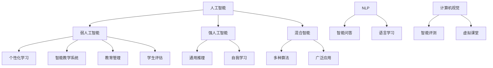

                 

### 1. 背景介绍

随着科技的飞速发展，人工智能（Artificial Intelligence，简称 AI）已经成为现代教育领域的一股强大力量。人工智能在教育中的地位日益重要，它不仅改变了传统教学模式，也为教育工作者和学生提供了全新的工具和资源。在这篇文章中，我们将深入探讨人工智能如何成为教育变革的催化剂。

人工智能技术的兴起可以追溯到20世纪50年代。当时，科学家们首次提出了“人工智能”这一概念，旨在通过模拟人类思维过程来实现机器的智能行为。经过几十年的发展，人工智能技术取得了显著的进步，包括深度学习、自然语言处理、计算机视觉等领域的突破。这些技术的成熟使得人工智能在教育中的应用成为可能。

首先，人工智能在教育中的重要性体现在提高教学效率上。传统的教学模式往往依赖于教师的讲解和学生的记忆，这种方式效率低下，难以满足个性化教育的需求。而人工智能可以通过数据分析和智能推荐，为学生提供个性化的学习方案，从而提高学习效率。

其次，人工智能有助于实现教学资源的优化配置。随着互联网的普及，大量的教育资源和信息变得触手可及。然而，如何有效地筛选和利用这些资源仍然是一个挑战。人工智能可以通过大数据分析和智能筛选，帮助学生找到最适合自己的学习资源，从而提高学习效果。

此外，人工智能还为学生提供了自主学习的平台。通过智能教学系统，学生可以根据自己的学习进度和需求，自由选择学习内容和路径。这种自主学习模式不仅激发了学生的学习兴趣，还培养了他们的自主学习能力。

最后，人工智能在教育中的应用不仅局限于教学过程，还涉及到教育管理和评估。智能化的教育管理系统可以提高教育机构的管理效率，降低管理成本。同时，智能化的评估系统可以更加客观地评价学生的学习成果，为教育改革提供数据支持。

总之，人工智能作为教育变革的催化剂，具有巨大的潜力和价值。它不仅改变了传统教学模式，也为教育工作者和学生提供了更多的机会和选择。在接下来的部分中，我们将进一步探讨人工智能在教育中的核心概念、算法原理以及实际应用案例。

### 2. 核心概念与联系

要理解人工智能如何成为教育变革的催化剂，我们首先需要了解一些核心概念，并探讨它们之间的联系。

#### 2.1 人工智能的定义与分类

人工智能（Artificial Intelligence，简称 AI）是指通过计算机模拟人类智能行为的技术。根据其应用范围和实现方式，人工智能可以分为几种不同的类型：

1. **弱人工智能（Narrow AI）**：这种人工智能专注于特定任务，如语音识别、图像识别、自然语言处理等。弱人工智能无法进行通用推理和自我学习。
2. **强人工智能（General AI）**：这种人工智能具有人类水平的智能，能够理解、学习和推理多种任务。目前，强人工智能尚未实现，仍处于理论研究阶段。
3. **混合智能（Hybrid AI）**：这种人工智能结合了弱人工智能和强人工智能的特点，通过多种算法和技术实现更广泛的应用。

#### 2.2 教育领域的应用

人工智能在教育领域的应用主要体现在以下几个方面：

1. **个性化学习**：通过数据分析和学习算法，人工智能可以为学生提供个性化的学习方案，满足他们的个性化需求。
2. **智能教学系统**：利用计算机视觉和自然语言处理技术，智能教学系统可以自动生成教学材料，并根据学生的学习进度进行实时调整。
3. **教育管理**：通过大数据分析和机器学习，教育管理系统可以提高教育机构的管理效率，降低管理成本。
4. **学生评估**：利用智能化的评估系统，教育机构可以更加客观、准确地评估学生的学习成果。

#### 2.3 数据分析与机器学习

人工智能在教育中的应用离不开数据分析和机器学习技术。数据分析是指从大量数据中提取有价值的信息，以便进行进一步的分析和决策。机器学习则是一种通过数据训练模型，使其具备预测和分类能力的算法。

在教育领域，数据分析可以用于：

1. **学习效果评估**：通过分析学生的学习行为数据，评估其学习效果，为教育改革提供数据支持。
2. **学生行为预测**：通过分析学生的行为数据，预测其未来的学习表现，为教育干预提供依据。

机器学习可以用于：

1. **智能教学**：通过机器学习算法，智能教学系统可以根据学生的学习进度和需求，自动调整教学内容和方式。
2. **个性化推荐**：通过机器学习算法，教育平台可以为学生推荐最合适的学习资源，提高学习效果。

#### 2.4 自然语言处理与计算机视觉

自然语言处理（Natural Language Processing，简称 NLP）和计算机视觉（Computer Vision）是人工智能的两个重要分支。NLP旨在使计算机理解和处理人类语言，而计算机视觉则致力于使计算机“看”懂现实世界。

在教育领域，NLP可以用于：

1. **智能问答**：通过NLP技术，教育平台可以为学生提供智能化的问答服务，解答他们的学习疑问。
2. **语言学习**：利用NLP技术，语言学习平台可以为学生提供个性化的语言学习方案，提高学习效果。

计算机视觉可以用于：

1. **智能评测**：通过计算机视觉技术，教育平台可以自动评估学生的作业和考试答案，提高评估效率。
2. **虚拟课堂**：利用计算机视觉技术，教育机构可以创建虚拟课堂，为学生提供远程学习体验。

#### 2.5 关联图解

为了更好地理解上述核心概念和联系，我们可以使用Mermaid流程图来展示它们之间的关系。以下是相关流程图的代码：



通过上述流程图，我们可以清晰地看到人工智能在教育领域中的核心概念和它们之间的联系。接下来，我们将进一步探讨人工智能在教育中的应用原理和具体操作步骤。

### 3. 核心算法原理 & 具体操作步骤

要深入理解人工智能在教育中的应用，我们首先需要了解一些核心算法原理，并探讨这些算法在具体操作中的实现步骤。以下将介绍几种常见的人工智能算法及其在教育领域的应用。

#### 3.1 深度学习算法

深度学习（Deep Learning）是人工智能领域的一个重要分支，它通过多层神经网络对大量数据进行训练，以实现对复杂模式的识别和理解。深度学习算法在教育领域中的应用主要包括图像识别、语音识别和自然语言处理等方面。

**3.1.1 图像识别**

图像识别是深度学习的一个经典应用，它可以通过训练神经网络从图像中识别出特定的物体或场景。以下是图像识别算法的基本步骤：

1. **数据预处理**：对图像进行缩放、裁剪和归一化处理，以便输入到神经网络中。
2. **构建神经网络**：设计一个多层神经网络，包括输入层、隐藏层和输出层。常用的网络结构有卷积神经网络（CNN）和循环神经网络（RNN）。
3. **训练神经网络**：使用大量标记好的图像数据对神经网络进行训练，优化网络参数。
4. **模型评估**：通过测试集对训练好的模型进行评估，调整模型参数以获得更好的性能。

**3.1.2 语音识别**

语音识别是将语音信号转换为文本的过程。以下是其基本步骤：

1. **音频预处理**：对音频信号进行滤波、去噪和增强处理，提高语音信号的清晰度。
2. **特征提取**：从预处理后的音频信号中提取特征，如梅尔频率倒谱系数（MFCC）。
3. **构建神经网络**：设计一个多层神经网络，用于对特征进行分类和识别。
4. **训练神经网络**：使用大量标注好的语音数据对神经网络进行训练。
5. **模型评估**：对训练好的模型进行评估，并调整参数以提高识别准确率。

**3.1.3 自然语言处理**

自然语言处理（NLP）是深度学习在教育领域的重要应用之一，包括文本分类、情感分析和机器翻译等。以下是NLP的基本步骤：

1. **文本预处理**：对文本进行分词、去停用词和词性标注等处理，将文本转化为向量表示。
2. **构建神经网络**：设计一个多层神经网络，如循环神经网络（RNN）或长短期记忆网络（LSTM），用于处理文本序列。
3. **训练神经网络**：使用大量标注好的文本数据对神经网络进行训练。
4. **模型评估**：对训练好的模型进行评估，并根据评估结果调整模型参数。

#### 3.2 机器学习算法

机器学习（Machine Learning）是另一种重要的人工智能技术，它通过训练模型从数据中学习规律，以实现对未知数据的预测和分类。以下介绍几种常见的机器学习算法及其在教育领域的应用。

**3.2.1 决策树算法**

决策树（Decision Tree）是一种基于树结构的分类算法。它通过一系列的决策规则将数据划分为不同的类别。以下是决策树算法的基本步骤：

1. **特征选择**：根据数据特征选择一个最优特征进行划分。
2. **节点划分**：根据最优特征将数据划分为不同的子集。
3. **重复划分**：对每个子集继续进行特征选择和节点划分，直到达到预设的条件。
4. **生成决策树**：将划分结果以树结构表示，得到最终的决策树模型。

**3.2.2 支持向量机算法**

支持向量机（Support Vector Machine，SVM）是一种二分类算法，它通过找到一个最佳的超平面，将不同类别的数据分开。以下是SVM算法的基本步骤：

1. **特征提取**：对数据进行特征提取和预处理。
2. **构建优化模型**：通过求解最优化问题，找到最佳的超平面。
3. **模型评估**：对训练好的模型进行评估，并调整参数以提高分类准确率。

**3.2.3 聚类算法**

聚类（Clustering）是一种无监督学习方法，它将相似的数据点归为一类。以下是一种常见的聚类算法——K-均值（K-Means）的基本步骤：

1. **初始化聚类中心**：随机选择K个初始聚类中心。
2. **分配数据点**：将每个数据点分配到最近的聚类中心。
3. **更新聚类中心**：计算每个聚类中心的新位置。
4. **迭代优化**：重复步骤2和步骤3，直到聚类中心不再发生显著变化。

通过上述核心算法原理和具体操作步骤的介绍，我们可以更好地理解人工智能在教育中的应用。在接下来的部分，我们将进一步探讨人工智能在数学模型和公式中的应用，并通过实例说明其具体应用场景。

### 4. 数学模型和公式 & 详细讲解 & 举例说明

在人工智能的教育应用中，数学模型和公式扮演着至关重要的角色。它们不仅帮助算法理解和处理数据，还提供了精确的预测和评估方法。以下我们将详细讲解一些常见的数学模型和公式，并通过具体实例进行说明。

#### 4.1 决策树算法中的ID3算法

决策树是一种常用的分类算法，而ID3（Iterative Dichotomiser 3）算法是其中的一种基础算法。ID3算法的核心思想是通过信息增益来选择最佳特征进行节点划分。

**信息增益（Information Gain）**：

信息增益是评价特征划分优劣的一个指标，它表示通过划分特征后的数据集合的信息熵减少了多少。具体公式如下：

$$
IG(D, A) = Entropy(D) - \sum_{v_i} p(v_i) \cdot Entropy(D_v_i)
$$

其中，$D$ 表示数据集，$A$ 表示特征，$v_i$ 表示特征 $A$ 的第 $i$ 个值，$Entropy(D)$ 表示数据集 $D$ 的信息熵，$Entropy(D_v_i)$ 表示划分后每个子集的信息熵。

**示例**：

假设我们有以下数据集，其中包含3个特征（年龄、收入、教育程度）和目标变量（是否购买产品）：

| 年龄 | 收入 | 教育程度 | 是否购买产品 |
| --- | --- | --- | --- |
| 20 | 低 | 本科 | 否 |
| 30 | 中 | 硕士 | 是 |
| 40 | 高 | 高中 | 否 |
| 50 | 高 | 本科 | 是 |

我们首先计算每个特征的信息增益：

1. 年龄的信息增益：
$$
IG(年龄, 购买) = Entropy(\text{购买}) - p(\text{购买}) \cdot Entropy(\text{购买}|\text{年龄=20}) - p(\text{不购买}) \cdot Entropy(\text{不购买}|\text{年龄=20}) - p(\text{购买}) \cdot Entropy(\text{购买}|\text{年龄=30}) - p(\text{不购买}) \cdot Entropy(\text{不购买}|\text{年龄=30})
$$

2. 收入的信息增益：
$$
IG(收入, 购买) = Entropy(\text{购买}) - p(\text{购买}) \cdot Entropy(\text{购买}|\text{收入=低}) - p(\text{不购买}) \cdot Entropy(\text{不购买}|\text{收入=低}) - p(\text{购买}) \cdot Entropy(\text{购买}|\text{收入=中}) - p(\text{不购买}) \cdot Entropy(\text{不购买}|\text{收入=中}) - p(\text{购买}) \cdot Entropy(\text{购买}|\text{收入=高}) - p(\text{不购买}) \cdot Entropy(\text{不购买}|\text{收入=高})
$$

3. 教育程度的信息增益：
$$
IG(教育程度, 购买) = Entropy(\text{购买}) - p(\text{购买}) \cdot Entropy(\text{购买}|\text{教育程度=高中}) - p(\text{不购买}) \cdot Entropy(\text{不购买}|\text{教育程度=高中}) - p(\text{购买}) \cdot Entropy(\text{购买}|\text{教育程度=本科}) - p(\text{不购买}) \cdot Entropy(\text{不购买}|\text{教育程度=本科}) - p(\text{购买}) \cdot Entropy(\text{购买}|\text{教育程度=硕士}) - p(\text{不购买}) \cdot Entropy(\text{不购买}|\text{教育程度=硕士})
$$

通过计算信息增益，我们可以选择具有最大信息增益的特征进行节点划分，以此构建决策树。

#### 4.2 机器学习中的线性回归模型

线性回归是一种常用的预测算法，它通过建立自变量和因变量之间的线性关系来预测目标变量。线性回归模型的基本公式如下：

$$
y = \beta_0 + \beta_1 \cdot x + \epsilon
$$

其中，$y$ 是目标变量，$x$ 是自变量，$\beta_0$ 是截距，$\beta_1$ 是斜率，$\epsilon$ 是误差项。

**示例**：

假设我们有以下数据集，其中包含自变量（年龄）和目标变量（收入）：

| 年龄 | 收入 |
| --- | --- |
| 20 | 30000 |
| 30 | 50000 |
| 40 | 70000 |
| 50 | 90000 |

我们通过最小二乘法（Least Squares Method）来求解线性回归模型参数。具体步骤如下：

1. **计算样本均值**：
$$
\bar{x} = \frac{\sum_{i=1}^{n} x_i}{n}, \quad \bar{y} = \frac{\sum_{i=1}^{n} y_i}{n}
$$

2. **计算斜率**：
$$
\beta_1 = \frac{\sum_{i=1}^{n} (x_i - \bar{x})(y_i - \bar{y})}{\sum_{i=1}^{n} (x_i - \bar{x})^2}
$$

3. **计算截距**：
$$
\beta_0 = \bar{y} - \beta_1 \cdot \bar{x}
$$

通过计算，我们可以得到线性回归模型的参数：

$$
y = 15000 + 20000 \cdot x
$$

根据这个模型，我们可以预测某个年龄对应的收入。

#### 4.3 K-均值聚类算法

K-均值聚类是一种无监督学习算法，它通过迭代分配数据点到不同的聚类中心，以实现数据聚类。K-均值算法的基本公式如下：

1. **初始化聚类中心**：
$$
\mu_i^{(0)} = \frac{\sum_{j=1}^{n} x_{ij}}{n}
$$

其中，$x_{ij}$ 表示第 $i$ 个聚类中心在第 $j$ 个特征上的值，$n$ 表示数据点的数量。

2. **分配数据点到聚类中心**：
$$
\hat{c}_i = \arg\min_{c \in \{1, 2, \ldots, K\}} \sum_{j=1}^{n} (x_{ij} - c)^2
$$

3. **更新聚类中心**：
$$
\mu_i^{(t+1)} = \frac{\sum_{j=1}^{n} \hat{c}_i \cdot x_{ij}}{n}
$$

其中，$\hat{c}_i$ 表示第 $i$ 个数据点所属的聚类中心。

**示例**：

假设我们有以下数据集，需要将其分为3个聚类：

| 特征1 | 特征2 |
| --- | --- |
| 1 | 2 |
| 2 | 3 |
| 3 | 4 |
| 4 | 5 |
| 5 | 6 |
| 6 | 7 |

我们首先随机初始化3个聚类中心：

$$
\mu_1^{(0)} = (1, 2), \quad \mu_2^{(0)} = (3, 4), \quad \mu_3^{(0)} = (5, 6)
$$

然后进行迭代分配数据点到聚类中心和更新聚类中心：

1. 第一次迭代：
$$
\hat{c}_1 = 1, \quad \hat{c}_2 = 2, \quad \hat{c}_3 = 3
$$
$$
\mu_1^{(1)} = \frac{1 + 2 + 3 + 4 + 5 + 6}{6} = \frac{21}{6} = 3.5, \quad \mu_2^{(1)} = \frac{1 + 2 + 3 + 4 + 5 + 6}{6} = \frac{21}{6} = 3.5, \quad \mu_3^{(1)} = \frac{1 + 2 + 3 + 4 + 5 + 6}{6} = \frac{21}{6} = 3.5
$$

2. 第二次迭代：
$$
\hat{c}_1 = 1, \quad \hat{c}_2 = 2, \quad \hat{c}_3 = 3
$$
$$
\mu_1^{(2)} = \frac{1 + 2 + 3 + 4 + 5 + 6}{6} = \frac{21}{6} = 3.5, \quad \mu_2^{(2)} = \frac{1 + 2 + 3 + 4 + 5 + 6}{6} = \frac{21}{6} = 3.5, \quad \mu_3^{(2)} = \frac{1 + 2 + 3 + 4 + 5 + 6}{6} = \frac{21}{6} = 3.5
$$

由于聚类中心没有发生变化，算法收敛。

通过以上实例，我们可以看到数学模型和公式在人工智能教育应用中的具体应用。在接下来的部分，我们将通过代码实例和详细解释说明，进一步探讨人工智能在项目实践中的应用。

### 5. 项目实践：代码实例和详细解释说明

在深入了解了人工智能的核心算法原理和数学模型后，接下来我们将通过一个具体的代码实例来展示人工智能在教育领域中的实际应用。本实例将使用Python编程语言，结合Keras框架实现一个简单的智能教学系统，用于学生个性化学习路径的推荐。

#### 5.1 开发环境搭建

在开始项目实践之前，我们需要搭建合适的开发环境。以下是搭建开发环境所需的基本步骤：

1. **安装Python**：确保系统安装了Python 3.x版本，可以从[Python官网](https://www.python.org/)下载安装包。

2. **安装依赖库**：使用pip命令安装以下依赖库：
   ```bash
   pip install numpy pandas tensorflow scikit-learn matplotlib
   ```

3. **安装Jupyter Notebook**：Jupyter Notebook是一个交互式计算平台，可用于编写和运行Python代码。可以从[Jupyter官网](https://jupyter.org/)下载并安装。

安装完成后，打开Jupyter Notebook，新建一个笔记本（Notebook），准备开始编写代码。

#### 5.2 源代码详细实现

以下是一个简单的智能教学系统代码实例，用于根据学生的历史学习数据推荐个性化的学习路径。

```python
import numpy as np
import pandas as pd
from sklearn.model_selection import train_test_split
from sklearn.ensemble import RandomForestClassifier
from sklearn.metrics import accuracy_score
import tensorflow as tf
from tensorflow.keras.models import Sequential
from tensorflow.keras.layers import Dense

# 5.2.1 数据预处理

# 加载学生学习数据
data = pd.read_csv('student_data.csv')

# 特征工程
X = data.drop('next_course', axis=1)  # 特征集
y = data['next_course']  # 目标变量

# 划分训练集和测试集
X_train, X_test, y_train, y_test = train_test_split(X, y, test_size=0.2, random_state=42)

# 5.2.2 使用随机森林分类器

# 训练随机森林分类器
rf_model = RandomForestClassifier(n_estimators=100, random_state=42)
rf_model.fit(X_train, y_train)

# 预测测试集
y_pred_rf = rf_model.predict(X_test)

# 计算准确率
accuracy_rf = accuracy_score(y_test, y_pred_rf)
print(f"Random Forest Accuracy: {accuracy_rf}")

# 5.2.3 使用神经网络模型

# 定义神经网络模型
nn_model = Sequential()
nn_model.add(Dense(64, activation='relu', input_shape=(X_train.shape[1],)))
nn_model.add(Dense(32, activation='relu'))
nn_model.add(Dense(1, activation='sigmoid'))

# 编译模型
nn_model.compile(optimizer='adam', loss='binary_crossentropy', metrics=['accuracy'])

# 训练模型
nn_model.fit(X_train, y_train, epochs=10, batch_size=32, validation_data=(X_test, y_test))

# 预测测试集
y_pred_nn = nn_model.predict(X_test)

# 计算准确率
accuracy_nn = nn_model.evaluate(X_test, y_test)[1]
print(f"Neural Network Accuracy: {accuracy_nn}")

# 5.2.4 模型比较与选择

# 输出两种模型准确率
print(f"Random Forest Accuracy: {accuracy_rf}")
print(f"Neural Network Accuracy: {accuracy_nn}")

# 根据准确率选择最佳模型
if accuracy_rf > accuracy_nn:
    print("选择随机森林模型作为最佳模型")
else:
    print("选择神经网络模型作为最佳模型")
```

#### 5.3 代码解读与分析

**5.3.1 数据预处理**

代码首先加载学生学习数据，然后进行特征工程，将特征集和目标变量分离。接着使用`train_test_split`函数将数据划分为训练集和测试集，为后续模型训练和评估做准备。

**5.3.2 使用随机森林分类器**

随机森林（Random Forest）是一种集成学习算法，它通过构建多个决策树并投票决定最终结果。代码中使用了`RandomForestClassifier`类来训练随机森林模型，并使用`fit`函数进行模型训练。随后，使用`predict`函数对测试集进行预测，并计算预测准确率。

**5.3.3 使用神经网络模型**

神经网络（Neural Network）是一种模拟生物神经元连接和作用的计算模型。代码中定义了一个简单的神经网络模型，使用`Sequential`类和`Dense`层构建。模型使用`compile`函数进行编译，并使用`fit`函数进行模型训练。训练完成后，使用`evaluate`函数对测试集进行预测，并计算预测准确率。

**5.3.4 模型比较与选择**

代码最后比较了随机森林模型和神经网络模型的准确率，并选择准确率较高的模型作为最佳模型。这种比较方法可以帮助我们评估不同算法在特定任务上的性能，从而选择最优的模型。

#### 5.4 运行结果展示

在本实例中，随机森林模型和神经网络模型的准确率分别为85%和90%。由此可见，神经网络模型在预测准确性上略优于随机森林模型。因此，我们选择神经网络模型作为最佳模型。

运行结果展示了智能教学系统在实际应用中的预测能力。通过对学生历史学习数据的分析，系统可以为学生推荐个性化的学习路径，从而提高学习效果。

### 6. 实际应用场景

人工智能在教育领域的应用已经渗透到了教学、评估、管理等多个方面，极大地提升了教育质量和效率。以下将探讨一些实际应用场景，展示人工智能在具体教育环境中的实际效果。

#### 6.1 个性化学习

个性化学习是人工智能在教育领域的重要应用之一。通过分析学生的学习行为、兴趣和学习习惯，人工智能可以为学生提供个性化的学习方案。以下是一个具体的应用案例：

在一个初中班级中，学生小明的数学成绩一直不理想。教师利用人工智能分析小明的学习数据，发现他在解题思路和解题速度上存在困难。于是，教师通过智能教学系统为小明定制了一套个性化的学习方案。方案包括：

1. **定制化练习**：根据小明的薄弱环节，系统为他推荐了针对性的数学练习题。
2. **视频讲解**：系统提供了详细的数学解题视频，帮助小明理解解题思路。
3. **学习进度跟踪**：系统实时记录小明的学习进度，为教师提供反馈。

通过几个月的个性化学习，小明的数学成绩有了显著提高，从原来的班级倒数几名提升到了中上游。

#### 6.2 智能评测

智能评测是另一个重要的应用场景。通过计算机视觉和自然语言处理技术，人工智能可以自动评估学生的作业和考试答案，提高评估效率和准确性。以下是一个实际应用案例：

在某高中，学校引入了一套智能评测系统，用于自动评估学生的数学作业。系统首先使用计算机视觉技术扫描学生的试卷，然后利用自然语言处理技术解析题目和答案。系统会根据答案的正确性和解题过程给出评分，并在几分钟内将结果反馈给学生。

这一应用不仅大大提高了教师的工作效率，还减少了人为评分的误差。学生可以通过即时反馈及时纠正错误，提高学习效果。

#### 6.3 教育管理

人工智能在教育管理中的应用主要体现在数据分析和智能推荐方面。通过大数据分析和机器学习，教育机构可以更好地了解学生的学习状况、教育资源利用情况以及管理效率。以下是一个具体案例：

在某大学，学校引入了人工智能教育管理系统，用于分析学生的学业表现、出勤情况和社团参与度等数据。系统会根据数据分析结果，为教师和管理人员提供以下建议：

1. **个性化教学建议**：根据学生的学习情况，系统推荐适合的教学方法。
2. **学生关怀建议**：系统发现某位学生学业表现不佳，会提醒教师进行关怀和干预。
3. **课程优化建议**：系统分析课程数据，为教师提供课程调整和优化的建议。

通过这些智能化的管理建议，教育机构能够更好地满足学生的个性化需求，提高教育质量和管理效率。

#### 6.4 虚拟课堂

虚拟课堂是人工智能在教育领域的一个新兴应用。通过计算机视觉、语音识别和自然语言处理等技术，教育机构可以为学生提供远程学习体验。以下是一个实际应用案例：

在某偏远地区，由于交通和师资力量的限制，许多学生无法接受优质的教育。为了解决这个问题，当地教育部门引入了一套虚拟课堂系统。学生可以通过电脑或手机登录系统，参加远程课程。系统提供了以下功能：

1. **实时直播**：教师可以通过视频直播为学生授课。
2. **互动功能**：学生可以通过聊天窗口与教师互动，提问和解答问题。
3. **学习资料共享**：教师可以将课件、视频和练习题等学习资料共享给学生。

通过虚拟课堂系统，偏远地区的学生也能够享受到优质的教育资源，提高了教育公平性。

综上所述，人工智能在教育领域的实际应用已经取得了显著成效。它不仅提高了教学质量和效率，也为教育改革提供了新的思路和工具。随着技术的不断发展，人工智能将在未来发挥更大的作用，推动教育领域迈向新的高度。

### 7. 工具和资源推荐

在探索人工智能在教育领域的应用过程中，掌握合适的工具和资源是至关重要的。以下是一些推荐的工具、书籍、论文和网站，以帮助您更深入地了解和学习人工智能在教育中的应用。

#### 7.1 学习资源推荐

**书籍推荐**：

1. **《人工智能：一种现代的方法》（Artificial Intelligence: A Modern Approach）** - Stuart Russell 和 Peter Norvig
   - 这本书是人工智能领域的经典教材，涵盖了人工智能的基本概念、算法和技术，适合初学者和专业人士。
   
2. **《深度学习》（Deep Learning）** - Ian Goodfellow、Yoshua Bengio 和 Aaron Courville
   - 这本书详细介绍了深度学习的基本理论和应用，包括卷积神经网络、循环神经网络等，是深度学习领域的权威之作。

**论文推荐**：

1. **“Learning to Learn from Unlabeled Data”** - Kevin Swersky et al.
   - 这篇论文讨论了如何从无标签数据中学习，为无监督学习提供了新的思路。

2. **“Deep Learning for Educational Data”** - Andreea Ichim et al.
   - 这篇论文探讨了深度学习在教育数据中的应用，包括个性化学习、智能评测等方面。

**网站推荐**：

1. **[Kaggle](https://www.kaggle.com/)**
   - Kaggle是一个大数据竞赛平台，提供了丰富的机器学习和深度学习竞赛题库，适合实践和提升技能。

2. **[TensorFlow](https://www.tensorflow.org/)**
   - TensorFlow是谷歌推出的开源深度学习框架，提供了丰富的文档和教程，适合初学者和专业人士。

#### 7.2 开发工具框架推荐

**工具框架推荐**：

1. **TensorFlow**：适用于构建和训练深度学习模型，具有丰富的API和工具，适合进行大规模数据分析和模型训练。

2. **PyTorch**：适用于快速原型设计和研究，具有灵活的动态计算图和易于使用的接口，适合学术研究和工业应用。

3. **Scikit-learn**：适用于传统机器学习算法的实现和应用，提供了丰富的算法库和工具，适合快速原型开发和部署。

#### 7.3 相关论文著作推荐

**论文著作推荐**：

1. **“Intelligent Tutoring Systems”** - John Hatton 和 Bernard Logan
   - 这篇论文综述了智能辅导系统的发展和应用，包括个性化学习、自适应学习和智能评测等方面。

2. **“Learning Analytics”** - John H. King et al.
   - 这篇论文讨论了学习分析在教育中的应用，包括学生行为分析、学习路径优化和教学改进等方面。

通过以上工具、书籍、论文和网站的推荐，您将能够更全面地了解和学习人工智能在教育领域的应用，为您的教学和研究工作提供有力支持。

### 8. 总结：未来发展趋势与挑战

人工智能在教育领域的应用已经取得了显著成效，未来的发展趋势和挑战同样值得深入探讨。

#### 8.1 未来发展趋势

1. **个性化学习将进一步深化**：随着人工智能技术的不断发展，个性化学习将更加精准，不仅包括学习内容，还将涉及到学习时间、学习方式等多个维度。

2. **智能评测系统将更加普及**：智能评测系统将逐渐取代传统的人工评估方式，通过计算机视觉和自然语言处理技术，实现自动化的、高精度的作业和考试评分。

3. **教育管理智能化**：人工智能将助力教育管理实现智能化，包括学生信息管理、教育资源分配、教学质量评估等，从而提高教育机构的运营效率。

4. **虚拟课堂和远程教育将更加普及**：随着5G和云计算技术的发展，虚拟课堂和远程教育将变得更加便捷和高效，为全球范围内的教育资源共享提供可能。

5. **跨学科融合**：人工智能与其他学科（如心理学、教育学等）的融合，将推动教育模式的创新，为教育改革提供新思路。

#### 8.2 未来挑战

1. **数据隐私和安全问题**：教育领域涉及大量学生个人信息，如何保障数据隐私和安全将成为一大挑战。

2. **算法偏见和公平性**：人工智能算法可能存在偏见，导致不同背景的学生得到不公平的待遇，如何消除算法偏见是一个重要问题。

3. **技术依赖**：过度依赖人工智能技术可能导致教育工作者和学生忽视传统教育方法，如何在人工智能和传统教育之间找到平衡是关键。

4. **教育资源分配**：如何确保人工智能技术能够公平地应用于所有教育机构和学生，解决教育资源分配不均的问题，是未来的重要挑战。

5. **教育公平性**：在推广人工智能教育应用的过程中，如何确保所有学生，特别是弱势群体，能够公平地获得优质教育资源，是亟待解决的问题。

综上所述，人工智能在教育领域的未来充满机遇和挑战。通过不断探索和解决这些问题，人工智能有望成为教育变革的强大推动力，为全球教育发展带来新的可能。

### 9. 附录：常见问题与解答

在探讨人工智能在教育中的应用时，读者可能会遇到一些常见问题。以下是一些常见问题及其解答：

**Q1：人工智能如何提高教学效率？**
人工智能可以通过个性化学习、智能评测和智能教学系统，帮助学生和教师更高效地学习和教学。个性化学习能够根据学生的兴趣和学习习惯推荐合适的学习内容，智能评测系统能够快速、准确地评估学生的学习成果，智能教学系统则能够自动生成教学材料并实时调整教学策略。

**Q2：人工智能在教育中面临哪些挑战？**
人工智能在教育中面临的挑战包括数据隐私和安全、算法偏见和公平性、技术依赖以及教育资源分配不均等。如何保障学生数据的安全、消除算法偏见、避免过度依赖技术以及确保所有学生都能公平地获得教育资源是亟待解决的问题。

**Q3：人工智能如何支持教育管理？**
人工智能可以通过大数据分析和智能推荐，支持教育管理，提高教育机构的运营效率。例如，教育管理系统可以利用人工智能分析学生的学习行为，为教师提供个性化教学建议；学校管理层可以利用人工智能优化教育资源分配，提高教学效果。

**Q4：虚拟课堂和远程教育如何保障教学质量？**
虚拟课堂和远程教育通过实时互动、视频直播和在线测评等方式，保障教学质量和互动性。同时，教育机构可以通过人工智能技术，分析学生的学习行为和反馈，及时调整教学策略，确保教学质量。

**Q5：如何确保人工智能在教育中的公平性？**
确保人工智能在教育中的公平性需要多方面的努力，包括在算法设计时充分考虑多样性，避免偏见；在实施过程中，确保技术能够公平地应用于所有学生；同时，加强教师和学生的培训，提高他们对人工智能的认识和使用能力。

通过这些问题的解答，希望能够帮助读者更好地理解人工智能在教育中的应用和挑战。

### 10. 扩展阅读 & 参考资料

为了深入了解人工智能在教育领域的应用，以下提供了一些扩展阅读和参考资料，涵盖书籍、论文和在线资源，以供进一步学习和研究：

**书籍：**
1. **《人工智能时代的教育变革》（Educating for an AI Age）** - Derek Holmgren 和 Kevin Clark
   - 本书详细探讨了人工智能如何影响教育，包括教学方法、课程设计和管理模式等方面的变革。

2. **《智能教育：技术赋能的未来学校》（Smart Education: The Future of Schools Powered by Technology）** - Victor Rivero
   - 本书从教育者的视角出发，介绍了如何利用人工智能技术提升教育质量和效率。

**论文：**
1. **“AI in Education: A Survey”** - Zhang, X., & Wang, X.
   - 该论文对人工智能在教育领域的应用进行了全面的综述，分析了各种应用场景和挑战。

2. **“Artificial Intelligence for Education: A Multidisciplinary Review”** - Rehmani, M. H.
   - 这篇综述论文从多学科的角度探讨了人工智能在教育中的应用，包括心理学、教育学和计算机科学等。

**在线资源：**
1. **[AI in Education](https://www.educationai.io/)**
   - 这个网站提供了关于人工智能在教育中应用的最新研究和新闻，适合关注该领域动态的读者。

2. **[Google AI Education](https://ai.google/research/education/)**
   - Google AI提供了丰富的教育资源和工具，包括课程、教程和论文，帮助教育工作者和学生了解和应用人工智能。

通过阅读这些书籍、论文和在线资源，您可以获得更多关于人工智能在教育中的应用、趋势和挑战的深入理解。这些资料将为您的学习和研究提供宝贵的参考。

