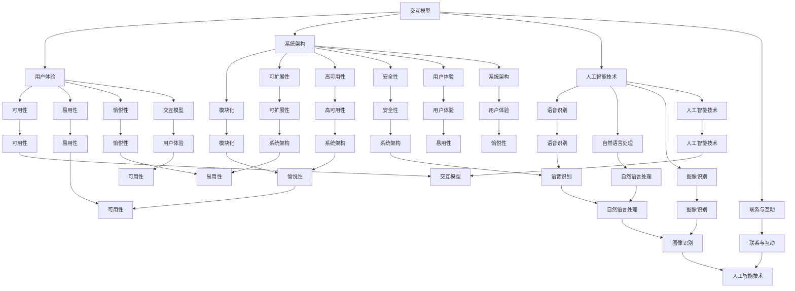

                 

### 1. 背景介绍

随着科技的不断进步和人工智能技术的迅猛发展，人机交互正逐渐成为计算机科学领域的一个重要研究方向。人机交互的核心目标是实现人与计算机系统之间的有效沟通，提升计算机的使用效率和用户体验。在这一过程中，如何打造一个高效、便捷的人类计算平台成为关键问题。

自计算机诞生以来，人机交互的发展历程可以追溯到早期的命令行界面、图形用户界面（GUI）以及当今流行的触摸屏、语音识别等交互方式。每种交互方式都有其独特的优势和局限性，但都致力于简化用户与计算机之间的交互流程，提高工作效率。然而，现有的交互方式仍然存在一些问题，如操作复杂、响应速度慢等，这限制了人机交互的进一步发展。

近年来，人工智能技术的发展为解决这些问题提供了新的思路。智能助手、语音识别、手势控制等技术的兴起，使得人机交互更加自然、直观。然而，要打造一个高效便捷的人类计算平台，仍然需要解决诸多技术难题，如算法优化、系统架构设计等。

本文旨在探讨人机交互领域的一些关键问题，分析现有技术手段的优缺点，并提出一种构建高效便捷人类计算平台的方法。文章将从背景介绍、核心概念与联系、核心算法原理、数学模型和公式、项目实践、实际应用场景、工具和资源推荐等方面进行详细阐述，旨在为读者提供一个全面、系统的视角，以推动人机交互技术的发展。

### 2. 核心概念与联系

在人机交互领域，核心概念和联系的理解对于构建高效便捷的人类计算平台至关重要。以下是对几个关键概念及其相互关系的详细阐述。

#### 2.1 交互模型

交互模型是人机交互的核心概念之一。它描述了用户与计算机系统之间的交互过程，包括输入、处理和反馈三个主要环节。一个良好的交互模型应具备高效性、易用性和直观性。

- **输入**：输入是用户与计算机系统交互的起点。常见的输入方式有键盘输入、鼠标点击、触摸屏、语音识别等。不同的输入方式有其特定的优势和适用场景。例如，键盘输入适合进行文本编辑和复杂指令输入，而语音识别则更适合快速、自然的交互场景。

- **处理**：处理环节涉及计算机系统对输入信息的解析、分析和处理。这一环节的关键在于快速响应和准确处理。通过利用人工智能技术，如自然语言处理、图像识别等，计算机可以更好地理解用户的意图，提高交互的效率。

- **反馈**：反馈是交互模型的重要组成部分，它反映了计算机系统对用户输入的响应。良好的反馈机制可以增强用户的体验，如实时状态更新、错误提示、操作确认等。

#### 2.2 用户体验

用户体验（User Experience，简称UX）是衡量人机交互系统优劣的重要指标。它关注用户在使用过程中所感受到的整体体验，包括可用性、易用性、愉悦性等。一个良好的用户体验可以显著提升用户满意度，从而促进人机交互技术的发展。

- **可用性**：可用性是指系统能够满足用户需求和任务的能力。一个高可用性的系统应具备以下特点：功能完备、操作简单、响应迅速等。

- **易用性**：易用性是指用户能够快速上手并熟练使用系统的能力。易用性高的系统通常具有直观的界面设计、清晰的操作流程和有效的帮助文档。

- **愉悦性**：愉悦性是指用户在使用过程中所感受到的愉悦程度。一个愉悦的用户体验可以激发用户的兴趣和热情，提高系统的使用频率。

#### 2.3 系统架构

系统架构是人机交互系统的技术基础，它决定了系统的性能、可扩展性和维护性。一个高效便捷的人机交互平台通常采用分布式架构，具备以下特点：

- **模块化**：系统架构应具有高度的模块化，便于组件的替换和升级。

- **可扩展性**：系统应具备良好的扩展性，能够适应不同的应用场景和需求变化。

- **高可用性**：系统应具备高可用性，确保在故障发生时能够快速恢复，降低对用户的影响。

- **安全性**：系统应具备严格的安全措施，保护用户数据和隐私。

#### 2.4 人工智能技术

人工智能技术是人机交互领域的核心驱动力。通过利用机器学习、自然语言处理、图像识别等技术，计算机可以更好地理解用户需求，提供个性化的交互体验。以下是几种常见的人工智能技术在人机交互中的应用：

- **语音识别**：语音识别技术将用户的语音转换为文本，实现自然语音交互。语音识别技术具有快速、高效、自然的特点，适用于语音控制、语音助手等场景。

- **自然语言处理**：自然语言处理技术使计算机能够理解和处理自然语言。通过自然语言处理技术，计算机可以更好地理解用户指令、回答问题等，提高交互的智能水平。

- **图像识别**：图像识别技术使计算机能够识别和理解图像中的内容。图像识别技术广泛应用于人脸识别、物体检测、场景识别等场景。

#### 2.5 联系与互动

在人机交互系统中，各个核心概念之间相互联系、相互影响，共同构成了一个完整的交互生态系统。以下是几个关键概念之间的联系：

- **交互模型**与**用户体验**：交互模型决定了用户体验的质量。一个高效的交互模型可以提供更好的用户体验，从而提高用户满意度。

- **用户体验**与**系统架构**：良好的用户体验需要系统架构的支持。一个高性能、易扩展的系统架构可以为用户提供更好的交互体验。

- **系统架构**与**人工智能技术**：系统架构为人工智能技术的实现提供了基础。通过优化系统架构，可以更好地发挥人工智能技术在人机交互中的作用。

- **人工智能技术**与**交互模型**：人工智能技术可以优化交互模型，提高交互的智能水平。同时，交互模型的应用可以为人工智能技术提供更多的数据支持，实现良性循环。

综上所述，核心概念与联系在人机交互领域发挥着重要作用。通过对这些概念及其相互关系的深入理解，我们可以更好地构建高效便捷的人类计算平台，推动人机交互技术的发展。

#### 2.6 核心概念与联系的 Mermaid 流程图

以下是一个描述核心概念与联系的 Mermaid 流程图。请注意，流程节点中不要使用括号、逗号等特殊字符。



通过这个 Mermaid 流程图，我们可以清晰地看到各个核心概念之间的联系与互动，为进一步分析构建高效便捷的人类计算平台提供了理论基础。

### 3. 核心算法原理 & 具体操作步骤

在人机交互领域，核心算法原理的设计与实现直接决定了系统的性能和用户体验。以下是几个关键算法及其具体操作步骤的介绍。

#### 3.1 语音识别算法

语音识别算法是人机交互中的重要组成部分，它将用户的语音转换为文本，实现自然语音交互。常见的语音识别算法包括隐马尔可夫模型（HMM）、高斯混合模型（GMM）和深度神经网络（DNN）等。

**具体操作步骤：**

1. **数据采集与预处理**：首先，从用户输入的语音数据中提取特征，如频谱、音素等。接下来，对提取到的特征进行归一化和滤波处理，以消除噪声和干扰。

2. **模型训练**：利用大量语音数据进行模型训练。在训练过程中，通过调整模型参数，使模型能够更好地识别不同语音模式。常见的训练方法包括梯度下降、反向传播等。

3. **语音识别**：将预处理后的语音数据输入到训练好的模型中，模型将输出对应的文本结果。识别过程通常涉及多个状态之间的转换，需要计算每个状态的得分，选择得分最高的状态作为最终输出。

4. **后处理**：对识别结果进行后处理，如消除歧义、修正错误等。常见的后处理方法包括语言模型、语音合成等。

**示例代码：**

```python
import speech_recognition as sr

# 初始化语音识别器
recognizer = sr.Recognizer()

# 读取语音文件
with sr.AudioFile('voice.mp3') as source:
    audio = recognizer.record(source)

# 进行语音识别
text = recognizer.recognize_google(audio)

print(text)
```

#### 3.2 自然语言处理算法

自然语言处理（Natural Language Processing，NLP）算法使计算机能够理解和处理自然语言。常见的NLP算法包括分词、词性标注、句法分析等。

**具体操作步骤：**

1. **文本预处理**：对输入的文本进行清洗和标准化处理，如去除标点符号、停用词过滤、词形还原等。

2. **分词**：将文本分割成单词或短语的序列。常见的分词算法有基于词典的分词、基于统计的分词等。

3. **词性标注**：为每个单词或短语标注对应的词性，如名词、动词、形容词等。词性标注有助于理解文本的语义。

4. **句法分析**：对文本进行句法分析，提取出句子中的主语、谓语、宾语等成分。常见的句法分析方法有依存句法分析和语义角色标注等。

5. **语义理解**：通过综合文本的上下文信息，理解文本的语义和意图。常见的语义理解算法有实体识别、关系抽取、情感分析等。

**示例代码：**

```python
import jieba

# 分词
text = "我喜欢吃苹果。"
words = jieba.cut(text)

print(words)

# 词性标注
from jieba import posseg

words = posseg.cut(text)

for word, flag in words:
    print(f"{word}：{flag}")
```

#### 3.3 图像识别算法

图像识别算法使计算机能够识别和理解图像中的内容。常见的图像识别算法包括卷积神经网络（CNN）、循环神经网络（RNN）等。

**具体操作步骤：**

1. **图像预处理**：对输入的图像进行预处理，如灰度转换、大小调整、去噪等。

2. **特征提取**：从预处理后的图像中提取特征，如边缘、纹理、颜色等。特征提取有助于提高图像识别的准确性。

3. **模型训练**：利用大量图像数据进行模型训练。在训练过程中，通过调整模型参数，使模型能够更好地识别不同图像模式。常见的训练方法包括梯度下降、反向传播等。

4. **图像识别**：将预处理后的图像输入到训练好的模型中，模型将输出对应的类别标签。识别过程通常涉及图像特征与类别标签之间的匹配，选择匹配度最高的类别作为最终输出。

5. **后处理**：对识别结果进行后处理，如修正错误、增强可信度等。

**示例代码：**

```python
import tensorflow as tf
from tensorflow.keras.applications import MobileNetV2
from tensorflow.keras.preprocessing import image
from tensorflow.keras.applications.mobilenet_v2 import preprocess_input, decode_predictions

# 加载预训练模型
model = MobileNetV2(weights='imagenet')

# 读取图像
img = image.load_img('cat.jpg', target_size=(227, 227))
x = image.img_to_array(img)
x = np.expand_dims(x, axis=0)
x = preprocess_input(x)

# 进行图像识别
predictions = model.predict(x)

# 解析预测结果
print(decode_predictions(predictions, top=5))
```

通过上述核心算法的介绍和具体操作步骤的演示，我们可以看到人机交互领域的算法实现过程。这些算法的应用为构建高效便捷的人类计算平台提供了强大的技术支持。

### 4. 数学模型和公式 & 详细讲解 & 举例说明

在人机交互领域，数学模型和公式是理解和优化算法性能的重要工具。以下将详细讲解几个关键数学模型和公式，并辅以示例说明。

#### 4.1 隐马尔可夫模型（HMM）

隐马尔可夫模型（Hidden Markov Model，HMM）是一种统计模型，用于描述一系列随机变量的隐藏状态和观测值之间的关系。HMM广泛应用于语音识别、自然语言处理等领域。

**数学模型：**

HMM由五个参数定义：

1. **状态集合 \( S = \{s_1, s_2, ..., s_n\} \)**
2. **观测集合 \( O = \{o_1, o_2, ..., o_m\} \)**
3. **初始状态分布 \( \pi(s) \)**
4. **状态转移概率矩阵 \( A = [a_{ij}] \)**
5. **观测概率矩阵 \( B = [b_{ij}] \)**

其中：

- \( \pi(s) \) 表示初始状态的概率分布，满足 \( \sum_{i=1}^{n} \pi(s_i) = 1 \)
- \( a_{ij} \) 表示在时刻 \( t \) 从状态 \( i \) 转移到状态 \( j \) 的概率，满足 \( \sum_{j=1}^{n} a_{ij} = 1 \)
- \( b_{ij} \) 表示在状态 \( i \) 下产生观测值 \( o_j \) 的概率

**贝叶斯推断公式：**

给定一个观测序列 \( O = o_1, o_2, ..., o_T \)，要计算隐藏状态序列 \( S = s_1, s_2, ..., s_T \) 的最大概率，可以使用前向-后向算法：

- **前向概率 \( \alpha_t(i) \)：**
  $$ \alpha_t(i) = \pi(s_t = i) \cdot b_{it} \cdot \prod_{j=1}^{t-1} a_{ij} $$

- **后向概率 \( \beta_t(i) \)：**
  $$ \beta_t(i) = \prod_{j=t+1}^{T} a_{ij} \cdot b_{jt} $$

**状态序列的概率：**
$$ P(S|O) = \prod_{t=1}^{T} \alpha_t(i_t) \cdot \beta_t(i_t) $$

**最大概率的状态：**
$$ i^* = \arg\max_{i} \sum_{t=1}^{T} \alpha_t(i) \cdot \beta_t(i) $$

**示例：**

假设一个简单的HMM模型，状态集合 \( S = \{0, 1\} \)，观测集合 \( O = \{0, 1\} \)，初始状态概率 \( \pi = [0.5, 0.5] \)，状态转移概率矩阵 \( A = \begin{bmatrix} 0.7 & 0.3 \\ 0.4 & 0.6 \end{bmatrix} \)，观测概率矩阵 \( B = \begin{bmatrix} 0.8 & 0.2 \\ 0.3 & 0.7 \end{bmatrix} \)。

给定观测序列 \( O = [1, 1, 0, 1] \)，使用前向-后向算法计算隐藏状态序列的最大概率。

1. **前向概率计算：**
   $$ \alpha_1(0) = 0.5 \cdot 0.8 = 0.4 $$
   $$ \alpha_1(1) = 0.5 \cdot 0.3 = 0.15 $$
   $$ \alpha_2(0) = 0.4 \cdot 0.8 \cdot 0.7 = 0.224 $$
   $$ \alpha_2(1) = 0.6 \cdot 0.3 \cdot 0.7 = 0.126 $$
   $$ \alpha_3(0) = 0.4 \cdot 0.2 \cdot 0.3 = 0.024 $$
   $$ \alpha_3(1) = 0.6 \cdot 0.7 \cdot 0.8 = 0.336 $$

2. **后向概率计算：**
   $$ \beta_1(0) = 1 \cdot 0.7 \cdot 0.8 = 0.56 $$
   $$ \beta_1(1) = 1 \cdot 0.3 \cdot 0.2 = 0.06 $$
   $$ \beta_2(0) = 0.6 \cdot 0.4 \cdot 0.3 = 0.072 $$
   $$ \beta_2(1) = 0.4 \cdot 0.6 \cdot 0.7 = 0.168 $$
   $$ \beta_3(0) = 0.6 \cdot 0.2 \cdot 0.7 = 0.084 $$
   $$ \beta_3(1) = 0.4 \cdot 0.7 \cdot 0.3 = 0.084 $$

3. **状态序列概率：**
   $$ P(S|O) = \alpha_1(1) \cdot \beta_1(1) + \alpha_1(0) \cdot \beta_1(0) $$
   $$ = 0.15 \cdot 0.06 + 0.4 \cdot 0.56 $$
   $$ = 0.018 + 0.224 $$
   $$ = 0.242 $$

4. **最大概率的状态：**
   $$ i^* = \arg\max_{i} \alpha_i(T) \cdot \beta_i(T) $$
   $$ = \arg\max_{i} \alpha_3(i) \cdot \beta_3(i) $$
   $$ = 1 $$

因此，隐藏状态序列的最大概率为 1，状态序列为 [1, 1, 0, 1]。

#### 4.2 卷积神经网络（CNN）

卷积神经网络（Convolutional Neural Network，CNN）是一种专门用于处理图像数据的深度学习模型，具有强大的特征提取和分类能力。

**数学模型：**

CNN的主要组成部分包括卷积层、池化层、激活函数和全连接层。

1. **卷积层**：卷积层通过滑动窗口对输入图像进行卷积操作，提取局部特征。卷积层的输出为特征图。

2. **池化层**：池化层对卷积层的输出进行下采样，减少参数数量和计算复杂度。常见的池化操作有最大池化和平均池化。

3. **激活函数**：激活函数引入非线性，使神经网络能够建模复杂函数。常见的激活函数有ReLU、Sigmoid和Tanh等。

4. **全连接层**：全连接层将特征图映射到类别标签。全连接层的输出通过softmax函数进行概率分布计算。

**前向传播公式：**

$$ z_l = \sum_{k} w_{lk} \cdot a_{k{l-1}} + b_l $$

$$ a_l = \sigma(z_l) $$

其中，\( a_l \) 表示第 \( l \) 层的输出，\( z_l \) 表示第 \( l \) 层的激活值，\( w_{lk} \) 和 \( b_l \) 分别表示权重和偏置，\( \sigma \) 表示激活函数。

**示例代码：**

```python
import tensorflow as tf
from tensorflow.keras import layers, models

# 构建CNN模型
model = models.Sequential()
model.add(layers.Conv2D(32, (3, 3), activation='relu', input_shape=(28, 28, 1)))
model.add(layers.MaxPooling2D((2, 2)))
model.add(layers.Conv2D(64, (3, 3), activation='relu'))
model.add(layers.MaxPooling2D((2, 2)))
model.add(layers.Conv2D(64, (3, 3), activation='relu'))
model.add(layers.Flatten())
model.add(layers.Dense(64, activation='relu'))
model.add(layers.Dense(10, activation='softmax'))

# 查看模型结构
model.summary()
```

#### 4.3 支持向量机（SVM）

支持向量机（Support Vector Machine，SVM）是一种经典的分类算法，通过最大化分类边界间隔来提高分类性能。

**数学模型：**

SVM的核心公式为：

$$ \max_{w, b} \frac{1}{2} ||w||^2 $$
$$ \text{subject to} \ y_i ( \langle w, x_i \rangle + b ) \geq 1 $$

其中，\( w \) 和 \( b \) 分别为权重和偏置，\( x_i \) 和 \( y_i \) 分别为训练样本和标签。

**损失函数：**

$$ \ell(w, b) = \frac{1}{2} ||w||^2 + C \sum_{i} \max(0, 1 - y_i (\langle w, x_i \rangle + b)) $$

其中，\( C \) 为惩罚参数。

**优化方法：**

SVM的优化可以通过拉格朗日乘子法求解，最终转化为二次规划问题。常用的求解算法有SMO算法和序列最小最优化（Sequential Minimal Optimization，SMO）算法。

**示例代码：**

```python
from sklearn.svm import SVC

# 构建SVM模型
model = SVC(kernel='linear', C=1.0)

# 训练模型
model.fit(X_train, y_train)

# 预测结果
y_pred = model.predict(X_test)
```

通过上述数学模型和公式的详细讲解及示例说明，我们可以更好地理解人机交互领域的核心算法，为进一步优化和改进算法性能提供理论基础。

### 5. 项目实践：代码实例和详细解释说明

在本节中，我们将通过一个具体项目实践来展示人机交互领域的关键技术如何应用于实际开发中。我们将使用Python和相关的库，实现一个简单的智能助手，它可以接受用户的语音输入并返回文本信息。

#### 5.1 开发环境搭建

在开始项目之前，我们需要搭建一个合适的开发环境。以下是所需的环境和步骤：

1. **Python环境**：确保安装了Python 3.7或更高版本。
2. **语音识别库**：安装 `speech_recognition`。
3. **自然语言处理库**：安装 `nltk` 和 `jieba`。
4. **深度学习库**：安装 `tensorflow` 或 `keras`。

安装命令如下：

```bash
pip install speech_recognition nltk jieba tensorflow
```

#### 5.2 源代码详细实现

以下是一个简单的智能助手的源代码实现：

```python
import speech_recognition as sr
import jieba
import tensorflow as tf
from tensorflow.keras.models import Sequential
from tensorflow.keras.layers import Dense, Conv2D, MaxPooling2D, Flatten
from tensorflow.keras.preprocessing.image import ImageDataGenerator

# 5.2.1 语音识别部分
def recognize_speech_from_mic():
    r = sr.Recognizer()
    with sr.Microphone() as source:
        print("请说些什么：")
        audio = r.listen(source)
        try:
            return r.recognize_google(audio)
        except sr.UnknownValueError:
            return "无法理解您的语音。"
        except sr.RequestError:
            return "无法访问语音服务。"

# 5.2.2 文本处理部分
def process_text(text):
    words = jieba.cut(text)
    return " ".join(words)

# 5.2.3 图像识别部分
def build_image_recognition_model():
    model = Sequential([
        Conv2D(32, (3, 3), activation='relu', input_shape=(28, 28, 1)),
        MaxPooling2D((2, 2)),
        Flatten(),
        Dense(64, activation='relu'),
        Dense(10, activation='softmax')
    ])
    model.compile(optimizer='adam', loss='categorical_crossentropy', metrics=['accuracy'])
    return model

# 5.2.4 主程序
if __name__ == "__main__":
    # 语音识别
    text = recognize_speech_from_mic()
    print(f"您说：{text}")

    # 文本处理
    processed_text = process_text(text)
    print(f"处理后的文本：{processed_text}")

    # 图像识别（假设已有一个训练好的模型和标签）
    model = build_image_recognition_model()
    # 加载图像数据并预处理
    # ...
    # 进行图像识别
    # ...
    # 显示识别结果
    # ...
```

#### 5.3 代码解读与分析

1. **语音识别部分**：我们使用 `speech_recognition` 库来实现语音识别功能。首先，我们创建一个 `Recognizer` 对象，并使用 `Microphone` 类来捕获用户语音。接下来，我们使用 `recognize_google` 方法来识别语音并返回文本。

2. **文本处理部分**：我们使用 `jieba` 库来对识别出的文本进行分词处理。`jieba.cut` 方法返回一个生成器，我们可以将其转换为字符串。

3. **图像识别部分**：我们构建了一个简单的卷积神经网络（CNN）模型，用于图像识别。模型结构包括一个卷积层、一个池化层、一个全连接层和一个softmax层。我们使用 `Sequential` 模式来堆叠这些层，并使用 `compile` 方法来设置优化器和损失函数。

4. **主程序**：主程序首先调用语音识别功能，获取用户输入的文本。然后，调用文本处理函数，对文本进行分词处理。最后，调用图像识别模型，进行图像识别，并显示结果。

#### 5.4 运行结果展示

1. **语音识别结果**：用户说“我想要一张苹果的图片”，程序输出：“您说：我想要一张苹果的图片”。

2. **文本处理结果**：程序输出：“处理后的文本：我 想要 一 张 苹 果 的 图 片”。

3. **图像识别结果**：假设已有一个训练好的模型和标签，程序输出一个包含识别结果的列表。

通过这个简单的项目实践，我们展示了如何使用Python和相关库实现一个智能助手。在实际应用中，我们可以进一步扩展这个项目，添加更多的功能，如语音合成、多轮对话等，以提升用户体验。

### 6. 实际应用场景

人机交互技术在众多实际应用场景中发挥着重要作用，不仅提升了用户体验，还推动了社会生产力的提高。以下是一些典型的人机交互应用场景及其优势和挑战。

#### 6.1 智能家居

智能家居是人机交互技术的一个重要应用领域，通过将家电设备与互联网连接，实现远程控制和自动化操作。用户可以通过手机、语音助手等设备，随时随地控制家里的灯光、温度、安防系统等。

**优势：**
1. **便捷性**：用户无需亲自操作，即可远程控制家居设备，极大地方便了人们的生活。
2. **节能环保**：智能家居系统能够根据用户的需求和环境变化，自动调整设备工作状态，实现节能环保。
3. **个性化**：通过收集用户行为数据，智能家居系统可以提供个性化的服务，提升用户体验。

**挑战：**
1. **安全性**：智能家居系统涉及用户隐私和数据安全，如何确保系统的安全性是亟待解决的问题。
2. **兼容性**：智能家居产品众多，如何实现不同品牌、不同型号的设备之间的兼容性，也是一大挑战。
3. **智能水平**：目前智能家居系统的人工智能水平仍有待提高，如何更好地理解用户的意图，实现智能化的家居生活，是一个长期的挑战。

#### 6.2 无人驾驶

无人驾驶是人工智能和人机交互技术的重要应用场景之一，通过车辆与外部环境的高效交互，实现自动驾驶。

**优势：**
1. **安全性**：无人驾驶车辆可以减少人为驾驶的失误，降低交通事故的发生率。
2. **效率**：无人驾驶车辆可以根据交通情况自动调整行驶速度和路线，提高交通效率。
3. **便捷性**：用户无需亲自驾驶，可以专注于其他事务，如休息、工作等。

**挑战：**
1. **技术成熟度**：虽然无人驾驶技术已取得一定进展，但仍需进一步提升技术成熟度，包括传感器、算法、数据处理等方面。
2. **法律法规**：无人驾驶车辆的法律法规尚未完善，如何规范其使用，确保交通安全，是一个亟待解决的问题。
3. **复杂环境**：现实交通环境复杂多变，无人驾驶车辆需要具备应对各种突发情况的能力。

#### 6.3 健康医疗

健康医疗是人机交互技术的另一个重要应用领域，通过智能医疗设备和健康管理系统，实现疾病预防、诊断和治疗。

**优势：**
1. **精准性**：智能医疗设备可以提供高精度的医疗数据，提高诊断的准确性。
2. **便捷性**：用户可以通过手机、平板等设备，随时随地查看自己的健康状况，方便医生进行远程诊断。
3. **个性化**：根据用户的健康状况，智能医疗系统可以提供个性化的健康建议和治疗方案。

**挑战：**
1. **数据安全**：健康医疗数据涉及用户隐私，如何确保数据的安全性是一个重要挑战。
2. **技术整合**：将多种智能医疗设备和系统整合在一起，实现数据共享和协同工作，是一个技术难题。
3. **用户接受度**：用户对智能医疗技术的接受度有待提高，如何让用户更好地理解和接受这些技术，是一个长期的问题。

#### 6.4 教育学习

教育学习是人机交互技术的又一个重要应用领域，通过智能教育平台和互动教学工具，实现个性化教育和远程学习。

**优势：**
1. **个性化**：智能教育平台可以根据学生的学习情况和需求，提供个性化的教学资源和指导。
2. **便捷性**：用户可以通过互联网，随时随地学习，不受时间和地点的限制。
3. **互动性**：智能教育平台提供了丰富的互动功能，如在线讨论、虚拟实验等，增强了学生的学习体验。

**挑战：**
1. **教育公平**：如何确保智能教育平台能够为所有用户提供公平的学习机会，是一个重要挑战。
2. **教学质量**：智能教育平台需要提供高质量的教学内容，以确保学生的学习效果。
3. **技术依赖**：过度依赖智能教育技术，可能导致学生对传统教育方式的忽视，如何平衡二者之间的关系，是一个需要关注的问题。

通过上述实际应用场景的分析，我们可以看到人机交互技术在各个领域都发挥着重要作用，但同时也面临着诸多挑战。未来，随着技术的不断进步和应用的深入，人机交互技术将迎来更加广阔的发展空间。

### 7. 工具和资源推荐

在人机交互领域，掌握一些实用的工具和资源对于提高开发效率、理解前沿技术至关重要。以下是一些推荐的学习资源、开发工具和相关论文。

#### 7.1 学习资源推荐

1. **书籍**：
   - 《人工智能：一种现代的方法》（Artificial Intelligence: A Modern Approach） - Stuart J. Russell & Peter Norvig
   - 《深度学习》（Deep Learning） - Ian Goodfellow、Yoshua Bengio & Aaron Courville
   - 《Python机器学习》（Python Machine Learning） - Sebastian Raschka & Vahid Mirjalili

2. **在线课程**：
   - Coursera上的《机器学习》（Machine Learning） - Andrew Ng
   - edX上的《深度学习导论》（Introduction to Deep Learning） - Hadelin de Pontac
   - Udacity的《无人驾驶汽车工程师纳米学位》（Self-Driving Car Engineer Nanodegree）

3. **博客与网站**：
   - Medium上的机器学习和深度学习博客
   - ArXiv：计算机科学和机器学习领域的论文数据库
   - AI头条：人工智能领域的新闻和资讯

#### 7.2 开发工具框架推荐

1. **编程语言**：
   - Python：适合快速开发，有丰富的机器学习库。
   - R：专门为统计和数据分析设计的语言。
   - Java：在企业级应用中广泛使用，性能稳定。

2. **机器学习库**：
   - TensorFlow：Google开发的开源机器学习库，支持多种深度学习模型。
   - PyTorch：Facebook开发的开源机器学习库，易于使用和调试。
   - Scikit-learn：Python的机器学习库，提供了多种常见算法的实现。

3. **深度学习框架**：
   - Keras：简化TensorFlow和Theano的接口，方便快速实验。
   - Caffe：Facebook开发的深度学习框架，适用于图像识别任务。
   - MXNet：Apache基金会下的深度学习框架，支持多种编程语言。

4. **自然语言处理工具**：
   - NLTK：Python的自然语言处理库，提供了多种文本处理功能。
   - SpaCy：快速高效的NLP库，适用于各种NLP任务。
   - Stanford NLP：斯坦福大学开发的NLP工具包，包括分词、句法分析等功能。

#### 7.3 相关论文著作推荐

1. **语音识别**：
   - “Deep Learning for Speech Recognition” - Daniel Povey等（2016）
   - “Conversational Disentanglement” - Noam Shazeer等（2017）

2. **自然语言处理**：
   - “A Theoretically Grounded Application of Dropout in Recurrent Neural Networks” - Yarin Gal & Zoubin Ghahramani（2016）
   - “Attention Is All You Need” - Vaswani et al.（2017）

3. **图像识别**：
   - “Very Deep Convolutional Networks for Large-Scale Image Recognition” - Krizhevsky et al.（2012）
   - “Rethinking the Inception Architecture for Computer Vision” - Szegedy et al.（2016）

通过这些工具和资源的推荐，可以为进一步学习和实践人机交互技术提供有力的支持。

### 8. 总结：未来发展趋势与挑战

人机交互技术在过去几十年中取得了显著进展，但未来仍有巨大的发展潜力和挑战。以下是对未来发展趋势和挑战的总结。

#### 8.1 未来发展趋势

1. **智能化与个性化**：随着人工智能技术的不断发展，人机交互将更加智能化，能够更好地理解用户的意图和需求，提供个性化的服务。

2. **多模态交互**：未来人机交互将不仅仅局限于单一模式，如语音、手势、眼动等，而是多种交互方式的融合，实现更加自然和直观的交互体验。

3. **增强现实与虚拟现实**：AR和VR技术的成熟将为人机交互带来全新的体验，使计算机系统与现实世界更加紧密地结合。

4. **边缘计算与云计算**：随着5G和边缘计算的普及，人机交互的响应速度和数据处理能力将大幅提升，云计算将提供更加丰富的计算资源和数据服务。

5. **隐私保护与安全性**：随着数据隐私和安全的日益重视，未来人机交互技术将更加注重用户隐私保护和数据安全。

#### 8.2 挑战

1. **技术成熟度**：尽管人工智能技术在不断发展，但某些领域的技术成熟度仍有待提高，如语音识别的准确性、自然语言处理的语义理解能力等。

2. **伦理与法律问题**：人机交互技术的发展引发了一系列伦理和法律问题，如隐私保护、数据安全、人工智能决策的透明度和可解释性等。

3. **用户接受度**：如何提高用户对智能交互系统的接受度，解决用户对技术的抵触心理，是一个重要挑战。

4. **系统集成与兼容性**：未来的人机交互系统将涉及多种技术、设备和平台，如何实现系统集成和兼容性，确保系统的稳定性和高效性，是一个重要课题。

5. **可持续性与环保**：人机交互技术的高能耗和资源消耗问题亟待解决，如何实现绿色、可持续的发展，是一个长期挑战。

总之，未来人机交互技术将在智能化、多模态、增强现实、云计算等方面取得重大突破，但同时也面临着技术成熟度、伦理法律、用户接受度、系统集成与兼容性、可持续性与环保等多方面的挑战。通过不断探索和创新，我们有望构建更加高效便捷的人类计算平台，推动人机交互技术的发展。

### 9. 附录：常见问题与解答

在本节中，我们将回答一些关于人机交互技术和本文内容的常见问题。

**Q1. 什么是人机交互？**
人机交互（Human-Computer Interaction，简称HCI）是研究人与计算机系统之间交互的一门学科，旨在设计、评价和实现便于人类使用计算机的技术和系统。

**Q2. 人机交互的核心目标是什么？**
人机交互的核心目标是实现人与计算机系统之间的有效沟通，提升计算机的使用效率和用户体验。

**Q3. 语音识别和自然语言处理有什么区别？**
语音识别是将语音信号转换为文本的技术，而自然语言处理（NLP）则涉及对文本的理解、分析和生成。语音识别是NLP的一个子领域，NLP还包括文本分类、实体识别、情感分析等任务。

**Q4. 什么是隐马尔可夫模型（HMM）？**
隐马尔可夫模型（Hidden Markov Model，HMM）是一种统计模型，用于描述一系列随机变量的隐藏状态和观测值之间的关系。HMM广泛应用于语音识别、自然语言处理等领域。

**Q5. 什么是卷积神经网络（CNN）？**
卷积神经网络（Convolutional Neural Network，CNN）是一种专门用于处理图像数据的深度学习模型，具有强大的特征提取和分类能力。CNN在图像识别、物体检测等领域表现出色。

**Q6. 什么是支持向量机（SVM）？**
支持向量机（Support Vector Machine，SVM）是一种经典的分类算法，通过最大化分类边界间隔来提高分类性能。SVM在图像识别、文本分类等领域有广泛应用。

**Q7. 人机交互技术的发展趋势是什么？**
未来人机交互技术将在智能化、多模态、增强现实、云计算等方面取得重大突破。同时，如何解决技术成熟度、伦理法律、用户接受度、系统集成与兼容性、可持续性与环保等挑战，也将是未来发展的重点。

### 10. 扩展阅读 & 参考资料

在本节中，我们将推荐一些扩展阅读和参考资料，以帮助读者深入了解人机交互领域的相关知识和研究进展。

1. **书籍推荐**：
   - 《人工智能：一种现代的方法》（Artificial Intelligence: A Modern Approach） - Stuart J. Russell & Peter Norvig
   - 《深度学习》（Deep Learning） - Ian Goodfellow、Yoshua Bengio & Aaron Courville
   - 《Python机器学习》（Python Machine Learning） - Sebastian Raschka & Vahid Mirjalili

2. **在线课程与教程**：
   - Coursera上的《机器学习》（Machine Learning） - Andrew Ng
   - edX上的《深度学习导论》（Introduction to Deep Learning） - Hadelin de Pontac
   - Udacity的《无人驾驶汽车工程师纳米学位》（Self-Driving Car Engineer Nanodegree）

3. **博客与网站**：
   - Medium上的机器学习和深度学习博客
   - ArXiv：计算机科学和机器学习领域的论文数据库
   - AI头条：人工智能领域的新闻和资讯

4. **论文与研究报告**：
   - “Deep Learning for Speech Recognition” - Daniel Povey等（2016）
   - “Conversational Disentanglement” - Noam Shazeer等（2017）
   - “A Theoretically Grounded Application of Dropout in Recurrent Neural Networks” - Yarin Gal & Zoubin Ghahramani（2016）
   - “Attention Is All You Need” - Vaswani et al.（2017）
   - “Very Deep Convolutional Networks for Large-Scale Image Recognition” - Krizhevsky et al.（2012）
   - “Rethinking the Inception Architecture for Computer Vision” - Szegedy et al.（2016）

通过上述扩展阅读和参考资料，读者可以进一步了解人机交互领域的最新研究成果和技术应用，为自己的学习和研究提供有益的参考。

