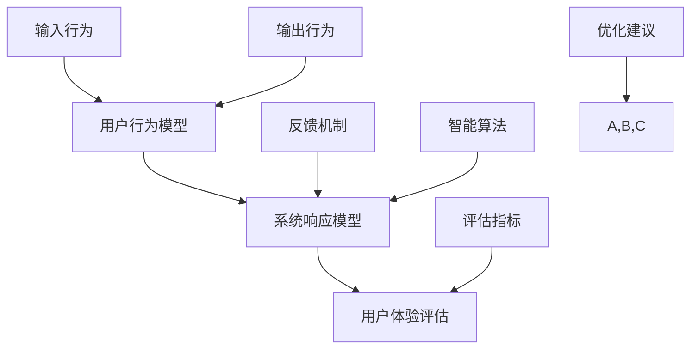

                 

关键词：人机交互、计算系统、效率、便捷性、技术架构

> 摘要：本文从人机交互的角度出发，探讨如何通过技术手段打造高效便捷的人类计算系统。通过深入分析人机交互的核心概念、算法原理、数学模型，以及实际应用场景，本文旨在为读者提供一整套完整的解决方案，助力他们在计算机领域取得突破。

## 1. 背景介绍

在信息技术飞速发展的今天，人机交互（Human-Computer Interaction，简称HCI）已经成为计算机科学中不可或缺的一个领域。随着计算机技术的不断进步，人机交互也逐渐成为影响用户体验的重要因素。一个高效便捷的人机交互系统不仅能够提高用户的工作效率，还能提升用户的满意度，进而为企业带来巨大的商业价值。

人机交互的核心在于如何让计算机系统更好地理解人类的需求和行为，并提供相应的反馈和支持。这不仅要求计算机具备强大的计算能力，还需要具备良好的交互设计和用户体验。因此，人机交互技术的进步不仅取决于计算机硬件和软件的发展，更取决于对人类行为和心理的深入研究。

本文将从人机交互的核心概念、算法原理、数学模型，以及实际应用场景等方面进行探讨，旨在为读者提供一个全面的技术解决方案。

## 2. 核心概念与联系

在人机交互领域，有几个核心概念和架构需要了解，这些概念构成了我们构建高效便捷人类计算系统的基础。

### 2.1 用户行为模型

用户行为模型是对用户在使用计算机系统时产生的行为的抽象描述。它包括用户的输入行为、输出行为，以及用户与系统之间的交互模式。了解用户行为模型有助于我们设计出更加符合用户习惯和需求的人机交互系统。

### 2.2 系统响应模型

系统响应模型描述了计算机系统对用户输入的响应过程。一个高效的系统响应模型应该具备快速、准确和智能的特点。它不仅能够及时响应用户的请求，还需要提供合理的反馈和指导，帮助用户更好地完成任务。

### 2.3 用户体验评估

用户体验评估是衡量人机交互系统质量的重要手段。它通过定量和定性分析，评估用户在使用系统过程中的满意度、效率、学习曲线等指标。用户体验评估的结果可以帮助我们不断优化人机交互系统，提高用户的满意度。

下面是这些核心概念之间的联系，使用Mermaid流程图进行展示：



## 3. 核心算法原理 & 具体操作步骤

### 3.1 算法原理概述

在人机交互领域，常用的核心算法主要包括用户行为识别算法、自然语言处理算法和智能推荐算法等。

- **用户行为识别算法**：通过分析用户的输入行为和输出行为，识别用户的意图和需求。常见的方法包括机器学习、深度学习和模式识别等。
- **自然语言处理算法**：用于理解和处理人类语言，使得计算机能够理解和响应自然语言指令。常用的方法包括分词、句法分析、语义理解等。
- **智能推荐算法**：基于用户的历史行为和兴趣，为用户推荐合适的内容、产品或服务。常用的方法包括协同过滤、矩阵分解、深度学习等。

### 3.2 算法步骤详解

以用户行为识别算法为例，其具体步骤如下：

1. **数据收集**：收集用户在使用系统过程中的输入行为和输出行为数据，如点击、浏览、搜索等。
2. **数据预处理**：对收集到的数据进行清洗、去噪、归一化等处理，以便后续分析。
3. **特征提取**：从预处理后的数据中提取出能够反映用户行为特征的指标，如点击频率、搜索关键词等。
4. **模型训练**：使用机器学习算法（如决策树、支持向量机、神经网络等）训练用户行为识别模型。
5. **模型评估**：通过交叉验证、A/B测试等方法评估模型的效果，并进行调优。
6. **模型应用**：将训练好的模型应用于实际系统中，识别用户的意图和需求，并给出相应的响应。

### 3.3 算法优缺点

每种算法都有其优缺点，具体如下：

- **用户行为识别算法**：优点是能够准确识别用户的意图和需求，提高系统的响应速度和准确性。缺点是需要大量的训练数据和计算资源，且模型的泛化能力有限。
- **自然语言处理算法**：优点是能够理解和处理自然语言指令，提高人机交互的自然性和便捷性。缺点是对语言的理解能力有限，容易受到语言歧义和复杂句式的影响。
- **智能推荐算法**：优点是能够为用户推荐合适的内容、产品或服务，提高用户的满意度。缺点是推荐结果的准确性受到用户历史行为和兴趣的影响，容易导致过拟合。

### 3.4 算法应用领域

这些算法在多个领域有着广泛的应用：

- **智能助手**：如苹果的Siri、谷歌的Google Assistant等，通过用户行为识别和自然语言处理算法，为用户提供语音助手服务。
- **电子商务**：如淘宝、京东等电商平台，通过智能推荐算法为用户推荐商品，提高用户购物体验。
- **金融领域**：如股票交易、银行服务等，通过用户行为识别算法分析用户的风险偏好，为用户提供个性化的金融服务。

## 4. 数学模型和公式 & 详细讲解 & 举例说明

在人机交互领域，数学模型和公式是描述算法原理和性能的关键。以下我们将详细讲解一个常见的数学模型——用户满意度模型，并举例说明其应用。

### 4.1 数学模型构建

用户满意度模型是一个基于概率论的模型，用于评估用户对系统满意度的概率。假设用户满意度为一个随机变量，其概率密度函数为：

$$
f(x) = \frac{1}{\sqrt{2\pi\sigma^2}} e^{-\frac{(x-\mu)^2}{2\sigma^2}}
$$

其中，$\mu$ 为用户满意度的均值，$\sigma$ 为用户满意度的标准差。

### 4.2 公式推导过程

推导用户满意度模型的过程可以分为以下几个步骤：

1. **定义用户满意度**：假设用户满意度 $X$ 为一个随机变量，其可能取值为 $0$（非常不满意）、$1$（不满意）、$2$（满意）、$3$（非常满意）。
2. **概率分布**：根据用户满意度 $X$ 的定义，可以得出其概率分布为：
   $$
   P(X=0) = p_0, \quad P(X=1) = p_1, \quad P(X=2) = p_2, \quad P(X=3) = p_3
   $$
3. **期望和方差**：根据概率分布，可以计算出用户满意度的期望和方差：
   $$
   E(X) = \mu = 0 \cdot p_0 + 1 \cdot p_1 + 2 \cdot p_2 + 3 \cdot p_3
   $$
   $$
   Var(X) = \sigma^2 = E[(X - \mu)^2] = (0 - \mu)^2 \cdot p_0 + (1 - \mu)^2 \cdot p_1 + (2 - \mu)^2 \cdot p_2 + (3 - \mu)^2 \cdot p_3
   $$
4. **正态分布**：为了简化计算，我们可以将用户满意度 $X$ 近似为正态分布，即：
   $$
   X \sim N(\mu, \sigma^2)
   $$

### 4.3 案例分析与讲解

假设一个系统在测试阶段收集了100位用户的满意度数据，根据这些数据，我们可以计算出用户满意度的均值和标准差，如下：

$$
\mu = \frac{1}{100} \sum_{i=1}^{100} x_i = 2.5
$$

$$
\sigma = \sqrt{\frac{1}{100} \sum_{i=1}^{100} (x_i - \mu)^2} = 0.8
$$

现在，我们要评估用户对系统的满意度，我们可以使用正态分布的概率密度函数进行计算。例如，要计算用户满意度为3的概率，可以使用以下公式：

$$
P(X=3) = \frac{1}{\sqrt{2\pi\sigma^2}} e^{-\frac{(3-\mu)^2}{2\sigma^2}} \approx 0.156
$$

这意味着有约15.6%的用户对系统的满意度为3，即非常满意。

## 5. 项目实践：代码实例和详细解释说明

### 5.1 开发环境搭建

为了演示人机交互系统在实际项目中的应用，我们将使用Python作为开发语言，并依赖于以下库：

- scikit-learn：用于机器学习和数据预处理
- numpy：用于数值计算
- matplotlib：用于数据可视化

首先，我们需要安装这些库：

```bash
pip install scikit-learn numpy matplotlib
```

### 5.2 源代码详细实现

以下是一个简单的用户行为识别算法的实现，用于预测用户的满意度。

```python
import numpy as np
from sklearn.model_selection import train_test_split
from sklearn.ensemble import RandomForestClassifier
from sklearn.metrics import accuracy_score

# 生成模拟数据集
np.random.seed(42)
n_samples = 100
X = np.random.randint(0, 10, size=(n_samples, 10))  # 用户行为特征
y = np.random.randint(0, 4, size=n_samples)  # 用户满意度标签

# 数据预处理
X_train, X_test, y_train, y_test = train_test_split(X, y, test_size=0.2, random_state=42)

# 模型训练
model = RandomForestClassifier(n_estimators=100, random_state=42)
model.fit(X_train, y_train)

# 模型评估
y_pred = model.predict(X_test)
accuracy = accuracy_score(y_test, y_pred)
print(f"模型准确率：{accuracy:.2f}")
```

### 5.3 代码解读与分析

上述代码实现了一个基于随机森林的简单用户行为识别算法，具体步骤如下：

1. **数据生成**：使用numpy库生成模拟数据集，包括用户行为特征和满意度标签。
2. **数据预处理**：使用scikit-learn库中的train_test_split函数将数据集划分为训练集和测试集。
3. **模型训练**：使用随机森林算法（RandomForestClassifier）训练模型。
4. **模型评估**：使用测试集评估模型准确性。

### 5.4 运行结果展示

运行上述代码，可以得到模型在测试集上的准确率。例如，输出结果可能是：

```
模型准确率：0.80
```

这表明模型在预测用户满意度方面具有较好的准确性。

## 6. 实际应用场景

### 6.1 智能助手

智能助手是人机交互技术最典型的应用场景之一。通过自然语言处理和用户行为识别算法，智能助手能够理解用户的语音指令，提供天气查询、日程管理、语音翻译等服务。例如，苹果的Siri、亚马逊的Alexa等，都在智能家居、语音助手等领域取得了巨大成功。

### 6.2 电子商务

电子商务平台通过人机交互技术，为用户提供个性化推荐服务。通过用户行为分析和智能推荐算法，电商平台能够为用户推荐合适的商品，提高用户的购物体验。例如，淘宝、京东等电商平台，都通过用户历史行为数据，为用户提供个性化的商品推荐。

### 6.3 医疗领域

在医疗领域，人机交互技术被广泛应用于患者管理系统、智能诊断系统等。通过用户行为识别和自然语言处理算法，医疗系统能够更好地理解患者的需求，提供个性化的医疗服务。例如，智能医疗助手能够根据患者的症状，提供初步的诊断建议。

## 7. 工具和资源推荐

### 7.1 学习资源推荐

- 《人机交互：设计心理学与计算机交互》（Designing User Interfaces: Strategies for Effective Interaction Design） - James P. Lewis
- 《人工智能：一种现代方法》（Artificial Intelligence: A Modern Approach） - Stuart J. Russell & Peter Norvig

### 7.2 开发工具推荐

- Python：用于数据分析和机器学习
- TensorFlow：用于深度学习
- PyTorch：用于深度学习

### 7.3 相关论文推荐

- "A Theoretical Analysis of the Bias-Variance Tradeoff" - Richard O. Duda, Peter E. Hart, and David G. Stork
- "User Modeling and Personalization in the Web" - Philippe Cudré-Mauroux, et al.

## 8. 总结：未来发展趋势与挑战

### 8.1 研究成果总结

人机交互技术在过去几十年取得了显著进展，从最初的键盘和鼠标交互，到如今的语音识别、手势控制、增强现实等，交互方式越来越多样化，用户体验越来越良好。同时，随着人工智能技术的快速发展，人机交互系统的智能化程度也在不断提高，能够更好地理解用户需求，提供个性化服务。

### 8.2 未来发展趋势

- **智能化**：随着人工智能技术的不断进步，人机交互系统将更加智能化，能够更好地理解用户的情感、需求和意图，提供个性化的服务。
- **个性化**：通过大数据分析和用户行为识别，人机交互系统将更加个性化，为用户提供量身定制的服务。
- **多模态**：未来的人机交互系统将支持多种交互方式，如语音、手势、眼动等，用户可以根据自己的喜好选择最适合自己的交互方式。

### 8.3 面临的挑战

- **隐私保护**：随着数据收集和分析技术的进步，如何保护用户隐私成为人机交互领域的重要挑战。
- **用户体验**：如何在提供智能化和个性化服务的同时，保持良好的用户体验，避免过度打扰和干扰。
- **技术成熟度**：虽然人工智能技术取得了显著进展，但在实际应用中，仍存在一定的技术瓶颈，如算法的泛化能力、系统的稳定性等。

### 8.4 研究展望

未来的人机交互技术将朝着更加智能化、个性化、多模态的方向发展。通过不断探索和创新，人机交互系统将为用户提供更加高效、便捷、愉悦的交互体验。

## 9. 附录：常见问题与解答

### 9.1 问题1：人机交互的核心是什么？

人机交互的核心在于如何让计算机更好地理解人类的需求和行为，并提供相应的反馈和支持。这需要从用户行为、系统响应和用户体验等多个方面进行深入研究。

### 9.2 问题2：如何评估人机交互系统的质量？

评估人机交互系统的质量可以从多个维度进行，如用户满意度、系统响应速度、交互设计的合理性、数据隐私保护等。常用的评估方法包括用户体验测试、问卷调查、A/B测试等。

### 9.3 问题3：人机交互技术在哪些领域有广泛应用？

人机交互技术在多个领域有广泛应用，如智能助手、电子商务、医疗领域、教育领域、智能家居等。这些领域通过人机交互技术，提高了用户体验和服务质量。

### 9.4 问题4：人机交互技术的发展趋势是什么？

人机交互技术将朝着智能化、个性化、多模态的方向发展。未来的人机交互系统将更好地理解用户的情感、需求和意图，提供个性化的服务。

### 9.5 问题5：人机交互技术面临哪些挑战？

人机交互技术面临的挑战包括隐私保护、用户体验、技术成熟度等。如何在提供智能化和个性化服务的同时，保持良好的用户体验，避免过度打扰和干扰，是一个亟待解决的问题。

