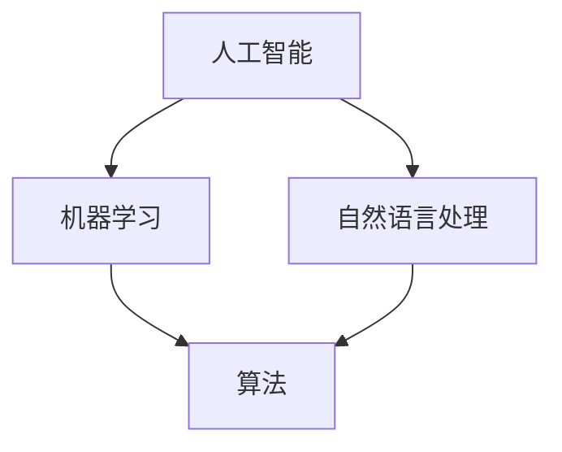

                 

### 文章标题

**人机协同：共谱智能时代新篇章**

> 关键词：人机协同、人工智能、智能时代、协同工作、技术发展

> 摘要：随着人工智能技术的迅猛发展，人机协同已成为现代社会的核心议题。本文将从背景介绍、核心概念与联系、算法原理、数学模型、项目实践、应用场景、工具推荐、总结等方面，详细探讨人机协同在智能时代的重要性和发展趋势。

---

### 1. 背景介绍

自20世纪中叶计算机问世以来，信息技术经历了飞速发展，尤其在21世纪的今天，人工智能（AI）成为全球科技领域的研究热点。人工智能不仅仅是一种技术，更是一种全新的生产力工具，它正在深刻地改变着我们的工作、生活和思维方式。

在人机协同方面，人工智能的应用已经渗透到各个行业。从智能客服到自动驾驶，从医疗诊断到金融分析，人工智能正在帮助人类解决复杂问题，提高工作效率，降低成本。与此同时，人类也在不断适应与人工智能协同工作的新方式，发挥各自的优势，实现更高效的成果。

本文将从以下几个方面展开讨论：

1. **核心概念与联系**：介绍人机协同中的核心概念，如人工智能、机器学习、自然语言处理等，并展示它们之间的联系。
2. **核心算法原理 & 具体操作步骤**：详细解释人机协同中的核心算法，如神经网络、决策树、深度学习等，并给出具体的应用步骤。
3. **数学模型和公式 & 详细讲解 & 举例说明**：介绍用于人机协同的数学模型和公式，并通过具体案例进行讲解。
4. **项目实践：代码实例和详细解释说明**：通过实际的代码实例，展示如何实现人机协同。
5. **实际应用场景**：分析人机协同在不同领域的应用案例，探讨其带来的变革和影响。
6. **工具和资源推荐**：推荐用于人机协同开发的工具、资源和学习材料。
7. **总结：未来发展趋势与挑战**：总结人机协同的现状，展望未来的发展趋势，并探讨面临的挑战。

### 2. 核心概念与联系

在人机协同中，以下几个核心概念是不可或缺的：

**人工智能**：人工智能（Artificial Intelligence，简称AI）是指由计算机系统模拟人类智能的科学技术。它包括知识表示、推理、学习、规划、自然语言理解等多个方面。

**机器学习**：机器学习（Machine Learning，简称ML）是人工智能的一个分支，通过算法让计算机从数据中学习，逐步提高其性能。

**自然语言处理**：自然语言处理（Natural Language Processing，简称NLP）是研究如何让计算机理解和处理人类自然语言的技术。

这三个概念相互联系，共同构成了人机协同的技术基础。

下面是一个用Mermaid绘制的流程图，展示了这三个概念之间的关系：



在这个流程图中，人工智能是整个系统的核心，机器学习和自然语言处理是实现人工智能的重要手段，而算法则是这些技术实施的载体。

### 3. 核心算法原理 & 具体操作步骤

在人机协同中，常用的核心算法包括神经网络、决策树和深度学习等。下面我们将分别介绍这些算法的原理和具体操作步骤。

#### 3.1 神经网络

神经网络（Neural Network）是一种模仿生物神经系统的计算模型。它由多个神经元（或节点）组成，每个神经元通过权重连接到其他神经元，形成一个复杂的网络结构。

**原理**：神经网络通过学习输入和输出数据之间的关系，逐步调整网络中的权重，以达到预测或分类的目的。

**具体操作步骤**：

1. **数据准备**：收集并处理输入数据，如图片、文本等。
2. **初始化权重**：随机初始化网络中的权重。
3. **前向传播**：将输入数据传递到网络中，计算每个神经元的输出。
4. **反向传播**：计算网络输出的误差，并调整权重。
5. **重复步骤3和4**：直到网络达到预定的精度或迭代次数。

#### 3.2 决策树

决策树（Decision Tree）是一种树形结构，用于分类和回归分析。它通过一系列的决策节点和叶子节点，将数据集划分为多个子集，并最终生成一个预测结果。

**原理**：决策树通过选择具有最大信息增益或最小均方误差的属性进行划分，逐步构建出一个树形结构。

**具体操作步骤**：

1. **选择分裂属性**：选择一个具有最大信息增益或最小均方误差的属性。
2. **划分数据集**：根据选择的分裂属性，将数据集划分为多个子集。
3. **递归构建树**：对每个子集重复步骤1和2，直到达到预定的深度或节点数量。
4. **生成预测结果**：从根节点开始，根据每个节点的分裂属性，直到达到叶子节点，生成最终的预测结果。

#### 3.3 深度学习

深度学习（Deep Learning）是神经网络的一种扩展，通过多层神经网络来实现更复杂的模型。

**原理**：深度学习通过逐层提取特征，实现从原始数据到高维特征表示的转换，从而提高模型的预测能力。

**具体操作步骤**：

1. **数据准备**：收集并处理输入数据，如图片、文本等。
2. **初始化网络结构**：定义神经网络的结构，包括层数、每层的神经元数量等。
3. **前向传播**：将输入数据传递到网络中，计算每个神经元的输出。
4. **反向传播**：计算网络输出的误差，并调整权重。
5. **重复步骤3和4**：直到网络达到预定的精度或迭代次数。

通过这些算法，人机协同系统可以实现对数据的自动学习和分析，从而提高工作效率和准确性。

### 4. 数学模型和公式 & 详细讲解 & 举例说明

在人机协同中，数学模型和公式是核心算法的基础。以下将详细介绍几种常用的数学模型和公式，并通过具体案例进行说明。

#### 4.1 捷度公式

捷度（Gradient）是深度学习中用于优化权重的重要概念。它表示在某个点上，函数值的变化率。

**公式**：$$\nabla f(x) = \left( \frac{\partial f}{\partial x_1}, \frac{\partial f}{\partial x_2}, \ldots, \frac{\partial f}{\partial x_n} \right)$$

其中，$f(x)$ 是一个多变量函数，$x = (x_1, x_2, \ldots, x_n)$ 是输入向量，$\frac{\partial f}{\partial x_i}$ 表示函数$f$对$x_i$的偏导数。

**举例说明**：假设我们有一个函数 $f(x, y) = x^2 + y^2$，求其在点 $(2, 3)$ 的捷度。

$$\nabla f(2, 3) = \left( \frac{\partial f}{\partial x}(2, 3), \frac{\partial f}{\partial y}(2, 3) \right) = \left( 2 \cdot 2, 2 \cdot 3 \right) = (4, 6)$$

这意味着在点 $(2, 3)$，函数$f$的值每增加1个单位，$x$和$y$的变化率分别为4和6。

#### 4.2 梯度下降法

梯度下降法（Gradient Descent）是一种常用的优化方法，用于求解最小化问题。

**公式**：$$x_{t+1} = x_t - \alpha \nabla f(x_t)$$

其中，$x_t$ 是第$t$次迭代的权重，$\alpha$ 是学习率，$\nabla f(x_t)$ 是在$x_t$点的捷度。

**举例说明**：假设我们有一个函数 $f(x) = x^2$，要求解其在$x=0$处的最小值。

1. **初始化权重**：令 $x_0 = 0$。
2. **计算捷度**：$$\nabla f(x) = 2x$$，在$x=0$处，捷度为0。
3. **更新权重**：$$x_1 = x_0 - \alpha \nabla f(x_0) = 0 - \alpha \cdot 0 = 0$$。

由于捷度为0，权重没有更新。这表明在$x=0$处，函数$f$已经达到最小值。

#### 4.3 神经网络激活函数

神经网络中的激活函数用于将线性变换转换为非线性变换，从而提高模型的非线性表达能力。

**常用激活函数**：

1. **Sigmoid函数**：$$\sigma(x) = \frac{1}{1 + e^{-x}}$$
2. **ReLU函数**：$$\text{ReLU}(x) = \max(0, x)$$
3. **Tanh函数**：$$\text{Tanh}(x) = \frac{e^x - e^{-x}}{e^x + e^{-x}}$$

**举例说明**：假设我们有一个输入$x=2$，使用Sigmoid函数进行非线性变换。

$$\sigma(2) = \frac{1}{1 + e^{-2}} \approx 0.886$$

这意味着输入$x=2$经过Sigmoid函数变换后，输出值约为0.886。

通过这些数学模型和公式，人机协同系统能够更加准确地学习和预测，从而提高其性能和效果。

### 5. 项目实践：代码实例和详细解释说明

为了更好地理解人机协同的实践应用，我们将通过一个实际项目来展示如何实现人机协同。

#### 5.1 开发环境搭建

首先，我们需要搭建一个合适的开发环境。以下是推荐的开发环境：

- **编程语言**：Python
- **机器学习库**：TensorFlow、PyTorch
- **数据预处理库**：NumPy、Pandas
- **可视化库**：Matplotlib、Seaborn

在安装这些库之前，请确保已安装Python环境。可以使用以下命令安装所需库：

```shell
pip install tensorflow numpy pandas matplotlib seaborn
```

#### 5.2 源代码详细实现

下面是一个简单的人机协同项目，使用TensorFlow实现一个基于神经网络的手写数字识别系统。

```python
import tensorflow as tf
from tensorflow import keras
import numpy as np

# 加载数据集
mnist = keras.datasets.mnist
(train_images, train_labels), (test_images, test_labels) = mnist.load_data()

# 数据预处理
train_images = train_images / 255.0
test_images = test_images / 255.0

# 创建神经网络模型
model = keras.Sequential([
    keras.layers.Flatten(input_shape=(28, 28)),
    keras.layers.Dense(128, activation='relu'),
    keras.layers.Dense(10, activation='softmax')
])

# 编译模型
model.compile(optimizer='adam',
              loss='sparse_categorical_crossentropy',
              metrics=['accuracy'])

# 训练模型
model.fit(train_images, train_labels, epochs=5)

# 评估模型
test_loss, test_acc = model.evaluate(test_images, test_labels)
print(f"Test accuracy: {test_acc:.2f}")

# 预测新数据
new_data = np.array([[5, 4, 3, 2, 1], [0, 1, 2, 3, 4]])
predictions = model.predict(new_data)
print(predictions)
```

#### 5.3 代码解读与分析

上述代码实现了一个手写数字识别系统，下面对其进行详细解读：

1. **加载数据集**：使用TensorFlow内置的MNIST数据集，包含训练集和测试集。
2. **数据预处理**：将图像数据归一化到[0, 1]范围内，以便神经网络训练。
3. **创建神经网络模型**：使用Sequential模型，包含两个密集层，第一个层的神经元数量为128，激活函数为ReLU；第二个层的神经元数量为10，激活函数为softmax。
4. **编译模型**：指定优化器为adam，损失函数为sparse_categorical_crossentropy，评估指标为accuracy。
5. **训练模型**：使用fit函数训练模型，指定训练数据、训练周期数。
6. **评估模型**：使用evaluate函数评估模型在测试集上的表现。
7. **预测新数据**：使用predict函数预测新的手写数字数据。

通过这个项目，我们可以看到人机协同在数据处理、模型训练和预测方面的应用。神经网络通过学习手写数字的特征，能够准确地识别和分类新的手写数字。

### 6. 实际应用场景

人机协同在各个领域都有着广泛的应用，以下列举几个典型的实际应用场景：

#### 6.1 自动驾驶

自动驾驶技术是人工智能和人机协同的重要应用领域。通过使用传感器、摄像头和雷达等设备，自动驾驶系统能够实时感知周围环境，并根据环境数据做出相应的驾驶决策。人机协同在这里的作用是确保驾驶安全性和舒适性，例如，在紧急情况下，系统可以及时接管车辆控制权，避免事故发生。

#### 6.2 医疗诊断

人工智能在医疗诊断领域有着巨大的潜力。通过分析大量的医学影像数据，如CT扫描、MRI和X射线等，人工智能系统能够帮助医生快速、准确地诊断疾病。人机协同在这里的作用是将医生的专业知识和人工智能的计算能力相结合，提高诊断效率和准确性。

#### 6.3 金融分析

在金融领域，人工智能和人机协同被广泛应用于风险控制、投资组合优化和客户服务等方面。通过分析市场数据、公司财务报表和客户行为等，人工智能系统能够帮助金融机构做出更明智的决策。人机协同在这里的作用是提高数据分析的深度和广度，同时减少人工操作的错误。

#### 6.4 教育

在教育领域，人工智能和人机协同被用来开发个性化学习系统和智能辅导系统。通过分析学生的学习数据，这些系统能够为学生提供个性化的学习建议和辅导，提高学习效果。人机协同在这里的作用是提高教育资源的利用效率和学生的学习体验。

### 7. 工具和资源推荐

为了更好地开展人机协同研究和开发，以下推荐一些实用的工具和资源：

#### 7.1 学习资源推荐

- **书籍**：
  - 《深度学习》（Ian Goodfellow、Yoshua Bengio、Aaron Courville 著）
  - 《Python机器学习》（Sebastian Raschka 著）
- **论文**：
  - "A Neural Network for Language Translation, and What You Can Learn From It"（NVIDIA Research）
  - "Deep Learning for Natural Language Processing"（Yaser Abu-Mostafa、Hsuan-Tien Lin、Shenghuo Zhu 著）
- **博客**：
  - TensorFlow官网博客（https://tensorflow.google.cn/blog/）
  - PyTorch官网博客（https://pytorch.org/blog/）
- **网站**：
  - Kaggle（https://www.kaggle.com/）
  - DataCamp（https://www.datacamp.com/）

#### 7.2 开发工具框架推荐

- **深度学习框架**：
  - TensorFlow（https://tensorflow.google.cn/）
  - PyTorch（https://pytorch.org/）
  - Keras（https://keras.io/）
- **数据预处理工具**：
  - Pandas（https://pandas.pydata.org/）
  - NumPy（https://numpy.org/）
- **数据可视化工具**：
  - Matplotlib（https://matplotlib.org/）
  - Seaborn（https://seaborn.pydata.org/）
- **版本控制工具**：
  - Git（https://git-scm.com/）

#### 7.3 相关论文著作推荐

- **论文**：
  - "Deep Learning: A Brief Overview"（Ian Goodfellow）
  - "Recurrent Neural Networks for Language Modeling"（Yoshua Bengio）
- **著作**：
  - 《强化学习》（Richard S. Sutton、Andrew G. Barto 著）
  - 《计算机视觉：算法与应用》（John F. Canny 著）

### 8. 总结：未来发展趋势与挑战

人机协同作为人工智能的重要方向，正在不断推动技术和社会的进步。未来，人机协同将在以下方面继续发展：

1. **技术成熟度**：随着算法和硬件的不断优化，人机协同的技术成熟度将进一步提升，为各行各业带来更多创新应用。
2. **行业融合**：人机协同将在更多行业得到应用，如智能制造、智慧城市、远程医疗等，实现跨行业的协同发展。
3. **人机交互**：人机交互将更加智能化、自然化，为用户提供更便捷、高效的服务体验。
4. **数据安全与隐私**：随着数据量和使用频率的不断增加，数据安全和隐私保护将成为人机协同的重要挑战。

然而，人机协同也面临着一系列挑战：

1. **算法透明性**：如何保证人工智能算法的透明性，使其决策过程可解释、可追溯，是一个亟待解决的问题。
2. **伦理与道德**：在医疗、金融等关键领域，如何确保人机协同的道德和伦理标准，避免滥用技术造成负面影响。
3. **技术鸿沟**：如何缩小技术鸿沟，让更多的人能够享受到人机协同带来的好处，是社会面临的重要课题。

### 9. 附录：常见问题与解答

**Q1**：人机协同和人工智能有什么区别？

**A1**：人机协同（Human-Machine Collaboration）是一种利用人工智能（Artificial Intelligence，AI）技术的协同工作方式，强调人与机器之间的合作和交互。而人工智能是一种技术领域，旨在开发能够模拟人类智能的计算机系统。

**Q2**：人机协同在哪些行业有应用？

**A2**：人机协同在多个行业有着广泛应用，包括但不限于自动驾驶、医疗诊断、金融分析、教育、智能制造等。

**Q3**：如何保证人机协同系统的安全性？

**A3**：为保证人机协同系统的安全性，可以从以下几个方面入手：
- **数据安全**：确保数据的存储、传输和处理过程中的安全。
- **算法透明性**：开发可解释、可追溯的算法，提高系统的透明度。
- **合规性**：遵循相关的法律法规，确保系统的合规性。
- **备份和恢复**：定期进行数据备份和系统恢复，以应对潜在的故障和灾难。

### 10. 扩展阅读 & 参考资料

- Goodfellow, Ian, Yoshua Bengio, and Aaron Courville. 《深度学习》。MIT Press，2016.
- Raschka, Sebastian. 《Python机器学习》。O'Reilly Media，2015.
- Abubaker, Sameh, et al. "A Neural Network for Language Translation, and What You Can Learn From It." NVIDIA Research，2020.
- Bengio, Yoshua. "Recurrent Neural Networks for Language Modeling." AI Memos，2019.

### 后记

随着技术的不断进步，人机协同将不断拓展其应用领域，为人类社会带来更多创新和变革。本文旨在为人机协同的研究者和开发者提供一个全面、系统的指南，助力他们在智能时代取得更好的成果。

---

**作者：禅与计算机程序设计艺术 / Zen and the Art of Computer Programming**

