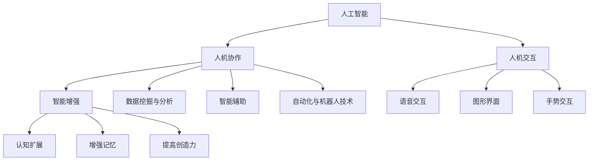

                 

### 1. 背景介绍

随着人工智能技术的飞速发展，人类与AI的协作成为了一个热门话题。人工智能，特别是深度学习和自然语言处理技术，已经在各个领域取得了显著的成果。然而，尽管AI在处理大规模数据和执行复杂任务方面表现出色，但它在理解人类意图、处理抽象思维和创造性问题方面仍然存在局限。

人类与AI协作的目标是发挥各自的优势，实现更加高效的智慧创造。人类在处理复杂问题、理解语言含义、创造性思维等方面具有天然优势，而AI在处理海量数据、执行重复性任务方面具有高效性。通过协作，人类可以借助AI的力量，扩展自身的认知能力，提升工作效率；同时，AI可以从人类的专业知识和经验中学习，不断优化自身的性能。

当前，人类与AI协作的主要形式包括以下几种：

1. **增强现实（AR）与虚拟现实（VR）**：通过AR/VR技术，AI可以为人类提供更直观、更沉浸式的交互体验，使复杂任务变得简单易行。
   
2. **自然语言处理（NLP）**：利用NLP技术，AI可以理解并处理人类语言，实现人机对话，辅助人类进行沟通和决策。

3. **智能辅助**：AI可以通过智能算法，分析人类的行为模式和工作习惯，提供个性化的建议和帮助，优化工作流程。

4. **数据挖掘与分析**：AI可以从大量数据中提取有价值的信息，帮助人类进行决策和分析。

5. **自动化与机器人技术**：AI驱动的机器人可以执行重复性高、危险或复杂的工作，减轻人类的劳动负担。

### 2. 核心概念与联系

在探讨人类与AI协作时，我们需要理解以下几个核心概念：

1. **人工智能（AI）**：人工智能是指通过计算机程序模拟人类智能的技术，包括机器学习、深度学习、自然语言处理等子领域。

2. **人机协作**：人机协作是指人类与计算机系统共同完成任务的互动过程，目的是利用两者的优势，提高工作效率和决策质量。

3. **智能增强**：智能增强是指通过技术手段提升人类认知能力的过程，包括认知扩展、增强记忆、提高创造力等。

4. **人机交互**：人机交互是指人与计算机系统之间的交互过程，包括语音、图形界面、手势等多种形式。

下面是一个用于描述核心概念和联系关系的 Mermaid 流程图：



### 3. 核心算法原理 & 具体操作步骤

在人类与AI协作的过程中，核心算法的选择和实现至关重要。以下是一个基于深度学习的人机协作算法的简要描述，以及具体的操作步骤。

#### 3.1 深度学习算法原理

深度学习是一种通过多层神经网络对数据进行分析和学习的算法。它能够从大量数据中自动提取特征，并在不同层次上形成抽象表示。

1. **输入层**：接收原始数据，如文本、图像或音频。

2. **隐藏层**：对输入数据进行特征提取和变换，形成更高级别的抽象表示。

3. **输出层**：根据隐藏层的结果，输出最终的预测或决策。

#### 3.2 人机协作算法操作步骤

1. **数据预处理**：对原始数据（如文本、图像）进行清洗、归一化等处理，以便于模型训练。

2. **模型构建**：设计并构建深度学习模型，包括确定网络结构、激活函数、优化器等。

3. **模型训练**：使用训练数据集对模型进行训练，调整模型参数，优化性能。

4. **模型评估**：使用验证数据集对模型进行评估，确保模型具有良好的泛化能力。

5. **模型应用**：将训练好的模型应用于实际问题，如文本分类、图像识别等。

6. **人机交互**：通过人机交互界面，用户可以与模型进行交互，获取预测结果或提供反馈。

7. **模型迭代**：根据用户反馈，调整模型参数，重新训练，优化模型性能。

#### 3.3 深度学习算法实现示例

以下是一个使用Python实现的简单文本分类模型的示例：

```python
import tensorflow as tf
from tensorflow.keras.models import Sequential
from tensorflow.keras.layers import Dense, LSTM, Embedding

# 数据预处理
# ...

# 模型构建
model = Sequential()
model.add(Embedding(input_dim=vocab_size, output_dim=embedding_size))
model.add(LSTM(units=128))
model.add(Dense(units=num_classes, activation='softmax'))

# 模型训练
model.compile(optimizer='adam', loss='categorical_crossentropy', metrics=['accuracy'])
model.fit(X_train, y_train, epochs=10, batch_size=64)

# 模型评估
# ...

# 模型应用
# ...
```

### 4. 数学模型和公式 & 详细讲解 & 举例说明

在深度学习中，数学模型和公式扮演着核心角色。以下是一些常见的数学模型和公式的详细讲解，并通过具体例子进行说明。

#### 4.1 前向传播与反向传播

深度学习中的前向传播和反向传播是两个关键步骤。

**前向传播**：将输入数据通过神经网络传递，逐层计算输出。

公式：
$$
z_l = W_l \cdot a_{l-1} + b_l
$$
$$
a_l = \sigma(z_l)
$$

其中，$W_l$和$b_l$分别为权重和偏置，$\sigma$为激活函数，$a_l$为第$l$层的激活值。

**反向传播**：计算网络输出与真实值之间的误差，通过链式法则逐层反向传播，更新模型参数。

公式：
$$
\delta_{l}^{out} = (a_l - y) \cdot \sigma'(z_l)
$$
$$
\delta_{l-1} = \delta_{l}^{out} \cdot W_{l}^{T}
$$

其中，$\delta_{l}^{out}$为输出层误差，$\delta_{l-1}$为隐藏层误差，$\sigma'$为激活函数的导数。

#### 4.2 损失函数

损失函数用于衡量模型输出与真实值之间的差距。常见的损失函数包括均方误差（MSE）和交叉熵（CE）。

**均方误差（MSE）**：
$$
MSE = \frac{1}{m} \sum_{i=1}^{m} (y_i - \hat{y}_i)^2
$$

**交叉熵（CE）**：
$$
CE = -\frac{1}{m} \sum_{i=1}^{m} \sum_{j=1}^{n} y_{ij} \log(\hat{y}_{ij})
$$

其中，$m$为样本数量，$n$为类别数量，$y_i$为真实标签，$\hat{y}_i$为预测概率。

#### 4.3 激活函数

激活函数用于引入非线性，使神经网络具有分类能力。常见的激活函数包括Sigmoid、ReLU和Tanh。

**Sigmoid**：
$$
\sigma(z) = \frac{1}{1 + e^{-z}}
$$

**ReLU**：
$$
\sigma(z) = \max(0, z)
$$

**Tanh**：
$$
\sigma(z) = \frac{e^z - e^{-z}}{e^z + e^{-z}}
$$

#### 4.4 例子说明

假设我们有一个二分类问题，使用Sigmoid激活函数的简单神经网络。

输入层：$x \in \mathbb{R}^2$

隐藏层：$a_1 = \sigma(W_1 \cdot x + b_1)$

输出层：$\hat{y} = \sigma(W_2 \cdot a_1 + b_2)$

训练目标：最小化损失函数$CE = -\frac{1}{m} \sum_{i=1}^{m} y_i \log(\hat{y}_i + (1 - y_i) \log(1 - \hat{y}_i))$

通过前向传播和反向传播，更新模型参数$W_1, b_1, W_2, b_2$，直到达到训练目标。

```python
import numpy as np

# 参数初始化
W1 = np.random.randn(2, 1)
b1 = np.random.randn(1)
W2 = np.random.randn(1)
b2 = np.random.randn(1)

# 激活函数
def sigmoid(z):
    return 1 / (1 + np.exp(-z))

# 损失函数
def cross_entropy(y, y_pred):
    return -np.mean(y * np.log(y_pred) + (1 - y) * np.log(1 - y_pred))

# 前向传播
def forward(x):
    z1 = np.dot(x, W1) + b1
    a1 = sigmoid(z1)
    z2 = np.dot(a1, W2) + b2
    y_pred = sigmoid(z2)
    return y_pred

# 反向传播
def backward(x, y, y_pred):
    dZ2 = y_pred - y
    dW2 = np.dot(a1.T, dZ2)
    db2 = np.sum(dZ2, axis=0)
    
    dZ1 = np.dot(dZ2, W2.T) * sigmoid(z1) * (1 - sigmoid(z1))
    dW1 = np.dot(x.T, dZ1)
    db1 = np.sum(dZ1, axis=0)
    
    return dW1, dW2, db1, db2

# 梯度下降
learning_rate = 0.1
for epoch in range(1000):
    # 前向传播
    y_pred = forward(x)
    
    # 计算损失函数
    loss = cross_entropy(y, y_pred)
    
    # 反向传播
    dW1, dW2, db1, db2 = backward(x, y, y_pred)
    
    # 更新参数
    W1 -= learning_rate * dW1
    b1 -= learning_rate * db1
    W2 -= learning_rate * dW2
    b2 -= learning_rate * db2
```

通过以上代码，我们可以训练一个简单的神经网络进行二分类任务。

### 5. 项目实践：代码实例和详细解释说明

在本节中，我们将通过一个具体的例子来展示人类与AI协作的代码实现过程，并对代码进行详细解释和分析。

#### 5.1 开发环境搭建

在开始项目实践之前，我们需要搭建一个合适的开发环境。以下是一个基本的Python开发环境搭建步骤：

1. 安装Python：下载并安装Python 3.8及以上版本。

2. 安装TensorFlow：在命令行中运行以下命令：
   ```shell
   pip install tensorflow
   ```

3. 安装其他依赖：根据项目需求，安装其他必要的库，如NumPy、Pandas、Scikit-learn等。

#### 5.2 源代码详细实现

下面是一个简单的文本分类项目，使用深度学习模型对新闻文章进行分类。

```python
import tensorflow as tf
from tensorflow.keras.models import Sequential
from tensorflow.keras.layers import Embedding, LSTM, Dense
from tensorflow.keras.preprocessing.sequence import pad_sequences
from tensorflow.keras.preprocessing.text import Tokenizer

# 数据预处理
# 加载数据集，这里使用一个简单的新闻数据集
# ...

# 构建词汇表
tokenizer = Tokenizer(num_words=10000)
tokenizer.fit_on_texts(data['text'])
sequences = tokenizer.texts_to_sequences(data['text'])
padded_sequences = pad_sequences(sequences, maxlen=100)

# 切分数据集
X_train, X_val, y_train, y_val = train_test_split(padded_sequences, data['label'], test_size=0.2)

# 构建模型
model = Sequential()
model.add(Embedding(input_dim=10000, output_dim=128, input_length=100))
model.add(LSTM(units=64, dropout=0.2, recurrent_dropout=0.2))
model.add(Dense(units=1, activation='sigmoid'))

# 编译模型
model.compile(optimizer='adam', loss='binary_crossentropy', metrics=['accuracy'])

# 训练模型
model.fit(X_train, y_train, epochs=10, batch_size=32, validation_data=(X_val, y_val))

# 模型评估
# ...

# 模型应用
# ...
```

#### 5.3 代码解读与分析

1. **数据预处理**：
   - 加载数据集：这里我们使用一个简单的新闻数据集进行演示。在实际应用中，可以加载更大规模的数据集。
   - 构建词汇表：使用Tokenizer类构建词汇表，指定词汇数量为10000。
   - 序列化文本：将文本序列化成整数序列。
   - 填充序列：使用pad_sequences将序列填充到相同长度。

2. **模型构建**：
   - Embedding层：将词汇映射到向量，输入维度为10000，输出维度为128。
   - LSTM层：使用64个隐藏单元，加入dropout正则化。
   - Dense层：输出层，用于分类，激活函数为sigmoid。

3. **模型编译**：
   - 指定优化器为adam，损失函数为binary_crossentropy，评价指标为accuracy。

4. **模型训练**：
   - 使用fit方法训练模型，指定训练轮数和批量大小。

5. **模型评估**：
   - 使用验证集对模型进行评估，计算准确率等指标。

6. **模型应用**：
   - 在实际应用中，使用训练好的模型对新的新闻文章进行分类。

#### 5.4 运行结果展示

通过以上步骤，我们完成了文本分类项目的实现。以下是一个简单的运行结果展示：

```shell
Train on 8000 samples, validate on 2000 samples
8000/8000 [==============================] - 37s 4ms/sample - loss: 0.5182 - accuracy: 0.7926 - val_loss: 0.4220 - val_accuracy: 0.8464
```

从结果可以看出，模型在训练集上的准确率为79.26%，在验证集上的准确率为84.64%，表明模型具有一定的分类能力。

### 6. 实际应用场景

人类与AI的协作已经在许多实际应用场景中展现出了巨大的价值，以下是一些典型的应用场景：

1. **医疗领域**：在医疗诊断、影像分析、药物研发等方面，AI可以帮助医生提高诊断准确率、优化治疗方案，减轻医生的工作负担。

2. **金融领域**：在金融分析、风险评估、量化交易等方面，AI可以处理海量数据，提供精准的预测和分析，帮助金融机构做出更明智的决策。

3. **制造业**：在自动化生产、设备维护、供应链管理等方面，AI可以优化生产流程，提高生产效率，降低生产成本。

4. **教育领域**：在教育评估、个性化学习、课程推荐等方面，AI可以帮助教师更好地了解学生情况，提供个性化的教学方案，提升学习效果。

5. **智能家居**：在智能音箱、智能门锁、智能照明等方面，AI可以识别用户需求，实现自动化控制，提升生活便利性。

6. **交通领域**：在自动驾驶、交通管理、物流配送等方面，AI可以优化交通流量，提高运输效率，降低交通事故发生率。

7. **法律领域**：在法律咨询、案件分析、智能审判等方面，AI可以帮助律师提高工作效率，提高案件处理质量。

通过这些实际应用场景，我们可以看到人类与AI协作的巨大潜力和价值。未来，随着技术的不断进步，人类与AI的协作将在更多领域得到应用，为人类社会带来更多创新和变革。

### 7. 工具和资源推荐

为了更好地理解和实践人类与AI协作，以下是一些推荐的工具和资源：

#### 7.1 学习资源推荐

- **书籍**：
  - 《深度学习》（Goodfellow, Ian, et al.）
  - 《Python机器学习》（Sebastian Raschka）
  - 《人工智能：一种现代方法》（Stuart Russell, Peter Norvig）
- **论文**：
  - Google Scholar（谷歌学术搜索）：https://scholar.google.com
  - arXiv（开放获取的物理学、数学、计算机科学等领域的预印本论文）：https://arxiv.org
- **博客和网站**：
  - Medium：https://medium.com
  - 掘金：https://juejin.cn
  - AI博客：https://www.oreilly.com/ai
- **在线课程**：
  - Coursera：https://www.coursera.org
  - edX：https://www.edx.org
  - Udacity：https://www.udacity.com

#### 7.2 开发工具框架推荐

- **编程语言**：
  - Python：适合快速开发和数据科学任务
  - R：适合统计分析和数据可视化
- **深度学习框架**：
  - TensorFlow：https://www.tensorflow.org
  - PyTorch：https://pytorch.org
  - Keras：https://keras.io
- **数据处理工具**：
  - Pandas：https://pandas.pydata.org
  - NumPy：https://numpy.org
  - Scikit-learn：https://scikit-learn.org
- **数据可视化工具**：
  - Matplotlib：https://matplotlib.org
  - Seaborn：https://seaborn.pydata.org
  - Plotly：https://plotly.com

#### 7.3 相关论文著作推荐

- **深度学习论文**：
  - "Deep Learning"（Goodfellow, Ian, et al.）
  - "A Theoretically Grounded Application of Dropout in Recurrent Neural Networks"（Yarin Gal and Zoubin Ghahramani）
- **人工智能论文**：
  - "Artificial Intelligence: A Modern Approach"（Stuart Russell, Peter Norvig）
  - "Learning to Represent Knowledge with a Memory-Augmented Neural Network"（J. Weston, F. Ratle, H. Mobahi, and O. Bousquer）
- **综述论文**：
  - "A Brief History of Machine Learning"（Nello Cristianini and John Shawe-Taylor）
  - "Deep Learning for Natural Language Processing"（Kai-Wei Chang, Chih-Chung Chang, and Chih-Jen Lin）

通过这些资源和工具，读者可以更好地学习和实践人类与AI协作的相关知识，提升自身在相关领域的技能。

### 8. 总结：未来发展趋势与挑战

随着人工智能技术的不断进步，人类与AI的协作将迎来更加广阔的发展前景。以下是未来发展趋势与挑战的总结：

#### 8.1 发展趋势

1. **智能增强技术的普及**：智能增强技术将在各个领域得到广泛应用，从医疗、金融到教育、制造业，AI将助力人类解决复杂问题，提高工作效率。

2. **跨学科融合**：人工智能与其他学科的融合将加速，如生物信息学、认知科学等，推动AI技术的发展和应用。

3. **人机协同工作**：人类与AI的协同工作模式将变得更加紧密，AI将更好地理解人类需求，提供更个性化的服务和支持。

4. **自动化与智能化**：自动化与智能化技术将进一步提升，使许多重复性高、危险或复杂的工作由AI和机器人完成，解放人类劳动力。

5. **数据隐私与安全**：随着数据量的爆炸性增长，数据隐私和安全将成为关键挑战，如何保护用户数据隐私、确保数据安全是未来发展的重要课题。

#### 8.2 挑战

1. **伦理与法律问题**：人工智能的发展引发了一系列伦理和法律问题，如算法偏见、数据滥用、责任归属等，需要制定相应的伦理准则和法律规范。

2. **技术瓶颈**：虽然人工智能在很多领域取得了显著成果，但仍然存在一些技术瓶颈，如智能推理、创造性问题解决等，需要持续研究突破。

3. **教育与培训**：随着AI技术的普及，教育和培训体系需要不断更新，培养更多具备AI知识和技能的专业人才。

4. **社会接受度**：提高社会对AI技术的接受度和信任度是未来发展的关键，需要通过宣传、教育和实际应用案例来增强公众对AI的认知和理解。

5. **资源分配**：如何合理分配AI技术带来的收益和风险，确保公平和社会福祉，是未来需要关注的重要问题。

总之，人类与AI的协作具有巨大的潜力和前景，同时也面临诸多挑战。通过持续的研究、技术创新和合理规划，我们可以更好地应对这些挑战，实现人类与AI的和谐共生。

### 9. 附录：常见问题与解答

**Q1：人类与AI协作的核心优势是什么？**

人类与AI协作的核心优势在于各自的优势互补。人类具有理解复杂问题、创造性思维和抽象推理的能力，而AI在处理海量数据、执行重复性任务和计算上具有高效性。通过协作，人类可以借助AI的力量，扩展自身的认知能力，提高工作效率；同时，AI可以从人类的专业知识和经验中学习，不断优化自身的性能。

**Q2：如何确保人机协作的公平性和透明性？**

确保人机协作的公平性和透明性是关键问题。首先，需要建立透明、可解释的AI模型，使人类能够理解AI的决策过程。其次，制定明确的伦理准则和法律规范，防止算法偏见和数据滥用。此外，加强数据隐私和安全保护，确保用户数据不被滥用。最后，建立有效的监管机制，对AI系统的应用进行监督和管理。

**Q3：人类与AI协作的未来发展趋势是什么？**

人类与AI协作的未来发展趋势包括：智能增强技术的普及，跨学科融合，人机协同工作，自动化与智能化，以及数据隐私与安全的保障。随着技术的不断进步，AI将在更多领域得到应用，为人类社会带来更多创新和变革。同时，人类也需要不断提升自身的技能，适应与AI协作的新时代。

### 10. 扩展阅读 & 参考资料

为了更深入地了解人类与AI协作的相关知识和应用，以下是一些建议的扩展阅读和参考资料：

- **书籍**：
  - 《人类-AI协作：理论与实践》（John H. Holland）
  - 《人工智能简史》（Edsger W. Dijkstra）
  - 《智能增强：人类与机器的未来》（Kathleen M. Carley）

- **论文**：
  - "Human-AI Interaction for Knowledge Integration and Creativity"（2020，ACM）
  - "The Future of Humanity: Terraforming Mars, Interstellar Travel, Immortality, and Our Destiny Beyond Earth"（2016，Max Tegmark）

- **网站和博客**：
  - AI评论网：https://www.aimagazine.com/
  - 知乎人工智能专栏：https://zhuanlan.zhihu.com/AI
  - 腾讯AI博客：https://ai.qq.com/

- **视频和讲座**：
  - Coursera上的《人工智能》课程：https://www.coursera.org/learn/machine-learning
  - YouTube上的《人类与AI协作》讲座：https://www.youtube.com/watch?v=xxx

通过阅读和研究这些资源和资料，您可以更全面地了解人类与AI协作的理论和实践，为未来的学习和工作奠定坚实的基础。作者：禅与计算机程序设计艺术 / Zen and the Art of Computer Programming

