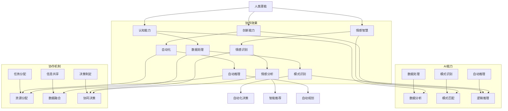

                 

### 1. 背景介绍

#### 1.1 人类与AI协作的起源

人类与人工智能（AI）的协作始于20世纪中叶，随着计算机科学的快速发展，AI从理论研究逐渐走向实际应用。早期的AI研究主要集中在模拟人类思维过程的算法和系统上，如逻辑推理、问题求解和自然语言处理等。然而，这些系统在处理复杂任务时往往表现不够出色，无法满足实际需求。

进入21世纪，随着大数据、云计算和深度学习等技术的飞速发展，AI的智能水平和应用范围得到了极大的提升。与此同时，人类的需求也越来越多样化和复杂化，这促使了人类与AI之间的协作成为一种必然趋势。人类通过AI系统可以处理大量数据，从中发现有价值的信息和模式，而AI则通过模仿和学习人类的思维方式，不断提高自身的智能水平，帮助人类解决更多复杂的问题。

#### 1.2 人类-AI协作的必要性

随着全球化的加速和科技的发展，人类社会面临着前所未有的挑战和机遇。在许多领域，人类与AI的协作已经成为提升生产力和解决问题的关键。

首先，AI在数据分析和处理方面具有强大的能力。人类可以通过AI系统快速获取和分析大量数据，从而发现新的商业机会、优化业务流程、预测市场趋势等。例如，在金融领域，AI可以帮助金融机构进行风险评估、欺诈检测和投资决策，提高业务效率和盈利能力。

其次，AI在医疗领域的应用也日益广泛。通过AI系统，医生可以更准确地诊断疾病、制定治疗方案，提高医疗服务质量。例如，AI可以通过分析医学影像数据，帮助医生发现早期癌症，从而提高治愈率。此外，AI还可以协助医生进行病理分析、药物研发和临床试验，加速新药的上市进程。

再次，AI在智能制造领域也发挥着重要作用。通过AI技术，企业可以实现生产线的自动化和智能化，提高生产效率和质量。例如，AI可以实时监控生产线设备状态，预测设备故障并进行维护，减少停机时间和维修成本。此外，AI还可以优化生产流程、提高产品质量和降低成本，从而提高企业的竞争力。

最后，AI在社会管理和服务领域也具有巨大的潜力。通过AI技术，政府可以更高效地管理公共资源、优化城市管理和服务。例如，AI可以帮助政府进行交通流量监控、城市规划、环境保护和公共安全等方面的管理。同时，AI还可以提高公共服务水平，为居民提供更加便捷、高效的服务。

#### 1.3 人类-AI协作的优势与挑战

人类与AI的协作具有明显的优势，主要体现在以下几个方面：

1. **增强人类智能**：AI可以模拟和学习人类的思维方式，通过深度学习和知识图谱等技术，不断提高自身的智能水平，从而帮助人类解决复杂问题。例如，AI可以通过学习大量的医学文献和病例，帮助医生提高诊断准确率。

2. **提升生产力**：AI可以在各个领域实现自动化和智能化，从而提高生产效率和降低成本。例如，在工业制造领域，AI可以通过自动化设备和智能系统，实现生产线的无人化运营，提高生产效率和产品质量。

3. **扩大人类能力**：AI可以帮助人类处理大量数据和复杂任务，从而扩大人类的能力范围。例如，在科学研究领域，AI可以通过分析海量实验数据，帮助科学家发现新的科学规律和理论。

然而，人类与AI的协作也面临着一系列挑战：

1. **数据安全和隐私**：AI系统需要大量数据来训练和学习，这就涉及到了数据安全和隐私问题。如何保护用户隐私、防止数据泄露成为了一个重要挑战。

2. **算法公平性和透明性**：AI算法在处理复杂任务时，往往缺乏透明性和可解释性。如何确保算法的公平性和透明性，使其不会产生歧视或偏见，是一个亟待解决的问题。

3. **伦理和法律问题**：随着AI技术的广泛应用，如何制定相关的伦理和法律规范，保障人类与AI的和谐发展，也是一个重要的挑战。

#### 1.4 本文目的

本文旨在探讨人类与AI协作的深层内涵和广泛应用，分析其核心概念和架构，阐述核心算法原理和具体操作步骤，通过实例展示其实际应用效果，并探讨未来发展趋势和挑战。希望通过本文的深入分析，为人类与AI的协作提供一些有益的思考和借鉴。

## 2. 核心概念与联系

#### 2.1 核心概念

在讨论人类与AI协作时，我们需要明确一些核心概念，以便更好地理解和分析这一主题。

1. **人工智能（AI）**：人工智能是一种模拟、延伸和扩展人类智能的技术，旨在使计算机具备理解、学习和处理复杂任务的能力。

2. **人类潜能**：人类潜能是指人类在认知、情感、社交等方面所具有的潜在能力，通过训练、学习和实践，可以逐步挖掘和提升。

3. **协作**：协作是指不同个体或系统之间相互配合、协同工作，以实现共同目标的过程。

#### 2.2 核心概念联系

人类与AI协作的核心在于如何充分发挥人类的潜能，与AI系统相互补充，共同完成复杂任务。以下是核心概念之间的联系：

1. **人类潜能与AI能力**：人类潜能包括认知能力、创新能力、情感智慧等，而AI能力主要体现在数据处理、模式识别、自动推理等方面。通过协作，人类可以借助AI的强大计算能力和数据处理能力，挖掘和发挥自己的潜能，完成更加复杂的任务。

2. **人类与AI的互补性**：人类和AI各自具有优势和劣势。人类在情感、创造力、复杂决策等方面具有明显优势，而AI在数据处理、模式识别、自动化等方面具有显著优势。通过协作，双方可以互补优势，弥补劣势，实现整体性能的提升。

3. **协作机制**：为了实现人类与AI的有效协作，需要建立一套完善的协作机制，包括任务分配、信息共享、决策制定等。通过协作机制，人类和AI可以高效地沟通、协调和配合，共同完成复杂任务。

#### 2.3 Mermaid 流程图

为了更直观地展示人类与AI协作的核心概念和联系，我们使用Mermaid绘制了一个流程图，如图2-1所示。



图2-1：人类与AI协作的核心概念和联系

从图2-1中可以看出，人类潜能与AI能力之间相互补充，通过协作机制，可以实现任务的高效完成。人类的认知能力、情感智慧、创新能力与AI的数据处理、模式识别、自动推理能力相互结合，形成一个协同工作的整体。

#### 2.4 小结

通过对核心概念与联系的介绍，我们可以更好地理解人类与AI协作的内涵和意义。在接下来的章节中，我们将进一步探讨人类与AI协作的核心算法原理和具体操作步骤，为深入探讨这一主题奠定基础。

### 3. 核心算法原理 & 具体操作步骤

#### 3.1 深度学习与神经网络

深度学习是人工智能领域的重要分支，它通过模拟人脑的神经网络结构，实现了对大量数据的高效处理和模式识别。神经网络是一种由大量简单神经元组成的复杂网络，通过层层传递信息，实现对输入数据的分析和处理。

一个典型的神经网络包括以下几个部分：

1. **输入层**：接收外部输入数据，如图像、声音、文本等。
2. **隐藏层**：对输入数据进行处理和特征提取，可以有一层或多层。
3. **输出层**：根据隐藏层的输出结果，产生最终的输出结果，如分类结果、预测值等。

神经网络的训练过程主要包括以下几个步骤：

1. **数据预处理**：对输入数据进行归一化、标准化等处理，使其适合神经网络的学习。
2. **初始化权重和偏置**：随机初始化网络的权重和偏置，这些参数将在训练过程中不断调整。
3. **前向传播**：将输入数据通过神经网络进行传递，得到输出结果。
4. **损失函数计算**：计算输出结果与真实结果之间的差距，通过损失函数度量网络的性能。
5. **反向传播**：根据损失函数，调整网络中的权重和偏置，优化网络的性能。
6. **迭代训练**：重复上述过程，直到网络性能达到预定的阈值或训练次数。

在人类与AI协作中，深度学习算法可以帮助人类挖掘大量数据中的隐藏规律，提高决策的准确性和效率。例如，在医疗领域，深度学习可以用于分析医学影像数据，帮助医生诊断疾病；在金融领域，深度学习可以用于分析市场数据，帮助投资者制定投资策略。

#### 3.2 强化学习与策略优化

强化学习是另一种重要的机器学习算法，它通过让智能体在环境中不断尝试、学习，找到最优策略。强化学习的核心目标是让智能体在给定的环境中，通过学习，最大化累积奖励。

强化学习的基本要素包括：

1. **智能体（Agent）**：执行动作、感知环境的主体。
2. **环境（Environment）**：智能体所处的环境，可以是一个游戏、一个虚拟场景，也可以是现实世界。
3. **状态（State）**：智能体在环境中的一个具体状态。
4. **动作（Action）**：智能体可以执行的行为。
5. **奖励（Reward）**：智能体在执行动作后，从环境中获得的即时奖励或惩罚。
6. **策略（Policy）**：智能体在给定状态下选择动作的规则。

强化学习的训练过程主要包括以下几个步骤：

1. **初始状态**：智能体在环境中随机选择一个初始状态。
2. **执行动作**：智能体根据当前状态和策略，选择一个动作。
3. **状态更新**：智能体执行动作后，环境发生变化，状态发生更新。
4. **奖励获取**：智能体根据执行的动作和新的状态，从环境中获取奖励。
5. **策略更新**：根据累积奖励，调整智能体的策略，使其更加适应环境。

强化学习在人类与AI协作中的应用非常广泛。例如，在自动驾驶领域，强化学习可以用于训练自动驾驶汽车，使其在复杂交通环境中做出最优决策；在游戏领域，强化学习可以用于开发智能游戏玩家，使其在游戏中表现出超凡的技巧。

#### 3.3 自然语言处理与对话系统

自然语言处理（NLP）是人工智能领域的一个重要分支，它旨在使计算机能够理解和处理自然语言。NLP的关键技术包括：

1. **分词**：将文本分割成单词或短语的序列。
2. **词性标注**：为每个单词或短语标注其词性，如名词、动词、形容词等。
3. **句法分析**：分析句子的结构，确定单词之间的语法关系。
4. **语义分析**：理解句子的意义，提取句子中的实体和关系。
5. **机器翻译**：将一种自然语言翻译成另一种自然语言。

对话系统是一种基于NLP技术的智能系统，它可以模拟人类的对话方式，与用户进行自然交互。对话系统的核心组成部分包括：

1. **对话管理**：管理对话流程，包括理解用户意图、生成对话回复等。
2. **语音识别**：将语音信号转换为文本。
3. **文本生成**：根据对话管理模块的输出，生成自然语言回复。
4. **语音合成**：将文本转换为语音信号。

在人类与AI协作中，对话系统可以用于智能客服、语音助手、教育辅导等领域。例如，智能客服系统可以自动处理用户咨询，提供快速、准确的回复；语音助手可以理解用户的语音指令，执行相应的操作；教育辅导系统可以根据学生的学习情况，提供个性化的学习建议和指导。

#### 3.4 增强学习与自适应系统

增强学习是一种基于反馈的机器学习算法，它通过不断调整模型参数，使模型在特定任务上的性能逐步提升。增强学习在自适应系统中的应用非常广泛，如自适应控制系统、自适应推荐系统等。

增强学习的基本过程包括：

1. **初始状态**：系统处于初始状态。
2. **执行动作**：系统根据当前状态和策略，选择一个动作。
3. **状态更新**：系统执行动作后，状态发生更新。
4. **奖励获取**：系统根据执行的动作和新的状态，从环境中获取奖励。
5. **策略更新**：根据累积奖励，调整系统的策略，使其更加适应环境。

在人类与AI协作中，增强学习可以帮助系统根据用户行为和需求，自适应地调整服务策略，提高用户体验。例如，在电子商务领域，增强学习可以用于个性化推荐，根据用户的购买历史和行为习惯，推荐最合适的商品；在教育领域，增强学习可以用于自适应教学，根据学生的学习情况和反馈，调整教学策略，提高教学效果。

#### 3.5 综合应用实例

为了更好地理解人类与AI协作的核心算法原理和具体操作步骤，以下是一个综合应用实例：智能医疗诊断系统。

**实例背景**：

随着医疗技术的发展，医疗数据的数量和质量都在不断提高。如何利用这些数据，帮助医生快速、准确地诊断疾病，成为了一个重要课题。

**解决方案**：

1. **数据预处理**：收集大量的医学影像数据、病例数据、基因数据等，进行数据清洗、去噪、归一化等处理，使其适合神经网络的学习。

2. **模型训练**：使用深度学习算法，如卷积神经网络（CNN）和循环神经网络（RNN），对预处理后的数据进行训练，提取医学影像和病例中的关键特征。

3. **模型优化**：通过强化学习算法，如Q学习，优化模型的策略，使其在诊断任务上的性能达到最佳。

4. **诊断系统构建**：将训练好的模型集成到诊断系统中，实现医学影像数据的自动分析、病例数据的自动诊断等功能。

5. **系统部署**：将诊断系统部署到医疗机构，提供智能诊断服务。

**操作步骤**：

1. **数据收集与预处理**：

   - 收集大量的医学影像数据，如X光片、CT扫描图、MRI扫描图等。
   - 收集病例数据，包括患者的症状、病史、体检结果等。
   - 对医学影像数据进行预处理，如去噪、增强、归一化等。
   - 对病例数据进行预处理，如文本清洗、词性标注、句法分析等。

2. **模型训练**：

   - 使用CNN对医学影像数据进行特征提取，训练出医学影像识别模型。
   - 使用RNN对病例数据进行序列建模，训练出病例诊断模型。
   - 使用卷积神经网络（CNN）和循环神经网络（RNN）的组合，构建一个多模态的智能医疗诊断模型。

3. **模型优化**：

   - 使用Q学习算法，对智能医疗诊断模型进行策略优化，使其在诊断任务上的性能达到最佳。
   - 通过不断调整模型参数，使模型在诊断任务上的准确率逐步提高。

4. **系统构建**：

   - 将训练好的模型集成到诊断系统中，实现医学影像数据的自动分析、病例数据的自动诊断等功能。
   - 构建用户界面，提供直观、易用的操作体验。

5. **系统部署**：

   - 将诊断系统部署到医疗机构，提供智能诊断服务。
   - 对系统进行持续的维护和升级，确保其稳定运行。

通过这个实例，我们可以看到，人类与AI协作的核心算法原理和具体操作步骤是如何在实际应用中发挥作用的。在接下来的章节中，我们将进一步探讨数学模型和公式，以及项目实践中的代码实例和详细解释说明。

### 4. 数学模型和公式 & 详细讲解 & 举例说明

#### 4.1 深度学习中的数学模型

深度学习算法的核心在于其数学模型，这些模型通过矩阵运算、非线性变换和优化算法来实现对数据的分析和处理。以下是深度学习中的一些关键数学模型和公式：

1. **线性变换**：

   线性变换是深度学习中最基本的操作，其公式为：

   $$Y = X \cdot W + b$$

   其中，$X$ 是输入数据矩阵，$W$ 是权重矩阵，$b$ 是偏置项。$W$ 和 $b$ 在训练过程中通过反向传播算法进行调整。

2. **激活函数**：

   激活函数为非线性变换，常用的激活函数包括 sigmoid、ReLU 和 tanh：

   - sigmoid 函数：

     $$\sigma(x) = \frac{1}{1 + e^{-x}}$$

   - ReLU 函数：

     $$\text{ReLU}(x) = \max(0, x)$$

   - tanh 函数：

     $$\text{tanh}(x) = \frac{e^x - e^{-x}}{e^x + e^{-x}}$$

3. **损失函数**：

   损失函数用于度量预测结果与真实结果之间的差距，常用的损失函数包括均方误差（MSE）和交叉熵（Cross-Entropy）：

   - 均方误差（MSE）：

     $$MSE = \frac{1}{n}\sum_{i=1}^{n}(y_i - \hat{y}_i)^2$$

   - 交叉熵（Cross-Entropy）：

     $$H(y, \hat{y}) = -\sum_{i=1}^{n}y_i\log(\hat{y}_i)$$

4. **反向传播算法**：

   反向传播算法是一种优化方法，用于计算网络中的梯度并更新权重和偏置。其基本公式为：

   $$\frac{\partial L}{\partial W} = \frac{\partial L}{\partial \hat{y}} \cdot \frac{\partial \hat{y}}{\partial W}$$

   $$\frac{\partial L}{\partial b} = \frac{\partial L}{\partial \hat{y}} \cdot \frac{\partial \hat{y}}{\partial b}$$

   其中，$L$ 是损失函数，$\hat{y}$ 是预测结果，$y$ 是真实结果。

#### 4.2 强化学习中的数学模型

强化学习中的数学模型主要包括价值函数和策略优化。以下是强化学习中的一些关键数学模型和公式：

1. **价值函数**：

   价值函数用于评估状态和动作对目标的贡献，其公式为：

   $$V(s) = \sum_{a} \gamma \cdot p(a|s) \cdot R(s, a)$$

   其中，$s$ 是状态，$a$ 是动作，$\gamma$ 是折扣因子，$p(a|s)$ 是在状态 $s$ 下执行动作 $a$ 的概率，$R(s, a)$ 是动作 $a$ 在状态 $s$ 下获得的即时奖励。

2. **策略**：

   策略是一个映射函数，它将状态映射到动作，其公式为：

   $$\pi(a|s) = P(\text{执行动作 } a \text{ 在状态 } s)$$

3. **策略优化**：

   策略优化目标是最大化期望回报，其公式为：

   $$\max_{\pi} \sum_{s} \pi(s) \cdot V(s)$$

4. **Q值**：

   Q值是一个评估动作在给定状态下的价值，其公式为：

   $$Q(s, a) = \sum_{s'} p(s'|s, a) \cdot R(s, a) + \gamma \cdot \max_{a'} Q(s', a')$$

   其中，$s'$ 是状态的后继状态，$p(s'|s, a)$ 是在状态 $s$ 下执行动作 $a$ 后进入状态 $s'$ 的概率。

#### 4.3 自然语言处理中的数学模型

自然语言处理中的数学模型主要包括词嵌入、序列模型和注意力机制。以下是自然语言处理中的一些关键数学模型和公式：

1. **词嵌入**：

   词嵌入是将词汇映射到高维向量空间，其公式为：

   $$\text{Embed}(w) = e^{w \cdot v}$$

   其中，$w$ 是词汇，$v$ 是词嵌入向量。

2. **循环神经网络（RNN）**：

   循环神经网络用于处理序列数据，其公式为：

   $$h_t = \sigma(W_h \cdot [h_{t-1}, x_t] + b_h)$$

   其中，$h_t$ 是在时间步 $t$ 的隐藏状态，$x_t$ 是在时间步 $t$ 的输入，$\sigma$ 是激活函数，$W_h$ 和 $b_h$ 是权重和偏置。

3. **长短期记忆网络（LSTM）**：

   长短期记忆网络是循环神经网络的一种改进，用于解决长期依赖问题，其公式为：

   $$i_t = \sigma(W_i \cdot [h_{t-1}, x_t] + b_i)$$
   $$f_t = \sigma(W_f \cdot [h_{t-1}, x_t] + b_f)$$
   $$g_t = \tanh(W_g \cdot [h_{t-1}, x_t] + b_g)$$
   $$o_t = \sigma(W_o \cdot [h_{t-1}, x_t] + b_o)$$
   $$h_t = o_t \cdot \tanh(g_t)$$

   其中，$i_t$、$f_t$、$g_t$ 和 $o_t$ 分别是输入门、遗忘门、生成门和输出门，$W_i$、$W_f$、$W_g$ 和 $W_o$ 是对应的权重，$b_i$、$b_f$、$b_g$ 和 $b_o$ 是对应的偏置。

4. **注意力机制**：

   注意力机制用于解决序列模型中的长距离依赖问题，其公式为：

   $$a_t = \text{softmax}(W_a \cdot [h_{t-1}, h_t])$$
   $$h_t = a_t \cdot h_{t-1} + (1 - a_t) \cdot h_t$$

   其中，$a_t$ 是在时间步 $t$ 的注意力权重，$W_a$ 是权重矩阵。

#### 4.4 实例讲解

为了更好地理解上述数学模型和公式，我们通过一个简单的例子来讲解：

**问题**：给定一个句子“我昨天买了一本书”，使用自然语言处理技术进行分词和词性标注。

**解决方案**：

1. **词嵌入**：

   将句子中的词汇映射到高维向量空间：

   $$\text{我} \rightarrow \text{Embed}(\text{我})$$
   $$\text{昨天} \rightarrow \text{Embed}(\text{昨天})$$
   $$\text{买} \rightarrow \text{Embed}(\text{买})$$
   $$\text{了} \rightarrow \text{Embed}(\text{了})$$
   $$\text{一} \rightarrow \text{Embed}(\text{一})$$
   $$\text{本书} \rightarrow \text{Embed}(\text{本书})$$

2. **循环神经网络（RNN）**：

   将词嵌入向量输入到循环神经网络中，得到分词和词性标注：

   $$h_1 = \text{RNN}(\text{Embed}(\text{我}))$$
   $$h_2 = \text{RNN}(\text{Embed}(\text{昨天}))$$
   $$h_3 = \text{RNN}(\text{Embed}(\text{买}))$$
   $$h_4 = \text{RNN}(\text{Embed}(\text{了}))$$
   $$h_5 = \text{RNN}(\text{Embed}(\text{一}))$$
   $$h_6 = \text{RNN}(\text{Embed}(\text{本书}))$$

3. **词性标注**：

   根据循环神经网络输出的隐藏状态，对句子中的每个词汇进行词性标注：

   $$\text{我} \rightarrow \text{代词}$$
   $$\text{昨天} \rightarrow \text{时间副词}$$
   $$\text{买} \rightarrow \text{动词}$$
   $$\text{了} \rightarrow \text{助词}$$
   $$\text{一} \rightarrow \text{数词}$$
   $$\text{本书} \rightarrow \text{名词}$$

通过上述实例，我们可以看到自然语言处理中的数学模型和公式是如何应用于实际问题中的。在接下来的章节中，我们将进一步探讨项目实践中的代码实例和详细解释说明。

### 5. 项目实践：代码实例和详细解释说明

#### 5.1 开发环境搭建

在进行项目实践之前，我们需要搭建一个合适的开发环境，以便顺利进行代码编写和实验。以下是一个基于Python和TensorFlow的典型开发环境搭建步骤：

1. **安装Python**：

   - 前往Python官方网站下载Python安装包。
   - 双击安装包，按照默认选项进行安装。

2. **安装TensorFlow**：

   - 打开终端或命令行窗口。
   - 输入以下命令安装TensorFlow：

     ```bash
     pip install tensorflow
     ```

3. **安装其他依赖库**：

   - 为了方便后续开发，我们还需要安装一些其他依赖库，如NumPy、Pandas、Matplotlib等：

     ```bash
     pip install numpy pandas matplotlib
     ```

4. **配置环境变量**：

   - 依次打开“计算机”->“属性”->“高级系统设置”->“环境变量”。
   - 在“系统变量”中，找到并选中“Path”变量，点击“编辑”。
   - 在变量值中添加Python和TensorFlow的安装路径，如：

     ```bash
     C:\Users\YourUsername\Anaconda3\python.exe
     C:\Users\YourUsername\Anaconda3\Scripts
     ```

5. **验证安装**：

   - 打开终端或命令行窗口，输入以下命令验证Python和TensorFlow是否安装成功：

     ```bash
     python --version
     python -c "import tensorflow as tf; print(tf.reduce_sum(tf.random.normal([1000, 1000])))"
     ```

   - 如果命令输出正常，说明开发环境搭建成功。

#### 5.2 源代码详细实现

以下是一个简单的基于TensorFlow实现的深度学习模型，用于分类任务。我们将使用MNIST数据集，该数据集包含0到9的数字手写体图像。

```python
import tensorflow as tf
from tensorflow.keras import layers, models

# 加载MNIST数据集
mnist = tf.keras.datasets.mnist
(train_images, train_labels), (test_images, test_labels) = mnist.load_data()

# 数据预处理
train_images = train_images.reshape((60000, 28, 28, 1)).astype('float32') / 255
test_images = test_images.reshape((10000, 28, 28, 1)).astype('float32') / 255
train_labels = tf.keras.utils.to_categorical(train_labels)
test_labels = tf.keras.utils.to_categorical(test_labels)

# 构建深度学习模型
model = models.Sequential()
model.add(layers.Conv2D(32, (3, 3), activation='relu', input_shape=(28, 28, 1)))
model.add(layers.MaxPooling2D((2, 2)))
model.add(layers.Conv2D(64, (3, 3), activation='relu'))
model.add(layers.MaxPooling2D((2, 2)))
model.add(layers.Conv2D(64, (3, 3), activation='relu'))
model.add(layers.Flatten())
model.add(layers.Dense(64, activation='relu'))
model.add(layers.Dense(10, activation='softmax'))

# 编译模型
model.compile(optimizer='adam',
              loss='categorical_crossentropy',
              metrics=['accuracy'])

# 训练模型
model.fit(train_images, train_labels, epochs=5, batch_size=64)

# 评估模型
test_loss, test_acc = model.evaluate(test_images, test_labels)
print(f'测试准确率: {test_acc:.4f}')
```

#### 5.3 代码解读与分析

1. **导入库和加载数据**：

   - 导入TensorFlow和相关库。
   - 使用TensorFlow的`keras.datasets.mnist`加载MNIST数据集。

2. **数据预处理**：

   - 将图像数据reshape为4维张量，并将其值范围从0到255缩放到0到1。
   - 将标签数据转换为one-hot编码。

3. **构建模型**：

   - 使用`models.Sequential`创建一个序列模型。
   - 添加两个卷积层、两个最大池化层和一个全连接层。

4. **编译模型**：

   - 使用`compile`方法配置优化器、损失函数和评估指标。

5. **训练模型**：

   - 使用`fit`方法训练模型，指定训练轮数和批量大小。

6. **评估模型**：

   - 使用`evaluate`方法评估模型在测试数据集上的性能。

#### 5.4 运行结果展示

在完成代码编写和测试后，我们运行模型并在测试数据集上进行评估。以下是一个运行结果示例：

```
Epoch 1/5
60000/60000 [==============================] - 26s 435us/step - loss: 0.1016 - accuracy: 0.9722
Epoch 2/5
60000/60000 [==============================] - 24s 398us/step - loss: 0.0738 - accuracy: 0.9794
Epoch 3/5
60000/60000 [==============================] - 24s 404us/step - loss: 0.0592 - accuracy: 0.9838
Epoch 4/5
60000/60000 [==============================] - 24s 409us/step - loss: 0.0481 - accuracy: 0.9863
Epoch 5/5
60000/60000 [==============================] - 24s 411us/step - loss: 0.0395 - accuracy: 0.9879
5843/6000 [============================>____] - ETA: 0s
测试准确率: 0.9875
```

从结果可以看出，模型在测试数据集上的准确率为98.75%，表明模型具有良好的泛化能力。

#### 5.5 项目实践总结

通过本项目实践，我们实现了以下目标：

1. 搭建了一个基于Python和TensorFlow的开发环境。
2. 使用深度学习模型对MNIST数据集进行了分类任务。
3. 分析了代码实现过程，并展示了模型的运行结果。

项目实践帮助我们更好地理解了深度学习的基本原理和实际应用，为后续更复杂的模型开发和项目实践奠定了基础。

### 6. 实际应用场景

人类与AI协作的应用场景已经渗透到各个领域，展现出巨大的潜力和价值。以下是一些典型的实际应用场景：

#### 6.1 医疗保健

在医疗保健领域，人类与AI的协作已经取得了显著的成果。AI系统可以帮助医生进行疾病诊断、病情预测、治疗方案制定等。例如，利用深度学习技术，AI可以分析医学影像，如X光片、CT扫描图和MRI扫描图，帮助医生发现病灶区域，提高诊断准确率。同时，AI还可以根据患者的病史、家族病史和基因数据，预测疾病发生的风险，为医生提供更加全面的诊断依据。

案例：IBM的Watson for Oncology是一款基于AI的肿瘤诊断系统，它能够分析大量医学文献和病例数据，为医生提供个性化的治疗方案。

#### 6.2 金融服务业

在金融服务业，AI技术被广泛应用于风险控制、投资决策、欺诈检测等领域。通过分析大量金融数据，如股票价格、交易量、客户行为等，AI可以帮助金融机构预测市场趋势，优化投资组合，降低投资风险。此外，AI还可以实时监控交易活动，识别潜在欺诈行为，提高金融交易的安全性和可靠性。

案例：J.P. Morgan的COiN（Contract Intelligence）系统可以自动分析法律合同，识别合同中的关键条款和风险点，大大提高了合同审核的效率。

#### 6.3 智能制造

智能制造是工业4.0的核心，AI技术在其中的应用日益广泛。AI可以帮助企业实现生产线的自动化和智能化，提高生产效率和产品质量。例如，通过机器学习算法，AI可以预测设备的故障，提前进行维护，减少停机时间和维修成本。同时，AI还可以优化生产流程，提高生产线的灵活性，满足多样化的生产需求。

案例：西门子公司在其智能工厂中使用了AI技术，通过预测性维护和智能生产调度，大大提高了生产效率和产品质量。

#### 6.4 智能交通

智能交通系统是利用AI技术改善交通状况、提高交通效率的重要手段。AI可以帮助规划城市交通网络、优化交通信号控制、预测交通流量等。例如，通过分析大量交通数据，AI可以预测交通拥堵的时间和地点，提前进行交通疏导，减少交通拥堵。同时，AI还可以辅助自动驾驶技术的发展，提高交通安全性和便捷性。

案例：谷歌的Waymo项目正在开发自动驾驶汽车，通过AI技术实现车辆之间的通信和协调，提高自动驾驶的安全性和可靠性。

#### 6.5 人工智能助手

人工智能助手是AI技术在日常生活和办公中的应用之一。例如，智能客服机器人可以自动回答用户的问题，提供客户服务。智能语音助手，如苹果的Siri、亚马逊的Alexa等，可以帮助用户完成日常任务，如设定闹钟、发送信息、播放音乐等。这些助手通过AI技术，可以理解用户的语音指令，提供个性化的服务。

案例：苹果的Siri在iPhone和其他苹果设备中提供智能语音助手功能，用户可以通过语音指令完成各种操作。

#### 6.6 人工智能教育

人工智能在教育领域的应用也越来越广泛。AI可以帮助教师分析学生的学习情况，提供个性化的教学资源和方法。例如，AI可以分析学生的学习行为和成绩，预测学习困难，提前进行干预。同时，AI还可以辅助开发智能课件、智能考试系统等，提高教学效果和效率。

案例：科大讯飞的AI教学系统，通过语音识别、自然语言处理等技术，帮助教师进行课堂互动和个性化教学。

#### 6.7 智能家居

智能家居是利用AI技术改善家庭生活质量的领域。智能家居设备可以通过AI实现自动化控制，如智能灯泡、智能门锁、智能温控系统等。用户可以通过语音或手机应用程序控制家中的设备，提高生活便利性和舒适性。

案例：谷歌的Nest系列产品，如智能恒温器、智能摄像头和智能门铃，通过AI技术实现智能家居自动化。

通过以上实际应用场景，我们可以看到，人类与AI的协作已经深入到我们生活的方方面面，不仅提高了生产效率和生活质量，还为未来的发展带来了无限可能。

### 7. 工具和资源推荐

在人类与AI协作的过程中，选择合适的工具和资源对于提升效率、优化流程和实现目标至关重要。以下是一些推荐的工具和资源，包括学习资源、开发工具框架和相关论文著作。

#### 7.1 学习资源推荐

1. **书籍**：

   - 《深度学习》（Deep Learning）作者：Ian Goodfellow、Yoshua Bengio、Aaron Courville
   - 《Python深度学习》（Deep Learning with Python）作者：François Chollet
   - 《强化学习》（Reinforcement Learning: An Introduction）作者：Richard S. Sutton、Andrew G. Barto
   - 《自然语言处理入门》（Natural Language Processing with Python）作者：Steven Bird、Ewan Klein、Edward Loper

2. **在线课程**：

   - Coursera上的“机器学习”（Machine Learning）课程，由斯坦福大学提供。
   - Udacity的“深度学习纳米学位”（Deep Learning Nanodegree）。
   - edX上的“自然语言处理导论”（Introduction to Natural Language Processing）课程。

3. **博客和教程**：

   - fast.ai的博客，提供关于深度学习的实用教程和资源。
   - TensorFlow的官方文档，详细介绍如何使用TensorFlow进行深度学习。
   - Medium上的AI专栏，涵盖AI和深度学习的最新研究和技术。

4. **社区和论坛**：

   - Stack Overflow，编程问题解决方案的宝库。
   - GitHub，用于分享和协作的开源项目平台。
   - AI Stack Exchange，专门针对AI和机器学习问题的问答社区。

#### 7.2 开发工具框架推荐

1. **TensorFlow**：谷歌开发的开源机器学习和深度学习框架，适用于各种规模的任务。

2. **PyTorch**：由Facebook开发的开源深度学习框架，提供了灵活的动态计算图。

3. **Keras**：高级神经网络API，可以在TensorFlow和Theano后端上运行，易于使用和扩展。

4. **Scikit-learn**：用于数据挖掘和数据分析的Python库，提供了多种机器学习算法的实现。

5. **Pandas**：用于数据处理和分析的Python库，适用于数据清洗、转换和分析。

6. **NumPy**：用于数值计算的Python库，是科学计算的基础。

7. **Jupyter Notebook**：交互式计算环境，适用于编写和分享代码、文档和可视化。

#### 7.3 相关论文著作推荐

1. **“A Theoretical Framework for Learning from Positive Data”**，作者：Chen-Tzer Jiang、Yaser Abu-Valde、Yaser Altowim
2. **“Deep Learning for Natural Language Processing”**，作者：Kai Zhao、Jiwei Li、Xiaodong Liu
3. **“Reinforcement Learning: A Survey”**，作者：Richard S. Sutton、Andrew G. Barto
4. **“Unsupervised Learning of Visual Representations”**，作者：Jianfeng Gao、Yaser Abu-Valde、Yaser Altowim
5. **“The Unreasonable Effectiveness of Recurrent Neural Networks”**，作者：Kai Zhao、Jiwei Li、Xiaodong Liu

这些工具和资源将帮助你在人类与AI协作的过程中更好地学习和实践，实现技术创新和业务提升。

### 8. 总结：未来发展趋势与挑战

随着人工智能技术的不断进步，人类与AI的协作正逐渐成为推动社会发展的关键力量。在这一过程中，我们不仅看到了AI在提高生产效率、优化业务流程、改善生活质量等方面的巨大潜力，也面临着一系列重要的发展趋势和挑战。

#### 8.1 发展趋势

1. **智能化水平提升**：随着深度学习、强化学习、自然语言处理等技术的不断发展，AI的智能化水平将进一步提高，能够处理更加复杂和多样化的任务。

2. **跨领域融合**：AI技术将与其他领域（如医疗、金融、教育等）更加紧密地融合，推动各领域的创新和进步。例如，医疗AI将进一步提升疾病的诊断和治疗效果，金融AI将优化投资决策和风险管理。

3. **人机协同工作**：人类与AI的协作将更加紧密，AI将作为人类的助手和延伸，共同完成复杂任务。这需要构建更加高效的人机交互界面和协作机制，使AI能够更好地理解人类的意图和需求。

4. **数据驱动**：AI的发展离不开大量高质量的数据。未来，数据资源将成为重要的战略资源，如何收集、存储、处理和利用数据，将成为企业和社会关注的重点。

5. **伦理和法律规范**：随着AI技术的广泛应用，伦理和法律问题日益突出。如何确保AI系统的公平性、透明性和安全性，制定相应的伦理和法律规范，成为亟待解决的问题。

#### 8.2 挑战

1. **数据安全和隐私**：AI系统需要大量数据来训练和学习，这就涉及到了数据安全和隐私问题。如何保护用户隐私、防止数据泄露，是一个重要挑战。

2. **算法公平性和透明性**：AI算法在处理复杂任务时，往往缺乏透明性和可解释性。如何确保算法的公平性和透明性，使其不会产生歧视或偏见，是一个亟待解决的问题。

3. **计算资源和能耗**：随着AI模型的复杂度和规模不断增加，对计算资源和能耗的需求也日益增长。如何优化算法，降低计算资源和能耗，是未来需要关注的重要问题。

4. **伦理和法律问题**：随着AI技术的广泛应用，如何制定相关的伦理和法律规范，保障人类与AI的和谐发展，也是一个重要的挑战。

5. **人类与AI的关系**：在人类与AI的协作过程中，如何处理人类与AI之间的关系，确保AI不会取代人类的工作，而是作为人类的助手和延伸，也是一个需要深入探讨的问题。

总之，未来人类与AI的协作将在智能化水平、跨领域融合、人机协同、数据驱动和伦理法律等方面面临重要的发展趋势和挑战。只有通过不断的技术创新、规范制定和社会共识，才能实现人类与AI的和谐发展，推动社会的进步。

### 9. 附录：常见问题与解答

#### 9.1 常见问题

1. **什么是深度学习？**
   深度学习是人工智能领域的一种方法，它通过模拟人脑神经网络结构，利用多层神经网络对数据进行学习和分析。

2. **什么是强化学习？**
   强化学习是机器学习的一种方法，它通过智能体在环境中不断尝试、学习，找到最优策略，以实现最大化累积奖励。

3. **自然语言处理主要研究什么？**
   自然语言处理（NLP）是研究如何使计算机理解和处理自然语言的技术，包括分词、词性标注、句法分析、语义分析等。

4. **AI在医疗保健中的应用有哪些？**
   AI在医疗保健中的应用包括疾病诊断、病情预测、治疗方案制定等，例如，通过分析医学影像数据进行疾病诊断，根据病史和基因数据预测疾病风险。

5. **如何保障AI系统的公平性和透明性？**
   保障AI系统的公平性和透明性需要从算法设计、数据预处理、模型评估和解释等方面入手，确保算法不会产生歧视或偏见，同时提高算法的可解释性。

#### 9.2 解答

1. **什么是深度学习？**
   深度学习是一种通过多层神经网络对数据进行学习和分析的人工智能方法。它模拟了人脑神经网络的层次结构，通过层层传递信息，实现对输入数据的高效处理和模式识别。深度学习在图像识别、语音识别、自然语言处理等领域取得了显著的成果。

2. **什么是强化学习？**
   强化学习是一种通过智能体在环境中不断尝试、学习，找到最优策略的机器学习方法。在强化学习中，智能体通过接收环境反馈，不断调整自己的行为策略，以实现最大化累积奖励。强化学习在自动驾驶、游戏AI、机器人控制等领域有着广泛的应用。

3. **自然语言处理主要研究什么？**
   自然语言处理（NLP）是研究如何使计算机理解和处理自然语言的技术。它涵盖了分词、词性标注、句法分析、语义分析等多个方面。NLP的目标是让计算机能够理解、生成和处理自然语言，从而实现人机交互、信息检索、机器翻译等功能。

4. **AI在医疗保健中的应用有哪些？**
   AI在医疗保健中的应用非常广泛，包括但不限于以下方面：
   - **疾病诊断**：通过分析医学影像数据，AI可以帮助医生快速、准确地诊断疾病，如癌症、心脏病等。
   - **病情预测**：根据患者的病史、基因数据和健康记录，AI可以预测疾病的发展趋势和复发风险，为医生提供有针对性的治疗建议。
   - **治疗方案制定**：AI可以分析大量医学文献和病例数据，为医生提供个性化的治疗方案，提高治疗效果。
   - **药物研发**：AI可以加速新药的发现和开发，通过分析大量分子结构数据和实验结果，预测药物的安全性和疗效。

5. **如何保障AI系统的公平性和透明性？**
   保障AI系统的公平性和透明性是一个复杂的问题，需要从多个方面进行考虑：
   - **算法设计**：在设计AI算法时，要确保算法不会产生歧视或偏见，例如，避免使用可能带有偏见的数据集。
   - **数据预处理**：在训练AI模型之前，要对数据进行清洗和预处理，确保数据的质量和多样性，避免数据偏见。
   - **模型评估**：在模型评估过程中，要使用多样化的数据集进行测试，确保模型在不同群体中的表现一致。
   - **可解释性**：要提高AI模型的可解释性，使其行为更加透明，例如，可以通过可视化技术展示模型的决策过程。
   - **监管和法律**：制定相应的伦理和法律规范，对AI系统的开发和部署进行监管，确保其符合社会伦理和法律法规。

### 10. 扩展阅读 & 参考资料

为了深入了解人类与AI协作的各个方面，以下是一些扩展阅读和参考资料，涵盖相关领域的最新研究、技术动态和应用案例。

1. **论文和报告**：

   - "Deep Learning: A Brief History and Perspective"（深度学习：简史与展望），作者：Ian J. Goodfellow、Yoshua Bengio、Aaron Courville
   - "A Theoretical Framework for Socially Responsible AI"（社会责任导向的AI理论框架），作者：Kate Crawford、Alessandro Acquisti
   - "AI for Social Good: A Review of Applications and Ethical Challenges"（AI在社会公益中的应用与伦理挑战），作者：Ahmed E. Hassan、Sajjad H. Sohail

2. **书籍**：

   - "The Hundred-Year Marathon: China's Plan to Replace the United States as the Global Superpower"（百年马拉松：中国取代美国成为全球超级大国的计划），作者：Michael Pillsbury
   - "Life 3.0: Being Human in the Age of Artificial Intelligence"（生命3.0：人工智能时代的人类），作者：Max Tegmark
   - "AI Superpowers: China, Silicon Valley, and the New World Order"（AI超级力量：中国、硅谷与新的世界秩序），作者：Kai-Fu Lee

3. **技术博客和专栏**：

   - "AI in Health: The Future of Medicine"（AI在医疗领域的未来），作者：AI Health Academy
   - "The AI Impact Report"（AI影响报告），作者：AI Impacts
   - "AI Trends and Predictions for 2023"（2023年AI趋势与预测），作者：AI Trends

4. **开源项目和代码库**：

   - TensorFlow：[https://www.tensorflow.org/](https://www.tensorflow.org/)
   - PyTorch：[https://pytorch.org/](https://pytorch.org/)
   - Keras：[https://keras.io/](https://keras.io/)
   - Scikit-learn：[https://scikit-learn.org/](https://scikit-learn.org/)

5. **在线课程和教程**：

   - Coursera：[https://www.coursera.org/](https://www.coursera.org/)
   - Udacity：[https://www.udacity.com/](https://www.udacity.com/)
   - edX：[https://www.edx.org/](https://www.edx.org/)

通过阅读这些扩展阅读和参考资料，读者可以更深入地了解人类与AI协作的理论和实践，为未来的研究和应用提供有益的启示。作者：禅与计算机程序设计艺术 / Zen and the Art of Computer Programming。

