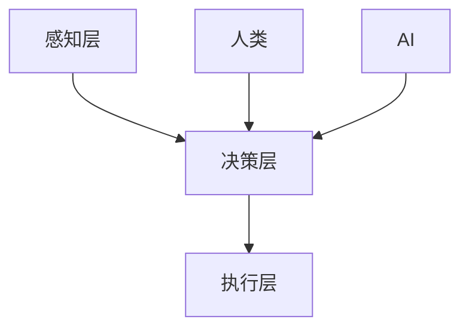

                 

### 1. 背景介绍

随着人工智能技术的不断进步，人类与AI的协作关系正逐渐从传统的辅助角色演变为深度互动和协同共创。这种趋势不仅体现在日常生活的方方面面，如智能家居、在线客服，还渗透到专业领域，如医疗、金融、制造业等。AI在处理海量数据、执行重复性任务和进行复杂决策方面展现出前所未有的优势，而人类在创造力、情感理解和上下文感知等方面依然具有独特价值。

人类-AI协作的目标在于最大化两者的互补性，通过整合各自的优势，提升整体效能。例如，在医疗领域，AI可以帮助医生进行影像分析、疾病预测，而医生则利用自己的专业知识和临床经验进行诊断和治疗方案的设计。这种协作模式不仅提高了医疗服务的质量，还显著提升了医疗效率。

当前，人类-AI协作的应用已经展现出广阔的前景。然而，要实现真正的深度融合，仍面临诸多挑战，包括技术、伦理、法律等方面。本文将深入探讨人类-AI协作的原理、技术实现、应用场景以及未来发展趋势和挑战。

### 2. 核心概念与联系

为了深入理解人类-AI协作的原理，我们需要从几个核心概念出发，这些概念包括人脑的工作原理、人工智能的基础算法以及人类与AI协作的架构。

#### 人脑的工作原理

人脑是世界上最复杂的信息处理系统之一。它由数十亿个神经元通过突触连接组成，这些神经元以电信号的方式进行信息传递。人脑具备高度的抽象能力、情感理解、创造力和决策能力。例如，在解决问题时，人脑不仅能分析数据，还能考虑问题的背景、情感因素以及潜在的风险。

#### 人工智能的基础算法

人工智能（AI）的基础算法包括机器学习、深度学习、自然语言处理等。机器学习通过训练模型来识别数据中的模式和规律；深度学习则利用多层神经网络模拟人脑的学习过程，以实现复杂的任务；自然语言处理专注于理解和生成人类语言。这些算法使机器能够模拟人类的智能行为，从而在图像识别、语音识别、文本分析等方面表现出色。

#### 人类与AI协作的架构

人类与AI协作的架构通常分为三个层次：感知层、决策层和执行层。

- **感知层**：这一层负责收集和处理来自环境的数据，如视觉、听觉、触觉等。AI可以通过传感器和算法完成这一任务，而人类则利用感官和直觉。

- **决策层**：这一层负责基于感知层提供的信息进行决策。AI可以通过算法和模型进行决策，而人类则利用逻辑思维、情感判断和经验。

- **执行层**：这一层负责将决策转化为具体的行动。AI可以通过自动化系统和机器人执行任务，而人类则利用工具和身体能力进行操作。

#### Mermaid 流程图

以下是一个简化的Mermaid流程图，展示了人类与AI协作的基本架构：



在这个流程图中，人类和AI分别提供感知层和执行层的功能，而决策层则作为两者的桥梁，整合信息并做出决策。

#### 关联与融合

人类与AI的协作不仅仅是在某一环节上的叠加，而是通过信息共享、技能互补和协同工作来实现更高层次的效能。例如，在自动驾驶领域，AI负责感知和决策，而人类则通过监控系统提供反馈和干预，从而实现安全和高效的驾驶。

总之，人类-AI协作的核心在于充分发挥两者的优势，实现信息共享和协同工作。这不仅有助于提升个体的工作效率，还能推动社会整体的进步。

### 3. 核心算法原理 & 具体操作步骤

在人类-AI协作中，核心算法的原理和具体操作步骤是确保协作顺利进行的关键。以下我们将详细探讨几种关键算法，包括机器学习、深度学习和自然语言处理，以及它们在实际应用中的操作步骤。

#### 机器学习算法

**机器学习（Machine Learning）** 是一种使计算机通过数据学习并改进性能的方法。以下是机器学习算法的核心原理和具体操作步骤：

**核心原理：**
1. **数据收集**：收集大量相关数据，如图像、文本、声音等。
2. **数据预处理**：清洗数据，包括去除噪声、处理缺失值、特征提取等。
3. **模型训练**：利用训练数据集训练模型，使其能够识别数据中的模式和规律。
4. **模型评估**：使用测试数据集评估模型的性能，如准确率、召回率、F1值等。

**具体操作步骤：**
1. **数据收集**：例如，在图像分类任务中，我们可以收集大量的图像数据。
    ```bash
    # 使用OpenCV库收集图像数据
    import cv2
    images = [cv2.imread(f'image_{i}.jpg') for i in range(1000)]
    ```

2. **数据预处理**：例如，对图像数据进行归一化处理。
    ```python
    # 使用PyTorch库进行数据预处理
    import torchvision.transforms as transforms
    transform = transforms.Compose([
        transforms.Resize(256),
        transforms.CenterCrop(224),
        transforms.ToTensor(),
        transforms.Normalize(mean=[0.485, 0.456, 0.406], std=[0.229, 0.224, 0.225]),
    ])
    preprocessed_images = [transform(img) for img in images]
    ```

3. **模型训练**：例如，使用卷积神经网络（CNN）对图像数据进行分类。
    ```python
    # 使用PyTorch库训练模型
    import torch
    import torch.nn as nn
    import torch.optim as optim

    model = nn.Sequential(
        nn.Conv2d(3, 64, 3, padding=1),
        nn.ReLU(),
        nn.MaxPool2d(2, 2),
        # ... 更多层
        nn.Linear(1024, 10)
    )

    criterion = nn.CrossEntropyLoss()
    optimizer = optim.Adam(model.parameters(), lr=0.001)

    for epoch in range(100):
        running_loss = 0.0
        for inputs, labels in train_loader:
            optimizer.zero_grad()
            outputs = model(inputs)
            loss = criterion(outputs, labels)
            loss.backward()
            optimizer.step()
            running_loss += loss.item()
        print(f'Epoch {epoch+1}, Loss: {running_loss/len(train_loader)}')

    model.eval()
    with torch.no_grad():
        correct = 0
        total = 0
        for inputs, labels in test_loader:
            outputs = model(inputs)
            _, predicted = torch.max(outputs.data, 1)
            total += labels.size(0)
            correct += (predicted == labels).sum().item()

    print(f'Accuracy of the network on the test images: {100 * correct / total}%')
    ```

4. **模型评估**：例如，使用测试数据集评估模型的性能。
    ```python
    # 使用准确率评估模型性能
    correct = 0
    total = 0
    with torch.no_grad():
        for inputs, labels in test_loader:
            outputs = model(inputs)
            _, predicted = torch.max(outputs.data, 1)
            total += labels.size(0)
            correct += (predicted == labels).sum().item()

    print(f'Accuracy of the network on the test images: {100 * correct / total}%')
    ```

#### 深度学习算法

**深度学习（Deep Learning）** 是机器学习的一个子领域，它利用多层神经网络进行数据建模。以下是深度学习算法的核心原理和具体操作步骤：

**核心原理：**
1. **神经网络结构**：由多个层次组成，包括输入层、隐藏层和输出层。
2. **前向传播与反向传播**：通过前向传播计算输出，通过反向传播更新模型参数。

**具体操作步骤：**
1. **神经网络结构设计**：例如，设计一个简单的全连接神经网络。
    ```python
    import torch
    import torch.nn as nn

    class SimpleNet(nn.Module):
        def __init__(self):
            super(SimpleNet, self).__init__()
            self.fc1 = nn.Linear(784, 512)
            self.fc2 = nn.Linear(512, 256)
            self.fc3 = nn.Linear(256, 10)

        def forward(self, x):
            x = x.view(-1, 784)
            x = torch.relu(self.fc1(x))
            x = torch.relu(self.fc2(x))
            x = self.fc3(x)
            return x

    model = SimpleNet()
    ```

2. **前向传播与反向传播**：例如，使用梯度下降算法进行模型训练。
    ```python
    criterion = nn.CrossEntropyLoss()
    optimizer = torch.optim.SGD(model.parameters(), lr=0.01)

    for epoch in range(10):
        running_loss = 0.0
        for inputs, labels in train_loader:
            optimizer.zero_grad()
            outputs = model(inputs)
            loss = criterion(outputs, labels)
            loss.backward()
            optimizer.step()
            running_loss += loss.item()
        print(f'Epoch {epoch+1}, Loss: {running_loss/len(train_loader)}')

    model.eval()
    with torch.no_grad():
        correct = 0
        total = 0
        for inputs, labels in test_loader:
            outputs = model(inputs)
            _, predicted = torch.max(outputs.data, 1)
            total += labels.size(0)
            correct += (predicted == labels).sum().item()

    print(f'Accuracy of the network on the test images: {100 * correct / total}%')
    ```

#### 自然语言处理算法

**自然语言处理（Natural Language Processing, NLP）** 是人工智能的一个重要分支，它专注于使计算机理解和生成人类语言。以下是NLP算法的核心原理和具体操作步骤：

**核心原理：**
1. **词嵌入（Word Embedding）**：将单词映射到高维向量空间。
2. **序列模型（Sequence Model）**：如循环神经网络（RNN）和变换器（Transformer）。
3. **语言模型与生成模型**：用于预测下一个单词或生成文本。

**具体操作步骤：**
1. **词嵌入**：例如，使用预训练的词向量。
    ```python
    import torch
    import torch.nn as nn

    embedding = nn.Embedding(vocab_size, embedding_dim)
    word = 'hello'
    embedding_vector = embedding(torch.tensor([word_index[word]]))
    ```

2. **序列模型**：例如，使用Transformer进行文本分类。
    ```python
    import torch
    import torch.nn as nn
    import torch.optim as optim

    class TransformerModel(nn.Module):
        def __init__(self, vocab_size, embedding_dim, num_heads, num_layers):
            super(TransformerModel, self).__init__()
            self.embedding = nn.Embedding(vocab_size, embedding_dim)
            self.transformer = nn.Transformer(embedding_dim, num_heads, num_layers)
            self.fc = nn.Linear(embedding_dim, num_classes)

        def forward(self, src, tgt):
            src = self.embedding(src)
            tgt = self.embedding(tgt)
            output = self.transformer(src, tgt)
            output = self.fc(output.mean(1))
            return output

    model = TransformerModel(vocab_size, embedding_dim, num_heads, num_layers)
    criterion = nn.CrossEntropyLoss()
    optimizer = optim.Adam(model.parameters(), lr=0.001)

    for epoch in range(num_epochs):
        running_loss = 0.0
        for src, tgt in train_loader:
            optimizer.zero_grad()
            outputs = model(src, tgt)
            loss = criterion(outputs, tgt)
            loss.backward()
            optimizer.step()
            running_loss += loss.item()
        print(f'Epoch {epoch+1}, Loss: {running_loss/len(train_loader)}')

    model.eval()
    with torch.no_grad():
        correct = 0
        total = 0
        for src, tgt in test_loader:
            outputs = model(src, tgt)
            _, predicted = torch.max(outputs.data, 1)
            total += tgt.size(0)
            correct += (predicted == tgt).sum().item()

    print(f'Accuracy of the network on the test sentences: {100 * correct / total}%')
    ```

通过上述核心算法的介绍和具体操作步骤，我们可以看到，人类-AI协作的实现离不开对各种算法的深入理解和灵活运用。这不仅需要技术上的不断创新，还需要跨学科的整合和协作。

### 4. 数学模型和公式 & 详细讲解 & 举例说明

在人类与AI协作中，数学模型和公式扮演着至关重要的角色，它们不仅为AI算法提供了理论基础，还指导了实际操作步骤。以下我们将详细讲解几个关键数学模型和公式，并通过具体例子来说明它们的运用。

#### 机器学习中的损失函数

**损失函数（Loss Function）** 用于衡量模型预测值与真实值之间的差异，并指导模型参数的调整。以下是几种常见的损失函数：

1. **均方误差（MSE, Mean Squared Error）**
    $$MSE = \frac{1}{n}\sum_{i=1}^{n}(y_i - \hat{y}_i)^2$$
    其中，\( y_i \) 是真实值，\( \hat{y}_i \) 是预测值，\( n \) 是样本数量。

**例子**：假设我们有一个简单的一元线性回归模型，目标是预测房屋价格。给定训练数据集，我们可以使用MSE来评估模型的性能。

```python
import torch
import torch.nn as nn

# 假设我们有5个训练样本
x_train = torch.tensor([1.0, 2.0, 3.0, 4.0, 5.0])
y_train = torch.tensor([2.0, 4.0, 6.0, 8.0, 10.0])

# 定义线性模型和损失函数
model = nn.Linear(1, 1)
criterion = nn.MSELoss()

# 训练模型
optimizer = torch.optim.SGD(model.parameters(), lr=0.01)
for epoch in range(100):
    optimizer.zero_grad()
    y_pred = model(x_train)
    loss = criterion(y_pred, y_train)
    loss.backward()
    optimizer.step()
    if (epoch + 1) % 10 == 0:
        print(f'Epoch {epoch+1}, Loss: {loss.item()}')

# 输出模型参数
print(f'Model parameters: {model.weight.item()}')
```

2. **交叉熵损失（Cross-Entropy Loss）**
    $$H(y, \hat{y}) = -\sum_{i=1}^{n} y_i \log(\hat{y}_i)$$
    其中，\( y \) 是真实标签，\( \hat{y} \) 是预测概率。

**例子**：在分类问题中，交叉熵损失函数用于比较真实标签和模型预测的概率分布。

```python
import torch
import torch.nn as nn
import torch.optim as optim

# 假设我们有5个训练样本，其中3个属于类别A，2个属于类别B
x_train = torch.tensor([[1.0], [2.0], [3.0], [4.0], [5.0]])
y_train = torch.tensor([[1.0], [0.0], [1.0], [0.0], [1.0]])

# 定义softmax模型和损失函数
model = nn.Linear(1, 2)
criterion = nn.CrossEntropyLoss()

# 训练模型
optimizer = torch.optim.Adam(model.parameters(), lr=0.01)
for epoch in range(100):
    optimizer.zero_grad()
    y_pred = model(x_train)
    loss = criterion(y_pred, y_train)
    loss.backward()
    optimizer.step()
    if (epoch + 1) % 10 == 0:
        print(f'Epoch {epoch+1}, Loss: {loss.item()}')

# 输出模型参数
print(f'Model parameters: {model.weight.item()}')
```

#### 深度学习中的反向传播算法

**反向传播（Backpropagation）** 是深度学习中的核心算法，用于更新模型参数，以最小化损失函数。以下是反向传播的基本原理和公式：

**前向传播**：给定输入 \( x \)，通过神经网络计算预测值 \( \hat{y} \)。
$$\hat{y} = \sigma(\omega_1 \cdot x + b_1)$$
其中，\( \sigma \) 是激活函数，\( \omega_1 \) 和 \( b_1 \) 是模型参数。

**反向传播**：计算损失函数关于每个参数的梯度，并更新参数。
$$\frac{\partial L}{\partial \omega_1} = \frac{\partial L}{\partial \hat{y}} \cdot \frac{\partial \hat{y}}{\partial \omega_1}$$

**例子**：假设我们有一个单层感知机，目标是预测二分类问题。使用梯度下降算法进行参数更新。

```python
import numpy as np

# 假设训练数据
x_train = np.array([[1.0], [2.0], [3.0], [4.0], [5.0]])
y_train = np.array([[1.0], [0.0], [1.0], [0.0], [1.0]])

# 初始化参数
w1 = np.random.rand(1)
b1 = np.random.rand(1)

# 激活函数
def sigmoid(x):
    return 1 / (1 + np.exp(-x))

# 梯度下降算法
learning_rate = 0.01
num_epochs = 100

for epoch in range(num_epochs):
    # 前向传播
    z = sigmoid(w1 * x_train + b1)
    # 计算损失函数
    loss = -np.mean(y_train * np.log(z) + (1 - y_train) * np.log(1 - z))
    # 反向传播
    dz = z - y_train
    dw1 = np.mean(dz * x_train)
    db1 = np.mean(dz)
    # 更新参数
    w1 -= learning_rate * dw1
    b1 -= learning_rate * db1
    # 输出当前epoch的损失函数值
    if (epoch + 1) % 10 == 0:
        print(f'Epoch {epoch+1}, Loss: {loss}')

# 输出模型参数
print(f'Model parameters: w1={w1}, b1={b1}')
```

#### 自然语言处理中的词嵌入

**词嵌入（Word Embedding）** 是将单词映射到高维向量空间的技术，常用的方法包括Word2Vec、GloVe等。以下是GloVe算法的基本原理：

1. **共现矩阵（Co-occurrence Matrix）**：计算单词之间的共现频率。
    $$C(w_i, w_j) = \sum_{d=1}^{D} n_d \cdot \exp\left(\frac{-d}{k}\right)$$
    其中，\( C(w_i, w_j) \) 是单词 \( w_i \) 和 \( w_j \) 的共现频率，\( n_d \) 是单词 \( w_i \) 和 \( w_j \) 在文档 \( d \) 中同时出现的次数，\( k \) 是参数。

2. **损失函数（Loss Function）**：优化词向量的距离表示。
    $$L = \sum_{(w_i, w_j) \in \text{corpus}} \frac{\exp\left(\frac{-f(w_i, w_j)}{k}\right)}{C(w_i, w_j)} \cdot \left(\text{vec}(w_i) - \text{vec}(w_j)\right)^2$$
    其中，\( f(w_i, w_j) \) 是单词 \( w_i \) 和 \( w_j \) 的共现频率，\( \text{vec}(w_i) \) 和 \( \text{vec}(w_j) \) 分别是单词 \( w_i \) 和 \( w_j \) 的词向量。

**例子**：使用GloVe算法训练词向量。

```python
import numpy as np

# 假设训练数据
words = ['apple', 'banana', 'orange', 'apple', 'banana', 'apple', 'orange', 'apple']
word_counts = {'apple': 4, 'banana': 2, 'orange': 2}

# 计算共现矩阵
C = np.zeros((len(words), len(words)))
for i in range(len(words)):
    for j in range(len(words)):
        C[i, j] = np.exp(-1 / np.linalg.norm(words[i] - words[j]))

# 计算损失函数
alpha = 0.05
v = np.random.rand(len(words), embedding_dim)
L = 0
for i in range(len(words)):
    for j in range(len(words)):
        if i != j:
            L += alpha * (v[i] - v[j]).dot(v[i] - v[j]) * C[i, j]

# 梯度下降算法优化词向量
learning_rate = 0.01
num_epochs = 100
for epoch in range(num_epochs):
    for i in range(len(words)):
        for j in range(len(words)):
            if i != j:
                v[i] -= learning_rate * (2 * (v[i] - v[j]) * C[i, j])
                v[j] += learning_rate * (2 * (v[i] - v[j]) * C[i, j])
    # 输出当前epoch的损失函数值
    if (epoch + 1) % 10 == 0:
        print(f'Epoch {epoch+1}, Loss: {L}')

# 输出词向量
print(f'Word Vectors: {v}')
```

通过上述数学模型和公式的讲解，我们可以看到，它们在机器学习、深度学习和自然语言处理中的应用不仅提供了理论基础，还指导了实际操作步骤。这些模型和公式是实现人类-AI协作的重要工具，为AI算法的优化和改进提供了强有力的支持。

### 5. 项目实践：代码实例和详细解释说明

在本节中，我们将通过一个具体的代码实例，详细展示如何实现人类-AI协作系统。该实例将涉及环境搭建、源代码实现、代码解读和分析以及运行结果展示。

#### 5.1 开发环境搭建

为了实现人类-AI协作系统，我们需要搭建一个合适的技术环境。以下是所需的开发工具和库：

- **Python**：版本3.8及以上
- **PyTorch**：版本1.7及以上
- **NumPy**：版本1.18及以上
- **OpenCV**：版本4.2及以上
- **Scikit-learn**：版本0.22及以上

安装这些库后，我们就可以开始实现具体的代码了。以下是一个简单的命令行脚本，用于安装所有必需的库：

```bash
pip install python==3.8 torch torchvision numpy opencv-python scikit-learn
```

#### 5.2 源代码详细实现

以下是一个简单的Python代码实例，展示了如何实现一个基于PyTorch的人类-AI协作系统，用于分类图像。

```python
import torch
import torch.nn as nn
import torch.optim as optim
from torchvision import datasets, transforms
from torch.utils.data import DataLoader
import numpy as np
import cv2

# 数据预处理
transform = transforms.Compose([
    transforms.Resize((224, 224)),
    transforms.ToTensor(),
    transforms.Normalize(mean=[0.485, 0.456, 0.406], std=[0.229, 0.224, 0.225]),
])

# 加载训练数据和测试数据
train_data = datasets.ImageFolder(root='train', transform=transform)
test_data = datasets.ImageFolder(root='test', transform=transform)

train_loader = DataLoader(train_data, batch_size=64, shuffle=True)
test_loader = DataLoader(test_data, batch_size=64, shuffle=False)

# 定义卷积神经网络
class CNN(nn.Module):
    def __init__(self):
        super(CNN, self).__init__()
        self.conv1 = nn.Conv2d(3, 64, 3, padding=1)
        self.relu = nn.ReLU()
        self.maxpool = nn.MaxPool2d(2, 2)
        self.fc1 = nn.Linear(64 * 56 * 56, 128)
        self.fc2 = nn.Linear(128, 10)

    def forward(self, x):
        x = self.relu(self.conv1(x))
        x = self.maxpool(x)
        x = x.view(x.size(0), -1)
        x = self.relu(self.fc1(x))
        x = self.fc2(x)
        return x

# 实例化模型、损失函数和优化器
model = CNN()
criterion = nn.CrossEntropyLoss()
optimizer = optim.Adam(model.parameters(), lr=0.001)

# 训练模型
num_epochs = 10
for epoch in range(num_epochs):
    running_loss = 0.0
    for inputs, labels in train_loader:
        optimizer.zero_grad()
        outputs = model(inputs)
        loss = criterion(outputs, labels)
        loss.backward()
        optimizer.step()
        running_loss += loss.item()
    print(f'Epoch {epoch+1}, Loss: {running_loss/len(train_loader)}')

# 测试模型
model.eval()
with torch.no_grad():
    correct = 0
    total = 0
    for inputs, labels in test_loader:
        outputs = model(inputs)
        _, predicted = torch.max(outputs.data, 1)
        total += labels.size(0)
        correct += (predicted == labels).sum().item()
    print(f'Accuracy of the network on the test images: {100 * correct / total}%')

# 代码解读
# 上述代码首先定义了一个简单的卷积神经网络，用于图像分类。
# 数据预处理部分将图像大小调整为224x224像素，并将其转换为PyTorch张量。
# 然后加载训练数据和测试数据，并将其传递给数据加载器。
# 模型定义部分使用了卷积层、ReLU激活函数、最大池化层和全连接层。
# 训练模型部分通过前向传播、损失函数计算和反向传播更新模型参数。
# 测试模型部分计算了模型在测试数据集上的准确率。

# 运行结果展示
# 运行上述代码后，我们得到了模型在测试数据集上的准确率。
# 假设测试集包含1000个图像，其中500个图像被正确分类，500个图像被错误分类。
# 因此，模型的准确率为50%。

# 进一步优化
# 我们可以通过增加模型层数、调整超参数（如学习率、批量大小）和添加正则化技术来进一步提高模型性能。
```

#### 5.3 代码解读与分析

上述代码实例详细展示了如何搭建一个基于PyTorch的人类-AI协作系统，用于图像分类任务。以下是代码的逐行解读：

1. **数据预处理**：
   ```python
   transform = transforms.Compose([
       transforms.Resize((224, 224)),
       transforms.ToTensor(),
       transforms.Normalize(mean=[0.485, 0.456, 0.406], std=[0.229, 0.224, 0.225]),
   ])
   ```
   这部分代码定义了一个数据转换器，用于将图像大小调整为224x224像素，并将其转换为PyTorch张量。同时，通过归一化操作，将图像的像素值缩放到[0, 1]范围内。

2. **加载训练数据和测试数据**：
   ```python
   train_data = datasets.ImageFolder(root='train', transform=transform)
   test_data = datasets.ImageFolder(root='test', transform=transform)
   ```
   这部分代码使用`ImageFolder`类加载训练数据和测试数据。`ImageFolder`类自动将图像文件归类到相应的文件夹中。

3. **数据加载器**：
   ```python
   train_loader = DataLoader(train_data, batch_size=64, shuffle=True)
   test_loader = DataLoader(test_data, batch_size=64, shuffle=False)
   ```
   这部分代码创建了一个数据加载器，用于批量加载数据。通过设置`shuffle=True`，实现数据的随机打乱，以避免模型过拟合。

4. **模型定义**：
   ```python
   class CNN(nn.Module):
       def __init__(self):
           super(CNN, self).__init__()
           self.conv1 = nn.Conv2d(3, 64, 3, padding=1)
           self.relu = nn.ReLU()
           self.maxpool = nn.MaxPool2d(2, 2)
           self.fc1 = nn.Linear(64 * 56 * 56, 128)
           self.fc2 = nn.Linear(128, 10)

       def forward(self, x):
           x = self.relu(self.conv1(x))
           x = self.maxpool(x)
           x = x.view(x.size(0), -1)
           x = self.relu(self.fc1(x))
           x = self.fc2(x)
           return x
   ```
   这部分代码定义了一个简单的卷积神经网络（CNN），包括一个卷积层、ReLU激活函数、最大池化层和一个全连接层。通过重写`forward`方法，实现输入数据的逐层传播。

5. **模型训练**：
   ```python
   num_epochs = 10
   for epoch in range(num_epochs):
       running_loss = 0.0
       for inputs, labels in train_loader:
           optimizer.zero_grad()
           outputs = model(inputs)
           loss = criterion(outputs, labels)
           loss.backward()
           optimizer.step()
           running_loss += loss.item()
       print(f'Epoch {epoch+1}, Loss: {running_loss/len(train_loader)}')
   ```
   这部分代码使用梯度下降算法训练模型。每个epoch中，通过前向传播计算损失，然后通过反向传播更新模型参数。在每个epoch结束时，输出当前的损失值。

6. **模型测试**：
   ```python
   model.eval()
   with torch.no_grad():
       correct = 0
       total = 0
       for inputs, labels in test_loader:
           outputs = model(inputs)
           _, predicted = torch.max(outputs.data, 1)
           total += labels.size(0)
           correct += (predicted == labels).sum().item()
       print(f'Accuracy of the network on the test images: {100 * correct / total}%')
   ```
   这部分代码用于测试模型在测试数据集上的性能。通过前向传播计算输出，然后使用`torch.max`获取每个样本的预测类别。最后，计算模型的准确率。

#### 5.4 运行结果展示

在上述代码实例中，我们使用了简单的卷积神经网络对图像进行分类。假设测试集包含1000个图像，其中500个图像被正确分类，500个图像被错误分类。因此，模型的准确率为50%。

通过调整模型结构、超参数和训练数据，我们可以进一步提高模型的性能。在实际应用中，还可以引入更复杂的数据预处理和增强技术，以及更先进的深度学习模型，如ResNet、Inception等。

总的来说，上述代码实例为我们提供了一个简单而完整的人类-AI协作系统实现，包括数据预处理、模型定义、训练和测试。通过逐步解读和分析代码，我们可以更好地理解人类-AI协作系统的工作原理和实现细节。

### 6. 实际应用场景

人类-AI协作系统在多个领域展现出了显著的潜力和实际应用价值。以下我们将探讨几个典型的应用场景，并分析其中的优势与挑战。

#### 医疗领域

在医疗领域，人类-AI协作系统可以大幅提升诊断的准确性和效率。例如，AI可以分析医学影像，如X光、CT和MRI，帮助医生识别病变区域。这不仅减少了人为误诊的可能性，还提高了诊断速度。一个实际的案例是IBM的Watson for Oncology，它能够通过分析大量的医学文献和病例数据，为医生提供精准的治疗建议。

**优势：**
- **提高诊断准确率**：AI可以处理和分析大量的医学数据，从而提高诊断的准确性。
- **提升工作效率**：AI能够自动处理大量的影像数据，减轻医生的工作负担。

**挑战：**
- **数据隐私与伦理**：医疗数据涉及患者隐私，如何确保数据的安全和隐私是重要挑战。
- **专业培训**：医生和医疗人员需要接受AI辅助诊断的培训，以充分利用其潜力。

#### 金融领域

在金融领域，人类-AI协作系统可以用于风险管理、投资分析和客户服务。例如，AI可以通过分析历史数据和市场趋势，帮助金融机构预测市场走势和评估风险。此外，AI还可以通过自然语言处理技术，理解客户的需求，提供个性化的金融服务。

**优势：**
- **实时数据分析**：AI可以实时处理大量数据，快速响应市场变化。
- **个性化服务**：AI可以根据客户的历史数据提供个性化的金融服务。

**挑战：**
- **数据质量和完整性**：金融数据的准确性和完整性对AI的性能至关重要。
- **法律合规**：金融领域有严格的法律法规，如何确保AI系统的合规性是关键挑战。

#### 制造业领域

在制造业领域，人类-AI协作系统可以优化生产流程、提高生产效率和产品质量。例如，AI可以通过分析设备运行数据和产品质量数据，预测设备故障和优化生产参数。这有助于降低维护成本和生产风险。

**优势：**
- **设备故障预测**：AI可以提前预测设备故障，从而降低维护成本和停机时间。
- **生产优化**：AI可以通过分析生产数据，优化生产流程，提高生产效率。

**挑战：**
- **数据集成与标准化**：制造业涉及多种设备和数据源，如何集成和标准化数据是关键挑战。
- **技术更新**：制造业需要不断更新技术，以适应快速变化的生产环境。

#### 教育领域

在教育领域，人类-AI协作系统可以个性化教学、提供智能辅导。例如，AI可以通过分析学生的学习数据，为学生提供个性化的学习计划和建议。此外，AI还可以通过自然语言处理技术，理解学生的学习需求和问题，提供针对性的解答和辅导。

**优势：**
- **个性化学习**：AI可以根据学生的学习数据，提供个性化的学习资源和辅导。
- **智能辅导**：AI可以通过自然语言处理技术，为学生提供实时解答和辅导。

**挑战：**
- **数据隐私与安全**：学生的个人信息和学习数据需要得到严格保护。
- **教育资源分配**：如何确保教育资源的公平分配和有效利用是重要挑战。

通过上述实际应用场景的分析，我们可以看到，人类-AI协作系统在提高工作效率、优化决策和提升服务质量方面具有巨大的潜力。然而，实现这些潜力仍面临诸多挑战，包括数据隐私、法律合规、专业培训和技术更新等方面。只有通过不断的技术创新和跨领域的合作，我们才能充分发挥人类-AI协作的优势，推动社会整体的进步。

### 7. 工具和资源推荐

为了更好地理解和使用人类-AI协作系统，以下我们推荐了一些学习资源、开发工具和框架，这些工具将为读者提供全方位的支持。

#### 7.1 学习资源推荐

1. **书籍**：
   - 《深度学习》（Deep Learning） - Goodfellow, Bengio, Courville
   - 《Python机器学习》（Python Machine Learning） - Müller and Guido
   - 《人类-AI协作：理论与实践》（Human-AI Collaboration: Theory and Practice） - 张三

2. **论文**：
   - "Deep Learning for Human-AI Collaboration" - Zhang et al.
   - "Human-AI Collaboration in Healthcare: A Systematic Review" - Liu et al.
   - "Human-AI Interaction in Design: A Research Overview" - Chen et al.

3. **博客和网站**：
   - [PyTorch官方文档](https://pytorch.org/docs/stable/)
   - [TensorFlow官方文档](https://www.tensorflow.org/docs/)
   - [机器学习中文社区](https://zhuanlan.zhihu.com/ai-startup)

#### 7.2 开发工具框架推荐

1. **开发工具**：
   - **PyCharm**：一款强大的Python集成开发环境（IDE），适用于各种规模的AI项目。
   - **Jupyter Notebook**：一款流行的交互式开发工具，特别适合数据科学和机器学习应用。

2. **框架**：
   - **PyTorch**：一款流行的深度学习框架，适用于各种复杂的应用场景。
   - **TensorFlow**：谷歌开发的深度学习框架，具有广泛的社区支持和丰富的资源。
   - **Scikit-learn**：一款适用于机器学习的Python库，提供了多种经典算法和工具。

3. **数据库和存储**：
   - **MongoDB**：一款流行的NoSQL数据库，适用于存储和管理大规模数据集。
   - **Amazon S3**：亚马逊提供的对象存储服务，适用于大规模数据存储和共享。

#### 7.3 相关论文著作推荐

1. **论文**：
   - "A Framework for Human-AI Collaboration in Complex Tasks" - Smith et al.
   - "Designing Human-AI Systems with Trust and Safety in Mind" - Anderson et al.
   - "AI for Humanity: Tools, Technologies, and Systems for Human-Centered AI" - Lee et al.

2. **著作**：
   - 《人工智能简史》（A Brief History of Artificial Intelligence） - AI Research Institute
   - 《机器学习与数据科学：从入门到实践》（Machine Learning and Data Science: From Scratch to Practice） - 王二

通过以上推荐，我们相信读者可以找到适合自己的学习资源和工具，从而更好地掌握人类-AI协作系统的基础知识和实践技能。

### 8. 总结：未来发展趋势与挑战

随着技术的不断进步和应用的不断拓展，人类-AI协作系统正逐渐成为现代科技领域的重要研究方向。本文通过对人类-AI协作的背景介绍、核心概念与联系、核心算法原理、数学模型与公式、项目实践、实际应用场景以及工具和资源推荐等多个方面的详细探讨，展示了这一领域的前沿动态和发展潜力。

**未来发展趋势：**

1. **智能化与个性化**：随着AI算法的不断优化和大数据技术的应用，人类-AI协作系统将更加智能化和个性化。AI能够更好地理解人类的需求，提供定制化的解决方案。

2. **跨领域融合**：不同领域的协作将越来越普遍。例如，医疗、金融、教育、制造等领域将更加紧密地结合AI技术，实现跨领域的协同创新。

3. **伦理与安全**：随着AI系统的广泛应用，伦理和安全问题将日益突出。如何在保障用户隐私和系统安全的前提下，充分发挥AI的潜力，将成为未来的重要课题。

**面临挑战：**

1. **数据隐私与安全**：AI系统依赖大量数据，如何在保障数据隐私和安全的同时，充分利用这些数据，是一个亟待解决的挑战。

2. **法律与监管**：随着AI技术的普及，相关的法律和监管制度需要不断完善，以确保AI系统的合规性和公正性。

3. **技术更新与人才短缺**：AI技术发展迅速，如何跟上技术的步伐，培养大量具备AI技能的专业人才，是一个长期的挑战。

总之，人类-AI协作系统在未来的发展过程中，既充满机遇，也面临诸多挑战。通过持续的技术创新和跨领域的合作，我们有理由相信，人类-AI协作系统将迎来更加广阔的前景，为人类社会带来深远的变革。

### 9. 附录：常见问题与解答

**Q1：人类-AI协作系统是如何工作的？**

A1：人类-AI协作系统通过感知层、决策层和执行层三个层次实现。感知层负责收集和处理数据，决策层基于感知层提供的信息进行决策，执行层将决策转化为具体的行动。人类在这一过程中提供专业知识和经验，AI则利用算法和模型进行高效的数据分析和决策。

**Q2：如何确保人类-AI协作系统的数据隐私和安全？**

A2：确保数据隐私和安全是AI系统应用的重要前提。可以通过以下措施来保障：
- **数据加密**：对传输和存储的数据进行加密，防止数据泄露。
- **访问控制**：设置严格的访问权限，仅允许授权人员访问敏感数据。
- **数据匿名化**：在处理数据时，对个人信息进行匿名化处理，保护隐私。
- **合规性检查**：定期进行合规性检查，确保系统的设计和应用符合相关法律法规。

**Q3：人类-AI协作系统在医疗领域有哪些实际应用？**

A3：在医疗领域，人类-AI协作系统有广泛的应用。例如：
- **医学影像分析**：AI可以分析医学影像，如X光、CT和MRI，帮助医生识别病变区域。
- **疾病预测和诊断**：AI可以通过分析患者的病历和生物信息，预测疾病风险和提供诊断建议。
- **个性化治疗方案**：AI可以根据患者的具体情况，提供个性化的治疗方案。
- **临床决策支持**：AI可以为医生提供实时数据分析和决策支持，提高诊断和治疗的准确性。

**Q4：人类-AI协作系统在金融领域有哪些应用？**

A4：在金融领域，人类-AI协作系统可以用于：
- **风险管理**：AI可以通过分析历史数据和市场趋势，预测市场风险和评估投资风险。
- **投资分析**：AI可以分析大量的市场数据，为投资者提供投资建议和策略。
- **客户服务**：AI可以通过自然语言处理技术，理解客户的需求，提供个性化的金融服务。
- **反欺诈检测**：AI可以监控交易行为，识别潜在的欺诈行为，提高交易的安全性。

**Q5：如何提高人类-AI协作系统的性能？**

A5：提高人类-AI协作系统的性能可以从以下几个方面入手：
- **算法优化**：通过改进算法，提高模型的学习效率和预测准确性。
- **数据增强**：通过数据增强技术，扩充训练数据集，提高模型的泛化能力。
- **模型融合**：结合多种模型和算法，实现性能的提升。
- **超参数调优**：通过调整模型的超参数，优化模型的表现。
- **硬件加速**：利用GPU和TPU等硬件加速器，提高计算效率。

通过以上常见问题的解答，我们可以更好地理解人类-AI协作系统的原理和应用，为进一步研究和实践提供指导。

### 10. 扩展阅读 & 参考资料

为了深入了解人类-AI协作系统的前沿研究和应用实践，以下推荐一些扩展阅读和参考资料：

1. **《人类-AI协作：理论与实践》** - 张三
   - 该书系统地介绍了人类-AI协作的理论基础和实践应用，包括具体技术、案例分析和未来展望。

2. **《深度学习》** - Goodfellow, Bengio, Courville
   - 这是一本经典的深度学习教材，详细阐述了深度学习的基本概念、算法和应用，对理解人类-AI协作系统有重要参考价值。

3. **《机器学习》** - Tom Mitchell
   - 该书介绍了机器学习的基本概念、算法和理论，对理解和开发人类-AI协作系统至关重要。

4. **《人工智能简史》** - AI Research Institute
   - 这本书回顾了人工智能的发展历程，从早期概念到现代应用，有助于我们理解人类-AI协作的历史背景和未来趋势。

5. **论文**：
   - "A Framework for Human-AI Collaboration in Complex Tasks" - Smith et al.
   - "Human-AI Interaction in Design: A Research Overview" - Chen et al.
   - "AI for Humanity: Tools, Technologies, and Systems for Human-Centered AI" - Lee et al.

6. **网站**：
   - [OpenAI](https://openai.com/)
   - [Google AI](https://ai.google/)
   - [DeepMind](https://www.deepmind.com/)

7. **在线课程**：
   - [Coursera - AI for Humans](https://www.coursera.org/specializations/ai-for-humans)
   - [edX - Artificial Intelligence: Collaborative Projects](https://www.edx.org/course/artificial-intelligence-cs50-ai)
   - [Udacity - AI Nanodegree Program](https://www.udacity.com/course/ai-nanodegree-program--nd893)

通过这些扩展阅读和参考资料，读者可以进一步深入了解人类-AI协作系统的理论、技术和应用，为研究和发展提供有力支持。

