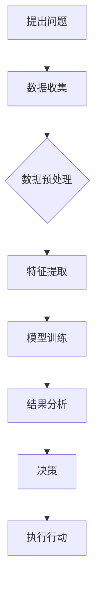

                 

关键词：人类-AI协作，人工智能，潜能，融合，发展趋势，挑战，计算机编程

> 摘要：本文从人类-AI协作的角度出发，探讨了人工智能如何增强人类的潜能，以及两者融合的发展趋势和面临的挑战。文章通过详细的案例分析和实践项目，阐述了AI技术在各个领域的应用现状和未来发展方向，为读者提供了一个全面而深入的了解。

## 1. 背景介绍

随着人工智能技术的飞速发展，人类的生活和工作方式正在发生翻天覆地的变化。AI不仅改变了传统的制造业和服务业，还在医疗、金融、教育等领域带来了深刻的变革。然而，AI技术的应用并不仅限于提高效率和质量，更重要的是，它能够增强人类的潜能，实现人类与机器的协同工作。

人类-AI协作的核心在于将人类的创造力和AI的计算能力相结合，通过数据驱动和算法优化，实现更智能、更高效的决策和行动。这种协作模式不仅能够提高个体的工作效率，还能够促进人类整体的发展和进步。

在当前的技术环境下，人类-AI协作已经从理论研究走向了实际应用。例如，自动驾驶技术正在逐步改变人们的出行方式，智能客服系统正在提升客户服务的质量，而医疗AI则正在为病人提供更加精准的诊断和治疗。

然而，尽管人类-AI协作展现出了巨大的潜力，同时也面临着一系列的挑战。这些挑战不仅涉及技术层面，还包括伦理、法律和社会层面。如何平衡AI的发展与人类的利益，如何在保证技术进步的同时保障人类的基本权利，这些都是我们需要深入探讨的问题。

## 2. 核心概念与联系

### 2.1 人类潜能与AI能力

在探讨人类-AI协作之前，我们需要明确两个核心概念：人类潜能和AI能力。

**人类潜能**：指人类在认知、情感、创造力等方面的潜在能力。这些能力不仅受到基因的影响，还受到环境、教育、经验等多种因素的影响。人类潜能的发挥是实现个人和社会价值的关键。

**AI能力**：指人工智能系统在数据处理、模式识别、自主决策等方面的能力。AI通过算法和数据的优化，能够快速处理大量信息，发现隐藏在数据中的规律，并做出相应的决策。

### 2.2 人类潜能与AI能力的联系

人类潜能与AI能力的联系主要体现在以下几个方面：

1. **互补性**：人类的创造力和直觉与AI的计算能力和数据处理能力形成了互补。人类能够提出创新的想法，而AI则能够将这些想法转化为具体的解决方案。

2. **协同性**：人类和AI可以共同工作，互相协作。人类可以提出问题，AI可以提供分析和建议，两者共同决策，实现最优的结果。

3. **扩展性**：AI可以帮助人类扩展认知和感知的范围。例如，通过图像识别技术，AI可以识别出人类难以察觉的细节，从而帮助医生做出更准确的诊断。

### 2.3 Mermaid 流程图

以下是一个简化的Mermaid流程图，展示了人类潜能与AI能力的融合过程：



## 3. 核心算法原理 & 具体操作步骤

### 3.1 算法原理

人类-AI协作的核心算法主要包括以下几个方面：

1. **机器学习算法**：通过训练模型，让AI具备自主学习和优化能力。
2. **深度学习算法**：利用神经网络结构，对大量数据进行处理和模式识别。
3. **自然语言处理算法**：使AI能够理解和生成自然语言，实现人机交互。
4. **计算机视觉算法**：使AI能够理解和分析图像和视频，实现视觉感知。

### 3.2 具体操作步骤

以下是人类-AI协作的具体操作步骤：

1. **问题定义**：明确协作的目标和需求，确定需要解决的问题。

2. **数据收集**：收集相关的数据，包括文本、图像、声音等。

3. **数据预处理**：对数据进行清洗、归一化等处理，使其适合算法训练。

4. **特征提取**：从原始数据中提取有用的特征，为模型训练提供输入。

5. **模型训练**：利用机器学习和深度学习算法，对特征进行训练，生成模型。

6. **模型评估**：对训练好的模型进行评估，确保其性能符合预期。

7. **结果分析**：利用模型对问题进行分析，生成决策建议。

8. **执行行动**：根据分析结果，执行相应的行动。

## 4. 数学模型和公式 & 详细讲解 & 举例说明

### 4.1 数学模型

在人类-AI协作中，常用的数学模型包括：

1. **线性回归模型**：用于预测连续值。
2. **逻辑回归模型**：用于预测概率。
3. **神经网络模型**：用于复杂的数据分析和模式识别。

### 4.2 公式

以下是几个常见的数学公式：

1. **线性回归公式**：

   $$y = w_0 + w_1x_1 + w_2x_2 + ... + w_nx_n$$

2. **逻辑回归公式**：

   $$P(y=1) = \frac{1}{1 + e^{-(w_0 + w_1x_1 + w_2x_2 + ... + w_nx_n)}}$$

3. **神经网络输出公式**：

   $$a_{j}^{(L)} = \sigma(z_{j}^{(L)})$$

   其中，$a_{j}^{(L)}$ 是神经网络第 $L$ 层第 $j$ 个节点的输出，$\sigma$ 是激活函数，$z_{j}^{(L)}$ 是第 $L$ 层第 $j$ 个节点的输入。

### 4.3 举例说明

假设我们使用线性回归模型预测房价，数据集包含房屋面积（$x$）和房价（$y$）。我们有如下数据：

| 面积（$x$） | 价格（$y$） |
| :--------: | :--------: |
|     100    |     200    |
|     150    |     300    |
|     200    |     400    |

根据线性回归模型，我们可以得到以下方程：

$$y = w_0 + w_1x$$

通过最小二乘法，我们可以计算出模型参数 $w_0$ 和 $w_1$：

$$w_1 = \frac{\sum(x_i - \bar{x})(y_i - \bar{y})}{\sum(x_i - \bar{x})^2}$$

$$w_0 = \bar{y} - w_1\bar{x}$$

假设计算得到 $w_1 = 1.5$ 和 $w_0 = -50$，那么我们可以预测任意面积下的房价。例如，如果面积是 120 平方米，那么房价预测为：

$$y = -50 + 1.5 \times 120 = 170$$

## 5. 项目实践：代码实例和详细解释说明

### 5.1 项目简介

在本项目中，我们将使用Python实现一个简单的线性回归模型，用于预测房价。该项目包含以下步骤：

1. 数据收集：收集房屋面积和房价的数据。
2. 数据预处理：对数据进行分析和清洗，提取有用的特征。
3. 模型训练：使用线性回归算法训练模型。
4. 模型评估：评估模型的性能。
5. 预测：使用模型进行房价预测。

### 5.2 代码实例

以下是一个简单的线性回归模型实现：

```python
import numpy as np
import pandas as pd
from sklearn.linear_model import LinearRegression

# 1. 数据收集
data = pd.DataFrame({
    'area': [100, 150, 200],
    'price': [200, 300, 400]
})

# 2. 数据预处理
X = data[['area']]
y = data['price']

# 3. 模型训练
model = LinearRegression()
model.fit(X, y)

# 4. 模型评估
score = model.score(X, y)
print(f"模型评分：{score}")

# 5. 预测
predicted_price = model.predict([[120]])
print(f"预测价格：{predicted_price[0]}")
```

### 5.3 详细解释说明

1. **数据收集**：我们使用 Pandas 库加载一个简单的数据集，数据集包含房屋面积和房价。

2. **数据预处理**：我们将数据分为特征（$X$）和标签（$y$）。在这个例子中，特征是房屋面积，标签是房价。

3. **模型训练**：我们使用 sklearn 库中的 LinearRegression 类来训练模型。fit 方法用于训练模型。

4. **模型评估**：我们使用 score 方法评估模型的性能。score 方法的返回值是模型的 R 方值，它表示模型对数据的拟合程度。

5. **预测**：我们使用 predict 方法对新的数据点进行预测。在这个例子中，我们预测面积为 120 平方米的房价。

## 6. 实际应用场景

### 6.1 医疗领域

在医疗领域，人类-AI协作已经取得了显著的成果。例如，AI可以帮助医生进行疾病诊断，提高诊断的准确性和效率。通过分析大量的病例数据和医学影像，AI可以识别出潜在的疾病风险，并提供诊断建议。这种协作模式不仅减轻了医生的工作负担，还为病人提供了更准确的诊断和治疗。

### 6.2 金融领域

在金融领域，AI被广泛应用于风险管理、投资决策和客户服务。通过分析市场数据和客户行为，AI可以预测市场的波动，为投资者提供投资建议。此外，智能客服系统可以根据客户的问题，自动生成回复，提高了客户服务的效率和质量。

### 6.3 教育领域

在教育领域，AI可以帮助教师进行个性化教学，根据学生的学习情况，自动调整教学内容和难度。例如，AI可以通过分析学生的学习记录，识别出学生的弱点，并提供针对性的练习和建议。这种协作模式不仅提高了教学效果，还促进了学生的全面发展。

## 7. 工具和资源推荐

### 7.1 开发工具

- **Python**：Python 是最流行的编程语言之一，适用于数据分析和机器学习。
- **TensorFlow**：TensorFlow 是一个开源的机器学习库，适用于深度学习和神经网络。
- **scikit-learn**：scikit-learn 是一个开源的机器学习库，提供了各种机器学习算法的实现。

### 7.2 教学资源

- **Coursera**：Coursera 提供了大量的机器学习和人工智能课程，适合初学者和专业人士。
- **Udacity**：Udacity 提供了针对人工智能和机器学习的专业课程和认证项目。
- **Kaggle**：Kaggle 是一个数据科学竞赛平台，提供了丰富的数据集和项目挑战。

## 8. 总结：未来发展趋势与挑战

### 8.1 未来发展趋势

1. **AI能力的进一步提升**：随着计算能力和算法的进步，AI将具备更强的自主学习和决策能力，能够处理更复杂的问题。
2. **跨学科的融合**：人类-AI协作将不仅仅局限于某个领域，而是跨越多个学科，实现跨领域的协同工作。
3. **人机协同工作**：人类和AI将更加紧密地合作，实现各自的优势互补，提高工作效率和质量。

### 8.2 面临的挑战

1. **技术挑战**：如何设计更高效、更可靠的AI系统，如何保证AI系统的安全性和稳定性，是当前面临的重要问题。
2. **伦理和法律问题**：如何确保AI的发展符合伦理和法律标准，如何保护个人隐私和数据安全，是亟待解决的问题。
3. **社会接受度**：如何让公众接受和信任AI，如何减少AI带来的失业和职业变迁带来的社会问题，是未来的挑战。

## 9. 附录：常见问题与解答

### 9.1 问题1：人类-AI协作的目的是什么？

**回答**：人类-AI协作的目的是通过将人类的创造力和直觉与AI的计算能力和数据处理能力相结合，实现更智能、更高效的决策和行动，提高个体的工作效率，促进人类整体的发展和进步。

### 9.2 问题2：AI是否会取代人类？

**回答**：AI在某些领域确实可以替代人类完成某些工作，但AI并不能完全取代人类。人类具有独特的创造力、情感和道德判断能力，这些是AI目前无法模拟的。

## 10. 扩展阅读 & 参考资料

- **书籍**：《人工智能：一种现代的方法》（作者：Stuart Russell & Peter Norvig）
- **论文**：《深度学习》（作者：Ian Goodfellow、Yoshua Bengio、Aaron Courville）
- **网站**：https://www.kdnuggets.com/（数据科学和人工智能领域的新闻和资源）
- **会议**：NeurIPS（神经信息处理系统年会）、ICML（国际机器学习会议）、KDD（知识发现和数据挖掘会议）等。

<|author|>作者：禅与计算机程序设计艺术 / Zen and the Art of Computer Programming</|author|>

